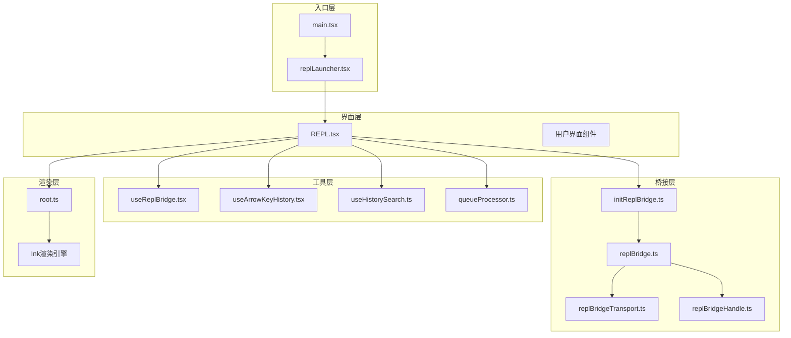
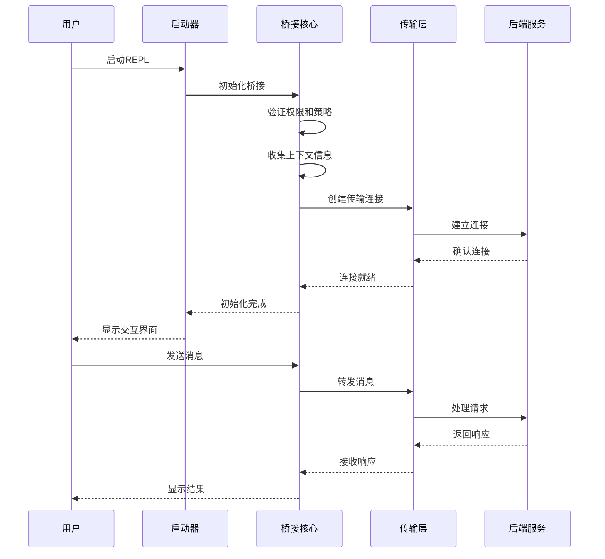
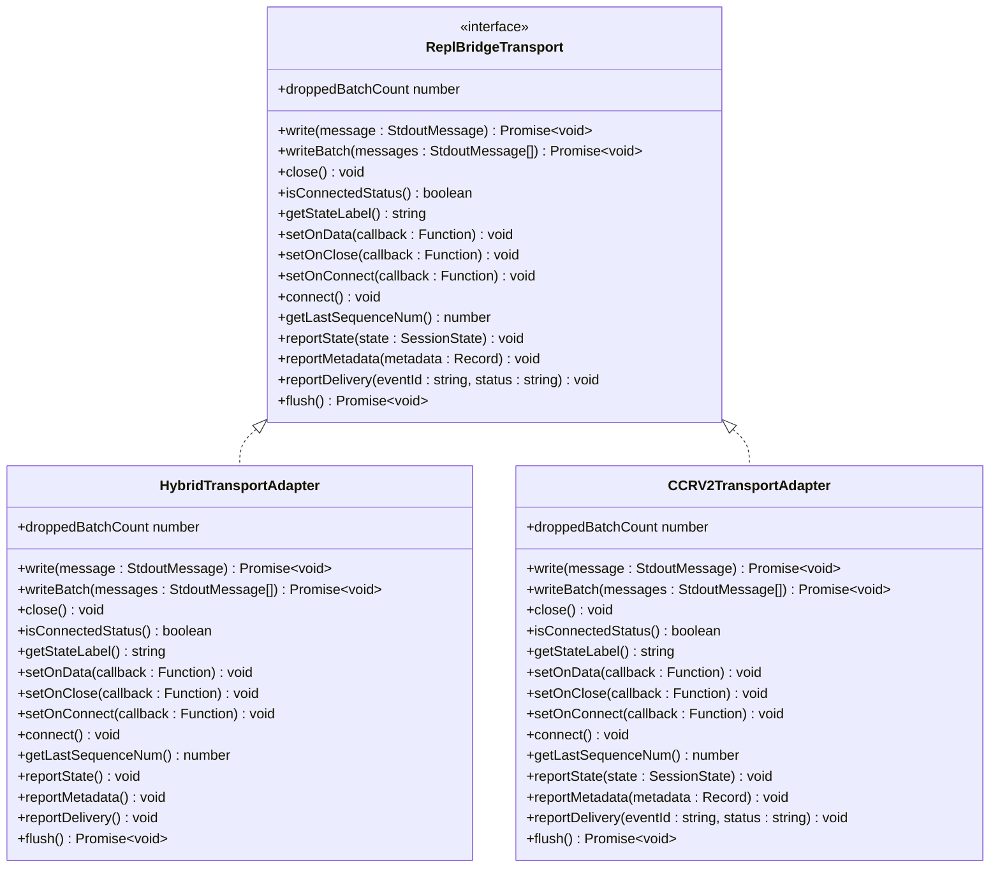
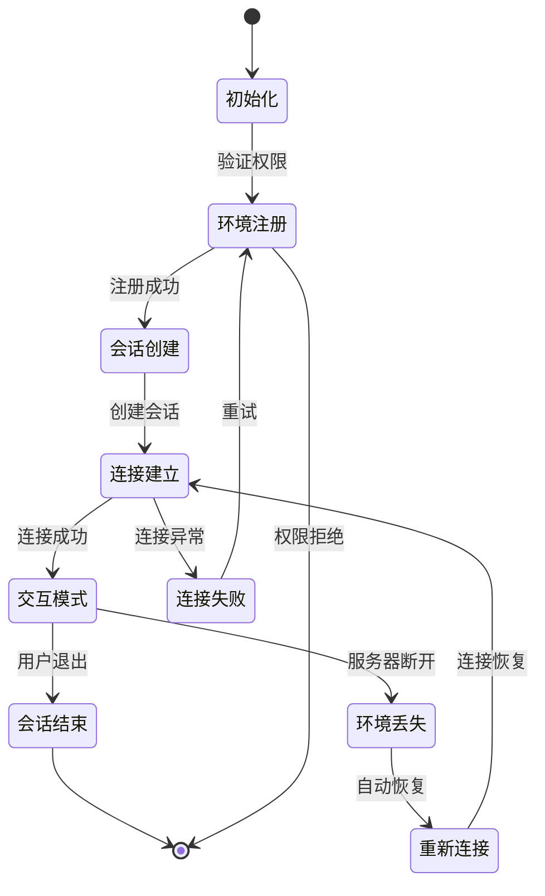
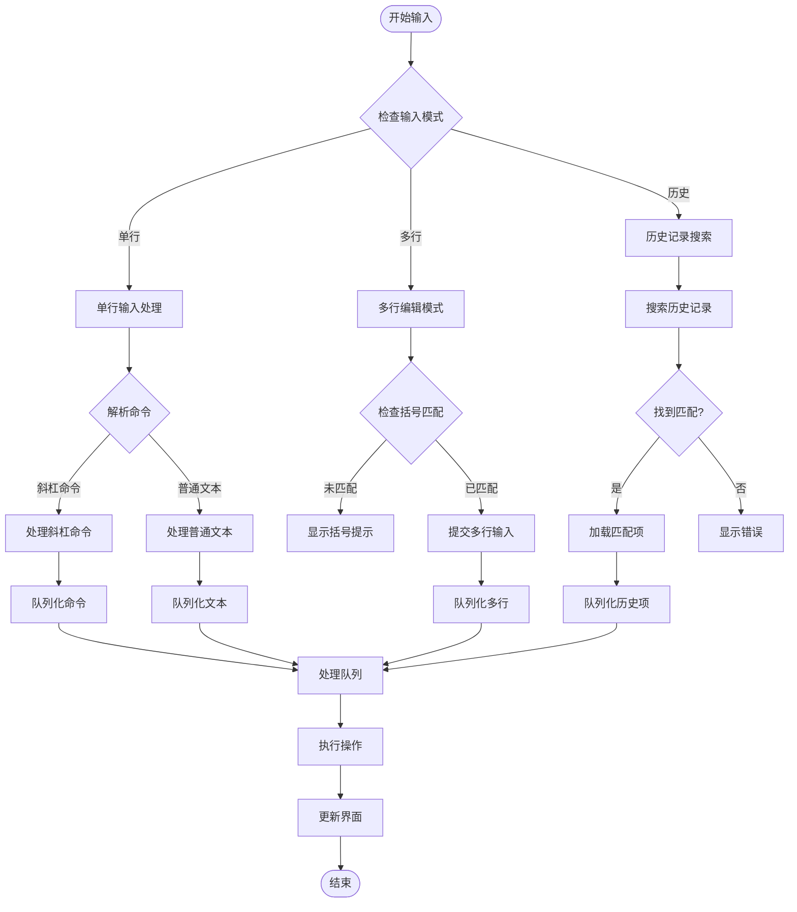
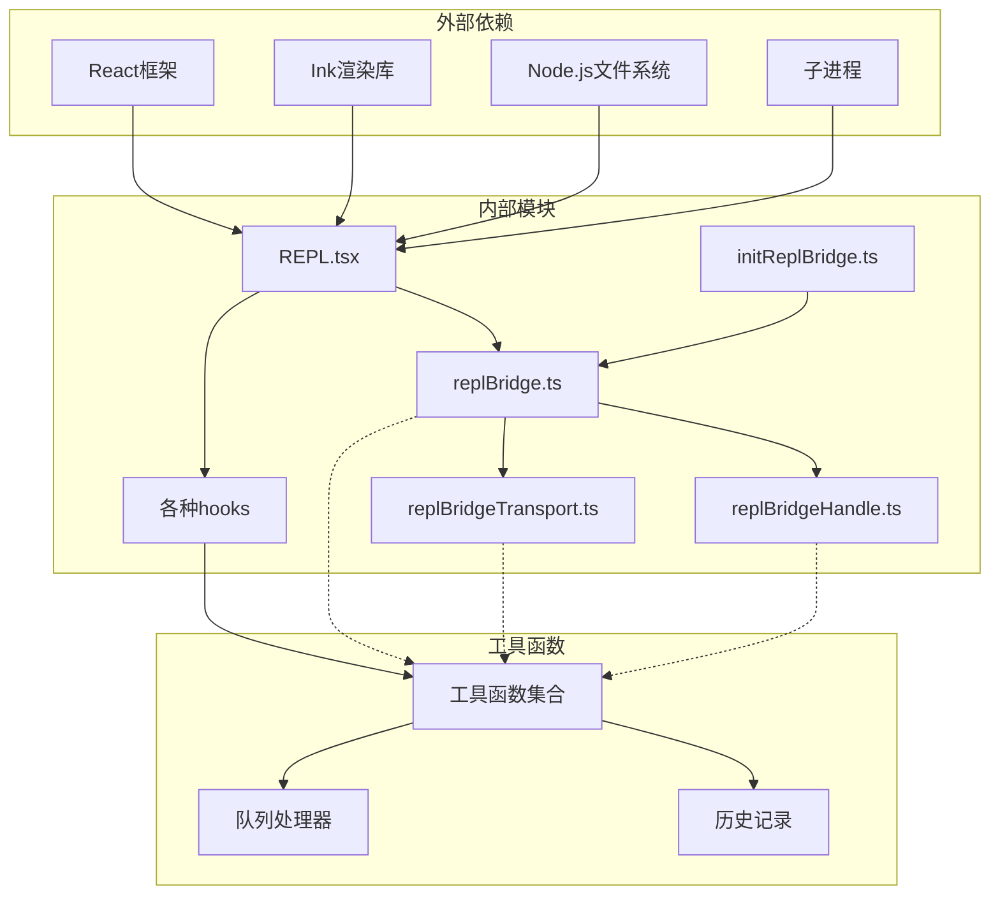

# REPL入口点

<cite>
**本文档引用的文件**
- [replLauncher.tsx](file://src/replLauncher.tsx)
- [replBridge.ts](file://src/bridge/replBridge.ts)
- [initReplBridge.ts](file://src/bridge/initReplBridge.ts)
- [replBridgeTransport.ts](file://src/bridge/replBridgeTransport.ts)
- [replBridgeHandle.ts](file://src/bridge/replBridgeHandle.ts)
- [REPL.tsx](file://src/screens/REPL.tsx)
- [useReplBridge.tsx](file://src/hooks/useReplBridge.tsx)
- [useArrowKeyHistory.tsx](file://src/hooks/useArrowKeyHistory.tsx)
- [useHistorySearch.ts](file://src/hooks/useHistorySearch.ts)
- [queueProcessor.ts](file://src/utils/queueProcessor.ts)
- [root.ts](file://src/ink/root.ts)
- [main.tsx](file://src/main.tsx)
</cite>

## 目录
1. [简介](#简介)
2. [项目结构](#项目结构)
3. [核心组件](#核心组件)
4. [架构概览](#架构概览)
5. [详细组件分析](#详细组件分析)
6. [依赖关系分析](#依赖关系分析)
7. [性能考虑](#性能考虑)
8. [故障排除指南](#故障排除指南)
9. [结论](#结论)

## 简介

Claude Code的REPL（Read-Eval-Print Loop）入口点是一个复杂的交互式开发环境，它提供了在终端中与AI助手进行实时对话的能力。该系统集成了本地命令执行、远程会话管理、权限控制和多种交互模式支持。

REPL入口点的核心设计目标是提供一个高性能、可靠的交互式编程环境，支持单行输入、多行编辑、历史记录搜索等功能。系统通过桥接层与后端服务通信，实现了本地与远程两种运行模式。

## 项目结构

REPL入口点的代码组织遵循模块化设计原则，主要分为以下几个层次：

**图表来源**
- [replLauncher.tsx:1-23](file://src/replLauncher.tsx#L1-L23)
- [replBridge.ts:1-800](file://src/bridge/replBridge.ts#L1-L800)
- [initReplBridge.ts:1-570](file://src/bridge/initReplBridge.ts#L1-L570)

**章节来源**
- [replLauncher.tsx:1-23](file://src/replLauncher.tsx#L1-L23)
- [REPL.tsx:1-800](file://src/screens/REPL.tsx#L1-L800)

## 核心组件

### REPL启动器 (replLauncher.tsx)

REPL启动器负责协调整个REPL系统的初始化过程。它作为应用程序的入口点，负责加载必要的组件并启动交互式会话。

关键特性：
- 动态导入App和REPL组件
- 配置应用程序包装器属性
- 启动渲染和运行循环

### 桥接核心 (replBridge.ts)

桥接核心是REPL系统的心脏，负责管理与后端服务的连接和数据传输。

主要功能：
- 环境注册和会话创建
- 轮询工作项和处理入站消息
- 传输层抽象（v1/v2协议）
- 连接恢复和错误处理

### 初始化桥接 (initReplBridge.ts)

初始化桥接模块负责处理REPL启动前的所有准备工作。

核心职责：
- 验证访问权限和组织策略
- 收集Git上下文信息
- 推导会话标题
- 选择合适的桥接路径（环境基础或无环境）

**章节来源**
- [replBridge.ts:260-800](file://src/bridge/replBridge.ts#L260-L800)
- [initReplBridge.ts:110-570](file://src/bridge/initReplBridge.ts#L110-L570)

## 架构概览

REPL入口点采用分层架构设计，确保了良好的模块分离和可维护性：

**图表来源**
- [replBridge.ts:317-477](file://src/bridge/replBridge.ts#L317-L477)
- [replBridgeTransport.ts:119-371](file://src/bridge/replBridgeTransport.ts#L119-L371)

## 详细组件分析

### 传输层抽象

传输层抽象是REPL系统的关键组件，它统一了v1和v2两种传输协议：

**图表来源**
- [replBridgeTransport.ts:23-70](file://src/bridge/replBridgeTransport.ts#L23-L70)
- [replBridgeTransport.ts:78-103](file://src/bridge/replBridgeTransport.ts#L78-L103)
- [replBridgeTransport.ts:119-371](file://src/bridge/replBridgeTransport.ts#L119-L371)

### 会话管理状态机

REPL系统使用状态机来管理会话生命周期：

**图表来源**
- [replBridge.ts:83-84](file://src/bridge/replBridge.ts#L83-L84)
- [replBridge.ts:617-927](file://src/bridge/replBridge.ts#L617-L927)

### 输入处理流程

REPL系统支持多种输入模式，包括单行输入、多行编辑和历史记录：

**图表来源**
- [useArrowKeyHistory.tsx:100-126](file://src/hooks/useArrowKeyHistory.tsx#L100-L126)
- [useHistorySearch.ts:73-148](file://src/hooks/useHistorySearch.ts#L73-L148)
- [queueProcessor.ts:52-87](file://src/utils/queueProcessor.ts#L52-L87)

**章节来源**
- [replBridgeTransport.ts:1-371](file://src/bridge/replBridgeTransport.ts#L1-L371)
- [replBridge.ts:617-927](file://src/bridge/replBridge.ts#L617-L927)

## 依赖关系分析

REPL入口点的依赖关系体现了清晰的模块化设计：

**图表来源**
- [REPL.tsx:1-800](file://src/screens/REPL.tsx#L1-L800)
- [initReplBridge.ts:16-73](file://src/bridge/initReplBridge.ts#L16-L73)

**章节来源**
- [REPL.tsx:1-800](file://src/screens/REPL.tsx#L1-L800)
- [initReplBridge.ts:16-73](file://src/bridge/initReplBridge.ts#L16-L73)

## 性能考虑

REPL入口点在设计时充分考虑了性能优化：

### 内存管理策略

1. **LRU缓存机制**：文件状态缓存使用LRU算法，限制最多100个文件的缓存大小
2. **引用计数**：使用弱映射来避免内存泄漏
3. **批量处理**：消息批处理减少DOM操作次数
4. **虚拟滚动**：大型转录本使用虚拟滚动技术

### 渲染优化

1. **增量渲染**：只重新渲染变化的部分
2. **防抖处理**：输入事件使用防抖减少重渲染
3. **懒加载**：组件按需加载
4. **微任务边界**：保持微任务边界确保渲染一致性

### 网络优化

1. **连接池复用**：传输层复用连接
2. **背压控制**：防止消息洪泛
3. **超时重试**：智能超时和重试机制
4. **序列号跟踪**：确保消息顺序

**章节来源**
- [REPL.tsx:307-315](file://src/screens/REPL.tsx#L307-L315)
- [replBridge.ts:518-521](file://src/bridge/replBridge.ts#L518-L521)

## 故障排除指南

### 常见问题及解决方案

#### 连接问题

**问题**：无法连接到后端服务
**诊断步骤**：
1. 检查网络连接状态
2. 验证OAuth令牌有效性
3. 查看桥接日志中的错误信息

**解决方案**：
- 重新登录获取新令牌
- 检查防火墙设置
- 尝试重启REPL服务

#### 性能问题

**问题**：REPL响应缓慢
**诊断步骤**：
1. 检查内存使用情况
2. 分析渲染性能指标
3. 监控网络延迟

**解决方案**：
- 清理不必要的缓存
- 减少同时运行的任务数量
- 优化复杂查询

#### 输入处理问题

**问题**：历史记录搜索不工作
**诊断步骤**：
1. 检查历史文件完整性
2. 验证搜索索引状态
3. 确认文件描述符是否泄漏

**解决方案**：
- 重建搜索索引
- 关闭所有历史阅读器实例
- 重启REPL以清理资源

**章节来源**
- [replBridge.ts:356-367](file://src/bridge/replBridge.ts#L356-L367)
- [useHistorySearch.ts:51-71](file://src/hooks/useHistorySearch.ts#L51-L71)

## 结论

Claude Code的REPL入口点是一个高度模块化的交互式开发环境，它通过精心设计的架构实现了以下目标：

1. **可靠性**：通过多层错误处理和自动恢复机制确保系统稳定性
2. **性能**：采用多种优化策略保证流畅的用户体验
3. **可扩展性**：模块化设计支持功能的灵活扩展
4. **易用性**：提供直观的交互界面和丰富的输入模式

该系统的核心优势在于其桥接层的设计，它成功地抽象了底层传输细节，使得上层应用可以专注于业务逻辑而非网络通信细节。同时，完善的错误处理和性能监控机制确保了系统的长期稳定运行。

对于开发者而言，REPL入口点提供了强大的扩展能力，可以通过插件系统和自定义命令来满足特定需求。对于最终用户而言，系统提供了直观易用的交互界面，支持多种输入模式和丰富的功能特性。