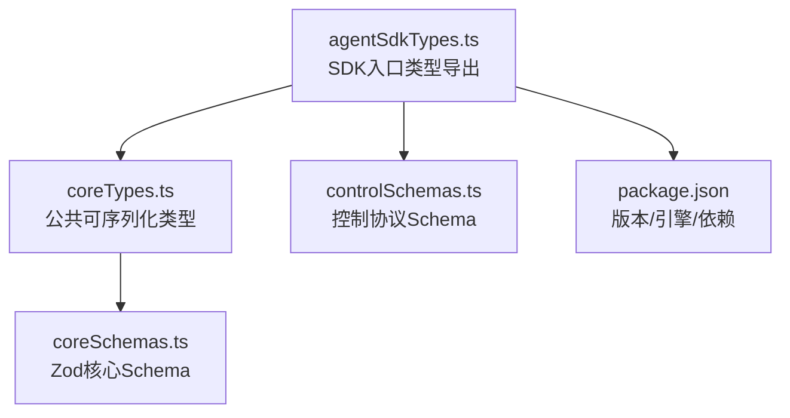
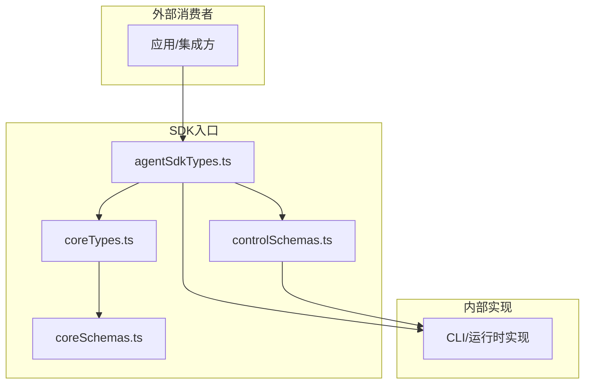
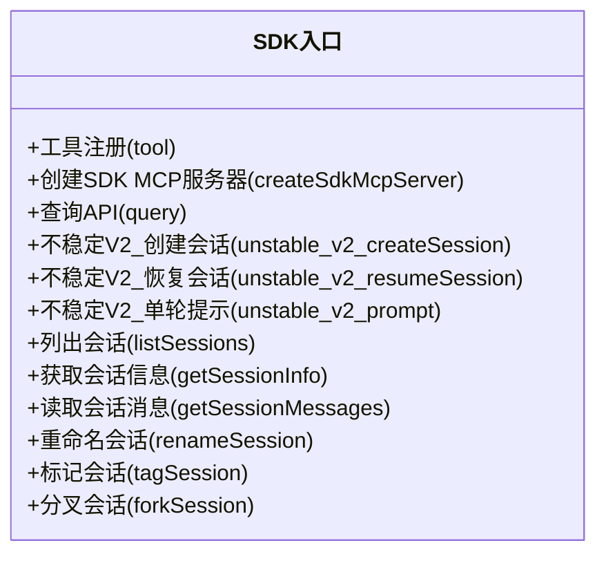
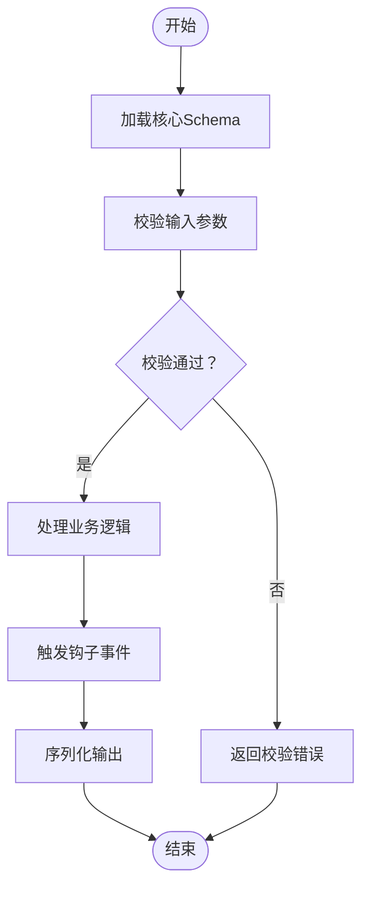
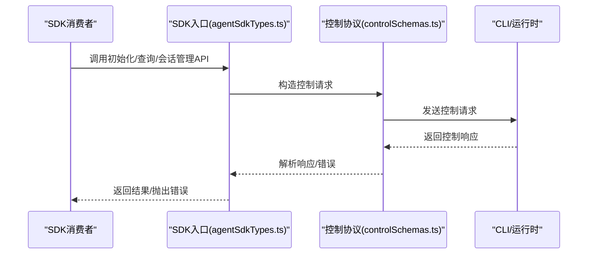
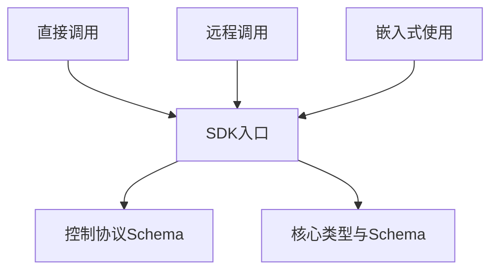
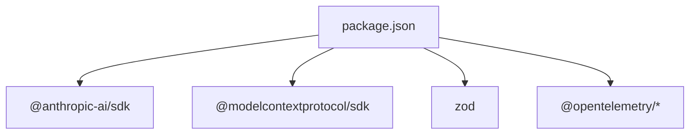

# SDK入口点

<cite>
**本文引用的文件**
- [package.json](file://package.json)
- [agentSdkTypes.ts](file://src/entrypoints/agentSdkTypes.ts)
- [coreTypes.ts](file://src/entrypoints/sdk/coreTypes.ts)
- [coreSchemas.ts](file://src/entrypoints/sdk/coreSchemas.ts)
- [controlSchemas.ts](file://src/entrypoints/sdk/controlSchemas.ts)
</cite>

## 目录
1. [简介](#简介)
2. [项目结构](#项目结构)
3. [核心组件](#核心组件)
4. [架构总览](#架构总览)
5. [详细组件分析](#详细组件分析)
6. [依赖关系分析](#依赖关系分析)
7. [性能考虑](#性能考虑)
8. [故障排除指南](#故障排除指南)
9. [结论](#结论)
10. [附录](#附录)

## 简介
本文件聚焦于Claude Code的SDK入口点设计与实现，系统性阐述SDK的API暴露方式、类型定义与接口规范，覆盖直接调用、远程调用与嵌入式使用等集成场景；同时说明版本管理、向后兼容性与API演进策略，以及认证、授权与安全验证流程，并提供完整的使用示例与集成指南、性能优化与资源管理机制，以及故障排除与调试技巧。

## 项目结构
SDK入口位于src/entrypoints目录下，核心由三部分组成：
- 类型与Schema：coreTypes.ts、coreSchemas.ts、controlSchemas.ts
- 入口类型导出：agentSdkTypes.ts
- 包元数据：package.json（含版本与引擎要求）

**图表来源**
- [agentSdkTypes.ts:1-444](file://src/entrypoints/agentSdkTypes.ts#L1-L444)
- [coreTypes.ts:1-63](file://src/entrypoints/sdk/coreTypes.ts#L1-L63)
- [coreSchemas.ts:1-800](file://src/entrypoints/sdk/coreSchemas.ts#L1-L800)
- [controlSchemas.ts:1-664](file://src/entrypoints/sdk/controlSchemas.ts#L1-L664)
- [package.json:1-76](file://package.json#L1-L76)

**章节来源**
- [agentSdkTypes.ts:1-444](file://src/entrypoints/agentSdkTypes.ts#L1-L444)
- [coreTypes.ts:1-63](file://src/entrypoints/sdk/coreTypes.ts#L1-L63)
- [coreSchemas.ts:1-800](file://src/entrypoints/sdk/coreSchemas.ts#L1-L800)
- [controlSchemas.ts:1-664](file://src/entrypoints/sdk/controlSchemas.ts#L1-L664)
- [package.json:1-76](file://package.json#L1-L76)

## 核心组件
- SDK入口类型导出（agentSdkTypes.ts）
  - 聚合导出：coreTypes.ts中的公共可序列化类型、runtimeTypes.ts中的运行时回调与接口、settingsTypes.generated.js中的设置类型、toolTypes.js中的工具类型
  - 暴露函数：工具注册、SDK MCP服务器创建、查询API（含不稳定V2）、会话管理API（列表、获取、重命名、打标签、分叉）
  - 错误类型：AbortError
- 核心类型与Schema（coreTypes.ts、coreSchemas.ts）
  - 可序列化类型：模型用量、输出格式、配置、权限、钩子事件、退出原因等
  - 运行时类型：回调、接口方法等（通过runtimeTypes.js导出）
  - 常量数组：HOOK_EVENTS、EXIT_REASONS
- 控制协议Schema（controlSchemas.ts）
  - 定义CLI与SDK实现之间的控制协议消息类型：初始化、权限请求、模型设置、MCP服务器状态、上下文使用统计、异步消息取消、环境变量更新等
  - 统一的Stdout/Stdin消息聚合类型，便于桥接通信

**章节来源**
- [agentSdkTypes.ts:12-32](file://src/entrypoints/agentSdkTypes.ts#L12-L32)
- [agentSdkTypes.ts:64-273](file://src/entrypoints/agentSdkTypes.ts#L64-L273)
- [coreTypes.ts:11-63](file://src/entrypoints/sdk/coreTypes.ts#L11-L63)
- [coreSchemas.ts:10-800](file://src/entrypoints/sdk/coreSchemas.ts#L10-L800)
- [controlSchemas.ts:10-664](file://src/entrypoints/sdk/controlSchemas.ts#L10-L664)

## 架构总览
SDK入口采用“类型中心”的设计：以Zod Schema为单一真实来源，生成TypeScript类型并提交到仓库，确保IDE支持与运行时校验一致。入口文件负责对外暴露稳定API与类型，内部通过Schema驱动数据契约与协议。

**图表来源**
- [agentSdkTypes.ts:12-32](file://src/entrypoints/agentSdkTypes.ts#L12-L32)
- [coreTypes.ts:11-63](file://src/entrypoints/sdk/coreTypes.ts#L11-L63)
- [coreSchemas.ts:10-800](file://src/entrypoints/sdk/coreSchemas.ts#L10-L800)
- [controlSchemas.ts:10-664](file://src/entrypoints/sdk/controlSchemas.ts#L10-L664)

## 详细组件分析

### 组件A：SDK入口类型导出（agentSdkTypes.ts）
- 设计要点
  - 聚合导出策略：统一从sdk/coreTypes.ts、sdk/runtimeTypes.js、settingsTypes.generated.js、toolTypes.js导入并再导出，保证外部仅通过一个入口访问
  - 功能API占位：当前实现中多数函数抛出未实现错误，表明SDK入口作为对外API契约，具体实现由宿主或CLI承载
  - 工具注册与MCP服务器：提供工具定义与SDK MCP服务器创建能力，便于在同一进程内运行自定义工具
  - 会话管理：提供会话列表、信息获取、消息读取、重命名、打标签、分叉等能力
- 集成场景
  - 直接调用：在同进程内通过SDK入口进行会话与工具操作
  - 远程调用：通过控制协议Schema与CLI通信，实现跨进程/远程交互
  - 嵌入式使用：作为库被上层应用或IDE集成，通过类型约束与Schema保障一致性

**图表来源**
- [agentSdkTypes.ts:64-273](file://src/entrypoints/agentSdkTypes.ts#L64-L273)

**章节来源**
- [agentSdkTypes.ts:12-32](file://src/entrypoints/agentSdkTypes.ts#L12-L32)
- [agentSdkTypes.ts:64-273](file://src/entrypoints/agentSdkTypes.ts#L64-L273)

### 组件B：核心类型与Schema（coreTypes.ts、coreSchemas.ts）
- 设计要点
  - Schema为中心：所有可序列化类型均来自coreSchemas.ts中的Zod Schema，通过脚本生成类型文件
  - 可扩展性：权限规则、MCP服务器配置、钩子事件、输出格式等均以Schema形式定义，便于演进
  - 常量与枚举：HOOK_EVENTS、EXIT_REASONS等常量数组用于运行时事件与退出原因的统一管理
- 数据流
  - 输入：用户消息、工具输入、配置参数
  - 处理：权限决策、模型推理、工具执行
  - 输出：结果消息、钩子事件、状态变更

**图表来源**
- [coreSchemas.ts:10-800](file://src/entrypoints/sdk/coreSchemas.ts#L10-L800)
- [coreTypes.ts:24-63](file://src/entrypoints/sdk/coreTypes.ts#L24-L63)

**章节来源**
- [coreTypes.ts:11-63](file://src/entrypoints/sdk/coreTypes.ts#L11-L63)
- [coreSchemas.ts:10-800](file://src/entrypoints/sdk/coreSchemas.ts#L10-L800)

### 组件C：控制协议Schema（controlSchemas.ts）
- 设计要点
  - 协议定义：涵盖初始化、权限请求、模型设置、MCP服务器管理、上下文使用统计、异步消息取消、环境变量更新等
  - 消息聚合：StdoutMessageSchema与StdinMessageSchema统一了CLI与SDK之间的消息类型
  - 错误处理：控制响应包含成功与错误两种分支，支持挂起的权限请求回传
- 流程图（初始化与权限请求）

**图表来源**
- [agentSdkTypes.ts:64-273](file://src/entrypoints/agentSdkTypes.ts#L64-L273)
- [controlSchemas.ts:552-664](file://src/entrypoints/sdk/controlSchemas.ts#L552-L664)

**章节来源**
- [controlSchemas.ts:10-664](file://src/entrypoints/sdk/controlSchemas.ts#L10-L664)

### 概念总览
SDK入口点通过“类型中心”与“协议中心”实现对不同集成场景的支持：
- 直接调用：通过SDK入口提供的API直接在进程内执行
- 远程调用：通过控制协议Schema与CLI通信，实现跨进程/远程交互
- 嵌入式使用：作为库被上层应用集成，通过类型约束与Schema保障一致性

[此图为概念性示意，不对应具体源码文件，故无图表来源]

## 依赖关系分析
- 版本与引擎
  - 包版本：2.1.88
  - Node引擎要求：>=18.0.0
- 关键依赖
  - @anthropic-ai/sdk：Claude AI SDK
  - @modelcontextprotocol/sdk：MCP协议支持
  - zod：Schema定义与运行时校验
  - opentelemetry：遥测与指标
- 依赖关系图

**图表来源**
- [package.json:20-74](file://package.json#L20-L74)

**章节来源**
- [package.json:1-76](file://package.json#L1-L76)

## 性能考虑
- 类型生成与校验
  - 通过Zod Schema生成类型，减少手写类型错误，提升IDE体验与运行时稳定性
- 消息聚合与序列化
  - 控制协议消息统一聚合，降低消息解析复杂度，提高桥接效率
- 资源管理
  - 通过会话管理API（列表、获取、分叉）与工具注册机制，避免重复创建与资源泄漏
- 异步与超时
  - 提供异步消息取消与环境变量动态更新能力，便于长任务与动态配置场景的资源回收与切换

[本节为通用性能建议，不直接分析具体文件，故无章节来源]

## 故障排除指南
- 常见问题
  - API未实现：入口文件中的多数函数当前抛出未实现错误，需在宿主环境中正确初始化与注入实现
  - 权限拒绝：权限请求与决策分类用于记录与追踪权限行为，检查权限模式与决策分类是否符合预期
  - 控制协议错误：控制响应包含错误分支与挂起的权限请求回传，需根据错误码与详情定位问题
- 调试技巧
  - 使用钩子事件（如PreToolUse、PostToolUse、PermissionRequest）观察执行链路
  - 通过上下文使用统计接口了解Token消耗分布，识别潜在的上下文膨胀问题
  - 利用MCP服务器状态接口监控连接状态与工具可用性

**章节来源**
- [agentSdkTypes.ts:64-273](file://src/entrypoints/agentSdkTypes.ts#L64-L273)
- [controlSchemas.ts:586-664](file://src/entrypoints/sdk/controlSchemas.ts#L586-L664)
- [coreSchemas.ts:315-383](file://src/entrypoints/sdk/coreSchemas.ts#L315-L383)

## 结论
Claude Code的SDK入口点以类型与Schema为核心，构建了统一的API契约与协议规范，支持直接调用、远程调用与嵌入式使用等多种集成场景。通过严格的类型生成、Schema校验与控制协议，SDK在保证一致性的同时提供了良好的扩展性与可观测性。结合权限与安全验证机制，SDK能够满足从桌面应用到IDE集成的多样化需求。

## 附录

### SDK使用示例与集成指南
- 直接调用
  - 在同进程内通过SDK入口提供的API进行会话与工具操作（当前实现为占位，需在宿主中注入实际实现）
- 远程调用
  - 通过控制协议Schema与CLI通信，发送控制请求并接收控制响应
- 嵌入式使用
  - 将SDK作为库引入，通过类型约束与Schema保障一致性，按需选择会话管理与工具注册能力

**章节来源**
- [agentSdkTypes.ts:64-273](file://src/entrypoints/agentSdkTypes.ts#L64-L273)
- [controlSchemas.ts:552-664](file://src/entrypoints/sdk/controlSchemas.ts#L552-L664)

### 版本管理、向后兼容性与API演进策略
- 版本管理
  - 包版本：2.1.88；Node引擎要求：>=18.0.0
- 向后兼容性
  - 核心类型与Schema以Zod为中心，新增字段通常保持可选，避免破坏既有契约
  - 常量数组（如HOOK_EVENTS、EXIT_REASONS）新增项遵循向后兼容原则
- API演进
  - 不稳定API（如V2会话API）标注@alpha，逐步稳定后再迁移为稳定API
  - 控制协议通过Schema演进，保持消息结构与语义的兼容性

**章节来源**
- [package.json:1-76](file://package.json#L1-L76)
- [coreTypes.ts:24-63](file://src/entrypoints/sdk/coreTypes.ts#L24-L63)
- [agentSdkTypes.ts:129-145](file://src/entrypoints/agentSdkTypes.ts#L129-L145)

### 认证、授权与安全验证
- 认证
  - 通过OAuth与密钥链等方式获取访问令牌，远程控制桥接需要有效的OAuth凭据
- 授权
  - 权限模式与权限规则用于控制工具执行与文件访问；权限决策分类用于遥测与审计
- 安全验证
  - 通过Schema校验与钩子事件拦截，确保敏感操作在受控环境下执行

**章节来源**
- [agentSdkTypes.ts:380-443](file://src/entrypoints/agentSdkTypes.ts#L380-L443)
- [coreSchemas.ts:242-348](file://src/entrypoints/sdk/coreSchemas.ts#L242-L348)