# 主入口点 (main.tsx)

<cite>
**本文档引用的文件**
- [main.tsx](file://src/main.tsx)
- [setup.ts](file://src/setup.ts)
- [state.ts](file://src/bootstrap/state.ts)
- [cliArgs.ts](file://src/utils/cliArgs.ts)
- [envExpansion.ts](file://src/services/mcp/envExpansion.ts)
</cite>

## 目录
1. [简介](#简介)
2. [项目结构](#项目结构)
3. [核心组件](#核心组件)
4. [架构概览](#架构概览)
5. [详细组件分析](#详细组件分析)
6. [依赖关系分析](#依赖关系分析)
7. [性能考虑](#性能考虑)
8. [故障排除指南](#故障排除指南)
9. [结论](#结论)

## 简介

Claude Code 的主入口点 main.tsx 是整个应用程序的启动核心，负责初始化系统环境、加载配置、处理命令行参数、建立安全检查机制，并根据不同的运行模式分发到相应的执行路径。该文件实现了复杂的启动流程，包括环境变量设置、配置加载、依赖预取和安全检查等多个层面。

## 项目结构

主入口点位于 `src/main.tsx` 文件中，采用模块化设计，通过条件导入和延迟加载来优化启动性能。整体架构遵循以下层次：

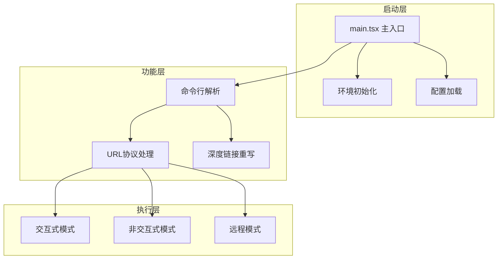

**图表来源**
- [main.tsx:1-100](file://src/main.tsx#L1-L100)

**章节来源**
- [main.tsx:1-200](file://src/main.tsx#L1-L200)

## 核心组件

### 启动初始化流程

主入口点实现了多阶段的初始化流程，确保系统在不同运行模式下都能正确启动：

1. **早期安全检查**：检测调试模式并阻止可疑的调试行为
2. **环境变量设置**：配置关键的环境变量以防止安全漏洞
3. **配置加载**：加载用户配置和企业策略设置
4. **依赖预取**：并行预取系统上下文和认证信息

### 命令行参数解析

支持丰富的命令行参数，包括：
- 基础模式切换：`-p/--print` 非交互模式
- 权限控制：`--dangerously-skip-permissions` 跳过权限检查
- 模型配置：`--model` 指定使用的AI模型
- 工作空间管理：`--worktree` 创建工作树会话

**章节来源**
- [main.tsx:800-900](file://src/main.tsx#L800-L900)
- [main.tsx:900-1100](file://src/main.tsx#L900-L1100)

## 架构概览

主入口点采用分层架构设计，通过状态管理和条件分支实现灵活的运行模式支持：

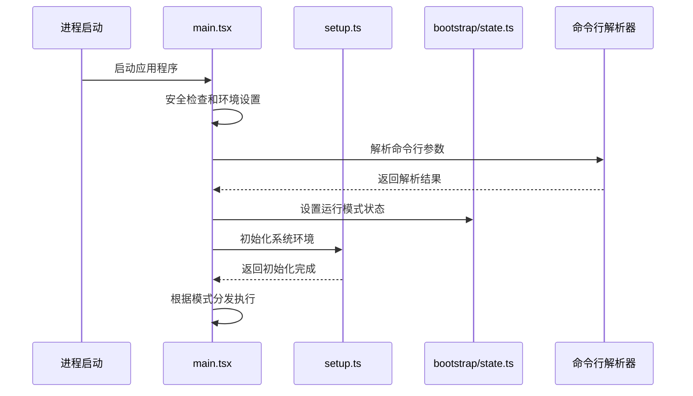

**图表来源**
- [main.tsx:585-856](file://src/main.tsx#L585-L856)
- [setup.ts:56-120](file://src/setup.ts#L56-L120)

## 详细组件分析

### 安全机制组件

#### 调试检测机制

主入口点实现了严格的调试检测机制，防止在生产环境中进行调试操作：

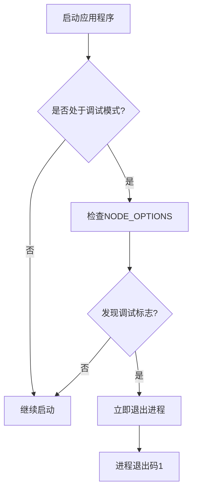

**图表来源**
- [main.tsx:232-271](file://src/main.tsx#L232-L271)

#### 权限验证系统

权限验证系统确保只有经过授权的用户才能执行敏感操作：

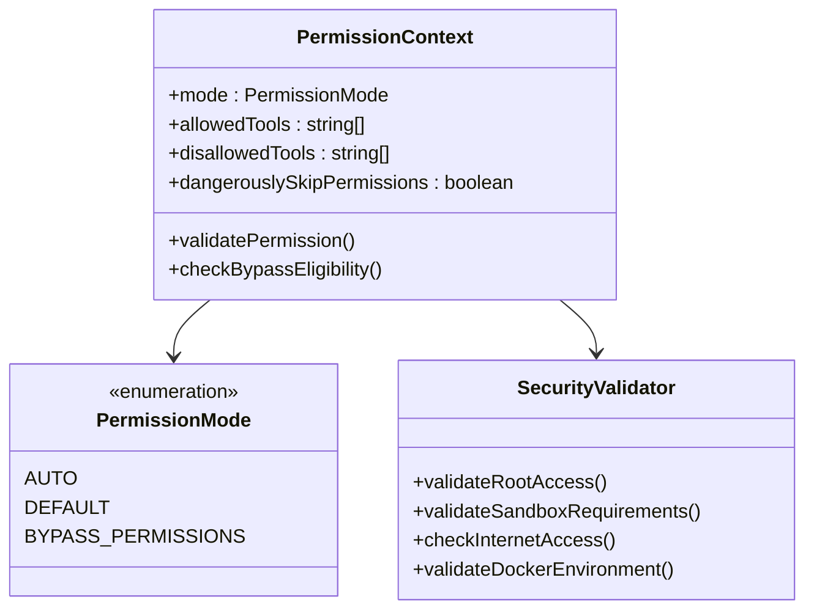

**图表来源**
- [main.tsx:1390-1411](file://src/main.tsx#L1390-L1411)
- [setup.ts:395-442](file://src/setup.ts#L395-L442)

**章节来源**
- [main.tsx:232-271](file://src/main.tsx#L232-L271)
- [setup.ts:395-442](file://src/setup.ts#L395-L442)

### 运行模式分支逻辑

#### 交互式模式处理

交互式模式提供完整的TUI界面体验：

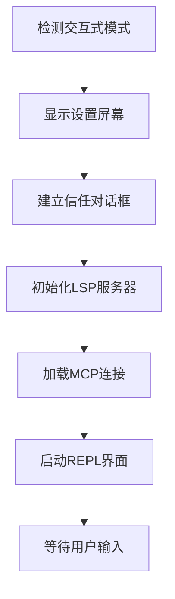

#### 非交互式模式处理

非交互式模式专注于批处理和自动化任务：

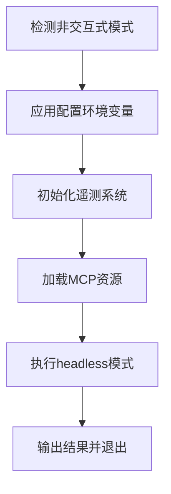

**图表来源**
- [main.tsx:2584-2861](file://src/main.tsx#L2584-L2861)
- [main.tsx:2926-3036](file://src/main.tsx#L2926-L3036)

**章节来源**
- [main.tsx:2584-2861](file://src/main.tsx#L2584-L2861)
- [main.tsx:2926-3036](file://src/main.tsx#L2926-L3036)

### 命令行参数解析机制

#### 早期参数解析

支持在初始化之前解析关键参数：

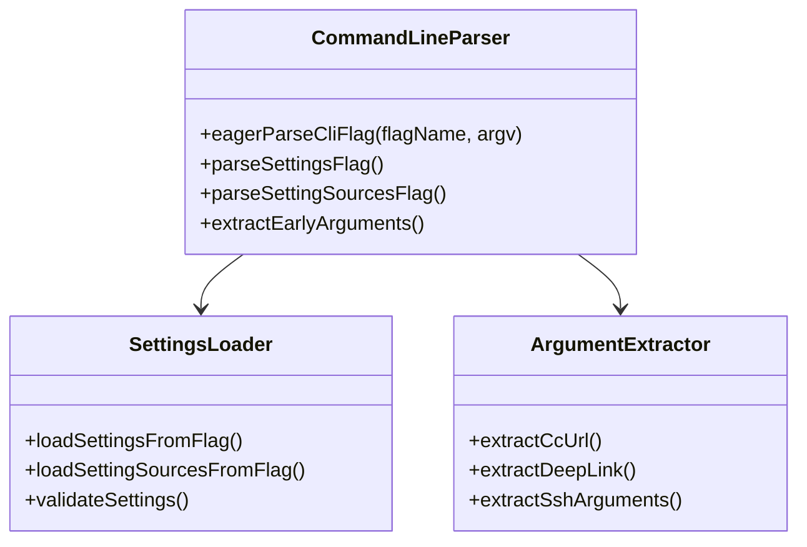

**图表来源**
- [cliArgs.ts:13-29](file://src/utils/cliArgs.ts#L13-L29)
- [main.tsx:432-496](file://src/main.tsx#L432-L496)

**章节来源**
- [cliArgs.ts:13-29](file://src/utils/cliArgs.ts#L13-L29)
- [main.tsx:432-496](file://src/main.tsx#L432-L496)

### URL协议处理和深度链接重写

#### 协议处理机制

支持多种URL协议格式的处理：

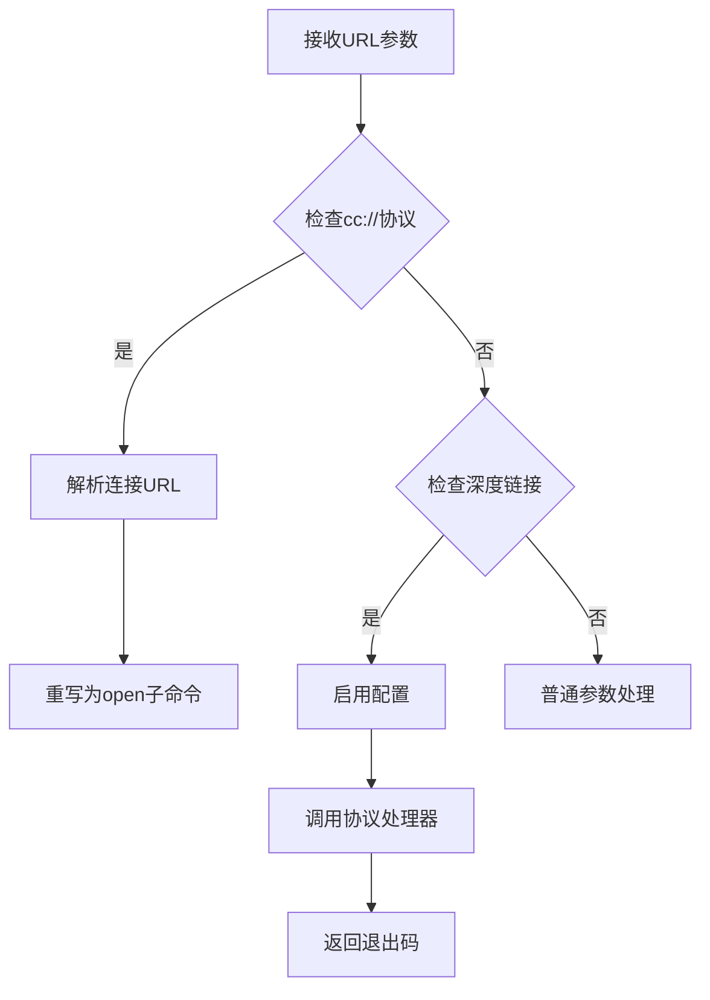

**图表来源**
- [main.tsx:609-642](file://src/main.tsx#L609-L642)
- [main.tsx:644-677](file://src/main.tsx#L644-L677)

**章节来源**
- [main.tsx:609-642](file://src/main.tsx#L609-L642)
- [main.tsx:644-677](file://src/main.tsx#L644-L677)

### 数据流向架构

#### 完整启动流程

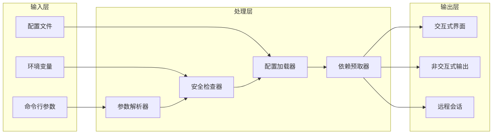

**图表来源**
- [main.tsx:585-856](file://src/main.tsx#L585-L856)
- [setup.ts:56-120](file://src/setup.ts#L56-L120)

**章节来源**
- [main.tsx:585-856](file://src/main.tsx#L585-L856)
- [setup.ts:56-120](file://src/setup.ts#L56-L120)

## 依赖关系分析

### 组件耦合度

主入口点通过模块化设计实现了良好的解耦：

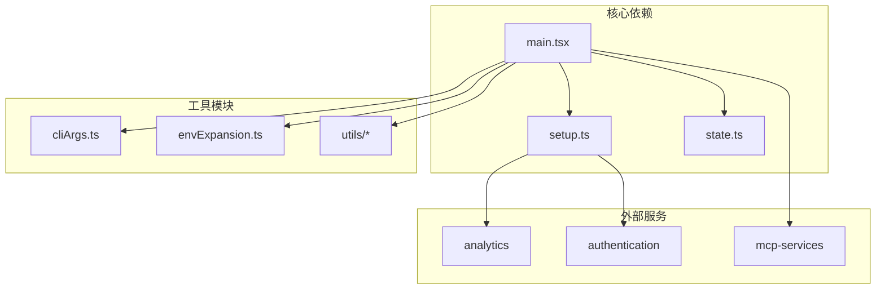

**图表来源**
- [main.tsx:1-100](file://src/main.tsx#L1-L100)
- [setup.ts:1-50](file://src/setup.ts#L1-L50)

### 循环依赖防护

通过延迟导入和条件加载避免了循环依赖问题：

**章节来源**
- [main.tsx:68-94](file://src/main.tsx#L68-L94)
- [setup.ts:1-50](file://src/setup.ts#L1-L50)

## 性能考虑

### 启动性能优化

主入口点采用了多项性能优化技术：

1. **并行预取**：同时加载多个依赖项以减少启动时间
2. **条件加载**：仅在需要时加载特定功能模块
3. **缓存策略**：利用内存缓存避免重复计算
4. **懒加载**：延迟初始化重型组件直到真正需要

### 内存管理

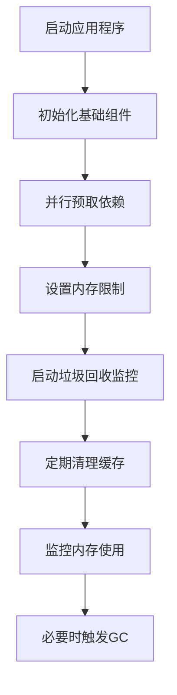

**图表来源**
- [main.tsx:388-431](file://src/main.tsx#L388-L431)
- [setup.ts:287-320](file://src/setup.ts#L287-L320)

## 故障排除指南

### 常见启动问题

#### 调试模式阻止

**问题**：应用程序在启动时立即退出
**原因**：检测到调试模式
**解决方案**：移除调试相关的环境变量或命令行参数

#### 权限验证失败

**问题**：无法跳过权限检查
**原因**：系统要求严格的安全模式
**解决方案**：使用受信任的环境或联系管理员

#### 配置加载错误

**问题**：配置文件解析失败
**原因**：配置格式不正确或权限不足
**解决方案**：检查配置文件格式和文件权限

**章节来源**
- [main.tsx:266-271](file://src/main.tsx#L266-L271)
- [setup.ts:395-442](file://src/setup.ts#L395-L442)

## 结论

Claude Code 的主入口点通过精心设计的架构实现了高效、安全且灵活的应用程序启动机制。其多层初始化流程、严格的安全部署和智能的运行模式分发，确保了在各种使用场景下都能提供最佳的用户体验。通过模块化设计和性能优化技术，该入口点为整个应用程序奠定了坚实的基础。