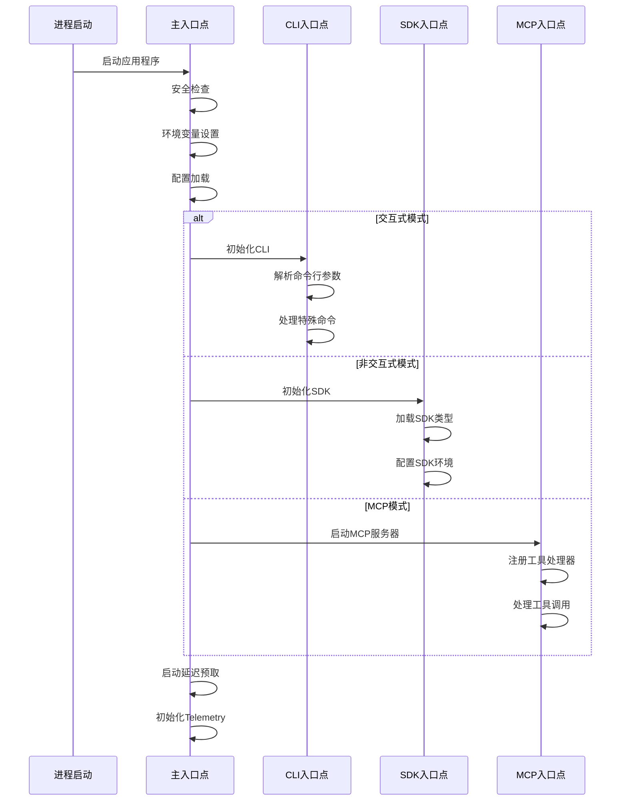
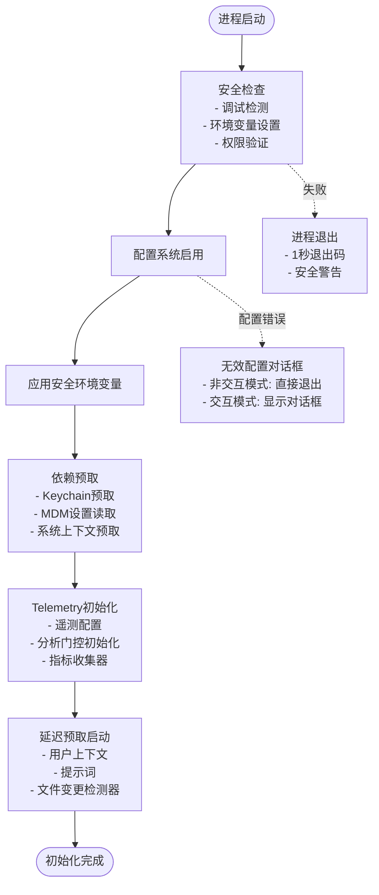
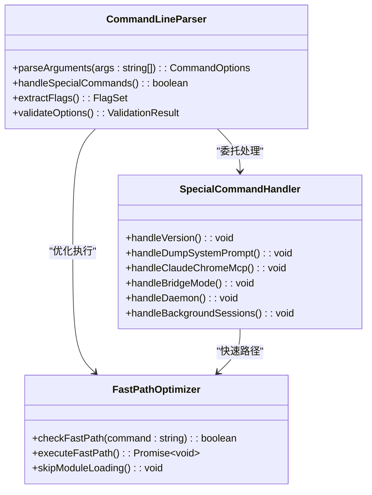
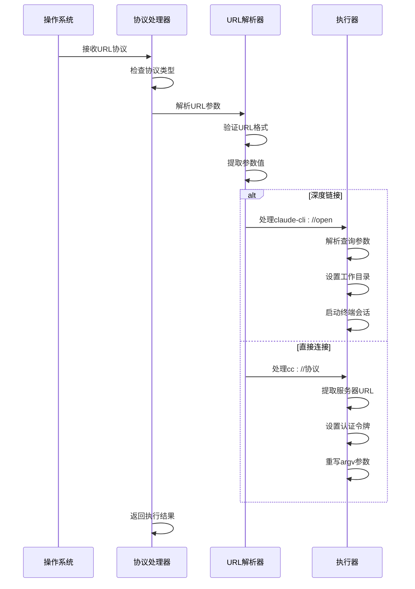
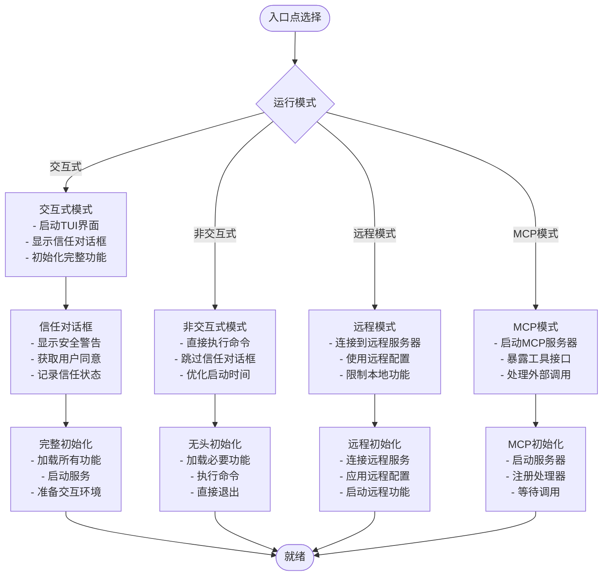

# 入口层架构

<cite>
**本文档引用的文件**
- [main.tsx](file://src/main.tsx)
- [cli.tsx](file://src/entrypoints/cli.tsx)
- [mcp.ts](file://src/entrypoints/mcp.ts)
- [init.ts](file://src/entrypoints/init.ts)
- [setup.ts](file://src/setup.ts)
- [package.json](file://package.json)
- [agentSdkTypes.ts](file://src/entrypoints/agentSdkTypes.ts)
- [parseDeepLink.ts](file://src/utils/deepLink/parseDeepLink.ts)
- [protocolHandler.ts](file://src/utils/deepLink/protocolHandler.ts)
- [state.ts](file://src/bootstrap/state.ts)
</cite>

## 目录
1. [简介](#简介)
2. [项目结构](#项目结构)
3. [核心组件](#核心组件)
4. [架构概览](#架构概览)
5. [详细组件分析](#详细组件分析)
6. [依赖关系分析](#依赖关系分析)
7. [性能考虑](#性能考虑)
8. [故障排除指南](#故障排除指南)
9. [结论](#结论)

## 简介

Claude Code的入口层架构是一个高度模块化的设计，支持多种运行模式和入口点。该架构的核心目标是在保证安全性的同时，提供灵活的初始化流程和强大的扩展能力。

入口层主要包含四个核心入口点：
- **主入口点**：`main.tsx` - 应用程序的主要启动文件
- **CLI入口点**：`cli.tsx` - 命令行界面的启动入口
- **SDK入口点**：`agentSdkTypes.ts` - 软件开发工具包的入口接口
- **MCP入口点**：`mcp.ts` - 模型上下文协议的服务器入口

## 项目结构

入口层架构采用分层设计，每个入口点都有其特定的职责和初始化流程：

```mermaid
graph TB
subgraph "入口层架构"
A[main.tsx - 主入口点] --> B[CLI入口点]
A --> C[SDK入口点]
A --> D[MCP入口点]
B --> E[命令行参数解析]
B --> F[配置系统初始化]
C --> G[SDK类型定义]
C --> H[Agent工具集成]
D --> I[MCP服务器启动]
D --> J[工具暴露]
A --> K[环境变量设置]
A --> L[安全检查]
A --> M[依赖预取]
</subgraph>
```

**图表来源**
- [main.tsx:1-100](file://src/main.tsx#L1-L100)
- [cli.tsx:1-50](file://src/entrypoints/cli.tsx#L1-L50)
- [agentSdkTypes.ts:1-50](file://src/entrypoints/agentSdkTypes.ts#L1-L50)
- [mcp.ts:1-50](file://src/entrypoints/mcp.ts#L1-L50)

**章节来源**
- [main.tsx:1-100](file://src/main.tsx#L1-L100)
- [cli.tsx:1-50](file://src/entrypoints/cli.tsx#L1-L50)
- [agentSdkTypes.ts:1-50](file://src/entrypoints/agentSdkTypes.ts#L1-L50)
- [mcp.ts:1-50](file://src/entrypoints/mcp.ts#L1-L50)

## 核心组件

### 主入口点 (main.tsx)

主入口点是整个应用程序的协调中心，负责以下关键功能：

**安全机制**：
- 调试检测：防止在调试模式下启动
- 环境变量保护：确保安全的环境变量应用
- 权限验证：执行必要的权限检查

**初始化流程**：
- 配置系统启用
- 环境变量应用
- 依赖预取优化
- 安全检查执行

**章节来源**
- [main.tsx:231-271](file://src/main.tsx#L231-L271)
- [main.tsx:585-825](file://src/main.tsx#L585-L825)

### CLI入口点 (cli.tsx)

CLI入口点专注于命令行界面的快速启动和特殊命令处理：

**快速路径优化**：
- 版本信息查询的零模块加载
- 系统提示词提取的专用路径
- 多种内置命令的快速处理

**特殊命令支持**：
- Claude Chrome MCP服务器
- Chrome原生主机
- 计算机使用MCP服务器
- 桥接模式远程控制
- 守护进程管理

**章节来源**
- [cli.tsx:33-303](file://src/entrypoints/cli.tsx#L33-L303)

### SDK入口点 (agentSdkTypes.ts)

SDK入口点提供软件开发工具包的统一接口：

**类型定义**：
- SDK核心类型重新导出
- 运行时类型定义
- 工具类型定义
- 设置类型生成

**功能接口**：
- 工具创建函数
- MCP服务器创建
- 会话管理接口
- 查询接口

**章节来源**
- [agentSdkTypes.ts:1-444](file://src/entrypoints/agentSdkTypes.ts#L1-L444)

### MCP入口点 (mcp.ts)

MCP入口点实现模型上下文协议的服务器功能：

**服务器功能**：
- MCP服务器实例创建
- 工具列表请求处理
- 工具调用请求处理
- 输入输出模式转换

**安全特性**：
- 工具权限验证
- 输入验证
- 错误处理机制

**章节来源**
- [mcp.ts:35-197](file://src/entrypoints/mcp.ts#L35-L197)

## 架构概览

入口层架构采用模块化设计，支持多种运行模式：



**图表来源**
- [main.tsx:585-825](file://src/main.tsx#L585-L825)
- [cli.tsx:287-299](file://src/entrypoints/cli.tsx#L287-L299)
- [agentSdkTypes.ts:1-50](file://src/entrypoints/agentSdkTypes.ts#L1-L50)
- [mcp.ts:35-197](file://src/entrypoints/mcp.ts#L35-L197)

## 详细组件分析

### 初始化流程组件

入口层的初始化流程经过精心设计，确保在启动时进行必要的安全检查和配置准备：



**图表来源**
- [main.tsx:231-271](file://src/main.tsx#L231-L271)
- [main.tsx:585-825](file://src/main.tsx#L585-L825)
- [init.ts:57-238](file://src/entrypoints/init.ts#L57-L238)

### 命令行参数解析组件

CLI入口点实现了高效的参数解析和特殊命令处理机制：



**图表来源**
- [cli.tsx:33-303](file://src/entrypoints/cli.tsx#L33-L303)

**章节来源**
- [cli.tsx:33-303](file://src/entrypoints/cli.tsx#L33-L303)

### URL协议处理组件

入口层支持多种URL协议处理，包括深度链接和直接连接：



**图表来源**
- [main.tsx:609-642](file://src/main.tsx#L609-L642)
- [parseDeepLink.ts:84-153](file://src/utils/deepLink/parseDeepLink.ts#L84-L153)
- [protocolHandler.ts:39-75](file://src/utils/deepLink/protocolHandler.ts#L39-L75)

**章节来源**
- [main.tsx:609-677](file://src/main.tsx#L609-L677)
- [parseDeepLink.ts:1-170](file://src/utils/deepLink/parseDeepLink.ts#L1-L170)
- [protocolHandler.ts:39-75](file://src/utils/deepLink/protocolHandler.ts#L39-L75)

### 运行模式分支逻辑

入口层根据不同的运行模式执行相应的初始化分支：



**图表来源**
- [main.tsx:797-825](file://src/main.tsx#L797-L825)
- [setup.ts:56-478](file://src/setup.ts#L56-L478)

**章节来源**
- [main.tsx:797-825](file://src/main.tsx#L797-L825)
- [setup.ts:56-478](file://src/setup.ts#L56-L478)

## 依赖关系分析

入口层的依赖关系体现了清晰的关注点分离和模块化设计：

```mermaid
graph TB
subgraph "入口层依赖关系"
A[main.tsx] --> B[init.ts]
A --> C[setup.ts]
A --> D[cli.tsx]
A --> E[agentSdkTypes.ts]
A --> F[mcp.ts]
B --> G[配置系统]
B --> H[环境变量]
B --> I[遥测系统]
C --> J[会话管理]
C --> K[工作树支持]
C --> L[权限检查]
D --> M[命令解析]
D --> N[快速路径]
D --> O[特殊命令]
E --> P[SDK类型]
E --> Q[Agent工具]
E --> R[MCP集成]
F --> S[MCP服务器]
F --> T[工具注册]
F --> U[请求处理]
</subgraph>
```

**图表来源**
- [main.tsx:32-98](file://src/main.tsx#L32-L98)
- [init.ts:1-50](file://src/entrypoints/init.ts#L1-L50)
- [setup.ts:1-50](file://src/setup.ts#L1-L50)

**章节来源**
- [main.tsx:32-98](file://src/main.tsx#L32-L98)
- [init.ts:1-50](file://src/entrypoints/init.ts#L1-L50)
- [setup.ts:1-50](file://src/setup.ts#L1-L50)

## 性能考虑

入口层架构在性能方面采用了多项优化策略：

### 并行预取优化
- **Keychain预取**：在导入其他模块之前启动Keychain读取
- **MDM设置读取**：并行处理系统设置获取
- **系统上下文预取**：在信任建立后预取系统信息

### 模块加载优化
- **动态导入**：仅在需要时加载模块
- **快速路径**：常见命令的零模块加载
- **延迟初始化**：非关键功能的延迟启动

### 内存管理
- **缓存机制**：文件状态缓存限制大小
- **垃圾回收**：及时清理未使用的资源
- **内存监控**：监控内存使用情况

## 故障排除指南

### 常见启动问题

**调试模式检测**
- 症状：应用程序在启动时立即退出
- 原因：检测到调试模式（--inspect或--debug标志）
- 解决方案：移除调试标志或使用生产模式

**配置错误**
- 症状：显示无效配置对话框或直接退出
- 原因：配置文件格式错误或权限问题
- 解决方案：检查配置文件语法，确保正确权限

**权限不足**
- 症状：权限验证失败或安全警告
- 原因：root/sudo权限或不安全的沙箱环境
- 解决方案：使用适当的用户权限或配置安全沙箱

### 性能问题诊断

**启动缓慢**
- 检查网络连接速度
- 验证磁盘I/O性能
- 监控内存使用情况

**内存泄漏**
- 使用内存分析工具
- 检查未释放的事件监听器
- 验证缓存清理机制

**章节来源**
- [main.tsx:231-271](file://src/main.tsx#L231-L271)
- [setup.ts:395-442](file://src/setup.ts#L395-L442)

## 结论

Claude Code的入口层架构展现了现代应用程序设计的最佳实践。通过模块化的入口点设计、精心的初始化流程和全面的安全机制，该架构为不同的使用场景提供了灵活而可靠的解决方案。

关键优势包括：
- **多入口点支持**：满足CLI、SDK、MCP等多种使用场景
- **安全优先**：在启动阶段执行严格的安全检查
- **性能优化**：通过并行预取和延迟加载提升启动速度
- **可扩展性**：模块化设计便于功能扩展和维护

该架构为开发者提供了清晰的扩展路径，同时保持了系统的稳定性和安全性。通过合理的错误处理和故障排除机制，确保了良好的用户体验和系统可靠性。