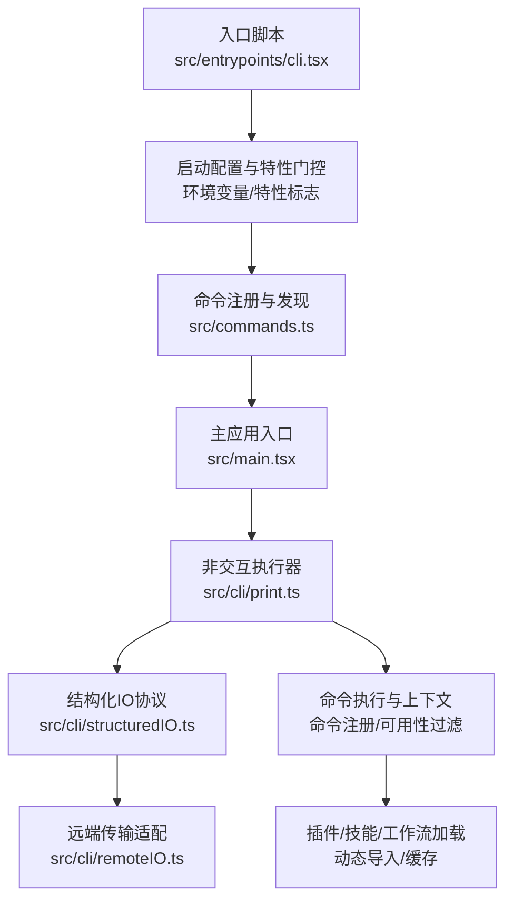
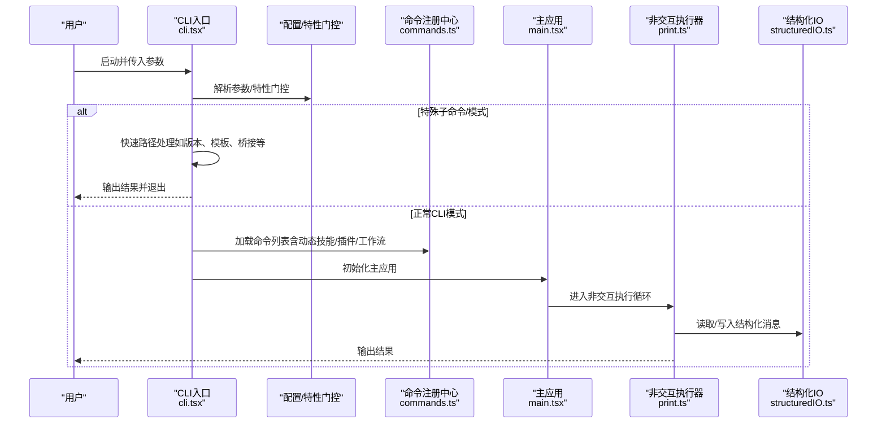
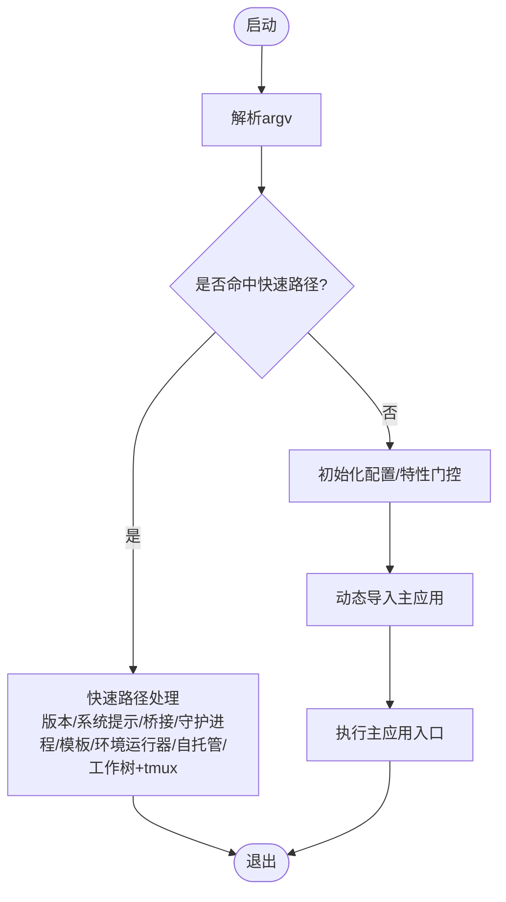
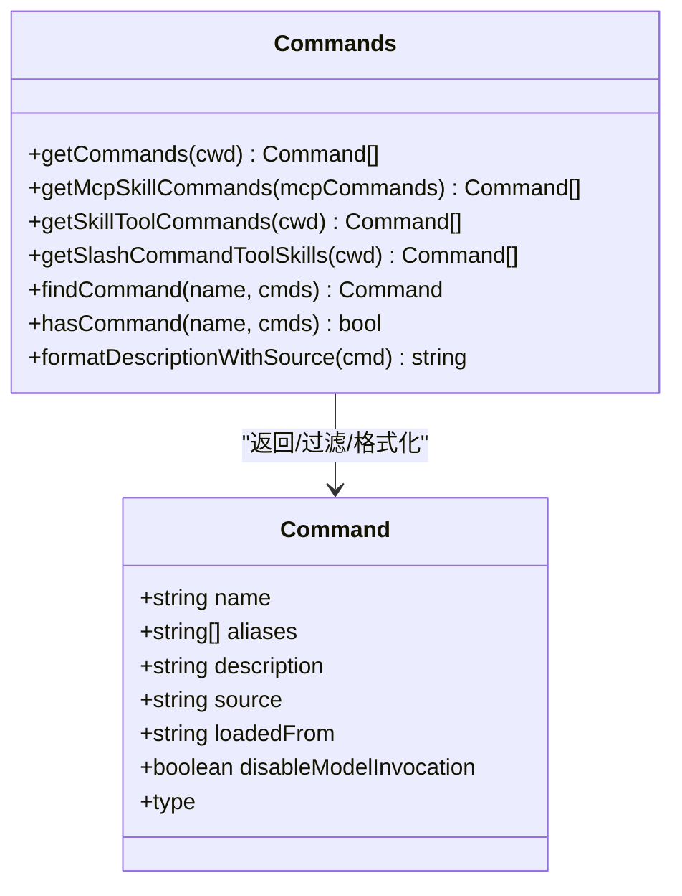
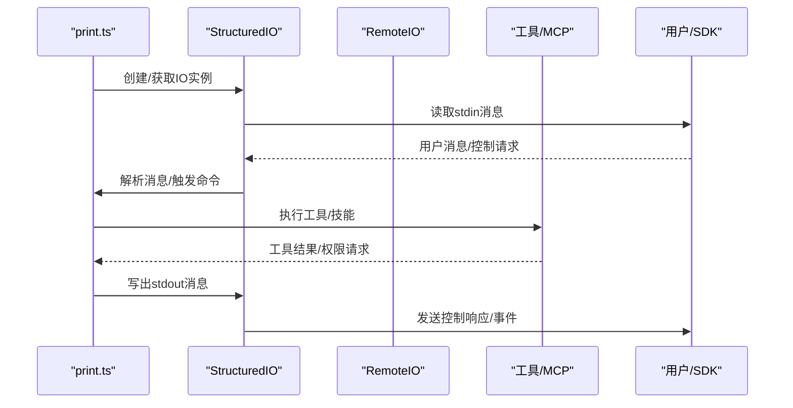
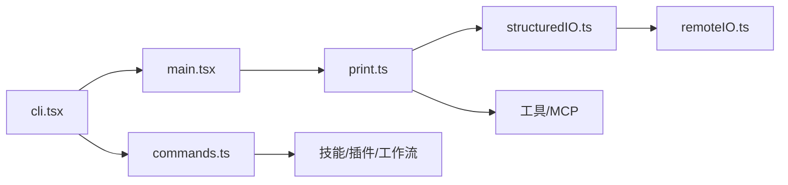

# 命令行接口入口（CLI）

<cite>
**本文档引用的文件**
- [cli.tsx](file://src/entrypoints/cli.tsx)
- [main.tsx](file://src/main.tsx)
- [commands.ts](file://src/commands.ts)
- [print.ts](file://src/cli/print.ts)
- [structuredIO.ts](file://src/cli/structuredIO.ts)
- [remoteIO.ts](file://src/cli/remoteIO.ts)
- [exit.ts](file://src/cli/exit.ts)
- [package.json](file://package.json)
</cite>

## 目录
1. [简介](#简介)
2. [项目结构](#项目结构)
3. [核心组件](#核心组件)
4. [架构总览](#架构总览)
5. [详细组件分析](#详细组件分析)
6. [依赖关系分析](#依赖关系分析)
7. [性能考量](#性能考量)
8. [故障排除指南](#故障排除指南)
9. [结论](#结论)
10. [附录：常用命令与最佳实践](#附录常用命令与最佳实践)

## 简介
本文件面向Claude Code的命令行接口入口（CLI），系统性阐述其设计与实现，包括命令行参数解析、命令路由与执行流程、CLI模式初始化过程（命令注册、参数校验、执行上下文设置）、CLI与交互式模式的差异与转换机制、命令类型（内置命令、插件命令、自定义命令）处理方式、命令系统架构与执行流程图、常见命令使用示例与最佳实践，以及错误处理与调试机制。

## 项目结构
CLI入口位于`src/entrypoints/cli.tsx`，负责快速路径分流、配置初始化、命令注册与加载、以及最终调用主应用逻辑。命令注册与发现集中在`src/commands.ts`，运行时的非交互执行逻辑在`src/cli/print.ts`中实现，输入输出协议通过`src/cli/structuredIO.ts`与`src/cli/remoteIO.ts`抽象，统一的退出处理由`src/cli/exit.ts`提供。

图表来源
- [cli.tsx:33-299](file://src/entrypoints/cli.tsx#L33-L299)
- [commands.ts:256-469](file://src/commands.ts#L256-L469)
- [main.tsx:88-88](file://src/main.tsx#L88-L88)
- [print.ts:455-800](file://src/cli/print.ts#L455-L800)
- [structuredIO.ts:135-774](file://src/cli/structuredIO.ts#L135-L774)
- [remoteIO.ts:35-255](file://src/cli/remoteIO.ts#L35-L255)

章节来源
- [cli.tsx:1-303](file://src/entrypoints/cli.tsx#L1-L303)
- [commands.ts:1-755](file://src/commands.ts#L1-L755)
- [main.tsx:1-200](file://src/main.tsx#L1-L200)

## 核心组件
- CLI入口与快速路径：在启动早期解析参数并按特性门控与特殊标志进行快速路径分流，避免不必要的模块加载，提升启动速度。
- 命令注册与发现：集中管理内置命令、插件命令、技能命令、工作流命令，并根据可用性与启用状态动态过滤与合并。
- 非交互执行器：在无终端UI场景下运行命令，支持结构化输出、权限请求、MCP交互与会话恢复。
- 结构化IO与远端传输：抽象标准输入输出协议，支持本地与远端（桥接/环境运行器）双向流式通信。
- 退出与错误处理：统一的错误输出与进程退出策略，便于自动化集成。

章节来源
- [cli.tsx:33-299](file://src/entrypoints/cli.tsx#L33-L299)
- [commands.ts:256-517](file://src/commands.ts#L256-L517)
- [print.ts:455-800](file://src/cli/print.ts#L455-L800)
- [structuredIO.ts:135-774](file://src/cli/structuredIO.ts#L135-L774)
- [remoteIO.ts:35-255](file://src/cli/remoteIO.ts#L35-L255)
- [exit.ts:1-32](file://src/cli/exit.ts#L1-L32)

## 架构总览
CLI入口采用“快速路径 + 按需加载”的策略，先做轻量级参数与特性判断，再根据子命令或模式加载相应模块。命令系统以“命令注册中心”为核心，结合可用性过滤、动态技能注入与插件/工作流扩展，形成统一的命令分发与执行框架。

图表来源
- [cli.tsx:33-299](file://src/entrypoints/cli.tsx#L33-L299)
- [commands.ts:449-517](file://src/commands.ts#L449-L517)
- [main.tsx:88-88](file://src/main.tsx#L88-L88)
- [print.ts:455-800](file://src/cli/print.ts#L455-L800)
- [structuredIO.ts:135-774](file://src/cli/structuredIO.ts#L135-L774)

## 详细组件分析

### CLI入口与快速路径
- 参数解析与快速路径：对`--version`、`--dump-system-prompt`、`--daemon-worker`、`remote-control/rc/remote/sync/bridge`、`daemon`、后台会话管理、模板作业、环境运行器、自托管运行器、工作树+tmux等进行快速路径处理，避免加载完整CLI。
- 特性门控与环境准备：根据特性标志（feature）进行死代码消除，设置NODE_OPTIONS、CLAUDE_CODE_REMOTE等环境变量，确保容器/远程模式下的内存限制与行为一致。
- 特殊标志重定向：将`--update`/`--upgrade`重定向到`update`子命令；`--bare`提前设置环境变量以影响后续选项构建。
- 最终进入主应用：完成早期输入捕获后，动态导入并调用主应用入口。

图表来源
- [cli.tsx:33-299](file://src/entrypoints/cli.tsx#L33-L299)

章节来源
- [cli.tsx:33-299](file://src/entrypoints/cli.tsx#L33-L299)

### 命令注册与发现（commands.ts）
- 命令来源聚合：内置命令、插件命令、技能目录命令、捆绑技能、内置插件技能、工作流命令、动态技能等多源聚合。
- 可用性与启用过滤：基于认证/提供商要求（如claude.ai订阅、控制台API密钥、第三方服务）与特性门控进行过滤；支持按命令启用状态动态筛选。
- 动态技能去重与插入：动态技能与插件技能去重后插入到内置命令之前，保证优先级与一致性。
- 缓存与失效：命令列表与技能缓存采用memoize，支持显式清理以刷新动态技能。

图表来源
- [commands.ts:256-517](file://src/commands.ts#L256-L517)
- [commands.ts:547-608](file://src/commands.ts#L547-L608)

章节来源
- [commands.ts:256-517](file://src/commands.ts#L256-L517)
- [commands.ts:547-608](file://src/commands.ts#L547-L608)

### 非交互执行器（print.ts）
- 运行模式：在非交互模式下运行命令，支持批量命令队列、权限请求、MCP工具、沙箱网络访问、钩子事件、会话恢复与回放。
- 输入输出：通过StructuredIO/RemoteIO读取stdin消息并写出stdout消息，支持NDJSON流与SDK控制协议。
- 安全与合规：检查沙箱可用性与必要性，必要时强制失败；对重复/孤儿响应进行去重处理，防止API错误。
- 会话与恢复：支持从会话ID/JSONL文件恢复，支持文件历史回溯（rewind-files）。

图表来源
- [print.ts:455-800](file://src/cli/print.ts#L455-L800)
- [structuredIO.ts:135-774](file://src/cli/structuredIO.ts#L135-L774)
- [remoteIO.ts:35-255](file://src/cli/remoteIO.ts#L35-L255)

章节来源
- [print.ts:455-800](file://src/cli/print.ts#L455-L800)
- [structuredIO.ts:135-774](file://src/cli/structuredIO.ts#L135-L774)
- [remoteIO.ts:35-255](file://src/cli/remoteIO.ts#L35-L255)

### 结构化IO与远端传输（structuredIO.ts / remoteIO.ts）
- StructuredIO：封装SDK控制协议的消息读写、权限请求/响应、钩子回调、MCP消息转发、沙箱网络访问代理等。
- RemoteIO：在远端（桥接/环境运行器）场景下，通过SSE/WS等传输与CCR v2生命周期管理对接，支持内部事件持久化与会话恢复。
- 一致性与健壮性：对重复/孤儿响应进行跟踪与忽略，避免重复工具使用ID导致API错误；在桥接模式下可选择性将控制请求同步到stdout以便父进程感知。

章节来源
- [structuredIO.ts:135-774](file://src/cli/structuredIO.ts#L135-L774)
- [remoteIO.ts:35-255](file://src/cli/remoteIO.ts#L35-L255)

### 退出与错误处理（exit.ts）
- 统一错误输出与进程退出：提供`cliError`与`cliOk`，分别向stderr输出错误信息并退出码1，或向stdout输出成功信息并退出码0。
- 测试友好：通过集中出口便于测试替换process.exit与stdout/stderr。

章节来源
- [exit.ts:1-32](file://src/cli/exit.ts#L1-L32)

## 依赖关系分析
- CLI入口依赖命令注册中心与主应用入口；命令注册中心依赖动态技能/插件/工作流加载；非交互执行器依赖结构化IO与远端传输；结构化IO依赖SDK控制协议与工具权限系统；远端传输依赖桥接/环境运行器的生命周期与事件系统。
- 特性门控（feature）贯穿于入口、命令注册、工具加载等环节，用于死代码消除与条件功能启用。

图表来源
- [cli.tsx:33-299](file://src/entrypoints/cli.tsx#L33-L299)
- [commands.ts:449-517](file://src/commands.ts#L449-L517)
- [main.tsx:88-88](file://src/main.tsx#L88-L88)
- [print.ts:455-800](file://src/cli/print.ts#L455-L800)
- [structuredIO.ts:135-774](file://src/cli/structuredIO.ts#L135-L774)
- [remoteIO.ts:35-255](file://src/cli/remoteIO.ts#L35-L255)

章节来源
- [cli.tsx:33-299](file://src/entrypoints/cli.tsx#L33-L299)
- [commands.ts:449-517](file://src/commands.ts#L449-L517)
- [main.tsx:88-88](file://src/main.tsx#L88-L88)
- [print.ts:455-800](file://src/cli/print.ts#L455-L800)
- [structuredIO.ts:135-774](file://src/cli/structuredIO.ts#L135-L774)
- [remoteIO.ts:35-255](file://src/cli/remoteIO.ts#L35-L255)

## 性能考量
- 启动优化：快速路径避免不必要模块加载；早期输入捕获减少首帧延迟；特性门控死代码消除降低包体与运行时开销。
- 并行与重叠：用户设置下载与MCP/工具初始化并行；沙箱GC定时器在Bun环境下周期性触发以控制内存峰值。
- I/O与序列化：NDJSON安全序列化与stdout守卫确保SDK客户端解析稳定；内部事件队列与批处理减少网络往返。
- 缓存与去重：命令列表与技能缓存memoize，动态技能去重插入，避免重复计算与冗余命令。

## 故障排除指南
- 启动失败或超时：检查特性门控与环境变量（如CLAUDE_CODE_REMOTE、NODE_OPTIONS）；确认快速路径未被误触发。
- 权限与沙箱问题：查看沙箱不可用原因与必要性提示；在需要时启用沙箱或调整fail-if-unavailable策略。
- 重复/孤儿响应：若出现工具使用ID冲突，检查权限请求处理链路与重复响应去重逻辑。
- 远端连接异常：确认会话令牌、传输协议（SSE/WS）、CCR v2初始化状态与心跳配置；检查桥接模式下的调试输出。
- 退出码与输出：使用`cliError/cliOk`确保自动化脚本正确识别成功/失败；在SDK流式模式下启用stdout守卫避免破坏JSON解析。

章节来源
- [print.ts:587-793](file://src/cli/print.ts#L587-L793)
- [structuredIO.ts:333-463](file://src/cli/structuredIO.ts#L333-L463)
- [remoteIO.ts:111-168](file://src/cli/remoteIO.ts#L111-L168)
- [exit.ts:1-32](file://src/cli/exit.ts#L1-L32)

## 结论
CLI入口通过“快速路径 + 按需加载 + 命令注册中心 + 结构化IO协议”的架构，在保证功能完整性的同时实现了高性能与可扩展性。命令系统支持内置、插件、技能与工作流的统一注册与过滤，非交互执行器覆盖了权限、MCP、沙箱与会话恢复等复杂场景。配合特性门控与缓存策略，CLI在不同部署形态（本地/远程/桥接/环境运行器）下均能稳定运行。

## 附录：常用命令与最佳实践
- 版本查询：`claude --version`（快速路径，零模块加载）
- 系统提示导出：`claude --dump-system-prompt [--model <model>]`（用于评估与审计）
- 桥接模式：`claude remote-control|rc|remote|sync|bridge`（需登录与策略允许）
- 守护进程：`claude daemon <subcommand>`（长驻监督）
- 后台会话：`claude ps|logs|attach|kill|...`（会话注册表管理）
- 模板作业：`claude new|list|reply ...`（模板任务）
- 环境运行器：`claude environment-runner ...`（无头BYOC运行）
- 自托管运行器：`claude self-hosted-runner ...`（无头自托管运行）
- 工作树+tmux：`claude ... --worktree ... --tmux`（进入tmux工作树）
- 更新：`claude --update|--upgrade`（重定向到update子命令）
- 裸模式：`claude --bare`（提前设置SIMPLE，影响后续选项构建）

最佳实践
- 在自动化脚本中使用`--bare`与明确的输出格式（如`--output-format=stream-json`）以获得稳定可解析输出。
- 使用`--resume/--resume-session-at`与`--rewind-files`进行会话恢复与文件历史回溯，注意参数组合约束。
- 在远程/桥接场景下启用调试输出（桥接模式下控制请求会同步到stdout），便于诊断权限与生命周期事件。
- 对于MCP相关命令，确保服务器配置与权限策略已正确设置，并在需要时使用`--verbose`收集钩子事件。

章节来源
- [cli.tsx:33-299](file://src/entrypoints/cli.tsx#L33-L299)
- [commands.ts:256-517](file://src/commands.ts#L256-L517)
- [print.ts:455-800](file://src/cli/print.ts#L455-L800)
- [structuredIO.ts:135-774](file://src/cli/structuredIO.ts#L135-L774)
- [remoteIO.ts:35-255](file://src/cli/remoteIO.ts#L35-L255)
- [package.json:1-71](file://package.json#L1-L71)