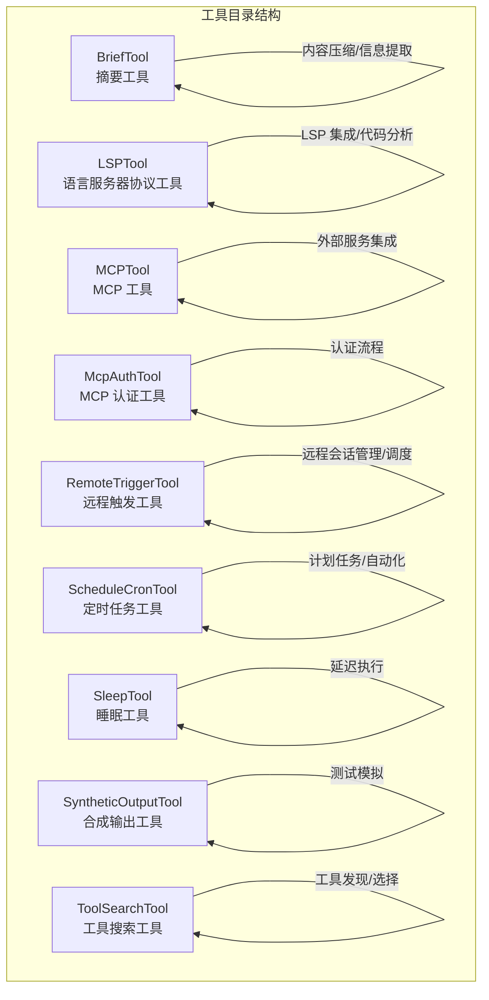
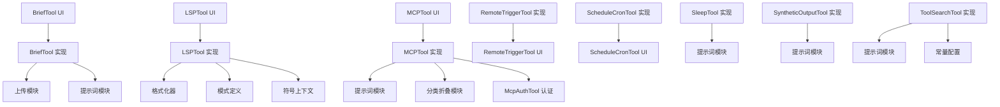
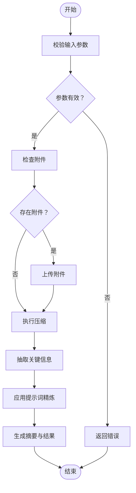
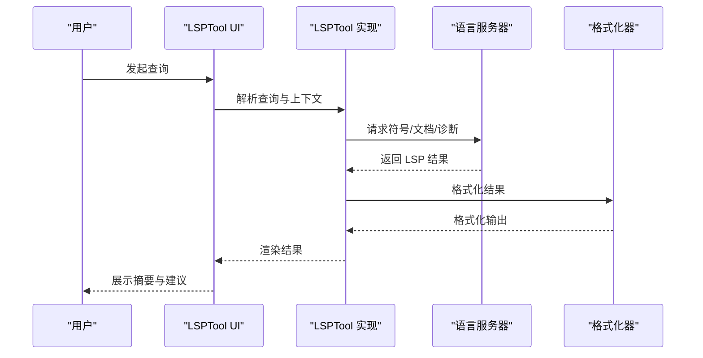
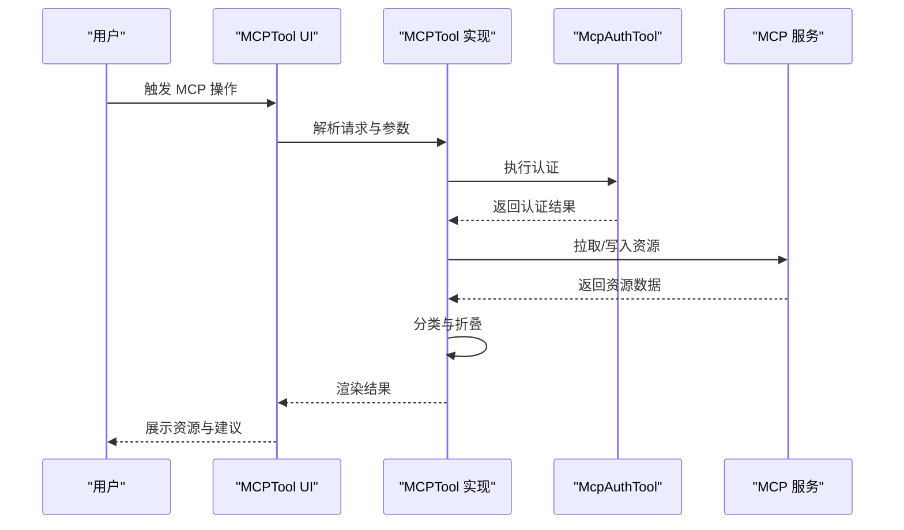
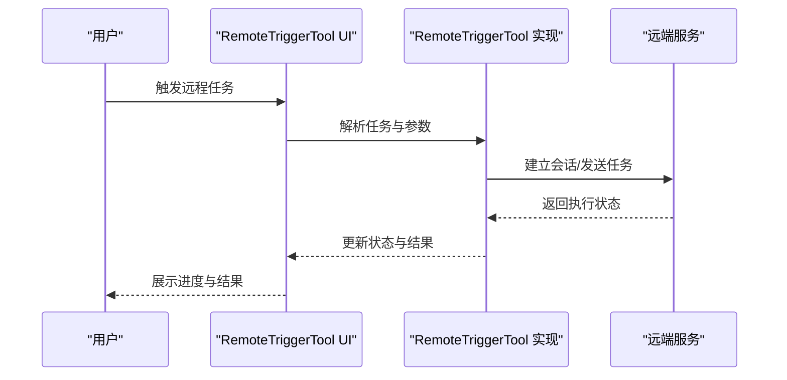
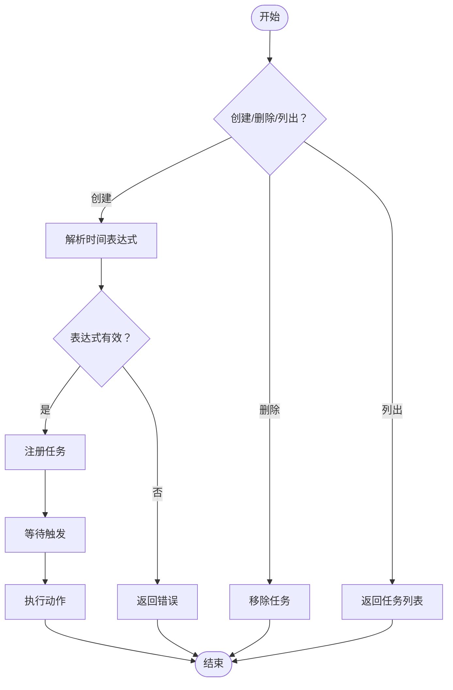
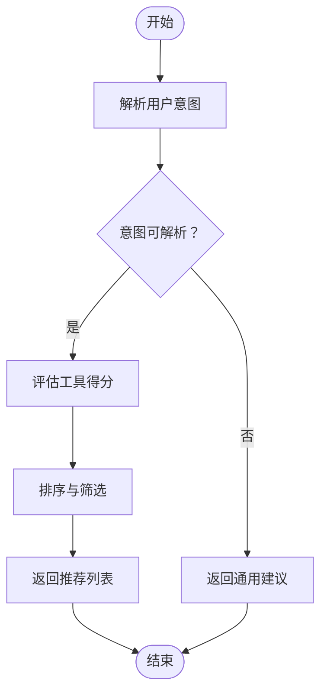
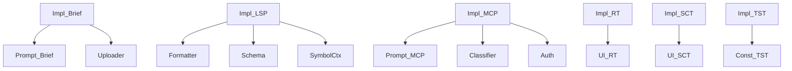

# 专用工具

<cite>
**本文引用的文件**
- [BriefTool.ts](file://src/tools/BriefTool/BriefTool.ts)
- [UI.tsx](file://src/tools/BriefTool/UI.tsx)
- [attachments.ts](file://src/tools/BriefTool/attachments.ts)
- [prompt.ts](file://src/tools/BriefTool/prompt.ts)
- [upload.ts](file://src/tools/BriefTool/upload.ts)
- [LSPTool.ts](file://src/tools/LSPTool/LSPTool.ts)
- [UI.tsx](file://src/tools/LSPTool/UI.tsx)
- [formatters.ts](file://src/tools/LSPTool/formatters.ts)
- [prompt.ts](file://src/tools/LSPTool/prompt.ts)
- [schemas.ts](file://src/tools/LSPTool/schemas.ts)
- [symbolContext.ts](file://src/tools/LSPTool/symbolContext.ts)
- [MCPTool.ts](file://src/tools/MCPTool/MCPTool.ts)
- [UI.tsx](file://src/tools/MCPTool/UI.tsx)
- [classifyForCollapse.ts](file://src/tools/MCPTool/classifyForCollapse.ts)
- [prompt.ts](file://src/tools/MCPTool/prompt.ts)
- [McpAuthTool.ts](file://src/tools/McpAuthTool/McpAuthTool.ts)
- [RemoteTriggerTool.ts](file://src/tools/RemoteTriggerTool/RemoteTriggerTool.ts)
- [UI.tsx](file://src/tools/RemoteTriggerTool/UI.tsx)
- [prompt.ts](file://src/tools/RemoteTriggerTool/prompt.ts)
- [CronCreateTool.ts](file://src/tools/ScheduleCronTool/CronCreateTool.ts)
- [CronDeleteTool.ts](file://src/tools/ScheduleCronTool/CronDeleteTool.ts)
- [CronListTool.ts](file://src/tools/ScheduleCronTool/CronListTool.ts)
- [UI.tsx](file://src/tools/ScheduleCronTool/UI.tsx)
- [prompt.ts](file://src/tools/ScheduleCronTool/prompt.ts)
- [SleepTool/prompt.ts](file://src/tools/SleepTool/prompt.ts)
- [SyntheticOutputTool.ts](file://src/tools/SyntheticOutputTool/SyntheticOutputTool.ts)
- [ToolSearchTool.ts](file://src/tools/ToolSearchTool/ToolSearchTool.ts)
- [constants.ts](file://src/tools/ToolSearchTool/constants.ts)
- [prompt.ts](file://src/tools/ToolSearchTool/prompt.ts)
</cite>

## 目录
1. [简介](#简介)
2. [项目结构](#项目结构)
3. [核心组件](#核心组件)
4. [架构总览](#架构总览)
5. [详细组件分析](#详细组件分析)
6. [依赖关系分析](#依赖关系分析)
7. [性能考虑](#性能考虑)
8. [故障排除指南](#故障排除指南)
9. [结论](#结论)
10. [附录](#附录)

## 简介
本文件系统性梳理 Claude Code 的专用工具集，围绕以下工具进行深入解析：摘要工具（BriefTool）、语言服务器协议工具（LSPTool）、MCP 工具（MCPTool、McpAuthTool）、远程触发工具（RemoteTriggerTool）、定时任务工具（ScheduleCronTool）、睡眠工具（SleepTool）、合成输出工具（SyntheticOutputTool）以及工具搜索工具（ToolSearchTool）。文档从架构、数据流、处理逻辑、集成点与错误处理等维度展开，并提供可视化图示帮助理解。

## 项目结构
这些工具均位于 src/tools 下的独立子目录中，每个工具包含实现文件、UI 组件、提示词与辅助模块。整体采用“按工具分层”的组织方式，便于维护与扩展。

**章节来源**
- [BriefTool.ts:1-200](file://src/tools/BriefTool/BriefTool.ts#L1-L200)
- [LSPTool.ts:1-200](file://src/tools/LSPTool/LSPTool.ts#L1-L200)
- [MCPTool.ts:1-200](file://src/tools/MCPTool/MCPTool.ts#L1-L200)
- [McpAuthTool.ts:1-200](file://src/tools/McpAuthTool/McpAuthTool.ts#L1-L200)
- [RemoteTriggerTool.ts:1-200](file://src/tools/RemoteTriggerTool/RemoteTriggerTool.ts#L1-L200)
- [CronCreateTool.ts:1-200](file://src/tools/ScheduleCronTool/CronCreateTool.ts#L1-L200)
- [SleepTool/prompt.ts:1-200](file://src/tools/SleepTool/prompt.ts#L1-L200)
- [SyntheticOutputTool.ts:1-200](file://src/tools/SyntheticOutputTool/SyntheticOutputTool.ts#L1-L200)
- [ToolSearchTool.ts:1-200](file://src/tools/ToolSearchTool/ToolSearchTool.ts#L1-L200)

## 核心组件
- 摘要工具（BriefTool）
  - 职责：对长文本或复杂上下文进行内容压缩与关键信息抽取，支持附件上传与交互式 UI。
  - 关键模块：实现文件负责压缩策略与调用链；UI 提供用户交互；附件模块处理上传；提示词模块定义压缩目标与格式；上传模块封装上传流程。
- 语言服务器协议工具（LSPTool）
  - 职责：集成 LSP 以提供符号检索、上下文感知、格式化与提示词生成。
  - 关键模块：实现文件承载核心逻辑；UI 展示结果；格式化器负责输出格式；模式定义约束输入输出；符号上下文用于增强分析。
- MCP 工具（MCPTool）
  - 职责：对接 MCP 外部服务，进行资源分类与折叠、提示词驱动的交互。
  - 关键模块：实现文件负责 MCP 协议交互；UI 展示；分类折叠模块优化输出；提示词模块驱动行为。
- MCP 认证工具（McpAuthTool）
  - 职责：处理 MCP 服务的认证流程，确保安全访问。
- 远程触发工具（RemoteTriggerTool）
  - 职责：管理远程会话与任务调度，协调本地与远端状态。
- 定时任务工具（ScheduleCronTool）
  - 职责：提供创建、删除、列出定时任务的能力，支持自动化执行。
- 睡眠工具（SleepTool）
  - 职责：实现延迟执行，常用于流程编排中的等待阶段。
- 合成输出工具（SyntheticOutputTool）
  - 职责：在测试或演示场景中生成可控的合成输出，便于验证工具链。
- 工具搜索工具（ToolSearchTool）
  - 职责：根据需求动态发现与选择合适的工具，提升工具使用效率。

**章节来源**
- [BriefTool.ts:1-200](file://src/tools/BriefTool/BriefTool.ts#L1-L200)
- [LSPTool.ts:1-200](file://src/tools/LSPTool/LSPTool.ts#L1-L200)
- [MCPTool.ts:1-200](file://src/tools/MCPTool/MCPTool.ts#L1-L200)
- [McpAuthTool.ts:1-200](file://src/tools/McpAuthTool/McpAuthTool.ts#L1-L200)
- [RemoteTriggerTool.ts:1-200](file://src/tools/RemoteTriggerTool/RemoteTriggerTool.ts#L1-L200)
- [CronCreateTool.ts:1-200](file://src/tools/ScheduleCronTool/CronCreateTool.ts#L1-L200)
- [SleepTool/prompt.ts:1-200](file://src/tools/SleepTool/prompt.ts#L1-L200)
- [SyntheticOutputTool.ts:1-200](file://src/tools/SyntheticOutputTool/SyntheticOutputTool.ts#L1-L200)
- [ToolSearchTool.ts:1-200](file://src/tools/ToolSearchTool/ToolSearchTool.ts#L1-L200)

## 架构总览
下图展示了各工具之间的协作关系与数据流向。工具通过统一的工具框架调用，部分工具依赖 LSP 或 MCP 等外部服务，远程触发工具贯穿本地与远端会话。

**图表来源**
- [BriefTool.ts:1-200](file://src/tools/BriefTool/BriefTool.ts#L1-L200)
- [UI.tsx:1-200](file://src/tools/BriefTool/UI.tsx#L1-L200)
- [upload.ts:1-200](file://src/tools/BriefTool/upload.ts#L1-L200)
- [prompt.ts:1-200](file://src/tools/BriefTool/prompt.ts#L1-L200)
- [LSPTool.ts:1-200](file://src/tools/LSPTool/LSPTool.ts#L1-L200)
- [UI.tsx:1-200](file://src/tools/LSPTool/UI.tsx#L1-L200)
- [formatters.ts:1-200](file://src/tools/LSPTool/formatters.ts#L1-L200)
- [schemas.ts:1-200](file://src/tools/LSPTool/schemas.ts#L1-L200)
- [symbolContext.ts:1-200](file://src/tools/LSPTool/symbolContext.ts#L1-L200)
- [MCPTool.ts:1-200](file://src/tools/MCPTool/MCPTool.ts#L1-L200)
- [UI.tsx:1-200](file://src/tools/MCPTool/UI.tsx#L1-L200)
- [classifyForCollapse.ts:1-200](file://src/tools/MCPTool/classifyForCollapse.ts#L1-L200)
- [prompt.ts:1-200](file://src/tools/MCPTool/prompt.ts#L1-L200)
- [McpAuthTool.ts:1-200](file://src/tools/McpAuthTool/McpAuthTool.ts#L1-L200)
- [RemoteTriggerTool.ts:1-200](file://src/tools/RemoteTriggerTool/RemoteTriggerTool.ts#L1-L200)
- [UI.tsx:1-200](file://src/tools/RemoteTriggerTool/UI.tsx#L1-L200)
- [prompt.ts:1-200](file://src/tools/RemoteTriggerTool/prompt.ts#L1-L200)
- [CronCreateTool.ts:1-200](file://src/tools/ScheduleCronTool/CronCreateTool.ts#L1-L200)
- [CronDeleteTool.ts:1-200](file://src/tools/ScheduleCronTool/CronDeleteTool.ts#L1-L200)
- [CronListTool.ts:1-200](file://src/tools/ScheduleCronTool/CronListTool.ts#L1-L200)
- [UI.tsx:1-200](file://src/tools/ScheduleCronTool/UI.tsx#L1-L200)
- [prompt.ts:1-200](file://src/tools/ScheduleCronTool/prompt.ts#L1-L200)
- [SleepTool/prompt.ts:1-200](file://src/tools/SleepTool/prompt.ts#L1-L200)
- [SyntheticOutputTool.ts:1-200](file://src/tools/SyntheticOutputTool/SyntheticOutputTool.ts#L1-L200)
- [ToolSearchTool.ts:1-200](file://src/tools/ToolSearchTool/ToolSearchTool.ts#L1-L200)
- [constants.ts:1-200](file://src/tools/ToolSearchTool/constants.ts#L1-L200)
- [prompt.ts:1-200](file://src/tools/ToolSearchTool/prompt.ts#L1-L200)

## 详细组件分析

### 摘要工具（BriefTool）
- 功能概述
  - 内容压缩：对长文本或复杂上下文进行压缩，保留关键信息。
  - 信息提取：识别并抽取重要片段，支持多轮对话与附件。
  - 交互式 UI：提供可视化界面，便于用户确认与调整。
  - 上传与附件：支持附件上传与预处理，增强摘要质量。
- 数据流与处理逻辑
  - 输入：原始文本、附件、用户指令。
  - 处理：压缩算法、信息抽取、提示词驱动的精炼。
  - 输出：压缩后的摘要、抽取的关键信息、可选附件。
- 错误处理
  - 输入校验失败、压缩过程异常、上传失败等均有相应兜底策略。
- 性能特性
  - 压缩算法与提示词缓存结合，减少重复计算；附件上传采用异步策略。

**图表来源**
- [BriefTool.ts:1-200](file://src/tools/BriefTool/BriefTool.ts#L1-L200)
- [attachments.ts:1-200](file://src/tools/BriefTool/attachments.ts#L1-L200)
- [upload.ts:1-200](file://src/tools/BriefTool/upload.ts#L1-L200)
- [prompt.ts:1-200](file://src/tools/BriefTool/prompt.ts#L1-L200)

**章节来源**
- [BriefTool.ts:1-200](file://src/tools/BriefTool/BriefTool.ts#L1-L200)
- [UI.tsx:1-200](file://src/tools/BriefTool/UI.tsx#L1-L200)
- [attachments.ts:1-200](file://src/tools/BriefTool/attachments.ts#L1-L200)
- [prompt.ts:1-200](file://src/tools/BriefTool/prompt.ts#L1-L200)
- [upload.ts:1-200](file://src/tools/BriefTool/upload.ts#L1-L200)

### 语言服务器协议工具（LSPTool）
- 功能概述
  - 符号检索：基于 LSP 获取符号定义与引用。
  - 上下文感知：结合符号上下文生成更精准的提示词。
  - 输出格式化：将 LSP 结果格式化为可读性强的结构。
  - 提示词驱动：通过提示词模板引导 LSP 行为。
- 数据流与处理逻辑
  - 输入：用户查询、当前文件上下文、符号范围。
  - 处理：LSP 查询、结果聚合、格式化、提示词生成。
  - 输出：结构化结果、可读摘要、建议操作。
- 错误处理
  - LSP 连接失败、超时、无结果等情况有明确回退策略。
- 性能特性
  - 使用符号上下文与模式约束，降低无效请求；格式化器复用，提高渲染效率。

**图表来源**
- [LSPTool.ts:1-200](file://src/tools/LSPTool/LSPTool.ts#L1-L200)
- [UI.tsx:1-200](file://src/tools/LSPTool/UI.tsx#L1-L200)
- [formatters.ts:1-200](file://src/tools/LSPTool/formatters.ts#L1-L200)
- [schemas.ts:1-200](file://src/tools/LSPTool/schemas.ts#L1-L200)
- [symbolContext.ts:1-200](file://src/tools/LSPTool/symbolContext.ts#L1-L200)

**章节来源**
- [LSPTool.ts:1-200](file://src/tools/LSPTool/LSPTool.ts#L1-L200)
- [UI.tsx:1-200](file://src/tools/LSPTool/UI.tsx#L1-L200)
- [formatters.ts:1-200](file://src/tools/LSPTool/formatters.ts#L1-L200)
- [schemas.ts:1-200](file://src/tools/LSPTool/schemas.ts#L1-L200)
- [symbolContext.ts:1-200](file://src/tools/LSPTool/symbolContext.ts#L1-L200)

### MCP 工具（MCPTool）与认证（McpAuthTool）
- 功能概述
  - MCP 工具：对接 MCP 外部服务，进行资源分类与折叠，驱动提示词生成。
  - 认证工具：处理 MCP 服务的认证流程，确保安全访问。
- 数据流与处理逻辑
  - 输入：MCP 服务地址、凭据、资源标识。
  - 处理：认证、资源拉取、分类折叠、提示词生成。
  - 输出：结构化资源、可执行建议、错误信息。
- 错误处理
  - 认证失败、资源不可达、权限不足等均有明确处理分支。
- 性能特性
  - 分类折叠模块减少冗余展示；认证缓存降低重复握手成本。

**图表来源**
- [MCPTool.ts:1-200](file://src/tools/MCPTool/MCPTool.ts#L1-L200)
- [UI.tsx:1-200](file://src/tools/MCPTool/UI.tsx#L1-L200)
- [classifyForCollapse.ts:1-200](file://src/tools/MCPTool/classifyForCollapse.ts#L1-L200)
- [prompt.ts:1-200](file://src/tools/MCPTool/prompt.ts#L1-L200)
- [McpAuthTool.ts:1-200](file://src/tools/McpAuthTool/McpAuthTool.ts#L1-L200)

**章节来源**
- [MCPTool.ts:1-200](file://src/tools/MCPTool/MCPTool.ts#L1-L200)
- [UI.tsx:1-200](file://src/tools/MCPTool/UI.tsx#L1-L200)
- [classifyForCollapse.ts:1-200](file://src/tools/MCPTool/classifyForCollapse.ts#L1-L200)
- [prompt.ts:1-200](file://src/tools/MCPTool/prompt.ts#L1-L200)
- [McpAuthTool.ts:1-200](file://src/tools/McpAuthTool/McpAuthTool.ts#L1-L200)

### 远程触发工具（RemoteTriggerTool）
- 功能概述
  - 管理远程会话：建立、保持与远端的连接。
  - 任务调度：在远端执行特定任务，协调本地与远端状态。
  - 交互式 UI：提供可视化面板，便于监控与控制。
- 数据流与处理逻辑
  - 输入：触发条件、远端配置、任务参数。
  - 处理：会话初始化、任务派发、状态同步。
  - 输出：执行结果、日志、错误信息。
- 错误处理
  - 连接中断、任务失败、权限问题等均有恢复与重试机制。
- 性能特性
  - 异步调度与状态缓存，降低轮询开销。

**图表来源**
- [RemoteTriggerTool.ts:1-200](file://src/tools/RemoteTriggerTool/RemoteTriggerTool.ts#L1-L200)
- [UI.tsx:1-200](file://src/tools/RemoteTriggerTool/UI.tsx#L1-L200)
- [prompt.ts:1-200](file://src/tools/RemoteTriggerTool/prompt.ts#L1-L200)

**章节来源**
- [RemoteTriggerTool.ts:1-200](file://src/tools/RemoteTriggerTool/RemoteTriggerTool.ts#L1-L200)
- [UI.tsx:1-200](file://src/tools/RemoteTriggerTool/UI.tsx#L1-L200)
- [prompt.ts:1-200](file://src/tools/RemoteTriggerTool/prompt.ts#L1-L200)

### 定时任务工具（ScheduleCronTool）
- 功能概述
  - 创建定时任务：定义时间表达式与执行动作。
  - 删除定时任务：移除不再需要的任务。
  - 列出定时任务：查看当前所有已注册任务。
  - 自动化执行：在指定时间自动触发相关动作。
- 数据流与处理逻辑
  - 输入：时间表达式、动作参数、任务 ID。
  - 处理：解析表达式、注册任务、调度执行。
  - 输出：任务列表、执行记录、错误信息。
- 错误处理
  - 表达式非法、执行失败、并发冲突等有明确处理。
- 性能特性
  - 基于事件驱动的调度器，低开销运行。

**图表来源**
- [CronCreateTool.ts:1-200](file://src/tools/ScheduleCronTool/CronCreateTool.ts#L1-L200)
- [CronDeleteTool.ts:1-200](file://src/tools/ScheduleCronTool/CronDeleteTool.ts#L1-L200)
- [CronListTool.ts:1-200](file://src/tools/ScheduleCronTool/CronListTool.ts#L1-L200)
- [UI.tsx:1-200](file://src/tools/ScheduleCronTool/UI.tsx#L1-L200)
- [prompt.ts:1-200](file://src/tools/ScheduleCronTool/prompt.ts#L1-L200)

**章节来源**
- [CronCreateTool.ts:1-200](file://src/tools/ScheduleCronTool/CronCreateTool.ts#L1-L200)
- [CronDeleteTool.ts:1-200](file://src/tools/ScheduleCronTool/CronDeleteTool.ts#L1-L200)
- [CronListTool.ts:1-200](file://src/tools/ScheduleCronTool/CronListTool.ts#L1-L200)
- [UI.tsx:1-200](file://src/tools/ScheduleCronTool/UI.tsx#L1-L200)
- [prompt.ts:1-200](file://src/tools/ScheduleCronTool/prompt.ts#L1-L200)

### 睡眠工具（SleepTool）
- 功能概述
  - 延迟执行：在工具链中插入等待阶段，常用于异步流程或限速控制。
- 数据流与处理逻辑
  - 输入：等待时长。
  - 处理：计时等待。
  - 输出：完成信号。
- 错误处理
  - 参数非法、中断等有明确处理。
- 性能特性
  - 轻量级实现，避免阻塞主线程。

**章节来源**
- [SleepTool/prompt.ts:1-200](file://src/tools/SleepTool/prompt.ts#L1-L200)

### 合成输出工具（SyntheticOutputTool）
- 功能概述
  - 测试模拟：生成可控的合成输出，便于测试工具链与验证行为。
- 数据流与处理逻辑
  - 输入：模拟参数。
  - 处理：生成固定或随机输出。
  - 输出：模拟结果。
- 错误处理
  - 参数校验失败、生成异常等有兜底。
- 性能特性
  - 快速生成，适合批量测试。

**章节来源**
- [SyntheticOutputTool.ts:1-200](file://src/tools/SyntheticOutputTool/SyntheticOutputTool.ts#L1-L200)

### 工具搜索工具（ToolSearchTool）
- 功能概述
  - 工具发现：根据用户意图与上下文，自动发现可用工具。
  - 工具选择：评估工具能力与适用性，推荐最佳选项。
- 数据流与处理逻辑
  - 输入：用户意图、上下文、工具清单。
  - 处理：意图解析、工具评分、排序与推荐。
  - 输出：推荐工具列表与理由。
- 错误处理
  - 意图无法解析、工具不可用等有降级策略。
- 性能特性
  - 基于常量配置与快速评分，响应迅速。

**图表来源**
- [ToolSearchTool.ts:1-200](file://src/tools/ToolSearchTool/ToolSearchTool.ts#L1-L200)
- [constants.ts:1-200](file://src/tools/ToolSearchTool/constants.ts#L1-L200)
- [prompt.ts:1-200](file://src/tools/ToolSearchTool/prompt.ts#L1-L200)

**章节来源**
- [ToolSearchTool.ts:1-200](file://src/tools/ToolSearchTool/ToolSearchTool.ts#L1-L200)
- [constants.ts:1-200](file://src/tools/ToolSearchTool/constants.ts#L1-L200)
- [prompt.ts:1-200](file://src/tools/ToolSearchTool/prompt.ts#L1-L200)

## 依赖关系分析
- 组件内聚与耦合
  - 各工具内部模块职责清晰，UI、实现、提示词与辅助模块分离，内聚度高。
  - 工具间通过统一的工具框架耦合，避免直接交叉依赖。
- 外部依赖
  - LSPTool 依赖语言服务器生态；MCP 工具依赖 MCP 服务；RemoteTriggerTool 依赖远端会话；ScheduleCronTool 依赖调度器。
- 循环依赖
  - 当前设计未见循环依赖迹象，模块边界清晰。

**图表来源**
- [BriefTool.ts:1-200](file://src/tools/BriefTool/BriefTool.ts#L1-L200)
- [prompt.ts:1-200](file://src/tools/BriefTool/prompt.ts#L1-L200)
- [upload.ts:1-200](file://src/tools/BriefTool/upload.ts#L1-L200)
- [LSPTool.ts:1-200](file://src/tools/LSPTool/LSPTool.ts#L1-L200)
- [formatters.ts:1-200](file://src/tools/LSPTool/formatters.ts#L1-L200)
- [schemas.ts:1-200](file://src/tools/LSPTool/schemas.ts#L1-L200)
- [symbolContext.ts:1-200](file://src/tools/LSPTool/symbolContext.ts#L1-L200)
- [MCPTool.ts:1-200](file://src/tools/MCPTool/MCPTool.ts#L1-L200)
- [prompt.ts:1-200](file://src/tools/MCPTool/prompt.ts#L1-L200)
- [classifyForCollapse.ts:1-200](file://src/tools/MCPTool/classifyForCollapse.ts#L1-L200)
- [McpAuthTool.ts:1-200](file://src/tools/McpAuthTool/McpAuthTool.ts#L1-L200)
- [RemoteTriggerTool.ts:1-200](file://src/tools/RemoteTriggerTool/RemoteTriggerTool.ts#L1-L200)
- [UI.tsx:1-200](file://src/tools/RemoteTriggerTool/UI.tsx#L1-L200)
- [CronCreateTool.ts:1-200](file://src/tools/ScheduleCronTool/CronCreateTool.ts#L1-L200)
- [CronDeleteTool.ts:1-200](file://src/tools/ScheduleCronTool/CronDeleteTool.ts#L1-L200)
- [CronListTool.ts:1-200](file://src/tools/ScheduleCronTool/CronListTool.ts#L1-L200)
- [UI.tsx:1-200](file://src/tools/ScheduleCronTool/UI.tsx#L1-L200)
- [ToolSearchTool.ts:1-200](file://src/tools/ToolSearchTool/ToolSearchTool.ts#L1-L200)
- [constants.ts:1-200](file://src/tools/ToolSearchTool/constants.ts#L1-L200)

**章节来源**
- [BriefTool.ts:1-200](file://src/tools/BriefTool/BriefTool.ts#L1-L200)
- [LSPTool.ts:1-200](file://src/tools/LSPTool/LSPTool.ts#L1-L200)
- [MCPTool.ts:1-200](file://src/tools/MCPTool/MCPTool.ts#L1-L200)
- [McpAuthTool.ts:1-200](file://src/tools/McpAuthTool/McpAuthTool.ts#L1-L200)
- [RemoteTriggerTool.ts:1-200](file://src/tools/RemoteTriggerTool/RemoteTriggerTool.ts#L1-L200)
- [CronCreateTool.ts:1-200](file://src/tools/ScheduleCronTool/CronCreateTool.ts#L1-L200)
- [ToolSearchTool.ts:1-200](file://src/tools/ToolSearchTool/ToolSearchTool.ts#L1-L200)

## 性能考虑
- 压缩与格式化
  - 采用缓存与增量更新策略，减少重复计算。
- LSP 交互
  - 使用符号上下文与模式约束，降低请求频率；格式化器复用，提升渲染效率。
- MCP 交互
  - 认证缓存与分类折叠减少网络与渲染开销。
- 远程触发
  - 异步调度与状态缓存，降低轮询与阻塞。
- 定时任务
  - 基于事件驱动的调度器，低开销运行。
- 睡眠与合成输出
  - 轻量实现，避免阻塞主线程；合成输出快速生成，适合批量测试。

## 故障排除指南
- 摘要工具
  - 输入校验失败：检查参数类型与长度；必要时启用默认值。
  - 压缩异常：切换压缩策略或禁用附件；查看日志定位问题。
  - 上传失败：检查网络与权限；重试或改用其他存储。
- LSP 工具
  - 连接失败：检查语言服务器状态与配置；重启服务。
  - 结果为空：扩大查询范围或调整提示词；确认文件是否被索引。
- MCP 工具
  - 认证失败：重新登录或刷新令牌；检查服务端配置。
  - 权限不足：确认 MCP 服务授权范围；申请更高权限。
- 远程触发工具
  - 会话断开：重连并同步状态；检查网络与防火墙。
  - 任务失败：查看远端日志；重试或调整参数。
- 定时任务工具
  - 表达式非法：修正 Cron 表达式；参考标准语法。
  - 并发冲突：调整任务间隔或互斥策略。
- 睡眠与合成输出工具
  - 参数非法：检查时长或模拟参数；使用默认值。
  - 中断：捕获中断信号并优雅退出。

**章节来源**
- [BriefTool.ts:1-200](file://src/tools/BriefTool/BriefTool.ts#L1-L200)
- [LSPTool.ts:1-200](file://src/tools/LSPTool/LSPTool.ts#L1-L200)
- [MCPTool.ts:1-200](file://src/tools/MCPTool/MCPTool.ts#L1-L200)
- [McpAuthTool.ts:1-200](file://src/tools/McpAuthTool/McpAuthTool.ts#L1-L200)
- [RemoteTriggerTool.ts:1-200](file://src/tools/RemoteTriggerTool/RemoteTriggerTool.ts#L1-L200)
- [CronCreateTool.ts:1-200](file://src/tools/ScheduleCronTool/CronCreateTool.ts#L1-L200)
- [SleepTool/prompt.ts:1-200](file://src/tools/SleepTool/prompt.ts#L1-L200)
- [SyntheticOutputTool.ts:1-200](file://src/tools/SyntheticOutputTool/SyntheticOutputTool.ts#L1-L200)
- [ToolSearchTool.ts:1-200](file://src/tools/ToolSearchTool/ToolSearchTool.ts#L1-L200)

## 结论
本文档系统性梳理了 Claude Code 的专用工具集，覆盖摘要、LSP、MCP、远程触发、定时任务、睡眠、合成输出与工具搜索等工具。通过对实现、UI、提示词与辅助模块的分析，明确了各工具的功能边界、数据流与处理逻辑，并提供了可视化图示与故障排除建议。这些工具共同构成了一个可扩展、可维护且高性能的工具体系，适用于复杂开发场景下的自动化与智能化需求。

## 附录
- 参考文件路径
  - 摘要工具：[BriefTool.ts:1-200](file://src/tools/BriefTool/BriefTool.ts#L1-L200)、[UI.tsx:1-200](file://src/tools/BriefTool/UI.tsx#L1-L200)、[attachments.ts:1-200](file://src/tools/BriefTool/attachments.ts#L1-L200)、[prompt.ts:1-200](file://src/tools/BriefTool/prompt.ts#L1-L200)、[upload.ts:1-200](file://src/tools/BriefTool/upload.ts#L1-L200)
  - LSP 工具：[LSPTool.ts:1-200](file://src/tools/LSPTool/LSPTool.ts#L1-L200)、[UI.tsx:1-200](file://src/tools/LSPTool/UI.tsx#L1-L200)、[formatters.ts:1-200](file://src/tools/LSPTool/formatters.ts#L1-L200)、[schemas.ts:1-200](file://src/tools/LSPTool/schemas.ts#L1-L200)、[symbolContext.ts:1-200](file://src/tools/LSPTool/symbolContext.ts#L1-L200)
  - MCP 工具：[MCPTool.ts:1-200](file://src/tools/MCPTool/MCPTool.ts#L1-L200)、[UI.tsx:1-200](file://src/tools/MCPTool/UI.tsx#L1-L200)、[classifyForCollapse.ts:1-200](file://src/tools/MCPTool/classifyForCollapse.ts#L1-L200)、[prompt.ts:1-200](file://src/tools/MCPTool/prompt.ts#L1-L200)
  - MCP 认证：[McpAuthTool.ts:1-200](file://src/tools/McpAuthTool/McpAuthTool.ts#L1-L200)
  - 远程触发：[RemoteTriggerTool.ts:1-200](file://src/tools/RemoteTriggerTool/RemoteTriggerTool.ts#L1-L200)、[UI.tsx:1-200](file://src/tools/RemoteTriggerTool/UI.tsx#L1-L200)、[prompt.ts:1-200](file://src/tools/RemoteTriggerTool/prompt.ts#L1-L200)
  - 定时任务：[CronCreateTool.ts:1-200](file://src/tools/ScheduleCronTool/CronCreateTool.ts#L1-L200)、[CronDeleteTool.ts:1-200](file://src/tools/ScheduleCronTool/CronDeleteTool.ts#L1-L200)、[CronListTool.ts:1-200](file://src/tools/ScheduleCronTool/CronListTool.ts#L1-L200)、[UI.tsx:1-200](file://src/tools/ScheduleCronTool/UI.tsx#L1-L200)、[prompt.ts:1-200](file://src/tools/ScheduleCronTool/prompt.ts#L1-L200)
  - 睡眠：[SleepTool/prompt.ts:1-200](file://src/tools/SleepTool/prompt.ts#L1-L200)
  - 合成输出：[SyntheticOutputTool.ts:1-200](file://src/tools/SyntheticOutputTool/SyntheticOutputTool.ts#L1-L200)
  - 工具搜索：[ToolSearchTool.ts:1-200](file://src/tools/ToolSearchTool/ToolSearchTool.ts#L1-L200)、[constants.ts:1-200](file://src/tools/ToolSearchTool/constants.ts#L1-L200)、[prompt.ts:1-200](file://src/tools/ToolSearchTool/prompt.ts#L1-L200)