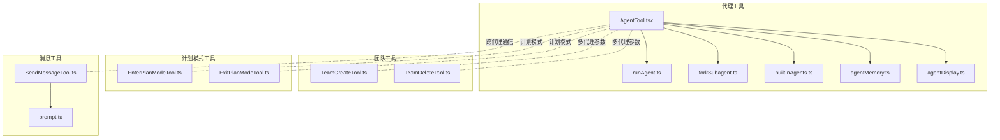
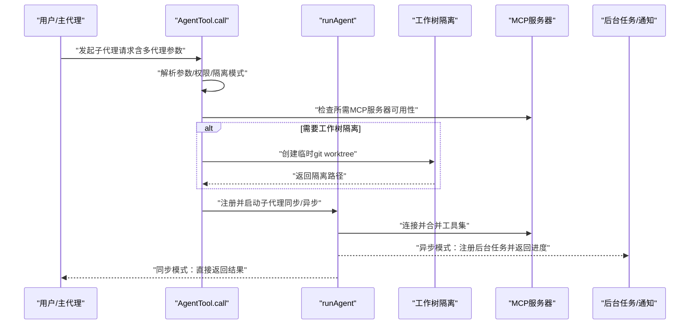
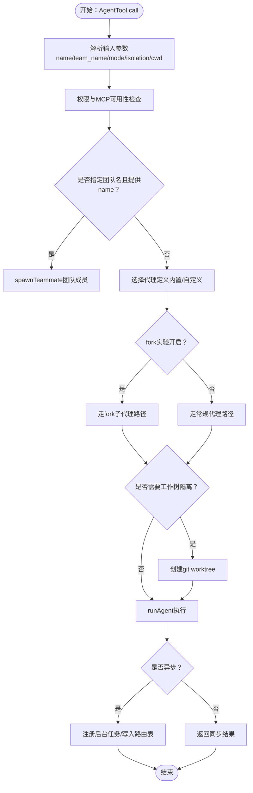
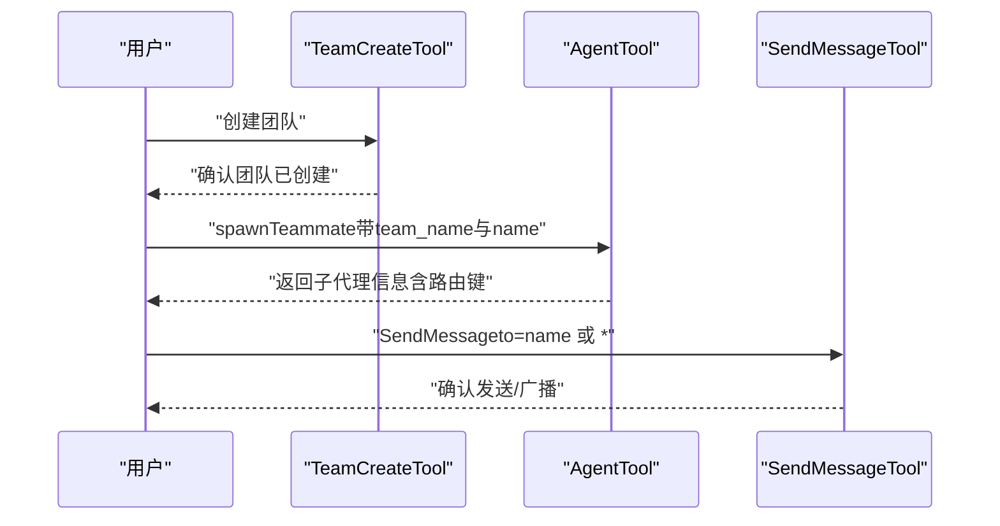
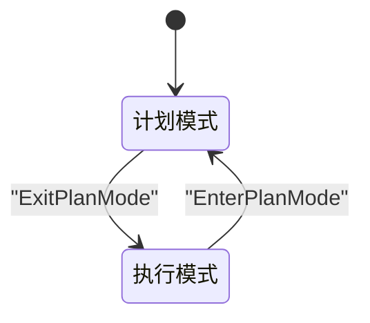
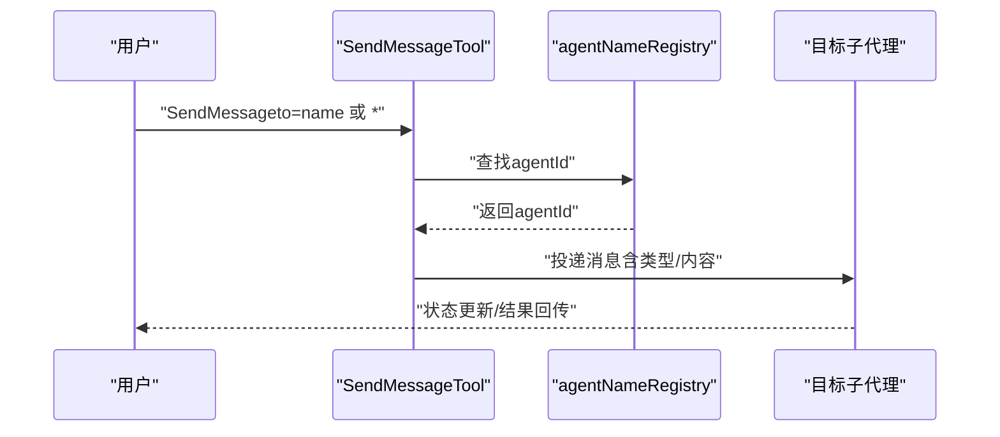
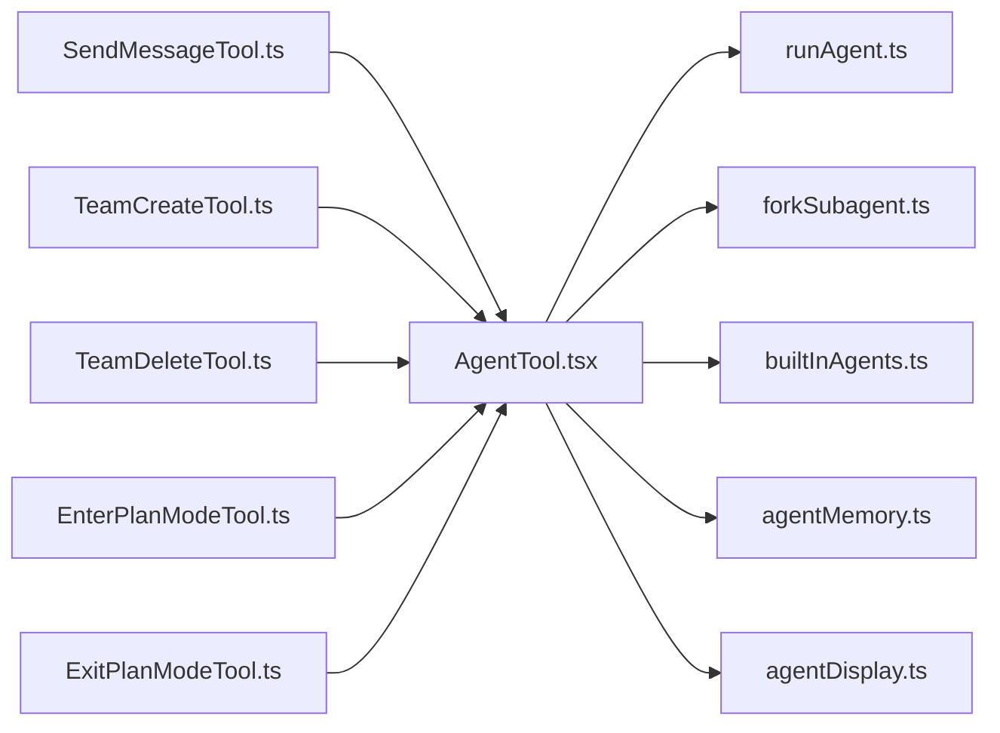

# 代理和团队工具

<cite>
**本文引用的文件**
- [AgentTool.tsx](file://src/tools/AgentTool/AgentTool.tsx)
- [runAgent.ts](file://src/tools/AgentTool/runAgent.ts)
- [forkSubagent.ts](file://src/tools/AgentTool/forkSubagent.ts)
- [builtInAgents.ts](file://src/tools/AgentTool/builtInAgents.ts)
- [agentMemory.ts](file://src/tools/AgentTool/agentMemory.ts)
- [agentDisplay.ts](file://src/tools/AgentTool/agentDisplay.ts)
- [TeamCreateTool.ts](file://src/tools/TeamCreateTool/TeamCreateTool.ts)
- [TeamDeleteTool.ts](file://src/tools/TeamDeleteTool/TeamDeleteTool.ts)
- [EnterPlanModeTool.ts](file://src/tools/EnterPlanModeTool/EnterPlanModeTool.ts)
- [ExitPlanModeTool.ts](file://src/tools/ExitPlanModeTool/ExitPlanModeTool.ts)
- [SendMessageTool.ts](file://src/tools/SendMessageTool/SendMessageTool.ts)
- [prompt.ts](file://src/tools/SendMessageTool/prompt.ts)
</cite>

## 目录
1. [简介](#简介)
2. [项目结构](#项目结构)
3. [核心组件](#核心组件)
4. [架构总览](#架构总览)
5. [详细组件分析](#详细组件分析)
6. [依赖关系分析](#依赖关系分析)
7. [性能考量](#性能考量)
8. [故障排查指南](#故障排查指南)
9. [结论](#结论)
10. [附录](#附录)

## 简介
本文件面向Claude Code的“代理与团队工具”，系统性阐述以下能力：
- 代理工具（AgentTool）的多代理架构、子代理创建与管理机制
- 团队创建/删除工具（TeamCreateTool、TeamDeleteTool）的团队管理与成员协作
- 计划模式工具（EnterPlanModeTool、ExitPlanModeTool）的决策制定与执行监督
- 消息发送工具（SendMessageTool）的跨代理通信与状态同步
- 代理间协作模式、团队工作流设计与多代理协调的最佳实践

目标是帮助读者在不深入源码的前提下理解整体设计，并在实践中高效、安全地使用这些工具。

## 项目结构
围绕“代理与团队工具”的相关代码主要位于 src/tools 下的 AgentTool、TeamCreateTool、TeamDeleteTool、EnterPlanModeTool、ExitPlanModeTool 与 SendMessageTool 目录中；同时，AgentTool 的运行时实现位于 runAgent.ts，以及 fork 子代理支持位于 forkSubagent.ts。团队与计划模式工具的交互通过 AgentTool 的多代理参数（如 name、team_name、mode）实现。

**图表来源**
- [AgentTool.tsx:196-580](file://src/tools/AgentTool/AgentTool.tsx#L196-L580)
- [runAgent.ts:248-800](file://src/tools/AgentTool/runAgent.ts#L248-L800)
- [forkSubagent.ts:1-211](file://src/tools/AgentTool/forkSubagent.ts#L1-L211)
- [builtInAgents.ts:1-73](file://src/tools/AgentTool/builtInAgents.ts#L1-L73)
- [agentMemory.ts:1-178](file://src/tools/AgentTool/agentMemory.ts#L1-L178)
- [agentDisplay.ts:1-105](file://src/tools/AgentTool/agentDisplay.ts#L1-L105)
- [TeamCreateTool.ts](file://src/tools/TeamCreateTool/TeamCreateTool.ts)
- [TeamDeleteTool.ts](file://src/tools/TeamDeleteTool/TeamDeleteTool.ts)
- [EnterPlanModeTool.ts](file://src/tools/EnterPlanModeTool/EnterPlanModeTool.ts)
- [ExitPlanModeTool.ts](file://src/tools/ExitPlanModeTool/ExitPlanModeTool.ts)
- [SendMessageTool.ts:520-569](file://src/tools/SendMessageTool/SendMessageTool.ts#L520-L569)
- [prompt.ts:1-34](file://src/tools/SendMessageTool/prompt.ts#L1-L34)

**章节来源**
- [AgentTool.tsx:196-580](file://src/tools/AgentTool/AgentTool.tsx#L196-L580)
- [runAgent.ts:248-800](file://src/tools/AgentTool/runAgent.ts#L248-L800)
- [forkSubagent.ts:1-211](file://src/tools/AgentTool/forkSubagent.ts#L1-L211)
- [builtInAgents.ts:1-73](file://src/tools/AgentTool/builtInAgents.ts#L1-L73)
- [agentMemory.ts:1-178](file://src/tools/AgentTool/agentMemory.ts#L1-L178)
- [agentDisplay.ts:1-105](file://src/tools/AgentTool/agentDisplay.ts#L1-L105)
- [TeamCreateTool.ts](file://src/tools/TeamCreateTool/TeamCreateTool.ts)
- [TeamDeleteTool.ts](file://src/tools/TeamDeleteTool/TeamDeleteTool.ts)
- [EnterPlanModeTool.ts](file://src/tools/EnterPlanModeTool/EnterPlanModeTool.ts)
- [ExitPlanModeTool.ts](file://src/tools/ExitPlanModeTool/ExitPlanModeTool.ts)
- [SendMessageTool.ts:520-569](file://src/tools/SendMessageTool/SendMessageTool.ts#L520-L569)
- [prompt.ts:1-34](file://src/tools/SendMessageTool/prompt.ts#L1-L34)

## 核心组件
- 代理工具（AgentTool）
  - 支持同步/异步子代理创建，具备工作树隔离、MCP服务器注入、权限模式继承与覆盖、进度追踪与摘要等能力
  - 提供 fork 子代理路径以实现缓存友好的上下文继承与并发执行
- 团队工具（TeamCreateTool、TeamDeleteTool）
  - 基于 AgentTool 的多代理参数（team_name、name、mode）实现团队成员注册与路由
- 计划模式工具（EnterPlanModeTool、ExitPlanModeTool）
  - 在“计划-执行”两阶段之间切换，结合权限模式要求（如“计划模式”需要审批）进行协作
- 消息发送工具（SendMessageTool）
  - 实现跨代理通信与状态同步，支持按名称或广播发送消息

**章节来源**
- [AgentTool.tsx:239-316](file://src/tools/AgentTool/AgentTool.tsx#L239-L316)
- [runAgent.ts:248-800](file://src/tools/AgentTool/runAgent.ts#L248-L800)
- [forkSubagent.ts:18-90](file://src/tools/AgentTool/forkSubagent.ts#L18-L90)
- [TeamCreateTool.ts](file://src/tools/TeamCreateTool/TeamCreateTool.ts)
- [TeamDeleteTool.ts](file://src/tools/TeamDeleteTool/TeamDeleteTool.ts)
- [EnterPlanModeTool.ts](file://src/tools/EnterPlanModeTool/EnterPlanModeTool.ts)
- [ExitPlanModeTool.ts](file://src/tools/ExitPlanModeTool/ExitPlanModeTool.ts)
- [SendMessageTool.ts:520-569](file://src/tools/SendMessageTool/SendMessageTool.ts#L520-L569)

## 架构总览
下图展示了从调用 AgentTool 到子代理运行、再到可选的 fork 子代理与工作树隔离的整体流程。

**图表来源**
- [AgentTool.tsx:318-580](file://src/tools/AgentTool/AgentTool.tsx#L318-L580)
- [runAgent.ts:648-742](file://src/tools/AgentTool/runAgent.ts#L648-L742)
- [forkSubagent.ts:205-211](file://src/tools/AgentTool/forkSubagent.ts#L205-L211)

**章节来源**
- [AgentTool.tsx:318-580](file://src/tools/AgentTool/AgentTool.tsx#L318-L580)
- [runAgent.ts:648-742](file://src/tools/AgentTool/runAgent.ts#L648-L742)
- [forkSubagent.ts:205-211](file://src/tools/AgentTool/forkSubagent.ts#L205-L211)

## 详细组件分析

### 代理工具（AgentTool）：多代理架构与子代理管理
- 多代理参数
  - name：子代理命名，用于 SendMessage 路由与识别
  - team_name：团队上下文，未设置时继承当前会话团队
  - mode：权限模式（如“计划模式”需审批）
  - isolation：隔离模式（worktree/remote），cwd 与 isolation 互斥
- 权限与MCP校验
  - 运行前对所需 MCP 服务器进行可用性检查，必要时等待连接完成
  - 基于工具权限上下文过滤可用代理类型，避免被拒绝的代理类型
- 异步与同步执行
  - 异步：注册后台任务，写入 agentNameRegistry，便于后续 SendMessage 定位
  - 同步：直接在当前轮次内执行，适合短任务
- fork 子代理
  - 当 subagent_type 未指定且实验开启时，触发隐式 fork
  - fork 子代理继承父代理完整系统提示与对话历史，保持缓存友好
- 工作树隔离
  - 创建独立 git worktree，隔离文件修改；完成后根据变更情况清理或保留
- 内置代理与显示
  - 内置代理列表动态生成，支持按入口点与特性开关控制
  - 显示层提供来源分组与覆盖标注，便于用户理解代理来源优先级

**图表来源**
- [AgentTool.tsx:239-316](file://src/tools/AgentTool/AgentTool.tsx#L239-L316)
- [AgentTool.tsx:318-580](file://src/tools/AgentTool/AgentTool.tsx#L318-L580)
- [runAgent.ts:248-800](file://src/tools/AgentTool/runAgent.ts#L248-L800)
- [forkSubagent.ts:18-90](file://src/tools/AgentTool/forkSubagent.ts#L18-L90)

**章节来源**
- [AgentTool.tsx:239-316](file://src/tools/AgentTool/AgentTool.tsx#L239-L316)
- [AgentTool.tsx:318-580](file://src/tools/AgentTool/AgentTool.tsx#L318-L580)
- [runAgent.ts:248-800](file://src/tools/AgentTool/runAgent.ts#L248-L800)
- [forkSubagent.ts:18-90](file://src/tools/AgentTool/forkSubagent.ts#L18-L90)
- [builtInAgents.ts:22-72](file://src/tools/AgentTool/builtInAgents.ts#L22-L72)
- [agentDisplay.ts:24-72](file://src/tools/AgentTool/agentDisplay.ts#L24-L72)
- [agentMemory.ts:52-114](file://src/tools/AgentTool/agentMemory.ts#L52-L114)

### 团队创建与删除工具（TeamCreateTool、TeamDeleteTool）
- 团队创建
  - 通过 TeamCreateTool 创建团队，通常与 AgentTool 的 team_name 参数配合使用
  - 团队成员在 AgentTool 中通过 name 注册到 agentNameRegistry，便于 SendMessage 定位
- 团队删除
  - TeamDeleteTool 删除团队，清理相关路由与状态
- 协作要点
  - 团队成员必须在同一团队上下文中，name 必须唯一
  - 团队模式下，SendMessage 可按名称定向或广播给所有成员

**图表来源**
- [TeamCreateTool.ts](file://src/tools/TeamCreateTool/TeamCreateTool.ts)
- [TeamDeleteTool.ts](file://src/tools/TeamDeleteTool/TeamDeleteTool.ts)
- [AgentTool.tsx:284-316](file://src/tools/AgentTool/AgentTool.tsx#L284-L316)
- [SendMessageTool.ts:520-569](file://src/tools/SendMessageTool/SendMessageTool.ts#L520-L569)

**章节来源**
- [TeamCreateTool.ts](file://src/tools/TeamCreateTool/TeamCreateTool.ts)
- [TeamDeleteTool.ts](file://src/tools/TeamDeleteTool/TeamDeleteTool.ts)
- [AgentTool.tsx:284-316](file://src/tools/AgentTool/AgentTool.tsx#L284-L316)
- [SendMessageTool.ts:520-569](file://src/tools/SendMessageTool/SendMessageTool.ts#L520-L569)

### 计划模式工具（EnterPlanModeTool、ExitPlanModeTool）
- EnterPlanModeTool
  - 进入计划模式，要求团队成员先制定计划并获得批准
  - 在某些通道环境下可能禁用，避免阻塞非TUI场景
- ExitPlanModeTool
  - 退出计划模式，开始执行编码/操作
  - 对于团队场景，可能由团队负责人在邮箱中进行审批
- 协作流程
  - 先计划后执行，减少不必要的变更与冲突
  - 通过 mode 参数（如“计划模式”）约束子代理行为

**图表来源**
- [EnterPlanModeTool.ts](file://src/tools/EnterPlanModeTool/EnterPlanModeTool.ts)
- [ExitPlanModeTool.ts](file://src/tools/ExitPlanModeTool/ExitPlanModeTool.ts)

**章节来源**
- [EnterPlanModeTool.ts](file://src/tools/EnterPlanModeTool/EnterPlanModeTool.ts)
- [ExitPlanModeTool.ts](file://src/tools/ExitPlanModeTool/ExitPlanModeTool.ts)

### 消息发送工具（SendMessageTool）：跨代理通信与状态同步
- 功能
  - 发送消息给指定子代理（按 name）、广播给所有队友或跨会话（UDS/Bridge）
  - 自动推断消息类型（message、broadcast、approve、feedback 等）
- 输入与提示
  - prompt.ts 提供清晰的输入示例与说明，包括跨会话通信方式
- 后端路由
  - 依赖 AgentTool 在异步模式下注册的 agentNameRegistry，将 name 解析为 agentId
- 适用场景
  - 分配任务、同步进度、请求审批、跨节点状态同步

**图表来源**
- [SendMessageTool.ts:520-569](file://src/tools/SendMessageTool/SendMessageTool.ts#L520-L569)
- [prompt.ts:1-34](file://src/tools/SendMessageTool/prompt.ts#L1-L34)
- [AgentTool.tsx:700-712](file://src/tools/AgentTool/AgentTool.tsx#L700-L712)

**章节来源**
- [SendMessageTool.ts:520-569](file://src/tools/SendMessageTool/SendMessageTool.ts#L520-L569)
- [prompt.ts:1-34](file://src/tools/SendMessageTool/prompt.ts#L1-L34)
- [AgentTool.tsx:700-712](file://src/tools/AgentTool/AgentTool.tsx#L700-L712)

## 依赖关系分析
- AgentTool 对 runAgent 的依赖
  - runAgent 负责实际的查询循环、工具装配、MCP服务器初始化、权限上下文与会话钩子注册
- forkSubagent 与 AgentTool 的耦合
  - fork 子代理路径通过 buildForkedMessages 维持缓存友好；isForkSubagentEnabled 控制实验开关
- 团队与计划模式对 AgentTool 的扩展
  - 通过 team_name/name/mode 参数与计划模式工具共同实现协作编排
- SendMessageTool 与 AgentTool 的集成
  - 依赖 agentNameRegistry 实现名称到 agentId 的映射

**图表来源**
- [AgentTool.tsx:196-580](file://src/tools/AgentTool/AgentTool.tsx#L196-L580)
- [runAgent.ts:248-800](file://src/tools/AgentTool/runAgent.ts#L248-L800)
- [forkSubagent.ts:1-211](file://src/tools/AgentTool/forkSubagent.ts#L1-L211)
- [builtInAgents.ts:1-73](file://src/tools/AgentTool/builtInAgents.ts#L1-L73)
- [agentMemory.ts:1-178](file://src/tools/AgentTool/agentMemory.ts#L1-L178)
- [agentDisplay.ts:1-105](file://src/tools/AgentTool/agentDisplay.ts#L1-L105)
- [SendMessageTool.ts:520-569](file://src/tools/SendMessageTool/SendMessageTool.ts#L520-L569)
- [TeamCreateTool.ts](file://src/tools/TeamCreateTool/TeamCreateTool.ts)
- [TeamDeleteTool.ts](file://src/tools/TeamDeleteTool/TeamDeleteTool.ts)
- [EnterPlanModeTool.ts](file://src/tools/EnterPlanModeTool/EnterPlanModeTool.ts)
- [ExitPlanModeTool.ts](file://src/tools/ExitPlanModeTool/ExitPlanModeTool.ts)

**章节来源**
- [AgentTool.tsx:196-580](file://src/tools/AgentTool/AgentTool.tsx#L196-L580)
- [runAgent.ts:248-800](file://src/tools/AgentTool/runAgent.ts#L248-L800)
- [forkSubagent.ts:1-211](file://src/tools/AgentTool/forkSubagent.ts#L1-L211)
- [builtInAgents.ts:1-73](file://src/tools/AgentTool/builtInAgents.ts#L1-L73)
- [agentMemory.ts:1-178](file://src/tools/AgentTool/agentMemory.ts#L1-L178)
- [agentDisplay.ts:1-105](file://src/tools/AgentTool/agentDisplay.ts#L1-L105)
- [SendMessageTool.ts:520-569](file://src/tools/SendMessageTool/SendMessageTool.ts#L520-L569)
- [TeamCreateTool.ts](file://src/tools/TeamCreateTool/TeamCreateTool.ts)
- [TeamDeleteTool.ts](file://src/tools/TeamDeleteTool/TeamDeleteTool.ts)
- [EnterPlanModeTool.ts](file://src/tools/EnterPlanModeTool/EnterPlanModeTool.ts)
- [ExitPlanModeTool.ts](file://src/tools/ExitPlanModeTool/ExitPlanModeTool.ts)

## 性能考量
- fork 子代理路径通过“字面一致”的工具池与系统提示传递，最大化提示缓存命中率，降低重复计算成本
- 异步子代理避免阻塞主回合并发队列，提升整体吞吐
- 工作树隔离仅在必要时启用，完成后根据变更情况清理，避免磁盘膨胀
- MCP 服务器连接采用延迟等待策略，避免过早失败导致的重试风暴

[本节为通用指导，无需特定文件来源]

## 故障排查指南
- 子代理无法启动
  - 检查所需 MCP 服务器是否连接并具备可用工具
  - 确认权限规则未拒绝所选代理类型
- fork 子代理报错
  - 确认未在 fork 子代理内部再次发起 fork
  - 检查工作树隔离路径是否正确
- 团队消息无法送达
  - 确认 agentNameRegistry 中是否存在该名称
  - 检查团队上下文与 mode 设置（计划模式需要审批）
- 异步子代理无响应
  - 查看后台任务输出文件与进度提示
  - 确认未在主回路中断取消导致任务提前终止

**章节来源**
- [AgentTool.tsx:369-410](file://src/tools/AgentTool/AgentTool.tsx#L369-L410)
- [AgentTool.tsx:332-334](file://src/tools/AgentTool/AgentTool.tsx#L332-L334)
- [AgentTool.tsx:700-712](file://src/tools/AgentTool/AgentTool.tsx#L700-L712)
- [runAgent.ts:648-742](file://src/tools/AgentTool/runAgent.ts#L648-L742)

## 结论
Claude Code 的代理与团队工具通过 AgentTool 的统一入口，实现了灵活的多代理编排：fork 子代理保证缓存效率，工作树隔离保障变更安全，权限与 MCP 校验确保合规执行；团队与计划模式工具进一步完善了协作闭环；SendMessageTool 则提供了跨代理通信与状态同步的能力。遵循本文最佳实践，可在复杂任务中实现高可靠、可审计、可扩展的多代理协同。

[本节为总结，无需特定文件来源]

## 附录
- 最佳实践清单
  - 使用 team_name 与 name 明确团队与成员身份，便于 SendMessage 路由
  - 在需要严格审批的场景启用计划模式，确保先计划后执行
  - 优先使用异步子代理处理长任务，避免阻塞主回路
  - 合理使用工作树隔离，仅在需要隔离文件变更时开启
  - 通过 agentMemory 保存关键上下文，提升复用与一致性

[本节为通用建议，无需特定文件来源]