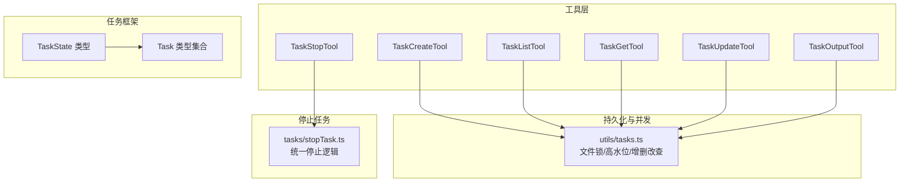
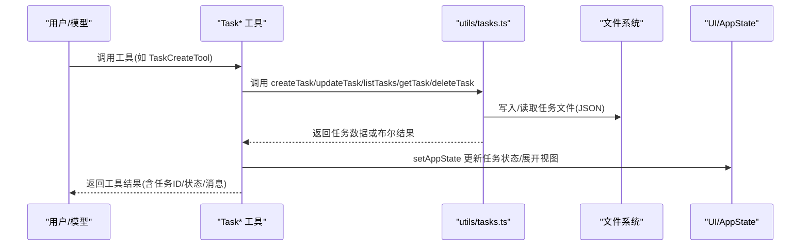
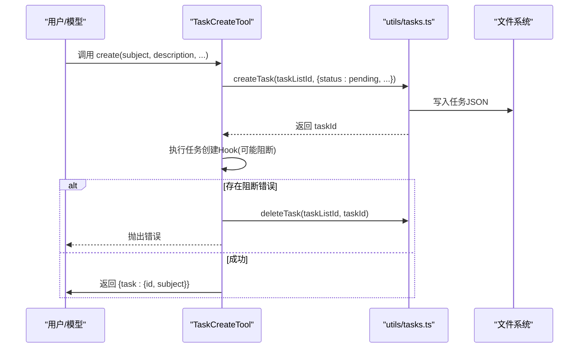
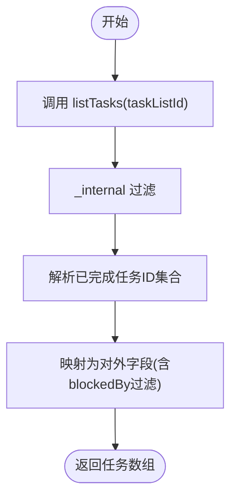
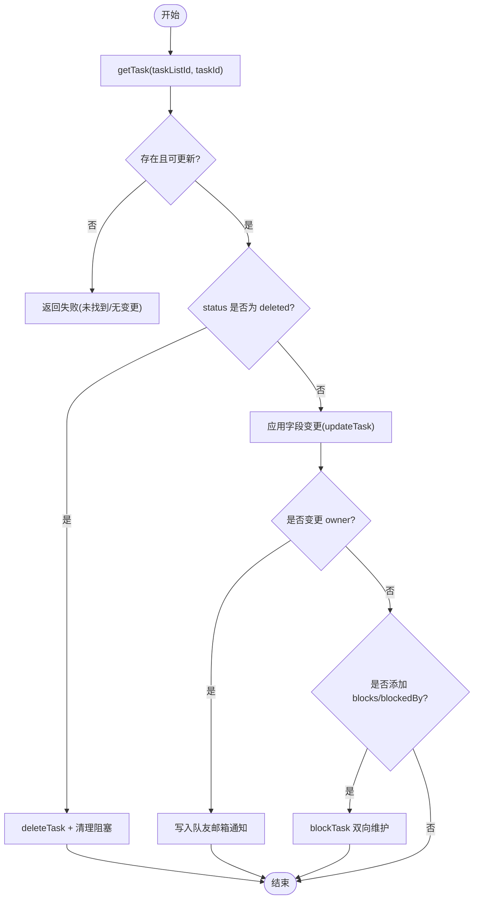
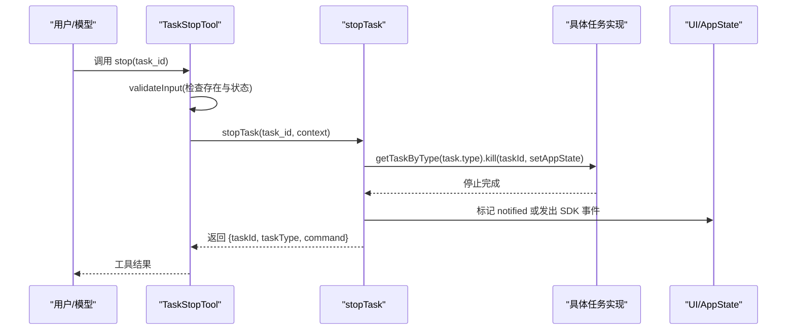
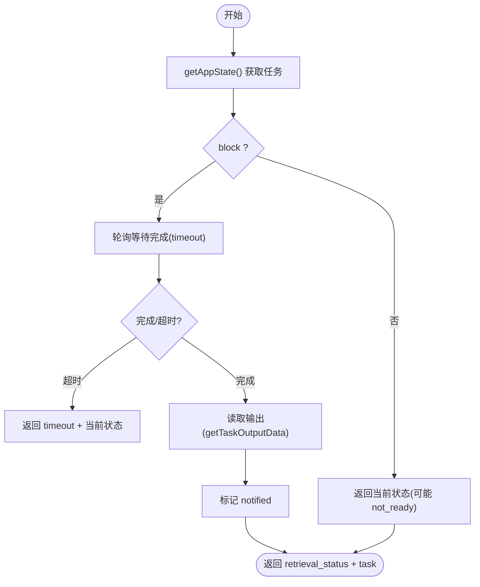
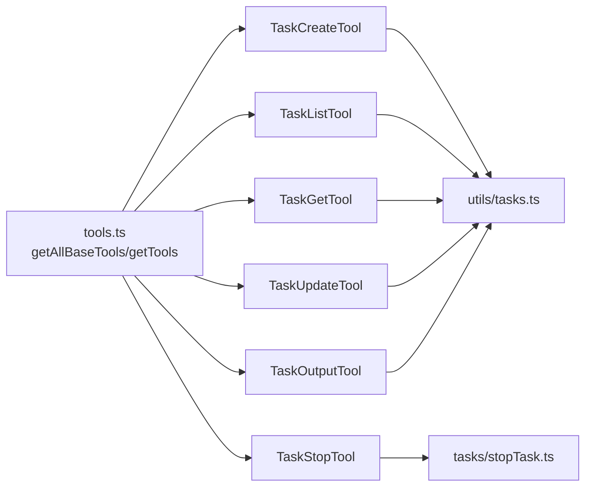

# 任务管理工具

<cite>
**本文档引用的文件**
- [Task.ts](file://src/Task.ts)
- [tools.ts](file://src/tools.ts)
- [TaskCreateTool.ts](file://src/tools/TaskCreateTool/TaskCreateTool.ts)
- [TaskListTool.ts](file://src/tools/TaskListTool/TaskListTool.ts)
- [TaskGetTool.ts](file://src/tools/TaskGetTool/TaskGetTool.ts)
- [TaskUpdateTool.ts](file://src/tools/TaskUpdateTool/TaskUpdateTool.ts)
- [TaskStopTool.ts](file://src/tools/TaskStopTool/TaskStopTool.ts)
- [TaskOutputTool.tsx](file://src/tools/TaskOutputTool/TaskOutputTool.tsx)
- [stopTask.ts](file://src/tasks/stopTask.ts)
- [tasks.ts](file://src/utils/tasks.ts)
- [types.ts](file://src/tasks/types.ts)
</cite>

## 目录
1. [简介](#简介)
2. [项目结构](#项目结构)
3. [核心组件](#核心组件)
4. [架构总览](#架构总览)
5. [详细组件分析](#详细组件分析)
6. [依赖关系分析](#依赖关系分析)
7. [性能考虑](#性能考虑)
8. [故障排除指南](#故障排除指南)
9. [结论](#结论)

## 简介
本文件系统性阐述 Claude Code 的任务管理工具体系，覆盖以下工具的实现架构与运行机制：
- 任务创建工具：TaskCreateTool
- 任务列表工具：TaskListTool
- 任务获取工具：TaskGetTool
- 任务更新工具：TaskUpdateTool
- 任务停止工具：TaskStopTool
- 任务输出工具：TaskOutputTool

重点说明任务生命周期管理、状态跟踪、并发控制与结果存储；解释任务调度机制、优先级设置与资源分配策略；描述任务监控、进度报告与异常处理；并提供最佳实践、性能优化与故障排除建议。

## 项目结构
任务管理相关代码主要分布在以下模块：
- 工具注册与聚合：src/tools.ts
- 任务工具实现：src/tools/Task*/Task*.ts
- 任务状态与类型：src/Task.ts、src/tasks/types.ts
- 任务持久化与并发控制：src/utils/tasks.ts
- 停止任务共享逻辑：src/tasks/stopTask.ts
- 输出读取与展示：src/tools/TaskOutputTool/TaskOutputTool.tsx

**图表来源**
- [tools.ts:193-251](file://src/tools.ts#L193-L251)
- [TaskCreateTool.ts:80-90](file://src/tools/TaskCreateTool/TaskCreateTool.ts#L80-L90)
- [TaskListTool.ts:65-84](file://src/tools/TaskListTool/TaskListTool.ts#L65-L84)
- [TaskGetTool.ts:73-97](file://src/tools/TaskGetTool/TaskGetTool.ts#L73-L97)
- [TaskUpdateTool.ts:137-274](file://src/tools/TaskUpdateTool/TaskUpdateTool.ts#L137-L274)
- [TaskStopTool.ts:107-129](file://src/tools/TaskStopTool/TaskStopTool.ts#L107-L129)
- [TaskOutputTool.tsx:208-282](file://src/tools/TaskOutputTool/TaskOutputTool.tsx#L208-L282)
- [tasks.ts:284-308](file://src/utils/tasks.ts#L284-L308)
- [stopTask.ts:38-100](file://src/tasks/stopTask.ts#L38-L100)
- [Task.ts:44-57](file://src/Task.ts#L44-L57)
- [types.ts:12-29](file://src/tasks/types.ts#L12-L29)

**章节来源**
- [tools.ts:193-251](file://src/tools.ts#L193-L251)
- [Task.ts:44-57](file://src/Task.ts#L44-L57)
- [types.ts:12-29](file://src/tasks/types.ts#L12-L29)

## 核心组件
- 任务状态与基元
  - 任务类型枚举与状态枚举定义于 src/Task.ts，包含 pending、running、completed、failed、killed 等状态。
  - 终止态判定函数用于防止对已完成任务进行无效操作。
  - 任务上下文包含 AbortController、AppState 获取与更新方法。
- 任务状态类型
  - src/tasks/types.ts 定义了 TaskState 联合类型，涵盖本地 Shell、本地 Agent、远程 Agent、进程内队友、工作流、MCP 监控与 Dream 任务等。
- 工具注册与聚合
  - src/tools.ts 中 getAllBaseTools 与 getTools 组合内置工具与 MCP 工具，并按名称去重，内置任务工具在 isTodoV2Enabled 条件下启用。

**章节来源**
- [Task.ts:6-29](file://src/Task.ts#L6-L29)
- [Task.ts:44-57](file://src/Task.ts#L44-L57)
- [Task.ts:108-125](file://src/Task.ts#L108-L125)
- [types.ts:12-29](file://src/tasks/types.ts#L12-L29)
- [tools.ts:193-251](file://src/tools.ts#L193-L251)

## 架构总览
任务管理采用“工具 + 持久化 + 并发控制”的分层设计：
- 工具层：各 Task* 工具通过 buildTool 包装，负责输入校验、调用 utils/tasks.ts 的 CRUD 接口、触发 UI 更新与 Hook 执行。
- 框架层：TaskState 类型与 isBackgroundTask 判定用于 UI 展示与后台任务指示器。
- 持久化层：基于文件系统的任务清单目录，使用高水位标记与文件锁避免并发冲突。
- 停止层：TaskStopTool 与 stopTask.ts 提供统一的停止入口，屏蔽具体任务类型的差异。

**图表来源**
- [TaskCreateTool.ts:80-129](file://src/tools/TaskCreateTool/TaskCreateTool.ts#L80-L129)
- [TaskListTool.ts:65-90](file://src/tools/TaskListTool/TaskListTool.ts#L65-L90)
- [TaskGetTool.ts:73-97](file://src/tools/TaskGetTool/TaskGetTool.ts#L73-L97)
- [TaskUpdateTool.ts:137-362](file://src/tools/TaskUpdateTool/TaskUpdateTool.ts#L137-L362)
- [tasks.ts:284-308](file://src/utils/tasks.ts#L284-L308)
- [tasks.ts:443-456](file://src/utils/tasks.ts#L443-L456)

## 详细组件分析

### 任务创建工具（TaskCreateTool）
- 功能要点
  - 输入：subject、description、activeForm、metadata。
  - 创建流程：生成任务 ID → 写入任务文件 → 触发任务创建 Hook → 若存在阻断错误则回滚删除任务 → 自动展开任务视图。
  - 并发安全：工具自身 isConcurrencySafe 为真，配合 utils/tasks.ts 的文件锁保证并发安全。
- 关键路径
  - createTask 调用：[createTask:284-308](file://src/utils/tasks.ts#L284-L308)
  - Hook 执行与阻断：[executeTaskCreatedHooks](file://src/utils/hooks.js)
  - 工具调用入口：[call:80-129](file://src/tools/TaskCreateTool/TaskCreateTool.ts#L80-L129)

**图表来源**
- [TaskCreateTool.ts:80-129](file://src/tools/TaskCreateTool/TaskCreateTool.ts#L80-L129)
- [tasks.ts:284-308](file://src/utils/tasks.ts#L284-L308)
- [tasks.ts:393-441](file://src/utils/tasks.ts#L393-L441)

**章节来源**
- [TaskCreateTool.ts:18-139](file://src/tools/TaskCreateTool/TaskCreateTool.ts#L18-L139)
- [tasks.ts:284-308](file://src/utils/tasks.ts#L284-L308)

### 任务列表工具（TaskListTool）
- 功能要点
  - 列出当前任务列表，过滤内部任务（metadata._internal），并移除已完成任务的反向阻塞引用。
  - 只读工具，支持自动分类与 UI 渲染。
- 关键路径
  - 列表读取：[listTasks:443-456](file://src/utils/tasks.ts#L443-L456)
  - 过滤与映射：[call:65-90](file://src/tools/TaskListTool/TaskListTool.ts#L65-L90)

**图表来源**
- [TaskListTool.ts:65-90](file://src/tools/TaskListTool/TaskListTool.ts#L65-L90)
- [tasks.ts:443-456](file://src/utils/tasks.ts#L443-L456)

**章节来源**
- [TaskListTool.ts:13-117](file://src/tools/TaskListTool/TaskListTool.ts#L13-L117)
- [tasks.ts:443-456](file://src/utils/tasks.ts#L443-L456)

### 任务获取工具（TaskGetTool）
- 功能要点
  - 根据 taskId 获取单个任务，不存在时返回 null。
  - 只读工具，支持自动分类与 UI 渲染。
- 关键路径
  - 读取任务：[getTask:310-350](file://src/utils/tasks.ts#L310-L350)
  - 工具调用：[call:73-97](file://src/tools/TaskGetTool/TaskGetTool.ts#L73-L97)

**章节来源**
- [TaskGetTool.ts:13-129](file://src/tools/TaskGetTool/TaskGetTool.ts#L13-L129)
- [tasks.ts:310-350](file://src/utils/tasks.ts#L310-L350)

### 任务更新工具（TaskUpdateTool）
- 功能要点
  - 支持更新 subject/description/activeForm/status/owner/metadata 等字段。
  - 特殊状态：status='deleted' 时直接删除任务文件并清理相互阻塞关系。
  - 完成钩子：当 status 更新为 completed 时执行完成 Hook，若存在阻断错误则中止更新。
  - 邮箱通知：变更 owner 时通过队友邮箱写入通知消息。
  - 结果提示：在特定场景追加验证代理提醒。
- 关键路径
  - 删除与更新：[deleteTask:393-441](file://src/utils/tasks.ts#L393-L441)、[updateTask:370-391](file://src/utils/tasks.ts#L370-L391)
  - 阻塞关系维护：[blockTask:458-486](file://src/utils/tasks.ts#L458-L486)
  - 工具调用入口：[call:123-362](file://src/tools/TaskUpdateTool/TaskUpdateTool.ts#L123-L362)

**图表来源**
- [TaskUpdateTool.ts:123-362](file://src/tools/TaskUpdateTool/TaskUpdateTool.ts#L123-L362)
- [tasks.ts:370-391](file://src/utils/tasks.ts#L370-L391)
- [tasks.ts:393-441](file://src/utils/tasks.ts#L393-L441)
- [tasks.ts:458-486](file://src/utils/tasks.ts#L458-L486)

**章节来源**
- [TaskUpdateTool.ts:33-407](file://src/tools/TaskUpdateTool/TaskUpdateTool.ts#L33-L407)
- [tasks.ts:370-391](file://src/utils/tasks.ts#L370-L391)
- [tasks.ts:393-441](file://src/utils/tasks.ts#L393-L441)
- [tasks.ts:458-486](file://src/utils/tasks.ts#L458-L486)

### 任务停止工具（TaskStopTool）
- 功能要点
  - 校验参数与任务状态（必须为 running）。
  - 统一停止入口：调用 stopTask，内部根据任务类型分派到具体任务实现 kill。
  - Bash 任务特殊处理：抑制“退出码 137”噪声通知，同时通过 SDK 事件队列发出终止事件。
- 关键路径
  - 参数校验与调用：[validateInput:60-91](file://src/tools/TaskStopTool/TaskStopTool.ts#L60-L91)、[call:107-129](file://src/tools/TaskStopTool/TaskStopTool.ts#L107-L129)
  - 统一停止逻辑：[stopTask:38-100](file://src/tasks/stopTask.ts#L38-L100)

**图表来源**
- [TaskStopTool.ts:60-129](file://src/tools/TaskStopTool/TaskStopTool.ts#L60-L129)
- [stopTask.ts:38-100](file://src/tasks/stopTask.ts#L38-L100)

**章节来源**
- [TaskStopTool.ts:10-132](file://src/tools/TaskStopTool/TaskStopTool.ts#L10-L132)
- [stopTask.ts:38-100](file://src/tasks/stopTask.ts#L38-L100)

### 任务输出工具（TaskOutputTool）
- 功能要点
  - 读取任意任务类型的输出（本地 Shell、本地 Agent、远程 Agent）。
  - 支持非阻塞与阻塞两种模式：非阻塞立即返回当前状态；阻塞等待任务完成。
  - 对 Agent 任务优先从内存结果提取最终文本，否则回退到磁盘输出。
  - 提供 UI 展示与进度消息渲染。
- 关键路径
  - 输出读取与类型分支：[getTaskOutputData:60-115](file://src/tools/TaskOutputTool/TaskOutputTool.tsx#L60-L115)
  - 阻塞等待与超时：[waitForTaskCompletion:118-143](file://src/tools/TaskOutputTool/TaskOutputTool.tsx#L118-L143)
  - 工具调用与结果映射：[call:208-282](file://src/tools/TaskOutputTool/TaskOutputTool.tsx#L208-L282)

**图表来源**
- [TaskOutputTool.tsx:118-143](file://src/tools/TaskOutputTool/TaskOutputTool.tsx#L118-L143)
- [TaskOutputTool.tsx:208-282](file://src/tools/TaskOutputTool/TaskOutputTool.tsx#L208-L282)
- [TaskOutputTool.tsx:60-115](file://src/tools/TaskOutputTool/TaskOutputTool.tsx#L60-L115)

**章节来源**
- [TaskOutputTool.tsx:30-584](file://src/tools/TaskOutputTool/TaskOutputTool.tsx#L30-L584)

## 依赖关系分析
- 工具到持久化的依赖
  - TaskCreateTool/TaskUpdateTool/TaskListTool/TaskGetTool 均依赖 utils/tasks.ts 的 CRUD 与查询接口。
- 工具到停止逻辑的依赖
  - TaskStopTool 依赖 stopTask.ts 的统一停止入口。
- 类型与状态依赖
  - TaskState 类型与 isBackgroundTask 用于 UI 展示与后台任务指示器。
- 工具聚合
  - tools.ts 中 getAllBaseTools 将内置工具与 MCP 工具合并，并按名称去重，内置任务工具在 isTodoV2Enabled 下启用。

**图表来源**
- [tools.ts:193-251](file://src/tools.ts#L193-L251)
- [TaskCreateTool.ts:80-90](file://src/tools/TaskCreateTool/TaskCreateTool.ts#L80-L90)
- [TaskListTool.ts:65-66](file://src/tools/TaskListTool/TaskListTool.ts#L65-L66)
- [TaskGetTool.ts:74-75](file://src/tools/TaskGetTool/TaskGetTool.ts#L74-L75)
- [TaskUpdateTool.ts:137-138](file://src/tools/TaskUpdateTool/TaskUpdateTool.ts#L137-L138)
- [TaskStopTool.ts:117-120](file://src/tools/TaskStopTool/TaskStopTool.ts#L117-L120)
- [TaskOutputTool.tsx:214-215](file://src/tools/TaskOutputTool/TaskOutputTool.tsx#L214-L215)
- [tasks.ts:284-308](file://src/utils/tasks.ts#L284-L308)
- [stopTask.ts:38-65](file://src/tasks/stopTask.ts#L38-L65)

**章节来源**
- [tools.ts:193-251](file://src/tools.ts#L193-L251)
- [types.ts:12-29](file://src/tasks/types.ts#L12-L29)

## 性能考虑
- 并发控制
  - 文件锁：createTask、updateTask、resetTaskList 使用 proper-lockfile，带指数退避重试，避免多进程竞争导致的数据不一致。
  - 高水位标记：记录最大已分配 ID，防止删除/重置后 ID 重复。
- I/O 优化
  - 批量读取：listTasks 并行读取多个任务文件，减少串行等待。
  - 内存优先：TaskOutputTool 对 Agent 任务优先从内存结果提取最终文本，降低磁盘读取开销。
- UI 响应
  - 仅在任务变更时通知订阅者，避免频繁刷新。
  - TaskStopTool 对 Bash 任务抑制噪声通知，减少 UI 干扰。
- 资源分配
  - 停止任务时仅标记 notified 或发出 SDK 事件，避免额外 I/O。

[本节为通用指导，无需特定文件引用]

## 故障排除指南
- 任务创建失败
  - 现象：创建后立即回滚并抛错。
  - 排查：检查任务创建 Hook 是否返回阻断错误；确认任务列表目录权限与磁盘空间。
  - 参考：[TaskCreateTool.ts:92-113](file://src/tools/TaskCreateTool/TaskCreateTool.ts#L92-L113)
- 任务更新无效
  - 现象：字段未变更或状态未更新。
  - 排查：确认传入字段与现有值不同；检查 status 是否为 deleted；查看阻塞关系是否影响。
  - 参考：[TaskUpdateTool.ts:160-274](file://src/tools/TaskUpdateTool/TaskUpdateTool.ts#L160-L274)
- 任务停止失败
  - 现象：提示 not_found/not_running/unsupported_type。
  - 排查：确认 task_id 存在且状态为 running；检查任务类型是否受支持。
  - 参考：[stopTask.ts:46-63](file://src/tasks/stopTask.ts#L46-L63)
- 输出读取为空或超时
  - 现象：retrieval_status 为 not_ready/timeout。
  - 排查：确认任务确实完成；增大 timeout；检查磁盘输出路径是否存在。
  - 参考：[TaskOutputTool.tsx:242-282](file://src/tools/TaskOutputTool/TaskOutputTool.tsx#L242-L282)
- 并发冲突导致数据异常
  - 现象：任务丢失/重复/状态不一致。
  - 排查：确认文件锁生效；检查高水位标记；避免手动修改任务文件。
  - 参考：[tasks.ts:102-108](file://src/utils/tasks.ts#L102-L108)

**章节来源**
- [TaskCreateTool.ts:92-113](file://src/tools/TaskCreateTool/TaskCreateTool.ts#L92-L113)
- [TaskUpdateTool.ts:160-274](file://src/tools/TaskUpdateTool/TaskUpdateTool.ts#L160-L274)
- [stopTask.ts:46-63](file://src/tasks/stopTask.ts#L46-L63)
- [TaskOutputTool.tsx:242-282](file://src/tools/TaskOutputTool/TaskOutputTool.tsx#L242-L282)
- [tasks.ts:102-108](file://src/utils/tasks.ts#L102-L108)

## 结论
本任务管理工具体系以文件系统为持久化基础，结合文件锁与高水位标记实现强一致的并发控制；以工具层封装 CRUD 与业务逻辑，以统一停止入口屏蔽任务类型差异；以类型系统与 UI 辅助实现清晰的状态流转与可视化反馈。遵循本文最佳实践与故障排除建议，可在复杂多进程与多 Agent 场景下稳定地管理任务生命周期与输出结果。