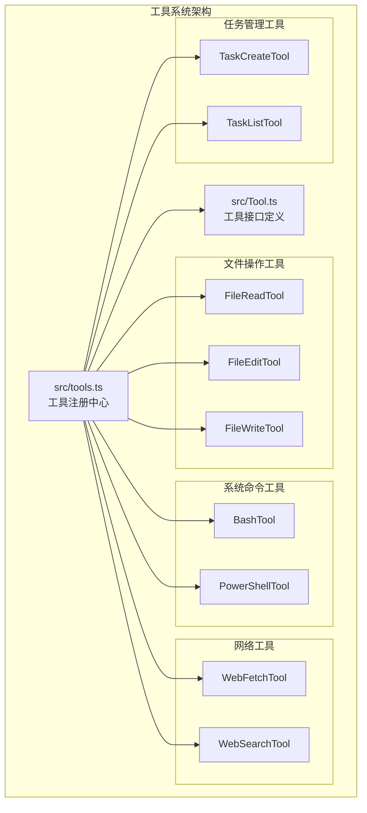
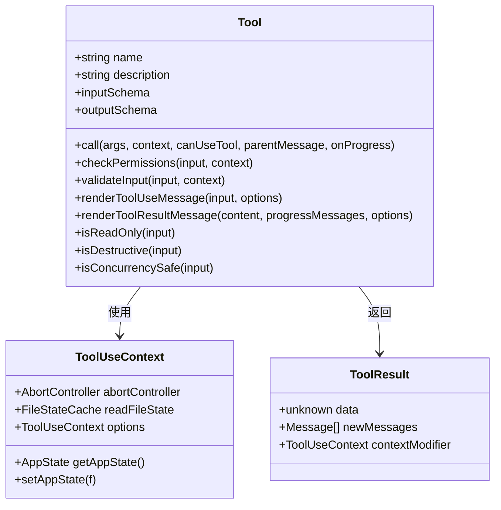
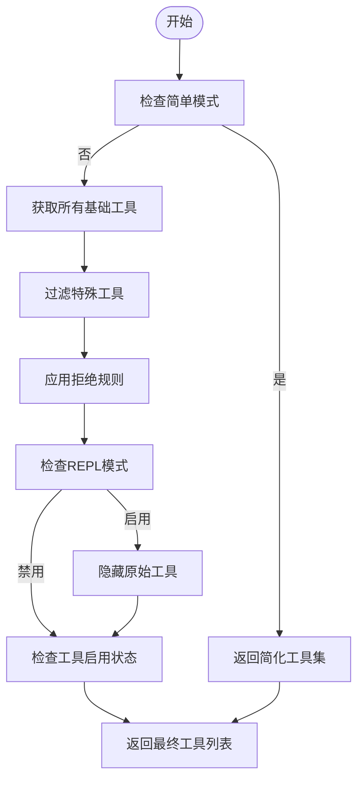
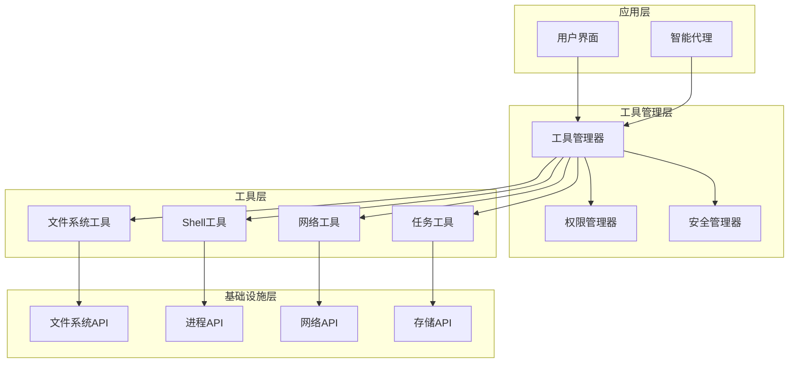
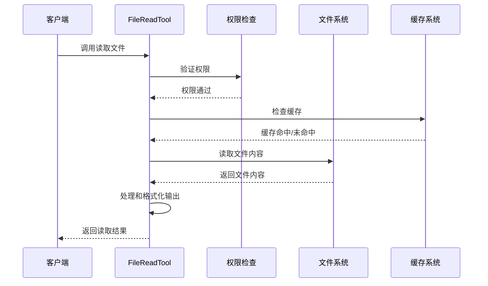
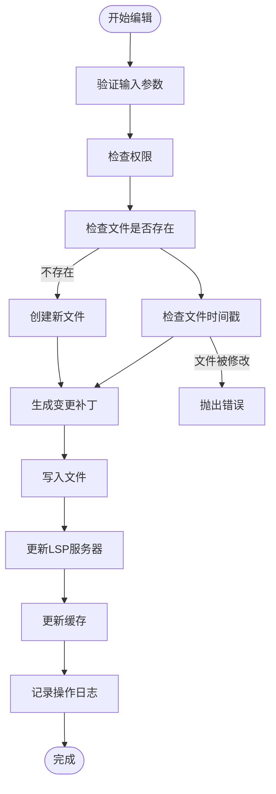
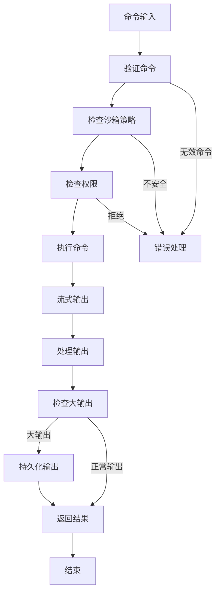
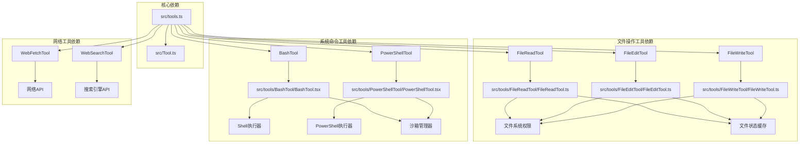

# 内置工具实现

<cite>
**本文档引用的文件**
- [src/tools.ts](file://src/tools.ts)
- [src/Tool.ts](file://src/Tool.ts)
- [src/tools/FileReadTool/FileReadTool.ts](file://src/tools/FileReadTool/FileReadTool.ts)
- [src/tools/FileEditTool/FileEditTool.ts](file://src/tools/FileEditTool/FileEditTool.ts)
- [src/tools/FileWriteTool/FileWriteTool.ts](file://src/tools/FileWriteTool/FileWriteTool.ts)
- [src/tools/BashTool/BashTool.tsx](file://src/tools/BashTool/BashTool.tsx)
- [src/tools/PowerShellTool/PowerShellTool.tsx](file://src/tools/PowerShellTool/PowerShellTool.tsx)
- [src/tools/WebFetchTool/WebFetchTool.ts](file://src/tools/WebFetchTool/WebFetchTool.ts)
- [src/tools/WebSearchTool/WebSearchTool.ts](file://src/tools/WebSearchTool/WebSearchTool.ts)
- [src/tools/TaskCreateTool/TaskCreateTool.ts](file://src/tools/TaskCreateTool/TaskCreateTool.ts)
- [src/tools/TaskListTool/TaskListTool.ts](file://src/tools/TaskListTool/TaskListTool.ts)
</cite>

## 目录
1. [简介](#简介)
2. [项目结构](#项目结构)
3. [核心组件](#核心组件)
4. [架构概览](#架构概览)
5. [详细组件分析](#详细组件分析)
6. [依赖分析](#依赖分析)
7. [性能考虑](#性能考虑)
8. [故障排除指南](#故障排除指南)
9. [结论](#结论)

## 简介

Claude Code 的内置工具实现是一个高度模块化和安全的工具系统，提供了 40 多种不同的工具来执行各种操作。该系统采用统一的工具接口设计，支持权限控制、并发安全、结果处理和用户界面集成。

系统的核心特性包括：
- 统一的工具接口定义
- 基于权限的访问控制
- 并发安全机制
- 智能结果处理和缓存
- 用户友好的界面集成
- 安全沙箱和限制机制

## 项目结构

工具系统的整体架构基于模块化设计，每个工具都是独立的模块，通过统一的接口进行交互。

**图表来源**
- [src/tools.ts:193-251](file://src/tools.ts#L193-L251)
- [src/Tool.ts:362-695](file://src/Tool.ts#L362-L695)

**章节来源**
- [src/tools.ts:193-251](file://src/tools.ts#L193-L251)
- [src/Tool.ts:362-695](file://src/Tool.ts#L362-L695)

## 核心组件

### 工具接口定义

工具系统的核心是统一的工具接口，定义了所有工具必须实现的标准方法和属性。

**图表来源**
- [src/Tool.ts:362-695](file://src/Tool.ts#L362-L695)
- [src/Tool.ts:158-300](file://src/Tool.ts#L158-L300)

### 工具注册系统

工具注册系统负责管理和组织所有可用的工具，支持条件加载和权限过滤。

**图表来源**
- [src/tools.ts:271-327](file://src/tools.ts#L271-L327)

**章节来源**
- [src/Tool.ts:362-695](file://src/Tool.ts#L362-L695)
- [src/tools.ts:271-327](file://src/tools.ts#L271-L327)

## 架构概览

工具系统的整体架构采用了分层设计，确保了高内聚和低耦合。

**图表来源**
- [src/tools.ts:193-251](file://src/tools.ts#L193-L251)
- [src/Tool.ts:158-300](file://src/Tool.ts#L158-L300)

## 详细组件分析

### 文件操作工具

文件操作工具提供了对本地文件系统的完整访问能力，包括读取、编辑和写入操作。

#### FileReadTool 分析

FileReadTool 是文件操作工具的核心组件，提供了安全的文件读取功能。

**图表来源**
- [src/tools/FileReadTool/FileReadTool.ts:496-651](file://src/tools/FileReadTool/FileReadTool.ts#L496-L651)

**章节来源**
- [src/tools/FileReadTool/FileReadTool.ts:337-718](file://src/tools/FileReadTool/FileReadTool.ts#L337-L718)

#### FileEditTool 分析

FileEditTool 提供了安全的文件编辑功能，包含完整的变更跟踪和冲突检测。

**图表来源**
- [src/tools/FileEditTool/FileEditTool.ts:387-574](file://src/tools/FileEditTool/FileEditTool.ts#L387-L574)

**章节来源**
- [src/tools/FileEditTool/FileEditTool.ts:86-595](file://src/tools/FileEditTool/FileEditTool.ts#L86-L595)

#### FileWriteTool 分析

FileWriteTool 提供了文件写入功能，支持完全的内容替换。

**章节来源**
- [src/tools/FileWriteTool/FileWriteTool.ts:94-434](file://src/tools/FileWriteTool/FileWriteTool.ts#L94-L434)

### 系统命令工具

系统命令工具提供了在受控环境中执行系统命令的能力。

#### BashTool 分析

BashTool 是最复杂的工具之一，提供了强大的 Shell 命令执行功能。

**图表来源**
- [src/tools/BashTool/BashTool.tsx:624-800](file://src/tools/BashTool/BashTool.tsx#L624-L800)

**章节来源**
- [src/tools/BashTool/BashTool.tsx:420-800](file://src/tools/BashTool/BashTool.tsx#L420-L800)

#### PowerShellTool 分析

PowerShellTool 提供了 Windows PowerShell 命令执行功能，具有特定的安全考虑。

**章节来源**
- [src/tools/PowerShellTool/PowerShellTool.tsx:272-662](file://src/tools/PowerShellTool/PowerShellTool.tsx#L272-L662)

### 网络工具

网络工具提供了网页抓取和搜索功能。

#### WebFetchTool 分析

WebFetchTool 用于从互联网抓取网页内容。

**章节来源**
- [src/tools/WebFetchTool/WebFetchTool.ts:1-400](file://src/tools/WebFetchTool/WebFetchTool.ts#L1-L400)

#### WebSearchTool 分析

WebSearchTool 提供了网络搜索功能。

**章节来源**
- [src/tools/WebSearchTool/WebSearchTool.ts:1-400](file://src/tools/WebSearchTool/WebSearchTool.ts#L1-L400)

### 任务管理工具

任务管理工具提供了任务创建和列表功能。

#### TaskCreateTool 分析

TaskCreateTool 用于创建新的后台任务。

**章节来源**
- [src/tools/TaskCreateTool/TaskCreateTool.ts:1-400](file://src/tools/TaskCreateTool/TaskCreateTool.ts#L1-L400)

#### TaskListTool 分析

TaskListTool 用于列出当前运行的任务。

**章节来源**
- [src/tools/TaskListTool/TaskListTool.ts:1-400](file://src/tools/TaskListTool/TaskListTool.ts#L1-L400)

## 依赖分析

工具系统中的依赖关系展示了各个组件之间的相互作用。

**图表来源**
- [src/tools.ts:193-251](file://src/tools.ts#L193-L251)
- [src/Tool.ts:362-695](file://src/Tool.ts#L362-L695)

**章节来源**
- [src/tools.ts:193-251](file://src/tools.ts#L193-L251)
- [src/Tool.ts:362-695](file://src/Tool.ts#L362-L695)

## 性能考虑

工具系统在设计时充分考虑了性能优化：

### 缓存机制
- 文件读取去重：避免重复读取相同内容
- 结果缓存：减少重复计算
- 进度缓存：优化长时间运行任务的用户体验

### 异步处理
- 流式输出：实时处理大量数据
- 后台任务：避免阻塞主线程
- 并发控制：限制同时运行的工具数量

### 内存管理
- 输出截断：防止内存溢出
- 资源清理：及时释放系统资源
- 对象复用：减少垃圾回收压力

## 故障排除指南

### 常见问题及解决方案

#### 权限相关问题
- **问题**：工具调用被拒绝
- **原因**：权限规则配置或文件系统权限限制
- **解决**：检查工具权限配置和文件系统权限

#### 文件操作问题
- **问题**：文件读取失败
- **原因**：文件不存在或权限不足
- **解决**：验证文件路径和权限

#### 命令执行问题
- **问题**：Shell 命令执行失败
- **原因**：命令语法错误或环境问题
- **解决**：检查命令语法和执行环境

#### 性能问题
- **问题**：工具响应缓慢
- **原因**：大量数据处理或资源竞争
- **解决**：优化查询参数或等待资源释放

**章节来源**
- [src/tools/FileReadTool/FileReadTool.ts:418-495](file://src/tools/FileReadTool/FileReadTool.ts#L418-L495)
- [src/tools/BashTool/BashTool.tsx:624-800](file://src/tools/BashTool/BashTool.tsx#L624-L800)

## 结论

Claude Code 的内置工具实现展现了现代 AI 辅助开发工具的先进设计理念。通过统一的工具接口、严格的权限控制和智能的安全机制，系统为开发者提供了强大而安全的自动化能力。

主要优势包括：
- **安全性**：多层权限检查和沙箱隔离
- **可扩展性**：模块化设计支持新工具添加
- **易用性**：直观的工具接口和丰富的用户反馈
- **可靠性**：完善的错误处理和恢复机制

该工具系统为构建更智能、更高效的开发工作流奠定了坚实的基础，是 Claude Code 产品生态的重要组成部分。