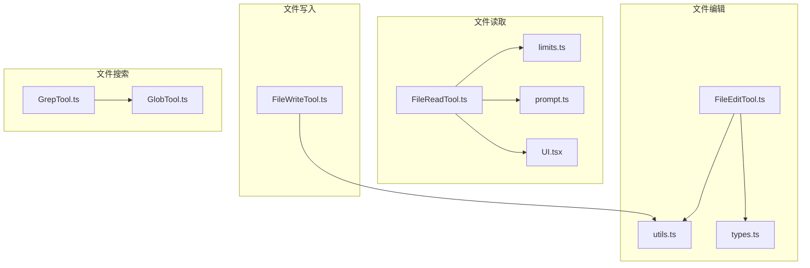
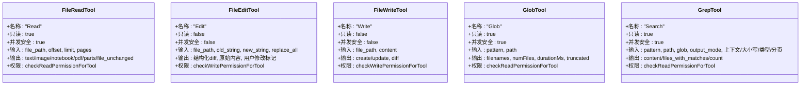
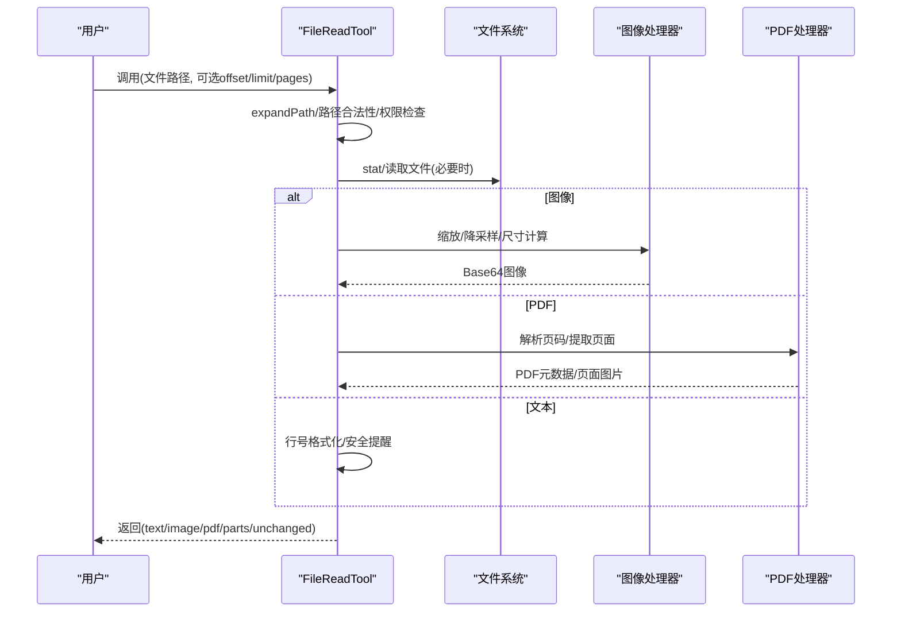
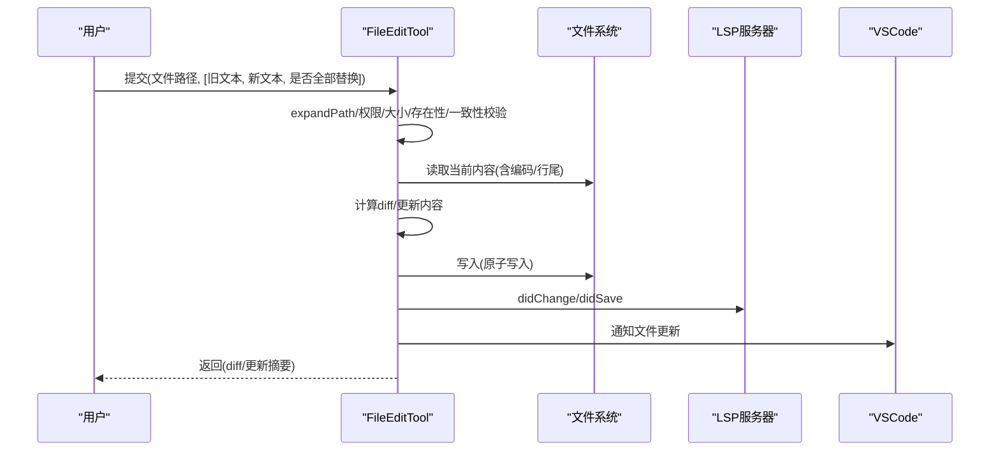
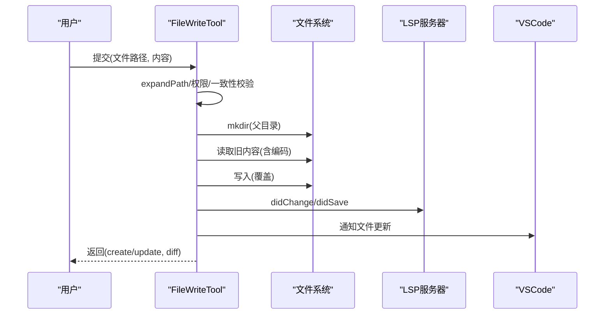
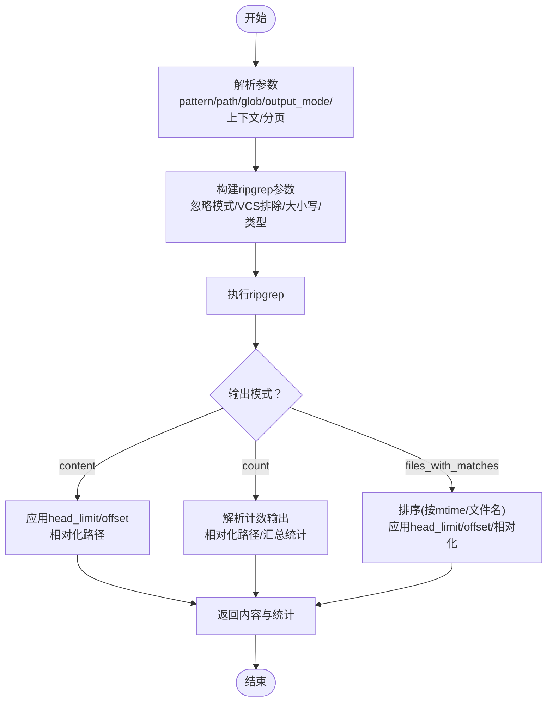
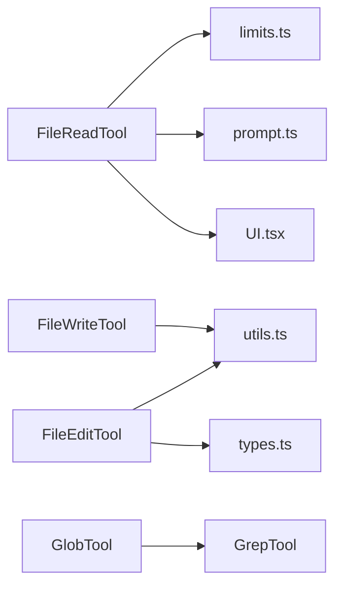

# 文件操作工具

<cite>
**本文引用的文件**
- [src/tools/FileReadTool/FileReadTool.ts](file://src/tools/FileReadTool/FileReadTool.ts)
- [src/tools/FileReadTool/limits.ts](file://src/tools/FileReadTool/limits.ts)
- [src/tools/FileReadTool/prompt.ts](file://src/tools/FileReadTool/prompt.ts)
- [src/tools/FileReadTool/UI.tsx](file://src/tools/FileReadTool/UI.tsx)
- [src/tools/FileEditTool/FileEditTool.ts](file://src/tools/FileEditTool/FileEditTool.ts)
- [src/tools/FileEditTool/types.ts](file://src/tools/FileEditTool/types.ts)
- [src/tools/FileEditTool/utils.ts](file://src/tools/FileEditTool/utils.ts)
- [src/tools/FileWriteTool/FileWriteTool.ts](file://src/tools/FileWriteTool/FileWriteTool.ts)
- [src/tools/GlobTool/GlobTool.ts](file://src/tools/GlobTool/GlobTool.ts)
- [src/tools/GrepTool/GrepTool.ts](file://src/tools/GrepTool/GrepTool.ts)
</cite>

## 目录
1. [简介](#简介)
2. [项目结构](#项目结构)
3. [核心组件](#核心组件)
4. [架构总览](#架构总览)
5. [详细组件分析](#详细组件分析)
6. [依赖关系分析](#依赖关系分析)
7. [性能考量](#性能考量)
8. [故障排查指南](#故障排查指南)
9. [结论](#结论)
10. [附录](#附录)

## 简介
本文件系统性梳理 Claude Code 的文件操作工具集，覆盖以下工具：
- 文件读取工具：FileReadTool
- 文件编辑工具：FileEditTool
- 文件写入工具：FileWriteTool
- 文件搜索工具：GlobTool、GrepTool

重点阐述各工具的功能特性、参数配置、文件访问权限与安全限制；解释文件内容读取的限制机制、图像文件处理、大文件处理策略；说明文件编辑的差异显示、批量文件操作与文件搜索的模式匹配；并提供最佳实践、性能优化建议与常见问题解决方案。

## 项目结构
文件操作工具位于 src/tools 下，按功能模块划分：
- FileReadTool：文件读取、图像/PDF/笔记本解析、行号格式化、去重与安全限制
- FileEditTool：基于 diff 的精确替换、批量编辑、差异展示、LSP/VsCode 同步
- FileWriteTool：全量覆盖写入、原子性保障、差异统计、LSP/VsCode 同步
- GlobTool：通配符路径匹配与结果相对化
- GrepTool：基于 ripgrep 的正则搜索、上下文/计数/文件列表输出、分页与限流

图表来源
- [src/tools/FileReadTool/FileReadTool.ts:1-1184](file://src/tools/FileReadTool/FileReadTool.ts#L1-L1184)
- [src/tools/FileReadTool/limits.ts:1-93](file://src/tools/FileReadTool/limits.ts#L1-L93)
- [src/tools/FileReadTool/prompt.ts:1-50](file://src/tools/FileReadTool/prompt.ts#L1-L50)
- [src/tools/FileReadTool/UI.tsx:1-185](file://src/tools/FileReadTool/UI.tsx#L1-L185)
- [src/tools/FileEditTool/FileEditTool.ts:1-626](file://src/tools/FileEditTool/FileEditTool.ts#L1-L626)
- [src/tools/FileEditTool/utils.ts:1-776](file://src/tools/FileEditTool/utils.ts#L1-L776)
- [src/tools/FileEditTool/types.ts:1-86](file://src/tools/FileEditTool/types.ts#L1-L86)
- [src/tools/FileWriteTool/FileWriteTool.ts:1-435](file://src/tools/FileWriteTool/FileWriteTool.ts#L1-L435)
- [src/tools/GlobTool/GlobTool.ts:1-199](file://src/tools/GlobTool/GlobTool.ts#L1-L199)
- [src/tools/GrepTool/GrepTool.ts:1-578](file://src/tools/GrepTool/GrepTool.ts#L1-L578)

章节来源
- [src/tools/FileReadTool/FileReadTool.ts:1-1184](file://src/tools/FileReadTool/FileReadTool.ts#L1-L1184)
- [src/tools/FileEditTool/FileEditTool.ts:1-626](file://src/tools/FileEditTool/FileEditTool.ts#L1-L626)
- [src/tools/FileWriteTool/FileWriteTool.ts:1-435](file://src/tools/FileWriteTool/FileWriteTool.ts#L1-L435)
- [src/tools/GlobTool/GlobTool.ts:1-199](file://src/tools/GlobTool/GlobTool.ts#L1-L199)
- [src/tools/GrepTool/GrepTool.ts:1-578](file://src/tools/GrepTool/GrepTool.ts#L1-L578)

## 核心组件
- FileReadTool：支持文本、图像、PDF、Jupyter Notebook 读取；内置大小与令牌上限检查；支持偏移/范围读取；设备文件阻断；macOS 截图路径兼容；读取去重与会话缓存；安全提醒与分析埋点。
- FileEditTool：单文件多编辑批处理；严格一致性校验（读取时间戳/内容一致性）；diff 展示与行号上下文；LSP/VsCode 同步；笔记本文档专用提示；设置文件编辑校验。
- FileWriteTool：全量覆盖写入；原子性保障（目录预创建、变更前后状态校验）；差异统计；LSP/VsCode 同步；远程仓库差异计算可选。
- GlobTool：通配符搜索；默认最大返回 100 条；路径合法性校验；相对化输出；权限与 UNC 路径安全处理。
- GrepTool：正则搜索（ripgrep）；支持 content/files_with_matches/count 三种输出模式；上下文行数控制；大小写不敏感、类型过滤、忽略模式；分页 head_limit/offset；VCS 目录排除；WSL 性能注意。

章节来源
- [src/tools/FileReadTool/FileReadTool.ts:337-718](file://src/tools/FileReadTool/FileReadTool.ts#L337-L718)
- [src/tools/FileEditTool/FileEditTool.ts:86-595](file://src/tools/FileEditTool/FileEditTool.ts#L86-L595)
- [src/tools/FileWriteTool/FileWriteTool.ts:94-434](file://src/tools/FileWriteTool/FileWriteTool.ts#L94-L434)
- [src/tools/GlobTool/GlobTool.ts:57-198](file://src/tools/GlobTool/GlobTool.ts#L57-L198)
- [src/tools/GrepTool/GrepTool.ts:160-577](file://src/tools/GrepTool/GrepTool.ts#L160-L577)

## 架构总览
文件操作工具遵循统一的 ToolDef 模式，具备：
- 输入/输出 Schema 校验（Zod）
- 权限检查（文件系统规则匹配）
- 只读/并发安全标记
- 工具使用摘要与活动描述
- 结果映射到消息块（tool_result）

图表来源
- [src/tools/FileReadTool/FileReadTool.ts:337-718](file://src/tools/FileReadTool/FileReadTool.ts#L337-L718)
- [src/tools/FileEditTool/FileEditTool.ts:86-595](file://src/tools/FileEditTool/FileEditTool.ts#L86-L595)
- [src/tools/FileWriteTool/FileWriteTool.ts:94-434](file://src/tools/FileWriteTool/FileWriteTool.ts#L94-L434)
- [src/tools/GlobTool/GlobTool.ts:57-198](file://src/tools/GlobTool/GlobTool.ts#L57-L198)
- [src/tools/GrepTool/GrepTool.ts:160-577](file://src/tools/GrepTool/GrepTool.ts#L160-L577)

## 详细组件分析

### 文件读取工具 FileReadTool
- 功能特性
  - 文本：行号格式化、安全提醒、空文件/越界提示
  - 图像：自动识别与尺寸信息、缩放与降采样、Base64 返回
  - PDF：页面范围解析、分页提取为图片、元数据返回
  - 笔记本：Jupyter Notebook 解析为 cells 列表
  - 设备文件阻断：/dev/zero/random/… 等挂起或阻塞设备
  - macOS 截图兼容：AM/PM 前空格兼容（常规空格与窄空格）
  - 读取去重：同范围且未变更文件直接返回“未变更”占位
- 参数配置
  - file_path：绝对路径
  - offset/limit：行级范围读取（大文件推荐）
  - pages：PDF 页面范围（如 "1-5"、"3"、"10-20"）
- 安全与权限
  - 路径展开与 UNC 路径安全处理
  - 二进制扩展名检测（除 PDF、图像、SVG 外禁止读取）
  - 权限规则匹配（deny 规则拦截）
- 限制机制
  - maxSizeBytes：总文件大小上限（预读前检查）
  - maxTokens：输出令牌上限（后读取检查）
  - 默认上限与环境变量/实验开关可配置
- 大文件策略
  - 推荐使用 offset/limit 分段读取
  - PDF 使用 pages 参数限定页数
  - 读取去重减少重复传输
- 图像处理
  - 自动检测图像格式、尺寸、缩放与降采样
  - 返回原始大小与显示尺寸用于坐标映射
- 使用建议
  - 首次读取建议不带 offset/limit，便于后续编辑/写入一致性校验
  - 对超大文件优先分段读取或使用搜索工具定位范围

图表来源
- [src/tools/FileReadTool/FileReadTool.ts:496-718](file://src/tools/FileReadTool/FileReadTool.ts#L496-L718)
- [src/tools/FileReadTool/limits.ts:53-92](file://src/tools/FileReadTool/limits.ts#L53-L92)
- [src/tools/FileReadTool/prompt.ts:27-49](file://src/tools/FileReadTool/prompt.ts#L27-L49)

章节来源
- [src/tools/FileReadTool/FileReadTool.ts:117-128](file://src/tools/FileReadTool/FileReadTool.ts#L117-L128)
- [src/tools/FileReadTool/FileReadTool.ts:418-495](file://src/tools/FileReadTool/FileReadTool.ts#L418-L495)
- [src/tools/FileReadTool/FileReadTool.ts:594-718](file://src/tools/FileReadTool/FileReadTool.ts#L594-L718)
- [src/tools/FileReadTool/limits.ts:1-93](file://src/tools/FileReadTool/limits.ts#L1-L93)
- [src/tools/FileReadTool/prompt.ts:1-50](file://src/tools/FileReadTool/prompt.ts#L1-L50)
- [src/tools/FileReadTool/UI.tsx:77-142](file://src/tools/FileReadTool/UI.tsx#L77-L142)

### 文件编辑工具 FileEditTool
- 功能特性
  - 单文件多编辑批处理（replace_all 控制）
  - 严格一致性校验：读取时间戳与内容一致性
  - diff 展示与行号上下文，支持 Git 差异计算
  - LSP/VsCode 同步通知，清除已交付诊断
  - 笔记本文档专用提示
  - 设置文件编辑校验
- 参数配置
  - file_path：绝对路径
  - old_string/new_string：被替换与替换文本
  - replace_all：是否全部替换
- 安全与权限
  - UNC 路径跳过文件系统操作以避免凭据泄露
  - 最大可编辑文件大小限制（1GiB）
  - 团队内存密钥检测
- 批量文件操作
  - 支持一次提交多个编辑，内部应用顺序并生成结构化 diff
  - 提供片段截取与上下文展示，便于审阅
- 使用建议
  - 先读取再编辑，确保一致性校验通过
  - replace_all=false 时尽量提供唯一上下文，避免多处匹配

图表来源
- [src/tools/FileEditTool/FileEditTool.ts:387-595](file://src/tools/FileEditTool/FileEditTool.ts#L387-L595)
- [src/tools/FileEditTool/utils.ts:234-350](file://src/tools/FileEditTool/utils.ts#L234-L350)

章节来源
- [src/tools/FileEditTool/FileEditTool.ts:137-362](file://src/tools/FileEditTool/FileEditTool.ts#L137-L362)
- [src/tools/FileEditTool/FileEditTool.ts:387-595](file://src/tools/FileEditTool/FileEditTool.ts#L387-L595)
- [src/tools/FileEditTool/types.ts:1-86](file://src/tools/FileEditTool/types.ts#L1-L86)
- [src/tools/FileEditTool/utils.ts:1-776](file://src/tools/FileEditTool/utils.ts#L1-L776)

### 文件写入工具 FileWriteTool
- 功能特性
  - 全量覆盖写入（新文件/更新文件）
  - 原子性保障：目录预创建、变更前后状态校验
  - 差异统计与行数变化计数
  - LSP/VsCode 同步通知
  - 远程仓库差异计算可选
- 参数配置
  - file_path：绝对路径
  - content：要写入的完整内容（保留换行风格）
- 安全与权限
  - UNC 路径跳过文件系统操作
  - 团队内存密钥检测
  - 一致性校验：必须先读取
- 使用建议
  - 写入前先读取，确保一致性
  - 大文件写入建议先分段读取与验证

图表来源
- [src/tools/FileWriteTool/FileWriteTool.ts:223-434](file://src/tools/FileWriteTool/FileWriteTool.ts#L223-L434)

章节来源
- [src/tools/FileWriteTool/FileWriteTool.ts:153-222](file://src/tools/FileWriteTool/FileWriteTool.ts#L153-L222)
- [src/tools/FileWriteTool/FileWriteTool.ts:223-434](file://src/tools/FileWriteTool/FileWriteTool.ts#L223-L434)

### 文件搜索工具 GlobTool
- 功能特性
  - 通配符搜索（glob），默认最多返回 100 条
  - 相对化路径输出（节省 token）
  - 目录存在性校验与错误提示
  - 权限与 UNC 路径安全处理
- 参数配置
  - pattern：通配符模式
  - path：搜索根目录（可选，默认当前工作目录）
- 使用建议
  - 优先缩小 path 或细化 pattern，避免过多结果
  - 使用 truncate 标识判断是否需要进一步筛选

章节来源
- [src/tools/GlobTool/GlobTool.ts:94-134](file://src/tools/GlobTool/GlobTool.ts#L94-L134)
- [src/tools/GlobTool/GlobTool.ts:154-176](file://src/tools/GlobTool/GlobTool.ts#L154-L176)

### 文件搜索工具 GrepTool
- 功能特性
  - 正则搜索（ripgrep），支持 content/files_with_matches/count 三种模式
  - 上下文控制（-B/-A/-C/context）、行号、大小写不敏感、类型过滤
  - head_limit/offset 分页与截断
  - 忽略模式、VCS 目录排除、最大列宽限制
  - 相对化路径输出
- 参数配置
  - pattern：正则表达式
  - path：搜索根目录（可选）
  - glob：文件类型过滤（如 *.js, *.{ts,tsx}）
  - output_mode：content/files_with_matches/count
  - 上下文/行号/大小写/类型/分页等
- 使用建议
  - content 模式配合 head_limit 控制输出规模
  - files_with_matches 模式默认按最近修改时间排序
  - count 模式适合统计总量

图表来源
- [src/tools/GrepTool/GrepTool.ts:310-577](file://src/tools/GrepTool/GrepTool.ts#L310-L577)

章节来源
- [src/tools/GrepTool/GrepTool.ts:33-91](file://src/tools/GrepTool/GrepTool.ts#L33-L91)
- [src/tools/GrepTool/GrepTool.ts:310-577](file://src/tools/GrepTool/GrepTool.ts#L310-L577)

## 依赖关系分析
- FileReadTool 依赖
  - 读取限制配置（limits.ts）
  - 提示模板（prompt.ts）
  - UI 渲染（UI.tsx）
  - 图像/PDF/笔记本处理工具
  - 权限与路径工具
- FileEditTool 依赖
  - diff 工具（utils/diff）
  - 文件读取元数据（编码/行尾）
  - LSP/VsCode 同步
  - 权限与路径工具
- FileWriteTool 依赖
  - diff 工具（utils/diff）
  - LSP/VsCode 同步
  - 权限与路径工具
- GlobTool/GrepTool 依赖
  - glob 实现与 ripgrep 封装
  - 权限忽略模式与路径工具

图表来源
- [src/tools/FileReadTool/FileReadTool.ts:1-1184](file://src/tools/FileReadTool/FileReadTool.ts#L1-L1184)
- [src/tools/FileReadTool/limits.ts:1-93](file://src/tools/FileReadTool/limits.ts#L1-L93)
- [src/tools/FileReadTool/prompt.ts:1-50](file://src/tools/FileReadTool/prompt.ts#L1-L50)
- [src/tools/FileReadTool/UI.tsx:1-185](file://src/tools/FileReadTool/UI.tsx#L1-L185)
- [src/tools/FileEditTool/FileEditTool.ts:1-626](file://src/tools/FileEditTool/FileEditTool.ts#L1-L626)
- [src/tools/FileEditTool/utils.ts:1-776](file://src/tools/FileEditTool/utils.ts#L1-L776)
- [src/tools/FileEditTool/types.ts:1-86](file://src/tools/FileEditTool/types.ts#L1-L86)
- [src/tools/FileWriteTool/FileWriteTool.ts:1-435](file://src/tools/FileWriteTool/FileWriteTool.ts#L1-L435)
- [src/tools/GlobTool/GlobTool.ts:1-199](file://src/tools/GlobTool/GlobTool.ts#L1-L199)
- [src/tools/GrepTool/GrepTool.ts:1-578](file://src/tools/GrepTool/GrepTool.ts#L1-L578)

章节来源
- [src/tools/FileReadTool/FileReadTool.ts:1-1184](file://src/tools/FileReadTool/FileReadTool.ts#L1-L1184)
- [src/tools/FileEditTool/FileEditTool.ts:1-626](file://src/tools/FileEditTool/FileEditTool.ts#L1-L626)
- [src/tools/FileWriteTool/FileWriteTool.ts:1-435](file://src/tools/FileWriteTool/FileWriteTool.ts#L1-L435)
- [src/tools/GlobTool/GlobTool.ts:1-199](file://src/tools/GlobTool/GlobTool.ts#L1-L199)
- [src/tools/GrepTool/GrepTool.ts:1-578](file://src/tools/GrepTool/GrepTool.ts#L1-L578)

## 性能考量
- 读取限制
  - maxSizeBytes 在读取前进行文件大小检查，避免超大文件导致内存压力
  - maxTokens 在读取后进行令牌估算与 API 校验，防止输出过大
  - 环境变量与实验开关可动态调整上限
- 大文件策略
  - 建议使用 offset/limit 或 pages 参数分段读取
  - 读取去重减少重复传输
- 搜索性能
  - GrepTool 默认 head_limit=250，content 模式避免一次性返回大量行
  - VCS 目录自动排除，减少噪声与 IO
  - WSL 环境下 ripgrep 存在性能退化，注意超时与分页
- 编辑/写入原子性
  - FileEditTool/FileWriteTool 在写入前后进行一致性校验，避免并发写入冲突
  - 目录预创建与延迟 mkdir 避免中间态异常

[本节为通用指导，无需特定文件引用]

## 故障排查指南
- 文件不存在
  - FileReadTool：尝试 macOS 截图窄空格替代路径；提供相似文件与 CWD 建议
  - FileEditTool/GrepTool/GlobTool：提供相似文件/目录建议与 CWD 提示
- 权限拒绝
  - 检查 deny 规则与路径展开后的匹配
  - UNC 路径跳过文件系统操作以避免凭据泄露
- 超出限制
  - FileReadTool：调整 offset/limit 或 pages；或降低文件大小
  - GrepTool：增大 head_limit 或使用更精确的 pattern/glob
- 不一致错误
  - FileEditTool/FileWriteTool：文件在读取后被外部修改，需重新读取
- 图像/PDF 无法读取
  - 确认扩展名与格式支持；PDF 使用 pages 参数限定页数
- LSP/VsCode 无响应
  - 检查通知与同步逻辑；查看日志错误

章节来源
- [src/tools/FileReadTool/FileReadTool.ts:609-650](file://src/tools/FileReadTool/FileReadTool.ts#L609-L650)
- [src/tools/FileEditTool/FileEditTool.ts:275-311](file://src/tools/FileEditTool/FileEditTool.ts#L275-L311)
- [src/tools/FileWriteTool/FileWriteTool.ts:279-295](file://src/tools/FileWriteTool/FileWriteTool.ts#L279-L295)
- [src/tools/GlobTool/GlobTool.ts:100-131](file://src/tools/GlobTool/GlobTool.ts#L100-L131)
- [src/tools/GrepTool/GrepTool.ts:201-231](file://src/tools/GrepTool/GrepTool.ts#L201-L231)

## 结论
Claude Code 的文件操作工具围绕“安全、一致、可观测”的设计原则构建：严格的权限与安全检查、读取/编辑/写入的一致性校验、丰富的输出与差异展示、以及针对大文件与多媒体的优化策略。通过合理使用 offset/limit、pages、head_limit 与 glob/filter，可在保证安全的前提下高效完成文件读取、编辑与搜索任务。

[本节为总结性内容，无需特定文件引用]

## 附录
- 最佳实践
  - 读取先行：编辑/写入前先读取，确保一致性
  - 分段读取：大文件优先 offset/limit 或 pages
  - 精准搜索：缩小 pattern/glob 与 path 范围
  - 批量编辑：合并多次编辑为一次调用，减少冲突
  - 安全提醒：遵守二进制文件读取限制与团队密钥保护
- 性能优化
  - 使用 head_limit 控制搜索输出规模
  - 相对化路径输出减少 token 消耗
  - 读取去重避免重复传输
  - WSL 环境谨慎使用长耗时搜索

[本节为通用指导，无需特定文件引用]