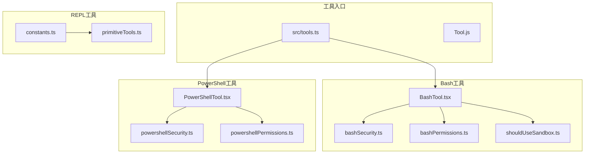
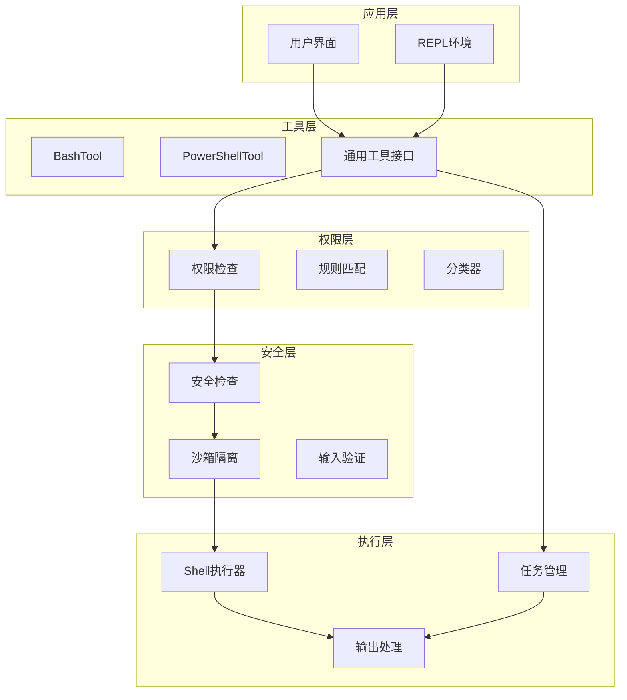
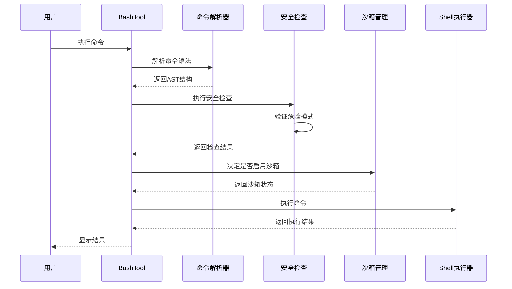
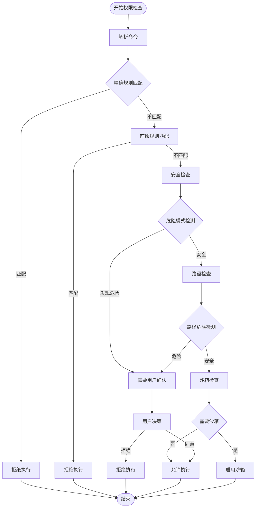
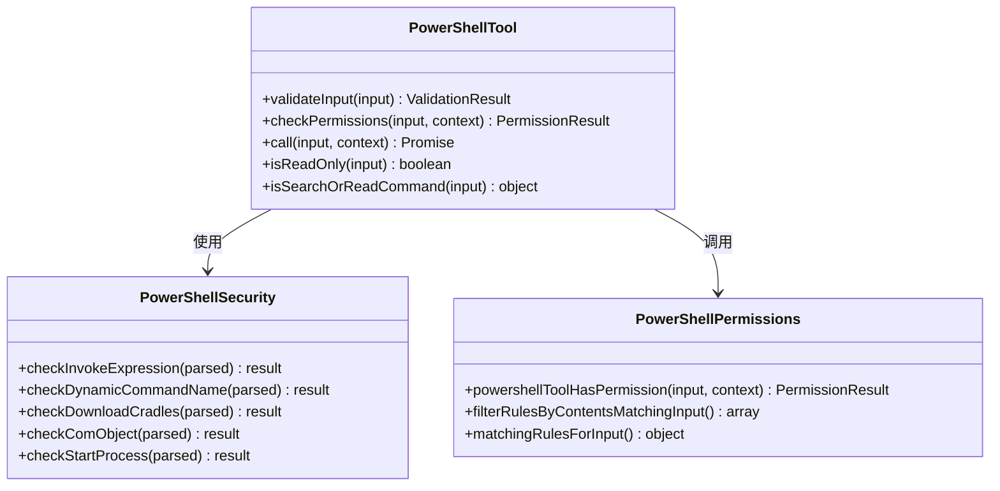
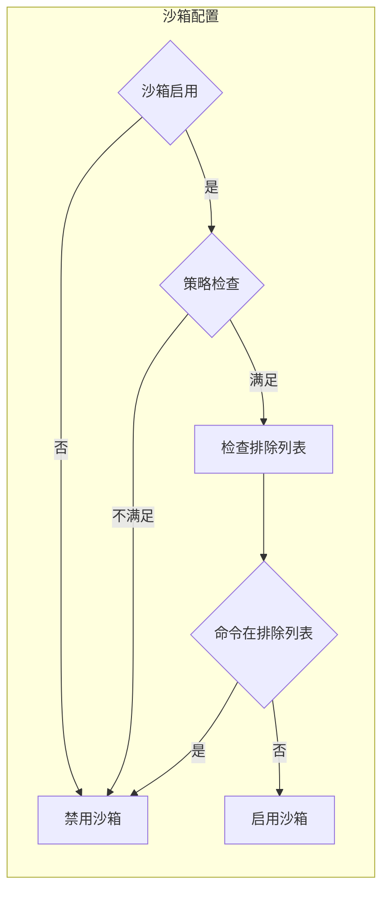
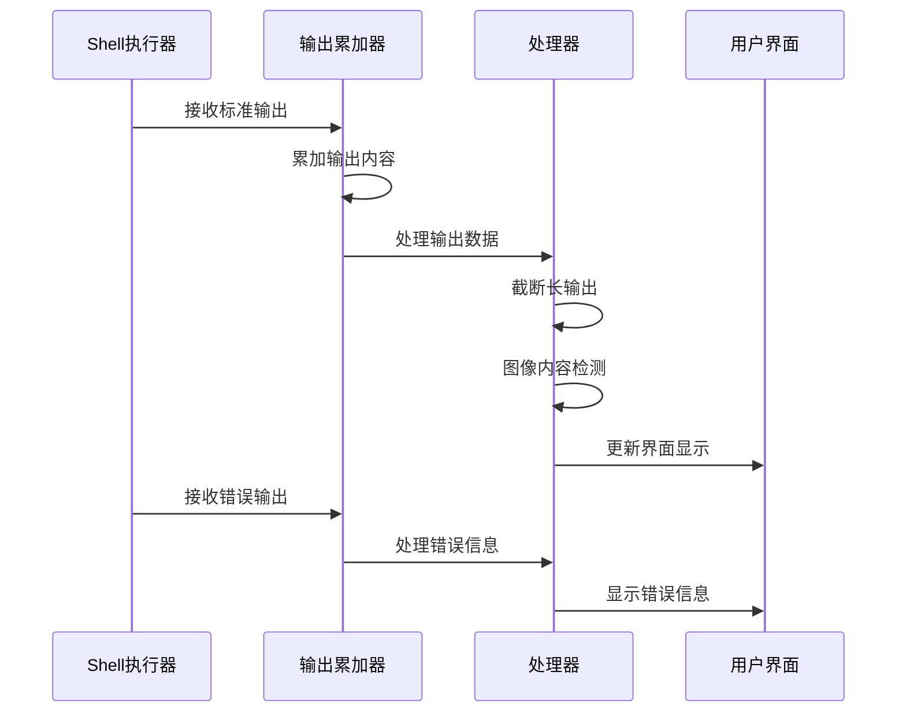
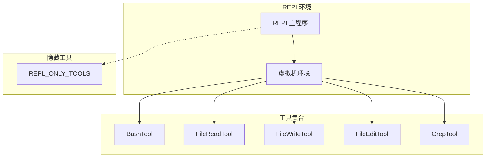
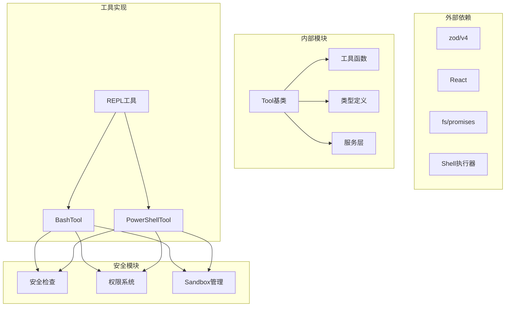

# 系统命令工具

<cite>
**本文档引用的文件**
- [src/tools.ts](file://src/tools.ts)
- [src/tools/BashTool/BashTool.tsx](file://src/tools/BashTool/BashTool.tsx)
- [src/tools/BashTool/bashSecurity.ts](file://src/tools/BashTool/bashSecurity.ts)
- [src/tools/BashTool/bashPermissions.ts](file://src/tools/BashTool/bashPermissions.ts)
- [src/tools/BashTool/shouldUseSandbox.ts](file://src/tools/BashTool/shouldUseSandbox.ts)
- [src/tools/PowerShellTool/PowerShellTool.tsx](file://src/tools/PowerShellTool/PowerShellTool.tsx)
- [src/tools/PowerShellTool/powershellSecurity.ts](file://src/tools/PowerShellTool/powershellSecurity.ts)
- [src/tools/PowerShellTool/powershellPermissions.ts](file://src/tools/PowerShellTool/powershellPermissions.ts)
- [src/tools/REPLTool/constants.ts](file://src/tools/REPLTool/constants.ts)
- [src/tools/REPLTool/primitiveTools.ts](file://src/tools/REPLTool/primitiveTools.ts)
</cite>

## 目录
1. [简介](#简介)
2. [项目结构](#项目结构)
3. [核心组件](#核心组件)
4. [架构概览](#架构概览)
5. [详细组件分析](#详细组件分析)
6. [依赖关系分析](#依赖关系分析)
7. [性能考虑](#性能考虑)
8. [故障排除指南](#故障排除指南)
9. [结论](#结论)

## 简介

Claude Code的系统命令工具是一套完整的终端命令执行框架，主要包含BashTool和PowerShellTool两个核心组件。这套工具系统提供了跨平台的命令执行能力，集成了多层次的安全防护机制、权限控制系统和沙箱隔离功能。

系统命令工具的主要目标是：
- 提供安全的终端命令执行环境
- 实现细粒度的权限控制和审计
- 支持跨平台兼容性（Linux、macOS、Windows）
- 提供丰富的用户交互和反馈机制
- 实现命令历史管理和REPL工具支持

## 项目结构

系统命令工具位于项目的`src/tools`目录下，采用模块化设计，每个工具都有独立的功能模块和安全组件：

**图表来源**
- [src/tools.ts:193-251](file://src/tools.ts#L193-L251)
- [src/tools/BashTool/BashTool.tsx:420-425](file://src/tools/BashTool/BashTool.tsx#L420-L425)
- [src/tools/PowerShellTool/PowerShellTool.tsx:272-277](file://src/tools/PowerShellTool/PowerShellTool.tsx#L272-L277)

**章节来源**
- [src/tools.ts:193-251](file://src/tools.ts#L193-L251)

## 核心组件

系统命令工具由以下核心组件构成：

### BashTool组件
BashTool是Linux和macOS平台上的主要命令执行工具，提供了完整的命令解析、权限检查和安全防护功能。

### PowerShellTool组件  
PowerShellTool专为Windows平台设计，提供了PowerShell特定的安全检查和权限控制机制。

### 权限管理系统
两套工具都实现了统一的权限管理框架，包括规则匹配、分类器评估和决策流程。

### 沙箱隔离系统
集成的沙箱管理器提供了进程级隔离和资源限制功能。

**章节来源**
- [src/tools/BashTool/BashTool.tsx:420-425](file://src/tools/BashTool/BashTool.tsx#L420-L425)
- [src/tools/PowerShellTool/PowerShellTool.tsx:272-277](file://src/tools/PowerShellTool/PowerShellTool.tsx#L272-L277)

## 架构概览

系统命令工具采用分层架构设计，确保了功能的模块化和安全性：

**图表来源**
- [src/tools/BashTool/BashTool.tsx:624-723](file://src/tools/BashTool/BashTool.tsx#L624-L723)
- [src/tools/PowerShellTool/PowerShellTool.tsx:437-658](file://src/tools/PowerShellTool/PowerShellTool.tsx#L437-L658)

## 详细组件分析

### BashTool实现分析

#### 命令解析和执行机制

BashTool采用了多阶段的命令解析和执行流程：

**图表来源**
- [src/tools/BashTool/BashTool.tsx:624-723](file://src/tools/BashTool/BashTool.tsx#L624-L723)
- [src/tools/BashTool/bashSecurity.ts:1-100](file://src/tools/BashTool/bashSecurity.ts#L1-L100)

#### 权限检查流程

BashTool的权限检查采用多层防护机制：

**图表来源**
- [src/tools/BashTool/bashPermissions.ts:639-757](file://src/tools/BashTool/bashPermissions.ts#L639-L757)
- [src/tools/BashTool/bashSecurity.ts:233-286](file://src/tools/BashTool/bashSecurity.ts#L233-L286)

#### 安全防护机制

BashTool实现了多层次的安全防护：

1. **危险模式检测**：识别潜在的恶意命令模式
2. **路径安全检查**：防止路径遍历攻击
3. **环境变量注入防护**：阻止危险的环境变量设置
4. **命令替换检测**：防止命令注入攻击

**章节来源**
- [src/tools/BashTool/BashTool.tsx:524-541](file://src/tools/BashTool/BashTool.tsx#L524-L541)
- [src/tools/BashTool/bashSecurity.ts:12-101](file://src/tools/BashTool/bashSecurity.ts#L12-L101)

### PowerShellTool实现分析

#### 平台特定的安全检查

PowerShellTool针对Windows平台的特点实现了专门的安全检查：

**图表来源**
- [src/tools/PowerShellTool/PowerShellTool.tsx:272-328](file://src/tools/PowerShellTool/PowerShellTool.tsx#L272-L328)
- [src/tools/PowerShellTool/powershellSecurity.ts:1-100](file://src/tools/PowerShellTool/powershellSecurity.ts#L1-L100)
- [src/tools/PowerShellTool/powershellPermissions.ts:639-757](file://src/tools/PowerShellTool/powershellPermissions.ts#L639-L757)

#### Windows平台特殊处理

PowerShellTool在Windows平台上有一些特殊的处理逻辑：

1. **沙箱策略检查**：Windows原生环境下不支持沙箱
2. **企业策略合规**：检查企业策略对沙箱的要求
3. **PowerShell版本检测**：确保可用的PowerShell环境

**章节来源**
- [src/tools/PowerShellTool/PowerShellTool.tsx:219-222](file://src/tools/PowerShellTool/PowerShellTool.tsx#L219-L222)
- [src/tools/PowerShellTool/powershellSecurity.ts:1-100](file://src/tools/PowerShellTool/powershellSecurity.ts#L1-L100)

### 沙箱隔离机制

#### 沙箱启用策略

沙箱隔离是系统命令工具的重要安全特性：

**图表来源**
- [src/tools/BashTool/shouldUseSandbox.ts:130-153](file://src/tools/BashTool/shouldUseSandbox.ts#L130-L153)

#### 沙箱排除机制

系统提供了灵活的沙箱排除机制：

1. **动态配置排除**：通过配置选项排除特定命令
2. **用户自定义排除**：允许用户添加自定义排除规则
3. **复合命令处理**：正确处理包含多个子命令的复合语句

**章节来源**
- [src/tools/BashTool/shouldUseSandbox.ts:21-128](file://src/tools/BashTool/shouldUseSandbox.ts#L21-L128)

### 输出处理和进度反馈

#### 输出处理机制

系统命令工具提供了完善的输出处理功能：

**图表来源**
- [src/tools/BashTool/BashTool.tsx:636-723](file://src/tools/BashTool/BashTool.tsx#L636-L723)
- [src/tools/PowerShellTool/PowerShellTool.tsx:455-585](file://src/tools/PowerShellTool/PowerShellTool.tsx#L455-L585)

#### 进度反馈系统

系统提供了实时的进度反馈机制：

1. **进度阈值**：超过2秒的命令显示进度
2. **定期更新**：每秒更新一次进度信息
3. **后台任务管理**：自动管理长时间运行的任务

**章节来源**
- [src/tools/BashTool/BashTool.tsx:55-57](file://src/tools/BashTool/BashTool.tsx#L55-L57)
- [src/tools/PowerShellTool/PowerShellTool.tsx:159-162](file://src/tools/PowerShellTool/PowerShellTool.tsx#L159-L162)

### REPL工具集成

#### REPL模式支持

系统命令工具与REPL环境深度集成：

**图表来源**
- [src/tools/REPLTool/constants.ts:37-46](file://src/tools/REPLTool/constants.ts#L37-L46)
- [src/tools/REPLTool/primitiveTools.ts:28-39](file://src/tools/REPLTool/primitiveTools.ts#L28-L39)

**章节来源**
- [src/tools/REPLTool/constants.ts:23-30](file://src/tools/REPLTool/constants.ts#L23-L30)
- [src/tools/REPLTool/primitiveTools.ts:28-39](file://src/tools/REPLTool/primitiveTools.ts#L28-L39)

## 依赖关系分析

系统命令工具的依赖关系体现了清晰的分层架构：

**图表来源**
- [src/tools.ts:1-50](file://src/tools.ts#L1-L50)
- [src/tools/BashTool/BashTool.tsx:1-52](file://src/tools/BashTool/BashTool.tsx#L1-L52)
- [src/tools/PowerShellTool/PowerShellTool.tsx:1-46](file://src/tools/PowerShellTool/PowerShellTool.tsx#L1-L46)

**章节来源**
- [src/tools.ts:1-50](file://src/tools.ts#L1-L50)

## 性能考虑

系统命令工具在设计时充分考虑了性能优化：

### 异步执行优化
- 使用异步生成器处理长时间运行的命令
- 实现流式输出处理，避免内存溢出
- 支持后台任务管理，提高响应性

### 缓存和复用
- 命令解析结果缓存
- 权限检查结果缓存
- 文件内容缓存优化

### 资源管理
- 自动清理临时文件
- 进程资源监控
- 内存使用优化

## 故障排除指南

### 常见问题诊断

#### 命令执行失败
1. **检查权限**：确认命令符合权限规则
2. **验证语法**：确保命令语法正确
3. **检查沙箱**：确认沙箱配置正确

#### 性能问题
1. **监控输出大小**：大输出可能导致内存问题
2. **检查后台任务**：长时间运行的任务可能影响性能
3. **优化命令**：减少不必要的命令执行

#### 安全警告
1. **审查危险模式**：检查命令中是否存在危险模式
2. **验证路径**：确认路径访问的安全性
3. **检查环境变量**：验证环境变量设置

**章节来源**
- [src/tools/BashTool/BashTool.tsx:683-723](file://src/tools/BashTool/BashTool.tsx#L683-L723)
- [src/tools/PowerShellTool/PowerShellTool.tsx:502-585](file://src/tools/PowerShellTool/PowerShellTool.tsx#L502-L585)

## 结论

Claude Code的系统命令工具提供了一套完整、安全、高效的终端命令执行解决方案。通过多层次的安全防护、灵活的权限控制和智能的沙箱隔离机制，该工具系统能够在保证安全性的同时提供良好的用户体验。

主要特点包括：
- **跨平台兼容**：支持Linux、macOS和Windows平台
- **多层次安全**：从语法检查到沙箱隔离的全方位保护
- **智能权限**：基于规则匹配和分类器的智能权限控制
- **丰富功能**：支持REPL环境、命令历史管理和进度反馈
- **性能优化**：异步执行和资源管理优化

这套工具系统为Claude Code提供了强大的系统命令执行能力，是整个平台安全性和功能性的重要组成部分。