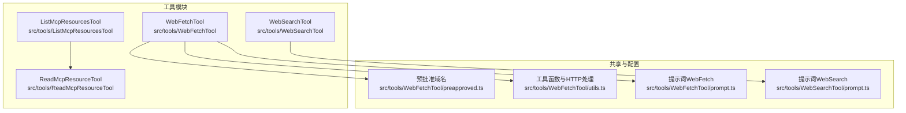
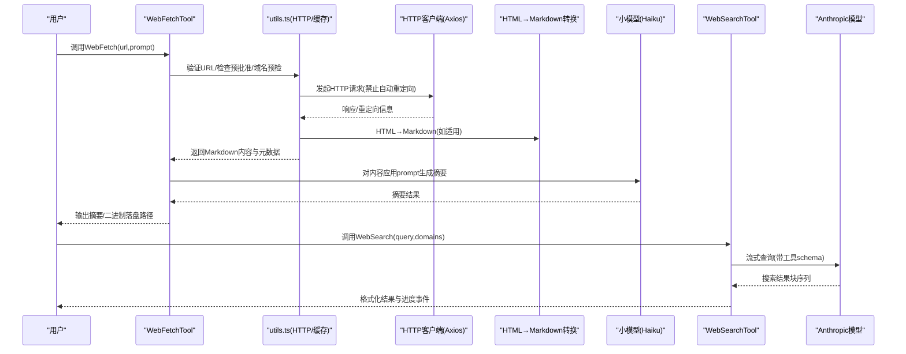
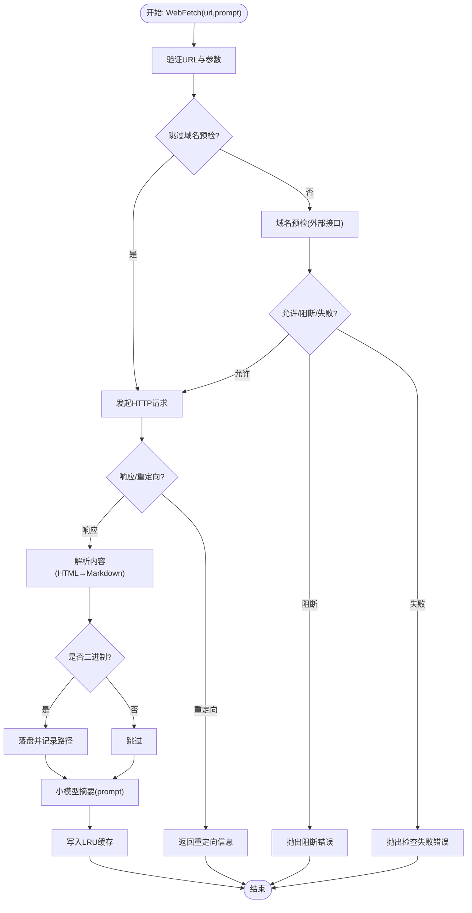
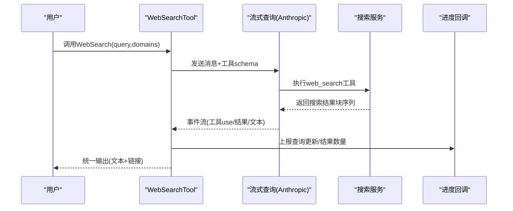
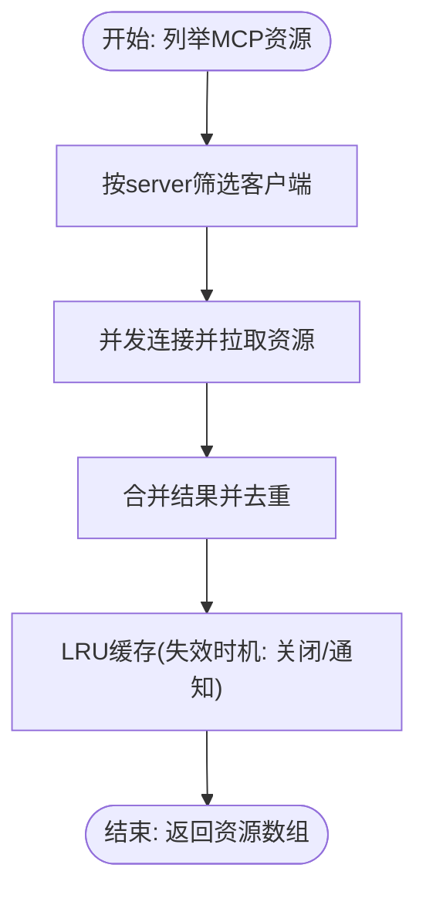
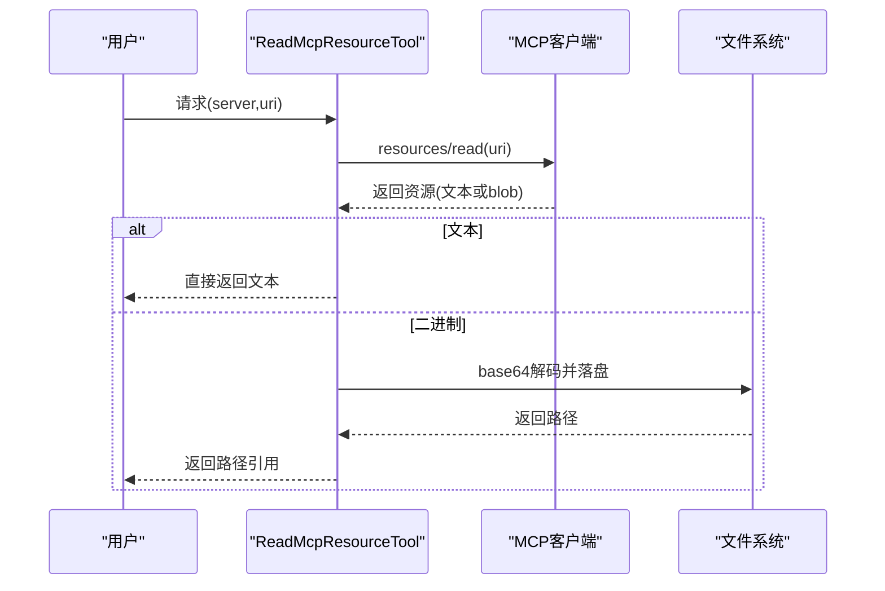
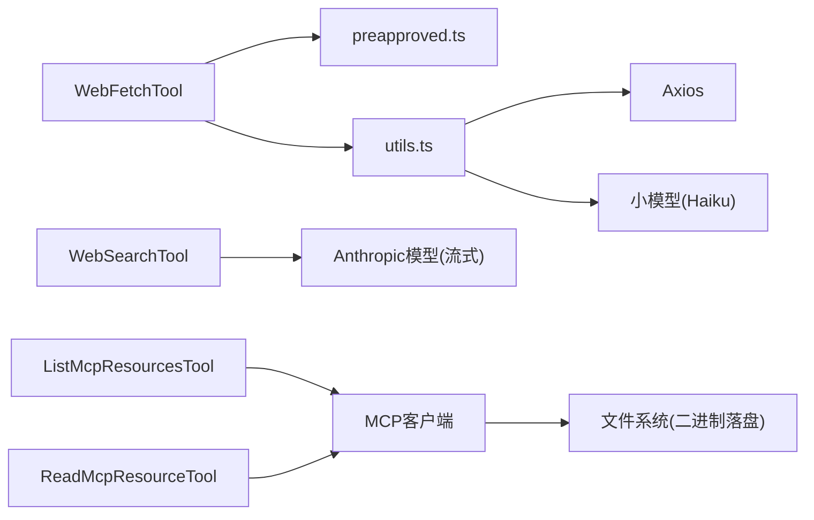

# 网络和Web工具

<cite>
**本文引用的文件**
- [WebFetchTool.ts](file://src/tools/WebFetchTool/WebFetchTool.ts)
- [WebSearchTool.ts](file://src/tools/WebSearchTool/WebSearchTool.ts)
- [ListMcpResourcesTool.ts](file://src/tools/ListMcpResourcesTool/ListMcpResourcesTool.ts)
- [ReadMcpResourceTool.ts](file://src/tools/ReadMcpResourceTool/ReadMcpResourceTool.ts)
- [preapproved.ts](file://src/tools/WebFetchTool/preapproved.ts)
- [utils.ts](file://src/tools/WebFetchTool/utils.ts)
- [prompt.ts（WebFetch）](file://src/tools/WebFetchTool/prompt.ts)
- [prompt.ts（WebSearch）](file://src/tools/WebSearchTool/prompt.ts)
</cite>

## 目录
1. [简介](#简介)
2. [项目结构](#项目结构)
3. [核心组件](#核心组件)
4. [架构总览](#架构总览)
5. [详细组件分析](#详细组件分析)
6. [依赖关系分析](#依赖关系分析)
7. [性能考量](#性能考量)
8. [故障排查指南](#故障排查指南)
9. [结论](#结论)
10. [附录](#附录)

## 简介
本文件面向Claude Code的网络与Web工具，系统性阐述以下能力的设计与实现：
- 网页抓取工具（WebFetchTool）：支持URL验证、预批准域名白名单、安全重定向检查、内容解析与摘要、二进制内容落盘、缓存与超时控制等。
- 网页搜索工具（WebSearchTool）：通过Anthropic模型执行Web搜索，支持域级过滤、流式进度回调、结果聚合与格式化输出。
- MCP资源管理工具（ListMcpResourcesTool、ReadMcpResourceTool）：对已连接的MCP服务器进行资源枚举与读取，包含连接健康检查、LRU缓存、二进制内容落盘与截断检测。

文档同时覆盖HTTP请求处理、内容过滤、图片/二进制处理、预批准域名列表、权限与访问控制、速率与错误重试策略、网络安全最佳实践以及API集成要点。

## 项目结构
与网络与Web工具直接相关的源码位于 src/tools 下的四个工具模块，并辅以共享的工具函数与预批准域名配置。

图表来源
- [WebFetchTool.ts:1-319](file://src/tools/WebFetchTool/WebFetchTool.ts#L1-L319)
- [WebSearchTool.ts:1-436](file://src/tools/WebSearchTool/WebSearchTool.ts#L1-L436)
- [ListMcpResourcesTool.ts:1-124](file://src/tools/ListMcpResourcesTool/ListMcpResourcesTool.ts#L1-L124)
- [ReadMcpResourceTool.ts:1-159](file://src/tools/ReadMcpResourceTool/ReadMcpResourceTool.ts#L1-L159)
- [preapproved.ts:1-167](file://src/tools/WebFetchTool/preapproved.ts#L1-L167)
- [utils.ts:1-531](file://src/tools/WebFetchTool/utils.ts#L1-L531)
- [prompt.ts（WebFetch）:1-47](file://src/tools/WebFetchTool/prompt.ts#L1-L47)
- [prompt.ts（WebSearch）:1-35](file://src/tools/WebSearchTool/prompt.ts#L1-L35)

章节来源
- [WebFetchTool.ts:1-319](file://src/tools/WebFetchTool/WebFetchTool.ts#L1-L319)
- [WebSearchTool.ts:1-436](file://src/tools/WebSearchTool/WebSearchTool.ts#L1-L436)
- [ListMcpResourcesTool.ts:1-124](file://src/tools/ListMcpResourcesTool/ListMcpResourcesTool.ts#L1-L124)
- [ReadMcpResourceTool.ts:1-159](file://src/tools/ReadMcpResourceTool/ReadMcpResourceTool.ts#L1-L159)
- [preapproved.ts:1-167](file://src/tools/WebFetchTool/preapproved.ts#L1-L167)
- [utils.ts:1-531](file://src/tools/WebFetchTool/utils.ts#L1-L531)
- [prompt.ts（WebFetch）:1-47](file://src/tools/WebFetchTool/prompt.ts#L1-L47)
- [prompt.ts（WebSearch）:1-35](file://src/tools/WebSearchTool/prompt.ts#L1-L35)

## 核心组件
- WebFetchTool：面向“只读”网页抓取与内容摘要，内置预批准域名白名单、安全重定向策略、内容长度与缓存限制、二进制内容落盘与提示词驱动的摘要生成。
- WebSearchTool：通过Anthropic模型执行Web搜索，支持域级允许/阻止、流式进度回调、结果块解析与格式化输出。
- ListMcpResourcesTool：列举已连接MCP服务器的资源清单，具备LRU缓存与连接健康检查。
- ReadMcpResourceTool：按URI读取MCP资源，自动处理二进制blob并落盘，返回文本或路径引用。

章节来源
- [WebFetchTool.ts:66-307](file://src/tools/WebFetchTool/WebFetchTool.ts#L66-L307)
- [WebSearchTool.ts:152-435](file://src/tools/WebSearchTool/WebSearchTool.ts#L152-L435)
- [ListMcpResourcesTool.ts:40-123](file://src/tools/ListMcpResourcesTool/ListMcpResourcesTool.ts#L40-L123)
- [ReadMcpResourceTool.ts:49-158](file://src/tools/ReadMcpResourceTool/ReadMcpResourceTool.ts#L49-L158)

## 架构总览
下图展示工具调用链路与关键依赖：

图表来源
- [WebFetchTool.ts:208-299](file://src/tools/WebFetchTool/WebFetchTool.ts#L208-L299)
- [utils.ts:347-482](file://src/tools/WebFetchTool/utils.ts#L347-L482)
- [WebSearchTool.ts:254-399](file://src/tools/WebSearchTool/WebSearchTool.ts#L254-L399)

## 详细组件分析

### WebFetchTool（网页抓取）
- 输入/输出与权限
  - 输入包含URL与prompt；输出包含字节数、HTTP状态、处理后结果、耗时与原始URL。
  - 权限检查优先匹配预批准域名；否则基于规则内容（按主机名）匹配deny/ask/allow策略，必要时引导用户添加本地规则。
- URL验证与安全
  - 长度上限、协议升级（http→https）、用户名/密码字段拒绝、主机名可解析性初筛。
  - 域名预检：通过外部接口查询是否允许抓取；企业环境可跳过预检。
- HTTP请求与重定向
  - 금지自动跟随重定向；仅在“允许重定向”条件下递归跟随，最多10次；跨主机重定向会返回重定向信息而非继续抓取。
- 内容解析与摘要
  - HTML内容转Markdown；非HTML按UTF-8解码；超过长度阈值的内容会被截断并提示。
  - 使用小模型对内容应用prompt生成摘要；若为预批准域名且内容为Markdown且长度足够，可直接返回原文。
- 缓存与二进制处理
  - URL级LRU缓存（15分钟TTL，50MB大小），命中则直接返回；内容大小参与LRU计费。
  - 二进制内容（如PDF）自动落盘并记录路径与大小，便于后续查看。
- 错误与中止
  - 中止信号触发AbortError；网络代理拦截返回特定头部时抛出明确错误类型；重定向过多抛出错误。

图表来源
- [WebFetchTool.ts:104-180](file://src/tools/WebFetchTool/WebFetchTool.ts#L104-L180)
- [utils.ts:347-482](file://src/tools/WebFetchTool/utils.ts#L347-L482)
- [preapproved.ts:14-167](file://src/tools/WebFetchTool/preapproved.ts#L14-L167)

章节来源
- [WebFetchTool.ts:50-319](file://src/tools/WebFetchTool/WebFetchTool.ts#L50-L319)
- [utils.ts:139-531](file://src/tools/WebFetchTool/utils.ts#L139-L531)
- [preapproved.ts:1-167](file://src/tools/WebFetchTool/preapproved.ts#L1-L167)
- [prompt.ts（WebFetch）:1-47](file://src/tools/WebFetchTool/prompt.ts#L1-L47)

### WebSearchTool（网页搜索）
- 工具启用条件
  - 依据API提供商与模型版本决定是否可用（如firstParty、Vertex AI特定模型、Foundry）。
- 输入校验
  - 必填查询；不允许同时指定allowed_domains与blocked_domains。
- 调用流程
  - 构造工具schema（最大使用次数固定为8），通过流式查询触发模型执行web_search工具。
  - 解析流事件：累计server_tool_use输入JSON，提取实际查询；收到web_search_tool_result时上报进度。
  - 最终将内容块序列整理为统一输出结构（混合文本与搜索结果数组）。
- 输出映射
  - 将结果数组格式化为字符串，包含链接列表与“必须包含来源”的提醒，便于后续引用。

图表来源
- [WebSearchTool.ts:254-399](file://src/tools/WebSearchTool/WebSearchTool.ts#L254-L399)

章节来源
- [WebSearchTool.ts:152-435](file://src/tools/WebSearchTool/WebSearchTool.ts#L152-L435)
- [prompt.ts（WebSearch）:1-35](file://src/tools/WebSearchTool/prompt.ts#L1-L35)

### ListMcpResourcesTool（MCP资源枚举）
- 功能要点
  - 支持按服务器名称筛选；对所有可用客户端并行拉取资源。
  - 连接健康检查：ensureConnectedClient在断开后重新建立连接；LRU缓存按服务器名缓存资源列表，避免陈旧数据。
  - 结果扁平化与错误隔离：单个服务器异常不影响整体结果。
- 输出与截断
  - 输出为资源数组；若终端输出被截断则标记为截断，便于UI提示。

图表来源
- [ListMcpResourcesTool.ts:66-101](file://src/tools/ListMcpResourcesTool/ListMcpResourcesTool.ts#L66-L101)

章节来源
- [ListMcpResourcesTool.ts:40-123](file://src/tools/ListMcpResourcesTool/ListMcpResourcesTool.ts#L40-L123)

### ReadMcpResourceTool（MCP资源读取）
- 功能要点
  - 按服务器名与URI读取资源；要求服务器已连接且具备resources能力。
  - 自动处理二进制blob：解码base64并落盘，替换为保存路径；文本资源直接返回。
  - 输出为JSON字符串，便于上下文传递与UI渲染。
- 错误处理
  - 服务器不存在/未连接/不支持resources均抛出明确错误；二进制落盘失败时返回错误信息。

图表来源
- [ReadMcpResourceTool.ts:75-143](file://src/tools/ReadMcpResourceTool/ReadMcpResourceTool.ts#L75-L143)

章节来源
- [ReadMcpResourceTool.ts:49-158](file://src/tools/ReadMcpResourceTool/ReadMcpResourceTool.ts#L49-L158)

## 依赖关系分析
- WebFetchTool依赖
  - 预批准域名集合用于快速判定；HTTP工具负责URL验证、域名预检、受限重定向跟随、内容解析与缓存；小模型用于摘要生成。
- WebSearchTool依赖
  - 流式查询接口、工具schema注入、进度事件解析与结果聚合。
- MCP工具依赖
  - 客户端连接管理与资源读取；二进制落盘与终端截断检测。

图表来源
- [WebFetchTool.ts:1-319](file://src/tools/WebFetchTool/WebFetchTool.ts#L1-L319)
- [utils.ts:1-531](file://src/tools/WebFetchTool/utils.ts#L1-L531)
- [WebSearchTool.ts:1-436](file://src/tools/WebSearchTool/WebSearchTool.ts#L1-L436)
- [ListMcpResourcesTool.ts:1-124](file://src/tools/ListMcpResourcesTool/ListMcpResourcesTool.ts#L1-L124)
- [ReadMcpResourceTool.ts:1-159](file://src/tools/ReadMcpResourceTool/ReadMcpResourceTool.ts#L1-L159)

章节来源
- [WebFetchTool.ts:1-319](file://src/tools/WebFetchTool/WebFetchTool.ts#L1-L319)
- [WebSearchTool.ts:1-436](file://src/tools/WebSearchTool/WebSearchTool.ts#L1-L436)
- [ListMcpResourcesTool.ts:1-124](file://src/tools/ListMcpResourcesTool/ListMcpResourcesTool.ts#L1-L124)
- [ReadMcpResourceTool.ts:1-159](file://src/tools/ReadMcpResourceTool/ReadMcpResourceTool.ts#L1-L159)

## 性能考量
- 缓存策略
  - URL级LRU缓存（15分钟TTL，50MB上限），命中可显著降低重复请求成本；域名预检独立缓存（5分钟TTL）减少同域重复检查。
- 资源消耗控制
  - 单次HTTP内容长度上限、请求超时、重定向上限，防止资源滥用与长时间占用。
- 并发与延迟
  - MCP资源枚举采用并发拉取并行化；WebSearchTool通过流式事件逐步产出结果，提升感知速度。
- 输出截断
  - MCP工具输出支持终端截断检测，避免超长输出影响交互体验。

章节来源
- [utils.ts:61-79](file://src/tools/WebFetchTool/utils.ts#L61-L79)
- [utils.ts:112-128](file://src/tools/WebFetchTool/utils.ts#L112-L128)
- [ListMcpResourcesTool.ts:79-96](file://src/tools/ListMcpResourcesTool/ListMcpResourcesTool.ts#L79-L96)
- [WebSearchTool.ts:299-388](file://src/tools/WebSearchTool/WebSearchTool.ts#L299-L388)

## 故障排查指南
- 常见错误类型
  - 域名阻断：来自外部域名预检接口的阻断；建议更换目标或申请白名单。
  - 域名检查失败：网络限制或外部接口不可达；可选择跳过预检（企业设置）。
  - 代理拦截：403且特定头部表示出口策略阻断；需调整网络策略。
  - 重定向跨主机：工具不会自动跟随，需改用新URL重新请求。
  - 中止：用户中断或超时导致；可重试或缩短内容长度。
- MCP工具
  - 服务器未找到/未连接/不支持resources：检查服务器状态与能力声明；确保已连接。
  - 二进制落盘失败：检查磁盘空间与权限；工具会回退为文本提示。

章节来源
- [utils.ts:20-48](file://src/tools/WebFetchTool/utils.ts#L20-L48)
- [utils.ts:316-329](file://src/tools/WebFetchTool/utils.ts#L316-L329)
- [WebFetchTool.ts:216-249](file://src/tools/WebFetchTool/WebFetchTool.ts#L216-L249)
- [ReadMcpResourceTool.ts:80-92](file://src/tools/ReadMcpResourceTool/ReadMcpResourceTool.ts#L80-L92)

## 结论
WebFetchTool与WebSearchTool分别覆盖“离线内容抽取+摘要”与“在线实时检索+溯源”的两大场景，配合MCP工具实现对本地/私有资源的发现与读取。通过严格的URL验证、域名预检、受限重定向、缓存与资源上限控制，以及二进制内容落盘与进度反馈，系统在安全性与可用性之间取得平衡。建议在企业环境中结合预批准域名与访问控制策略，配合MCP工具实现更细粒度的资源治理。

## 附录
- 网络安全最佳实践
  - 优先使用MCP认证工具访问受保护资源；避免对未知域执行抓取。
  - 合理设置allowed_domains/blocked_domains，减少无关噪声与风险面。
  - 对长内容与高并发请求设置合理超时与重试策略，避免成为攻击放大器。
- 内容质量评估
  - WebFetchTool对HTML→Markdown转换与小模型摘要相结合，适合快速理解与提炼；对于法律/版权敏感内容，遵循严格引用与摘要规范。
- API集成指南
  - WebSearchTool通过工具schema与流式事件与模型对接；集成方需正确处理事件分片与工具use_id映射。
  - MCP工具需维护客户端生命周期与缓存失效策略，确保资源列表新鲜度。