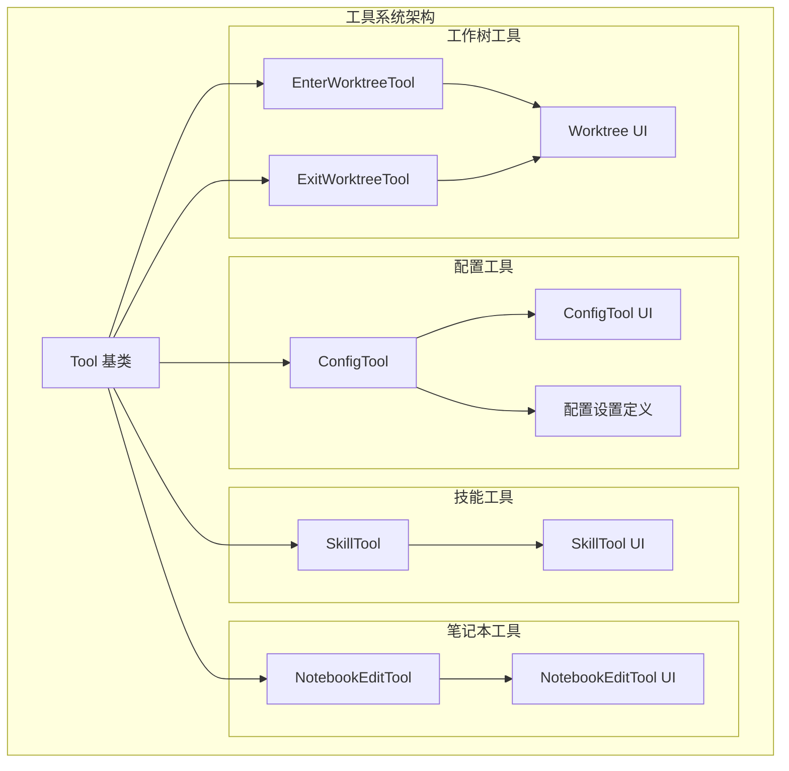
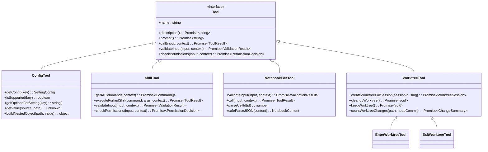
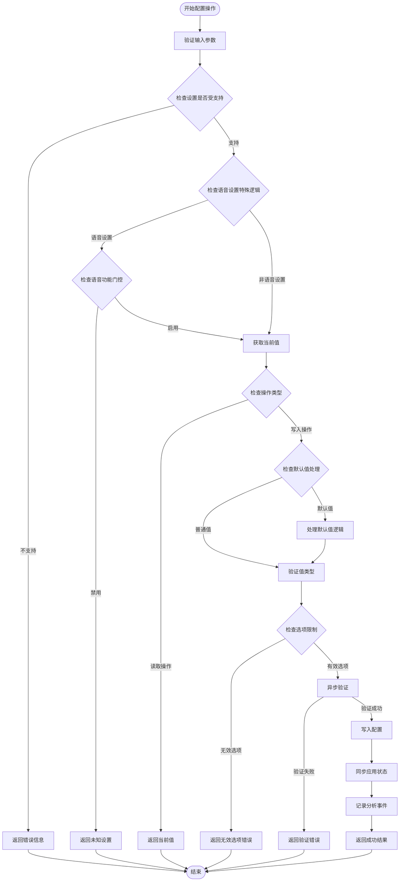
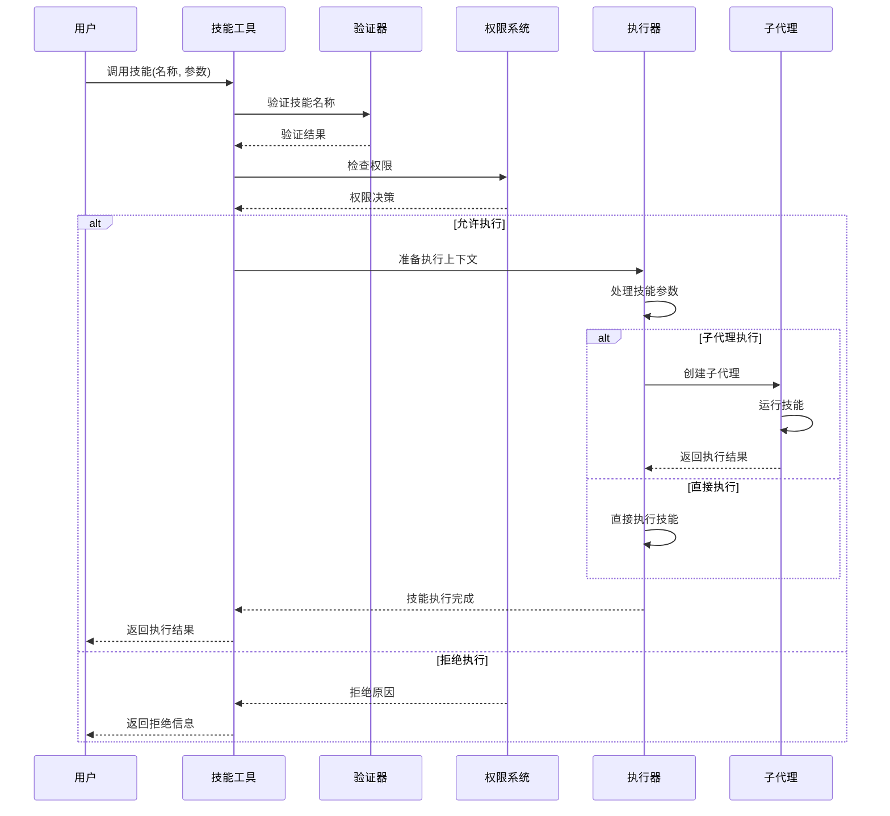
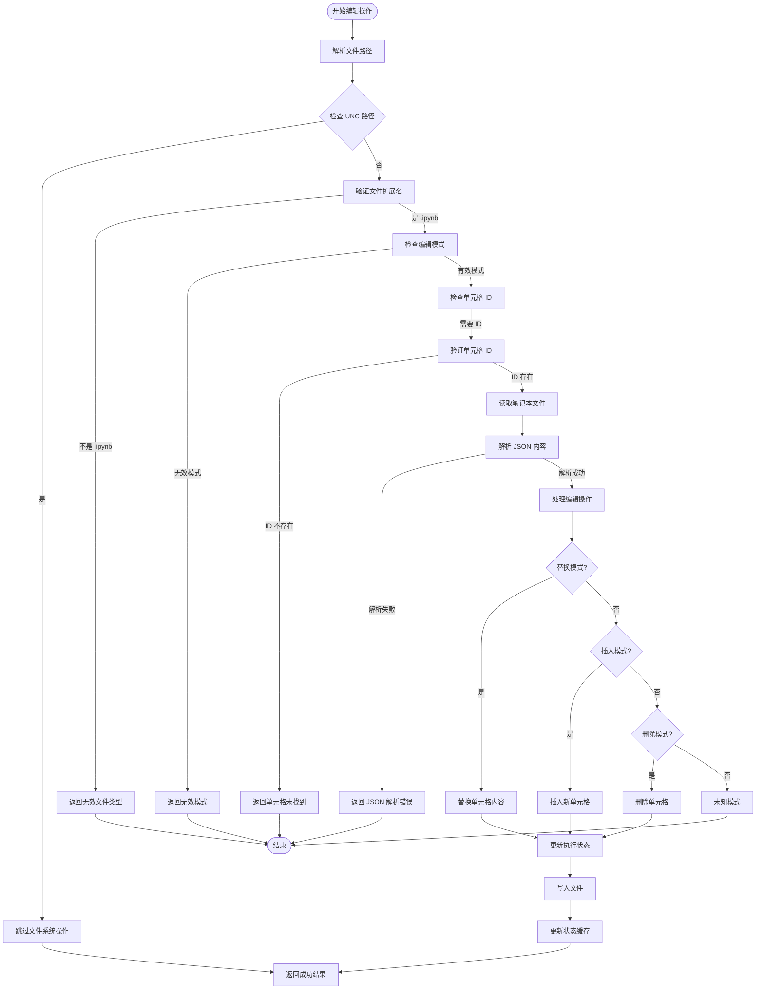
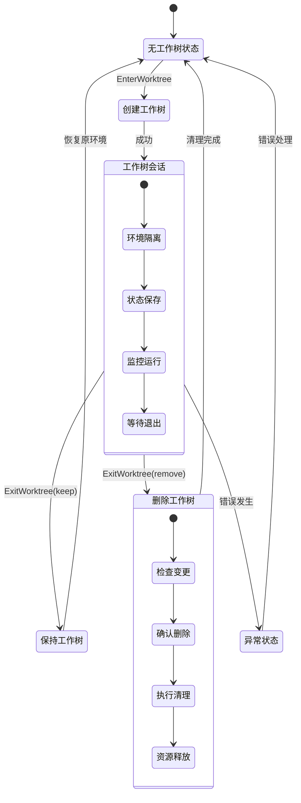

# 配置和定制工具

<cite>
**本文档引用的文件**
- [ConfigTool.ts](file://src/tools/ConfigTool/ConfigTool.ts)
- [UI.tsx](file://src/tools/ConfigTool/UI.tsx)
- [supportedSettings.ts](file://src/tools/ConfigTool/supportedSettings.ts)
- [SkillTool.ts](file://src/tools/SkillTool/SkillTool.ts)
- [UI.tsx](file://src/tools/SkillTool/UI.tsx)
- [NotebookEditTool.ts](file://src/tools/NotebookEditTool/NotebookEditTool.ts)
- [UI.tsx](file://src/tools/NotebookEditTool/UI.tsx)
- [EnterWorktreeTool.ts](file://src/tools/EnterWorktreeTool/EnterWorktreeTool.ts)
- [UI.tsx](file://src/tools/EnterWorktreeTool/UI.tsx)
- [ExitWorktreeTool.ts](file://src/tools/ExitWorktreeTool/ExitWorktreeTool.ts)
- [UI.tsx](file://src/tools/ExitWorktreeTool/UI.tsx)
</cite>

## 目录
1. [简介](#简介)
2. [项目结构](#项目结构)
3. [核心组件](#核心组件)
4. [架构概览](#架构概览)
5. [详细组件分析](#详细组件分析)
6. [依赖关系分析](#依赖关系分析)
7. [性能考虑](#性能考虑)
8. [故障排除指南](#故障排除指南)
9. [结论](#结论)
10. [附录](#附录)

## 简介

本文档深入介绍了 Claude Code 的配置和定制工具系统，重点涵盖以下五个核心工具：

- **配置工具（ConfigTool）**：提供统一的设置管理界面，支持读取和修改各种系统配置
- **技能工具（SkillTool）**：负责技能的加载、验证和执行，支持本地和远程技能
- **笔记本编辑工具（NotebookEditTool）**：专门处理 Jupyter 笔记本文件的编辑操作
- **工作树工具**：包括进入工作树（EnterWorktreeTool）和退出工作树（ExitWorktreeTool），用于项目环境切换
- **个性化设置和工作流定制**：提供最佳实践和使用指导

这些工具共同构成了 Claude Code 的强大定制能力，允许用户根据个人需求和工作流程进行深度定制。

## 项目结构

Claude Code 的工具系统采用模块化设计，每个工具都遵循统一的架构模式：

**图表来源**
- [ConfigTool.ts:67-434](file://src/tools/ConfigTool/ConfigTool.ts#L67-L434)
- [SkillTool.ts:331-800](file://src/tools/SkillTool/SkillTool.ts#L331-L800)
- [NotebookEditTool.ts:90-491](file://src/tools/NotebookEditTool/NotebookEditTool.ts#L90-L491)
- [EnterWorktreeTool.ts:52-128](file://src/tools/EnterWorktreeTool/EnterWorktreeTool.ts#L52-L128)
- [ExitWorktreeTool.ts:148-330](file://src/tools/ExitWorktreeTool/ExitWorktreeTool.ts#L148-L330)

## 核心组件

### 配置工具（ConfigTool）

配置工具提供了统一的设置管理接口，支持多种配置类型的读取和写入操作：

#### 主要功能特性
- **多源配置支持**：支持全局配置和用户设置两种存储源
- **类型安全**：使用 Zod 模式验证确保配置值的有效性
- **动态选项**：支持运行时动态生成配置选项
- **权限控制**：区分读取和写入操作的权限要求
- **即时同步**：配置变更后自动同步到应用状态

#### 支持的配置类型
- **主题设置**：UI 主题选择和自定义
- **编辑器模式**：键盘绑定模式配置
- **调试选项**：详细日志输出控制
- **通知设置**：通知渠道和偏好
- **模型配置**：AI 模型选择和参数
- **语音功能**：语音识别和字幕功能

**章节来源**
- [ConfigTool.ts:67-434](file://src/tools/ConfigTool/ConfigTool.ts#L67-L434)
- [supportedSettings.ts:29-186](file://src/tools/ConfigTool/supportedSettings.ts#L29-L186)

### 技能工具（SkillTool）

技能工具负责管理和执行各种预定义的技能，支持从本地和远程来源加载技能：

#### 技能执行机制
- **技能发现**：自动扫描本地和远程技能资源
- **权限验证**：基于规则系统进行权限控制
- **上下文隔离**：支持在独立子代理中执行技能
- **进度跟踪**：实时显示技能执行进度
- **错误处理**：完善的异常捕获和恢复机制

#### 技能类型支持
- **内置技能**：预装的系统技能
- **捆绑技能**：随软件分发的技能包
- **官方市场技能**：来自官方市场的技能
- **第三方技能**：社区贡献的技能
- **远程技能**：通过网络加载的技能

**章节来源**
- [SkillTool.ts:331-800](file://src/tools/SkillTool/SkillTool.ts#L331-L800)
- [SkillTool.ts:580-800](file://src/tools/SkillTool/SkillTool.ts#L580-L800)

### 笔记本编辑工具（NotebookEditTool）

专为 Jupyter 笔记本文件设计的编辑工具，提供精确的单元格级编辑能力：

#### 编辑模式
- **替换模式**：替换现有单元格内容
- **插入模式**：在指定位置插入新单元格
- **删除模式**：移除指定单元格

#### 安全保障
- **读前编辑**：强制先读取文件再进行编辑
- **版本检查**：检测文件修改冲突
- **数据完整性**：保持笔记本文件格式正确性
- **执行状态重置**：自动清理受影响单元格的执行结果

**章节来源**
- [NotebookEditTool.ts:90-491](file://src/tools/NotebookEditTool/NotebookEditTool.ts#L90-L491)

### 工作树工具

工作树工具提供项目环境的隔离和切换能力，支持临时开发环境的创建和管理。

#### 进入工作树
- **自动路径解析**：智能定位项目根目录
- **随机命名**：自动生成唯一的工作树名称
- **环境隔离**：创建完全隔离的开发环境
- **状态保存**：记录工作树会话信息

#### 退出工作树
- **状态恢复**：恢复到原始工作环境
- **清理选项**：可选择保留或删除工作树
- **变更统计**：报告未提交的更改
- **资源释放**：清理相关系统资源

**章节来源**
- [EnterWorktreeTool.ts:52-128](file://src/tools/EnterWorktreeTool/EnterWorktreeTool.ts#L52-L128)
- [ExitWorktreeTool.ts:148-330](file://src/tools/ExitWorktreeTool/ExitWorktreeTool.ts#L148-L330)

## 架构概览

Claude Code 的工具系统采用统一的架构模式，所有工具都继承自相同的基类并遵循一致的设计原则：

**图表来源**
- [ConfigTool.ts:67-434](file://src/tools/ConfigTool/ConfigTool.ts#L67-L434)
- [SkillTool.ts:331-800](file://src/tools/SkillTool/SkillTool.ts#L331-L800)
- [NotebookEditTool.ts:90-491](file://src/tools/NotebookEditTool/NotebookEditTool.ts#L90-L491)
- [EnterWorktreeTool.ts:52-128](file://src/tools/EnterWorktreeTool/EnterWorktreeTool.ts#L52-L128)
- [ExitWorktreeTool.ts:148-330](file://src/tools/ExitWorktreeTool/ExitWorktreeTool.ts#L148-L330)

## 详细组件分析

### 配置工具深度分析

配置工具是整个定制系统的核心，它提供了统一的配置管理接口：

#### 配置验证流程

**图表来源**
- [ConfigTool.ts:111-411](file://src/tools/ConfigTool/ConfigTool.ts#L111-L411)

#### 配置设置定义

配置工具通过集中化的设置定义系统管理所有可配置项：

| 设置键 | 类型 | 描述 | 存储源 | 应用状态同步 |
|--------|------|------|--------|-------------|
| theme | string | UI 主题 | global | 否 |
| editorMode | string | 键盘绑定模式 | global | 否 |
| verbose | boolean | 详细调试输出 | global | 是 (verbose) |
| model | string | AI 模型选择 | settings | 是 (mainLoopModel) |
| alwaysThinkingEnabled | boolean | 扩展思考模式 | settings | 是 (thinkingEnabled) |
| permissions.defaultMode | string | 默认权限模式 | settings | 否 |
| language | string | 响应语言 | settings | 否 |
| teammateMode | string | 团队成员模式 | global | 否 |

**章节来源**
- [supportedSettings.ts:29-186](file://src/tools/ConfigTool/supportedSettings.ts#L29-L186)

### 技能工具执行流程

技能工具的执行过程涉及多个层次的安全检查和权限验证：

#### 技能执行序列图

**图表来源**
- [SkillTool.ts:580-800](file://src/tools/SkillTool/SkillTool.ts#L580-L800)

#### 技能分类和来源

| 技能来源 | 描述 | 安全级别 | 执行方式 |
|----------|------|----------|----------|
| 内置技能 | 系统预装的核心技能 | 高 | 直接执行 |
| 捆绑技能 | 随软件分发的标准技能 | 中高 | 直接执行 |
| 官方市场技能 | 来自官方市场的认证技能 | 中 | 直接执行 |
| 第三方技能 | 社区贡献的技能 | 中 | 直接执行 |
| 远程技能 | 通过网络加载的技能 | 低 | 子代理执行 |

**章节来源**
- [SkillTool.ts:81-94](file://src/tools/SkillTool/SkillTool.ts#L81-L94)
- [SkillTool.ts:614-632](file://src/tools/SkillTool/SkillTool.ts#L614-L632)

### 笔记本编辑工具工作流程

笔记本编辑工具提供了精确的单元格级编辑能力，确保 Jupyter 笔记本文件的完整性和一致性：

#### 编辑操作流程

**图表来源**
- [NotebookEditTool.ts:295-491](file://src/tools/NotebookEditTool/NotebookEditTool.ts#L295-L491)

**章节来源**
- [NotebookEditTool.ts:176-294](file://src/tools/NotebookEditTool/NotebookEditTool.ts#L176-L294)

### 工作树工具环境管理

工作树工具提供了项目环境的隔离和切换能力，支持临时开发环境的创建和管理：

#### 工作树生命周期管理

**图表来源**
- [EnterWorktreeTool.ts:77-119](file://src/tools/EnterWorktreeTool/EnterWorktreeTool.ts#L77-L119)
- [ExitWorktreeTool.ts:227-321](file://src/tools/ExitWorktreeTool/ExitWorktreeTool.ts#L227-L321)

**章节来源**
- [EnterWorktreeTool.ts:77-119](file://src/tools/EnterWorktreeTool/EnterWorktreeTool.ts#L77-L119)
- [ExitWorktreeTool.ts:174-224](file://src/tools/ExitWorktreeTool/ExitWorktreeTool.ts#L174-L224)

## 依赖关系分析

Claude Code 的工具系统具有清晰的依赖层次结构，确保了系统的模块化和可维护性：

```mermaid
graph TB
subgraph "核心依赖"
ToolBase[Tool 基类]
Utils[通用工具]
Types[类型定义]
end
subgraph "配置工具依赖"
ConfigTool --> ConfigUtils[配置工具]
ConfigTool --> Settings[设置管理]
ConfigTool --> Analytics[分析服务]
ConfigTool --> Permissions[权限检查]
end
subgraph "技能工具依赖"
SkillTool --> CommandSystem[命令系统]
SkillTool --> AgentSystem[代理系统]
SkillTool --> PermissionSystem[权限系统]
SkillTool --> Telemetry[遥测服务]
end
subgraph "笔记本工具依赖"
NotebookTool --> FileOps[文件操作]
NotebookTool --> JSONParser[JSON 解析]
NotebookTool --> CellParser[单元格解析]
NotebookTool --> History[历史记录]
end
subgraph "工作树工具依赖"
WorktreeTool --> GitOps[Git 操作]
WorktreeTool --> FSOps[文件系统操作]
WorktreeTool --> SessionState[会话状态]
WorktreeTool --> TmuxOps[Tmux 操作]
end
ToolBase --> Utils
ToolBase --> Types
ConfigTool --> Utils
SkillTool --> Utils
NotebookTool --> Utils
WorktreeTool --> Utils
```

**图表来源**
- [ConfigTool.ts:1-50](file://src/tools/ConfigTool/ConfigTool.ts#L1-L50)
- [SkillTool.ts:1-68](file://src/tools/SkillTool/SkillTool.ts#L1-L68)
- [NotebookEditTool.ts:1-28](file://src/tools/NotebookEditTool/NotebookEditTool.ts#L1-L28)
- [EnterWorktreeTool.ts:1-18](file://src/tools/EnterWorktreeTool/EnterWorktreeTool.ts#L1-L18)
- [ExitWorktreeTool.ts:1-25](file://src/tools/ExitWorktreeTool/ExitWorktreeTool.ts#L1-L25)

### 关键依赖关系

| 组件 | 主要依赖 | 用途 |
|------|----------|------|
| ConfigTool | zod, analytics, settings | 配置验证和管理 |
| SkillTool | commands, agent, permissions | 技能加载和执行 |
| NotebookEditTool | file, json, notebook | 笔记本文件操作 |
| EnterWorktreeTool | git, worktree, session | 工作树创建和管理 |
| ExitWorktreeTool | git, worktree, session | 工作树清理和恢复 |

**章节来源**
- [ConfigTool.ts:1-35](file://src/tools/ConfigTool/ConfigTool.ts#L1-L35)
- [SkillTool.ts:1-68](file://src/tools/SkillTool/SkillTool.ts#L1-L68)
- [NotebookEditTool.ts:1-28](file://src/tools/NotebookEditTool/NotebookEditTool.ts#L1-L28)
- [EnterWorktreeTool.ts:1-18](file://src/tools/EnterWorktreeTool/EnterWorktreeTool.ts#L1-L18)
- [ExitWorktreeTool.ts:1-25](file://src/tools/ExitWorktreeTool/ExitWorktreeTool.ts#L1-L25)

## 性能考虑

### 配置工具性能优化

配置工具采用了多种性能优化策略：

- **延迟模式**：配置工具标记为可延迟执行，避免阻塞主流程
- **缓存机制**：配置值在内存中缓存，减少重复读取开销
- **增量更新**：只更新发生变化的配置项
- **异步验证**：复杂的配置验证在后台线程执行

### 技能工具性能优化

技能工具的性能优化主要体现在：

- **子代理隔离**：复杂技能在独立子代理中执行，不影响主进程
- **内存管理**：及时清理技能执行产生的临时数据
- **并发控制**：限制同时执行的技能数量
- **进度反馈**：提供实时进度信息，避免长时间无响应

### 笔记本编辑性能优化

笔记本编辑工具的性能考虑：

- **增量解析**：只解析必要的部分，避免全文件解析
- **内存映射**：大文件使用内存映射技术
- **批量操作**：支持批量编辑操作，减少文件 I/O 次数
- **缓存策略**：缓存最近编辑的文件内容

## 故障排除指南

### 配置工具常见问题

#### 配置读取失败
**症状**：无法获取配置值或返回空值
**解决方案**：
1. 检查配置键是否存在
2. 验证配置路径是否正确
3. 确认配置存储源可用
4. 查看应用状态同步是否正常

#### 配置写入失败
**症状**：配置修改后立即失效或报错
**解决方案**：
1. 检查权限是否足够
2. 验证配置值格式是否正确
3. 确认目标存储源有写权限
4. 查看是否有并发写入冲突

### 技能工具常见问题

#### 技能执行超时
**症状**：技能长时间无响应
**解决方案**：
1. 检查技能复杂度和计算需求
2. 考虑使用子代理执行
3. 增加超时时间设置
4. 分解复杂技能为简单步骤

#### 权限拒绝
**症状**：技能执行被拒绝
**解决方案**：
1. 检查权限规则配置
2. 添加相应的允许规则
3. 使用管理员权限执行
4. 联系系统管理员

### 笔记本编辑常见问题

#### 文件格式错误
**症状**：编辑笔记本时报 JSON 解析错误
**解决方案**：
1. 检查文件是否为有效的 Jupyter 笔记本格式
2. 验证文件编码和换行符
3. 使用 Jupyter 工具修复文件
4. 检查文件完整性

#### 单元格 ID 不存在
**症状**：指定的单元格 ID 无法找到
**解决方案**：
1. 检查单元格 ID 是否正确
2. 验证单元格索引范围
3. 使用单元格索引代替 ID
4. 重新读取文件获取最新 ID

### 工作树工具常见问题

#### 工作树创建失败
**症状**：无法创建新的工作树
**解决方案**：
1. 检查 Git 版本和配置
2. 验证磁盘空间和权限
3. 确认项目根目录可访问
4. 检查是否有冲突的工作树

#### 工作树清理失败
**症状**：退出工作树时出现错误
**解决方案**：
1. 检查工作树状态和变更
2. 确认所有文件已保存
3. 验证 Git 仓库完整性
4. 手动清理残留文件

**章节来源**
- [ConfigTool.ts:111-411](file://src/tools/ConfigTool/ConfigTool.ts#L111-L411)
- [SkillTool.ts:354-430](file://src/tools/SkillTool/SkillTool.ts#L354-L430)
- [NotebookEditTool.ts:176-294](file://src/tools/NotebookEditTool/NotebookEditTool.ts#L176-L294)
- [EnterWorktreeTool.ts:77-119](file://src/tools/EnterWorktreeTool/EnterWorktreeTool.ts#L77-L119)
- [ExitWorktreeTool.ts:174-224](file://src/tools/ExitWorktreeTool/ExitWorktreeTool.ts#L174-L224)

## 结论

Claude Code 的配置和定制工具系统展现了高度的模块化设计和强大的功能集成能力。通过统一的工具架构，系统实现了：

### 核心优势

1. **统一接口**：所有工具遵循相同的接口规范，便于扩展和维护
2. **安全性**：完善的权限控制系统和输入验证机制
3. **可扩展性**：模块化设计支持新工具的快速集成
4. **用户体验**：直观的界面和详细的反馈信息
5. **性能优化**：针对不同场景的性能优化策略

### 最佳实践建议

1. **配置管理**
   - 使用 ConfigTool 进行集中配置管理
   - 定期备份重要配置
   - 利用默认值简化配置

2. **技能使用**
   - 优先使用内置和官方认证技能
   - 建立技能使用权限规则
   - 监控技能执行性能

3. **笔记本编辑**
   - 始终先读取再编辑
   - 定期备份重要的笔记本文件
   - 使用版本控制管理变更

4. **工作树管理**
   - 合理规划工作树命名
   - 及时清理不需要的工作树
   - 建立工作树使用规范

这个工具系统为 Claude Code 提供了强大的定制能力，使用户能够根据个人需求和工作流程进行深度定制，提高开发效率和工作质量。

## 附录

### 配置键参考表

| 配置键 | 类型 | 默认值 | 描述 |
|--------|------|--------|------|
| theme | string | "light" | UI 主题选择 |
| verbose | boolean | false | 详细调试输出 |
| model | string | null | AI 模型选择 |
| permissions.defaultMode | string | "default" | 默认权限模式 |
| language | string | "english" | 响应语言 |
| teammateMode | string | "auto" | 团队成员模式 |

### 技能分类参考

| 技能类别 | 示例技能 | 安全等级 |
|----------|----------|----------|
| 开发工具 | commit, review-pr | 高 |
| 文档处理 | pdf, markdown | 中 |
| 系统操作 | bash, file | 中高 |
| 数据分析 | jupyter, plot | 中 |

### 工作树操作参考

| 操作 | 参数 | 描述 |
|------|------|------|
| 创建 | name: string | 创建新的工作树 |
| 保持 | action: "keep" | 保留工作树并退出 |
| 删除 | action: "remove", discard_changes: boolean | 删除工作树并退出 |