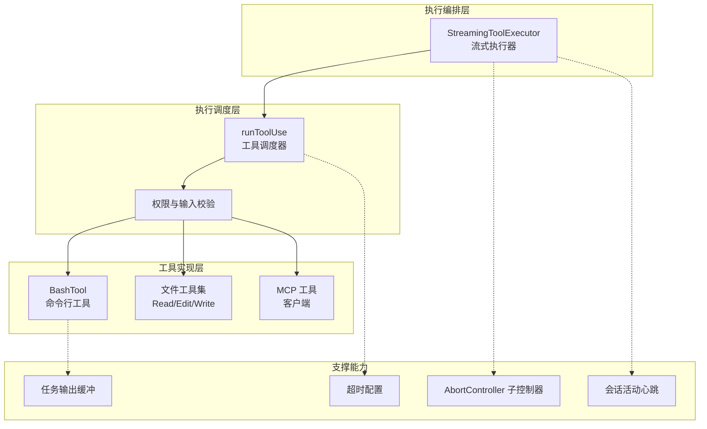
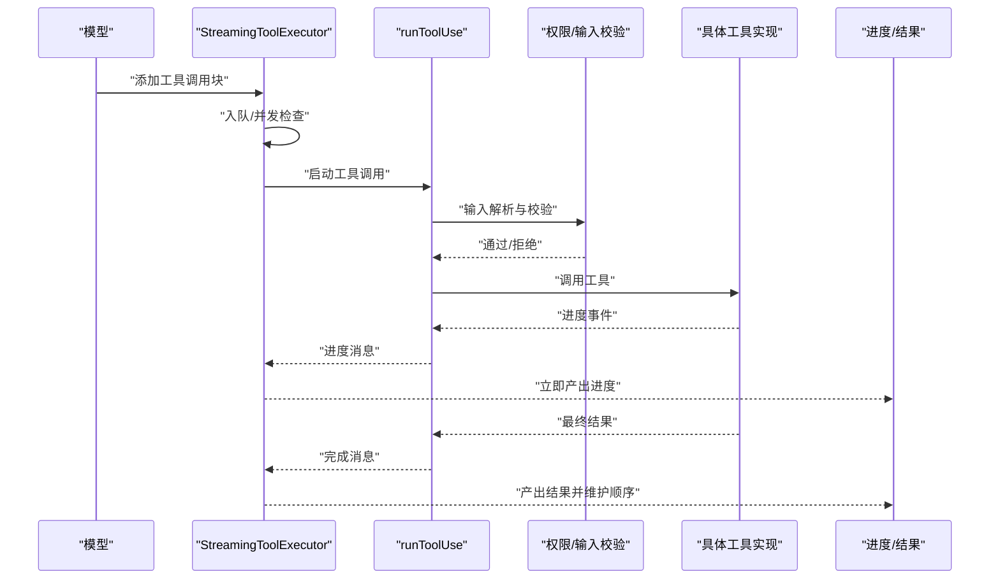
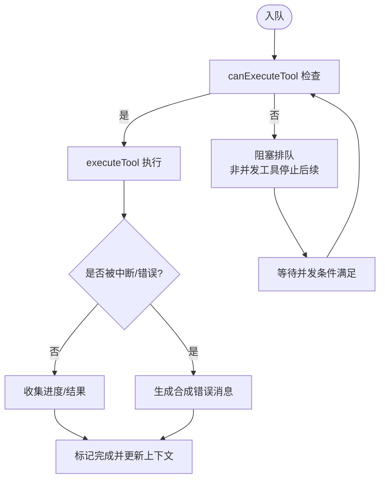
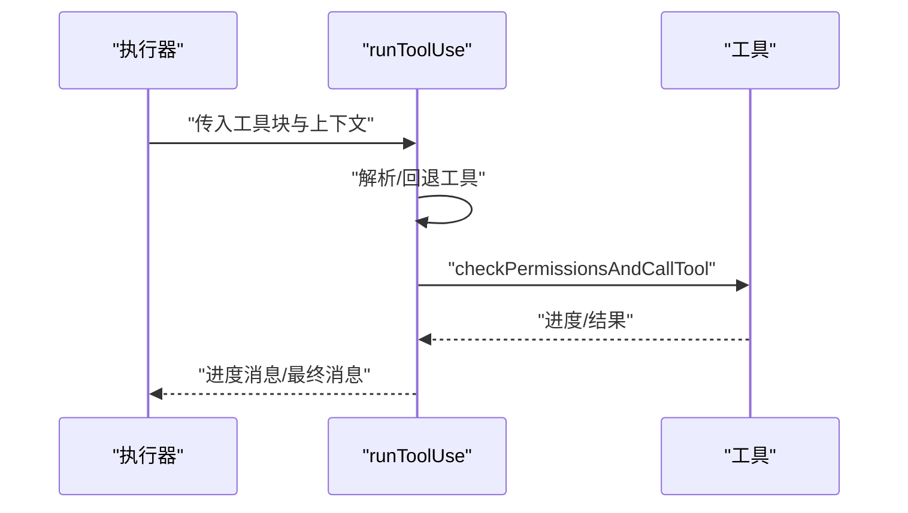
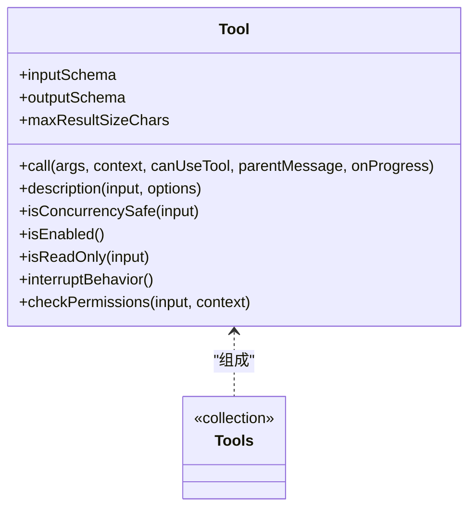
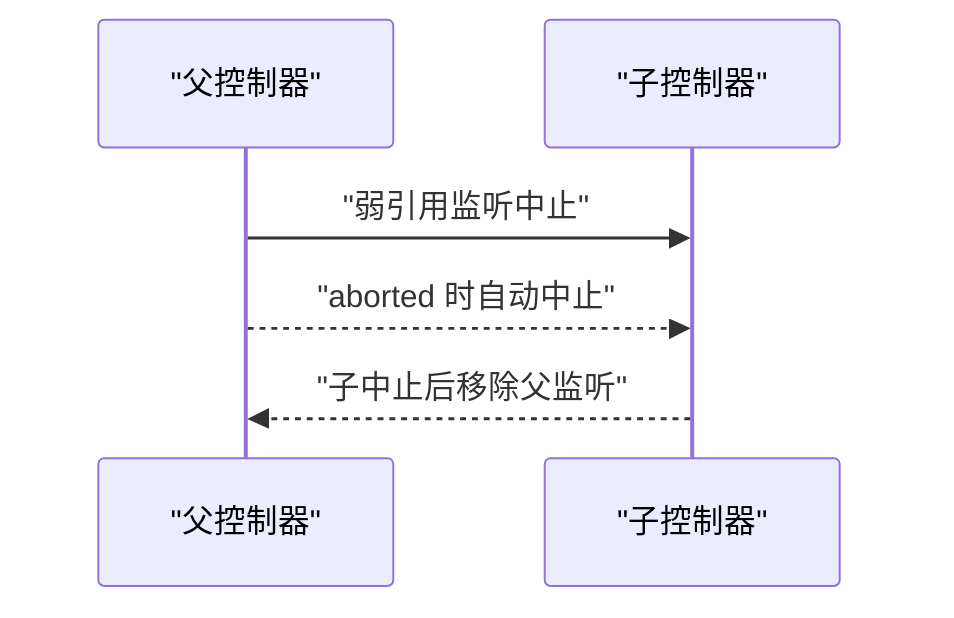
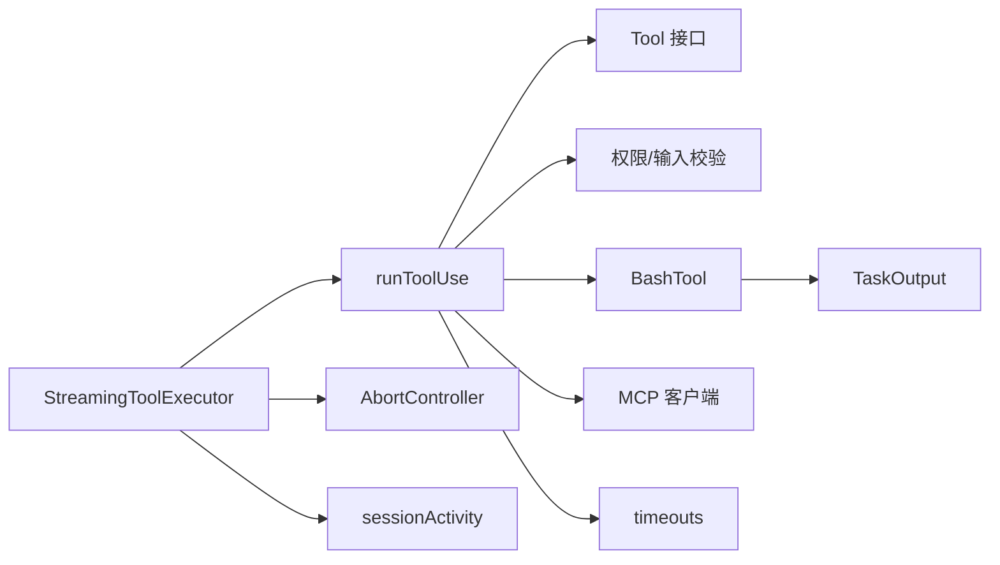

# 工具执行引擎

<cite>
**本文档引用的文件**
- [StreamingToolExecutor.ts](file://src/services/tools/StreamingToolExecutor.ts)
- [toolExecution.ts](file://src/services/tools/toolExecution.ts)
- [Tool.ts](file://src/Tool.ts)
- [tools.ts](file://src/tools.ts)
- [timeouts.ts](file://src/utils/timeouts.ts)
- [abortController.ts](file://src/utils/abortController.ts)
- [sessionActivity.ts](file://src/utils/sessionActivity.ts)
- [TaskOutput.ts](file://src/utils/task/TaskOutput.ts)
- [BashTool.tsx](file://src/tools/BashTool/BashTool.tsx)
- [client.ts](file://src/services/mcp/client.ts)
- [metadata.ts](file://src/services/analytics/metadata.ts)
- [diagLogs.ts](file://src/utils/diagLogs.ts)
- [errors.ts](file://src/utils/errors.ts)
- [hooks.ts](file://src/utils/hooks.ts)
</cite>

## 目录
1. [简介](#简介)
2. [项目结构](#项目结构)
3. [核心组件](#核心组件)
4. [架构总览](#架构总览)
5. [详细组件分析](#详细组件分析)
6. [依赖关系分析](#依赖关系分析)
7. [性能考量](#性能考量)
8. [故障排查指南](#故障排查指南)
9. [结论](#结论)

## 简介
本文件系统性阐述 Claude Code 的工具执行引擎，覆盖执行器设计、并发控制、错误处理、流式执行、监控与日志、安全保障（超时、内存、异常恢复）以及性能优化与故障诊断方法。目标是帮助开发者与使用者理解从“工具选择—参数准备—执行—结果返回”的完整链路，并掌握在复杂场景下的可观测性与稳定性保障。

## 项目结构
工具执行引擎由三层协作构成：
- 执行编排层：负责队列管理、并发策略、中断传播与结果产出
- 执行调度层：负责权限校验、输入校验、工具调用与进度事件
- 工具实现层：具体工具（如 Bash、文件操作、MCP 等）的实现

**图表来源**
- [StreamingToolExecutor.ts:40-531](file://src/services/tools/StreamingToolExecutor.ts#L40-L531)
- [toolExecution.ts:337-490](file://src/services/tools/toolExecution.ts#L337-L490)
- [Tool.ts:362-695](file://src/Tool.ts#L362-L695)
- [tools.ts:193-390](file://src/tools.ts#L193-L390)
- [timeouts.ts:1-39](file://src/utils/timeouts.ts#L1-L39)
- [abortController.ts:68-99](file://src/utils/abortController.ts#L68-L99)
- [sessionActivity.ts:1-40](file://src/utils/sessionActivity.ts#L1-L40)
- [TaskOutput.ts:211-257](file://src/utils/task/TaskOutput.ts#L211-L257)

**章节来源**
- [StreamingToolExecutor.ts:40-531](file://src/services/tools/StreamingToolExecutor.ts#L40-L531)
- [toolExecution.ts:337-490](file://src/services/tools/toolExecution.ts#L337-L490)
- [Tool.ts:362-695](file://src/Tool.ts#L362-L695)
- [tools.ts:193-390](file://src/tools.ts#L193-L390)

## 核心组件
- 流式执行器（StreamingToolExecutor）
  - 负责工具入队、并发控制、进度消息优先产出、错误传播与上下文修改
  - 支持“并发安全”工具并行执行，非并发工具串行独占
- 工具调度器（runToolUse）
  - 输入解析与校验、权限决策、工具调用、进度事件聚合、错误包装
- 工具定义与类型系统（Tool/Tools）
  - 统一的工具接口、并发安全标记、中断行为、渲染与摘要等扩展点
- 并发控制与中止（AbortController 子控制器）
  - 父子控制器弱引用传播，避免内存泄漏；支持兄弟进程级联中止
- 超时与最大值（timeouts）
  - Bash 默认与最大超时可由环境变量配置
- 会话活动与保活（sessionActivity）
  - 周期性心跳，保持容器活跃，便于诊断空闲问题
- 任务输出缓冲（TaskOutput）
  - 进度行与字节统计、磁盘溢出、最近 N 行聚合
- MCP 客户端（MCP）
  - 支持超时与进度回调，统一进度事件格式

**章节来源**
- [StreamingToolExecutor.ts:40-531](file://src/services/tools/StreamingToolExecutor.ts#L40-L531)
- [toolExecution.ts:337-490](file://src/services/tools/toolExecution.ts#L337-L490)
- [Tool.ts:362-695](file://src/Tool.ts#L362-L695)
- [abortController.ts:68-99](file://src/utils/abortController.ts#L68-L99)
- [timeouts.ts:1-39](file://src/utils/timeouts.ts#L1-L39)
- [sessionActivity.ts:1-40](file://src/utils/sessionActivity.ts#L1-L40)
- [TaskOutput.ts:211-257](file://src/utils/task/TaskOutput.ts#L211-L257)
- [client.ts:3091-3122](file://src/services/mcp/client.ts#L3091-L3122)

## 架构总览
工具执行从“模型工具调用块”开始，经由执行器入队与并发控制，进入调度器进行权限与输入校验，随后调用具体工具实现，期间持续产出进度消息，最终汇总为用户可见的结果消息。

**图表来源**
- [StreamingToolExecutor.ts:76-124](file://src/services/tools/StreamingToolExecutor.ts#L76-L124)
- [toolExecution.ts:455-490](file://src/services/tools/toolExecution.ts#L455-L490)
- [toolExecution.ts:599-613](file://src/services/tools/toolExecution.ts#L599-L613)

## 详细组件分析

### 流式执行器（StreamingToolExecutor）
- 队列与状态
  - TrackedTool 记录状态（queued/executing/completed/yielded）、并发标记、待处理进度
- 并发控制
  - canExecuteTool 判断是否允许执行：无执行中工具，或全部并发安全工具
  - 非并发工具需串行，遇到非并发工具阻塞后续排队
- 中断与错误传播
  - getAbortReason 统一判定：丢弃、兄弟工具错误、用户中断
  - Bash 错误触发“兄弟级联中止”，确保隐式依赖链路不再浪费资源
- 结果产出
  - getCompletedResults 按序产出已完成消息，进度消息优先
  - getRemainingResults 在有执行中工具时等待任一完成或进度可用

**图表来源**
- [StreamingToolExecutor.ts:129-151](file://src/services/tools/StreamingToolExecutor.ts#L129-L151)
- [StreamingToolExecutor.ts:265-405](file://src/services/tools/StreamingToolExecutor.ts#L265-L405)

**章节来源**
- [StreamingToolExecutor.ts:40-531](file://src/services/tools/StreamingToolExecutor.ts#L40-L531)

### 工具调度器（runToolUse）
- 工具解析与回退
  - 优先在当前工具集中查找，若失败则尝试内置工具别名回退
- 权限与输入校验
  - 使用 Zod schema 校验输入类型；必要时提示“延迟工具未加载 schema”
  - 可选的工具自定义 validateInput
- 进度与结果
  - 将进度事件封装为 progress 消息，结果消息封装为 tool_result
  - 对未知工具、中断、异常分别生成标准化消息

**图表来源**
- [toolExecution.ts:337-490](file://src/services/tools/toolExecution.ts#L337-L490)
- [toolExecution.ts:599-613](file://src/services/tools/toolExecution.ts#L599-L613)

**章节来源**
- [toolExecution.ts:337-490](file://src/services/tools/toolExecution.ts#L337-L490)
- [toolExecution.ts:599-613](file://src/services/tools/toolExecution.ts#L599-L613)

### 工具定义与类型系统（Tool/Tools）
- 工具接口关键点
  - inputSchema/zod 输入校验、isConcurrencySafe 并发标记、interruptBehavior 中断行为
  - checkPermissions 自定义权限逻辑、renderToolResultMessage 渲染、maxResultSizeChars 输出大小限制
- 工具集合装配
  - getAllBaseTools/assembleToolPool/getMergedTools 提供统一工具池装配入口
  - 支持内置工具与 MCP 工具合并，去重与排序保证提示缓存稳定

**图表来源**
- [Tool.ts:362-695](file://src/Tool.ts#L362-L695)
- [tools.ts:193-390](file://src/tools.ts#L193-L390)

**章节来源**
- [Tool.ts:362-695](file://src/Tool.ts#L362-L695)
- [tools.ts:193-390](file://src/tools.ts#L193-L390)

### 并发控制与中止（AbortController 子控制器）
- 内存安全的父子控制器
  - 弱引用传播父中止信号，子中止自动清理父监听，避免监听器泄漏
  - 支持兄弟工具级联中止（如 Bash 错误影响其他子进程）

**图表来源**
- [abortController.ts:68-99](file://src/utils/abortController.ts#L68-L99)

**章节来源**
- [abortController.ts:68-99](file://src/utils/abortController.ts#L68-L99)
- [StreamingToolExecutor.ts:294-318](file://src/services/tools/StreamingToolExecutor.ts#L294-L318)

### 超时与最大值（timeouts）
- Bash 默认与最大超时
  - 支持通过环境变量覆盖默认值与最大值，确保最小上限约束

**章节来源**
- [timeouts.ts:1-39](file://src/utils/timeouts.ts#L1-L39)

### 会话活动与保活（sessionActivity）
- 心跳与保活
  - 基于引用计数的周期性心跳，发送保活信号（受环境变量控制），辅助诊断空闲问题

**章节来源**
- [sessionActivity.ts:1-40](file://src/utils/sessionActivity.ts#L1-L40)

### 任务输出缓冲（TaskOutput）
- 进度聚合
  - 最近 N 行与总行数/字节统计，磁盘溢出与内存优先策略
  - 用于 Bash 等工具的实时进度展示与后台任务追踪

**章节来源**
- [TaskOutput.ts:211-257](file://src/utils/task/TaskOutput.ts#L211-L257)

### MCP 工具执行（client）
- 超时与进度
  - Promise.race 包裹 callTool 与超时，统一进度事件格式

**章节来源**
- [client.ts:3091-3122](file://src/services/mcp/client.ts#L3091-L3122)

## 依赖关系分析
- 执行器依赖工具定义与工具集合装配，以确定并发安全与中断行为
- 调度器依赖权限与输入校验模块，确保调用前的合法性
- Bash 工具依赖任务输出缓冲与超时配置，提供进度与持久化输出
- MCP 工具依赖客户端与超时配置，提供进度与超时控制

**图表来源**
- [StreamingToolExecutor.ts:40-531](file://src/services/tools/StreamingToolExecutor.ts#L40-L531)
- [toolExecution.ts:337-490](file://src/services/tools/toolExecution.ts#L337-L490)
- [Tool.ts:362-695](file://src/Tool.ts#L362-L695)
- [TaskOutput.ts:211-257](file://src/utils/task/TaskOutput.ts#L211-L257)
- [timeouts.ts:1-39](file://src/utils/timeouts.ts#L1-L39)
- [abortController.ts:68-99](file://src/utils/abortController.ts#L68-L99)
- [sessionActivity.ts:1-40](file://src/utils/sessionActivity.ts#L1-L40)
- [client.ts:3091-3122](file://src/services/mcp/client.ts#L3091-L3122)

**章节来源**
- [StreamingToolExecutor.ts:40-531](file://src/services/tools/StreamingToolExecutor.ts#L40-L531)
- [toolExecution.ts:337-490](file://src/services/tools/toolExecution.ts#L337-L490)

## 性能考量
- 并发策略
  - 并发安全工具并行执行，减少整体时延；非并发工具串行，避免资源竞争
- 进度优先产出
  - 进度消息优先于结果消息产出，提升感知性能
- 任务输出缓冲
  - 内存优先、磁盘溢出策略平衡内存占用与进度完整性
- 超时与最大值
  - 合理设置 Bash 超时，避免长时间阻塞；最大值防止异常放大
- 会话保活
  - 心跳维持容器活跃，减少因空闲导致的资源回收与重连开销

[本节为通用指导，无需特定文件引用]

## 故障排查指南
- 未知工具
  - 现象：直接返回错误消息
  - 处理：确认工具名称与别名映射，检查工具池装配
  - 参考
    - [toolExecution.ts:369-411](file://src/services/tools/toolExecution.ts#L369-L411)
- 输入校验失败
  - 现象：返回 Zod 校验错误与可选的“延迟工具 schema 未加载”提示
  - 处理：修正参数类型；对延迟工具先调用 ToolSearch 加载 schema
  - 参考
    - [toolExecution.ts:614-680](file://src/services/tools/toolExecution.ts#L614-L680)
- 权限拒绝/拦截
  - 现象：根据权限规则生成拒绝消息或弹窗
  - 处理：检查规则来源（用户、配置、钩子），调整权限策略
  - 参考
    - [toolExecution.ts:682-733](file://src/services/tools/toolExecution.ts#L682-L733)
- 中断与级联中止
  - 现象：用户中断或兄弟工具错误导致后续工具被取消
  - 处理：确认中断行为（cancel/block），关注 Bash 的隐式依赖链
  - 参考
    - [StreamingToolExecutor.ts:210-241](file://src/services/tools/StreamingToolExecutor.ts#L210-L241)
    - [StreamingToolExecutor.ts:354-364](file://src/services/tools/StreamingToolExecutor.ts#L354-L364)
- 进度缺失或卡顿
  - 现象：长时间无进度
  - 处理：检查会话心跳、工具是否产生进度、Hook 是否超时
  - 参考
    - [sessionActivity.ts:1-40](file://src/utils/sessionActivity.ts#L1-L40)
    - [hooks.ts:166-182](file://src/utils/hooks.ts#L166-L182)
- MCP 调用超时
  - 现象：MCP 工具调用超时
  - 处理：调整超时阈值，检查服务器连接与网络
  - 参考
    - [client.ts:3091-3122](file://src/services/mcp/client.ts#L3091-L3122)
- 日志与诊断
  - 使用诊断日志记录事件起止与耗时，定位瓶颈
  - 参考
    - [diagLogs.ts:72-94](file://src/utils/diagLogs.ts#L72-L94)

**章节来源**
- [toolExecution.ts:369-411](file://src/services/tools/toolExecution.ts#L369-L411)
- [toolExecution.ts:614-680](file://src/services/tools/toolExecution.ts#L614-L680)
- [StreamingToolExecutor.ts:210-241](file://src/services/tools/StreamingToolExecutor.ts#L210-L241)
- [StreamingToolExecutor.ts:354-364](file://src/services/tools/StreamingToolExecutor.ts#L354-L364)
- [sessionActivity.ts:1-40](file://src/utils/sessionActivity.ts#L1-L40)
- [hooks.ts:166-182](file://src/utils/hooks.ts#L166-L182)
- [client.ts:3091-3122](file://src/services/mcp/client.ts#L3091-L3122)
- [diagLogs.ts:72-94](file://src/utils/diagLogs.ts#L72-L94)

## 结论
该工具执行引擎通过“执行器 + 调度器 + 工具实现”的分层设计，结合严格的并发控制、中止传播、进度优先产出与完善的监控日志，实现了高可靠性与可观测性的工具执行体系。在实践中，应重点关注并发安全标记、权限与输入校验、超时与内存限制、以及 MCP 与 Bash 的差异化配置，以获得最佳稳定性与性能表现。