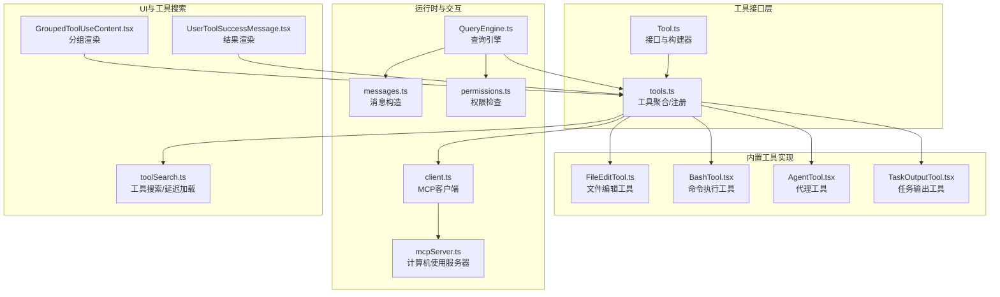
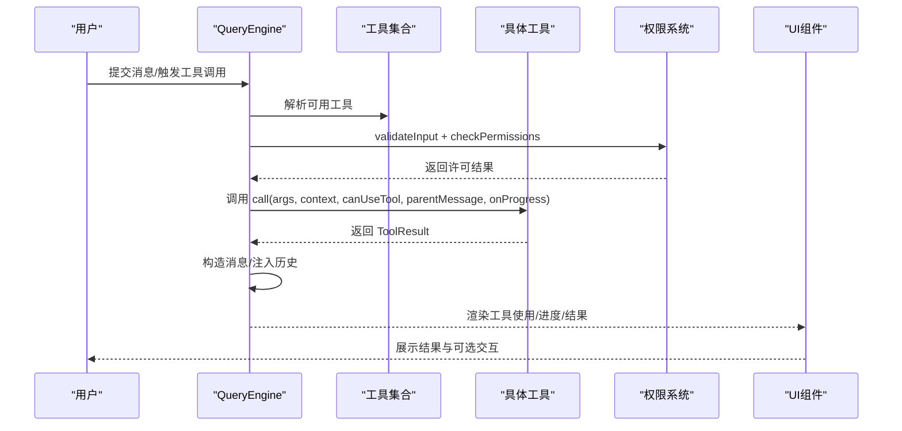
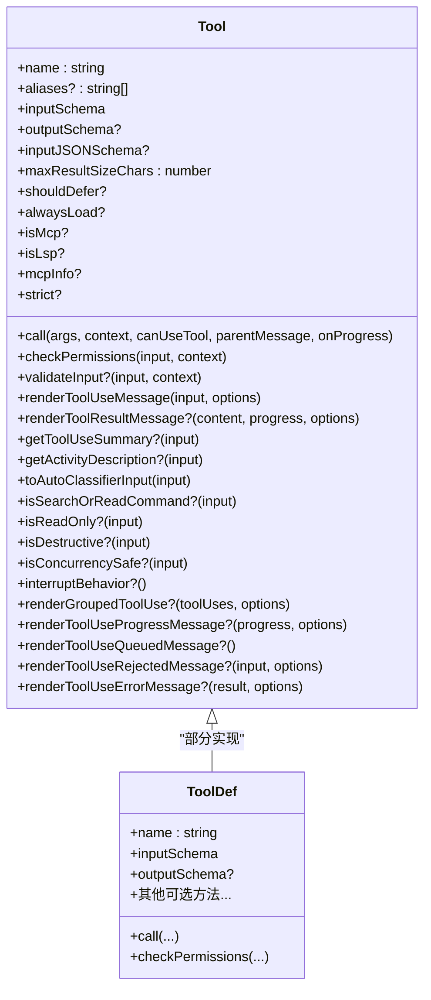
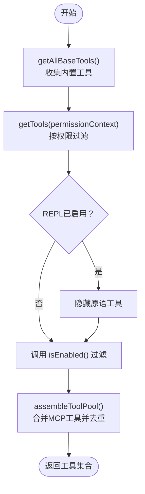
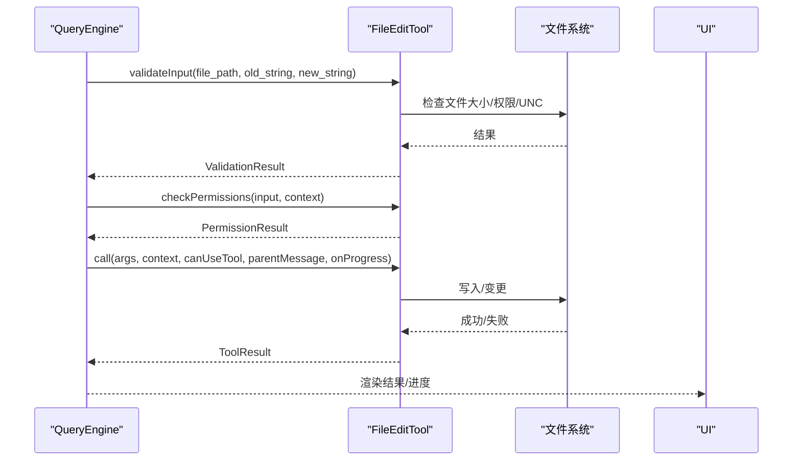
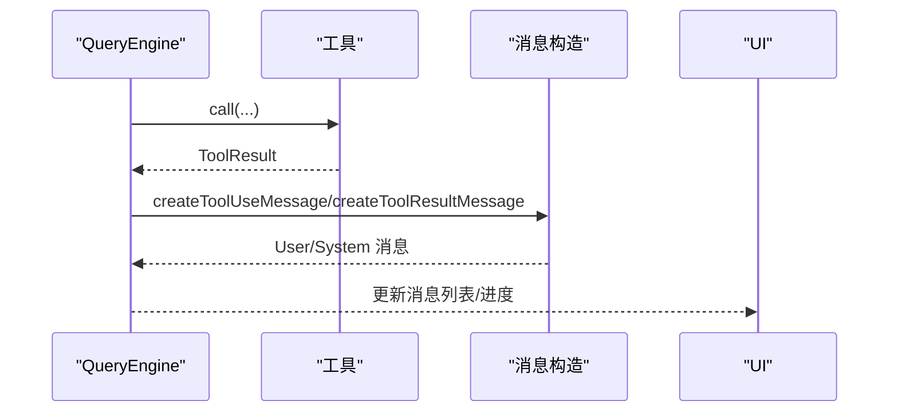
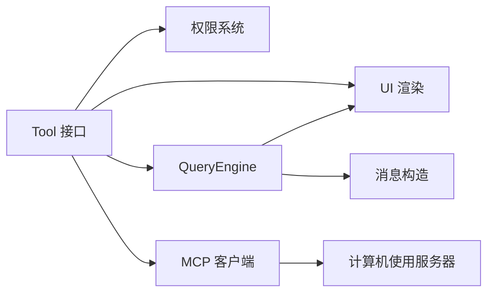

# 工具接口设计

<cite>
**本文引用的文件**
- [Tool.ts](file://src/Tool.ts)
- [tools.ts](file://src/tools.ts)
- [FileEditTool.ts](file://src/tools/FileEditTool/FileEditTool.ts)
- [BashTool.tsx](file://src/tools/BashTool/BashTool.tsx)
- [QueryEngine.ts](file://src/QueryEngine.ts)
- [tools.ts（常量）](file://src/constants/tools.ts)
- [permissions.ts](file://src/utils/permissions/permissions.ts)
- [messages.ts](file://src/utils/messages.ts)
- [toolSearch.ts](file://src/utils/toolSearch.ts)
- [client.ts](file://src/services/mcp/client.ts)
- [mcpServer.ts](file://src/utils/computerUse/mcpServer.ts)
- [GroupedToolUseContent.tsx](file://src/components/messages/GroupedToolUseContent.tsx)
- [UserToolSuccessMessage.tsx](file://src/components/messages/UserToolResultMessage/UserToolSuccessMessage.tsx)
- [TaskOutputTool.tsx](file://src/tools/TaskOutputTool/TaskOutputTool.tsx)
- [AgentTool.tsx](file://src/tools/AgentTool/AgentTool.tsx)
- [hooks.tsx](file://src/commands/hooks/hooks.tsx)
- [toolErrors.ts](file://src/utils/toolErrors.ts)
</cite>

## 目录
1. [简介](#简介)
2. [项目结构](#项目结构)
3. [核心组件](#核心组件)
4. [架构总览](#架构总览)
5. [详细组件分析](#详细组件分析)
6. [依赖关系分析](#依赖关系分析)
7. [性能考量](#性能考量)
8. [故障排查指南](#故障排查指南)
9. [结论](#结论)
10. [附录](#附录)

## 简介
本文件面向Claude Code的“工具接口设计”，系统性阐述Tool基类的设计理念、接口规范、生命周期钩子、工具注册机制、元数据管理、实现示例，以及工具与查询引擎的交互方式与在消息处理流程中的作用。目标是帮助开发者在不深入源码的前提下，理解并正确扩展工具体系。

## 项目结构
围绕工具接口的关键代码分布在以下模块：
- 接口定义与构建器：src/Tool.ts
- 工具聚合与注册：src/tools.ts
- 典型工具实现示例：src/tools/FileEditTool/FileEditTool.ts、src/tools/BashTool/BashTool.tsx
- 查询引擎与消息流：src/QueryEngine.ts、src/utils/messages.ts
- 权限与拦截：src/utils/permissions/permissions.ts
- 工具搜索与延迟加载：src/utils/toolSearch.ts
- MCP工具桥接：src/services/mcp/client.ts、src/utils/computerUse/mcpServer.ts
- UI渲染与分组显示：src/components/messages/GroupedToolUseContent.tsx、src/components/messages/UserToolResultMessage/UserToolSuccessMessage.tsx
- 常量与工具预设：src/constants/tools.ts
- 命令行入口与工具列表：src/commands/hooks/hooks.tsx

**图表来源**
- [Tool.ts:362-695](file://src/Tool.ts#L362-L695)
- [tools.ts:193-390](file://src/tools.ts#L193-L390)
- [FileEditTool.ts:86-200](file://src/tools/FileEditTool/FileEditTool.ts#L86-L200)
- [BashTool.tsx:1-200](file://src/tools/BashTool/BashTool.tsx#L1-L200)
- [QueryEngine.ts:184-1295](file://src/QueryEngine.ts#L184-L1295)
- [messages.ts:4306-4352](file://src/utils/messages.ts#L4306-L4352)
- [permissions.ts:1208-1236](file://src/utils/permissions/permissions.ts#L1208-L1236)
- [client.ts:1980-1998](file://src/services/mcp/client.ts#L1980-L1998)
- [mcpServer.ts:60-78](file://src/utils/computerUse/mcpServer.ts#L60-L78)
- [GroupedToolUseContent.tsx:25-57](file://src/components/messages/GroupedToolUseContent.tsx#L25-L57)
- [UserToolSuccessMessage.tsx:45-78](file://src/components/messages/UserToolResultMessage/UserToolSuccessMessage.tsx#L45-L78)
- [toolSearch.ts:385-392](file://src/utils/toolSearch.ts#L385-L392)

**章节来源**
- [Tool.ts:1-793](file://src/Tool.ts#L1-L793)
- [tools.ts:1-390](file://src/tools.ts#L1-L390)

## 核心组件
- Tool接口与构建器
  - Tool类型定义了工具的名称、描述、输入/输出模式、执行方法、权限检查、UI渲染、摘要与活动描述、自动分类输入、结果映射等能力。
  - buildTool提供默认实现，确保工具导出时具备一致的默认行为，避免遗漏关键方法。
- 工具集合与注册
  - getAllBaseTools按环境特性组装基础工具集；getTools根据权限上下文过滤；assembleToolPool合并内置与MCP工具并去重。
  - 支持工具预设与动态筛选，保证不同模式下工具集的一致性与稳定性。
- 查询引擎与消息流
  - QueryEngine负责会话状态与查询生命周期，将工具调用结果转换为消息并注入对话历史。
- 权限与拦截
  - 统一的权限检查流程在工具调用前执行，支持工具自定义规则与用户交互。
- 工具搜索与延迟加载
  - 通过工具参考块与阈值判断决定是否启用工具搜索，减少初始提示词大小。
- MCP工具桥接
  - MCP客户端从远端服务器拉取工具清单，并包装为内置工具形态，统一调度与权限检查。
- UI渲染与分组
  - 分组渲染与结果渲染组件根据工具返回的UI钩子生成简洁或详细的界面反馈。

**章节来源**
- [Tool.ts:362-792](file://src/Tool.ts#L362-L792)
- [tools.ts:193-390](file://src/tools.ts#L193-L390)
- [QueryEngine.ts:184-1295](file://src/QueryEngine.ts#L184-L1295)
- [permissions.ts:1208-1236](file://src/utils/permissions/permissions.ts#L1208-L1236)
- [toolSearch.ts:385-392](file://src/utils/toolSearch.ts#L385-L392)
- [client.ts:1980-1998](file://src/services/mcp/client.ts#L1980-L1998)
- [GroupedToolUseContent.tsx:25-57](file://src/components/messages/GroupedToolUseContent.tsx#L25-L57)
- [UserToolSuccessMessage.tsx:45-78](file://src/components/messages/UserToolResultMessage/UserToolSuccessMessage.tsx#L45-L78)

## 架构总览
工具接口贯穿“定义—注册—调度—执行—渲染”的完整链路，QueryEngine作为中枢协调工具调用、权限检查、消息注入与UI更新。

**图表来源**
- [QueryEngine.ts:184-1295](file://src/QueryEngine.ts#L184-L1295)
- [permissions.ts:1208-1236](file://src/utils/permissions/permissions.ts#L1208-L1236)
- [messages.ts:4306-4352](file://src/utils/messages.ts#L4306-L4352)

## 详细组件分析

### Tool基类与接口规范
- 基本属性
  - name：工具唯一标识
  - aliases：别名列表，支持按名称或别名查找
  - description：工具描述（用于ToolSearch等场景）
  - inputSchema/outputSchema：输入/输出Zod模式
  - inputJSONSchema：MCP工具可直接提供JSON Schema
  - maxResultSizeChars：结果大小上限，超过则落盘
  - shouldDefer/alwaysLoad：控制工具是否延迟加载
  - isMcp/isLsp：工具类型标记
  - mcpInfo：MCP工具的服务器与工具名
  - strict：严格模式开关
- 方法签名
  - call(args, context, canUseTool, parentMessage, onProgress)：核心执行入口
  - checkPermissions(input, context)：权限检查
  - validateInput(input, context)：输入校验（可选）
  - renderToolUseMessage/renderToolResultMessage：UI渲染
  - getToolUseSummary/getActivityDescription：摘要与活动描述
  - toAutoClassifierInput：自动分类器输入
  - isSearchOrReadCommand/isReadOnly/isDestructive/isConcurrencySafe：语义与安全属性
  - interruptBehavior：中断行为（cancel/block）
  - renderGroupedToolUse：批量工具使用分组渲染
- 生命周期钩子
  - backfillObservableInput：在观察者可见前填充输入
  - preparePermissionMatcher：权限匹配器准备（用于规则匹配）
  - renderToolUseProgressMessage/renderToolUseQueuedMessage/renderToolUseRejectedMessage/renderToolUseErrorMessage：进度、排队、拒绝、错误UI
- 默认策略
  - buildTool提供默认实现：默认允许、非并发安全、读写、非破坏性、放行权限、空分类输入、名称即用户可见名等。

**图表来源**
- [Tool.ts:362-695](file://src/Tool.ts#L362-L695)
- [Tool.ts:721-792](file://src/Tool.ts#L721-L792)

**章节来源**
- [Tool.ts:362-792](file://src/Tool.ts#L362-L792)

### 工具注册机制
- 基础工具装配
  - getAllBaseTools：按环境特性拼装内置工具，包含条件编译与特性开关。
  - getTools：基于权限上下文过滤工具，隐藏REPL专用工具，应用禁用规则。
  - assembleToolPool：合并内置与MCP工具，保持内置工具连续前缀以稳定提示缓存。
- 工具查找与匹配
  - toolMatchesName/findToolByName：支持按主名或别名查找工具。
- 预设与过滤
  - parseToolPreset/getToolsForDefaultPreset：支持预设工具集。
  - filterToolsByDenyRules：按权限规则剔除工具。

**图表来源**
- [tools.ts:193-390](file://src/tools.ts#L193-L390)

**章节来源**
- [tools.ts:193-390](file://src/tools.ts#L193-L390)

### 工具元数据管理
- 分类与标签
  - searchHint：关键词提示，辅助ToolSearch检索。
  - isReadOnly/isDestructive/isConcurrencySafe：安全与并发属性。
  - isSearchOrReadCommand：用于UI折叠显示（搜索/读取/列出）。
  - isOpenWorld：开放世界工具标记。
- 优先级与可见性
  - shouldDefer/alwaysLoad：控制延迟加载与初始可见性。
  - mcpInfo：MCP工具的服务器与工具名。
- 用户体验
  - userFacingName/userFacingNameBackgroundColor：用户可见名称与主题色。
  - getToolUseSummary/getActivityDescription：简洁摘要与活动描述。
  - renderToolUseTag：附加标签（如任务ID）。

**章节来源**
- [Tool.ts:362-695](file://src/Tool.ts#L362-L695)
- [tools.ts（常量）:36-113](file://src/constants/tools.ts#L36-L113)

### 实现示例：文件编辑工具
- 关键点
  - 使用buildTool封装，声明输入/输出模式、描述、提示、摘要、活动描述、路径提取、权限匹配器、权限检查、UI渲染等。
  - validateInput进行路径展开、大小限制、权限规则检查、UNC路径安全处理等。
  - checkPermissions委托文件系统权限检查。
  - toAutoClassifierInput提供分类器输入。
  - renderToolUseMessage/renderToolResultMessage等提供UI反馈。

**图表来源**
- [FileEditTool.ts:86-200](file://src/tools/FileEditTool/FileEditTool.ts#L86-L200)
- [permissions.ts:1208-1236](file://src/utils/permissions/permissions.ts#L1208-L1236)

**章节来源**
- [FileEditTool.ts:86-200](file://src/tools/FileEditTool/FileEditTool.ts#L86-L200)

### 实现示例：命令执行工具
- 关键点
  - isSearchOrReadBashCommand：解析命令管线，识别搜索/读取/列出语义，用于UI折叠。
  - isSilentBashCommand：识别无标准输出的静默命令。
  - renderToolUseProgressMessage/renderToolUseErrorMessage：进度与错误UI。
  - toAutoClassifierInput：提供分类器输入。
  - isReadOnly/isDestructive：基于命令语义推断。

**章节来源**
- [BashTool.tsx:1-200](file://src/tools/BashTool/BashTool.tsx#L1-L200)

### 工具与查询引擎的交互
- 查询引擎职责
  - 维护会话状态与消息历史，协调工具调用、权限检查、结果注入与UI更新。
  - 在submitMessage中驱动工具执行，处理中断、超时、错误与回滚。
- 消息构造
  - 将工具调用结果封装为用户消息，便于后续对话与历史记录。

**图表来源**
- [QueryEngine.ts:184-1295](file://src/QueryEngine.ts#L184-L1295)
- [messages.ts:4306-4352](file://src/utils/messages.ts#L4306-L4352)

**章节来源**
- [QueryEngine.ts:184-1295](file://src/QueryEngine.ts#L184-L1295)
- [messages.ts:4306-4352](file://src/utils/messages.ts#L4306-L4352)

### 工具搜索与延迟加载
- 工具搜索启用条件
  - 模型兼容性（支持tool_reference）、MCP模式、工具数量阈值、ToolSearchTool可用性。
- 延迟加载策略
  - 对于应延迟的工具，仅在ToolSearch后才暴露其完整模式，降低初始提示词大小。

**章节来源**
- [toolSearch.ts:239-252](file://src/utils/toolSearch.ts#L239-L252)
- [toolSearch.ts:385-392](file://src/utils/toolSearch.ts#L385-L392)

### MCP工具集成
- 客户端拉取
  - 从MCP服务器获取工具清单，包装为内置工具，注入权限检查与只读/破坏性/开放世界等语义。
- 计算机使用服务器
  - 为CLI场景构建本地MCP服务器，定制ListTools响应，增强请求访问描述。

**章节来源**
- [client.ts:1980-1998](file://src/services/mcp/client.ts#L1980-L1998)
- [client.ts:1791-1826](file://src/services/mcp/client.ts#L1791-L1826)
- [mcpServer.ts:60-78](file://src/utils/computerUse/mcpServer.ts#L60-L78)

### UI渲染与分组
- 分组渲染
  - GroupedToolUseContent根据工具使用ID聚合多个工具调用，支持动画与批量UI。
- 结果渲染
  - UserToolSuccessMessage对工具结果进行输出模式校验后渲染，避免异常格式导致崩溃。

**章节来源**
- [GroupedToolUseContent.tsx:25-57](file://src/components/messages/GroupedToolUseContent.tsx#L25-L57)
- [UserToolSuccessMessage.tsx:45-78](file://src/components/messages/UserToolResultMessage/UserToolSuccessMessage.tsx#L45-L78)

## 依赖关系分析
- 工具到权限
  - 工具通过checkPermissions参与统一权限决策，支持工具特定规则与用户交互。
- 工具到UI
  - 工具提供多种渲染钩子，覆盖使用、进度、排队、拒绝与错误场景。
- 工具到查询引擎
  - 查询引擎负责工具选择、调用、结果注入与状态维护。
- 工具到MCP
  - MCP工具经客户端包装后与内置工具一致，统一调度与权限。

**图表来源**
- [Tool.ts:362-695](file://src/Tool.ts#L362-L695)
- [permissions.ts:1208-1236](file://src/utils/permissions/permissions.ts#L1208-L1236)
- [QueryEngine.ts:184-1295](file://src/QueryEngine.ts#L184-L1295)
- [messages.ts:4306-4352](file://src/utils/messages.ts#L4306-L4352)
- [client.ts:1980-1998](file://src/services/mcp/client.ts#L1980-L1998)
- [mcpServer.ts:60-78](file://src/utils/computerUse/mcpServer.ts#L60-L78)

**章节来源**
- [Tool.ts:362-695](file://src/Tool.ts#L362-L695)
- [tools.ts:193-390](file://src/tools.ts#L193-L390)

## 性能考量
- 工具延迟加载
  - 通过工具搜索与阈值控制初始工具数量，减少提示词开销。
- 结果大小限制
  - maxResultSizeChars限制单次结果大小，超限落盘避免内存压力。
- 缓存与去重
  - 合并工具池时保持内置工具连续前缀，避免缓存键被打乱。
- 并发与中断
  - isConcurrencySafe/interruptBehavior影响工具并发与中断策略，提升交互体验。

[本节为通用指导，无需特定文件分析]

## 故障排查指南
- 输入验证失败
  - 使用formatZodValidationError将Zod错误转为人类可读消息，定位缺失参数、意外参数与类型不匹配问题。
- 权限被拒
  - 检查工具的checkPermissions实现与权限规则匹配；必要时使用preparePermissionMatcher细化匹配逻辑。
- 结果渲染异常
  - 确保工具输出符合outputSchema，避免反序列化或渲染崩溃；必要时在UI层做二次校验。
- MCP工具不可见
  - 确认MCP客户端成功拉取工具清单，且未被deny规则过滤；检查isMcp与mcpInfo配置。

**章节来源**
- [toolErrors.ts:66-132](file://src/utils/toolErrors.ts#L66-L132)
- [permissions.ts:1208-1236](file://src/utils/permissions/permissions.ts#L1208-L1236)
- [client.ts:1980-1998](file://src/services/mcp/client.ts#L1980-L1998)
- [UserToolSuccessMessage.tsx:45-78](file://src/components/messages/UserToolResultMessage/UserToolSuccessMessage.tsx#L45-L78)

## 结论
Tool基类提供了完备的工具抽象与默认实现，结合工具聚合、权限系统、查询引擎与UI渲染，形成从“定义—注册—调度—执行—反馈”的闭环。通过延迟加载、结果大小限制、并发与中断策略等机制，兼顾性能与用户体验。建议在实现新工具时遵循buildTool默认策略，明确输入/输出模式、安全属性与UI钩子，并在权限与错误处理上保持一致性。

[本节为总结，无需特定文件分析]

## 附录
- 常用工具预设与限制
  - ALL_AGENT_DISALLOWED_TOOLS/CUSTOM_AGENT_DISALLOWED_TOOLS/ASYNC_AGENT_ALLOWED_TOOLS/IN_PROCESS_TEAMMATE_ALLOWED_TOOLS/COORDINATOR_MODE_ALLOWED_TOOLS：用于不同角色与模式下的工具可用性约束。
- 命令行查看工具列表
  - hooks命令可列出当前权限上下文下的可用工具名称，便于调试与确认。

**章节来源**
- [tools.ts（常量）:36-113](file://src/constants/tools.ts#L36-L113)
- [hooks.tsx:6-12](file://src/commands/hooks/hooks.tsx#L6-L12)