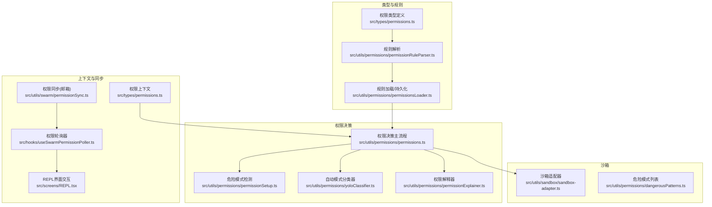
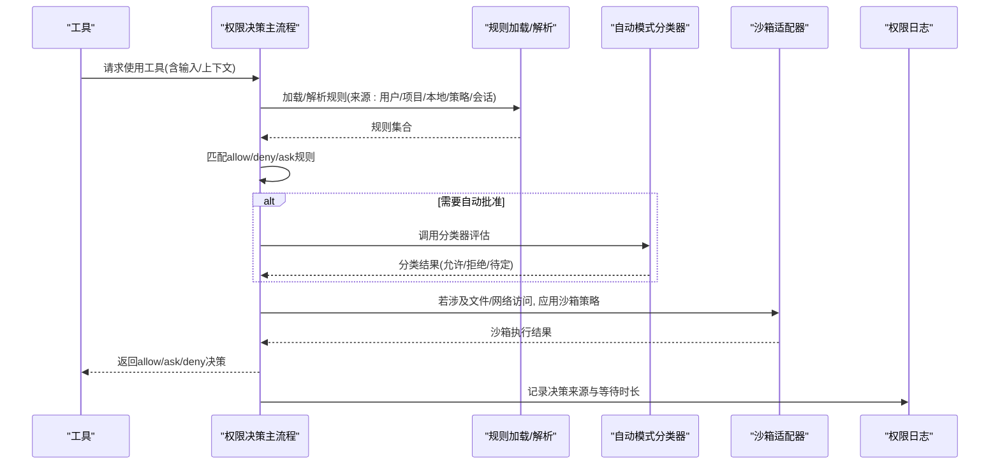
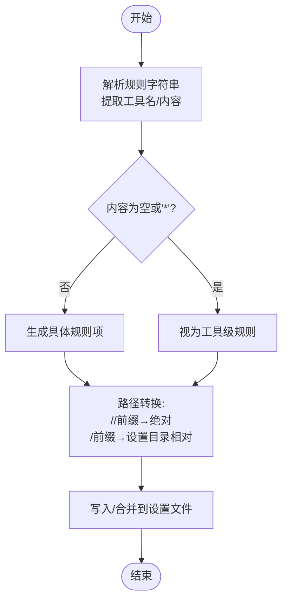
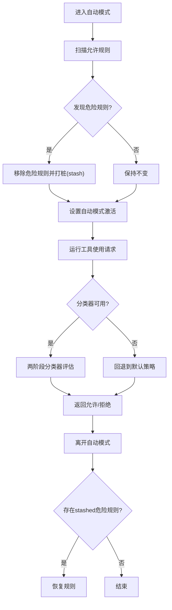
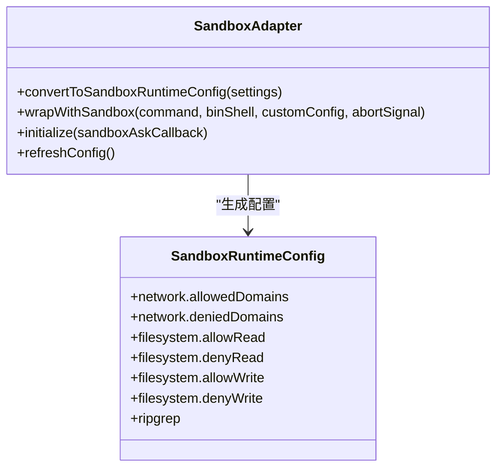
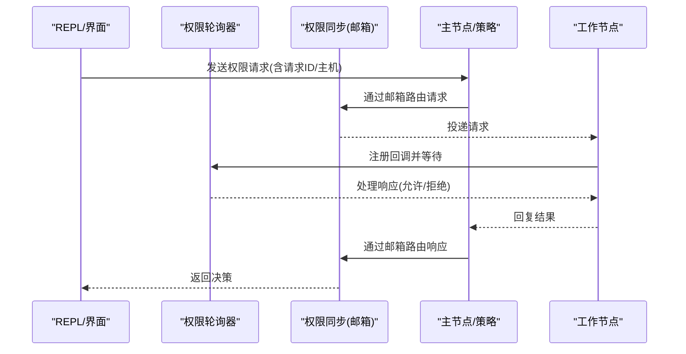
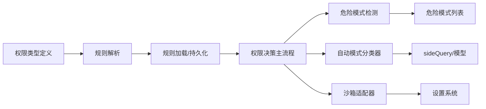

# 工具权限控制

<cite>
**本文档引用的文件**
- [src/types/permissions.ts](file://src/types/permissions.ts)
- [src/utils/permissions/permissions.ts](file://src/utils/permissions/permissions.ts)
- [src/utils/permissions/permissionRuleParser.ts](file://src/utils/permissions/permissionRuleParser.ts)
- [src/utils/permissions/permissionSetup.ts](file://src/utils/permissions/permissionSetup.ts)
- [src/utils/permissions/permissionsLoader.ts](file://src/utils/permissions/permissionsLoader.ts)
- [src/utils/permissions/yoloClassifier.ts](file://src/utils/permissions/yoloClassifier.ts)
- [src/utils/permissions/dangerousPatterns.ts](file://src/utils/permissions/dangerousPatterns.ts)
- [src/utils/sandbox/sandbox-adapter.ts](file://src/utils/sandbox/sandbox-adapter.ts)
- [src/hooks/toolPermission/permissionLogging.ts](file://src/hooks/toolPermission/permissionLogging.ts)
- [src/utils/permissions/permissionExplainer.ts](file://src/utils/permissions/permissionExplainer.ts)
- [src/utils/swarm/permissionSync.ts](file://src/utils/swarm/permissionSync.ts)
- [src/hooks/useSwarmPermissionPoller.ts](file://src/hooks/useSwarmPermissionPoller.ts)
- [src/screens/REPL.tsx](file://src/screens/REPL.tsx)
</cite>

## 目录
1. [简介](#简介)
2. [项目结构](#项目结构)
3. [核心组件](#核心组件)
4. [架构总览](#架构总览)
5. [详细组件分析](#详细组件分析)
6. [依赖关系分析](#依赖关系分析)
7. [性能考量](#性能考量)
8. [故障排除指南](#故障排除指南)
9. [结论](#结论)
10. [附录](#附录)

## 简介
本文件系统性阐述 Claude Code 的工具权限控制系统，覆盖权限分类、验证流程、执行控制、规则系统（路径匹配、命令白名单、危险模式检测）、沙箱机制（进程隔离、资源限制、安全策略）、权限上下文管理（用户权限、工作空间权限、MCP 服务器权限）、权限决策的实时评估（动态权限检查、权限缓存策略），并提供最佳实践与故障排除建议。

## 项目结构
权限控制相关代码主要分布在以下模块：
- 类型定义：权限模式、行为、规则、更新、决策结果等
- 规则解析与加载：规则字符串解析、来源过滤、持久化
- 权限决策：规则匹配、模式处理、自动模式分类器、钩子集成
- 沙箱适配：网络域、文件系统、进程包装、依赖检查
- 日志与解释：权限决策日志、风险解释生成
- 集体权限同步：跨节点权限请求/响应、回调注册与轮询

**图表来源**
- [src/types/permissions.ts:1-442](file://src/types/permissions.ts#L1-L442)
- [src/utils/permissions/permissionRuleParser.ts:1-199](file://src/utils/permissions/permissionRuleParser.ts#L1-L199)
- [src/utils/permissions/permissionsLoader.ts:1-297](file://src/utils/permissions/permissionsLoader.ts#L1-L297)
- [src/utils/permissions/permissions.ts:1-800](file://src/utils/permissions/permissions.ts#L1-L800)
- [src/utils/permissions/permissionSetup.ts:1-800](file://src/utils/permissions/permissionSetup.ts#L1-L800)
- [src/utils/permissions/yoloClassifier.ts:1-800](file://src/utils/permissions/yoloClassifier.ts#L1-L800)
- [src/utils/permissions/dangerousPatterns.ts:1-81](file://src/utils/permissions/dangerousPatterns.ts#L1-L81)
- [src/utils/sandbox/sandbox-adapter.ts:1-800](file://src/utils/sandbox/sandbox-adapter.ts#L1-L800)
- [src/utils/swarm/permissionSync.ts:758-895](file://src/utils/swarm/permissionSync.ts#L758-L895)
- [src/hooks/useSwarmPermissionPoller.ts:208-257](file://src/hooks/useSwarmPermissionPoller.ts#L208-L257)
- [src/screens/REPL.tsx:4692-4710](file://src/screens/REPL.tsx#L4692-L4710)

**章节来源**
- [src/types/permissions.ts:1-442](file://src/types/permissions.ts#L1-L442)
- [src/utils/permissions/permissions.ts:1-800](file://src/utils/permissions/permissions.ts#L1-L800)

## 核心组件
- 权限模式与行为
  - 模式：acceptEdits、bypassPermissions、default、dontAsk、plan、auto（可选）
  - 行为：allow、deny、ask
- 权限规则与来源
  - 规则值包含工具名与可选内容；支持通配符与转义
  - 来源：userSettings、projectSettings、localSettings、flagSettings、policySettings、cliArg、command、session
- 决策结果
  - allow、ask（含消息、建议、阻断路径、元数据、异步分类器提示）、deny（含原因）
- 上下文
  - mode、additionalWorkingDirectories、各类规则映射、bypass 可用性、是否避免权限提示等

**章节来源**
- [src/types/permissions.ts:14-324](file://src/types/permissions.ts#L14-L324)

## 架构总览
权限控制由“规则解析与加载”提供输入，“权限决策主流程”进行匹配与评估，并在需要时调用“自动模式分类器”。对于文件/网络访问，通过“沙箱适配器”实施进程隔离与资源限制。最终通过“权限日志”与“权限解释器”记录与辅助理解。

**图表来源**
- [src/utils/permissions/permissions.ts:473-800](file://src/utils/permissions/permissions.ts#L473-L800)
- [src/utils/permissions/yoloClassifier.ts:1-800](file://src/utils/permissions/yoloClassifier.ts#L1-L800)
- [src/utils/sandbox/sandbox-adapter.ts:1-800](file://src/utils/sandbox/sandbox-adapter.ts#L1-L800)
- [src/hooks/toolPermission/permissionLogging.ts:181-239](file://src/hooks/toolPermission/permissionLogging.ts#L181-L239)

## 详细组件分析

### 权限规则系统与路径匹配
- 规则格式与解析
  - 支持“工具名”或“工具名(内容)”两种形式；内容中括号需转义
  - 解析时区分空内容与通配符“*”，均视为工具级规则
- 路径匹配约定
  - 编辑/读取规则中的路径采用特殊前缀约定：
    - “//path”：从文件系统根绝对解析
    - “/path”：相对于设置文件目录解析
  - 文件系统设置（sandbox.filesystem.*）使用标准路径语义（绝对/相对/波浪号）
- 来源与持久化
  - 允许仅来自受管设置的规则生效（策略模式）
  - 支持向用户/项目/本地设置追加规则，去重并保留非识别字段

**图表来源**
- [src/utils/permissions/permissionRuleParser.ts:88-152](file://src/utils/permissions/permissionRuleParser.ts#L88-L152)
- [src/utils/permissions/permissionRuleParser.ts:155-198](file://src/utils/permissions/permissionRuleParser.ts#L155-L198)
- [src/utils/sandbox/sandbox-adapter.ts:99-146](file://src/utils/sandbox/sandbox-adapter.ts#L99-L146)
- [src/utils/permissions/permissionsLoader.ts:120-145](file://src/utils/permissions/permissionsLoader.ts#L120-L145)

**章节来源**
- [src/utils/permissions/permissionRuleParser.ts:1-199](file://src/utils/permissions/permissionRuleParser.ts#L1-L199)
- [src/utils/sandbox/sandbox-adapter.ts:99-146](file://src/utils/sandbox/sandbox-adapter.ts#L99-L146)
- [src/utils/permissions/permissionsLoader.ts:1-297](file://src/utils/permissions/permissionsLoader.ts#L1-L297)

### 危险模式检测与自动模式
- 危险规则识别
  - Bash：工具级允许、解释器前缀/通配、危险模式列表
  - PowerShell：工具级允许、解释器/脚本执行/cmdlet 列表
  - Agent：任何允许规则（防止委托攻击绕过）
- 自动模式入口保护
  - 进入 auto 模式前移除危险规则，退出时恢复
  - 通过 gate 控制启用/禁用
- 分类器评估
  - 两阶段 XML 输出格式，快速阶段与思考阶段
  - 结合用户自定义规则模板与环境约束

**图表来源**
- [src/utils/permissions/permissionSetup.ts:295-342](file://src/utils/permissions/permissionSetup.ts#L295-L342)
- [src/utils/permissions/permissionSetup.ts:510-553](file://src/utils/permissions/permissionSetup.ts#L510-L553)
- [src/utils/permissions/permissionSetup.ts:561-579](file://src/utils/permissions/permissionSetup.ts#L561-L579)
- [src/utils/permissions/yoloClassifier.ts:711-800](file://src/utils/permissions/yoloClassifier.ts#L711-L800)

**章节来源**
- [src/utils/permissions/permissionSetup.ts:84-285](file://src/utils/permissions/permissionSetup.ts#L84-L285)
- [src/utils/permissions/dangerousPatterns.ts:1-81](file://src/utils/permissions/dangerousPatterns.ts#L1-L81)
- [src/utils/permissions/yoloClassifier.ts:1-800](file://src/utils/permissions/yoloClassifier.ts#L1-L800)

### 沙箱机制与执行控制
- 网络域与主机
  - 允许/拒绝域名列表；支持仅受管域名
  - REPL/打印场景下对网络请求进行拦截与策略强制
- 文件系统
  - denyRead/allowRead/allowWrite/denyWrite 组合
  - 特殊保护：settings.json、.claude/skills、裸仓库文件
  - Git 工作树主仓库路径写入豁免
- 进程包装与依赖
  - wrapWithSandbox 包装命令执行
  - 平台支持检测、依赖检查、失败回退
- 配置热更新
  - 监听设置变更，动态刷新沙箱配置

**图表来源**
- [src/utils/sandbox/sandbox-adapter.ts:172-381](file://src/utils/sandbox/sandbox-adapter.ts#L172-L381)
- [src/utils/sandbox/sandbox-adapter.ts:704-725](file://src/utils/sandbox/sandbox-adapter.ts#L704-L725)
- [src/utils/sandbox/sandbox-adapter.ts:730-792](file://src/utils/sandbox/sandbox-adapter.ts#L730-L792)

**章节来源**
- [src/utils/sandbox/sandbox-adapter.ts:1-800](file://src/utils/sandbox/sandbox-adapter.ts#L1-L800)

### 权限上下文管理
- 上下文组成
  - mode、additionalWorkingDirectories、各类规则映射、bypass 可用性、避免权限提示标志、预模式状态等
- 来源与优先级
  - userSettings、projectSettings、localSettings、flagSettings、policySettings、cliArg、command、session
- MCP 服务器权限
  - 规则支持以“mcp__server”开头的服务器级匹配，以及通配符“mcp__server__*”

**章节来源**
- [src/types/permissions.ts:419-442](file://src/types/permissions.ts#L419-L442)
- [src/utils/permissions/permissions.ts:238-269](file://src/utils/permissions/permissions.ts#L238-L269)

### 权限决策的实时评估与缓存
- 决策流
  - 规则匹配 → 模式处理（如 dontAsk → 直接 deny）→ 自动模式分类器 → 钩子/受管设置 → 最终结果
- 缓存与跟踪
  - 分类器检查状态、连续拒绝计数、会话令牌用量统计
- 实时同步（团队/集群）
  - 通过邮箱系统发送/接收权限请求与响应，轮询器处理回调与去重

**图表来源**
- [src/utils/swarm/permissionSync.ts:789-869](file://src/utils/swarm/permissionSync.ts#L789-L869)
- [src/hooks/useSwarmPermissionPoller.ts:208-257](file://src/hooks/useSwarmPermissionPoller.ts#L208-L257)
- [src/screens/REPL.tsx:4692-4710](file://src/screens/REPL.tsx#L4692-L4710)

**章节来源**
- [src/utils/swarm/permissionSync.ts:758-895](file://src/utils/swarm/permissionSync.ts#L758-L895)
- [src/hooks/useSwarmPermissionPoller.ts:208-257](file://src/hooks/useSwarmPermissionPoller.ts#L208-L257)
- [src/screens/REPL.tsx:4692-4710](file://src/screens/REPL.tsx#L4692-L4710)

### 权限日志与解释
- 日志维度
  - 决策来源（用户/分类器/钩子/配置）、等待时长、沙箱启用状态、工具名称、语言（编辑类工具）
- 风险解释
  - 基于模型生成命令解释、理由、风险与风险等级，辅助用户理解

**章节来源**
- [src/hooks/toolPermission/permissionLogging.ts:1-239](file://src/hooks/toolPermission/permissionLogging.ts#L1-L239)
- [src/utils/permissions/permissionExplainer.ts:1-251](file://src/utils/permissions/permissionExplainer.ts#L1-L251)

## 依赖关系分析
- 松耦合设计
  - 类型定义独立于实现，避免循环依赖
  - 规则解析与加载模块化，便于扩展新来源
- 关键依赖链
  - permissions.ts 依赖 permissionRuleParser.ts、permissionsLoader.ts、sandbox-adapter.ts
  - permissionSetup.ts 依赖 dangerousPatterns.ts 与 autoModeState（条件导入）
  - yoloClassifier.ts 依赖 sideQuery、模型选择、缓存控制
  - sandbox-adapter.ts 依赖 settings 系统与平台信息

**图表来源**
- [src/types/permissions.ts:1-442](file://src/types/permissions.ts#L1-L442)
- [src/utils/permissions/permissionRuleParser.ts:1-199](file://src/utils/permissions/permissionRuleParser.ts#L1-L199)
- [src/utils/permissions/permissionsLoader.ts:1-297](file://src/utils/permissions/permissionsLoader.ts#L1-L297)
- [src/utils/permissions/permissions.ts:1-800](file://src/utils/permissions/permissions.ts#L1-L800)
- [src/utils/permissions/permissionSetup.ts:1-800](file://src/utils/permissions/permissionSetup.ts#L1-L800)
- [src/utils/permissions/dangerousPatterns.ts:1-81](file://src/utils/permissions/dangerousPatterns.ts#L1-L81)
- [src/utils/permissions/yoloClassifier.ts:1-800](file://src/utils/permissions/yoloClassifier.ts#L1-L800)
- [src/utils/sandbox/sandbox-adapter.ts:1-800](file://src/utils/sandbox/sandbox-adapter.ts#L1-L800)

**章节来源**
- [src/utils/permissions/permissions.ts:1-800](file://src/utils/permissions/permissions.ts#L1-L800)
- [src/utils/permissions/permissionSetup.ts:1-800](file://src/utils/permissions/permissionSetup.ts#L1-L800)

## 性能考量
- 分类器成本控制
  - 使用缓存控制头、分阶段输出、令牌用量统计与成本估算
  - 对安全敏感场景（如敏感路径）可跳过自动批准，确保交互确认
- 规则解析与匹配
  - 规则解析采用一次扫描与转义处理，避免重复解析
  - 规则映射使用 Map 降低查找复杂度
- 沙箱初始化
  - 依赖检查与平台支持检测采用记忆化，减少重复开销
  - 配置变更订阅实现增量更新，避免全量重建

[本节为通用指导，无需特定文件引用]

## 故障排除指南
- 自动模式无法启用
  - 检查 gate 是否开启、策略设置是否禁用 bypassPermissions 模式
  - 查看电路断路器状态与缓存门控
- 分类器不可用或报错
  - 检查 prompt 过长、API 错误、错误提示转储路径
  - 审核分类器阶段用量与持续时间
- 沙箱不可用
  - 平台不支持（WSL1、非 macOS/Linux/WSL2）、依赖缺失、enabledPlatforms 限制
  - 检查 sandbox.enabled 设置与依赖检查结果
- 规则未生效
  - 确认是否处于仅受管规则模式（policySettings）
  - 校验规则字符串格式、转义字符、来源优先级
- 团队权限同步异常
  - 检查邮箱消息投递、请求ID一致性、回调注册与轮询器状态

**章节来源**
- [src/utils/permissions/permissionSetup.ts:689-800](file://src/utils/permissions/permissionSetup.ts#L689-L800)
- [src/utils/permissions/yoloClassifier.ts:213-250](file://src/utils/permissions/yoloClassifier.ts#L213-L250)
- [src/utils/sandbox/sandbox-adapter.ts:562-592](file://src/utils/sandbox/sandbox-adapter.ts#L562-L592)
- [src/utils/permissions/permissionsLoader.ts:31-44](file://src/utils/permissions/permissionsLoader.ts#L31-L44)
- [src/utils/swarm/permissionSync.ts:789-869](file://src/utils/swarm/permissionSync.ts#L789-L869)
- [src/hooks/useSwarmPermissionPoller.ts:208-257](file://src/hooks/useSwarmPermissionPoller.ts#L208-L257)

## 结论
该权限控制系统通过“规则驱动 + 自动模式分类器 + 沙箱隔离”的组合，在保障安全性的同时兼顾易用性。其模块化设计便于扩展与维护，团队权限同步机制支持分布式协作场景。建议在生产环境中结合策略设置与受管规则，配合自动模式的严格危险规则过滤与沙箱的强隔离策略，实现最小权限与最大安全的平衡。

[本节为总结性内容，无需特定文件引用]

## 附录
- 最佳实践
  - 优先使用“工具级规则 + 明确内容”的组合，避免过度宽泛的通配符
  - 在 auto 模式下仅保留必要的 allow 规则，其余通过分类器评估
  - 启用沙箱并限制网络域与文件系统范围，定期审查配置
  - 使用权限解释器辅助理解高风险命令，提升透明度
  - 团队协作中启用仅受管规则模式，统一策略落地

[本节为通用指导，无需特定文件引用]