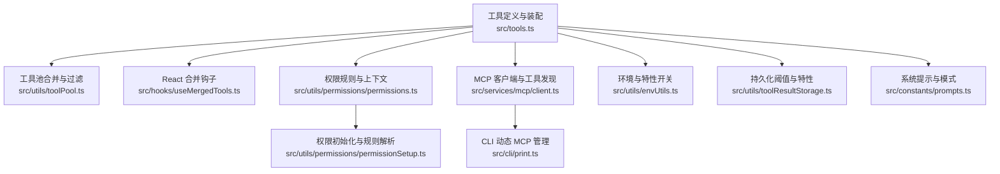
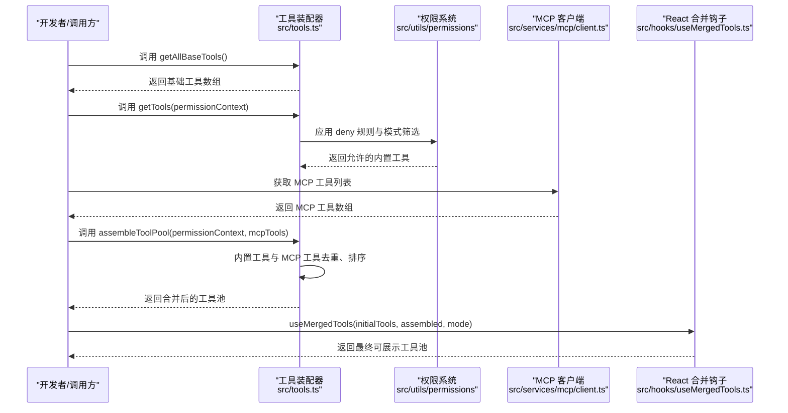
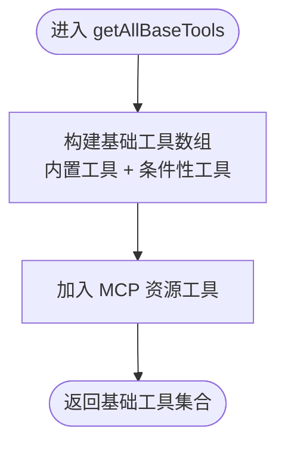
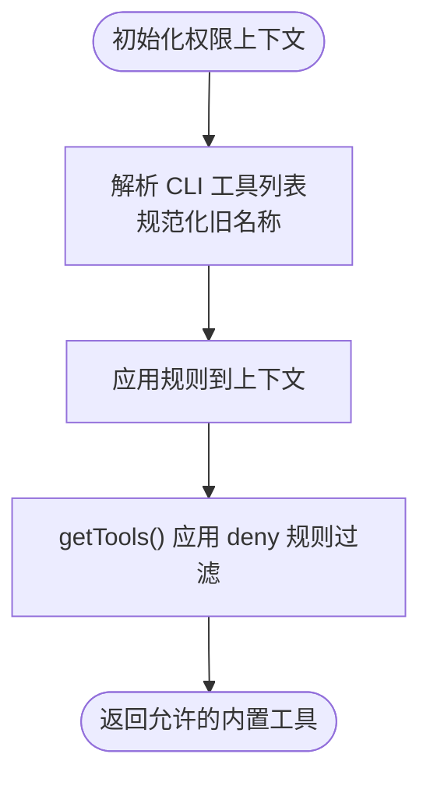
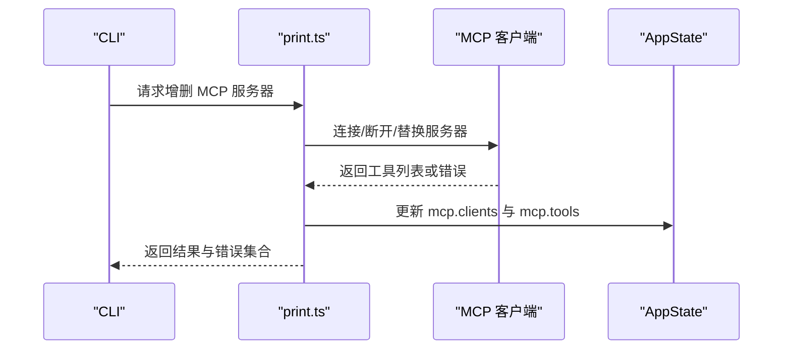
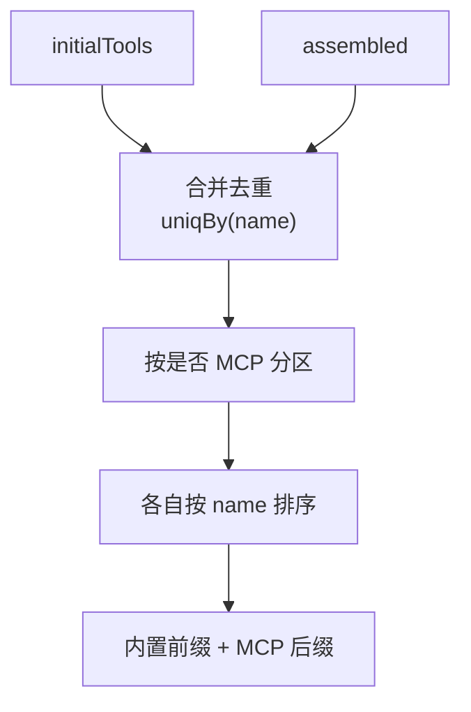
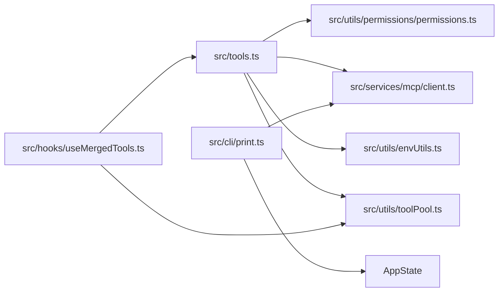

# 工具注册系统

<cite>
**本文档引用的文件**
- [src/tools.ts](file://src/tools.ts)
- [src/Tool.ts](file://src/Tool.ts)
- [src/hooks/useMergedTools.ts](file://src/hooks/useMergedTools.ts)
- [src/utils/permissions/permissions.ts](file://src/utils/permissions/permissions.ts)
- [src/utils/permissions/permissionSetup.ts](file://src/utils/permissions/permissionSetup.ts)
- [src/utils/toolPool.ts](file://src/utils/toolPool.ts)
- [src/services/mcp/client.ts](file://src/services/mcp/client.ts)
- [src/utils/envUtils.ts](file://src/utils/envUtils.ts)
- [src/utils/toolResultStorage.ts](file://src/utils/toolResultStorage.ts)
- [src/constants/prompts.ts](file://src/constants/prompts.ts)
- [src/cli/print.ts](file://src/cli/print.ts)
</cite>

## 目录
1. [简介](#简介)
2. [项目结构](#项目结构)
3. [核心组件](#核心组件)
4. [架构总览](#架构总览)
5. [详细组件分析](#详细组件分析)
6. [依赖关系分析](#依赖关系分析)
7. [性能考量](#性能考量)
8. [故障排查指南](#故障排查指南)
9. [结论](#结论)
10. [附录](#附录)

## 简介
本文件系统化梳理 Claude Code 的工具注册与装配体系，围绕以下目标展开：
- 全流程：从工具定义、条件性加载、特性开关控制、动态导入，到最终工具池组装与权限过滤，形成闭环。
- 深入解析 getAllBaseTools() 的工作机制，包括条件性工具加载、特性标志控制与动态导入机制。
- 阐述工具预设系统（默认工具集、工具过滤规则、权限控制）。
- 解释工具池组装机制（内置工具与 MCP 工具的合并策略、去重算法与排序规则）。
- 说明工具启用/禁用机制（环境变量控制、特性开关、运行时检查）。
- 提供最佳实践与常见问题解决方案。

## 项目结构
工具注册系统主要分布在以下模块：
- 工具定义与装配：src/tools.ts
- 工具类型与接口：src/Tool.ts
- 工具池合并与过滤：src/utils/toolPool.ts、src/hooks/useMergedTools.ts
- 权限规则与上下文：src/utils/permissions/permissions.ts、src/utils/permissions/permissionSetup.ts
- MCP 动态工具发现与连接：src/services/mcp/client.ts
- 环境与特性开关：src/utils/envUtils.ts、src/utils/toolResultStorage.ts
- 系统提示与模式：src/constants/prompts.ts
- CLI 动态 MCP 管理：src/cli/print.ts

图表来源
- [src/tools.ts:193-367](file://src/tools.ts#L193-L367)
- [src/utils/toolPool.ts:43-79](file://src/utils/toolPool.ts#L43-L79)
- [src/hooks/useMergedTools.ts:1-44](file://src/hooks/useMergedTools.ts#L1-L44)
- [src/utils/permissions/permissions.ts:284-390](file://src/utils/permissions/permissions.ts#L284-L390)
- [src/utils/permissions/permissionSetup.ts:775-825](file://src/utils/permissions/permissionSetup.ts#L775-L825)
- [src/services/mcp/client.ts:1980-3158](file://src/services/mcp/client.ts#L1980-L3158)
- [src/utils/envUtils.ts:39-75](file://src/utils/envUtils.ts#L39-L75)
- [src/utils/toolResultStorage.ts:36-78](file://src/utils/toolResultStorage.ts#L36-L78)
- [src/constants/prompts.ts:430-454](file://src/constants/prompts.ts#L430-L454)
- [src/cli/print.ts:5446-5594](file://src/cli/print.ts#L5446-L5594)

章节来源
- [src/tools.ts:193-367](file://src/tools.ts#L193-L367)
- [src/utils/toolPool.ts:43-79](file://src/utils/toolPool.ts#L43-L79)
- [src/hooks/useMergedTools.ts:1-44](file://src/hooks/useMergedTools.ts#L1-L44)
- [src/utils/permissions/permissions.ts:284-390](file://src/utils/permissions/permissions.ts#L284-L390)
- [src/utils/permissions/permissionSetup.ts:775-825](file://src/utils/permissions/permissionSetup.ts#L775-L825)
- [src/services/mcp/client.ts:1980-3158](file://src/services/mcp/client.ts#L1980-L3158)
- [src/utils/envUtils.ts:39-75](file://src/utils/envUtils.ts#L39-L75)
- [src/utils/toolResultStorage.ts:36-78](file://src/utils/toolResultStorage.ts#L36-L78)
- [src/constants/prompts.ts:430-454](file://src/constants/prompts.ts#L430-L454)
- [src/cli/print.ts:5446-5594](file://src/cli/print.ts#L5446-L5594)

## 核心组件
- 工具集合与装配器：提供 getAllBaseTools()、getTools()、assembleToolPool()、getMergedTools() 等关键函数，统一管理内置工具与 MCP 工具的生成、过滤与合并。
- 权限系统：通过 ToolPermissionContext 与规则解析，实现基于源的允许/拒绝/询问规则，并在工具装配阶段应用 deny 规则过滤。
- MCP 工具发现与连接：动态拉取 MCP 工具列表，处理连接失败与错误日志，支持 CLI 动态增删 MCP 服务器。
- 环境与特性开关：通过环境变量与特性标志（feature）控制工具的条件性加载与行为。
- 工具池合并与过滤：在 React 层与非 React 场景分别提供合并与过滤逻辑，确保 prompt-cache 稳定性与去重优先级。

章节来源
- [src/tools.ts:193-367](file://src/tools.ts#L193-L367)
- [src/Tool.ts:123-148](file://src/Tool.ts#L123-L148)
- [src/utils/permissions/permissions.ts:284-390](file://src/utils/permissions/permissions.ts#L284-L390)
- [src/services/mcp/client.ts:1980-3158](file://src/services/mcp/client.ts#L1980-L3158)
- [src/utils/envUtils.ts:39-75](file://src/utils/envUtils.ts#L39-L75)
- [src/utils/toolPool.ts:43-79](file://src/utils/toolPool.ts#L43-L79)

## 架构总览
工具注册系统遵循“定义—筛选—合并—呈现”的流水线：
- 定义：getAllBaseTools() 基于当前环境与特性标志生成基础工具集合。
- 筛选：getTools() 应用权限上下文与模式（如 --bare）进行筛选；filterToolsByDenyRules() 过滤拒绝规则。
- 合并：assembleToolPool() 将内置工具与 MCP 工具按名称去重，内置优先，保持排序稳定。
- 呈现：useMergedTools() 在 React 中进一步合并初始工具与已装配工具，应用协调者模式过滤。

图表来源
- [src/tools.ts:193-367](file://src/tools.ts#L193-L367)
- [src/utils/permissions/permissions.ts:284-390](file://src/utils/permissions/permissions.ts#L284-L390)
- [src/services/mcp/client.ts:1980-3158](file://src/services/mcp/client.ts#L1980-L3158)
- [src/hooks/useMergedTools.ts:1-44](file://src/hooks/useMergedTools.ts#L1-L44)

## 详细组件分析

### 组件A：工具定义与装配（getAllBaseTools 与 getTools）
- getAllBaseTools() 是所有工具的“源”：根据环境变量与特性标志动态拼装工具数组，包含内置工具、条件性工具（如 LSP、Todo V2、Agent Swarms 等）、以及 MCP 资源工具。
- getTools() 在 getAllBaseTools() 的基础上，进一步应用：
  - 模式过滤（如 CLAUDE_CODE_SIMPLE/--bare）。
  - REPL 模式下对原始工具的隐藏策略。
  - 运行时 isEnabled() 过滤。
  - deny 规则过滤。
- getMergedTools() 与 assembleToolPool() 提供两种视角：
  - getMergedTools()：简单拼接内置与 MCP 工具。
  - assembleToolPool()：严格去重（内置优先），并对两部分分别排序以保证 prompt-cache 稳定性。

图表来源
- [src/tools.ts:193-251](file://src/tools.ts#L193-L251)

章节来源
- [src/tools.ts:193-251](file://src/tools.ts#L193-L251)
- [src/tools.ts:271-327](file://src/tools.ts#L271-L327)
- [src/tools.ts:345-367](file://src/tools.ts#L345-L367)
- [src/tools.ts:383-390](file://src/tools.ts#L383-L390)

### 组件B：权限系统与规则应用
- ToolPermissionContext 定义了权限上下文，包含模式、额外工作目录、允许/拒绝/询问规则来源等。
- getDenyRuleForTool()/getAskRuleForTool() 用于匹配工具与规则，支持 MCP 服务器前缀规则与带参数规则。
- permissionSetup.ts 负责解析 CLI 传入的工具列表、规范化旧名称、应用规则到上下文，并处理 bypass/auto 模式开关。
- getTools() 在装配过程中调用 filterToolsByDenyRules()，确保在模型看到工具之前就完成屏蔽。

图表来源
- [src/utils/permissions/permissions.ts:284-390](file://src/utils/permissions/permissions.ts#L284-L390)
- [src/utils/permissions/permissionSetup.ts:775-825](file://src/utils/permissions/permissionSetup.ts#L775-L825)
- [src/tools.ts:271-327](file://src/tools.ts#L271-L327)

章节来源
- [src/Tool.ts:123-148](file://src/Tool.ts#L123-L148)
- [src/utils/permissions/permissions.ts:284-390](file://src/utils/permissions/permissions.ts#L284-L390)
- [src/utils/permissions/permissionSetup.ts:775-825](file://src/utils/permissions/permissionSetup.ts#L775-L825)
- [src/tools.ts:262-269](file://src/tools.ts#L262-L269)

### 组件C：MCP 工具发现与动态管理
- MCP 客户端负责连接服务器、拉取工具列表、处理错误与超时，并记录调试信息。
- CLI 支持动态增删 MCP 服务器，reconcileMcpServers() 对比期望配置与当前状态，执行添加/删除/替换操作，并更新 AppState 中的工具与客户端列表。
- 工具池装配阶段会过滤掉被 deny 的 MCP 工具，避免模型看到被屏蔽的工具。

图表来源
- [src/cli/print.ts:5446-5594](file://src/cli/print.ts#L5446-L5594)
- [src/services/mcp/client.ts:1980-3158](file://src/services/mcp/client.ts#L1980-L3158)

章节来源
- [src/services/mcp/client.ts:1980-3158](file://src/services/mcp/client.ts#L1980-L3158)
- [src/cli/print.ts:5446-5594](file://src/cli/print.ts#L5446-L5594)

### 组件D：工具池合并与排序稳定性
- mergeAndFilterTools() 在 React 层将 initialTools 与 assembled 工具池合并，内置工具优先，保持两部分内部排序稳定，避免破坏 prompt-cache。
- useMergedTools() 将上述逻辑封装为 React 钩子，便于 REPL 界面使用。

图表来源
- [src/utils/toolPool.ts:43-79](file://src/utils/toolPool.ts#L43-L79)
- [src/hooks/useMergedTools.ts:1-44](file://src/hooks/useMergedTools.ts#L1-L44)

章节来源
- [src/utils/toolPool.ts:43-79](file://src/utils/toolPool.ts#L43-L79)
- [src/hooks/useMergedTools.ts:1-44](file://src/hooks/useMergedTools.ts#L1-L44)

### 组件E：环境变量与特性开关
- isBareMode() 与 CLAUDE_CODE_SIMPLE 控制“极简模式”，影响工具集合与系统提示。
- feature() 与环境变量（如 ENABLE_LSP_TOOL、USER_TYPE、NODE_ENV 等）决定工具是否加载与行为。
- toolResultStorage 的持久化阈值可通过特性覆盖，影响工具结果存储策略。

章节来源
- [src/utils/envUtils.ts:39-75](file://src/utils/envUtils.ts#L39-L75)
- [src/utils/toolResultStorage.ts:36-78](file://src/utils/toolResultStorage.ts#L36-L78)
- [src/tools.ts:104-135](file://src/tools.ts#L104-L135)

## 依赖关系分析
- 工具装配器依赖权限系统（deny 规则）、MCP 客户端（动态工具）、环境与特性开关（条件性加载）。
- React 合并钩子依赖工具装配器与工具池合并工具，确保 UI 层一致性。
- CLI 动态管理依赖 MCP 客户端与 AppState，实时更新工具与客户端状态。

图表来源
- [src/tools.ts:193-367](file://src/tools.ts#L193-L367)
- [src/utils/permissions/permissions.ts:284-390](file://src/utils/permissions/permissions.ts#L284-L390)
- [src/services/mcp/client.ts:1980-3158](file://src/services/mcp/client.ts#L1980-L3158)
- [src/utils/envUtils.ts:39-75](file://src/utils/envUtils.ts#L39-L75)
- [src/utils/toolPool.ts:43-79](file://src/utils/toolPool.ts#L43-L79)
- [src/hooks/useMergedTools.ts:1-44](file://src/hooks/useMergedTools.ts#L1-L44)
- [src/cli/print.ts:5446-5594](file://src/cli/print.ts#L5446-L5594)

章节来源
- [src/tools.ts:193-367](file://src/tools.ts#L193-L367)
- [src/utils/permissions/permissions.ts:284-390](file://src/utils/permissions/permissions.ts#L284-L390)
- [src/services/mcp/client.ts:1980-3158](file://src/services/mcp/client.ts#L1980-L3158)
- [src/utils/envUtils.ts:39-75](file://src/utils/envUtils.ts#L39-L75)
- [src/utils/toolPool.ts:43-79](file://src/utils/toolPool.ts#L43-L79)
- [src/hooks/useMergedTools.ts:1-44](file://src/hooks/useMergedTools.ts#L1-L44)
- [src/cli/print.ts:5446-5594](file://src/cli/print.ts#L5446-L5594)

## 性能考量
- prompt-cache 稳定性：内置工具必须保持连续前缀，避免 MCP 工具插入导致缓存键失效。工具池装配采用分区排序与去重，确保排序稳定。
- 动态导入与死循环规避：工具装配器中使用惰性 require 与条件性导入，避免循环依赖与不必要的模块加载。
- MCP 工具获取缓存：MCP 工具获取带有缓存与错误处理，减少重复请求与异常风暴。
- 权限规则解析优化：deny 规则解析与匹配在装配阶段完成，避免每次调用都重新计算。

章节来源
- [src/tools.ts:345-367](file://src/tools.ts#L345-L367)
- [src/services/mcp/client.ts:1980-3158](file://src/services/mcp/client.ts#L1980-L3158)

## 故障排查指南
- 工具未出现或被屏蔽
  - 检查权限规则：deny 列表是否包含该工具或其 MCP 服务器前缀。
  - 检查模式：--bare/--simple 是否导致工具被隐藏。
  - 检查特性开关：feature() 或环境变量是否关闭了该工具。
- MCP 工具缺失
  - 确认 MCP 服务器连接成功，fetchTools() 是否返回有效工具列表。
  - 检查 CLI 动态管理是否正确增删服务器，AppState 是否已更新。
- 工具池顺序变化导致缓存失效
  - 确保内置工具与 MCP 工具分别排序且内置保持前缀，避免 flat 排序打乱顺序。
- REPL 模式下原始工具不可见
  - REPL 模式会隐藏原始工具，仅通过 REPL 包裹工具暴露能力。确认 REPL 已启用且未被 deny。

章节来源
- [src/utils/permissions/permissions.ts:284-390](file://src/utils/permissions/permissions.ts#L284-L390)
- [src/utils/permissions/permissionSetup.ts:775-825](file://src/utils/permissions/permissionSetup.ts#L775-L825)
- [src/services/mcp/client.ts:1980-3158](file://src/services/mcp/client.ts#L1980-L3158)
- [src/cli/print.ts:5446-5594](file://src/cli/print.ts#L5446-L5594)
- [src/tools.ts:345-367](file://src/tools.ts#L345-L367)

## 结论
Claude Code 的工具注册系统通过“定义—筛选—合并—呈现”的清晰分层，结合权限规则、特性开关与动态 MCP 工具，实现了高可扩展、可控制、可观察的工具生态。getAllBaseTools() 作为唯一真相源，配合 getTools()/assembleToolPool() 的严格去重与排序策略，确保了系统在不同模式与环境下的一致性与性能表现。

## 附录

### 最佳实践
- 将新工具纳入 getAllBaseTools() 的条件分支中，确保特性开关与环境变量一致。
- 为工具提供明确的 isEnabled() 实现，以便在运行时动态启用/禁用。
- 使用 MCP 服务器前缀规则进行批量屏蔽，避免逐个工具维护 deny 列表。
- 在 React 层使用 useMergedTools() 合并初始工具与装配工具，确保去重与排序稳定。
- 通过 CLI 动态管理 MCP 服务器时，关注错误日志与状态更新，及时修复连接问题。

### 常见问题与解决方案
- 工具被自动屏蔽：检查 deny 规则与 MCP 服务器前缀规则，必要时调整 allow 列表。
- 工具在 --bare 模式下消失：这是预期行为，若需要请关闭 --bare 或显式允许。
- MCP 工具不显示：确认服务器连接成功、fetchTools() 返回有效列表，并检查 CLI 动态管理是否生效。
- 缓存命中率下降：确保内置工具与 MCP 工具分别排序且内置保持前缀，避免 flat 排序。