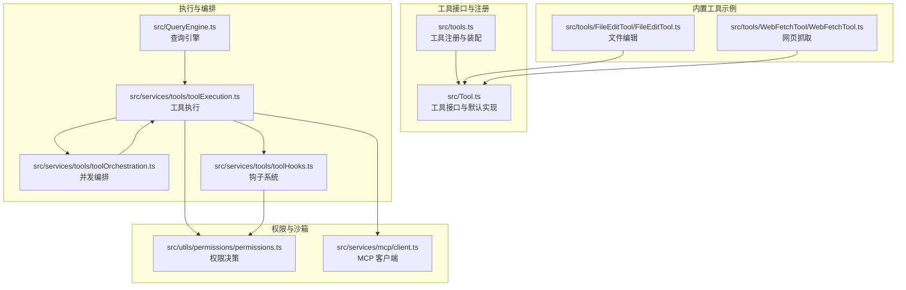
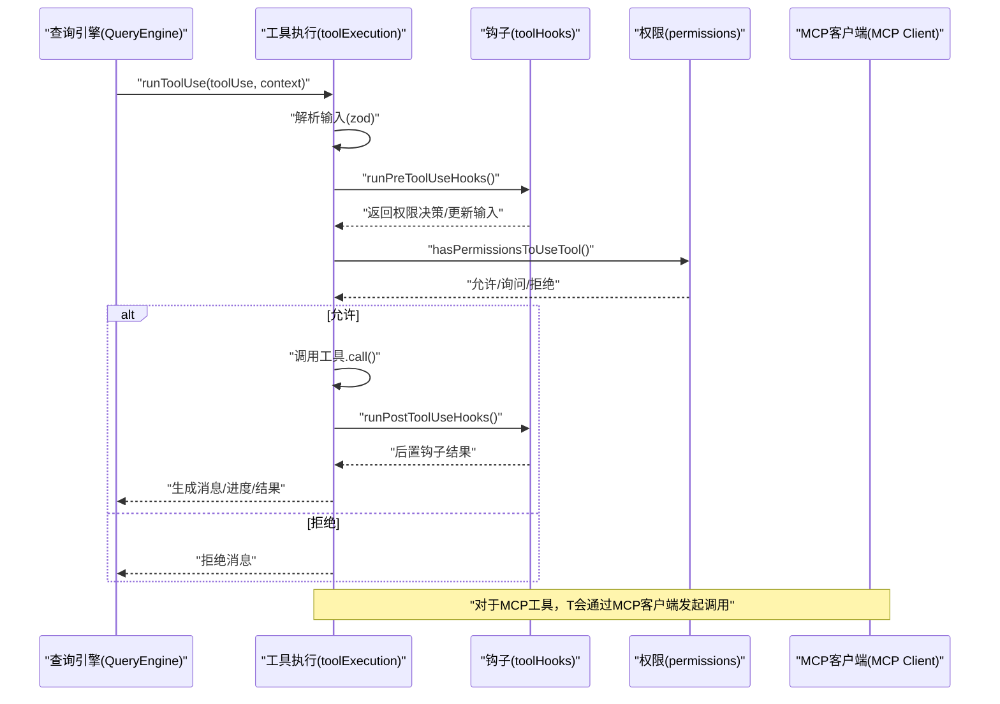
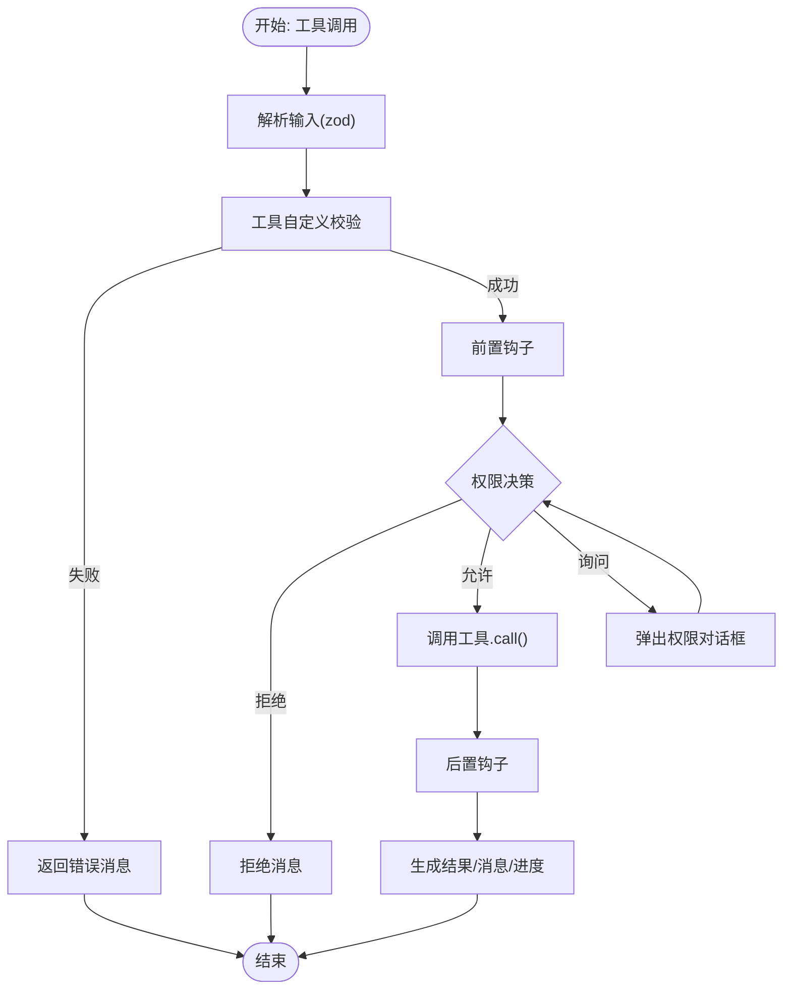
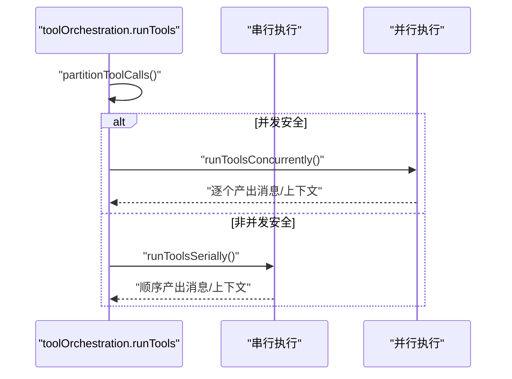
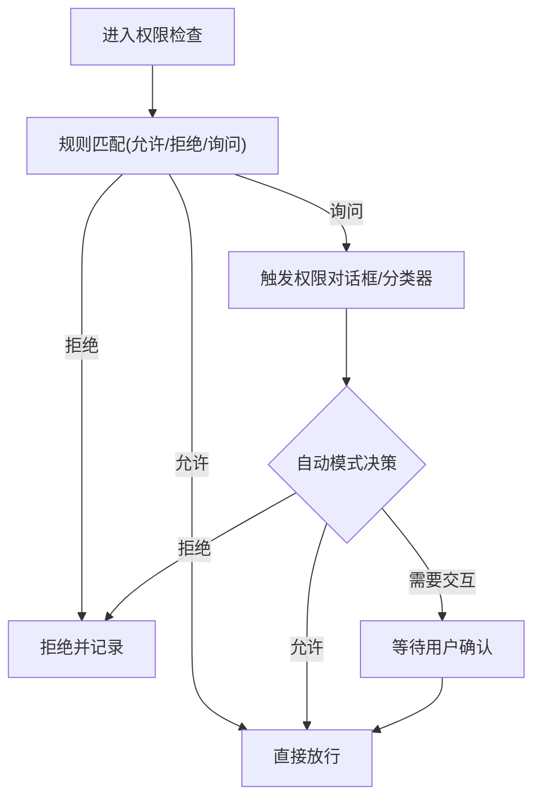
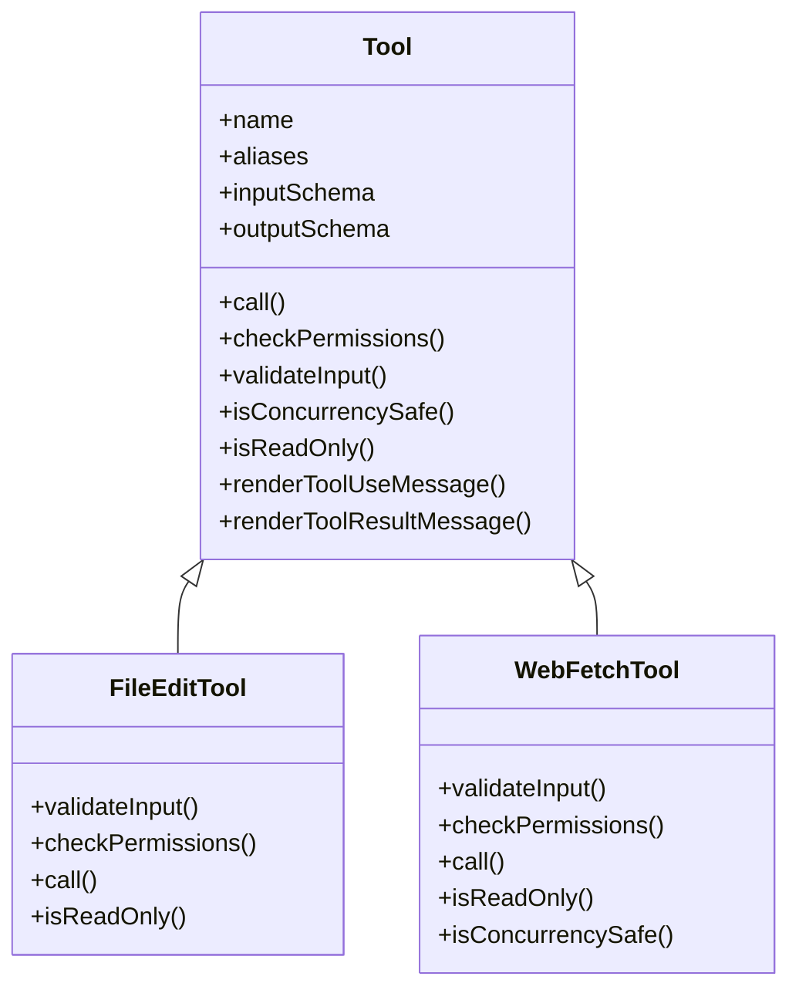
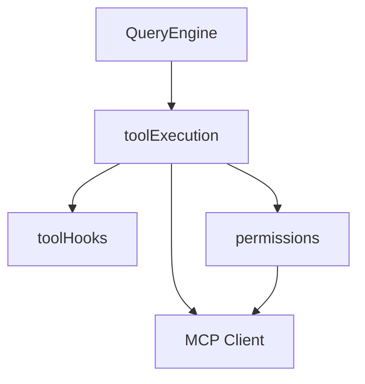
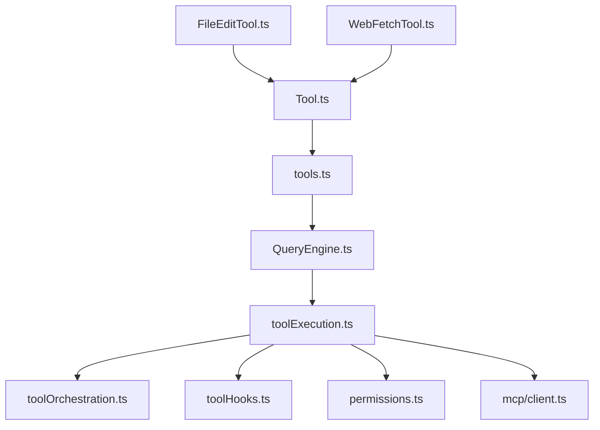

# 工具系统架构

<cite>
**本文档引用的文件**
- [src/Tool.ts](file://src/Tool.ts)
- [src/tools.ts](file://src/tools.ts)
- [src/QueryEngine.ts](file://src/QueryEngine.ts)
- [src/services/tools/toolExecution.ts](file://src/services/tools/toolExecution.ts)
- [src/services/tools/toolOrchestration.ts](file://src/services/tools/toolOrchestration.ts)
- [src/services/tools/toolHooks.ts](file://src/services/tools/toolHooks.ts)
- [src/utils/permissions/permissions.ts](file://src/utils/permissions/permissions.ts)
- [src/services/mcp/client.ts](file://src/services/mcp/client.ts)
- [src/tools/FileEditTool/FileEditTool.ts](file://src/tools/FileEditTool/FileEditTool.ts)
- [src/tools/WebFetchTool/WebFetchTool.ts](file://src/tools/WebFetchTool/WebFetchTool.ts)
</cite>

## 目录
1. [简介](#简介)
2. [项目结构](#项目结构)
3. [核心组件](#核心组件)
4. [架构总览](#架构总览)
5. [详细组件分析](#详细组件分析)
6. [依赖关系分析](#依赖关系分析)
7. [性能考虑](#性能考虑)
8. [故障排除指南](#故障排除指南)
9. [结论](#结论)

## 简介
本文件系统性阐述 Claude Code 的工具系统架构，覆盖工具接口规范、注册机制、执行流程、生命周期管理、权限控制与沙箱策略、内置工具分类与实现、与查询引擎/权限系统/服务层的交互方式、扩展机制（自定义工具、插件、第三方工具接入）、以及性能优化与错误处理策略。目标是帮助开发者在理解现有实现的基础上进行二次开发与扩展。

## 项目结构
工具系统围绕统一的工具接口抽象展开，通过集中注册器装配内置工具与 MCP 工具，并由查询引擎驱动权限检查、钩子执行与并发调度，最终调用具体工具完成任务。

**图表来源**
- [src/Tool.ts:1-793](file://src/Tool.ts#L1-L793)
- [src/tools.ts:1-390](file://src/tools.ts#L1-L390)
- [src/QueryEngine.ts:1-800](file://src/QueryEngine.ts#L1-L800)
- [src/services/tools/toolExecution.ts:1-800](file://src/services/tools/toolExecution.ts#L1-L800)
- [src/services/tools/toolOrchestration.ts:1-189](file://src/services/tools/toolOrchestration.ts#L1-L189)
- [src/services/tools/toolHooks.ts:1-651](file://src/services/tools/toolHooks.ts#L1-L651)
- [src/utils/permissions/permissions.ts:1-800](file://src/utils/permissions/permissions.ts#L1-L800)
- [src/services/mcp/client.ts:1-800](file://src/services/mcp/client.ts#L1-L800)
- [src/tools/FileEditTool/FileEditTool.ts:1-626](file://src/tools/FileEditTool/FileEditTool.ts#L1-L626)
- [src/tools/WebFetchTool/WebFetchTool.ts:1-319](file://src/tools/WebFetchTool/WebFetchTool.ts#L1-L319)

**章节来源**
- [src/Tool.ts:1-793](file://src/Tool.ts#L1-L793)
- [src/tools.ts:1-390](file://src/tools.ts#L1-L390)

## 核心组件
- 工具接口与默认实现：定义工具契约、输入输出模式、权限校验、并发安全、UI 渲染、结果映射等能力，并提供安全默认值。
- 工具注册与装配：集中管理内置工具集合，按权限上下文过滤、合并 MCP 工具、去重与排序，保证提示缓存稳定性。
- 查询引擎：负责系统提示构建、消息循环、工具使用上下文传递、权限拒绝统计与会话持久化。
- 执行与编排：解析工具调用、运行前置钩子、权限决策、并发分批执行、进度与结果消息生成。
- 权限系统：规则匹配、自动模式分类器、沙箱策略、拒绝追踪与降级策略。
- MCP 客户端：连接远端 MCP 服务器、认证、超时与代理、错误分类与重试、结果存储与截断。
- 内置工具示例：文件编辑、网页抓取等典型工具的输入校验、权限策略、并发特性与 UI 表现。

**章节来源**
- [src/Tool.ts:362-695](file://src/Tool.ts#L362-L695)
- [src/tools.ts:193-389](file://src/tools.ts#L193-L389)
- [src/QueryEngine.ts:184-639](file://src/QueryEngine.ts#L184-L639)
- [src/services/tools/toolExecution.ts:337-570](file://src/services/tools/toolExecution.ts#L337-L570)
- [src/services/tools/toolOrchestration.ts:19-82](file://src/services/tools/toolOrchestration.ts#L19-L82)
- [src/services/tools/toolHooks.ts:435-433](file://src/services/tools/toolHooks.ts#L435-L433)
- [src/utils/permissions/permissions.ts:473-800](file://src/utils/permissions/permissions.ts#L473-L800)
- [src/services/mcp/client.ts:1-800](file://src/services/mcp/client.ts#L1-L800)
- [src/tools/FileEditTool/FileEditTool.ts:86-595](file://src/tools/FileEditTool/FileEditTool.ts#L86-L595)
- [src/tools/WebFetchTool/WebFetchTool.ts:66-307](file://src/tools/WebFetchTool/WebFetchTool.ts#L66-L307)

## 架构总览
工具系统采用“接口抽象 + 注册装配 + 钩子与权限贯穿 + 并发编排”的分层设计。查询引擎作为入口协调工具选择与执行；工具执行层负责输入校验、权限决策、钩子执行与结果生成；权限系统与 MCP 客户端分别处理本地策略与远端工具；内置工具遵循统一接口并可按需扩展。

**图表来源**
- [src/QueryEngine.ts:675-686](file://src/QueryEngine.ts#L675-L686)
- [src/services/tools/toolExecution.ts:337-570](file://src/services/tools/toolExecution.ts#L337-L570)
- [src/services/tools/toolHooks.ts:435-433](file://src/services/tools/toolHooks.ts#L435-L433)
- [src/utils/permissions/permissions.ts:473-800](file://src/utils/permissions/permissions.ts#L473-L800)
- [src/services/mcp/client.ts:1-800](file://src/services/mcp/client.ts#L1-L800)

## 详细组件分析

### 工具接口规范与生命周期
- 接口定义：工具具备名称、别名、输入/输出模式、描述、并发安全判定、只读/破坏性标记、中断行为、搜索/读取/列表识别、是否 MCP/LSP、延迟加载/始终加载、最大结果大小、严格模式、输入回填、输入校验、权限检查、路径提取、权限匹配器、用户可见名、UI 渲染、结果映射等能力。
- 生命周期：
  - 创建：通过工厂函数构建，注入安全默认值。
  - 注册：集中注册器装配内置工具与 MCP 工具，按权限上下文过滤与去重。
  - 验证：先 zod 类型校验，再工具自定义校验。
  - 权限：前置钩子与权限系统共同决定是否允许、询问或拒绝。
  - 执行：并发安全判定，批量执行，串行/并行混合策略。
  - 结果：生成消息、进度、附件、UI 展示与错误处理。
  - 清理：上下文修改、状态更新、持久化。

**图表来源**
- [src/Tool.ts:362-695](file://src/Tool.ts#L362-L695)
- [src/services/tools/toolExecution.ts:599-733](file://src/services/tools/toolExecution.ts#L599-L733)
- [src/services/tools/toolHooks.ts:435-433](file://src/services/tools/toolHooks.ts#L435-L433)

**章节来源**
- [src/Tool.ts:362-695](file://src/Tool.ts#L362-L695)
- [src/services/tools/toolExecution.ts:599-733](file://src/services/tools/toolExecution.ts#L599-L733)

### 工具注册机制与装配
- 工具池装配：根据权限上下文过滤内置工具，合并 MCP 工具，按名称排序并去重，内置工具优先保持连续前缀以稳定提示缓存。
- 过滤规则：支持基于规则的全局/会话/设置来源的允许/拒绝/询问规则，MCP 服务器级规则亦可作用于工具集。
- 简化模式：在特定模式下仅暴露受限工具集，隐藏底层原语，避免误用。

**图表来源**
- [src/tools.ts:193-367](file://src/tools.ts#L193-L367)

**章节来源**
- [src/tools.ts:193-367](file://src/tools.ts#L193-L367)

### 执行流程与并发编排
- 分批策略：将连续只读工具聚合成批次并行执行，非只读工具串行执行，避免竞态与副作用。
- 并发上限：可通过环境变量配置最大并发数。
- 上下文传播：工具执行过程中可累积上下文修改，确保后续工具可见最新状态。

**图表来源**
- [src/services/tools/toolOrchestration.ts:19-82](file://src/services/tools/toolOrchestration.ts#L19-L82)

**章节来源**
- [src/services/tools/toolOrchestration.ts:19-82](file://src/services/tools/toolOrchestration.ts#L19-L82)

### 权限控制系统
- 规则体系：允许/拒绝/询问三类规则，支持多来源（设置、命令、会话等），MCP 服务器/工具规则可精确匹配。
- 自动模式：在自动模式下，对可接受编辑的场景快速放行，或通过分类器进行自动审批；失败时可降级为拒绝或提示。
- 沙箱策略：针对 Bash/PowerShell 等高风险工具，结合沙箱与分类器策略，必要时强制交互确认。
- 拒绝追踪：记录连续拒绝次数，辅助自动模式的降级与提示。

**图表来源**
- [src/utils/permissions/permissions.ts:473-800](file://src/utils/permissions/permissions.ts#L473-L800)

**章节来源**
- [src/utils/permissions/permissions.ts:473-800](file://src/utils/permissions/permissions.ts#L473-L800)

### 内置工具分类与实现
- 文件操作工具：文件读取、编辑、写入、搜索、Grep、笔记编辑等。强调并发安全、只读工具并行、写入前一致性校验、编码与换行处理、变更通知与历史记录。
- 系统命令工具：Bash/PowerShell 等，严格输入校验、沙箱策略、输出截断与持久化、权限拦截与分类器配合。
- 网络请求工具：网页抓取，支持预批准主机、重定向检测、内容处理与二进制落盘、权限建议与规则匹配。
- 其他工具：任务管理、技能工具、计划模式切换、工作树切换、MCP 资源访问、工具搜索等。

**图表来源**
- [src/Tool.ts:362-695](file://src/Tool.ts#L362-L695)
- [src/tools/FileEditTool/FileEditTool.ts:86-595](file://src/tools/FileEditTool/FileEditTool.ts#L86-L595)
- [src/tools/WebFetchTool/WebFetchTool.ts:66-307](file://src/tools/WebFetchTool/WebFetchTool.ts#L66-L307)

**章节来源**
- [src/tools/FileEditTool/FileEditTool.ts:86-595](file://src/tools/FileEditTool/FileEditTool.ts#L86-L595)
- [src/tools/WebFetchTool/WebFetchTool.ts:66-307](file://src/tools/WebFetchTool/WebFetchTool.ts#L66-L307)

### 与查询引擎、权限系统、服务层的交互
- 查询引擎：负责构建系统提示、组装工具上下文、持久化消息、统计用量与权限拒绝、触发工具执行。
- 权限系统：在工具执行前介入，通过钩子与规则共同决定是否放行；自动模式下结合分类器与快速通道。
- 服务层：MCP 客户端负责远端工具发现、认证、传输、超时与代理、错误分类与重试、结果截断与落盘。

**图表来源**
- [src/QueryEngine.ts:184-639](file://src/QueryEngine.ts#L184-L639)
- [src/services/tools/toolExecution.ts:337-570](file://src/services/tools/toolExecution.ts#L337-L570)
- [src/services/tools/toolHooks.ts:435-433](file://src/services/tools/toolHooks.ts#L435-L433)
- [src/utils/permissions/permissions.ts:473-800](file://src/utils/permissions/permissions.ts#L473-L800)
- [src/services/mcp/client.ts:1-800](file://src/services/mcp/client.ts#L1-L800)

**章节来源**
- [src/QueryEngine.ts:184-639](file://src/QueryEngine.ts#L184-L639)
- [src/services/mcp/client.ts:1-800](file://src/services/mcp/client.ts#L1-L800)

### 工具扩展机制
- 自定义工具开发：遵循工具接口，使用工厂函数构建，提供输入/输出模式、权限策略、UI 渲染与结果映射。
- 插件集成：通过注册器装配，按权限上下文过滤，保证与内置工具一致的行为与体验。
- 第三方工具接入：通过 MCP 协议对接远端工具，客户端负责认证、传输、超时与代理、错误处理与结果截断。

**章节来源**
- [src/Tool.ts:783-792](file://src/Tool.ts#L783-L792)
- [src/tools.ts:345-367](file://src/tools.ts#L345-L367)
- [src/services/mcp/client.ts:1-800](file://src/services/mcp/client.ts#L1-L800)

## 依赖关系分析
- 组件耦合：工具接口与注册器低耦合，执行层与权限/钩子/服务层松耦合，便于替换与扩展。
- 外部依赖：MCP SDK、权限规则库、钩子框架、日志与分析模块、文件系统与网络栈。
- 循环依赖：通过懒加载与类型导出规避，例如工具注册器中对团队工具的懒加载导入。

**图表来源**
- [src/Tool.ts:1-793](file://src/Tool.ts#L1-L793)
- [src/tools.ts:1-390](file://src/tools.ts#L1-L390)
- [src/QueryEngine.ts:1-800](file://src/QueryEngine.ts#L1-L800)
- [src/services/tools/toolExecution.ts:1-800](file://src/services/tools/toolExecution.ts#L1-L800)
- [src/services/tools/toolOrchestration.ts:1-189](file://src/services/tools/toolOrchestration.ts#L1-L189)
- [src/services/tools/toolHooks.ts:1-651](file://src/services/tools/toolHooks.ts#L1-L651)
- [src/utils/permissions/permissions.ts:1-800](file://src/utils/permissions/permissions.ts#L1-L800)
- [src/services/mcp/client.ts:1-800](file://src/services/mcp/client.ts#L1-L800)
- [src/tools/FileEditTool/FileEditTool.ts:1-626](file://src/tools/FileEditTool/FileEditTool.ts#L1-L626)
- [src/tools/WebFetchTool/WebFetchTool.ts:1-319](file://src/tools/WebFetchTool/WebFetchTool.ts#L1-L319)

**章节来源**
- [src/tools.ts:62-72](file://src/tools.ts#L62-L72)

## 性能考虑
- 并发执行：只读工具批量并行，非只读串行，减少锁竞争与副作用。
- 缓存与去重：工具池按名称排序去重，内置工具前缀连续，提升提示缓存命中率。
- 输入校验与早失败：zod 类型校验与工具自定义校验尽早失败，避免昂贵的工具调用。
- 结果截断与持久化：大结果落地磁盘并返回预览，降低内存占用与传输成本。
- 超时与代理：MCP 请求带超时包装，HTTP/WS/SSE 传输适配代理与 mTLS。
- 分类器与快速通道：自动模式下优先接受编辑与白名单工具，减少分类器调用。

[本节为通用指导，无需列出具体文件来源]

## 故障排除指南
- 工具不存在：当工具名不在可用工具集中，记录调试日志并返回错误消息。
- 输入校验失败：格式化 Zod 错误，必要时附加“未加载工具模式”提示，引导用户先调用工具搜索。
- 权限被拒：记录拒绝原因与来源，支持自动模式下的分类器降级与交互提示。
- MCP 认证失败：缓存“需要认证”状态，触发授权流程或提示用户处理。
- 超时与重试：对 MCP 请求应用独立超时信号，避免单次信号过期导致的持续失败；对 401 进行令牌刷新与重试。
- 结果过大：自动截断并落盘，保留元数据以便查看原始内容。

**章节来源**
- [src/services/tools/toolExecution.ts:337-490](file://src/services/tools/toolExecution.ts#L337-L490)
- [src/services/tools/toolExecution.ts:599-733](file://src/services/tools/toolExecution.ts#L599-L733)
- [src/services/mcp/client.ts:340-422](file://src/services/mcp/client.ts#L340-L422)

## 结论
该工具系统以统一接口为核心，通过注册装配与并发编排实现高效稳定的工具链路；权限与沙箱策略贯穿执行全过程，保障安全性与可控性；MCP 客户端提供远端工具接入能力；内置工具覆盖文件、命令、网络等常见场景。整体架构清晰、扩展性强，适合在现有基础上进行自定义工具与第三方工具的接入与二次开发。