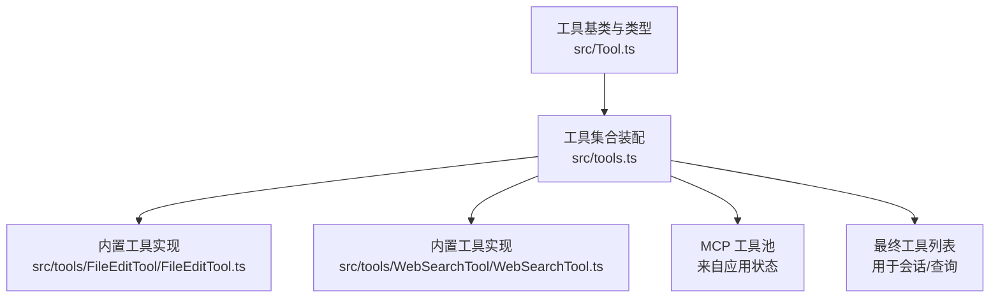
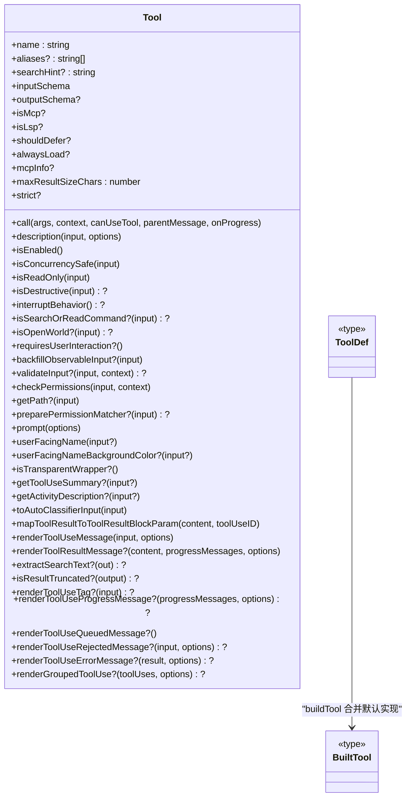
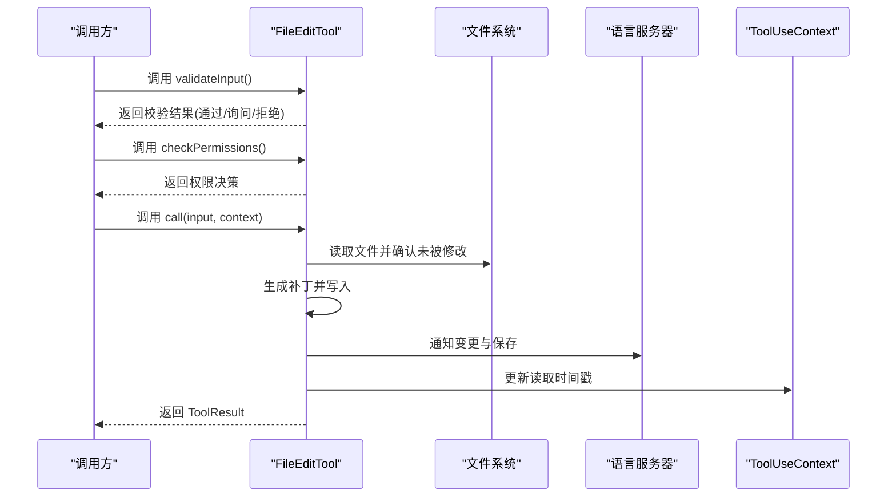
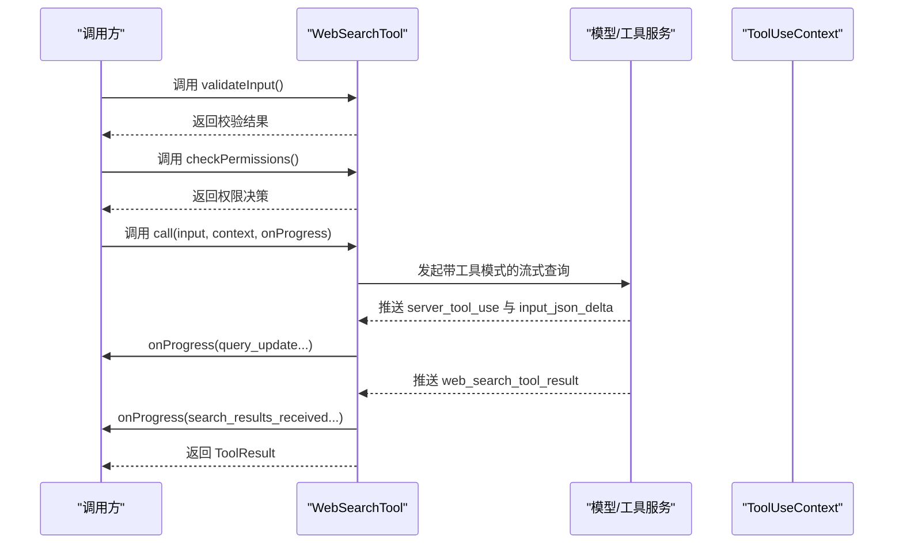
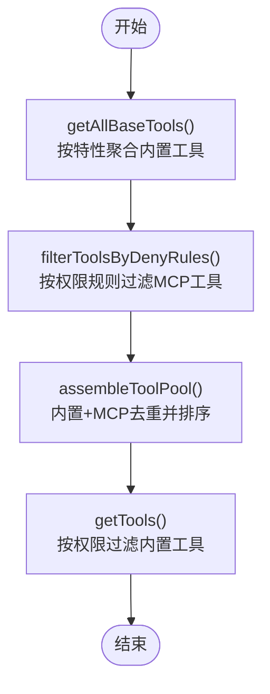
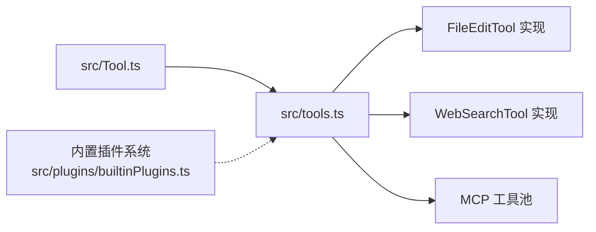

# 自定义工具开发

<cite>
**本文引用的文件**
- [src/Tool.ts](file://src/Tool.ts)
- [src/tools.ts](file://src/tools.ts)
- [src/tools/FileEditTool/FileEditTool.ts](file://src/tools/FileEditTool/FileEditTool.ts)
- [src/tools/WebSearchTool/WebSearchTool.ts](file://src/tools/WebSearchTool/WebSearchTool.ts)
- [src/plugins/builtinPlugins.ts](file://src/plugins/builtinPlugins.ts)
- [README.md](file://README.md)
</cite>

## 目录
1. [简介](#简介)
2. [项目结构](#项目结构)
3. [核心组件](#核心组件)
4. [架构总览](#架构总览)
5. [详细组件分析](#详细组件分析)
6. [依赖分析](#依赖分析)
7. [性能考虑](#性能考虑)
8. [故障排查指南](#故障排查指南)
9. [结论](#结论)
10. [附录](#附录)

## 简介
本指南面向希望在 Claude Code 中开发自定义工具的开发者，提供从工具模板、开发步骤到最佳实践的完整路径。文档基于仓库中的工具系统源码，重点覆盖以下方面：
- 如何继承 Tool 基类并实现必要接口与生命周期钩子
- 工具开发的调试技巧（本地测试、日志记录、错误排查）
- 工具与系统的集成方式（参数校验、权限声明、结果格式化）
- 工具的打包与分发（内置插件注册、版本管理）
- 丰富的开发示例（常见工具类型与复杂场景）

## 项目结构
工具系统的核心由三部分组成：
- 工具基类与类型定义：位于 [src/Tool.ts](file://src/Tool.ts)，定义了工具的统一接口、默认行为、上下文与渲染能力
- 工具集合装配：位于 [src/tools.ts](file://src/tools.ts)，负责按环境与权限过滤、合并内置工具与 MCP 工具
- 典型工具实现：如文件编辑工具 [src/tools/FileEditTool/FileEditTool.ts](file://src/tools/FileEditTool/FileEditTool.ts)、网络搜索工具 [src/tools/WebSearchTool/WebSearchTool.ts](file://src/tools/WebSearchTool/WebSearchTool.ts)

图表来源
- [src/Tool.ts:1-793](file://src/Tool.ts#L1-L793)
- [src/tools.ts:190-390](file://src/tools.ts#L190-L390)

章节来源
- [src/Tool.ts:1-793](file://src/Tool.ts#L1-L793)
- [src/tools.ts:190-390](file://src/tools.ts#L190-L390)

## 核心组件
- 工具接口与生命周期
  - 必备方法：call(args, context, canUseTool, parentMessage, onProgress)
  - 可选能力：validateInput、checkPermissions、isConcurrencySafe、isReadOnly、isDestructive、interruptBehavior、toAutoClassifierInput、userFacingName、renderToolUseMessage、renderToolResultMessage、renderToolUseProgressMessage、mapToolResultToToolResultBlockParam 等
  - 上下文 ToolUseContext 提供命令、调试开关、思考配置、MCP 客户端、文件读取缓存、通知与消息注入等能力
- 工具构建器 buildTool
  - 将 ToolDef 合并默认实现，确保调用方获得一致的工具对象
  - 默认策略：启用、非并发安全、读写操作、非破坏性、允许通过通用权限系统、空分类输入
- 工具集合装配
  - getAllBaseTools：按环境特性与特性开关聚合内置工具
  - getTools：按权限规则过滤内置工具，并处理 REPL 模式下的可见性
  - assembleToolPool：合并内置工具与 MCP 工具，去重并保持提示词缓存稳定排序
  - getMergedTools：返回包含 MCP 工具的完整工具集

章节来源
- [src/Tool.ts:362-695](file://src/Tool.ts#L362-L695)
- [src/Tool.ts:783-792](file://src/Tool.ts#L783-L792)
- [src/tools.ts:190-390](file://src/tools.ts#L190-L390)

## 架构总览
工具系统采用“基类 + 构建器 + 装配器”的分层设计：
- 基类层：统一接口、默认行为与类型约束
- 构建器层：填充默认实现，保证一致性
- 装配层：按权限与特性组装工具集合，支持内置与 MCP 工具融合

图表来源
- [src/Tool.ts:362-695](file://src/Tool.ts#L362-L695)
- [src/Tool.ts:716-792](file://src/Tool.ts#L716-L792)

章节来源
- [src/Tool.ts:362-695](file://src/Tool.ts#L362-L695)
- [src/Tool.ts:716-792](file://src/Tool.ts#L716-L792)

## 详细组件分析

### 文件编辑工具（FileEditTool）分析
FileEditTool 是一个典型的可读写工具，展示了：
- 输入/输出模式：使用 Zod 模式定义输入与输出
- 参数校验：路径存在性、大小限制、内容一致性、替换策略等
- 权限检查：基于文件系统规则与工具权限上下文
- 并发安全：非并发安全（避免竞态）
- 结果映射：将内部数据映射为 SDK 的工具结果块参数
- UI 渲染：输入展示、进度、结果与拒绝/错误消息

图表来源
- [src/tools/FileEditTool/FileEditTool.ts:137-362](file://src/tools/FileEditTool/FileEditTool.ts#L137-L362)
- [src/tools/FileEditTool/FileEditTool.ts:387-574](file://src/tools/FileEditTool/FileEditTool.ts#L387-L574)

章节来源
- [src/tools/FileEditTool/FileEditTool.ts:1-626](file://src/tools/FileEditTool/FileEditTool.ts#L1-L626)

### 网络搜索工具（WebSearchTool）分析
WebSearchTool 展示了“只读 + 流式进度 + 外部服务调用”的典型模式：
- 输入/输出模式：严格对象定义，输出包含搜索结果与耗时
- 权限策略：需要显式授权建议
- 并发安全：并发安全
- 进度回调：在流式响应中推送“查询更新”和“结果到达”事件
- 结果映射：将多段内容块拼装为统一输出并映射为 SDK 工具结果

图表来源
- [src/tools/WebSearchTool/WebSearchTool.ts:235-253](file://src/tools/WebSearchTool/WebSearchTool.ts#L235-L253)
- [src/tools/WebSearchTool/WebSearchTool.ts:254-400](file://src/tools/WebSearchTool/WebSearchTool.ts#L254-L400)

章节来源
- [src/tools/WebSearchTool/WebSearchTool.ts:1-436](file://src/tools/WebSearchTool/WebSearchTool.ts#L1-L436)

### 工具集合装配流程
工具集合装配遵循“内置工具 + MCP 工具”的合并策略，并进行权限过滤与名称去重。

图表来源
- [src/tools.ts:190-251](file://src/tools.ts#L190-L251)
- [src/tools.ts:262-367](file://src/tools.ts#L262-L367)

章节来源
- [src/tools.ts:190-390](file://src/tools.ts#L190-L390)

## 依赖分析
- 工具基类对上下文、权限、消息、MCP、文件系统等模块有广泛依赖
- 工具集合装配对特性开关、环境变量、REPL 模式、权限上下文进行条件装配
- 内置插件系统与工具系统相互独立但可协同：插件可提供技能/钩子/MCP 服务器，工具仍由工具系统统一管理

图表来源
- [src/Tool.ts:1-793](file://src/Tool.ts#L1-L793)
- [src/tools.ts:1-390](file://src/tools.ts#L1-L390)
- [src/plugins/builtinPlugins.ts:1-160](file://src/plugins/builtinPlugins.ts#L1-L160)

章节来源
- [src/Tool.ts:1-793](file://src/Tool.ts#L1-L793)
- [src/tools.ts:1-390](file://src/tools.ts#L1-L390)
- [src/plugins/builtinPlugins.ts:1-160](file://src/plugins/builtinPlugins.ts#L1-L160)

## 性能考虑
- 并发安全：对于可能产生竞态或副作用的工具，应明确声明 isConcurrencySafe(false)，以避免不必要的并行执行
- 输入校验：尽早失败（validateInput），减少昂贵操作的触发概率
- 结果大小：合理设置 maxResultSizeChars，避免超大结果导致内存压力
- 进度回调：在长耗时任务中使用 onProgress，提升用户体验与可观测性
- 缓存与去重：工具名称排序与去重有助于提示词缓存命中率与稳定性

## 故障排查指南
- 本地测试
  - 使用最小输入样例快速验证 validateInput 与 checkPermissions
  - 在 REPL 或 CLI 中开启调试模式，观察 ToolUseContext 的注入项
- 日志记录
  - 使用工具内部的日志与诊断工具（如文件操作日志、错误追踪）
  - 对于外部服务调用，记录请求/响应与耗时
- 错误排查
  - 若工具被拒绝：检查权限规则匹配、用户交互需求、输入不合法
  - 若工具无输出：检查 mapToolResultToToolResultBlockParam 是否正确映射
  - 若 UI 不显示进度：确认 onProgress 是否被调用且渲染函数已实现

章节来源
- [src/tools/FileEditTool/FileEditTool.ts:137-362](file://src/tools/FileEditTool/FileEditTool.ts#L137-L362)
- [src/tools/WebSearchTool/WebSearchTool.ts:254-400](file://src/tools/WebSearchTool/WebSearchTool.ts#L254-L400)

## 结论
通过遵循工具基类接口、使用 buildTool 填充默认行为、在工具集合中正确装配与过滤，开发者可以快速实现安全、可维护、可扩展的自定义工具。结合内置插件系统与 MCP 工具池，工具生态能够灵活扩展并满足复杂场景需求。

## 附录

### 工具模板与开发步骤
- 步骤一：定义输入/输出模式（Zod 或 JSON Schema）
- 步骤二：实现 call 方法（执行逻辑、进度回调、错误处理）
- 步骤三：实现 validateInput 与 checkPermissions（早失败与权限控制）
- 步骤四：实现渲染相关方法（输入/结果/进度/拒绝/错误 UI）
- 步骤五：实现 mapToolResultToToolResultBlockParam（SDK 结果映射）
- 步骤六：使用 buildTool 包裹并导出工具
- 步骤七：在工具集合中注册（如需内置工具）

章节来源
- [src/Tool.ts:362-695](file://src/Tool.ts#L362-L695)
- [src/Tool.ts:783-792](file://src/Tool.ts#L783-L792)

### 集成与分发
- 集成方式
  - 内置工具：在工具集合中注册，按权限与特性开关生效
  - MCP 工具：通过 MCP 服务器动态加载，参与工具池合并
  - 插件系统：内置插件提供技能/钩子/MCP 服务器，用户可启用/禁用
- 版本管理
  - 插件系统支持版本化存储与迁移，初始化时完成 V1→V2 迁移与状态同步

章节来源
- [src/tools.ts:345-367](file://src/tools.ts#L345-L367)
- [src/plugins/builtinPlugins.ts:57-102](file://src/plugins/builtinPlugins.ts#L57-L102)

### 开发示例索引
- 文件编辑工具：路径存在性、大小限制、内容一致性、写入与 LSP 通知
  - 参考：[src/tools/FileEditTool/FileEditTool.ts:137-574](file://src/tools/FileEditTool/FileEditTool.ts#L137-L574)
- 网络搜索工具：只读、并发安全、流式进度、结果拼装
  - 参考：[src/tools/WebSearchTool/WebSearchTool.ts:235-400](file://src/tools/WebSearchTool/WebSearchTool.ts#L235-L400)
- 工具系统架构图
  - 参考：[README.md:500-533](file://README.md#L500-L533)