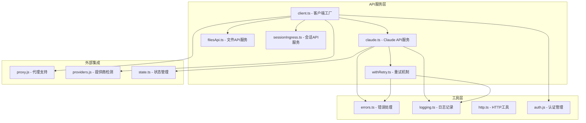
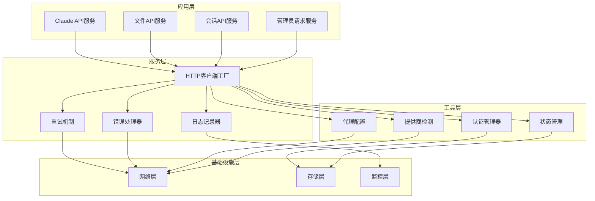
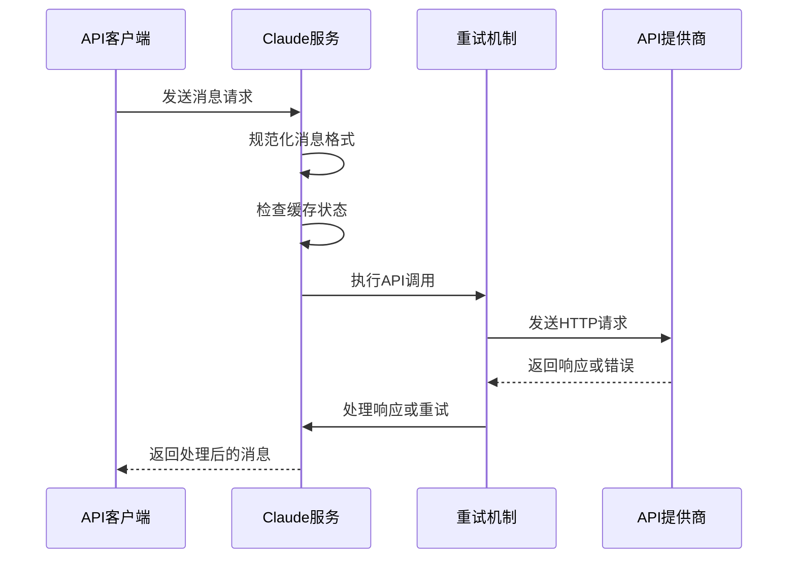
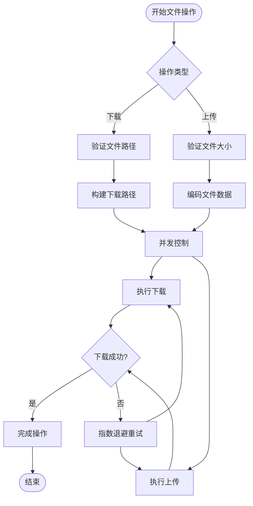
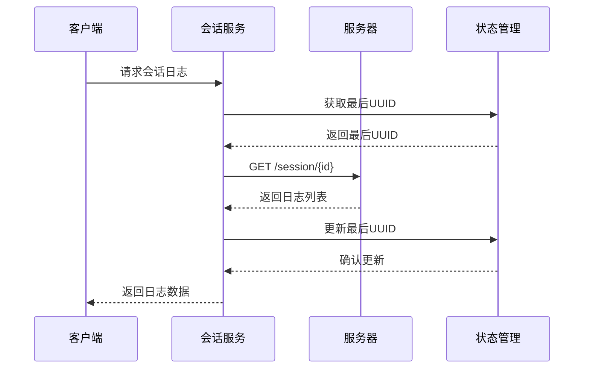

# API客户端服务

<cite>
**本文档引用的文件**
- [src/services/api/client.ts](file://src/services/api/client.ts)
- [src/services/api/claude.ts](file://src/services/api/claude.ts)
- [src/services/api/filesApi.ts](file://src/services/api/filesApi.ts)
- [src/services/api/sessionIngress.ts](file://src/services/api/sessionIngress.ts)
- [src/services/api/withRetry.ts](file://src/services/api/withRetry.ts)
- [src/services/api/errors.ts](file://src/services/api/errors.ts)
- [src/services/api/logging.ts](file://src/services/api/logging.ts)
- [src/services/api/adminRequests.ts](file://src/services/api/adminRequests.ts)
- [src/utils/http.ts](file://src/utils/http.ts)
- [src/utils/auth.js](file://src/utils/auth.js)
- [src/utils/proxy.js](file://src/utils/proxy.js)
- [src/utils/model/providers.js](file://src/utils/model/providers.js)
- [src/utils/sessionIngressAuth.js](file://src/utils/sessionIngressAuth.js)
- [src/utils/teleport/api.js](file://src/utils/teleport/api.js)
- [src/bootstrap/state.ts](file://src/bootstrap/state.ts)
- [src/constants/oauth.js](file://src/constants/oauth.js)
- [src/services/mcp/client.ts](file://src/services/mcp/client.ts)
</cite>

## 目录
1. [简介](#简介)
2. [项目结构](#项目结构)
3. [核心组件](#核心组件)
4. [架构概览](#架构概览)
5. [详细组件分析](#详细组件分析)
6. [依赖关系分析](#依赖关系分析)
7. [性能考虑](#性能考虑)
8. [故障排除指南](#故障排除指南)
9. [结论](#结论)

## 简介

Claude Code的API客户端服务是一个高度模块化的系统，提供了对Anthropic API的统一访问接口，支持多种部署环境和认证方式。该系统采用分层架构设计，通过HTTP客户端封装、智能重试机制、完善的错误处理策略和灵活的认证管理，为开发者提供了稳定可靠的API调用体验。

系统主要包含以下核心特性：
- 多提供商支持：直接API、AWS Bedrock、Google Cloud Vertex AI、Microsoft Azure Foundry
- 智能重试机制：基于指数退避的自适应重试策略
- 完善的错误处理：针对不同类型的API错误提供专门的处理逻辑
- 安全认证：支持多种认证方式，包括API密钥、OAuth令牌和云平台认证
- 连接管理：优化的连接池管理和超时处理
- 监控日志：全面的API调用监控和调试信息

## 项目结构

API客户端服务位于`src/services/api/`目录下，采用按功能模块划分的组织方式：



**图表来源**
- [src/services/api/client.ts:1-390](file://src/services/api/client.ts#L1-L390)
- [src/services/api/claude.ts:1-800](file://src/services/api/claude.ts#L1-L800)
- [src/services/api/filesApi.ts:1-749](file://src/services/api/filesApi.ts#L1-L749)

**章节来源**
- [src/services/api/client.ts:1-390](file://src/services/api/client.ts#L1-L390)
- [src/services/api/claude.ts:1-800](file://src/services/api/claude.ts#L1-L800)

## 核心组件

### HTTP客户端封装器

HTTP客户端封装器是整个API系统的核心基础设施，负责处理所有网络通信细节。它支持多种部署环境和认证方式：

**主要特性：**
- 动态客户端选择：根据环境变量自动选择合适的API提供商
- 自定义头部管理：支持额外的HTTP头部和自定义头文件
- 超时控制：可配置的请求超时和连接超时
- 代理支持：透明的代理服务器支持
- 请求ID追踪：为每个请求生成唯一的客户端请求ID

**章节来源**
- [src/services/api/client.ts:88-316](file://src/services/api/client.ts#L88-L316)
- [src/utils/http.ts:1-35](file://src/utils/http.ts#L1-L35)

### 智能重试机制

重试机制是API客户端服务的重要组成部分，提供了灵活且高效的错误恢复能力：

**重试策略：**
- 指数退避：基于指数增长的延迟时间，最大不超过32秒
- 条件重试：仅对可恢复的错误类型进行重试
- 529错误处理：特殊处理API过载错误，区分前台和后台请求
- 快速模式降级：在高负载情况下自动降级到标准速度模式
- 持久会话支持：支持长时间运行的会话，定期发送心跳信号

**章节来源**
- [src/services/api/withRetry.ts:170-517](file://src/services/api/withRetry.ts#L170-L517)

### 错误处理系统

错误处理系统提供了全面的错误分类和处理机制：

**错误分类：**
- API错误：HTTP状态码错误和API特定错误
- 连接错误：网络连接问题和超时
- 认证错误：API密钥失效和OAuth令牌过期
- 速率限制：API配额和使用限制错误
- 媒体大小错误：图片和PDF文件大小限制

**章节来源**
- [src/services/api/errors.ts:425-780](file://src/services/api/errors.ts#L425-L780)

### 认证管理系统

认证管理系统支持多种认证方式，确保API调用的安全性：

**认证方式：**
- API密钥认证：支持直接API密钥和辅助API密钥
- OAuth认证：支持Claude AI订阅用户的OAuth令牌
- 云平台认证：AWS IAM、Google Cloud、Azure AD认证
- 会话认证：基于JWT的会话令牌认证

**章节来源**
- [src/utils/auth.js](file://src/utils/auth.js)
- [src/services/api/client.ts:131-137](file://src/services/api/client.ts#L131-L137)

## 架构概览

API客户端服务采用分层架构设计，每层都有明确的职责和边界：



**图表来源**
- [src/services/api/claude.ts:231-257](file://src/services/api/claude.ts#L231-L257)
- [src/services/api/client.ts:88-316](file://src/services/api/client.ts#L88-L316)

## 详细组件分析

### Claude API服务

Claude API服务是主API调用入口，提供了完整的消息处理和响应解析功能：

#### 核心功能

**消息处理流程：**
1. 消息规范化：将内部消息格式转换为API期望的格式
2. 缓存控制：智能的提示词缓存管理
3. 工具集成：支持各种工具的调用和结果处理
4. 流式响应：支持流式API响应的实时处理

**配置管理：**
- 模型选择：支持多种Anthropic模型的动态切换
- 思维模式：可配置的思考模式和输出格式
- 工具权限：细粒度的工具访问控制
- 输出格式：支持JSON结构化输出和普通文本输出



**图表来源**
- [src/services/api/claude.ts:727-750](file://src/services/api/claude.ts#L727-L750)
- [src/services/api/withRetry.ts:170-253](file://src/services/api/withRetry.ts#L170-L253)

**章节来源**
- [src/services/api/claude.ts:676-750](file://src/services/api/claude.ts#L676-L750)
- [src/services/api/claude.ts:752-780](file://src/services/api/claude.ts#L752-L780)

### 文件API服务

文件API服务专门处理文件上传、下载和管理操作：

#### 文件操作流程

**下载流程：**
1. 路径验证：检查文件路径的安全性和有效性
2. 并发控制：限制同时进行的下载操作数量
3. 重试机制：对失败的下载操作进行指数退避重试
4. 完整性检查：验证下载文件的完整性和大小

**上传流程：**
1. 文件验证：检查文件大小和类型限制
2. 多部分编码：构建符合API规范的多部分表单数据
3. 并发上传：支持多个文件的并发上传
4. 错误处理：针对不同类型的上传错误提供专门的处理



**图表来源**
- [src/services/api/filesApi.ts:132-180](file://src/services/api/filesApi.ts#L132-L180)
- [src/services/api/filesApi.ts:378-552](file://src/services/api/filesApi.ts#L378-L552)

**章节来源**
- [src/services/api/filesApi.ts:125-180](file://src/services/api/filesApi.ts#L125-L180)
- [src/services/api/filesApi.ts:347-593](file://src/services/api/filesApi.ts#L347-L593)

### 会话API服务

会话API服务负责处理会话相关的数据持久化和检索：

#### 乐观并发控制

会话API服务实现了复杂的并发控制机制，确保多个客户端同时访问同一会话时的数据一致性：

**UUID跟踪：**
- 最后UUID映射：维护每个会话的最新消息UUID
- 冲突检测：检测和解决并发写入冲突
- 状态恢复：从服务器状态中恢复丢失的UUID信息

**序列化处理：**
- 会话级序列化：确保同一会话的消息按顺序处理
- 并发限制：防止多个客户端同时修改同一会话
- 状态同步：保持本地状态与服务器状态的一致性



**图表来源**
- [src/services/api/sessionIngress.ts:42-55](file://src/services/api/sessionIngress.ts#L42-L55)
- [src/services/api/sessionIngress.ts:63-186](file://src/services/api/sessionIngress.ts#L63-L186)

**章节来源**
- [src/services/api/sessionIngress.ts:22-55](file://src/services/api/sessionIngress.ts#L22-L55)
- [src/services/api/sessionIngress.ts:188-240](file://src/services/api/sessionIngress.ts#L188-L240)

### 管理员请求服务

管理员请求服务为团队和企业用户提供自助式的资源申请功能：

#### 请求类型

**限额增加请求：**
- 用户配额调整
- API使用量限制提升
- 特殊功能访问权限

**座位升级请求：**
- 团队成员座位升级
- 高级功能权限申请
- 企业级功能访问

**章节来源**
- [src/services/api/adminRequests.ts:14-38](file://src/services/api/adminRequests.ts#L14-L38)
- [src/services/api/adminRequests.ts:49-92](file://src/services/api/adminRequests.ts#L49-L92)

## 依赖关系分析

API客户端服务的依赖关系呈现清晰的层次结构：

```mermaid
graph TB
subgraph "外部依赖"
A[@anthropic-ai/sdk - 主要SDK]
B[axios - HTTP客户端]
C[google-auth-library - GCP认证]
D[@azure/identity - Azure认证]
end
subgraph "内部模块"
E[client.ts - 客户端工厂]
F[withRetry.ts - 重试机制]
G[errors.ts - 错误处理]
H[logging.ts - 日志记录]
I[auth.js - 认证管理]
J[http.ts - HTTP工具]
K[proxy.js - 代理支持]
L[providers.js - 提供商检测]
end
subgraph "业务服务"
M[claude.ts - Claude API]
N[filesApi.ts - 文件API]
O[sessionIngress.ts - 会话API]
P[adminRequests.ts - 管理员请求]
end
A --> E
B --> F
C --> I
D --> I
E --> F
E --> G
E --> H
F --> G
F --> H
E --> I
E --> J
E --> K
E --> L
E --> M
E --> N
E --> O
E --> P
```

**图表来源**
- [src/services/api/client.ts:1-25](file://src/services/api/client.ts#L1-L25)
- [src/services/api/withRetry.ts:1-47](file://src/services/api/withRetry.ts#L1-L47)

### 关键依赖关系

**客户端工厂依赖：**
- `@anthropic-ai/sdk`：主要的API客户端SDK
- `google-auth-library`：Google Cloud认证支持
- `@azure/identity`：Azure平台认证支持

**重试机制依赖：**
- `axios`：HTTP请求处理
- `@anthropic-ai/sdk/error`：API错误类型识别
- 内部工具模块：认证状态检查和错误分类

**章节来源**
- [src/services/api/client.ts:1-316](file://src/services/api/client.ts#L1-L316)
- [src/services/api/withRetry.ts:1-823](file://src/services/api/withRetry.ts#L1-L823)

## 性能考虑

API客户端服务在设计时充分考虑了性能优化：

### 连接池管理

**连接复用：**
- HTTP连接池：默认启用连接复用，减少TCP连接建立开销
- 连接超时：合理的连接超时设置，避免连接泄漏
- 连接清理：定期清理空闲连接，释放系统资源

**并发控制：**
- 请求并发限制：防止过多并发请求导致服务器过载
- 资源分配：根据系统资源动态调整并发数量
- 背压处理：当系统过载时自动降低请求频率

### 缓存策略

**多层缓存：**
- 提示词缓存：智能的提示词缓存机制，减少重复计算
- 响应缓存：短期响应缓存，提高重复请求的响应速度
- 认证缓存：令牌缓存和刷新机制，减少认证开销

**缓存失效：**
- 时间戳控制：基于时间的缓存失效机制
- 内容变更检测：检测缓存内容变更，及时更新缓存
- 手动清理：提供手动缓存清理接口

### 监控和诊断

**性能指标：**
- 响应时间统计：记录每次API调用的响应时间
- 错误率监控：监控API调用的错误率和成功率
- 资源使用情况：监控内存、CPU和网络使用情况

**调试支持：**
- 详细日志：提供详细的API调用日志
- 性能分析：支持性能瓶颈分析和优化
- 错误追踪：完整的错误追踪和报告机制

## 故障排除指南

### 常见问题和解决方案

**认证问题：**
- API密钥无效：检查API密钥是否正确配置和有效
- OAuth令牌过期：重新登录获取新的访问令牌
- 云平台认证失败：检查云平台凭证和权限设置

**网络连接问题：**
- 超时错误：检查网络连接和防火墙设置
- 连接重置：检查代理服务器和网络稳定性
- DNS解析失败：检查DNS服务器配置

**API限制问题：**
- 429错误：等待一段时间后重试，或联系管理员提升限额
- 529错误：这是API过载保护，需要等待系统恢复
- 403错误：检查用户权限和API访问范围

**章节来源**
- [src/services/api/errors.ts:154-210](file://src/services/api/errors.ts#L154-L210)
- [src/services/api/withRetry.ts:696-787](file://src/services/api/withRetry.ts#L696-L787)

### 调试技巧

**启用详细日志：**
- 设置调试级别：使用`--debug`参数启用详细日志输出
- 分析请求ID：通过客户端请求ID关联服务器端日志
- 监控网络流量：使用网络抓包工具分析HTTP请求

**性能分析：**
- 使用性能分析工具：如Node.js内置的profiler
- 监控系统资源：检查CPU、内存和磁盘使用情况
- 分析慢查询：识别和优化性能瓶颈

**章节来源**
- [src/services/api/logging.ts:284-301](file://src/services/api/logging.ts#L284-L301)
- [src/services/api/client.ts:377-388](file://src/services/api/client.ts#L377-L388)

## 结论

Claude Code的API客户端服务展现了现代API客户端设计的最佳实践。通过精心设计的架构和完善的错误处理机制，该系统为开发者提供了稳定、可靠且高性能的API访问体验。

**主要优势：**
- **模块化设计**：清晰的模块分离和职责划分
- **智能重试**：基于业务场景的智能重试策略
- **安全认证**：支持多种认证方式的安全保障
- **性能优化**：全面的性能监控和优化措施
- **易于扩展**：灵活的架构设计便于功能扩展

**未来发展方向：**
- **异步处理**：增强异步任务处理能力
- **分布式支持**：支持分布式部署和负载均衡
- **监控增强**：提供更丰富的监控和告警功能
- **自动化测试**：完善自动化测试和持续集成流程

该API客户端服务不仅满足了当前的功能需求，还为未来的功能扩展和技术演进奠定了坚实的基础。