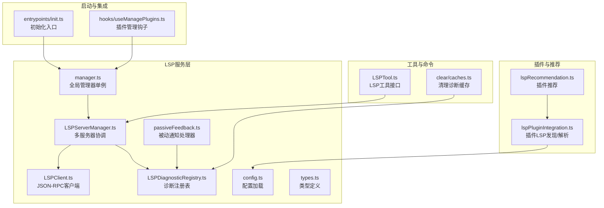
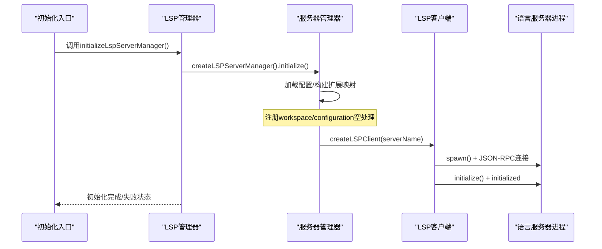
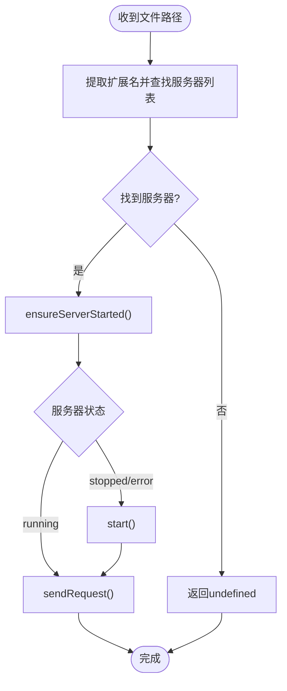
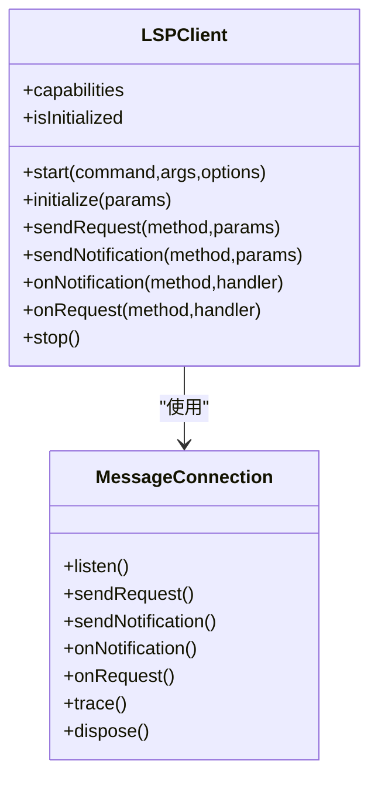
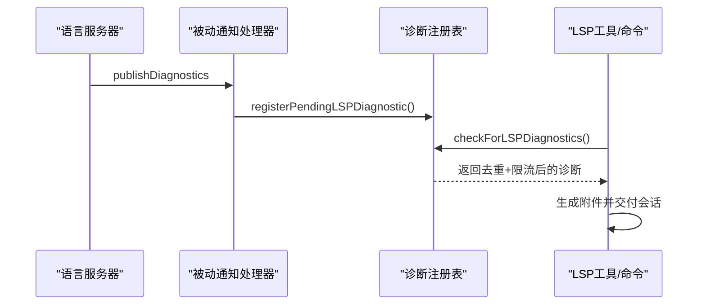
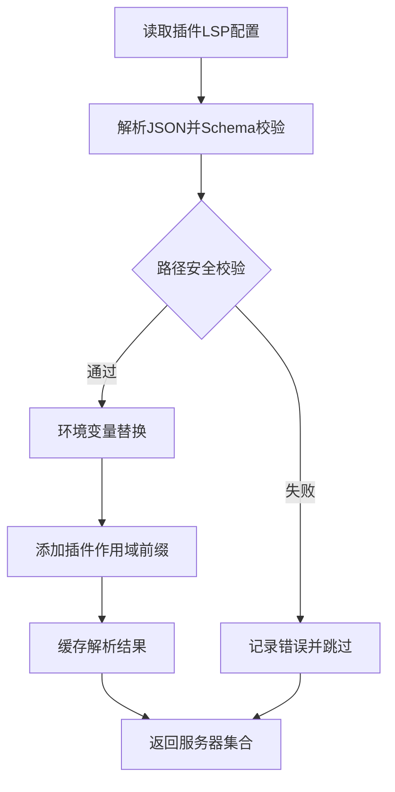
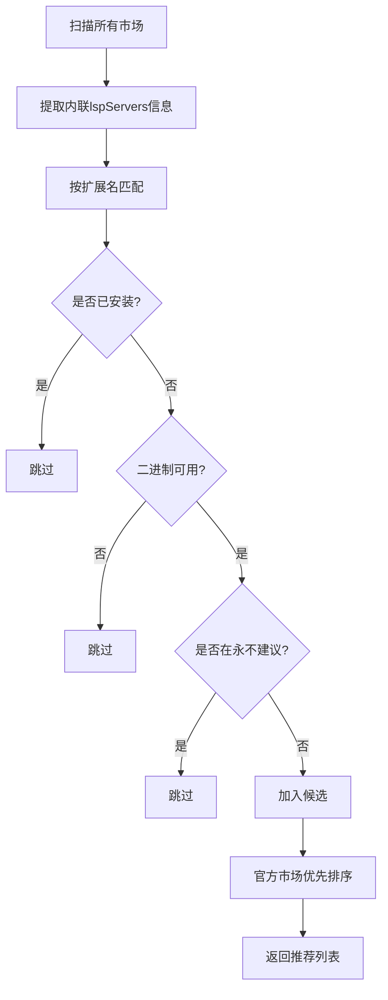
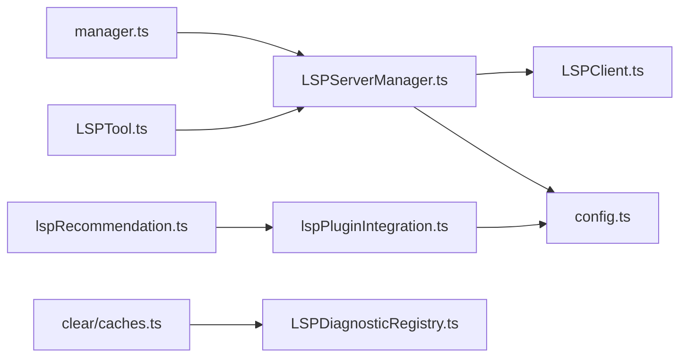

# LSP语言服务器服务

<cite>
**本文档引用的文件**
- [src/services/lsp/manager.ts](file://src/services/lsp/manager.ts)
- [src/services/lsp/LSPServerManager.ts](file://src/services/lsp/LSPServerManager.ts)
- [src/services/lsp/LSPClient.ts](file://src/services/lsp/LSPClient.ts)
- [src/services/lsp/LSPDiagnosticRegistry.ts](file://src/services/lsp/LSPDiagnosticRegistry.ts)
- [src/utils/plugins/lspPluginIntegration.ts](file://src/utils/plugins/lspPluginIntegration.ts)
- [src/utils/plugins/lspRecommendation.ts](file://src/utils/plugins/lspRecommendation.ts)
- [src/services/lsp/passiveFeedback.ts](file://src/services/lsp/passiveFeedback.ts)
- [src/services/lsp/config.ts](file://src/services/lsp/config.ts)
- [src/services/lsp/types.ts](file://src/services/lsp/types.ts)
- [src/tools/LSPTool/LSPTool.ts](file://src/tools/LSPTool/LSPTool.ts)
- [src/commands/clear/caches.ts](file://src/commands/clear/caches.ts)
- [src/hooks/useManagePlugins.ts](file://src/hooks/useManagePlugins.ts)
- [src/entrypoints/init.ts](file://src/entrypoints/init.ts)
</cite>

## 目录
1. [简介](#简介)
2. [项目结构](#项目结构)
3. [核心组件](#核心组件)
4. [架构总览](#架构总览)
5. [详细组件分析](#详细组件分析)
6. [依赖关系分析](#依赖关系分析)
7. [性能考虑](#性能考虑)
8. [故障排除指南](#故障排除指南)
9. [结论](#结论)
10. [附录](#附录)

## 简介
本文件面向Claude Code的LSP语言服务器服务，系统性阐述其架构设计与实现细节，重点覆盖以下方面：
- LSP服务器管理器的单例初始化、多服务器协调与状态管理
- LSP客户端的消息封装与进程生命周期管理
- 被动反馈机制与诊断注册表的异步诊断收集与交付
- 与编辑器集成的文件同步（didOpen/didChange/didSave/didClose）与智能提示、错误检测能力
- 配置加载、插件LSP服务器发现与环境变量解析
- 性能调优建议与资源管理策略

## 项目结构
围绕LSP服务的核心目录与文件如下：
- 服务层：manager.ts、LSPServerManager.ts、LSPClient.ts、LSPDiagnosticRegistry.ts、passiveFeedback.ts、config.ts、types.ts
- 插件集成：lspPluginIntegration.ts、lspRecommendation.ts
- 工具与命令：LSPTool.ts、clear/caches.ts
- 启动与钩子：entrypoints/init.ts、hooks/useManagePlugins.ts

**图表来源**
- [src/services/lsp/manager.ts:1-290](file://src/services/lsp/manager.ts#L1-L290)
- [src/services/lsp/LSPServerManager.ts:1-421](file://src/services/lsp/LSPServerManager.ts#L1-L421)
- [src/services/lsp/LSPClient.ts:1-448](file://src/services/lsp/LSPClient.ts#L1-L448)
- [src/services/lsp/LSPDiagnosticRegistry.ts:1-387](file://src/services/lsp/LSPDiagnosticRegistry.ts#L1-L387)
- [src/services/lsp/passiveFeedback.ts](file://src/services/lsp/passiveFeedback.ts)
- [src/services/lsp/config.ts](file://src/services/lsp/config.ts)
- [src/services/lsp/types.ts](file://src/services/lsp/types.ts)
- [src/utils/plugins/lspPluginIntegration.ts:1-388](file://src/utils/plugins/lspPluginIntegration.ts#L1-L388)
- [src/utils/plugins/lspRecommendation.ts:1-375](file://src/utils/plugins/lspRecommendation.ts#L1-L375)
- [src/tools/LSPTool/LSPTool.ts](file://src/tools/LSPTool/LSPTool.ts)
- [src/commands/clear/caches.ts:1-150](file://src/commands/clear/caches.ts#L1-L150)
- [src/entrypoints/init.ts:1-200](file://src/entrypoints/init.ts#L1-L200)
- [src/hooks/useManagePlugins.ts:1-200](file://src/hooks/useManagePlugins.ts#L1-L200)

**章节来源**
- [src/services/lsp/manager.ts:1-290](file://src/services/lsp/manager.ts#L1-L290)
- [src/services/lsp/LSPServerManager.ts:1-421](file://src/services/lsp/LSPServerManager.ts#L1-L421)
- [src/services/lsp/LSPClient.ts:1-448](file://src/services/lsp/LSPClient.ts#L1-L448)
- [src/services/lsp/LSPDiagnosticRegistry.ts:1-387](file://src/services/lsp/LSPDiagnosticRegistry.ts#L1-L387)
- [src/utils/plugins/lspPluginIntegration.ts:1-388](file://src/utils/plugins/lspPluginIntegration.ts#L1-L388)
- [src/utils/plugins/lspRecommendation.ts:1-375](file://src/utils/plugins/lspRecommendation.ts#L1-L375)

## 核心组件
- 全局LSP服务器管理器（单例）
  - 初始化、重初始化、优雅关闭
  - 状态机：未启动/等待/成功/失败
  - 提供查询连接状态、等待初始化完成等能力
- LSP服务器管理器
  - 多服务器映射：扩展名到服务器名称列表
  - 按文件扩展选择服务器并确保启动
  - 统一请求分发与文件同步（didOpen/didChange/didSave/didClose）
- LSP客户端
  - 基于vscode-jsonrpc的MessageConnection
  - 进程生命周期管理（spawn/start/stop）、崩溃检测与错误传播
  - 请求/通知与请求处理程序的延迟注册支持
- 诊断注册表
  - 异步接收publishDiagnostics并排队
  - 批内与跨轮次去重、按严重程度排序、总量与每文件上限限制
  - 与会话附件自动交付机制配合
- 插件LSP集成与推荐
  - 从插件加载LSP服务器配置（.lsp.json或manifest声明）
  - 环境变量解析与路径安全校验
  - 基于文件扩展与二进制可用性的插件推荐

**章节来源**
- [src/services/lsp/manager.ts:1-290](file://src/services/lsp/manager.ts#L1-L290)
- [src/services/lsp/LSPServerManager.ts:1-421](file://src/services/lsp/LSPServerManager.ts#L1-L421)
- [src/services/lsp/LSPClient.ts:1-448](file://src/services/lsp/LSPClient.ts#L1-L448)
- [src/services/lsp/LSPDiagnosticRegistry.ts:1-387](file://src/services/lsp/LSPDiagnosticRegistry.ts#L1-L387)
- [src/utils/plugins/lspPluginIntegration.ts:1-388](file://src/utils/plugins/lspPluginIntegration.ts#L1-L388)
- [src/utils/plugins/lspRecommendation.ts:1-375](file://src/utils/plugins/lspRecommendation.ts#L1-L375)

## 架构总览
下图展示LSP服务在Claude Code中的整体交互：启动阶段加载配置与插件，运行时通过管理器协调多个语言服务器，客户端负责与具体LSP进程通信，被动通知处理器订阅诊断并写入诊断注册表，最终由工具与命令层消费。

**图表来源**
- [src/entrypoints/init.ts:1-200](file://src/entrypoints/init.ts#L1-L200)
- [src/services/lsp/manager.ts:145-208](file://src/services/lsp/manager.ts#L145-L208)
- [src/services/lsp/LSPServerManager.ts:71-148](file://src/services/lsp/LSPServerManager.ts#L71-L148)
- [src/services/lsp/LSPClient.ts:88-254](file://src/services/lsp/LSPClient.ts#L88-L254)

## 详细组件分析

### LSP服务器管理器（多服务器协调）
- 扩展名到服务器映射：基于配置的extensionToLanguage建立映射，用于路由请求
- 服务器实例化：为每个配置创建LSPServerInstance，并注册通用请求处理（如workspace/configuration返回空）
- 文件同步：
  - didOpen：首次打开文件时发送，记录URI到服务器映射
  - didChange：增量变更，若未打开则回退到didOpen
  - didSave：保存后触发服务器端诊断
  - didClose：关闭文件，移除跟踪
- 请求分发：ensureServerStarted保证服务器处于运行态后转发请求

**图表来源**
- [src/services/lsp/LSPServerManager.ts:192-263](file://src/services/lsp/LSPServerManager.ts#L192-L263)

**章节来源**
- [src/services/lsp/LSPServerManager.ts:1-421](file://src/services/lsp/LSPServerManager.ts#L1-L421)

### LSP客户端（JSON-RPC封装与进程管理）
- 进程启动：spawn命令行，等待spawn成功事件以避免异步error导致的未处理拒绝
- 流与连接：stdout/stdin/stderr绑定StreamMessageReader/Writer，创建MessageConnection
- 错误处理：进程error/exit、连接onError/onClose均进行日志与状态标记；支持崩溃回调
- 协议追踪：启用Trace.Verbose并通过连接发送$setTrace通知（失败时静默）
- 延迟注册：连接未就绪时队列化通知与请求处理程序，就绪后批量应用

**图表来源**
- [src/services/lsp/LSPClient.ts:21-41](file://src/services/lsp/LSPClient.ts#L21-L41)
- [src/services/lsp/LSPClient.ts:51-447](file://src/services/lsp/LSPClient.ts#L51-L447)

**章节来源**
- [src/services/lsp/LSPClient.ts:1-448](file://src/services/lsp/LSPClient.ts#L1-L448)

### 被动反馈机制与诊断注册表
- 被动通知处理器：注册textDocument/publishDiagnostics监听，将诊断写入注册表
- 诊断注册表：
  - PendingLSPDiagnostic：按UUID唯一标识的待交付诊断批次
  - 去重策略：批内与跨轮次LRU去重，键由消息、严重度、范围、来源与编码组合
  - 限流策略：每文件最多N条，总计最多M条
  - 交付：checkForLSPDiagnostics聚合并返回可交付结果，同时更新已交付LRU

**图表来源**
- [src/services/lsp/passiveFeedback.ts](file://src/services/lsp/passiveFeedback.ts)
- [src/services/lsp/LSPDiagnosticRegistry.ts:65-338](file://src/services/lsp/LSPDiagnosticRegistry.ts#L65-L338)

**章节来源**
- [src/services/lsp/LSPDiagnosticRegistry.ts:1-387](file://src/services/lsp/LSPDiagnosticRegistry.ts#L1-L387)

### 插件LSP服务器发现与环境变量解析
- 发现与加载：
  - 支持两种来源：.lsp.json文件与manifest.lspServers声明
  - 对字符串路径进行安全校验（防止路径穿越），仅允许相对且位于插件目录内
  - 使用Zod Schema校验配置结构
- 环境变量解析：
  - 支持插件变量替换（如CLAUDE_PLUGIN_ROOT、CLAUDE_PLUGIN_DATA）
  - 支持用户配置变量替换（${user_config.X}）
  - 最终对命令、参数、环境变量与工作目录进行展开
- 作用域与缓存：
  - 为插件服务器添加前缀“plugin:<name>:”避免命名冲突
  - 缓存解析后的服务器配置，减少重复解析开销

**图表来源**
- [src/utils/plugins/lspPluginIntegration.ts:57-122](file://src/utils/plugins/lspPluginIntegration.ts#L57-L122)
- [src/utils/plugins/lspPluginIntegration.ts:127-222](file://src/utils/plugins/lspPluginIntegration.ts#L127-L222)
- [src/utils/plugins/lspPluginIntegration.ts:229-292](file://src/utils/plugins/lspPluginIntegration.ts#L229-L292)
- [src/utils/plugins/lspPluginIntegration.ts:298-358](file://src/utils/plugins/lspPluginIntegration.ts#L298-L358)

**章节来源**
- [src/utils/plugins/lspPluginIntegration.ts:1-388](file://src/utils/plugins/lspPluginIntegration.ts#L1-L388)

### 插件推荐（基于文件扩展与二进制可用性）
- 数据源：从市场配置加载所有市场，提取包含lspServers字段的条目
- 信息提取：仅支持内联配置（不支持安装后才可见的外部文件），提取命令与扩展映射
- 过滤规则：
  - 匹配目标文件扩展名
  - 二进制必须在系统中可用
  - 未安装且不在“永不建议”列表
- 排序：官方市场优先
- 用户控制：支持加入“永不建议”列表、忽略计数与禁用开关

**图表来源**
- [src/utils/plugins/lspRecommendation.ts:160-206](file://src/utils/plugins/lspRecommendation.ts#L160-L206)
- [src/utils/plugins/lspRecommendation.ts:222-309](file://src/utils/plugins/lspRecommendation.ts#L222-L309)

**章节来源**
- [src/utils/plugins/lspRecommendation.ts:1-375](file://src/utils/plugins/lspRecommendation.ts#L1-L375)

### 与编辑器集成与智能功能
- 文件同步：
  - 打开：didOpen发送语言ID与文本内容
  - 变更：didChange发送增量；若未打开则回退到didOpen
  - 保存：didSave触发服务器端诊断
  - 关闭：didClose移除跟踪
- 智能功能：
  - 定位定义/引用、悬停信息、符号大纲、格式化等均由具体语言服务器实现
  - 诊断通过被动反馈机制自动注入会话附件，辅助错误检测与修复建议

**章节来源**
- [src/services/lsp/LSPServerManager.ts:270-400](file://src/services/lsp/LSPServerManager.ts#L270-L400)

## 依赖关系分析
- 管理器依赖
  - manager.ts依赖LSPServerManager工厂与被动通知处理器注册
  - LSPServerManager.ts依赖配置加载与LSPServerInstance工厂
  - LSPServerInstance内部依赖LSPClient
- 插件集成
  - lspPluginIntegration.ts依赖配置与环境变量扩展模块
  - lspRecommendation.ts依赖二进制检查、市场配置与插件安装状态
- 工具与命令
  - LSPTool.ts依赖管理器获取服务器实例
  - clear/caches.ts依赖诊断注册表清理接口

**图表来源**
- [src/services/lsp/manager.ts:1-290](file://src/services/lsp/manager.ts#L1-L290)
- [src/services/lsp/LSPServerManager.ts:1-421](file://src/services/lsp/LSPServerManager.ts#L1-L421)
- [src/services/lsp/LSPClient.ts:1-448](file://src/services/lsp/LSPClient.ts#L1-L448)
- [src/utils/plugins/lspPluginIntegration.ts:1-388](file://src/utils/plugins/lspPluginIntegration.ts#L1-L388)
- [src/utils/plugins/lspRecommendation.ts:1-375](file://src/utils/plugins/lspRecommendation.ts#L1-L375)
- [src/tools/LSPTool/LSPTool.ts](file://src/tools/LSPTool/LSPTool.ts)
- [src/commands/clear/caches.ts:1-150](file://src/commands/clear/caches.ts#L1-L150)

**章节来源**
- [src/services/lsp/manager.ts:1-290](file://src/services/lsp/manager.ts#L1-L290)
- [src/services/lsp/LSPServerManager.ts:1-421](file://src/services/lsp/LSPServerManager.ts#L1-L421)
- [src/services/lsp/LSPClient.ts:1-448](file://src/services/lsp/LSPClient.ts#L1-L448)
- [src/utils/plugins/lspPluginIntegration.ts:1-388](file://src/utils/plugins/lspPluginIntegration.ts#L1-L388)
- [src/utils/plugins/lspRecommendation.ts:1-375](file://src/utils/plugins/lspRecommendation.ts#L1-L375)
- [src/tools/LSPTool/LSPTool.ts](file://src/tools/LSPTool/LSPTool.ts)
- [src/commands/clear/caches.ts:1-150](file://src/commands/clear/caches.ts#L1-L150)

## 性能考虑
- 启动与初始化
  - 管理器采用异步初始化，避免阻塞启动流程；通过generation计数防止陈旧初始化竞争
  - 服务器配置解析与实例化在后台完成，首次请求时再启动对应服务器
- 连接与协议
  - 使用vscode-jsonrpc的MessageConnection，启用协议追踪便于调试但注意额外开销
  - 连接错误与关闭事件在初始化前即注册，避免未捕获异常
- 诊断处理
  - 诊断注册表采用LRU缓存与批内去重，避免内存膨胀与重复交付
  - 限流策略（每文件与总数）保障会话性能与可读性
- 文件同步
  - didOpen仅在首次打开时发送，后续变更走didChange；若服务器未运行则回退到didOpen
  - 保存时发送didSave触发服务器端诊断，有助于及时反馈

[本节为通用性能指导，无需特定文件引用]

## 故障排除指南
- 初始化失败
  - 检查初始化状态与错误对象；失败后管理器不会暴露实例
  - 重新初始化或重启应用后重试
- 服务器启动失败
  - 查看stderr输出与进程error事件；确认命令是否存在、权限是否足够
  - 环境变量解析失败会导致启动失败，检查CLAUDE_PLUGIN_ROOT、CLAUDE_PLUGIN_DATA与user_config变量
- 连接异常
  - 连接onError/onClose会记录日志；若非预期关闭，检查服务器崩溃码
  - 通知发送失败会被吞掉但记录日志，不影响主流程
- 诊断未显示
  - 确认被动通知处理器已注册；检查publishDiagnostics是否到达
  - 清理诊断缓存或重置会话状态后重试
- 插件LSP不可见
  - 检查插件是否启用、lspServers是否正确声明
  - 若使用外部.lsp.json，需在安装后才能被推荐系统识别

**章节来源**
- [src/services/lsp/manager.ts:76-208](file://src/services/lsp/manager.ts#L76-L208)
- [src/services/lsp/LSPClient.ts:144-207](file://src/services/lsp/LSPClient.ts#L144-L207)
- [src/services/lsp/LSPDiagnosticRegistry.ts:346-387](file://src/services/lsp/LSPDiagnosticRegistry.ts#L346-L387)
- [src/utils/plugins/lspPluginIntegration.ts:229-292](file://src/utils/plugins/lspPluginIntegration.ts#L229-L292)

## 结论
该LSP服务通过管理器单例、多服务器协调与客户端封装，实现了稳定、可扩展的语言服务器集成。结合被动反馈与诊断注册表，能够高效地将诊断信息交付给用户会话。插件系统的发现与解析进一步增强了生态兼容性。通过合理的初始化策略、连接管理与诊断限流，系统在性能与可靠性之间取得平衡。

[本节为总结性内容，无需特定文件引用]

## 附录

### 配置选项与最佳实践
- 配置来源
  - 内置服务器：通过config.ts加载
  - 插件服务器：通过lspPluginIntegration.ts加载与解析
- 环境变量
  - 支持CLAUDE_PLUGIN_ROOT、CLAUDE_PLUGIN_DATA与user_config变量
  - 建议在插件manifest中声明所需userConfig键，避免解析时抛错
- 服务器资源管理
  - 首次请求时启动服务器，避免常驻占用
  - 保存文件触发didSave以减少不必要的实时计算
- 响应时间优化
  - 合理设置诊断限流参数（每文件与总数上限）
  - 在高并发场景下，优先保证关键语言服务器的资源分配
- 与编辑器集成
  - 确保didOpen/didChange/didSave链路完整
  - 对频繁变更的文件，考虑合并变更批次以降低服务器压力

**章节来源**
- [src/services/lsp/config.ts](file://src/services/lsp/config.ts)
- [src/utils/plugins/lspPluginIntegration.ts:229-292](file://src/utils/plugins/lspPluginIntegration.ts#L229-L292)
- [src/services/lsp/LSPServerManager.ts:270-400](file://src/services/lsp/LSPServerManager.ts#L270-L400)
- [src/services/lsp/LSPDiagnosticRegistry.ts:256-289](file://src/services/lsp/LSPDiagnosticRegistry.ts#L256-L289)