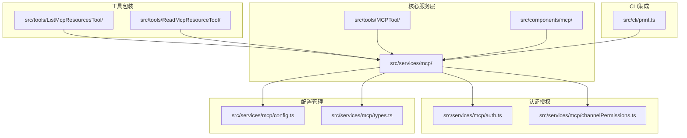
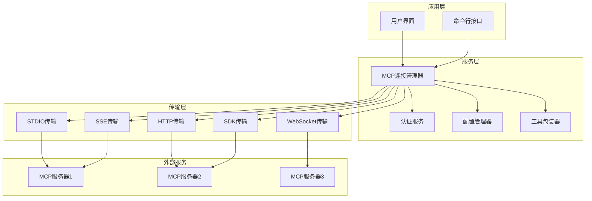
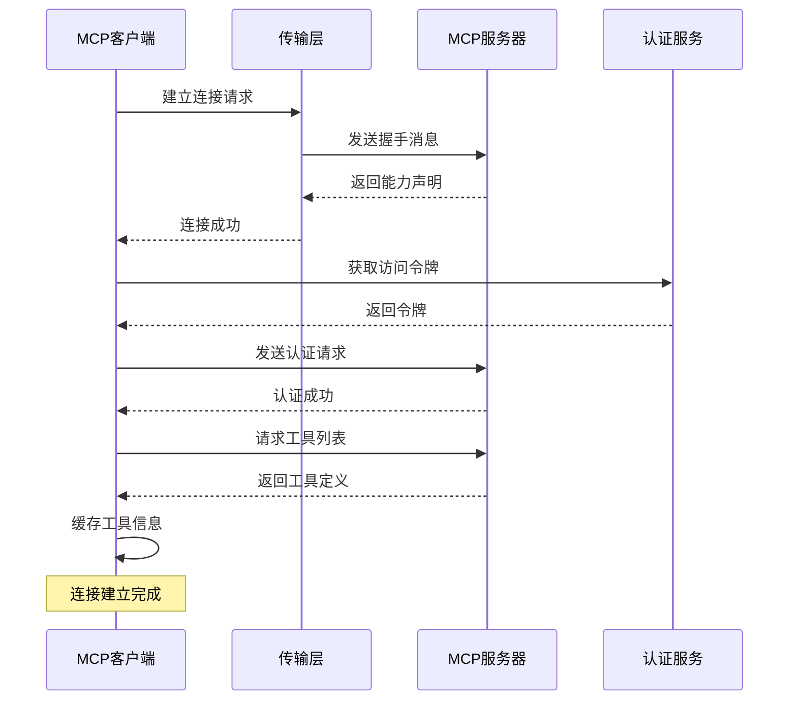
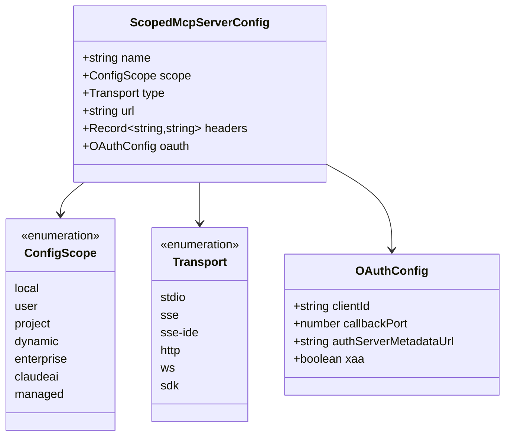
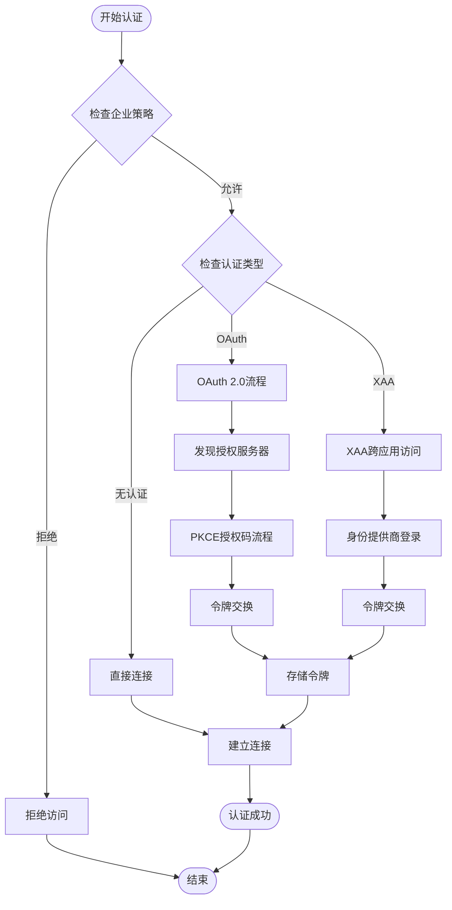
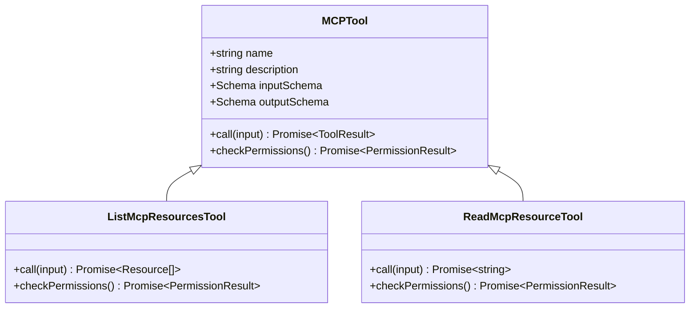
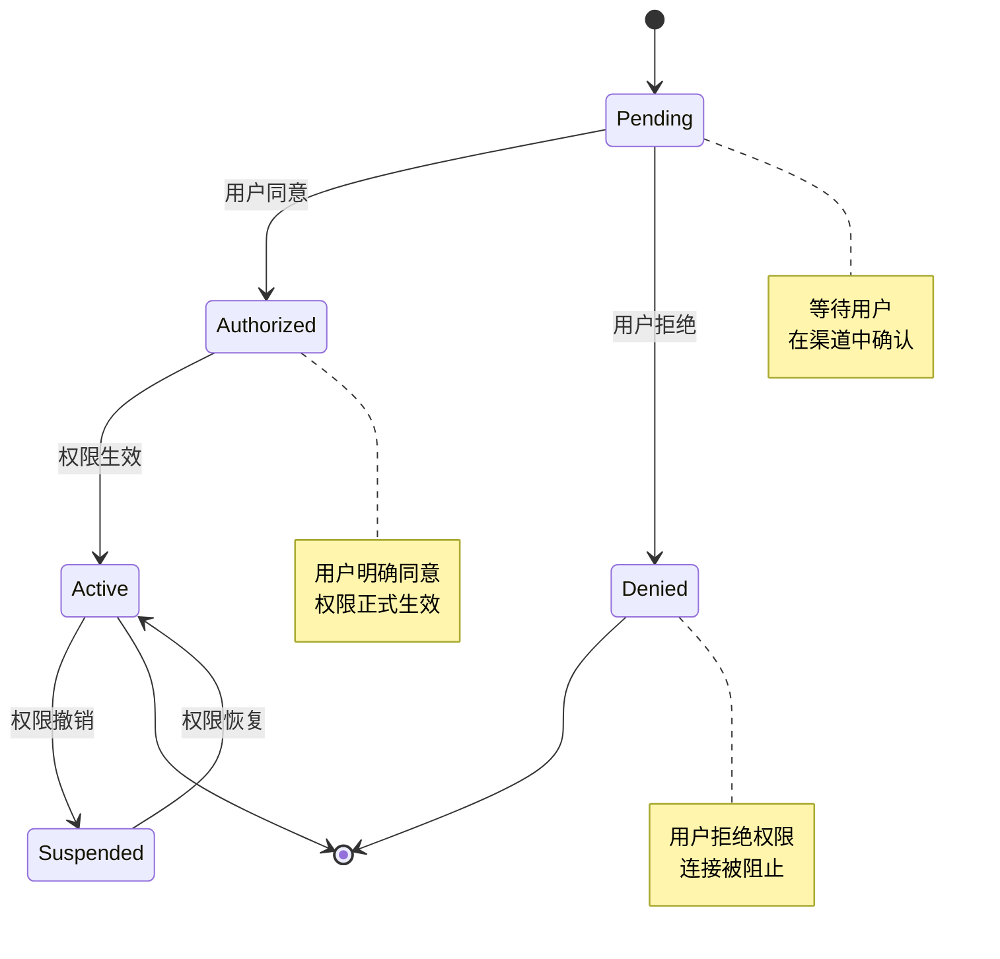

# MCP集成服务

<cite>
**本文档引用的文件**
- [src/services/mcp/client.ts](file://src/services/mcp/client.ts)
- [src/services/mcp/types.ts](file://src/services/mcp/types.ts)
- [src/services/mcp/config.ts](file://src/services/mcp/config.ts)
- [src/services/mcp/auth.ts](file://src/services/mcp/auth.ts)
- [src/services/mcp/useManageMCPConnections.ts](file://src/services/mcp/useManageMCPConnections.ts)
- [src/services/mcp/channelPermissions.ts](file://src/services/mcp/channelPermissions.ts)
- [src/services/mcp/officialRegistry.ts](file://src/services/mcp/officialRegistry.ts)
- [src/tools/MCPTool/MCPTool.ts](file://src/tools/MCPTool/MCPTool.ts)
- [src/tools/ListMcpResourcesTool/ListMcpResourcesTool.ts](file://src/tools/ListMcpResourcesTool/ListMcpResourcesTool.ts)
- [src/tools/ReadMcpResourceTool/ReadMcpResourceTool.ts](file://src/tools/ReadMcpResourceTool/ReadMcpResourceTool.ts)
- [src/components/mcp/MCPListPanel.tsx](file://src/components/mcp/MCPListPanel.tsx)
- [src/cli/print.ts](file://src/cli/print.ts)
- [src/utils/claudeInChrome/mcpServer.ts](file://src/utils/claudeInChrome/mcpServer.ts)
</cite>

## 目录
1. [简介](#简介)
2. [项目结构](#项目结构)
3. [核心组件](#核心组件)
4. [架构概览](#架构概览)
5. [详细组件分析](#详细组件分析)
6. [依赖关系分析](#依赖关系分析)
7. [性能考虑](#性能考虑)
8. [故障排除指南](#故障排除指南)
9. [结论](#结论)

## 简介

Claude Code的MCP（Model Context Protocol）集成服务是一个完整的外部AI服务接入框架，它实现了MCP协议的完整客户端支持，提供了多传输层连接管理、认证授权、权限控制和工具包装等功能。该服务允许Claude Code与各种外部AI服务进行无缝集成，包括本地进程、HTTP API、WebSocket和SSE等多种连接方式。

该集成服务的核心目标是为开发者提供一个统一的接口来访问和管理各种MCP兼容的服务，同时确保安全性、可靠性和可扩展性。通过MCP协议，Claude Code能够发现、连接和使用第三方AI服务提供的工具、提示词和资源。

## 项目结构

MCP集成服务主要分布在以下目录中：



**图表来源**
- [src/services/mcp/client.ts:1-800](file://src/services/mcp/client.ts#L1-L800)
- [src/services/mcp/config.ts:1-800](file://src/services/mcp/config.ts#L1-L800)
- [src/services/mcp/auth.ts:1-800](file://src/services/mcp/auth.ts#L1-L800)

**章节来源**
- [src/services/mcp/client.ts:1-800](file://src/services/mcp/client.ts#L1-L800)
- [src/services/mcp/types.ts:1-259](file://src/services/mcp/types.ts#L1-L259)

## 核心组件

### MCP客户端核心类

MCP客户端是整个集成服务的核心，负责管理所有MCP服务器的连接和通信。它实现了以下关键功能：

- **多传输层支持**：支持stdio、HTTP、WebSocket、SSE和SDK等多种传输方式
- **连接状态管理**：维护连接状态、重连机制和错误处理
- **工具发现和调用**：自动发现服务器提供的工具并执行调用
- **资源管理**：管理服务器资源的获取和缓存

### 配置管理系统

配置系统提供了灵活的服务器配置管理能力：

- **多作用域配置**：支持项目级、用户级、企业级等不同配置作用域
- **动态配置**：支持运行时动态添加和移除服务器配置
- **策略控制**：基于企业策略的服务器访问控制
- **环境变量扩展**：支持在配置中使用环境变量

### 认证授权模块

认证授权模块确保了MCP连接的安全性：

- **OAuth 2.0支持**：完整的OAuth 2.0流程支持，包括PKCE
- **跨应用访问(XAA)**：支持通过身份提供商进行跨应用访问
- **令牌管理**：安全存储和管理访问令牌
- **权限控制**：基于通道的权限控制系统

**章节来源**
- [src/services/mcp/client.ts:595-800](file://src/services/mcp/client.ts#L595-L800)
- [src/services/mcp/config.ts:625-761](file://src/services/mcp/config.ts#L625-L761)
- [src/services/mcp/auth.ts:1-200](file://src/services/mcp/auth.ts#L1-L200)

## 架构概览

MCP集成服务采用分层架构设计，确保了良好的模块化和可扩展性：



**图表来源**
- [src/services/mcp/client.ts:619-783](file://src/services/mcp/client.ts#L619-L783)
- [src/services/mcp/auth.ts:256-311](file://src/services/mcp/auth.ts#L256-L311)

## 详细组件分析

### MCP客户端连接管理

MCP客户端实现了复杂的连接管理机制，包括连接建立、状态监控和自动重连：



**图表来源**
- [src/services/mcp/client.ts:619-783](file://src/services/mcp/client.ts#L619-L783)
- [src/services/mcp/auth.ts:325-341](file://src/services/mcp/auth.ts#L325-L341)

连接管理的关键特性包括：

- **超时控制**：支持自定义连接超时时间
- **重连机制**：指数退避算法实现智能重连
- **状态跟踪**：实时跟踪连接状态变化
- **错误处理**：完善的错误分类和处理机制

**章节来源**
- [src/services/mcp/client.ts:1048-1715](file://src/services/mcp/client.ts#L1048-L1715)
- [src/services/mcp/useManageMCPConnections.ts:87-91](file://src/services/mcp/useManageMCPConnections.ts#L87-L91)

### 配置系统架构

配置系统采用分层设计，支持多种配置源和作用域：



**图表来源**
- [src/services/mcp/types.ts:10-175](file://src/services/mcp/types.ts#L10-L175)

配置系统的特性包括：

- **作用域继承**：支持配置的继承和覆盖
- **策略验证**：基于企业策略的配置验证
- **动态更新**：支持运行时配置的动态更新
- **环境扩展**：支持环境变量的自动扩展

**章节来源**
- [src/services/mcp/types.ts:163-175](file://src/services/mcp/types.ts#L163-L175)
- [src/services/mcp/config.ts:69-81](file://src/services/mcp/config.ts#L69-L81)

### 认证授权流程

认证授权模块实现了完整的OAuth 2.0流程，支持多种认证方式：



**图表来源**
- [src/services/mcp/auth.ts:664-800](file://src/services/mcp/auth.ts#L664-L800)
- [src/services/mcp/auth.ts:325-341](file://src/services/mcp/auth.ts#L325-L341)

**章节来源**
- [src/services/mcp/auth.ts:1-200](file://src/services/mcp/auth.ts#L1-L200)
- [src/services/mcp/auth.ts:256-311](file://src/services/mcp/auth.ts#L256-L311)

### 工具包装器实现

工具包装器提供了统一的接口来调用MCP服务器提供的工具：



**图表来源**
- [src/tools/MCPTool/MCPTool.ts:27-77](file://src/tools/MCPTool/MCPTool.ts#L27-L77)
- [src/tools/ListMcpResourcesTool/ListMcpResourcesTool.ts:49-89](file://src/tools/ListMcpResourcesTool/ListMcpResourcesTool.ts#L49-L89)

工具包装器的关键特性：

- **类型安全**：使用Zod Schema确保输入输出的类型安全
- **权限检查**：集成权限控制系统
- **错误处理**：统一的错误处理和报告机制
- **结果映射**：将MCP响应转换为Claude Code内部格式

**章节来源**
- [src/tools/MCPTool/MCPTool.ts:1-78](file://src/tools/MCPTool/MCPTool.ts#L1-L78)
- [src/tools/ListMcpResourcesTool/ListMcpResourcesTool.ts:1-38](file://src/tools/ListMcpResourcesTool/ListMcpResourcesTool.ts#L1-L38)

### 权限控制系统

权限控制系统确保了MCP连接的安全性，特别是通过不同渠道的权限控制：



**图表来源**
- [src/services/mcp/channelPermissions.ts:40-61](file://src/services/mcp/channelPermissions.ts#L40-L61)

权限控制的特性包括：

- **多渠道支持**：支持通过不同渠道（如Telegram、Discord等）进行权限确认
- **结构化回复**：使用标准化的回复格式确保安全性
- **实时响应**：支持实时的权限确认和撤销
- **会话绑定**：将权限状态与用户会话绑定

**章节来源**
- [src/services/mcp/channelPermissions.ts:1-200](file://src/services/mcp/channelPermissions.ts#L1-L200)

## 依赖关系分析

MCP集成服务的依赖关系体现了清晰的分层架构：

```mermaid
graph TB
subgraph "外部依赖"
SDK[@modelcontextprotocol/sdk]
Axios[axios]
Lodash[lodash-es]
Zod[zod]
end
subgraph "内部模块"
Client[client.ts]
Config[config.ts]
Auth[auth.ts]
Types[types.ts]
Tools[tools/]
UI[components/mcp/]
end
subgraph "工具函数"
Utils[utils/]
Services[services/]
end
Client --> SDK
Client --> Axios
Client --> Lodash
Client --> Zod
Client --> Config
Client --> Auth
Client --> Types
Tools --> Client
UI --> Client
Utils --> Client
Services --> Client
Config --> Types
Auth --> Types
Client --> Types
```

**图表来源**
- [src/services/mcp/client.ts:1-50](file://src/services/mcp/client.ts#L1-L50)
- [src/services/mcp/config.ts:1-50](file://src/services/mcp/config.ts#L1-L50)

**章节来源**
- [src/services/mcp/client.ts:1-100](file://src/services/mcp/client.ts#L1-L100)
- [src/services/mcp/config.ts:1-50](file://src/services/mcp/config.ts#L1-L50)

## 性能考虑

MCP集成服务在设计时充分考虑了性能优化：

### 连接池管理
- **批量连接**：支持批量建立连接，提高连接效率
- **连接复用**：通过缓存机制复用已建立的连接
- **并发控制**：限制最大并发连接数，避免资源耗尽

### 内存管理
- **LRU缓存**：使用LRU算法缓存频繁使用的数据
- **垃圾回收**：及时清理不再使用的连接和资源
- **内存监控**：监控内存使用情况，防止内存泄漏

### 网络优化
- **连接复用**：HTTP/1.1持久连接减少握手开销
- **压缩传输**：支持GZIP压缩减少网络传输量
- **超时控制**：合理的超时设置避免长时间占用资源

## 故障排除指南

### 连接问题诊断

当遇到MCP连接问题时，可以按照以下步骤进行诊断：

1. **检查配置文件**
   - 验证`.mcp.json`文件格式正确性
   - 检查服务器URL和端口是否正确
   - 确认认证配置是否完整

2. **网络连接测试**
   - 使用`curl`测试服务器可达性
   - 检查防火墙和代理设置
   - 验证SSL证书有效性

3. **日志分析**
   - 查看MCP调试日志
   - 检查连接超时和重试记录
   - 分析认证失败的原因

### 常见问题及解决方案

**认证失败**
- 检查OAuth客户端配置
- 验证回调URL设置
- 确认令牌权限范围

**连接超时**
- 调整连接超时参数
- 检查网络延迟
- 验证服务器负载情况

**权限拒绝**
- 检查企业策略配置
- 验证用户权限设置
- 确认通道权限配置

**资源加载失败**
- 检查资源URL格式
- 验证资源访问权限
- 确认资源服务器状态

### 性能监控

建议使用以下指标监控MCP服务性能：

- **连接成功率**：监控连接建立的成功率
- **响应时间**：测量工具调用的平均响应时间
- **错误率**：统计各类错误的发生频率
- **资源使用**：监控CPU和内存使用情况

**章节来源**
- [src/services/mcp/client.ts:1265-1275](file://src/services/mcp/client.ts#L1265-L1275)
- [src/services/mcp/config.ts:625-761](file://src/services/mcp/config.ts#L625-L761)

## 结论

Claude Code的MCP集成服务提供了一个完整、安全且高效的外部AI服务接入解决方案。通过多传输层支持、完善的认证授权机制和灵活的配置管理，该服务能够满足各种复杂的集成需求。

该服务的主要优势包括：

1. **全面的协议支持**：支持MCP协议的所有核心功能
2. **多层次的安全保障**：从传输层到应用层的全方位安全保护
3. **灵活的配置管理**：支持多种配置源和作用域
4. **强大的工具包装**：提供统一的工具调用接口
5. **完善的监控诊断**：提供全面的性能监控和故障诊断能力

随着外部AI服务生态的不断发展，MCP集成服务将继续演进，为用户提供更好的集成体验和更强大的功能支持。