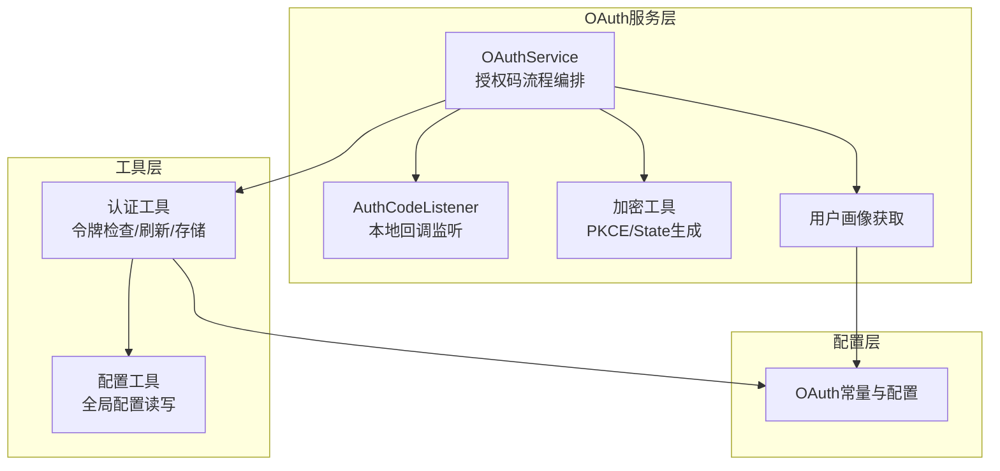
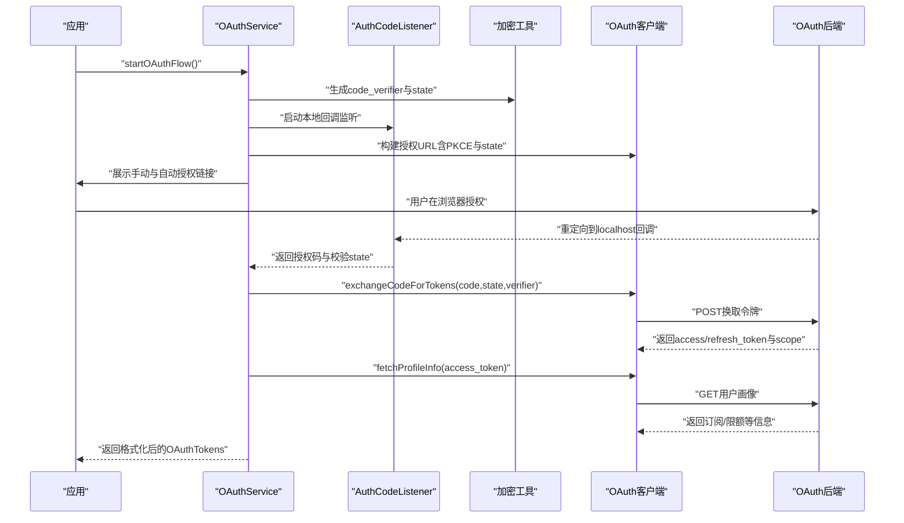
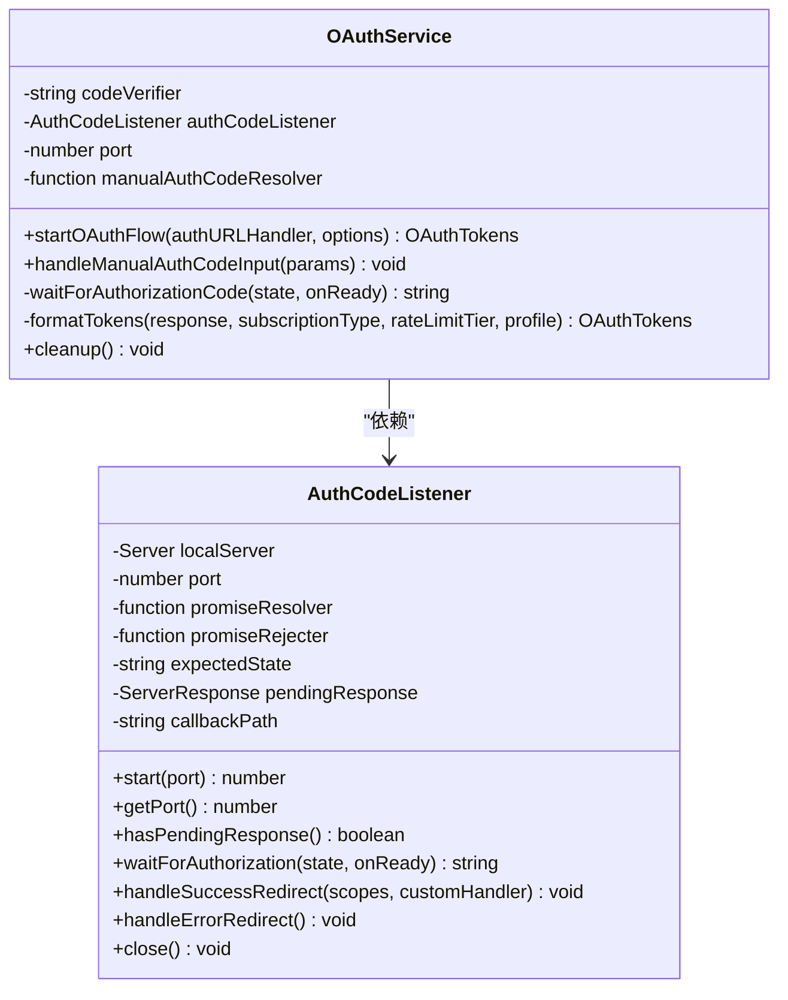
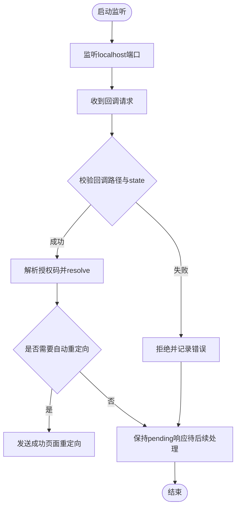
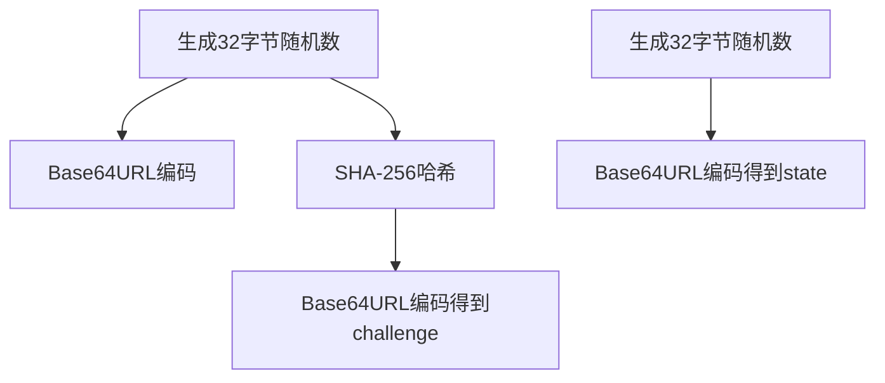
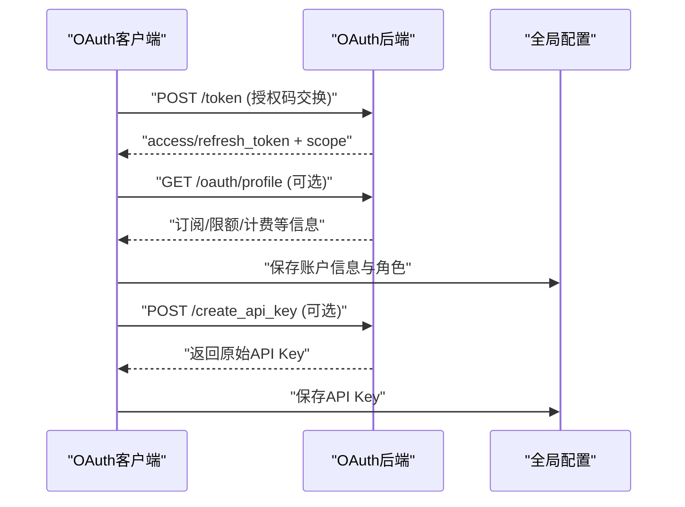
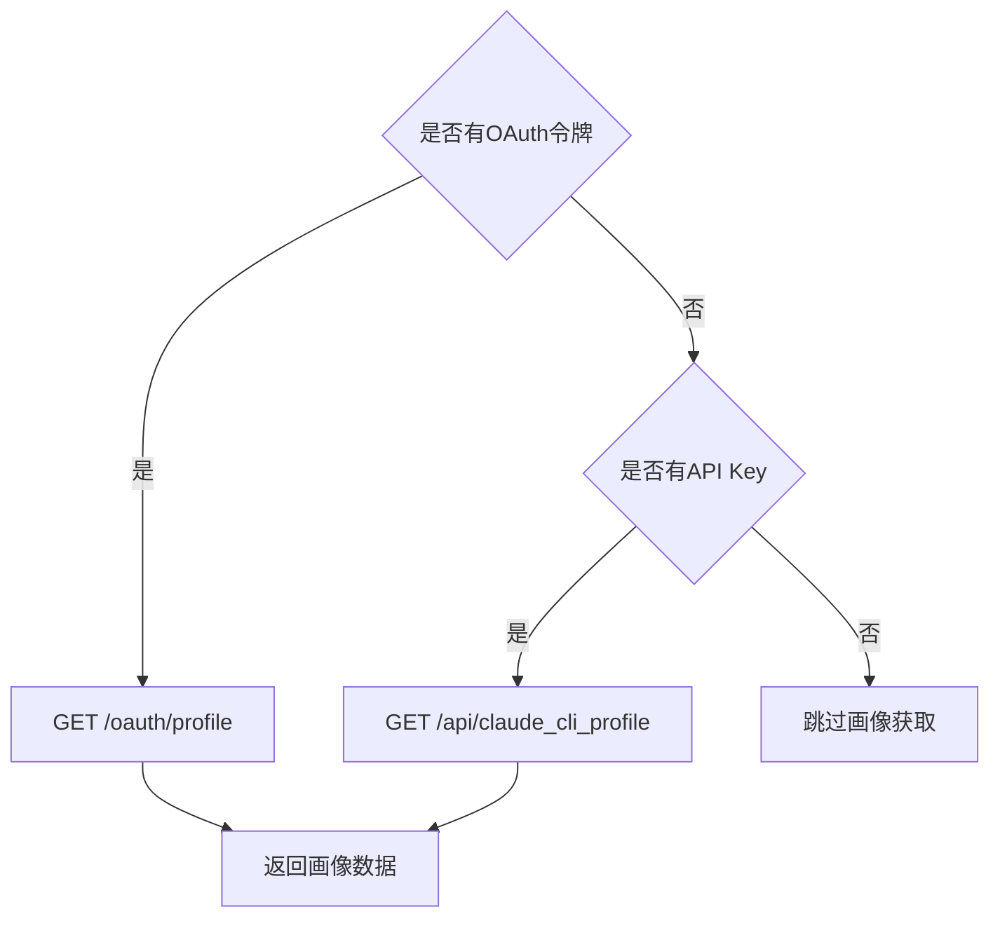
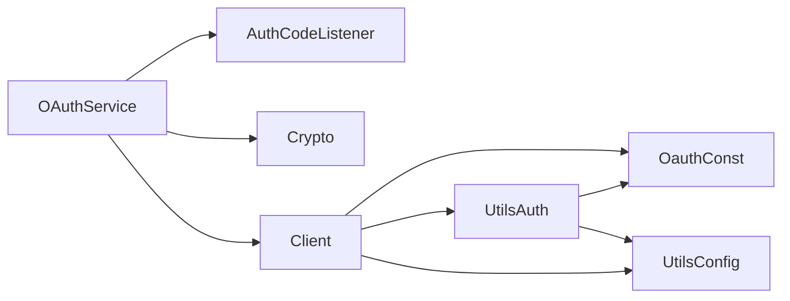

# OAuth认证服务

<cite>
**本文档引用的文件**
- [src/services/oauth/index.ts](file://src/services/oauth/index.ts)
- [src/services/oauth/client.ts](file://src/services/oauth/client.ts)
- [src/services/oauth/crypto.ts](file://src/services/oauth/crypto.ts)
- [src/services/oauth/auth-code-listener.ts](file://src/services/oauth/auth-code-listener.ts)
- [src/services/oauth/getOauthProfile.ts](file://src/services/oauth/getOauthProfile.ts)
- [src/constants/oauth.ts](file://src/constants/oauth.ts)
- [src/utils/auth.ts](file://src/utils/auth.ts)
- [src/utils/config.ts](file://src/utils/config.ts)
</cite>

## 目录
1. [简介](#简介)
2. [项目结构](#项目结构)
3. [核心组件](#核心组件)
4. [架构总览](#架构总览)
5. [详细组件分析](#详细组件分析)
6. [依赖关系分析](#依赖关系分析)
7. [性能考量](#性能考量)
8. [故障排查指南](#故障排查指南)
9. [结论](#结论)
10. [附录](#附录)

## 简介
本文件系统性阐述Claude Code的OAuth认证服务实现，覆盖授权码流程（含PKCE）、令牌刷新、用户信息获取、加密服务与密钥管理、认证码监听器工作机制、与用户管理系统的集成方式，以及配置指南与安全最佳实践。目标是帮助开发者在理解现有实现的基础上进行扩展或维护。

## 项目结构
OAuth相关代码主要位于src/services/oauth目录，配合src/constants/oauth.ts中的配置常量、src/utils/auth.ts中的认证工具函数、以及src/utils/config.ts中的全局配置存储。整体采用分层设计：配置层负责环境与部署差异；服务层封装OAuth流程；工具层提供加密与配置读写。

**图表来源**
- [src/services/oauth/index.ts:21-132](file://src/services/oauth/index.ts#L21-L132)
- [src/services/oauth/auth-code-listener.ts:18-52](file://src/services/oauth/auth-code-listener.ts#L18-L52)
- [src/services/oauth/crypto.ts:11-23](file://src/services/oauth/crypto.ts#L11-L23)
- [src/services/oauth/getOauthProfile.ts:37-53](file://src/services/oauth/getOauthProfile.ts#L37-L53)
- [src/constants/oauth.ts:186-234](file://src/constants/oauth.ts#L186-L234)
- [src/utils/auth.ts:23-28](file://src/utils/auth.ts#L23-L28)
- [src/utils/config.ts:161-174](file://src/utils/config.ts#L161-L174)

**章节来源**
- [src/services/oauth/index.ts:14-31](file://src/services/oauth/index.ts#L14-L31)
- [src/constants/oauth.ts:186-234](file://src/constants/oauth.ts#L186-L234)

## 核心组件
- OAuthService：封装完整的授权码流程（含PKCE），支持自动与手动两种授权码获取方式，负责令牌交换、用户画像拉取与结果格式化。
- AuthCodeListener：本地HTTP服务器，监听localhost回调，校验state参数并返回授权码。
- 加密工具（crypto）：生成PKCE的code_verifier、code_challenge与state，保证授权码流程安全性。
- OAuth客户端（client）：构建授权URL、交换授权码为令牌、刷新访问令牌、获取用户角色与API Key、查询订阅与限额等。
- 用户画像获取（getOauthProfile）：通过OAuth令牌或API Key获取用户账户与组织信息。
- 配置常量（constants/oauth）：根据环境变量选择生产/预发/本地配置，统一管理授权端点、令牌端点、客户端ID等。
- 认证工具（utils/auth）：提供令牌过期判断、刷新、与全局配置交互，以及OAuth账户信息缓存。
- 全局配置（utils/config）：定义AccountInfo结构与全局配置对象，承载OAuth账户信息与各类运行时状态。

**章节来源**
- [src/services/oauth/index.ts:21-198](file://src/services/oauth/index.ts#L21-L198)
- [src/services/oauth/auth-code-listener.ts:18-211](file://src/services/oauth/auth-code-listener.ts#L18-L211)
- [src/services/oauth/crypto.ts:11-23](file://src/services/oauth/crypto.ts#L11-L23)
- [src/services/oauth/client.ts:46-105](file://src/services/oauth/client.ts#L46-L105)
- [src/services/oauth/getOauthProfile.ts:37-53](file://src/services/oauth/getOauthProfile.ts#L37-L53)
- [src/constants/oauth.ts:60-104](file://src/constants/oauth.ts#L60-L104)
- [src/utils/auth.ts:23-28](file://src/utils/auth.ts#L23-L28)
- [src/utils/config.ts:161-174](file://src/utils/config.ts#L161-L174)

## 架构总览
OAuth认证服务采用“服务编排 + 本地回调监听 + 安全加密 + 配置驱动”的架构。OAuthService作为入口，协调AuthCodeListener与加密工具完成授权码流程；随后通过OAuth客户端与后端交互，完成令牌交换与用户画像获取；最终将结果写入全局配置，供后续调用使用。

**图表来源**
- [src/services/oauth/index.ts:32-132](file://src/services/oauth/index.ts#L32-L132)
- [src/services/oauth/auth-code-listener.ts:62-72](file://src/services/oauth/auth-code-listener.ts#L62-L72)
- [src/services/oauth/client.ts:107-144](file://src/services/oauth/client.ts#L107-L144)
- [src/services/oauth/getOauthProfile.ts:37-53](file://src/services/oauth/getOauthProfile.ts#L37-L53)

## 详细组件分析

### OAuthService：授权码流程编排
- 职责
  - 生成PKCE参数与state，构建授权URL。
  - 启动本地回调监听，等待授权码。
  - 交换授权码为令牌，拉取用户画像，格式化输出。
  - 自动/手动流程区分与成功/错误重定向。
- 关键流程
  - startOAuthFlow：初始化监听、生成PKCE与state、构建授权URL、等待授权码、交换令牌、获取画像、清理资源。
  - waitForAuthorizationCode：并发处理自动与手动输入，确保只响应一次授权码。
  - handleManualAuthCodeInput：接收用户手动粘贴的授权码并触发解析。
  - formatTokens：将后端返回的令牌数据转换为统一结构，包含订阅类型、速率等级、作用域与账户信息。
- 错误处理
  - 自动流程中出现异常时，发送错误重定向以结束浏览器流程。
  - 始终清理监听器，避免资源泄露。

**图表来源**
- [src/services/oauth/index.ts:21-198](file://src/services/oauth/index.ts#L21-L198)
- [src/services/oauth/auth-code-listener.ts:18-211](file://src/services/oauth/auth-code-listener.ts#L18-L211)

**章节来源**
- [src/services/oauth/index.ts:21-198](file://src/services/oauth/index.ts#L21-L198)

### AuthCodeListener：本地回调监听器
- 职责
  - 在localhost启动临时HTTP服务器，监听/oauth/callback路径。
  - 校验state参数防止CSRF攻击。
  - 将授权码传递给OAuthService，并在必要时发送成功/错误重定向。
- 关键点
  - 使用Promise异步等待授权码，避免阻塞。
  - 支持自定义回调路径，便于多实例或多场景复用。
  - 异常时记录日志并关闭服务器，确保资源回收。

**图表来源**
- [src/services/oauth/auth-code-listener.ts:125-175](file://src/services/oauth/auth-code-listener.ts#L125-L175)

**章节来源**
- [src/services/oauth/auth-code-listener.ts:18-211](file://src/services/oauth/auth-code-listener.ts#L18-L211)

### 加密服务：PKCE与State生成
- 职责
  - 生成安全的code_verifier（32字节随机数）。
  - 基于code_verifier生成SHA-256哈希并进行Base64URL编码得到code_challenge。
  - 生成随机state用于防CSRF。
- 安全性
  - 使用Node.js内置crypto模块，确保熵质量。
  - Base64URL编码避免URL不安全字符。

**图表来源**
- [src/services/oauth/crypto.ts:11-23](file://src/services/oauth/crypto.ts#L11-L23)

**章节来源**
- [src/services/oauth/crypto.ts:1-24](file://src/services/oauth/crypto.ts#L1-L24)

### OAuth客户端：令牌交换与用户画像
- 授权URL构建
  - 选择Console或Claude.ai授权端点，注入client_id、response_type、redirect_uri（自动/手动）、scope、PKCE与state。
  - 支持登录提示(login_hint)与特定登录方式(login_method)。
- 令牌交换
  - 使用authorization_code + code_verifier + state + redirect_uri向令牌端点发起POST请求。
  - 处理非200状态并记录事件。
- 刷新令牌
  - 使用refresh_token + scope向令牌端点发起POST请求。
  - 支持scope扩展，允许在刷新时扩大授权范围。
  - 智能跳过重复的用户画像拉取，减少API调用。
- 用户画像与角色
  - 通过Bearer令牌获取用户画像，解析订阅类型、速率等级、计费类型等。
  - 获取用户角色并写入全局配置。
- 组织UUID与账户信息
  - 提供从令牌解析组织UUID的能力，若无则回退到画像接口。
  - 将账户信息持久化至全局配置，支持环境变量覆盖。

**图表来源**
- [src/services/oauth/client.ts:107-144](file://src/services/oauth/client.ts#L107-L144)
- [src/services/oauth/client.ts:146-274](file://src/services/oauth/client.ts#L146-L274)
- [src/services/oauth/client.ts:355-420](file://src/services/oauth/client.ts#L355-L420)
- [src/services/oauth/client.ts:276-342](file://src/services/oauth/client.ts#L276-L342)

**章节来源**
- [src/services/oauth/client.ts:46-105](file://src/services/oauth/client.ts#L46-L105)
- [src/services/oauth/client.ts:107-144](file://src/services/oauth/client.ts#L107-L144)
- [src/services/oauth/client.ts:146-274](file://src/services/oauth/client.ts#L146-L274)
- [src/services/oauth/client.ts:276-342](file://src/services/oauth/client.ts#L276-L342)
- [src/services/oauth/client.ts:355-420](file://src/services/oauth/client.ts#L355-L420)
- [src/services/oauth/client.ts:426-445](file://src/services/oauth/client.ts#L426-L445)
- [src/services/oauth/client.ts:451-515](file://src/services/oauth/client.ts#L451-L515)
- [src/services/oauth/client.ts:517-566](file://src/services/oauth/client.ts#L517-L566)

### 用户画像获取：API Key与OAuth双通道
- 双通道策略
  - OAuth令牌通道：通过Authorization头访问/oauth/profile端点。
  - API Key通道：通过x-api-key头访问/api/claude_cli_profile端点，需提供account_uuid。
- 错误处理
  - 请求失败时记录日志，避免影响主流程。

**图表来源**
- [src/services/oauth/getOauthProfile.ts:37-53](file://src/services/oauth/getOauthProfile.ts#L37-L53)
- [src/services/oauth/getOauthProfile.ts:7-35](file://src/services/oauth/getOauthProfile.ts#L7-L35)

**章节来源**
- [src/services/oauth/getOauthProfile.ts:1-54](file://src/services/oauth/getOauthProfile.ts#L1-L54)

### 配置常量：环境与部署差异化
- 配置类型
  - 生产（prod）、预发（staging）、本地（local）三套配置，通过环境变量切换。
  - 支持自定义OAuth端点（仅限白名单域名）。
- 关键字段
  - 授权端点、令牌端点、API Key创建端点、角色查询端点、成功跳转页、手动回调地址、客户端ID、MCP代理URL等。
- 客户端ID元数据
  - 支持通过CIMD/SEP-991指定客户端元数据文档URL，避免动态客户端注册。

**章节来源**
- [src/constants/oauth.ts:18-31](file://src/constants/oauth.ts#L18-L31)
- [src/constants/oauth.ts:60-104](file://src/constants/oauth.ts#L60-L104)
- [src/constants/oauth.ts:116-143](file://src/constants/oauth.ts#L116-L143)
- [src/constants/oauth.ts:176-234](file://src/constants/oauth.ts#L176-L234)

### 与用户管理系统集成
- 账户信息结构
  - AccountInfo包含账户UUID、邮箱、组织UUID、显示名、额外用量、计费类型、账户与订阅创建时间等。
- 存储与更新
  - OAuthService与client在获取令牌后，会将订阅类型、速率等级、账户信息写入全局配置。
  - 支持环境变量直接注入账户信息，消除竞态并避免不必要的网络调用。
- 令牌刷新与一致性
  - 刷新流程中智能判断是否已具备足够的画像信息，避免重复拉取。
  - 在重新登录路径中，保留已有订阅类型与速率等级，防止因安全存储清空导致信息丢失。

**章节来源**
- [src/utils/config.ts:161-174](file://src/utils/config.ts#L161-L174)
- [src/services/oauth/client.ts:451-515](file://src/services/oauth/client.ts#L451-L515)
- [src/services/oauth/client.ts:190-240](file://src/services/oauth/client.ts#L190-L240)

## 依赖关系分析
- 组件耦合
  - OAuthService依赖AuthCodeListener与加密工具，耦合度低，职责清晰。
  - OAuth客户端与配置常量强相关，通过getOauthConfig集中管理端点与参数。
  - 认证工具与全局配置紧密协作，负责令牌生命周期与账户信息持久化。
- 外部依赖
  - HTTP客户端axios用于与OAuth后端通信。
  - Node.js内置crypto用于安全随机数与哈希计算。
  - 本地HTTP服务器用于捕获浏览器回调。

**图表来源**
- [src/services/oauth/index.ts:1-12](file://src/services/oauth/index.ts#L1-L12)
- [src/services/oauth/client.ts:1-23](file://src/services/oauth/client.ts#L1-L23)
- [src/constants/oauth.ts:186-234](file://src/constants/oauth.ts#L186-L234)
- [src/utils/auth.ts:1-28](file://src/utils/auth.ts#L1-L28)
- [src/utils/config.ts:161-174](file://src/utils/config.ts#L161-L174)

**章节来源**
- [src/services/oauth/index.ts:1-12](file://src/services/oauth/index.ts#L1-L12)
- [src/services/oauth/client.ts:1-23](file://src/services/oauth/client.ts#L1-L23)

## 性能考量
- 减少画像拉取次数
  - 刷新令牌时，若全局配置与安全存储中已有账户画像字段，则跳过额外的/profile轮询，降低每日请求量。
- 缓存与去重
  - 全局配置写入时进行内容比较，避免重复写入造成磁盘压力。
- 超时与重试
  - 令牌交换与画像获取设置合理超时，避免长时间阻塞。
- 并发控制
  - 手动输入与自动回调并发等待，但只接受一次授权码，避免重复处理。

[本节为通用性能讨论，无需具体文件分析]

## 故障排查指南
- 回调未到达
  - 检查AuthCodeListener是否成功绑定localhost端口，确认回调路径与端口一致。
  - 校验state参数是否匹配，不匹配会导致拒绝并记录错误。
- 令牌交换失败
  - 检查授权码是否有效、code_verifier是否正确、redirect_uri是否与授权时一致。
  - 查看后端返回状态码与错误信息，关注401无效授权码与非200响应。
- 画像获取失败
  - 确认Bearer令牌有效且具备user:profile作用域。
  - 若通过API Key通道，确认account_uuid与x-api-key正确。
- 刷新令牌异常
  - 检查refresh_token有效性与scope扩展是否符合后端策略。
  - 关注日志中的错误体，定位具体失败原因。
- 资源清理
  - 异常情况下确保AuthCodeListener被正确关闭，避免端口占用。

**章节来源**
- [src/services/oauth/auth-code-listener.ts:152-181](file://src/services/oauth/auth-code-listener.ts#L152-L181)
- [src/services/oauth/client.ts:135-143](file://src/services/oauth/client.ts#L135-L143)
- [src/services/oauth/client.ts:259-273](file://src/services/oauth/client.ts#L259-L273)

## 结论
该OAuth认证服务通过严谨的PKCE与state校验、本地回调监听、智能画像拉取与配置持久化，实现了安全、可靠的授权码流程。其模块化设计便于扩展与维护，同时通过配置常量与环境变量适配多环境部署。建议在生产环境中严格遵循安全最佳实践，确保令牌与回调的安全传输与存储。

[本节为总结性内容，无需具体文件分析]

## 附录

### OAuth认证配置指南
- 环境变量
  - USER_TYPE：控制是否启用本地/预发配置。
  - USE_LOCAL_OAUTH / USE_STAGING_OAUTH：强制本地/预发OAuth配置。
  - CLAUDE_CODE_CUSTOM_OAUTH_URL：自定义OAuth端点（仅白名单域名）。
  - CLAUDE_CODE_OAUTH_CLIENT_ID：覆盖默认客户端ID。
  - CLAUDE_LOCAL_OAUTH_*：本地开发环境端点覆盖。
- 配置选择逻辑
  - 默认生产配置；当USER_TYPE为ant时，优先检查USE_LOCAL_OAUTH与USE_STAGING_OAUTH；支持自定义端点与客户端ID覆盖。
- 作用域管理
  - 支持按需请求推理专用作用域或全集作用域，刷新时可扩展scope。

**章节来源**
- [src/constants/oauth.ts:6-31](file://src/constants/oauth.ts#L6-L31)
- [src/constants/oauth.ts:176-234](file://src/constants/oauth.ts#L176-L234)
- [src/services/oauth/client.ts:81-104](file://src/services/oauth/client.ts#L81-L104)

### 安全最佳实践
- 传输加密
  - OAuth后端端点均为HTTPS，确保令牌与回调在传输过程中的机密性与完整性。
- 令牌存储
  - 使用全局配置与安全存储结合的方式，避免明文泄露；在重新登录路径中保留已有订阅类型与速率等级，防止因安全存储清空导致信息丢失。
- 回调安全
  - 严格校验state参数，拒绝不匹配的回调；异常时发送错误重定向，确保浏览器流程正常结束。
- 密钥管理
  - code_verifier与state使用高熵随机数生成；避免在日志中打印敏感参数。
- 作用域最小化
  - 仅请求必要的作用域，减少权限暴露面；刷新时允许scope扩展，但应遵循后端策略。

**章节来源**
- [src/services/oauth/crypto.ts:11-23](file://src/services/oauth/crypto.ts#L11-L23)
- [src/services/oauth/auth-code-listener.ts:164-169](file://src/services/oauth/auth-code-listener.ts#L164-L169)
- [src/services/oauth/client.ts:154-162](file://src/services/oauth/client.ts#L154-L162)
- [src/services/oauth/client.ts:209-240](file://src/services/oauth/client.ts#L209-L240)