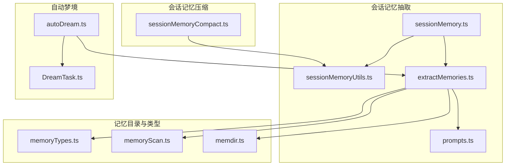
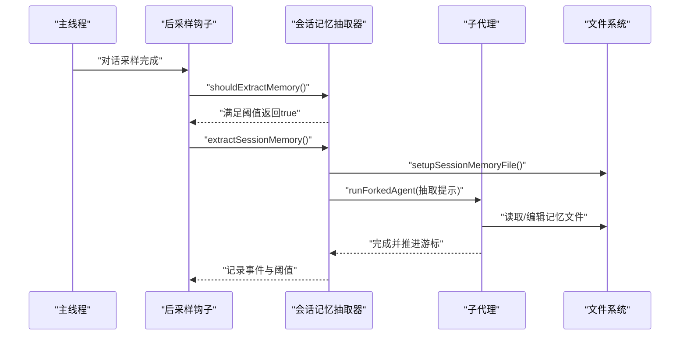
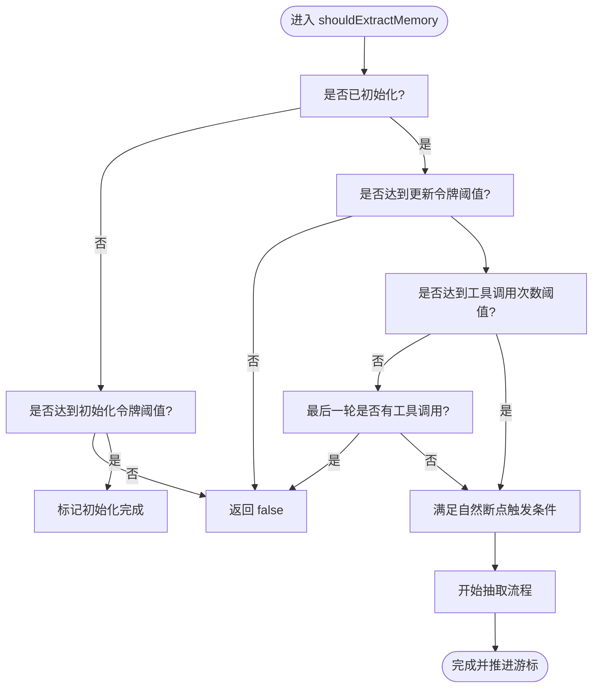
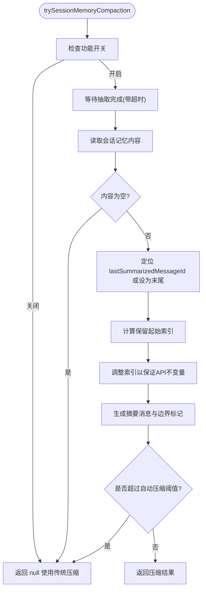
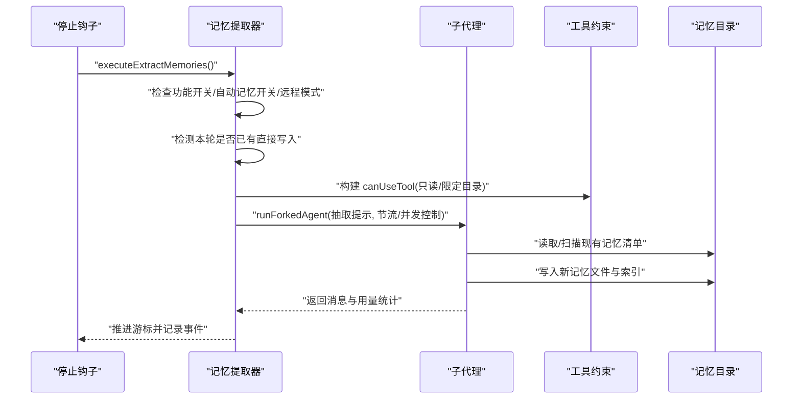
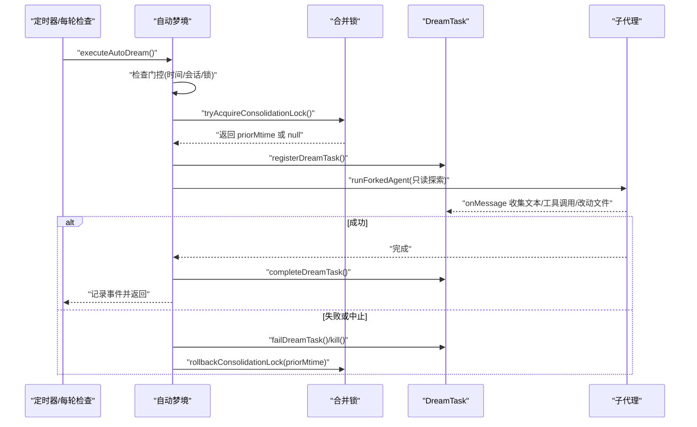
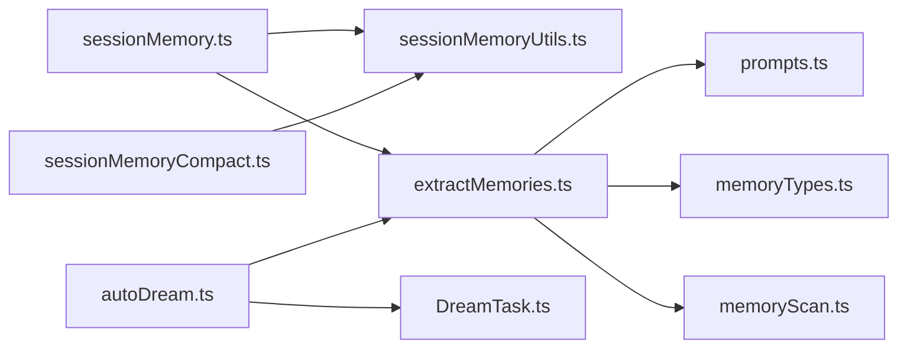

# 上下文管理服务

<cite>
**本文引用的文件**
- [src/services/SessionMemory/sessionMemory.ts](file://src/services/SessionMemory/sessionMemory.ts)
- [src/services/SessionMemory/sessionMemoryUtils.ts](file://src/services/SessionMemory/sessionMemoryUtils.ts)
- [src/services/compact/sessionMemoryCompact.ts](file://src/services/compact/sessionMemoryCompact.ts)
- [src/services/extractMemories/extractMemories.ts](file://src/services/extractMemories/extractMemories.ts)
- [src/services/extractMemories/prompts.ts](file://src/services/extractMemories/prompts.ts)
- [src/services/autoDream/autoDream.ts](file://src/services/autoDream/autoDream.ts)
- [src/services/autoDream/consolidationPrompt.ts/consolidationPrompt.ts](file://src/services/autoDream/consolidationPrompt.ts/consolidationPrompt.ts)
- [src/services/autoDream/consolidationLock.ts/consolidationLock.ts](file://src/services/autoDream/consolidationLock.ts/consolidationLock.ts)
- [src/memdir/memoryTypes.ts](file://src/memdir/memoryTypes.ts)
- [src/memdir/memoryScan.ts](file://src/memdir/memoryScan.ts)
- [src/memdir/memdir.ts](file://src/memdir/memdir.ts)
- [src/tasks/DreamTask/DreamTask.ts](file://src/tasks/DreamTask/DreamTask.ts)
- [src/utils/sessionStorage.ts](file://src/utils/sessionStorage.ts)
- [src/utils/hooks/sessionHooks.ts](file://src/utils/hooks/sessionHooks.ts)
- [src/assistant/sessionHistory.ts](file://src/assistant/sessionHistory.ts)
</cite>

## 目录
1. [简介](#简介)
2. [项目结构](#项目结构)
3. [核心组件](#核心组件)
4. [架构总览](#架构总览)
5. [详细组件分析](#详细组件分析)
6. [依赖关系分析](#依赖关系分析)
7. [性能考量](#性能考量)
8. [故障排查指南](#故障排查指南)
9. [结论](#结论)
10. [附录](#附录)

## 简介
本文件系统性梳理 Claude Code 的上下文管理服务，聚焦以下目标：
- 深入解释会话记忆（Session Memory）的自动抽取与压缩机制，包括阈值触发、时间基配置与分组策略。
- 描述会话记忆的存储结构、访问模式与清理机制。
- 阐述记忆提取服务的实现原理与提示工程策略。
- 说明自动梦境（AutoDream）服务的状态管理与任务调度机制。
- 提供性能优化技巧、内存使用建议、压缩效果评估与存储空间管理方法。

## 项目结构
上下文管理服务由三大子系统协同构成：
- 会话记忆抽取：在对话流中按阈值触发，后台抽取关键信息到本地持久化文件。
- 会话记忆压缩：基于抽取结果生成摘要，裁剪历史消息，维持上下文窗口。
- 自动梦境：周期性扫描会话，以只读探索方式整合知识，形成可回溯的记忆改进。

图表来源
- [src/services/SessionMemory/sessionMemory.ts:1-496](file://src/services/SessionMemory/sessionMemory.ts#L1-L496)
- [src/services/SessionMemory/sessionMemoryUtils.ts:1-177](file://src/services/SessionMemory/sessionMemoryUtils.ts#L1-L177)
- [src/services/extractMemories/extractMemories.ts:1-616](file://src/services/extractMemories/extractMemories.ts#L1-L616)
- [src/services/extractMemories/prompts.ts:73-137](file://src/services/extractMemories/prompts.ts#L73-L137)
- [src/services/compact/sessionMemoryCompact.ts:1-631](file://src/services/compact/sessionMemoryCompact.ts#L1-L631)
- [src/services/autoDream/autoDream.ts:1-325](file://src/services/autoDream/autoDream.ts#L1-L325)
- [src/tasks/DreamTask/DreamTask.ts:25-157](file://src/tasks/DreamTask/DreamTask.ts#L25-L157)
- [src/memdir/memoryTypes.ts:1-272](file://src/memdir/memoryTypes.ts#L1-L272)
- [src/memdir/memoryScan.ts:45-94](file://src/memdir/memoryScan.ts#L45-L94)
- [src/memdir/memdir.ts:236-255](file://src/memdir/memdir.ts#L236-L255)

章节来源
- [src/services/SessionMemory/sessionMemory.ts:1-496](file://src/services/SessionMemory/sessionMemory.ts#L1-L496)
- [src/services/extractMemories/extractMemories.ts:1-616](file://src/services/extractMemories/extractMemories.ts#L1-L616)
- [src/services/compact/sessionMemoryCompact.ts:1-631](file://src/services/compact/sessionMemoryCompact.ts#L1-L631)
- [src/services/autoDream/autoDream.ts:1-325](file://src/services/autoDream/autoDream.ts#L1-L325)

## 核心组件
- 会话记忆抽取器：在采样后钩子中按阈值触发，使用派生子代理运行抽取逻辑，避免污染主状态缓存，并将结果写入专用记忆文件。
- 会话记忆压缩器：基于抽取结果与最小保留策略，计算需要保留的消息边界，生成摘要消息并插入边界标记，确保工具调用配对不被切分。
- 记忆提取服务：在查询循环结束时，通过停止钩子触发，构建抽取提示，限制工具权限，最多执行若干轮次，完成后推进游标并记录统计。
- 自动梦境服务：周期性检查时间与会话数量门槛，尝试获取合并锁，注册任务并在后台运行子代理进行只读探索与改进，支持中止与回滚。
- 记忆类型与索引：定义四类记忆类型、索引清单格式、扫描与清单展示逻辑，以及记忆目录的使用规范与提示工程。

章节来源
- [src/services/SessionMemory/sessionMemory.ts:134-181](file://src/services/SessionMemory/sessionMemory.ts#L134-L181)
- [src/services/compact/sessionMemoryCompact.ts:316-397](file://src/services/compact/sessionMemoryCompact.ts#L316-L397)
- [src/services/extractMemories/extractMemories.ts:329-523](file://src/services/extractMemories/extractMemories.ts#L329-L523)
- [src/services/autoDream/autoDream.ts:122-273](file://src/services/autoDream/autoDream.ts#L122-L273)
- [src/memdir/memoryTypes.ts:14-106](file://src/memdir/memoryTypes.ts#L14-L106)

## 架构总览
上下文管理服务采用“抽取-压缩-合并”的流水线式架构：
- 抽取阶段：在主线程的后采样钩子中判断阈值，若满足则启动后台子代理，构建抽取提示，调用受限工具读写记忆目录。
- 压缩阶段：当上下文增长超过阈值或达到工具调用次数阈值时，基于抽取结果生成摘要消息，保留必要的文本块与工具调用配对，插入边界标记。
- 合并阶段：自动梦境在满足时间与会话数门槛时，尝试获取合并锁，注册任务，运行子代理进行只读探索，收集改动路径并更新任务状态。

图表来源
- [src/services/SessionMemory/sessionMemory.ts:134-181](file://src/services/SessionMemory/sessionMemory.ts#L134-L181)
- [src/services/SessionMemory/sessionMemory.ts:272-350](file://src/services/SessionMemory/sessionMemory.ts#L272-L350)

章节来源
- [src/services/SessionMemory/sessionMemory.ts:134-181](file://src/services/SessionMemory/sessionMemory.ts#L134-L181)
- [src/services/SessionMemory/sessionMemory.ts:272-350](file://src/services/SessionMemory/sessionMemory.ts#L272-L350)

## 详细组件分析

### 会话记忆抽取器（自动压缩与阈值）
- 触发条件
  - 初始化阈值：当前上下文窗口令牌数达到最小初始化令牌数。
  - 更新阈值：自上次抽取以来上下文增长令牌数达到最小更新令牌数。
  - 工具调用阈值：自上次抽取以来工具调用次数达到设定值。
  - 最后一轮无工具调用：在自然对话断点处也可触发抽取。
- 并发与等待
  - 使用等待函数避免并发抽取；若抽取过旧则直接返回。
  - 抽取完成后记录当前令牌计数，推进最后抽取位置。
- 文件与权限
  - 仅允许对记忆文件执行编辑；其他工具调用一律拒绝。
  - 读取记忆文件时清空读缓存，确保读到最新内容。
- 统计与日志
  - 记录抽取事件，包含输入/输出令牌、缓存命中等指标。

图表来源
- [src/services/SessionMemory/sessionMemory.ts:134-181](file://src/services/SessionMemory/sessionMemory.ts#L134-L181)
- [src/services/SessionMemory/sessionMemoryUtils.ts:89-105](file://src/services/SessionMemory/sessionMemoryUtils.ts#L89-L105)

章节来源
- [src/services/SessionMemory/sessionMemory.ts:134-181](file://src/services/SessionMemory/sessionMemory.ts#L134-L181)
- [src/services/SessionMemory/sessionMemoryUtils.ts:18-29](file://src/services/SessionMemory/sessionMemoryUtils.ts#L18-L29)
- [src/services/SessionMemory/sessionMemoryUtils.ts:89-105](file://src/services/SessionMemory/sessionMemoryUtils.ts#L89-L105)

### 会话记忆压缩器（自动压缩）
- 目标
  - 在保持工具调用配对与思考块合并的前提下，尽可能保留文本块消息，同时不超过最大令牌上限。
- 边界选择
  - 从上次摘要消息之后开始，向前扩展直到满足最小令牌数与最小文本块消息数，或达到最大令牌上限。
  - 对工具调用与工具结果进行一致性校验，必要时回溯调整起始索引。
- 摘要生成
  - 截断过长的会话记忆片段，生成用户可见的摘要消息并插入边界标记。
- 与自动压缩的协作
  - 当阈值未达时，优先使用传统压缩；当阈值达标时，使用会话记忆摘要作为压缩结果。

图表来源
- [src/services/compact/sessionMemoryCompact.ts:514-631](file://src/services/compact/sessionMemoryCompact.ts#L514-L631)
- [src/services/compact/sessionMemoryCompact.ts:316-397](file://src/services/compact/sessionMemoryCompact.ts#L316-L397)

章节来源
- [src/services/compact/sessionMemoryCompact.ts:434-432](file://src/services/compact/sessionMemoryCompact.ts#L434-L432)
- [src/services/compact/sessionMemoryCompact.ts:514-631](file://src/services/compact/sessionMemoryCompact.ts#L514-L631)

### 记忆提取服务（提示工程与工具约束）
- 触发时机
  - 查询循环结束且最后一轮无工具调用时，通过停止钩子触发。
- 提示工程
  - 根据是否启用团队记忆，构建单独或组合的抽取提示，包含记忆类型说明、保存规则、索引维护指引与回溯注意事项。
- 工具约束
  - 允许只读文件操作与只读 Shell 命令；仅允许在记忆目录内执行编辑/写入。
  - 若主代理已在本轮写入记忆，则跳过子代理抽取，推进游标。
- 并发与节流
  - 使用集合跟踪进行中的抽取，重复调用时合并为尾随运行；按回合节流参数控制抽取频率。
- 结果反馈
  - 成功时向系统消息注入“保存了 N 条记忆”的提示；失败记录事件但不中断主流程。

图表来源
- [src/services/extractMemories/extractMemories.ts:598-616](file://src/services/extractMemories/extractMemories.ts#L598-L616)
- [src/services/extractMemories/extractMemories.ts:329-523](file://src/services/extractMemories/extractMemories.ts#L329-L523)
- [src/services/extractMemories/prompts.ts:73-137](file://src/services/extractMemories/prompts.ts#L73-L137)

章节来源
- [src/services/extractMemories/extractMemories.ts:598-616](file://src/services/extractMemories/extractMemories.ts#L598-L616)
- [src/services/extractMemories/extractMemories.ts:329-523](file://src/services/extractMemories/extractMemories.ts#L329-L523)
- [src/services/extractMemories/prompts.ts:73-137](file://src/services/extractMemories/prompts.ts#L73-L137)

### 自动梦境服务（状态管理与任务调度）
- 门控与配置
  - 时间门：自上次合并时间以来的小时数达到最小小时数。
  - 会话门：自上次合并以来有足够数量的会话被修改。
  - 锁门：尝试获取合并锁，避免并发冲突。
- 任务生命周期
  - 注册 DreamTask，设置阶段、观察会话数、收集改动文件路径。
  - 子代理运行期间，逐条消息解析文本与工具调用计数，记录“转”（turn）与改动文件列表。
  - 完成后注入系统消息总结，失败时中止并回滚锁。
- 中止与回滚
  - 用户中止时，清理 AbortController，回滚合并锁时间戳，以便下次重试。

图表来源
- [src/services/autoDream/autoDream.ts:122-273](file://src/services/autoDream/autoDream.ts#L122-L273)
- [src/tasks/DreamTask/DreamTask.ts:52-157](file://src/tasks/DreamTask/DreamTask.ts#L52-L157)

章节来源
- [src/services/autoDream/autoDream.ts:122-273](file://src/services/autoDream/autoDream.ts#L122-L273)
- [src/tasks/DreamTask/DreamTask.ts:25-157](file://src/tasks/DreamTask/DreamTask.ts#L25-L157)

### 记忆类型与索引（存储结构与访问模式）
- 类型体系
  - 四类记忆类型：user、feedback、project、reference；每类包含适用范围、何时保存、如何使用与结构示例。
- 目录与索引
  - 记忆目录包含每个类型的独立索引文件（如 MEMORY.md），用于加载到系统提示中。
  - 扫描逻辑读取前若干行的 frontmatter，提取类型、描述与修改时间，排序并截断至最大文件数。
- 访问与清理
  - 提示工程强调“记忆可能漂移”，建议在引用前验证当前状态；支持显式忽略记忆。
  - 清理与去重：避免重复记忆，及时更新或删除过时内容。

章节来源
- [src/memdir/memoryTypes.ts:14-106](file://src/memdir/memoryTypes.ts#L14-L106)
- [src/memdir/memoryScan.ts:45-94](file://src/memdir/memoryScan.ts#L45-L94)
- [src/memdir/memdir.ts:236-255](file://src/memdir/memdir.ts#L236-L255)

## 依赖关系分析
- 组件耦合
  - 会话记忆抽取器依赖抽取工具与文件系统权限控制，避免越权写入。
  - 压缩器依赖抽取器的游标与内容，确保摘要与保留段落一致。
  - 自动梦境依赖抽取器的工具约束与任务系统，实现只读探索与状态回滚。
- 外部依赖
  - 提示工程模块提供抽取与合并提示模板。
  - 任务系统提供任务注册、状态更新与中止能力。
  - 文件系统与会话存储提供读取/写入与消息缓存清理。

图表来源
- [src/services/SessionMemory/sessionMemory.ts:1-496](file://src/services/SessionMemory/sessionMemory.ts#L1-L496)
- [src/services/SessionMemory/sessionMemoryUtils.ts:1-177](file://src/services/SessionMemory/sessionMemoryUtils.ts#L1-L177)
- [src/services/extractMemories/extractMemories.ts:1-616](file://src/services/extractMemories/extractMemories.ts#L1-L616)
- [src/services/extractMemories/prompts.ts:73-137](file://src/services/extractMemories/prompts.ts#L73-L137)
- [src/services/compact/sessionMemoryCompact.ts:1-631](file://src/services/compact/sessionMemoryCompact.ts#L1-L631)
- [src/services/autoDream/autoDream.ts:1-325](file://src/services/autoDream/autoDream.ts#L1-L325)
- [src/tasks/DreamTask/DreamTask.ts:25-157](file://src/tasks/DreamTask/DreamTask.ts#L25-L157)
- [src/memdir/memoryTypes.ts:1-272](file://src/memdir/memoryTypes.ts#L1-L272)
- [src/memdir/memoryScan.ts:45-94](file://src/memdir/memoryScan.ts#L45-L94)

章节来源
- [src/services/SessionMemory/sessionMemory.ts:1-496](file://src/services/SessionMemory/sessionMemory.ts#L1-L496)
- [src/services/extractMemories/extractMemories.ts:1-616](file://src/services/extractMemories/extractMemories.ts#L1-L616)
- [src/services/compact/sessionMemoryCompact.ts:1-631](file://src/services/compact/sessionMemoryCompact.ts#L1-L631)
- [src/services/autoDream/autoDream.ts:1-325](file://src/services/autoDream/autoDream.ts#L1-L325)

## 性能考量
- 缓存与并发
  - 抽取与压缩均采用“派生子代理 + 缓存安全参数”的模式，避免污染主状态缓存，提升缓存命中率。
  - 抽取器对进行中的抽取进行合并，减少重复开销；压缩器等待抽取完成，避免竞态。
- 阈值设计
  - 初始化阈值与更新阈值使用相同的令牌度量，确保抽取与压缩行为一致。
  - 工具调用次数阈值与“最后一轮无工具调用”的自然断点结合，平衡抽取频率与上下文增长。
- I/O 与文件系统
  - 读取记忆文件前清空读缓存，确保一致性；写入时使用最小权限工具，降低错误风险。
  - 自动梦境使用只读 Shell 命令与受限编辑权限，避免不必要的磁盘变更。
- 存储空间管理
  - 压缩器对过长的记忆片段进行截断，并在摘要中提示完整路径，避免占用过多令牌预算。
  - 记忆扫描限制最大文件数，索引保持简洁，避免系统提示过长导致截断。

章节来源
- [src/services/SessionMemory/sessionMemory.ts:318-325](file://src/services/SessionMemory/sessionMemory.ts#L318-L325)
- [src/services/SessionMemory/sessionMemory.ts:343-349](file://src/services/SessionMemory/sessionMemory.ts#L343-L349)
- [src/services/compact/sessionMemoryCompact.ts:459-474](file://src/services/compact/sessionMemoryCompact.ts#L459-L474)
- [src/services/autoDream/autoDream.ts:216-222](file://src/services/autoDream/autoDream.ts#L216-L222)

## 故障排查指南
- 抽取未触发
  - 检查功能开关与远程模式；确认初始化与更新阈值是否满足；查看最后一次助手轮次是否存在工具调用。
- 抽取并发问题
  - 观察“抽取进行中”合并逻辑；若频繁合并，适当提高工具调用阈值或回合节流参数。
- 压缩失败
  - 查看“摘要 ID 未找到”或“内容为空模板”等事件日志；确认抽取已完成且内容非模板。
  - 检查工具调用配对是否被切分，必要时放宽最小文本块消息数或提高最小令牌数。
- 自动梦境失败
  - 检查合并锁获取失败与回滚日志；确认时间门与会话门是否满足；查看中止信号是否触发。
- 记忆目录异常
  - 确认只读工具与目录权限；检查索引文件格式与 frontmatter；验证“忽略记忆”的用户指令是否正确处理。

章节来源
- [src/services/SessionMemory/sessionMemory.ts:284-291](file://src/services/SessionMemory/sessionMemory.ts#L284-L291)
- [src/services/compact/sessionMemoryCompact.ts:534-543](file://src/services/compact/sessionMemoryCompact.ts#L534-L543)
- [src/services/autoDream/autoDream.ts:177-190](file://src/services/autoDream/autoDream.ts#L177-L190)
- [src/services/extractMemories/extractMemories.ts:154-164](file://src/services/extractMemories/extractMemories.ts#L154-L164)

## 结论
上下文管理服务通过“抽取—压缩—合并”的闭环，实现了对会话记忆的自动化维护与高效利用。其关键在于：
- 明确的阈值与门控机制，确保抽取与压缩的时机合理；
- 严格的工具权限与文件系统隔离，保障安全性；
- 任务系统与状态回滚，提升可靠性；
- 提示工程与类型体系，提升记忆质量与可维护性。

## 附录
- 会话历史接口：提供会话事件分页拉取能力，便于外部集成与诊断。
- 会话存储缓存：提供消息 UUID 缓存与清理接口，配合压缩流程使用。

章节来源
- [src/assistant/sessionHistory.ts:1-88](file://src/assistant/sessionHistory.ts#L1-L88)
- [src/utils/sessionStorage.ts:3838-3867](file://src/utils/sessionStorage.ts#L3838-L3867)
- [src/utils/hooks/sessionHooks.ts:437-447](file://src/utils/hooks/sessionHooks.ts#L437-L447)