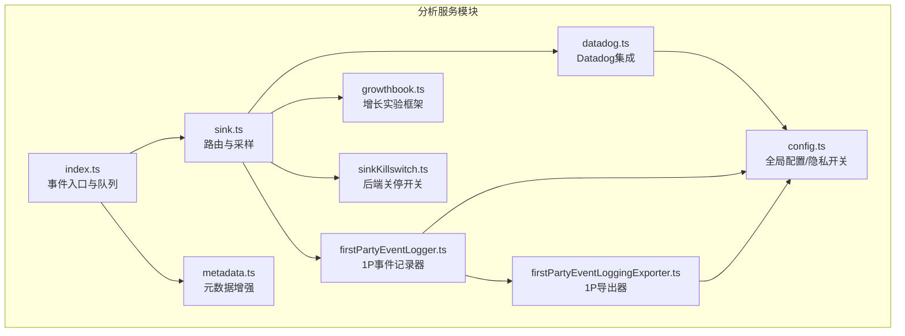
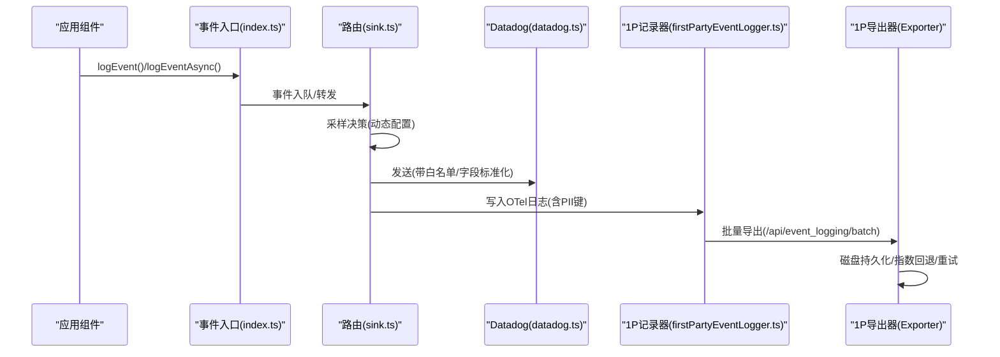
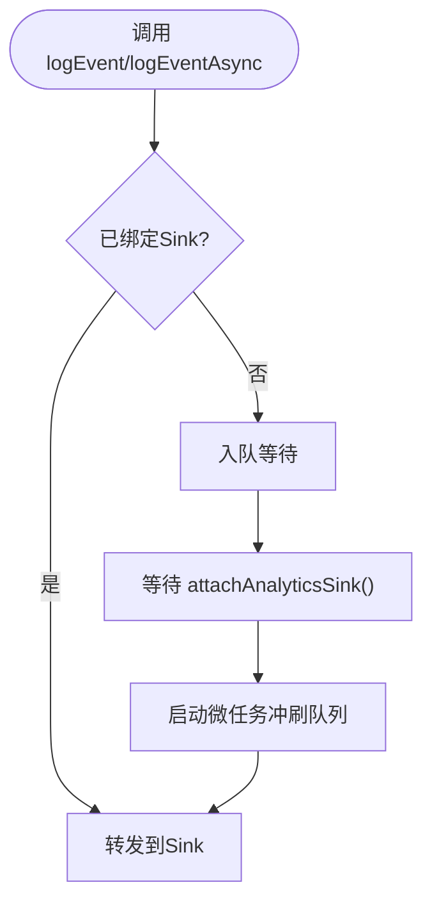
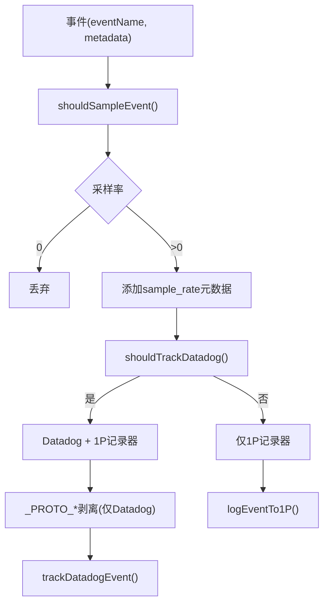
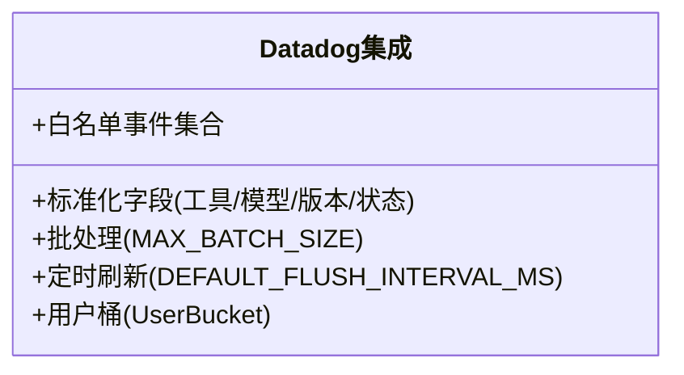
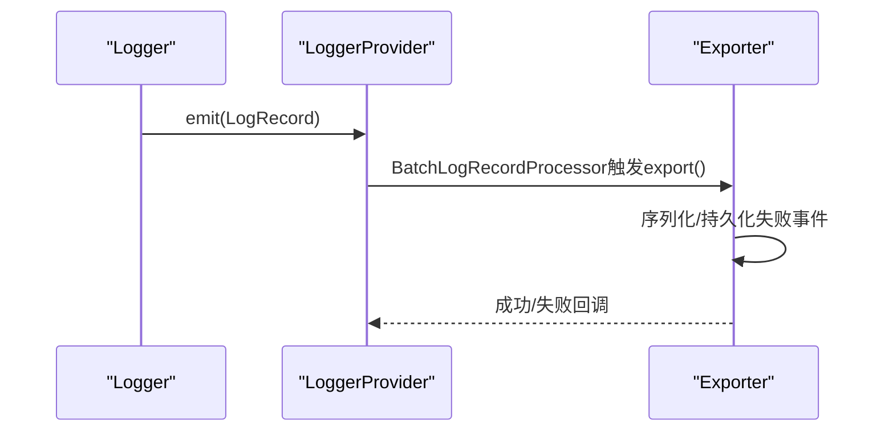
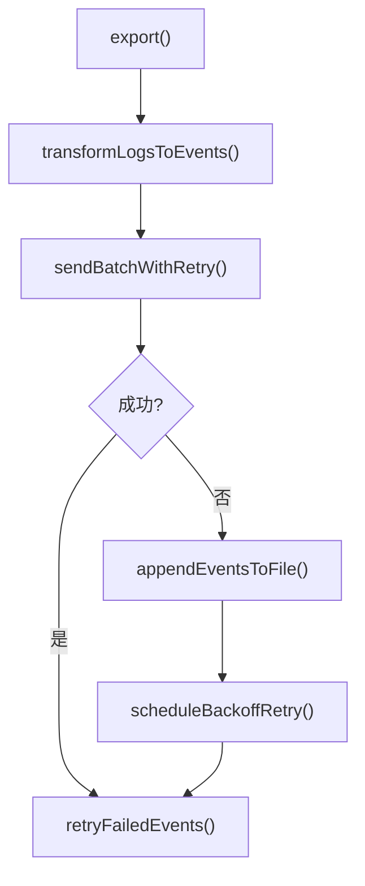
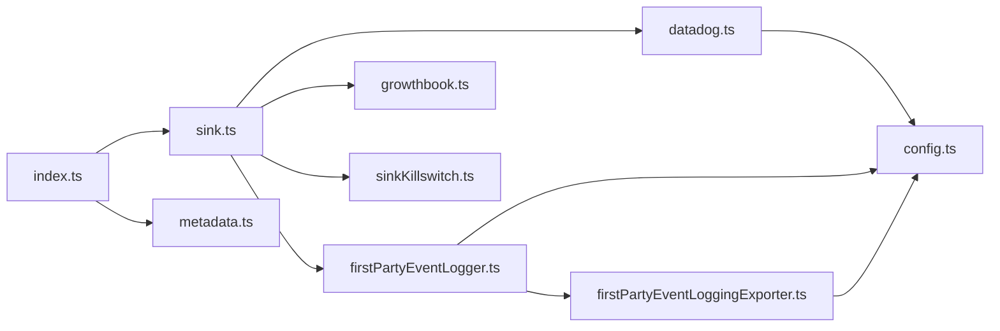

# 分析跟踪服务

<cite>
**本文档引用的文件**
- [src/services/analytics/index.ts](file://src/services/analytics/index.ts)
- [src/services/analytics/sink.ts](file://src/services/analytics/sink.ts)
- [src/services/analytics/datadog.ts](file://src/services/analytics/datadog.ts)
- [src/services/analytics/firstPartyEventLogger.ts](file://src/services/analytics/firstPartyEventLogger.ts)
- [src/services/analytics/firstPartyEventLoggingExporter.ts](file://src/services/analytics/firstPartyEventLoggingExporter.ts)
- [src/services/analytics/metadata.ts](file://src/services/analytics/metadata.ts)
- [src/services/analytics/growthbook.ts](file://src/services/analytics/growthbook.ts)
- [src/services/analytics/sinkKillswitch.ts](file://src/services/analytics/sinkKillswitch.ts)
- [src/services/analytics/config.ts](file://src/services/analytics/config.ts)
- [src/services/api/grove.ts](file://src/services/api/grove.ts)
- [src/commands/privacy-settings/privacy-settings.tsx](file://src/commands/privacy-settings/privacy-settings.tsx)
- [docs/en/01-telemetry-and-privacy.md](file://docs/en/01-telemetry-and-privacy.md)
</cite>

## 目录
1. [简介](#简介)
2. [项目结构](#项目结构)
3. [核心组件](#核心组件)
4. [架构总览](#架构总览)
5. [详细组件分析](#详细组件分析)
6. [依赖关系分析](#依赖关系分析)
7. [性能考量](#性能考量)
8. [故障排查指南](#故障排查指南)
9. [结论](#结论)
10. [附录](#附录)

## 简介
本文件面向Claude Code的分析跟踪服务，系统性阐述其整体架构与数据收集机制，覆盖事件日志记录、遥测数据传输与用户行为分析。重点包括：
- 双通道分析管道：第一方事件记录器（内部使用）与Datadog集成（第三方）
- 增长实验框架（GrowthBook）与动态配置门控
- 隐私保护与数据匿名化策略
- 数据存储格式、传输协议与实时处理机制
- 配置选项与自定义指标设置方法

## 项目结构
分析相关代码集中于src/services/analytics目录，围绕“事件入口”“路由分发”“后端导出”“元数据增强”“动态配置”“隐私控制”六大模块构建。

图表来源
- [src/services/analytics/index.ts:1-174](file://src/services/analytics/index.ts#L1-L174)
- [src/services/analytics/sink.ts:1-115](file://src/services/analytics/sink.ts#L1-L115)
- [src/services/analytics/datadog.ts:1-308](file://src/services/analytics/datadog.ts#L1-L308)
- [src/services/analytics/firstPartyEventLogger.ts:1-450](file://src/services/analytics/firstPartyEventLogger.ts#L1-L450)
- [src/services/analytics/firstPartyEventLoggingExporter.ts:1-807](file://src/services/analytics/firstPartyEventLoggingExporter.ts#L1-L807)
- [src/services/analytics/metadata.ts:1-974](file://src/services/analytics/metadata.ts#L1-L974)
- [src/services/analytics/growthbook.ts:1-1156](file://src/services/analytics/growthbook.ts#L1-L1156)
- [src/services/analytics/sinkKillswitch.ts:1-26](file://src/services/analytics/sinkKillswitch.ts#L1-L26)
- [src/services/analytics/config.ts:1-39](file://src/services/analytics/config.ts#L1-L39)

章节来源
- [src/services/analytics/index.ts:1-174](file://src/services/analytics/index.ts#L1-L174)
- [src/services/analytics/sink.ts:1-115](file://src/services/analytics/sink.ts#L1-L115)

## 核心组件
- 事件入口与队列：在未初始化分析管道时，事件被入队并延迟到管道就绪后再批量投递，避免阻塞启动路径。
- 路由与采样：根据动态配置对事件进行采样，并按门控决定是否发送至Datadog或1P事件记录器。
- Datadog集成：限定事件白名单、标准化字段、批处理与定时刷新、错误回退。
- 第一方事件记录器：基于OpenTelemetry SDK，独立的LoggerProvider与Exporter，支持磁盘持久化重试与二次认证降级。
- 元数据增强：统一采集环境指纹、进程指标、会话上下文、订阅信息、仓库指纹等。
- 动态配置与关停：通过GrowthBook下发门控与配置，支持运行时热更新与关停。
- 隐私与安全：类型标记防止敏感字符串进入日志；PII字段以专用键名传递，经导出器拆分到特权列；工具输入默认截断。

章节来源
- [src/services/analytics/index.ts:125-174](file://src/services/analytics/index.ts#L125-L174)
- [src/services/analytics/sink.ts:45-86](file://src/services/analytics/sink.ts#L45-L86)
- [src/services/analytics/datadog.ts:19-64](file://src/services/analytics/datadog.ts#L19-L64)
- [src/services/analytics/firstPartyEventLogger.ts:57-85](file://src/services/analytics/firstPartyEventLogger.ts#L57-L85)
- [src/services/analytics/metadata.ts:417-496](file://src/services/analytics/metadata.ts#L417-L496)
- [src/services/analytics/growthbook.ts:139-157](file://src/services/analytics/growthbook.ts#L139-L157)
- [src/services/analytics/sinkKillswitch.ts:18-25](file://src/services/analytics/sinkKillswitch.ts#L18-L25)

## 架构总览
双通道架构：事件同时写入Datadog与1P事件记录器，前者用于通用访问，后者用于内部特权列与BigQuery直连。

图表来源
- [src/services/analytics/index.ts:133-164](file://src/services/analytics/index.ts#L133-L164)
- [src/services/analytics/sink.ts:48-86](file://src/services/analytics/sink.ts#L48-L86)
- [src/services/analytics/datadog.ts:160-279](file://src/services/analytics/datadog.ts#L160-L279)
- [src/services/analytics/firstPartyEventLogger.ts:156-230](file://src/services/analytics/firstPartyEventLogger.ts#L156-L230)
- [src/services/analytics/firstPartyEventLoggingExporter.ts:277-377](file://src/services/analytics/firstPartyEventLoggingExporter.ts#L277-L377)

## 详细组件分析

### 事件入口与队列（index.ts）
- 设计要点：无依赖、零耦合，事件先入队，待attachAnalyticsSink()后异步冲刷。
- 关键能力：同步/异步事件接口、队列大小上报（Ant用户）、幂等绑定。

图表来源
- [src/services/analytics/index.ts:95-123](file://src/services/analytics/index.ts#L95-L123)

章节来源
- [src/services/analytics/index.ts:1-174](file://src/services/analytics/index.ts#L1-L174)

### 路由与采样（sink.ts）
- 采样：基于动态配置tengu_event_sampling_config，按事件类型随机采样，采样率写入元数据。
- 门控：Datadog事件门控tengu_log_datadog_events，支持缓存值回退。
- 安全：向Datadog发送前剥离_PII_*键，仅1P导出器保留并映射到特权列。

图表来源
- [src/services/analytics/sink.ts:48-86](file://src/services/analytics/sink.ts#L48-L86)
- [src/services/analytics/firstPartyEventLogger.ts:57-85](file://src/services/analytics/firstPartyEventLogger.ts#L57-L85)
- [src/services/analytics/index.ts:45-58](file://src/services/analytics/index.ts#L45-L58)

章节来源
- [src/services/analytics/sink.ts:1-115](file://src/services/analytics/sink.ts#L1-L115)

### Datadog集成（datadog.ts）
- 白名单事件：限定64个事件类型，避免无关数据外泄。
- 字段标准化：工具名归一化、模型名归一化、版本号归一化、状态码转http_status与范围标签。
- 批处理与刷新：最大批次100条，定时刷新，网络超时5秒。
- 用户桶：对用户ID做哈希分桶，用于影响用户数估算而非泄露真实ID。

图表来源
- [src/services/analytics/datadog.ts:19-64](file://src/services/analytics/datadog.ts#L19-L64)
- [src/services/analytics/datadog.ts:182-279](file://src/services/analytics/datadog.ts#L182-L279)
- [src/services/analytics/datadog.ts:281-308](file://src/services/analytics/datadog.ts#L281-L308)

章节来源
- [src/services/analytics/datadog.ts:1-308](file://src/services/analytics/datadog.ts#L1-L308)

### 第一方事件记录器（firstPartyEventLogger.ts）
- 独立OTel Provider：与客户遥测分离，避免数据交叉。
- 批处理配置：scheduledDelayMillis、maxExportBatchSize、maxQueueSize可由动态配置驱动。
- 采样：同上，按事件类型采样，减少噪声。
- 生命周期：支持运行时重新初始化（配置变更时），保证事件不丢失。

图表来源
- [src/services/analytics/firstPartyEventLogger.ts:312-389](file://src/services/analytics/firstPartyEventLogger.ts#L312-L389)
- [src/services/analytics/firstPartyEventLoggingExporter.ts:277-377](file://src/services/analytics/firstPartyEventLoggingExporter.ts#L277-L377)

章节来源
- [src/services/analytics/firstPartyEventLogger.ts:1-450](file://src/services/analytics/firstPartyEventLogger.ts#L1-L450)

### 1P事件导出器（firstPartyEventLoggingExporter.ts）
- 协议与端点：OpenTelemetry + Protocol Buffers，目标端点/api/event_logging/batch。
- 指数回退：基础延迟随尝试次数平方增长，最多8次。
- 磁盘持久化：失败事件写入~/.claude/telemetry/，重启自动重试。
- 认证降级：OAuth令牌过期或缺少scope时自动降级为非认证请求。
- PII键处理：_PROTO_*键仅用于BigQuery特权列，其余放入additional_metadata并被剥离。

图表来源
- [src/services/analytics/firstPartyEventLoggingExporter.ts:277-377](file://src/services/analytics/firstPartyEventLoggingExporter.ts#L277-L377)
- [src/services/analytics/firstPartyEventLoggingExporter.ts:445-517](file://src/services/analytics/firstPartyEventLoggingExporter.ts#L445-L517)
- [src/services/analytics/firstPartyEventLoggingExporter.ts:714-759](file://src/services/analytics/firstPartyEventLoggingExporter.ts#L714-L759)

章节来源
- [src/services/analytics/firstPartyEventLoggingExporter.ts:1-807](file://src/services/analytics/firstPartyEventLoggingExporter.ts#L1-L807)

### 元数据增强（metadata.ts）
- 环境指纹：平台、架构、Node版本、终端类型、包管理器/运行时、CI/GitHub Actions、WSL/Linux内核/VCS等。
- 进程指标：内存、CPU使用、时间戳等。
- 用户追踪：会话ID、设备ID、账户/组织UUID、订阅等级、仓库指纹（SHA256前16字符）。
- 工具输入：默认截断，可通过OTEL_LOG_TOOL_DETAILS启用完整输入（谨慎使用）。
- MCP/Skill名称：内置服务器与官方注册表的名称可透传，自定义MCP名称会被脱敏。

章节来源
- [src/services/analytics/metadata.ts:417-496](file://src/services/analytics/metadata.ts#L417-L496)
- [src/services/analytics/metadata.ts:236-303](file://src/services/analytics/metadata.ts#L236-L303)
- [src/services/analytics/metadata.ts:145-167](file://src/services/analytics/metadata.ts#L145-L167)

### 增长实验框架（growthbook.ts）
- 用户属性：id、sessionId、deviceID、平台、组织/账户UUID、订阅类型、首次令牌时间、邮箱、应用版本、GitHub Actions元数据。
- 实验曝光：按会话去重记录，避免重复上报。
- 动态配置：支持环境变量覆盖、本地配置覆盖、磁盘缓存与远程评估，周期刷新。
- 安全重建：鉴权变化时销毁并重建客户端，确保请求头正确。

章节来源
- [src/services/analytics/growthbook.ts:29-47](file://src/services/analytics/growthbook.ts#L29-L47)
- [src/services/analytics/growthbook.ts:296-314](file://src/services/analytics/growthbook.ts#L296-L314)
- [src/services/analytics/growthbook.ts:489-664](file://src/services/analytics/growthbook.ts#L489-L664)

### 隐私与关停（sinkKillswitch.ts、config.ts）
- 全局禁用：测试环境、第三方云提供商、全局隐私级别限制。
- 后端关停：通过tengu_frond_boric动态配置关闭Datadog或1P记录器。
- 类型标记：AnalyticsMetadata_I_VERIFIED_THIS_IS_NOT_CODE_OR_FILEPATHS强制开发者显式声明非敏感元数据。

章节来源
- [src/services/analytics/config.ts:19-27](file://src/services/analytics/config.ts#L19-L27)
- [src/services/analytics/sinkKillswitch.ts:18-25](file://src/services/analytics/sinkKillswitch.ts#L18-L25)
- [src/services/analytics/index.ts:19-33](file://src/services/analytics/index.ts#L19-L33)

### 隐私设置与用户控制（Grove）
- 用户界面：通过privacy-settings命令打开隐私设置对话框，支持切换“帮助改进Claude”（Grove）开关。
- 设置同步：通过OAuth接口更新账户设置，并记录tengu_grove_policy_toggled事件。
- 文档参考：英文隐私分析文档明确指出第一方日志无法被直接API用户关闭、工具输入可开启完整记录等要点。

章节来源
- [src/commands/privacy-settings/privacy-settings.tsx:1-58](file://src/commands/privacy-settings/privacy-settings.tsx#L1-L58)
- [src/services/api/grove.ts:52-148](file://src/services/api/grove.ts#L52-L148)
- [docs/en/01-telemetry-and-privacy.md:88-125](file://docs/en/01-telemetry-and-privacy.md#L88-L125)

## 依赖关系分析
- 松耦合设计：index.ts不依赖具体后端，通过attachAnalyticsSink注入路由实现。
- 动态配置驱动：GrowthBook提供门控与采样配置，支持运行时热更新。
- 导出器独立：1P导出器与OTel SDK解耦，便于替换或扩展。

图表来源
- [src/services/analytics/index.ts:95-123](file://src/services/analytics/index.ts#L95-L123)
- [src/services/analytics/sink.ts:11-15](file://src/services/analytics/sink.ts#L11-L15)
- [src/services/analytics/firstPartyEventLogger.ts:21-25](file://src/services/analytics/firstPartyEventLogger.ts#L21-L25)

章节来源
- [src/services/analytics/index.ts:1-174](file://src/services/analytics/index.ts#L1-L174)
- [src/services/analytics/sink.ts:1-115](file://src/services/analytics/sink.ts#L1-L115)

## 性能考量
- 批处理与定时刷新：Datadog与1P导出器均采用批处理与定时刷新，降低网络开销。
- 指数回退与磁盘持久化：1P导出器在失败时采用指数回退与磁盘持久化，保障高可用。
- 采样与白名单：通过采样与事件白名单控制数据体积，避免过度传输。
- 运行时重初始化：1P记录器支持在配置变更时重建，避免长时间运行导致的配置陈旧。

## 故障排查指南
- Datadog未收到事件
  - 检查NODE_ENV是否为生产环境
  - 确认事件是否在白名单中
  - 查看shouldTrackDatadog()门控状态
  - 核对API密钥与网络连通性
- 1P事件丢失
  - 检查~/.claude/telemetry/目录下的失败事件文件
  - 观察指数回退是否生效，确认重试是否成功
  - 若认证失败，确认OAuth令牌与scope状态
- 采样率异常
  - 检查tengu_event_sampling_config动态配置
  - 确认事件类型是否存在采样配置
- 实验曝光未记录
  - 确认实验数据是否存在于experimentDataByFeature
  - 检查会话内是否已去重（loggedExposures）

章节来源
- [src/services/analytics/datadog.ts:164-180](file://src/services/analytics/datadog.ts#L164-L180)
- [src/services/analytics/firstPartyEventLoggingExporter.ts:445-517](file://src/services/analytics/firstPartyEventLoggingExporter.ts#L445-L517)
- [src/services/analytics/firstPartyEventLogger.ts:296-314](file://src/services/analytics/firstPartyEventLogger.ts#L296-L314)
- [src/services/analytics/growthbook.ts:296-314](file://src/services/analytics/growthbook.ts#L296-L314)

## 结论
Claude Code的分析跟踪服务采用双通道架构，兼顾通用监控（Datadog）与内部深度分析（1P事件记录器）。通过动态配置、采样与关停开关，系统在可观测性与隐私之间取得平衡。元数据增强与PII键隔离进一步强化了数据安全。对于需要更高透明度的用户，可通过隐私设置界面与文档了解并管理相关行为。

## 附录

### 数据收集清单（节选）
- 环境指纹：平台、架构、Node版本、终端、包管理器/运行时、CI/GitHub Actions、WSL/Linux内核/VCS
- 进程指标：内存、CPU使用、时间戳
- 用户追踪：会话ID、设备ID、账户/组织UUID、订阅等级、仓库指纹
- 工具输入：默认截断，可通过OTEL_LOG_TOOL_DETAILS启用完整输入
- 文件扩展名：从允许的bash命令参数中提取并记录

章节来源
- [src/services/analytics/metadata.ts:417-496](file://src/services/analytics/metadata.ts#L417-L496)
- [src/services/analytics/metadata.ts:236-303](file://src/services/analytics/metadata.ts#L236-L303)
- [docs/en/01-telemetry-and-privacy.md:29-86](file://docs/en/01-telemetry-and-privacy.md#L29-L86)

### 配置选项与自定义指标
- 动态配置
  - tengu_event_sampling_config：按事件类型设置采样率
  - tengu_1p_event_batch_config：1P导出批处理参数（间隔、批量大小、队列上限、端点等）
  - tengu_log_datadog_events：Datadog事件门控
  - tengu_frond_boric：后端关停开关（按通道关闭）
- 环境变量
  - CLAUDE_CODE_DATADOG_FLUSH_INTERVAL_MS：Datadog刷新间隔
  - OTEL_LOG_TOOL_DETAILS：启用完整工具输入日志
  - NODE_ENV：运行环境（影响Datadog发送）
  - ANTHROPIC_BASE_URL：1P导出端点基址（支持staging）
- 自定义指标建议
  - 在事件元数据中加入业务域字段（需通过类型标记声明）
  - 使用采样配置控制高频事件
  - 对PII字段使用_PII_*键并在1P导出器中映射到特权列

章节来源
- [src/services/analytics/firstPartyEventLogger.ts:87-102](file://src/services/analytics/firstPartyEventLogger.ts#L87-L102)
- [src/services/analytics/firstPartyEventLogger.ts:324-369](file://src/services/analytics/firstPartyEventLogger.ts#L324-L369)
- [src/services/analytics/sink.ts:96-99](file://src/services/analytics/sink.ts#L96-L99)
- [src/services/analytics/sinkKillswitch.ts:18-25](file://src/services/analytics/sinkKillswitch.ts#L18-L25)
- [src/services/analytics/datadog.ts:301-308](file://src/services/analytics/datadog.ts#L301-L308)
- [src/services/analytics/metadata.ts:86-88](file://src/services/analytics/metadata.ts#L86-L88)
- [src/services/analytics/config.ts:19-27](file://src/services/analytics/config.ts#L19-L27)