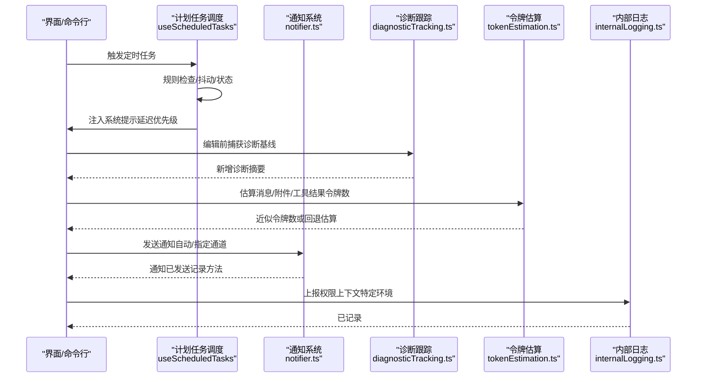
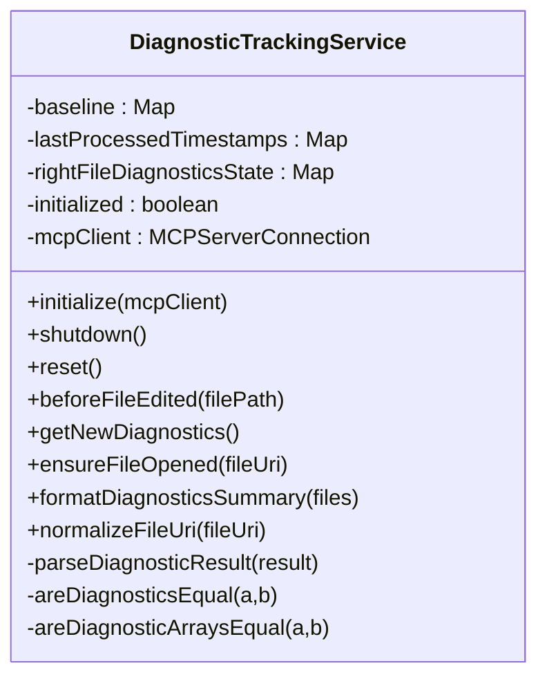
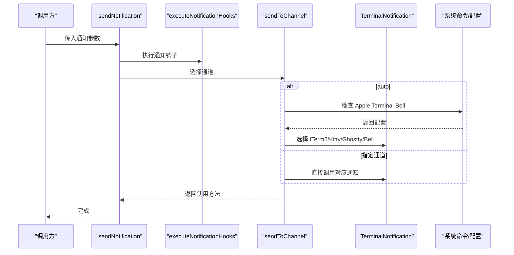
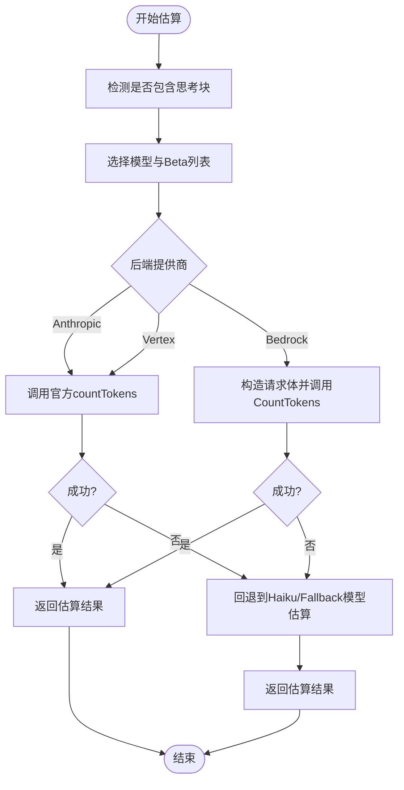
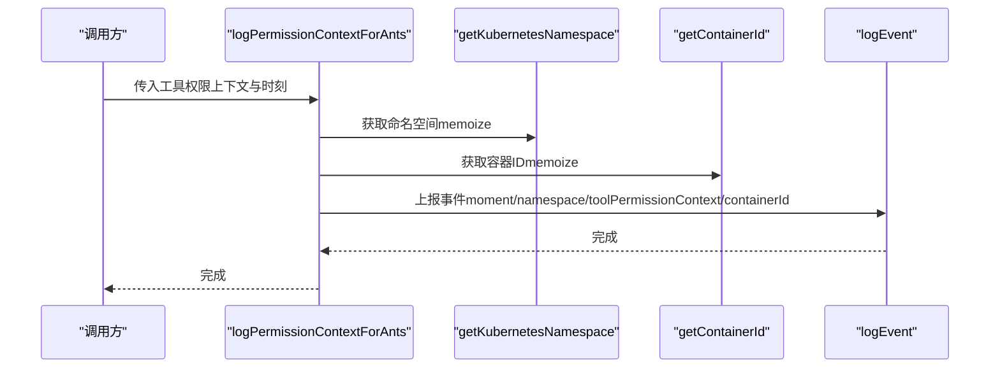
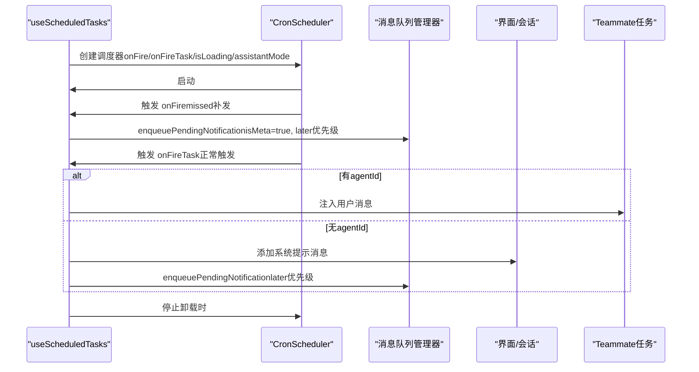
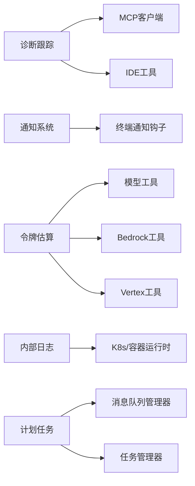

# 实用工具服务

<cite>
**本文引用的文件**
- [src/services/diagnosticTracking.ts](file://src/services/diagnosticTracking.ts)
- [src/services/internalLogging.ts](file://src/services/internalLogging.ts)
- [src/services/notifier.ts](file://src/services/notifier.ts)
- [src/services/tokenEstimation.ts](file://src/services/tokenEstimation.ts)
- [src/hooks/useScheduledTasks.ts](file://src/hooks/useScheduledTasks.ts)
- [src/utils/model/model.js](file://src/utils/model/model.js)
- [src/utils/model/bedrock.js](file://src/utils/model/bedrock.js)
- [src/utils/envUtils.js](file://src/utils/envUtils.js)
- [src/utils/betas.js](file://src/utils/betas.js)
- [src/constants/betas.js](file://src/constants/betas.js)
- [src/utils/messages.js](file://src/utils/messages.js)
- [src/utils/attachments.js](file://src/utils/attachments.js)
- [src/utils/toolSearch.js](file://src/utils/toolSearch.js)
- [src/utils/log.js](file://src/utils/log.js)
- [src/utils/slowOperations.js](file://src/utils/slowOperations.js)
- [src/services/api/client.js](file://src/services/api/client.js)
- [src/services/api/claude.js](file://src/services/api/claude.js)
- [src/services/vcr.js](file://src/services/vcr.js)
- [src/utils/config.js](file://src/utils/config.js)
- [src/utils/env.js](file://src/utils/env.js)
- [src/utils/hooks.js](file://src/utils/hooks.js)
- [src/utils/execFileNoThrow.js](file://src/utils/execFileNoThrow.js)
- [src/utils/file.js](file://src/utils/file.js)
- [src/utils/ide.js](file://src/utils/ide.js)
- [src/services/mcp/client.js](file://src/services/mcp/client.js)
- [src/services/mcp/types.js](file://src/services/mcp/types.js)
- [src/utils/errors.js](file://src/utils/errors.js)
- [src/ink/useTerminalNotification.js](file://src/ink/useTerminalNotification.js)
</cite>

## 目录
1. [简介](#简介)
2. [项目结构](#项目结构)
3. [核心组件](#核心组件)
4. [架构总览](#架构总览)
5. [详细组件分析](#详细组件分析)
6. [依赖关系分析](#依赖关系分析)
7. [性能考量](#性能考量)
8. [故障排查指南](#故障排查指南)
9. [结论](#结论)
10. [附录](#附录)

## 简介
本文件系统性梳理 Claude Code 的“实用工具服务”，聚焦以下五个关键子系统：诊断跟踪（Diagnostics Tracking）、通知系统（Notifier）、令牌估算（Token Estimation）、内部日志（Internal Logging）以及计划任务调度（Scheduled Tasks）。我们将从设计目标、实现原理、数据流、配置项、使用场景、组件协作与数据共享机制、对主功能模块的支持作用，以及性能优化建议等维度进行深入解析，帮助读者在理解代码的同时高效落地使用。

## 项目结构
实用工具服务主要分布在 src/services 与 src/hooks 下，并通过 src/utils 与 src/entrypoints 等模块间接被主功能调用。下图给出与本文相关的核心文件与模块关系概览：

```mermaid
graph TB
subgraph "服务层"
DT["诊断跟踪<br/>diagnosticTracking.ts"]
NL["内部日志<br/>internalLogging.ts"]
NF["通知系统<br/>notifier.ts"]
TE["令牌估算<br/>tokenEstimation.ts"]
ST["计划任务调度<br/>useScheduledTasks.ts"]
end
subgraph "工具与通用库"
U1["model.js"]
U2["bedrock.js"]
U3["envUtils.js"]
U4["betas.js"]
U5["messages.js"]
U6["attachments.js"]
U7["toolSearch.js"]
U8["log.js"]
U9["slowOperations.js"]
U10["config.js"]
U11["env.js"]
U12["hooks.js"]
U13["execFileNoThrow.js"]
U14["file.js"]
U15["ide.js"]
U16["mcp/client.js"]
U17["mcp/types.js"]
U18["errors.js"]
U19["ink/useTerminalNotification.js"]
end
DT --> U15
DT --> U16
DT --> U17
DT --> U18
DT --> U14
TE --> U1
TE --> U2
TE --> U3
TE --> U4
TE --> U5
TE --> U6
TE --> U7
TE --> U8
TE --> U9
TE --> U10
TE --> U11
TE --> U12
TE --> U13
NF --> U10
NF --> U11
NF --> U12
NF --> U19
NL --> U8
NL --> U9
ST --> U1
ST --> U2
ST --> U3
ST --> U4
ST --> U5
ST --> U6
ST --> U7
ST --> U8
ST --> U9
```

图表来源
- [src/services/diagnosticTracking.ts:1-398](file://src/services/diagnosticTracking.ts#L1-L398)
- [src/services/internalLogging.ts:1-91](file://src/services/internalLogging.ts#L1-L91)
- [src/services/notifier.ts:1-157](file://src/services/notifier.ts#L1-L157)
- [src/services/tokenEstimation.ts:1-496](file://src/services/tokenEstimation.ts#L1-L496)
- [src/hooks/useScheduledTasks.ts:1-140](file://src/hooks/useScheduledTasks.ts#L1-L140)
- [src/utils/model/model.js](file://src/utils/model/model.js)
- [src/utils/model/bedrock.js](file://src/utils/model/bedrock.js)
- [src/utils/envUtils.js](file://src/utils/envUtils.js)
- [src/utils/betas.js](file://src/utils/betas.js)
- [src/utils/messages.js](file://src/utils/messages.js)
- [src/utils/attachments.js](file://src/utils/attachments.js)
- [src/utils/toolSearch.js](file://src/utils/toolSearch.js)
- [src/utils/log.js](file://src/utils/log.js)
- [src/utils/slowOperations.js](file://src/utils/slowOperations.js)
- [src/services/api/client.js](file://src/services/api/client.js)
- [src/services/api/claude.js](file://src/services/api/claude.js)
- [src/services/vcr.js](file://src/services/vcr.js)
- [src/utils/config.js](file://src/utils/config.js)
- [src/utils/env.js](file://src/utils/env.js)
- [src/utils/hooks.js](file://src/utils/hooks.js)
- [src/utils/execFileNoThrow.js](file://src/utils/execFileNoThrow.js)
- [src/utils/file.js](file://src/utils/file.js)
- [src/utils/ide.js](file://src/utils/ide.js)
- [src/services/mcp/client.js](file://src/services/mcp/client.js)
- [src/services/mcp/types.js](file://src/services/mcp/types.js)
- [src/utils/errors.js](file://src/utils/errors.js)
- [src/ink/useTerminalNotification.js](file://src/ink/useTerminalNotification.js)

章节来源
- [src/services/diagnosticTracking.ts:1-398](file://src/services/diagnosticTracking.ts#L1-L398)
- [src/services/internalLogging.ts:1-91](file://src/services/internalLogging.ts#L1-L91)
- [src/services/notifier.ts:1-157](file://src/services/notifier.ts#L1-L157)
- [src/services/tokenEstimation.ts:1-496](file://src/services/tokenEstimation.ts#L1-L496)
- [src/hooks/useScheduledTasks.ts:1-140](file://src/hooks/useScheduledTasks.ts#L1-L140)

## 核心组件
- 诊断跟踪服务（DiagnosticTrackingService）
  - 设计目的：在用户编辑文件前后捕获并对比语言服务诊断信息，仅报告新增或变化的诊断，减少噪音并提升交互效率。
  - 关键能力：基准线存储、路径归一化、IDE 文件打开保障、增量诊断提取、人类可读摘要格式化。
- 通知系统（Notifier）
  - 设计目的：根据用户偏好与终端环境自动选择最优通知通道（如 iTerm2、Kitty、Bell 等），并记录方法使用统计。
  - 关键能力：通道自动探测、Bell 配置检测、跨平台通知分发、事件埋点。
- 令牌估算（TokenEstimation）
  - 设计目的：在不实际发起请求的前提下，提供消息/附件/工具结果的近似令牌数估算；必要时回退到基于模型的 API 计数。
  - 关键能力：思考块识别、工具搜索字段剥离、粗略估算（按字节/字符）、图像/文档/工具输入估算、Bedrock/Venue/Anthropic 多后端适配。
- 内部日志（InternalLogging）
  - 设计目的：在特定运行环境下采集容器与命名空间信息，结合权限上下文进行内部审计与追踪。
  - 关键能力：K8s 命名空间缓存、容器 ID 解析、权限上下文事件上报。
- 计划任务调度（useScheduledTasks）
  - 设计目的：在 REPL/助手模式下按 Cron 表达式周期性触发任务，将系统生成的提示注入命令队列，避免阻塞当前会话。
  - 关键能力：Cron 调度器封装、missed 任务补发、Teammate 任务路由、工作负载标记、抖动配置。

章节来源
- [src/services/diagnosticTracking.ts:30-398](file://src/services/diagnosticTracking.ts#L30-L398)
- [src/services/notifier.ts:12-157](file://src/services/notifier.ts#L12-L157)
- [src/services/tokenEstimation.ts:124-496](file://src/services/tokenEstimation.ts#L124-L496)
- [src/services/internalLogging.ts:10-91](file://src/services/internalLogging.ts#L10-L91)
- [src/hooks/useScheduledTasks.ts:40-140](file://src/hooks/useScheduledTasks.ts#L40-L140)

## 架构总览
下图展示实用工具服务与主功能模块的交互关系与数据流向：

图表来源
- [src/hooks/useScheduledTasks.ts:40-140](file://src/hooks/useScheduledTasks.ts#L40-L140)
- [src/services/notifier.ts:18-157](file://src/services/notifier.ts#L18-L157)
- [src/services/diagnosticTracking.ts:135-283](file://src/services/diagnosticTracking.ts#L135-L283)
- [src/services/tokenEstimation.ts:124-325](file://src/services/tokenEstimation.ts#L124-L325)
- [src/services/internalLogging.ts:71-91](file://src/services/internalLogging.ts#L71-L91)

## 详细组件分析

### 诊断跟踪服务（DiagnosticTrackingService）
- 设计目标
  - 在用户编辑文件前后获取语言服务诊断，建立基线并对比，仅返回新增或变更的诊断，降低噪声，提升可用性。
- 数据结构与流程
  - 基线存储：以归一化路径为键，保存诊断数组。
  - 右侧文件诊断状态：跟踪 _claude_fs_right 的诊断变化，决定使用 file:// 还是 _claude_fs_right 的诊断源。
  - 时间戳跟踪：记录每文件最后处理时间，便于后续策略扩展。
- 关键算法
  - 路径归一化：去除协议前缀并统一大小写/分隔符，确保跨平台一致性。
  - 诊断比较：逐字段比较（消息、严重级别、范围、来源、代码），支持数组等价性判断。
  - 增量提取：对每个文件，过滤掉存在于基线中的诊断，得到新诊断集合。
- 使用场景
  - 编辑器集成：在文件打开/编辑前后抓取诊断，用于提示/告警。
  - 诊断摘要：将诊断格式化为人类可读字符串，限制最大长度并截断。
- 配置与依赖
  - 依赖 MCP 客户端进行 IDE RPC 调用（打开文件、获取诊断）。
  - 依赖路径工具与 IDE 工具函数进行客户端发现与错误处理。
- 错误处理
  - 对 IDE 不支持诊断的情况采用静默失败策略，保证主流程不受影响。
  - 路径不匹配时记录错误，避免错误数据污染基线。
- 性能考量
  - 归一化与比较操作为 O(n) 比较，整体复杂度与诊断数量线性相关。
  - 通过 Map 查找与去重，避免重复计算。

图表来源
- [src/services/diagnosticTracking.ts:30-398](file://src/services/diagnosticTracking.ts#L30-L398)
- [src/services/mcp/client.js](file://src/services/mcp/client.js)
- [src/services/mcp/types.js](file://src/services/mcp/types.js)
- [src/utils/file.js](file://src/utils/file.js)
- [src/utils/ide.js](file://src/utils/ide.js)
- [src/utils/errors.js](file://src/utils/errors.js)

章节来源
- [src/services/diagnosticTracking.ts:30-398](file://src/services/diagnosticTracking.ts#L30-L398)

### 通知系统（Notifier）
- 设计目标
  - 根据用户首选通道与当前终端环境自动选择最佳通知方式，兼容多种终端（iTerm2、Kitty、Ghostty、Apple Terminal Bell 等），并记录使用统计。
- 流程与策略
  - 通道选择：auto 模式下根据终端类型自动选择；也可显式指定通道。
  - Apple Terminal Bell 检测：通过系统命令读取当前配置，若禁用 Bell 则回退到 Bell 提醒。
  - 终端通知：调用终端通知钩子（如 iTerm2/Kitty/Ghostty），或仅触发 Bell。
  - 事件埋点：记录配置通道、实际使用方法、终端类型等指标。
- 配置项
  - 全局配置项：preferredNotifChannel（auto/iterm2/iterm2_with_bell/kitty/ghostty/terminal_bell/notifications_disabled）
  - 环境变量：TERM 等由 env.js 提供的终端信息。
- 错误处理
  - 通道选择异常时返回 error 或 no_method_available，不影响主流程。
- 使用场景
  - 任务完成、错误提示、重要状态变更等异步通知。
- 性能考量
  - Apple Terminal Bell 检测涉及外部命令调用，应避免频繁触发；可通过缓存或节流优化。

图表来源
- [src/services/notifier.ts:18-157](file://src/services/notifier.ts#L18-L157)
- [src/utils/config.js](file://src/utils/config.js)
- [src/utils/env.js](file://src/utils/env.js)
- [src/utils/hooks.js](file://src/utils/hooks.js)
- [src/utils/execFileNoThrow.js](file://src/utils/execFileNoThrow.js)
- [src/ink/useTerminalNotification.js](file://src/ink/useTerminalNotification.js)

章节来源
- [src/services/notifier.ts:12-157](file://src/services/notifier.ts#L12-L157)

### 令牌估算（TokenEstimation）
- 设计目标
  - 在不实际调用模型 API 的前提下，快速估算消息、附件、工具结果等的令牌数；当 API 不可用时提供可靠回退方案。
- 核心能力
  - 思考块识别：检测 assistant 的 thinking/redacted_thinking 块，启用相应预算。
  - 工具搜索字段剥离：移除 tool_use 的 caller 与 tool_result 的 tool_reference，避免非标准字段导致 API 错误。
  - 粗略估算：按字节/字符估算，针对 JSON 类型采用更小的字节/令牌比率。
  - 图像/文档/工具输入估算：图像/文档按保守常量估算；工具输入按序列化长度估算。
  - 后端适配：支持 Anthropic、Bedrock、Vertex；Bedrock 需要模型 ID 且不直接支持 countTokens，需自定义请求体。
- 关键流程
  - API 估算：优先使用官方 API 的 countTokens；若不可用则回退到 Haiku/Fallback 模型的 create 请求。
  - VCR 缓存：对令牌估算结果进行缓存，避免重复计算。
- 配置与依赖
  - 模型选择：主循环模型、小而快模型、默认 Sonnet 等。
  - Betas：根据模型与后端过滤允许的 beta 列表。
  - 附件与消息：规范化附件为用户消息，再进行估算。
- 错误处理
  - API 调用失败时返回 null 并记录错误；回退估算仍可提供近似值。
- 性能考量
  - 动态导入 AWS SDK，仅在 Bedrock 调用时加载，降低冷启动成本。
  - 估算函数尽量避免深度遍历，针对常见块类型采用常量或简单公式。

图表来源
- [src/services/tokenEstimation.ts:124-496](file://src/services/tokenEstimation.ts#L124-L496)
- [src/utils/model/model.js](file://src/utils/model/model.js)
- [src/utils/model/bedrock.js](file://src/utils/model/bedrock.js)
- [src/utils/envUtils.js](file://src/utils/envUtils.js)
- [src/utils/betas.js](file://src/utils/betas.js)
- [src/constants/betas.js](file://src/constants/betas.js)
- [src/utils/messages.js](file://src/utils/messages.js)
- [src/utils/attachments.js](file://src/utils/attachments.js)
- [src/utils/toolSearch.js](file://src/utils/toolSearch.js)
- [src/utils/log.js](file://src/utils/log.js)
- [src/utils/slowOperations.js](file://src/utils/slowOperations.js)
- [src/services/api/client.js](file://src/services/api/client.js)
- [src/services/api/claude.js](file://src/services/api/claude.js)
- [src/services/vcr.js](file://src/services/vcr.js)

章节来源
- [src/services/tokenEstimation.ts:124-496](file://src/services/tokenEstimation.ts#L124-L496)

### 内部日志（InternalLogging）
- 设计目标
  - 在特定运行环境（如蚂蚁/Ant 用户）下采集 Kubernetes 命名空间与容器 ID，并结合工具权限上下文进行内部审计事件上报。
- 能力与实现
  - 命名空间获取：读取 K8s 服务账号命名空间文件，带缓存与不存在标识。
  - 容器 ID 获取：解析 /proc/self/mountinfo，匹配 Docker/containerd 容器 ID。
  - 权限上下文上报：序列化工具权限上下文，上报分析事件，包含 moment（初始化/汇总）、命名空间、容器 ID 等。
- 使用场景
  - 内部审计、问题定位、资源归属追踪。
- 性能考量
  - 读取与解析文件仅在需要时执行，且对命名空间与容器 ID 结果进行 memoize 缓存。

图表来源
- [src/services/internalLogging.ts:71-91](file://src/services/internalLogging.ts#L71-L91)
- [src/utils/slowOperations.js](file://src/utils/slowOperations.js)
- [src/services/analytics/index.js](file://src/services/analytics/index.js)

章节来源
- [src/services/internalLogging.ts:10-91](file://src/services/internalLogging.ts#L10-L91)

### 计划任务调度（useScheduledTasks）
- 设计目标
  - 在 REPL/助手模式下按 Cron 表达式周期性触发任务，将系统生成的提示注入命令队列，避免阻塞当前会话。
- 关键流程
  - 加载/刷新特性开关：动态检查是否启用 Kairos Cron。
  - 创建调度器：传入 onFire/onFireTask、isLoading、assistantMode、抖动配置、终止标志等。
  - Missed 任务补发：对错过触发的任务进行一次性补发。
  - Teammate 路由：根据 agentId 将任务注入对应队友的消息流。
  - 工作负载标记：为 Cron 初始化的请求设置较低 QoS 的工作负载标记。
- 配置与依赖
  - Cron 抖动配置：从配置中读取抖动参数，平滑突发。
  - 队列管理：通过消息队列管理器将提示以“稍后”优先级注入。
  - 任务状态：检查队友任务是否仍在运行，否则清理孤儿 Cron。
- 使用场景
  - 定时巡检、周期性提醒、后台维护任务等。
- 性能考量
  - 仅在挂载时创建一次调度器，卸载时销毁，避免重复开销。
  - 通过 isLoadingRef 保持对最新状态的访问，避免闭包陷阱。

图表来源
- [src/hooks/useScheduledTasks.ts:40-140](file://src/hooks/useScheduledTasks.ts#L40-L140)
- [src/utils/cronScheduler.js](file://src/utils/cronScheduler.js)
- [src/utils/cronJitterConfig.js](file://src/utils/cronJitterConfig.js)
- [src/utils/cronTasks.js](file://src/utils/cronTasks.js)
- [src/utils/messageQueueManager.js](file://src/utils/messageQueueManager.js)
- [src/utils/messages.js](file://src/utils/messages.js)
- [src/tasks/InProcessTeammateTask/InProcessTeammateTask.js](file://src/tasks/InProcessTeammateTask/InProcessTeammateTask.js)
- [src/utils/workloadContext.js](file://src/utils/workloadContext.js)

章节来源
- [src/hooks/useScheduledTasks.ts:18-140](file://src/hooks/useScheduledTasks.ts#L18-L140)

## 依赖关系分析
- 组件内聚与耦合
  - 诊断跟踪服务与 MCP/IDE 工具强耦合，但通过接口抽象隔离了具体 IDE 实现。
  - 通知系统与终端通知钩子解耦，通道选择逻辑独立于具体终端实现。
  - 令牌估算服务与模型/后端工具链耦合，但通过条件分支与动态导入降低冷启动成本。
  - 内部日志服务仅在特定环境生效，对其他模块透明。
  - 计划任务调度与消息队列、任务管理器耦合，但对外暴露清晰的回调接口。
- 外部依赖与集成点
  - MCP 客户端：用于 IDE 交互（打开文件、获取诊断）。
  - 终端通知：iTerm2/Kitty/Ghostty/Bell 等。
  - 云后端：Anthropic/Bedrock/Vertex 的模型与 API。
  - K8s 与容器运行时：命名空间与容器 ID 读取。
- 循环依赖风险
  - 当前各服务均为单例或纯函数式封装，未见明显循环依赖。

图表来源
- [src/services/diagnosticTracking.ts:1-398](file://src/services/diagnosticTracking.ts#L1-L398)
- [src/services/notifier.ts:1-157](file://src/services/notifier.ts#L1-L157)
- [src/services/tokenEstimation.ts:1-496](file://src/services/tokenEstimation.ts#L1-L496)
- [src/services/internalLogging.ts:1-91](file://src/services/internalLogging.ts#L1-L91)
- [src/hooks/useScheduledTasks.ts:1-140](file://src/hooks/useScheduledTasks.ts#L1-L140)

章节来源
- [src/services/diagnosticTracking.ts:1-398](file://src/services/diagnosticTracking.ts#L1-L398)
- [src/services/notifier.ts:1-157](file://src/services/notifier.ts#L1-L157)
- [src/services/tokenEstimation.ts:1-496](file://src/services/tokenEstimation.ts#L1-L496)
- [src/services/internalLogging.ts:1-91](file://src/services/internalLogging.ts#L1-L91)
- [src/hooks/useScheduledTasks.ts:1-140](file://src/hooks/useScheduledTasks.ts#L1-L140)

## 性能考量
- 诊断跟踪
  - 归一化与比较为 O(n)；建议对大文件诊断进行分批处理或阈值控制。
  - 避免在高频编辑场景中重复调用 ensureFileOpened，可通过节流/防抖优化。
- 通知系统
  - Apple Terminal Bell 检测涉及系统命令调用，建议缓存结果并在配置变更时刷新。
  - 自动通道选择应尽量减少不必要的终端交互。
- 令牌估算
  - 动态导入 AWS SDK 仅在 Bedrock 路径触发，避免全局加载成本。
  - 估算函数尽量使用常量与简单公式，避免深度遍历；对大附件/图像/工具输入采用保守估算。
  - VCR 缓存可显著减少重复估算开销。
- 内部日志
  - 命名空间与容器 ID 读取仅在特定环境生效，memoize 可避免重复 IO。
- 计划任务调度
  - 仅在挂载时创建调度器，卸载时销毁；避免重复定时器。
  - 通过 isLoadingRef 与 assistantMode 参数控制触发节奏，减少不必要的任务注入。

## 故障排查指南
- 诊断跟踪
  - 症状：诊断不更新或路径不匹配。
  - 排查：确认 MCP 客户端连接状态；检查路径归一化逻辑；查看日志错误输出。
- 通知系统
  - 症状：通知未送达或通道选择异常。
  - 排查：检查 preferredNotifChannel 配置；验证终端类型与 Bell 配置；查看返回的方法标识。
- 令牌估算
  - 症状：估算结果为 null 或与实际差异较大。
  - 排查：确认后端提供商与模型选择；检查 betas 过滤；验证是否启用思考块；查看回退路径是否生效。
- 内部日志
  - 症状：命名空间/容器 ID 为空或报错。
  - 排查：确认运行环境变量 USER_TYPE；检查文件读取权限与路径存在性。
- 计划任务调度
  - 症状：任务未触发或触发过早/过晚。
  - 排查：检查 isKairosCronEnabled 开关；核对 Cron 表达式与抖动配置；确认 isLoading 状态与 assistantMode。

章节来源
- [src/services/diagnosticTracking.ts:103-182](file://src/services/diagnosticTracking.ts#L103-L182)
- [src/services/notifier.ts:110-156](file://src/services/notifier.ts#L110-L156)
- [src/services/tokenEstimation.ts:196-200](file://src/services/tokenEstimation.ts#L196-L200)
- [src/services/internalLogging.ts:17-66](file://src/services/internalLogging.ts#L17-L66)
- [src/hooks/useScheduledTasks.ts:53-126](file://src/hooks/useScheduledTasks.ts#L53-L126)

## 结论
上述实用工具服务围绕“诊断、通知、估算、日志、调度”五大支柱，为 Claude Code 的主功能模块提供了稳健的辅助支持。它们通过明确的职责划分、清晰的数据流与健壮的错误处理，实现了跨平台、多后端、低侵入的系统增强。在实际部署中，建议结合运行环境与业务需求，合理配置通道、估算策略与调度参数，并关注性能与可观测性，以获得最佳体验。

## 附录
- 配置清单（示例）
  - 通知通道：preferredNotifChannel（auto/iterm2/iterm2_with_bell/kitty/ghostty/terminal_bell/notifications_disabled）
  - 运行环境：USER_TYPE（蚂蚁/Ant 用户启用内部日志）
  - Cron 开关：isKairosCronEnabled（动态特性开关）
  - 模型与后端：Anthropic/Bedrock/Vertex 的模型与 betas 配置
- 最佳实践
  - 诊断跟踪：对大文件采用增量处理与阈值控制；确保 IDE 文件打开后再抓取诊断。
  - 通知系统：在高并发场景下缓存 Bell 检测结果；优先使用自动通道。
  - 令牌估算：在 API 不可用时启用回退估算；对 JSON/图像/工具输入采用保守策略。
  - 内部日志：仅在受控环境中启用；定期清理缓存与无效条目。
  - 计划任务：合理设置抖动与工作负载标记；及时清理孤儿 Cron。