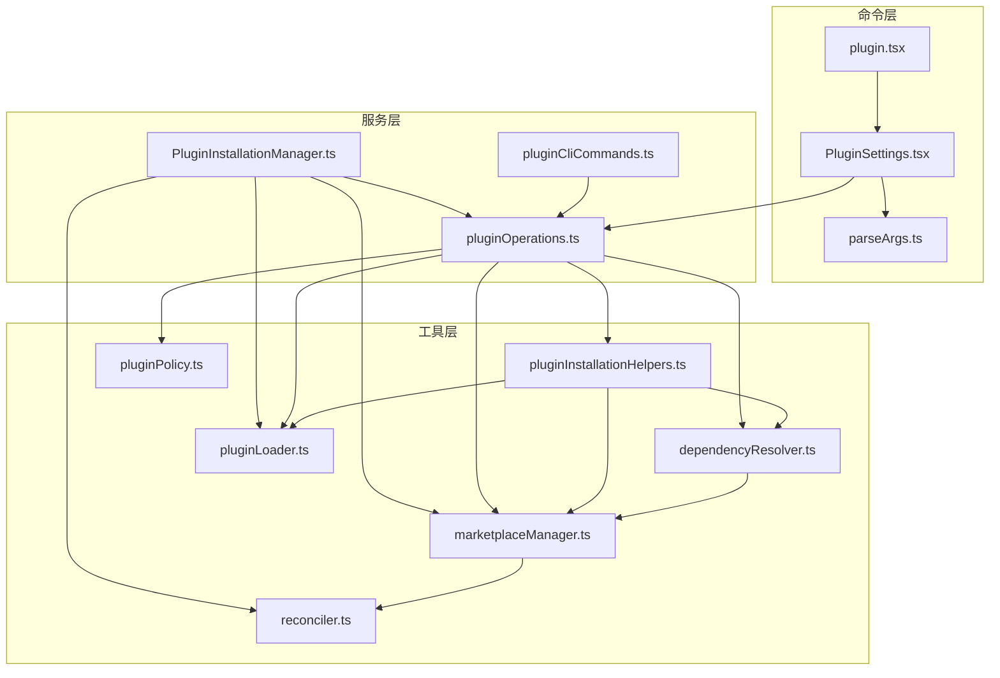
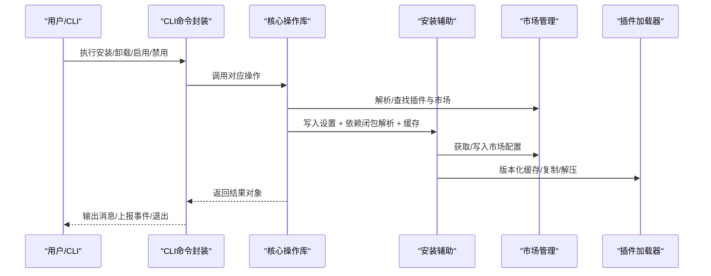
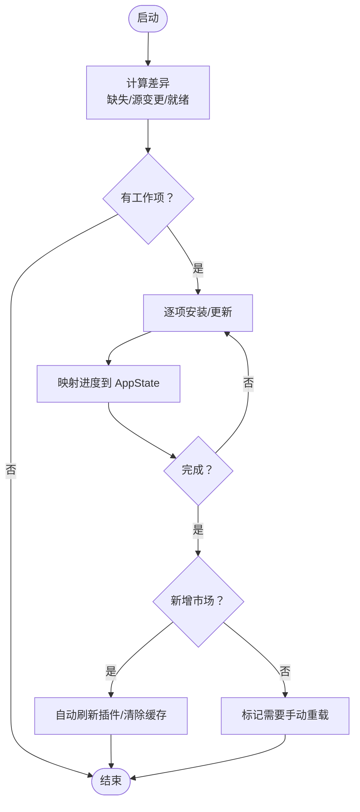
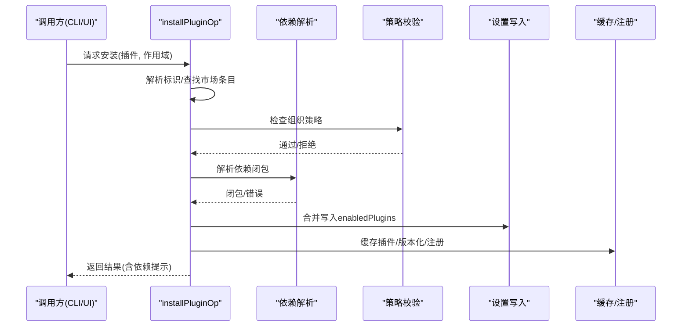
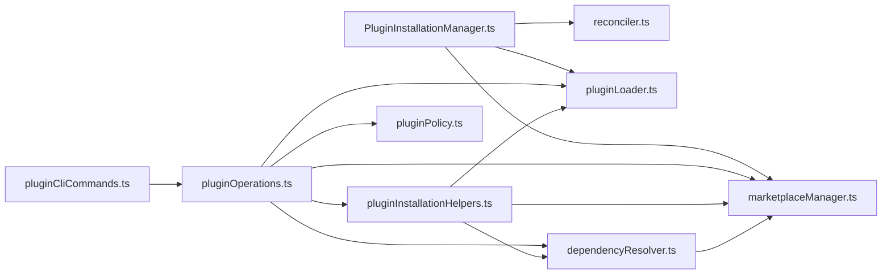

# 插件管理服务

<cite>
**本文档引用的文件**
- [src/services/plugins/PluginInstallationManager.ts](file://src/services/plugins/PluginInstallationManager.ts)
- [src/services/plugins/pluginOperations.ts](file://src/services/plugins/pluginOperations.ts)
- [src/services/plugins/pluginCliCommands.ts](file://src/services/plugins/pluginCliCommands.ts)
- [src/utils/plugins/pluginInstallationHelpers.ts](file://src/utils/plugins/pluginInstallationHelpers.ts)
- [src/utils/plugins/dependencyResolver.ts](file://src/utils/plugins/dependencyResolver.ts)
- [src/utils/plugins/marketplaceManager.ts](file://src/utils/plugins/marketplaceManager.ts)
- [src/utils/plugins/pluginLoader.ts](file://src/utils/plugins/pluginLoader.ts)
- [src/utils/plugins/pluginPolicy.ts](file://src/utils/plugins/pluginPolicy.ts)
- [src/utils/plugins/reconciler.ts](file://src/utils/plugins/reconciler.ts)
- [src/commands/plugin/PluginSettings.tsx](file://src/commands/plugin/PluginSettings.tsx)
- [src/commands/plugin/parseArgs.ts](file://src/commands/plugin/parseArgs.ts)
- [src/commands/plugin/plugin.tsx](file://src/commands/plugin/plugin.tsx)
</cite>

## 目录
1. [简介](#简介)
2. [项目结构](#项目结构)
3. [核心组件](#核心组件)
4. [架构总览](#架构总览)
5. [详细组件分析](#详细组件分析)
6. [依赖关系分析](#依赖关系分析)
7. [性能考虑](#性能考虑)
8. [故障排除指南](#故障排除指南)
9. [结论](#结论)

## 简介
本文件系统化梳理 Claude Code 的插件管理服务，围绕插件安装管理器的实现架构与生命周期管理展开，覆盖插件发现、下载、安装与卸载全流程；阐述事务处理与回滚机制；解析插件 CLI 命令的实现原理与参数解析；说明插件管理服务与权限控制系统的协作方式；并提供最佳实践与故障排除指南，包括依赖冲突解决与版本兼容性检查。

## 项目结构
插件管理相关代码主要分布在以下模块：
- 服务层：插件安装管理器、核心操作库、CLI 命令封装
- 工具层：插件安装辅助、依赖解析、市场管理、加载器、策略校验、差异与协调
- 命令层：插件命令入口与参数解析

**图表来源**
- [src/commands/plugin/PluginSettings.tsx:1-1072](file://src/commands/plugin/PluginSettings.tsx#L1-L1072)
- [src/commands/plugin/parseArgs.ts:1-104](file://src/commands/plugin/parseArgs.ts#L1-L104)
- [src/commands/plugin/plugin.tsx:1-7](file://src/commands/plugin/plugin.tsx#L1-L7)
- [src/services/plugins/PluginInstallationManager.ts:1-185](file://src/services/plugins/PluginInstallationManager.ts#L1-L185)
- [src/services/plugins/pluginOperations.ts:1-1089](file://src/services/plugins/pluginOperations.ts#L1-L1089)
- [src/services/plugins/pluginCliCommands.ts:1-345](file://src/services/plugins/pluginCliCommands.ts#L1-L345)
- [src/utils/plugins/pluginInstallationHelpers.ts:1-596](file://src/utils/plugins/pluginInstallationHelpers.ts#L1-L596)
- [src/utils/plugins/dependencyResolver.ts:1-306](file://src/utils/plugins/dependencyResolver.ts#L1-L306)
- [src/utils/plugins/marketplaceManager.ts:1-2644](file://src/utils/plugins/marketplaceManager.ts#L1-L2644)
- [src/utils/plugins/pluginLoader.ts:1-3303](file://src/utils/plugins/pluginLoader.ts#L1-L3303)
- [src/utils/plugins/pluginPolicy.ts:1-21](file://src/utils/plugins/pluginPolicy.ts#L1-L21)
- [src/utils/plugins/reconciler.ts:1-266](file://src/utils/plugins/reconciler.ts#L1-L266)

**章节来源**
- [src/services/plugins/PluginInstallationManager.ts:1-185](file://src/services/plugins/PluginInstallationManager.ts#L1-L185)
- [src/services/plugins/pluginOperations.ts:1-1089](file://src/services/plugins/pluginOperations.ts#L1-L1089)
- [src/services/plugins/pluginCliCommands.ts:1-345](file://src/services/plugins/pluginCliCommands.ts#L1-L345)
- [src/utils/plugins/pluginInstallationHelpers.ts:1-596](file://src/utils/plugins/pluginInstallationHelpers.ts#L1-L596)
- [src/utils/plugins/dependencyResolver.ts:1-306](file://src/utils/plugins/dependencyResolver.ts#L1-L306)
- [src/utils/plugins/marketplaceManager.ts:1-2644](file://src/utils/plugins/marketplaceManager.ts#L1-L2644)
- [src/utils/plugins/pluginLoader.ts:1-3303](file://src/utils/plugins/pluginLoader.ts#L1-L3303)
- [src/utils/plugins/pluginPolicy.ts:1-21](file://src/utils/plugins/pluginPolicy.ts#L1-L21)
- [src/utils/plugins/reconciler.ts:1-266](file://src/utils/plugins/reconciler.ts#L1-L266)
- [src/commands/plugin/PluginSettings.tsx:1-1072](file://src/commands/plugin/PluginSettings.tsx#L1-L1072)
- [src/commands/plugin/parseArgs.ts:1-104](file://src/commands/plugin/parseArgs.ts#L1-L104)
- [src/commands/plugin/plugin.tsx:1-7](file://src/commands/plugin/plugin.tsx#L1-L7)

## 核心组件
- 插件安装管理器（后台）：负责在启动时对市场进行差异比对与协调，异步安装/更新市场，自动刷新插件并处理失败回退。
- 核心操作库：提供安装、卸载、启用/禁用、批量禁用等纯函数式操作，统一返回结果对象，避免直接写日志或退出进程。
- CLI 命令封装：将核心操作包装为 CLI 行为，负责输出、错误格式化、事件上报与进程退出。
- 安装辅助：缓存、注册、路径校验、版本计算、依赖闭包解析、跨市场依赖策略。
- 市场管理：已知市场的配置、缓存、克隆/拉取、种子市场同步、差异与协调。
- 加载器：插件发现、加载、验证、依赖校验与降级、缓存路径解析、ZIP 缓存支持。
- 权限策略：基于托管设置的组织策略拦截安装与启用。
- 命令 UI：交互式插件设置界面，解析命令行参数，驱动视图状态与操作。

**章节来源**
- [src/services/plugins/PluginInstallationManager.ts:1-185](file://src/services/plugins/PluginInstallationManager.ts#L1-L185)
- [src/services/plugins/pluginOperations.ts:1-1089](file://src/services/plugins/pluginOperations.ts#L1-L1089)
- [src/services/plugins/pluginCliCommands.ts:1-345](file://src/services/plugins/pluginCliCommands.ts#L1-L345)
- [src/utils/plugins/pluginInstallationHelpers.ts:1-596](file://src/utils/plugins/pluginInstallationHelpers.ts#L1-L596)
- [src/utils/plugins/marketplaceManager.ts:1-2644](file://src/utils/plugins/marketplaceManager.ts#L1-L2644)
- [src/utils/plugins/pluginLoader.ts:1-3303](file://src/utils/plugins/pluginLoader.ts#L1-L3303)
- [src/utils/plugins/pluginPolicy.ts:1-21](file://src/utils/plugins/pluginPolicy.ts#L1-L21)
- [src/utils/plugins/reconciler.ts:1-266](file://src/utils/plugins/reconciler.ts#L1-L266)
- [src/commands/plugin/PluginSettings.tsx:1-1072](file://src/commands/plugin/PluginSettings.tsx#L1-L1072)
- [src/commands/plugin/parseArgs.ts:1-104](file://src/commands/plugin/parseArgs.ts#L1-L104)

## 架构总览
插件管理采用“声明意图 + 协调材料化”的双层设计：
- 意图层（settings）：用户/项目/本地设置中声明的市场与插件启用意图。
- 状态层（known_marketplaces.json + 缓存）：实际落盘的市场来源、安装位置与插件缓存。

**图表来源**
- [src/services/plugins/pluginCliCommands.ts:1-345](file://src/services/plugins/pluginCliCommands.ts#L1-L345)
- [src/services/plugins/pluginOperations.ts:1-1089](file://src/services/plugins/pluginOperations.ts#L1-L1089)
- [src/utils/plugins/pluginInstallationHelpers.ts:1-596](file://src/utils/plugins/pluginInstallationHelpers.ts#L1-L596)
- [src/utils/plugins/marketplaceManager.ts:1-2644](file://src/utils/plugins/marketplaceManager.ts#L1-L2644)
- [src/utils/plugins/pluginLoader.ts:1-3303](file://src/utils/plugins/pluginLoader.ts#L1-L3303)

## 详细组件分析

### 插件安装管理器（后台）
职责：
- 启动时计算“声明意图”与“已材料化状态”的差异
- 对缺失/源变更的市场进行安装/更新
- 将进度映射到 AppState，用于 REPL UI 展示
- 新增市场后自动刷新插件，或标记需要手动重载
- 失败时清理缓存并提示用户

关键点：
- 使用差异计算与协调器，保证幂等与可恢复
- 对“新装”与“更新”分别处理，避免不必要的破坏
- 通过分析事件统计安装数量、失败数等指标

**图表来源**
- [src/services/plugins/PluginInstallationManager.ts:60-185](file://src/services/plugins/PluginInstallationManager.ts#L60-L185)
- [src/utils/plugins/reconciler.ts:114-234](file://src/utils/plugins/reconciler.ts#L114-L234)

**章节来源**
- [src/services/plugins/PluginInstallationManager.ts:1-185](file://src/services/plugins/PluginInstallationManager.ts#L1-L185)
- [src/utils/plugins/reconciler.ts:1-266](file://src/utils/plugins/reconciler.ts#L1-L266)

### 核心操作库（安装/卸载/启用/禁用）
职责：
- 提供纯函数式操作，不直接写日志或退出
- 统一返回结果对象，包含成功/失败信息与上下文
- 支持作用域（用户/项目/本地），内置范围校验与默认值
- 在安装前解析依赖闭包，按需写入设置并缓存插件
- 在卸载时清理设置、安装记录与可选数据目录

安装流程要点：
- 解析插件标识，定位市场条目与安装位置
- 依赖闭包解析：DFS 遍历，检测环、跨市场依赖、缺失依赖
- 策略拦截：组织策略禁止安装/依赖被禁用
- 写入设置（一次性合并）→ 缓存插件（含版本化路径/ZIP）→ 清理缓存
- 返回带依赖提示的成功消息

卸载流程要点：
- 查找插件与安装记录，确认作用域
- 从设置中删除键（undefined 合并）
- 从安装记录中移除该作用域
- 若为最后一个作用域，清理选项与数据目录
- 检测反向依赖并给出警告

**图表来源**
- [src/services/plugins/pluginOperations.ts:321-418](file://src/services/plugins/pluginOperations.ts#L321-L418)
- [src/utils/plugins/dependencyResolver.ts:95-159](file://src/utils/plugins/dependencyResolver.ts#L95-L159)
- [src/utils/plugins/pluginInstallationHelpers.ts:348-481](file://src/utils/plugins/pluginInstallationHelpers.ts#L348-L481)
- [src/utils/plugins/pluginPolicy.ts:17-21](file://src/utils/plugins/pluginPolicy.ts#L17-L21)

**章节来源**
- [src/services/plugins/pluginOperations.ts:305-558](file://src/services/plugins/pluginOperations.ts#L305-L558)
- [src/utils/plugins/dependencyResolver.ts:1-306](file://src/utils/plugins/dependencyResolver.ts#L1-L306)
- [src/utils/plugins/pluginInstallationHelpers.ts:282-481](file://src/utils/plugins/pluginInstallationHelpers.ts#L282-L481)
- [src/utils/plugins/pluginPolicy.ts:1-21](file://src/utils/plugins/pluginPolicy.ts#L1-L21)

### CLI 命令封装
职责：
- 将核心操作包装为 CLI 行为，负责输出、错误格式化、事件上报与进程退出
- 统一处理安装/卸载/启用/禁用/批量禁用/更新等命令
- 构建插件遥测字段，上报命令失败事件

关键点：
- 成功时输出“√”符号与简洁消息
- 失败时格式化错误并上报事件，随后退出进程
- 更新命令使用标准输出流，优雅退出

**章节来源**
- [src/services/plugins/pluginCliCommands.ts:1-345](file://src/services/plugins/pluginCliCommands.ts#L1-L345)

### 安装辅助（缓存/注册/路径校验/版本）
职责：
- 路径校验：防止相对路径逃逸到基座目录之外
- 版本化缓存：生成版本化路径，支持 ZIP 缓存模式
- 注册安装：写入安装记录（installed_plugins.json）
- 依赖闭包解析：统一格式化错误消息，支持跨市场依赖提示
- 与加载器配合：解析版本、处理种子缓存、处理 ZIP

关键点：
- 本地插件源必须提供市场安装位置，否则无法缓存
- 跨市场依赖默认禁止，可通过根市场 allowlist 放行
- 错误消息统一格式化，便于 UI/CLI 显示

**章节来源**
- [src/utils/plugins/pluginInstallationHelpers.ts:87-226](file://src/utils/plugins/pluginInstallationHelpers.ts#L87-L226)
- [src/utils/plugins/pluginInstallationHelpers.ts:304-327](file://src/utils/plugins/pluginInstallationHelpers.ts#L304-L327)
- [src/utils/plugins/pluginInstallationHelpers.ts:348-481](file://src/utils/plugins/pluginInstallationHelpers.ts#L348-L481)

### 依赖解析（安装时 DFS + 加载时固定点）
职责：
- 安装时：DFS 遍历依赖闭包，检测环、跨市场依赖、缺失依赖
- 加载时：固定点迭代，对不满足依赖的插件进行降级，并收集错误

关键点：
- bare 依赖（无 @ 市场名）继承声明插件的市场，但 inline 市场不参与
- 已启用依赖会被跳过，避免意外写入设置
- 反向依赖查询用于卸载/禁用前的警告

**章节来源**
- [src/utils/plugins/dependencyResolver.ts:95-159](file://src/utils/plugins/dependencyResolver.ts#L95-L159)
- [src/utils/plugins/dependencyResolver.ts:177-234](file://src/utils/plugins/dependencyResolver.ts#L177-L234)
- [src/utils/plugins/dependencyResolver.ts:244-263](file://src/utils/plugins/dependencyResolver.ts#L244-L263)

### 市场管理（配置/缓存/克隆/拉取/种子同步）
职责：
- 管理 known_marketplaces.json：保存市场来源、安装位置、最后更新时间
- 缓存市场清单，支持 URL/GitHub/Git 子目录/本地目录/文件
- 克隆/拉取市场仓库，增强错误消息（SSH 主机密钥、认证失败、网络超时）
- 种子市场同步：将只读种子中的市场注册到主配置，优先级最高
- 差异与协调：比较声明意图与实际状态，决定安装/更新/跳过

关键点：
- 本地路径在多工作树场景下规范化为主仓库根路径
- 源变更时保留已存在且有效的条目，避免覆盖
- ZIP 缓存模式下，目录缓存转为 ZIP 文件

**章节来源**
- [src/utils/plugins/marketplaceManager.ts:264-350](file://src/utils/plugins/marketplaceManager.ts#L264-L350)
- [src/utils/plugins/marketplaceManager.ts:508-710](file://src/utils/plugins/marketplaceManager.ts#L508-L710)
- [src/utils/plugins/marketplaceManager.ts:380-434](file://src/utils/plugins/marketplaceManager.ts#L380-L434)
- [src/utils/plugins/reconciler.ts:50-83](file://src/utils/plugins/reconciler.ts#L50-L83)
- [src/utils/plugins/reconciler.ts:114-234](file://src/utils/plugins/reconciler.ts#L114-L234)

### 插件加载器（发现/加载/验证/依赖降级/缓存）
职责：
- 发现顺序：市场插件 → 会话插件（--plugin-dir）
- 加载与验证：清单校验、钩子配置、重复名称检测
- 依赖降级：加载时固定点校验，不满足依赖的插件降级
- 缓存路径：版本化/种子缓存/遗留路径兼容
- ZIP 缓存：目录缓存转 ZIP，减少磁盘占用

关键点：
- inline 市场（--plugin-dir）的 bare 依赖按名称匹配
- 种子缓存命中时直接使用，不复制
- 版本未知时探测种子缓存任意版本

**章节来源**
- [src/utils/plugins/pluginLoader.ts:1-3303](file://src/utils/plugins/pluginLoader.ts#L1-L3303)

### 权限控制（策略拦截）
职责：
- 基于托管设置（policySettings）判断插件是否被组织策略强制禁用
- 在安装/启用/依赖解析阶段统一拦截，避免绕过

**章节来源**
- [src/utils/plugins/pluginPolicy.ts:1-21](file://src/utils/plugins/pluginPolicy.ts#L1-L21)

### 命令行与交互界面
职责：
- 参数解析：支持 install/enable/disable/uninstall/manage/marketplace 等子命令
- 交互界面：插件设置 UI，支持浏览市场、发现插件、管理插件与市场、查看错误
- 视图状态：根据解析结果初始化视图，支持快捷键导航与操作

**章节来源**
- [src/commands/plugin/parseArgs.ts:1-104](file://src/commands/plugin/parseArgs.ts#L1-L104)
- [src/commands/plugin/PluginSettings.tsx:636-722](file://src/commands/plugin/PluginSettings.tsx#L636-L722)
- [src/commands/plugin/plugin.tsx:1-7](file://src/commands/plugin/plugin.tsx#L1-L7)

## 依赖关系分析

**图表来源**
- [src/services/plugins/pluginCliCommands.ts:1-345](file://src/services/plugins/pluginCliCommands.ts#L1-L345)
- [src/services/plugins/PluginInstallationManager.ts:1-185](file://src/services/plugins/PluginInstallationManager.ts#L1-L185)
- [src/services/plugins/pluginOperations.ts:1-1089](file://src/services/plugins/pluginOperations.ts#L1-L1089)
- [src/utils/plugins/pluginInstallationHelpers.ts:1-596](file://src/utils/plugins/pluginInstallationHelpers.ts#L1-L596)
- [src/utils/plugins/dependencyResolver.ts:1-306](file://src/utils/plugins/dependencyResolver.ts#L1-L306)
- [src/utils/plugins/marketplaceManager.ts:1-2644](file://src/utils/plugins/marketplaceManager.ts#L1-L2644)
- [src/utils/plugins/pluginLoader.ts:1-3303](file://src/utils/plugins/pluginLoader.ts#L1-L3303)
- [src/utils/plugins/pluginPolicy.ts:1-21](file://src/utils/plugins/pluginPolicy.ts#L1-L21)
- [src/utils/plugins/reconciler.ts:1-266](file://src/utils/plugins/reconciler.ts#L1-L266)

**章节来源**
- [src/services/plugins/pluginCliCommands.ts:1-345](file://src/services/plugins/pluginCliCommands.ts#L1-L345)
- [src/services/plugins/PluginInstallationManager.ts:1-185](file://src/services/plugins/PluginInstallationManager.ts#L1-L185)
- [src/services/plugins/pluginOperations.ts:1-1089](file://src/services/plugins/pluginOperations.ts#L1-L1089)
- [src/utils/plugins/pluginInstallationHelpers.ts:1-596](file://src/utils/plugins/pluginInstallationHelpers.ts#L1-L596)
- [src/utils/plugins/dependencyResolver.ts:1-306](file://src/utils/plugins/dependencyResolver.ts#L1-L306)
- [src/utils/plugins/marketplaceManager.ts:1-2644](file://src/utils/plugins/marketplaceManager.ts#L1-L2644)
- [src/utils/plugins/pluginLoader.ts:1-3303](file://src/utils/plugins/pluginLoader.ts#L1-L3303)
- [src/utils/plugins/pluginPolicy.ts:1-21](file://src/utils/plugins/pluginPolicy.ts#L1-L21)
- [src/utils/plugins/reconciler.ts:1-266](file://src/utils/plugins/reconciler.ts#L1-L266)

## 性能考虑
- 缓存与版本化：插件缓存采用版本化路径，避免重复下载与冲突；支持 ZIP 缓存以减少磁盘占用。
- 种子缓存：首次启动或种子场景下，直接命中种子缓存，避免网络开销。
- 依赖闭包：安装时仅对缺失依赖进行解析与缓存，已启用依赖跳过，减少写入与 I/O。
- 差异协调：仅对缺失/源变更的市场执行安装/更新，避免重复克隆。
- 加载降级：加载时固定点迭代，避免递归复杂度带来的性能问题。
- 路径校验：严格的路径校验与缓存探测，避免无效 I/O 与潜在安全风险。

[本节为通用指导，无需特定文件引用]

## 故障排除指南
常见问题与处理建议：
- 安装失败（网络/SSH/超时）
  - 现象：git 拉取失败、SSH 主机密钥变更或认证失败、网络超时
  - 处理：根据增强错误消息调整 SSH/HTTPS 配置、检查网络、增大超时时间
  - 参考
    - [src/utils/plugins/marketplaceManager.ts:649-709](file://src/utils/plugins/marketplaceManager.ts#L649-L709)
- 跨市场依赖被阻止
  - 现象：依赖来自不同市场被默认阻止
  - 处理：在根市场 allowlist 中添加允许的市场，或先手动安装依赖
  - 参考
    - [src/utils/plugins/dependencyResolver.ts:118-132](file://src/utils/plugins/dependencyResolver.ts#L118-L132)
- 依赖循环/缺失
  - 现象：依赖解析报环或缺失
  - 处理：修复依赖图或提供缺失插件；检查市场配置
  - 参考
    - [src/utils/plugins/dependencyResolver.ts:133-142](file://src/utils/plugins/dependencyResolver.ts#L133-L142)
- 组织策略拦截
  - 现象：安装/启用被策略禁止
  - 处理：联系管理员或调整托管设置
  - 参考
    - [src/utils/plugins/pluginPolicy.ts:17-21](file://src/utils/plugins/pluginPolicy.ts#L17-L21)
- 本地插件源缺少安装位置
  - 现象：本地插件无法缓存
  - 处理：提供市场安装位置或改用其他来源
  - 参考
    - [src/utils/plugins/pluginInstallationHelpers.ts:380-386](file://src/utils/plugins/pluginInstallationHelpers.ts#L380-L386)
- 卸载后残留数据/选项
  - 现象：最后一个作用域卸载后未清理数据目录/选项
  - 处理：系统会在最后一个作用域移除时清理，若未清理，检查存储与权限
  - 参考
    - [src/services/plugins/pluginOperations.ts:525-541](file://src/services/plugins/pluginOperations.ts#L525-L541)
- 市场配置损坏
  - 现象：known_marketplaces.json 格式错误
  - 处理：修复或删除后重新生成；读取安全路径会降级处理
  - 参考
    - [src/utils/plugins/marketplaceManager.ts:264-298](file://src/utils/plugins/marketplaceManager.ts#L264-L298)
    - [src/utils/plugins/marketplaceManager.ts:309-317](file://src/utils/plugins/marketplaceManager.ts#L309-L317)

**章节来源**
- [src/utils/plugins/marketplaceManager.ts:649-709](file://src/utils/plugins/marketplaceManager.ts#L649-L709)
- [src/utils/plugins/dependencyResolver.ts:118-142](file://src/utils/plugins/dependencyResolver.ts#L118-L142)
- [src/utils/plugins/pluginPolicy.ts:17-21](file://src/utils/plugins/pluginPolicy.ts#L17-L21)
- [src/utils/plugins/pluginInstallationHelpers.ts:380-386](file://src/utils/plugins/pluginInstallationHelpers.ts#L380-L386)
- [src/services/plugins/pluginOperations.ts:525-541](file://src/services/plugins/pluginOperations.ts#L525-L541)
- [src/utils/plugins/marketplaceManager.ts:264-317](file://src/utils/plugins/marketplaceManager.ts#L264-L317)

## 结论
Claude Code 的插件管理服务通过“声明意图 + 协调材料化”的架构实现了高可靠、可恢复的插件生命周期管理。核心操作库提供纯函数式接口，CLI 与 UI 分别承担非阻塞与交互式体验；安装辅助、依赖解析、市场管理与加载器共同保障了安全性与性能。权限控制贯穿安装与启用流程，确保组织策略得到严格执行。结合本文提供的最佳实践与故障排除指南，可在复杂环境中稳定地管理插件生态。