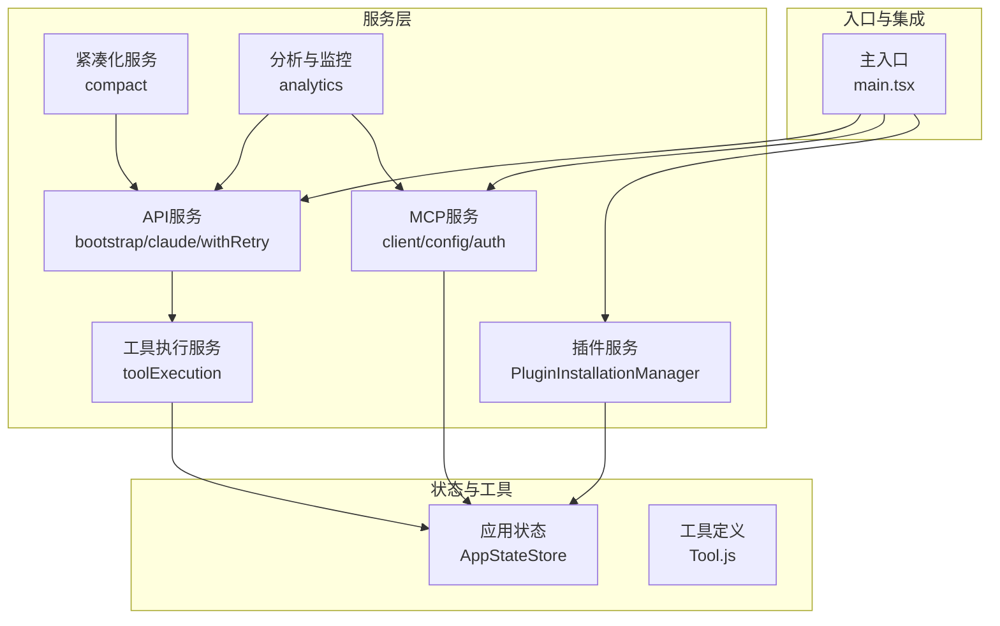
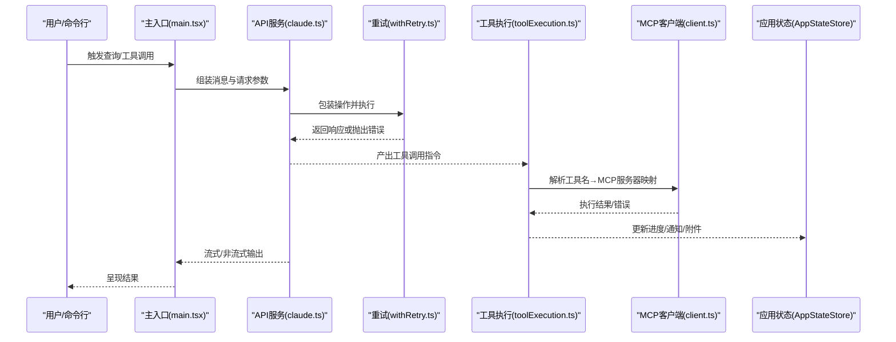
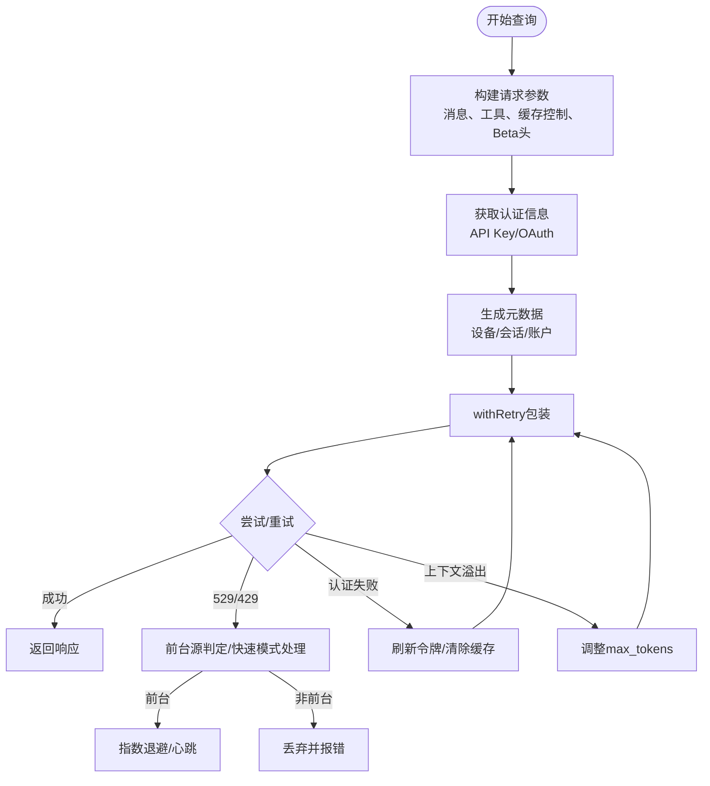
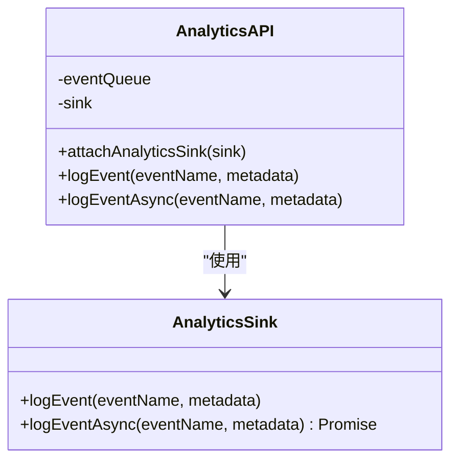
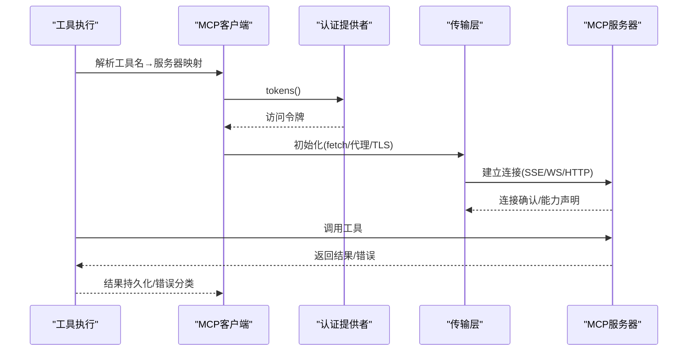
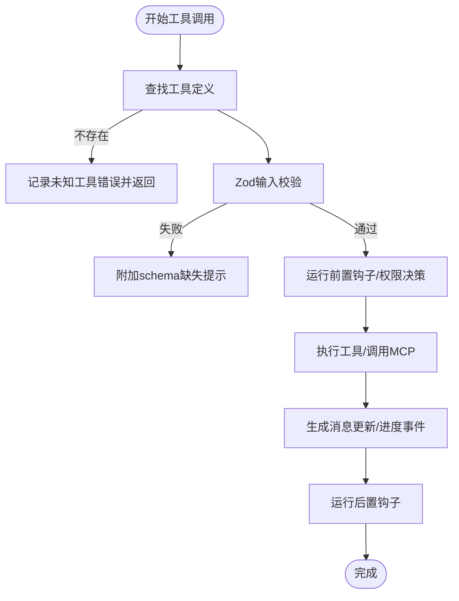
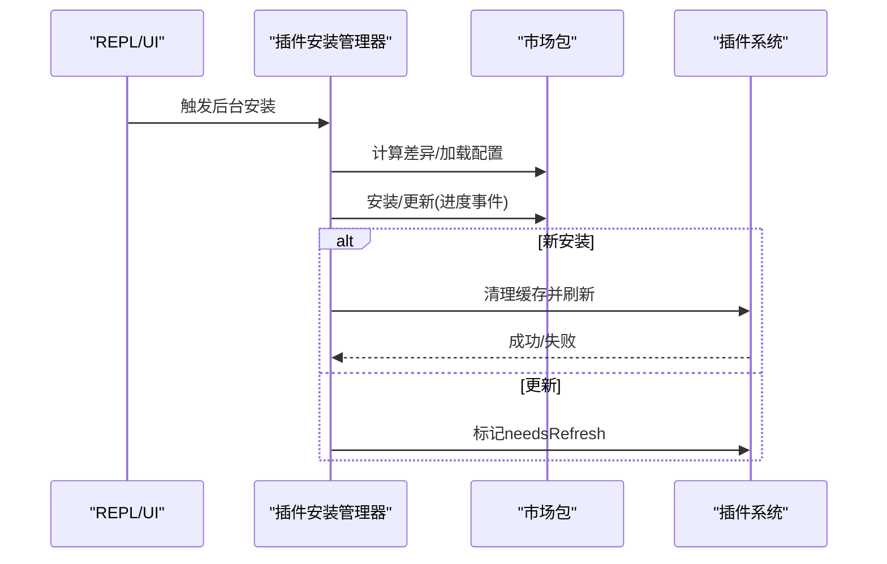
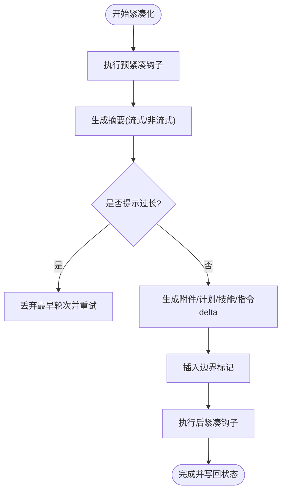
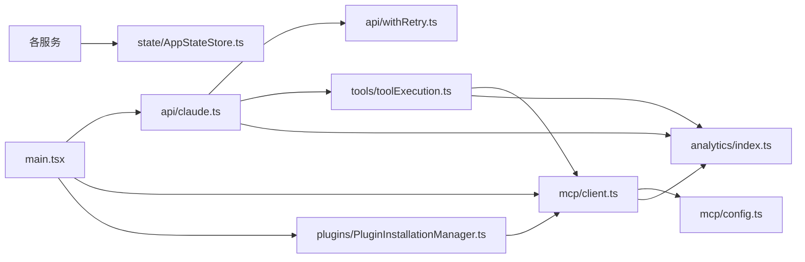

# 服务层架构

<cite>
**本文档引用的文件**
- [src/main.tsx](file://src/main.tsx)
- [src/services/api/bootstrap.ts](file://src/services/api/bootstrap.ts)
- [src/services/api/claude.ts](file://src/services/api/claude.ts)
- [src/services/api/withRetry.ts](file://src/services/api/withRetry.ts)
- [src/services/mcp/client.ts](file://src/services/mcp/client.ts)
- [src/services/mcp/config.ts](file://src/services/mcp/config.ts)
- [src/services/plugins/PluginInstallationManager.ts](file://src/services/plugins/PluginInstallationManager.ts)
- [src/services/tools/toolExecution.ts](file://src/services/tools/toolExecution.ts)
- [src/services/compact/compact.ts](file://src/services/compact/compact.ts)
- [src/services/analytics/index.ts](file://src/services/analytics/index.ts)
- [src/state/AppStateStore.ts](file://src/state/AppStateStore.ts)
</cite>

## 目录
1. [引言](#引言)
2. [项目结构](#项目结构)
3. [核心组件](#核心组件)
4. [架构总览](#架构总览)
5. [详细组件分析](#详细组件分析)
6. [依赖分析](#依赖分析)
7. [性能考虑](#性能考虑)
8. [故障排除指南](#故障排除指南)
9. [结论](#结论)

## 引言
本文件面向Claude Code的服务层架构，系统化阐述其整体设计原则、职责划分与实现模式，覆盖API客户端、业务逻辑封装、MCP连接与插件系统、分析与监控、以及与工具系统、状态管理、权限控制的协作方式。文档同时给出架构图与数据流图，帮助读者快速理解服务层在端到端查询链路中的位置与作用。

## 项目结构
服务层位于src/services目录下，按功能域划分为多个子模块：
- API相关：bootstrap、claude、withRetry、files、usage、errors等
- 分析与监控：analytics（含sink、datadog、growthbook等）
- MCP：client、config、auth、types、utils等
- 工具执行：toolExecution、toolHooks、toolOrchestration等
- 插件：PluginInstallationManager、pluginOperations等
- 紧凑化与上下文管理：compact、apiMicrocompact、microCompact等
- 其他支撑：tokenEstimation、rateLimit、voice、tips等

**图表来源**
- [src/main.tsx](file://src/main.tsx)
- [src/services/api/bootstrap.ts](file://src/services/api/bootstrap.ts)
- [src/services/api/claude.ts](file://src/services/api/claude.ts)
- [src/services/mcp/client.ts](file://src/services/mcp/client.ts)
- [src/services/plugins/PluginInstallationManager.ts](file://src/services/plugins/PluginInstallationManager.ts)
- [src/services/tools/toolExecution.ts](file://src/services/tools/toolExecution.ts)
- [src/services/compact/compact.ts](file://src/services/compact/compact.ts)
- [src/services/analytics/index.ts](file://src/services/analytics/index.ts)
- [src/state/AppStateStore.ts](file://src/state/AppStateStore.ts)

**章节来源**
- [src/main.tsx](file://src/main.tsx)
- [src/services/api/bootstrap.ts](file://src/services/api/bootstrap.ts)
- [src/services/api/claude.ts](file://src/services/api/claude.ts)
- [src/services/mcp/client.ts](file://src/services/mcp/client.ts)
- [src/services/plugins/PluginInstallationManager.ts](file://src/services/plugins/PluginInstallationManager.ts)
- [src/services/tools/toolExecution.ts](file://src/services/tools/toolExecution.ts)
- [src/services/compact/compact.ts](file://src/services/compact/compact.ts)
- [src/services/analytics/index.ts](file://src/services/analytics/index.ts)
- [src/state/AppStateStore.ts](file://src/state/AppStateStore.ts)

## 核心组件
- API客户端与请求编排：负责消息格式化、头部与元数据组装、提示缓存控制、环境变量与Beta参数注入、以及与Anthropic SDK的交互。
- 重试与退避：统一的withRetry机制，支持529/429/401/认证刷新、上下文溢出自适应调整、持久会话心跳、以及快速模式下的缓存保护。
- MCP连接与工具桥接：抽象不同传输协议（HTTP/SSE/WebSocket/stdio），统一认证与鉴权失败处理，工具调用与结果存储。
- 工具执行管线：输入校验、权限决策钩子、进度事件、错误分类与上报、以及与MCP服务器的映射。
- 插件安装与市场同步：后台自动安装/更新市场包，插件变更后触发MCP重连与刷新。
- 紧凑化与上下文管理：基于会话历史的摘要生成、边界标记、附件重建、以及与提示缓存检测的协同。
- 分析与监控：事件队列、异步/同步日志、多后端导出、采样与脱敏。

**章节来源**
- [src/services/api/claude.ts](file://src/services/api/claude.ts)
- [src/services/api/withRetry.ts](file://src/services/api/withRetry.ts)
- [src/services/mcp/client.ts](file://src/services/mcp/client.ts)
- [src/services/tools/toolExecution.ts](file://src/services/tools/toolExecution.ts)
- [src/services/plugins/PluginInstallationManager.ts](file://src/services/plugins/PluginInstallationManager.ts)
- [src/services/compact/compact.ts](file://src/services/compact/compact.ts)
- [src/services/analytics/index.ts](file://src/services/analytics/index.ts)

## 架构总览
服务层围绕“查询—工具—连接”三轴展开：
- 查询轴：从消息构建、模型选择、思考配置、到流式/非流式响应；贯穿重试、缓存、配额与速率限制。
- 工具轴：工具发现、输入验证、权限钩子、执行进度、结果存储与附件重建。
- 连接轴：MCP服务器发现、配置合并与去重、传输层抽象、鉴权与会话失效处理。

**图表来源**
- [src/main.tsx](file://src/main.tsx)
- [src/services/api/claude.ts](file://src/services/api/claude.ts)
- [src/services/api/withRetry.ts](file://src/services/api/withRetry.ts)
- [src/services/tools/toolExecution.ts](file://src/services/tools/toolExecution.ts)
- [src/services/mcp/client.ts](file://src/services/mcp/client.ts)
- [src/state/AppStateStore.ts](file://src/state/AppStateStore.ts)

## 详细组件分析

### API服务（API客户端、请求编排与重试）
- 消息与参数组装：将用户/助手消息转换为API参数，支持提示缓存控制、额外body参数注入、Beta头与输出配置。
- 认证与元数据：根据当前认证状态选择API Key或OAuth Bearer，并生成设备/会话/账户元数据。
- 重试与退避：统一的withRetry包装器，支持529/429/401/认证刷新、上下文溢出自适应max_tokens调整、持久会话心跳、以及快速模式下的缓存保护。
- 错误分类与回退：对529场景在前台源（如repl_main_thread、sdk）进行重试，非前台源直接放弃；在特定条件下触发模型回退（如从Opus回退到标准模型）。

**图表来源**
- [src/services/api/claude.ts](file://src/services/api/claude.ts)
- [src/services/api/withRetry.ts](file://src/services/api/withRetry.ts)

**章节来源**
- [src/services/api/claude.ts](file://src/services/api/claude.ts)
- [src/services/api/withRetry.ts](file://src/services/api/withRetry.ts)

### 分析与监控服务（事件日志与导出）
- 事件队列：在sink未就绪前将事件入队，sink就绪后异步冲刷。
- 多后端导出：通过sink接口路由至Datadog与第一方事件记录，支持字段脱敏与Proto字段分离。
- 采样与安全：事件元数据类型约束，避免敏感字符串进入日志；提供stripProtoFields用于通用存储前的字段剥离。

**图表来源**
- [src/services/analytics/index.ts](file://src/services/analytics/index.ts)

**章节来源**
- [src/services/analytics/index.ts](file://src/services/analytics/index.ts)

### MCP服务（连接、认证与工具桥接）
- 传输抽象：统一SSE/HTTP/WebSocket/stdio/sdk/IDE等传输，封装fetch超时、Accept头规范化、代理与TLS选项。
- 鉴权与会话：OAuth Bearer注入、401自动刷新、会话过期检测（HTTP 404 JSON-RPC -32001）、15分钟鉴权缓存。
- 工具映射：从工具名解析MCP服务器与传输类型，提取安全的服务器基础URL用于分析上报。
- 配置与策略：企业级允许/拒绝列表、命令/URL模式匹配、签名去重、代理URL解包。

**图表来源**
- [src/services/mcp/client.ts](file://src/services/mcp/client.ts)
- [src/services/mcp/config.ts](file://src/services/mcp/config.ts)

**章节来源**
- [src/services/mcp/client.ts](file://src/services/mcp/client.ts)
- [src/services/mcp/config.ts](file://src/services/mcp/config.ts)

### 工具执行服务（权限、钩子与进度）
- 输入校验：Zod Schema校验与延迟工具schema缺失提示，确保参数类型正确。
- 权限与钩子：预/后置钩子、权限决策、慢阶段日志阈值、分类器预检（如Bash）。
- 进度与事件：将进度事件与最终结果统一为消息流，支持取消与中断。
- 错误分类：区分工具未知、输入校验失败、权限拒绝、MCP认证错误等，分别上报不同事件。

**图表来源**
- [src/services/tools/toolExecution.ts](file://src/services/tools/toolExecution.ts)

**章节来源**
- [src/services/tools/toolExecution.ts](file://src/services/tools/toolExecution.ts)

### 插件服务（安装与刷新）
- 后台安装：扫描已声明与已物化的市场包差异，批量安装/更新，UI状态映射。
- 自动刷新：新安装市场包后自动刷新插件缓存并触发MCP重连；更新则提示手动刷新。
- 市场包缓存清理：在安装/更新后清理缓存以避免陈旧状态。

**图表来源**
- [src/services/plugins/PluginInstallationManager.ts](file://src/services/plugins/PluginInstallationManager.ts)

**章节来源**
- [src/services/plugins/PluginInstallationManager.ts](file://src/services/plugins/PluginInstallationManager.ts)

### 紧凑化服务（上下文压缩与恢复）
- 摘要生成：对早期对话进行总结，保留近期上下文，插入边界标记与附件（计划、技能、delta等）。
- 提示过长处理：当紧凑化请求本身超限时，通过丢弃最早API轮次来缓解。
- 使用统计与事件：记录紧凑前后token数、缓存读写、prompt缓存共享策略等指标。

**图表来源**
- [src/services/compact/compact.ts](file://src/services/compact/compact.ts)

**章节来源**
- [src/services/compact/compact.ts](file://src/services/compact/compact.ts)

## 依赖分析
- 主入口依赖：主入口在启动阶段初始化分析门禁、拉取引导数据、预取MCP官方URL、加载策略与设置，随后启动deferred prefetches。
- 服务间耦合：API服务与重试模块强耦合；工具执行服务依赖MCP客户端与分析服务；MCP服务依赖配置与认证模块；插件服务依赖市场包与MCP重连。
- 状态与工具：所有服务通过AppStateStore暴露的状态与回调进行UI联动与任务状态管理。

**图表来源**
- [src/main.tsx](file://src/main.tsx)
- [src/services/api/claude.ts](file://src/services/api/claude.ts)
- [src/services/api/withRetry.ts](file://src/services/api/withRetry.ts)
- [src/services/mcp/client.ts](file://src/services/mcp/client.ts)
- [src/services/mcp/config.ts](file://src/services/mcp/config.ts)
- [src/services/plugins/PluginInstallationManager.ts](file://src/services/plugins/PluginInstallationManager.ts)
- [src/services/tools/toolExecution.ts](file://src/services/tools/toolExecution.ts)
- [src/services/analytics/index.ts](file://src/services/analytics/index.ts)
- [src/state/AppStateStore.ts](file://src/state/AppStateStore.ts)

**章节来源**
- [src/main.tsx](file://src/main.tsx)
- [src/services/api/claude.ts](file://src/services/api/claude.ts)
- [src/services/api/withRetry.ts](file://src/services/api/withRetry.ts)
- [src/services/mcp/client.ts](file://src/services/mcp/client.ts)
- [src/services/mcp/config.ts](file://src/services/mcp/config.ts)
- [src/services/plugins/PluginInstallationManager.ts](file://src/services/plugins/PluginInstallationManager.ts)
- [src/services/tools/toolExecution.ts](file://src/services/tools/toolExecution.ts)
- [src/services/analytics/index.ts](file://src/services/analytics/index.ts)
- [src/state/AppStateStore.ts](file://src/state/AppStateStore.ts)

## 性能考虑
- 缓存与提示复用：提示缓存控制、1小时TTL策略、prompt缓存断点检测与通知，减少重复计算。
- 传输优化：MCP传输层强制Accept头、请求超时与定时器清理、代理与TLS选项配置，降低首字节延迟。
- 重试与退避：指数退避+抖动、持久会话心跳、快速模式下的缓存保护，平衡吞吐与一致性。
- 并发与批处理：MCP服务器连接批大小、插件后台安装批处理，避免阻塞主线程。
- UI与渲染：紧凑化与推测性渲染的进度反馈，减少用户等待感知。

## 故障排除指南
- 重试与回退
  - 529/429：前台源重试，非前台源直接放弃；必要时触发模型回退。
  - 上下文溢出：自动调整max_tokens，保留最小输出预算与思考预算。
  - 认证失败：401触发OAuth刷新，403检查令牌撤销，云厂商凭证错误触发缓存清理。
- MCP连接问题
  - 401/鉴权失败：记录需要鉴权事件并缓存15分钟；通过代理/鉴权提供者重试。
  - 会话过期：识别HTTP 404 JSON-RPC -32001，清理会话缓存并要求重新连接。
  - 传输异常：ECONNRESET/EPIPE触发keep-alive禁用与重连。
- 工具执行问题
  - 输入校验失败：附带schema缺失提示，指导用户先加载工具schema再调用。
  - 权限拒绝：通过钩子与权限决策源（规则/用户/钩子）标注来源，便于诊断。
  - MCP工具错误：区分MCP认证错误与工具调用错误，分别上报与处理。

**章节来源**
- [src/services/api/withRetry.ts](file://src/services/api/withRetry.ts)
- [src/services/mcp/client.ts](file://src/services/mcp/client.ts)
- [src/services/tools/toolExecution.ts](file://src/services/tools/toolExecution.ts)

## 结论
Claude Code的服务层以“查询—工具—连接”为核心轴，通过统一的API客户端、重试与退避、MCP传输抽象、工具执行管线、插件安装与刷新、以及紧凑化与上下文管理，实现了高可用、可观测、可扩展的端到端服务架构。配合分析与监控、状态管理与权限控制，服务层在保证用户体验的同时，提供了强大的扩展性与可维护性。