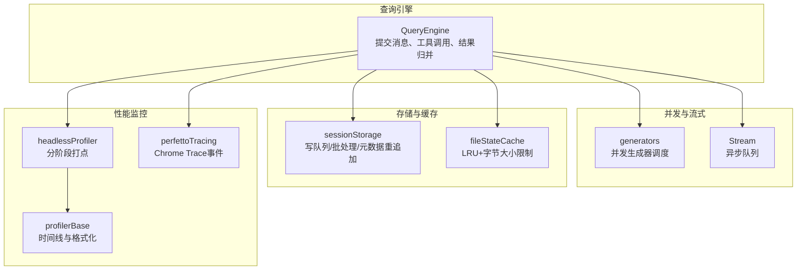
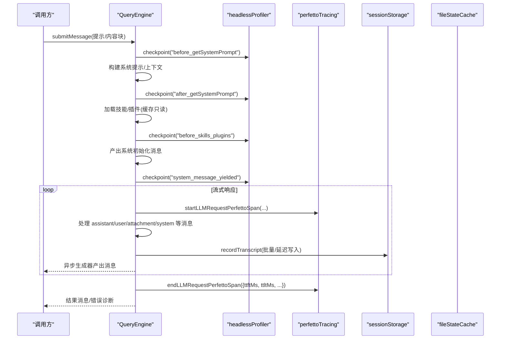
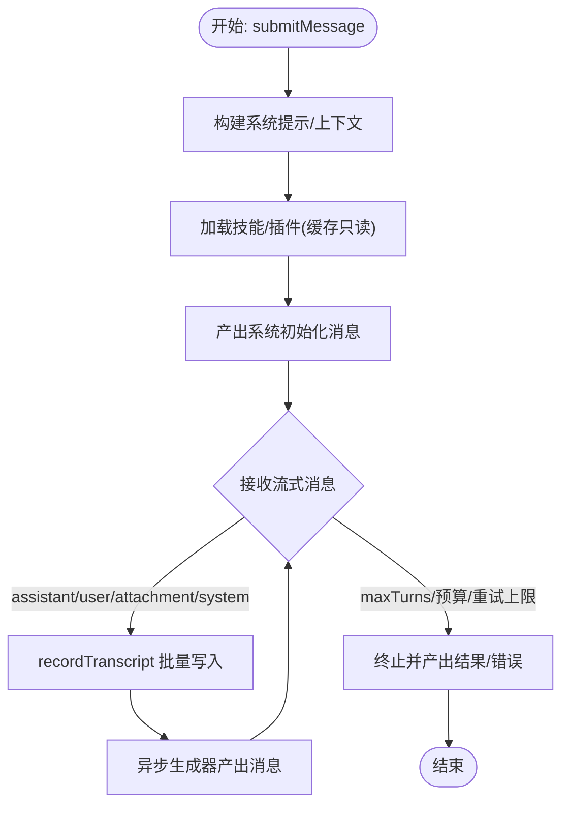
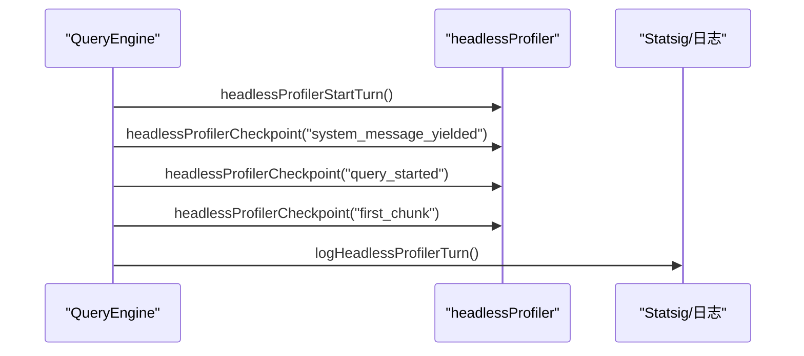
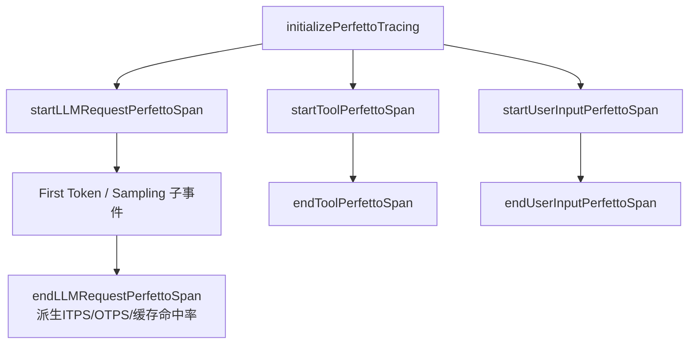
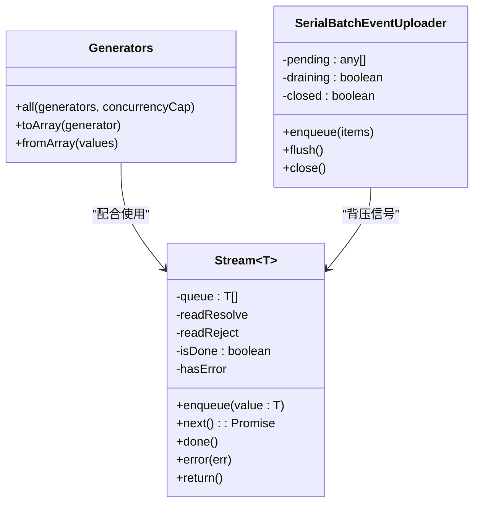
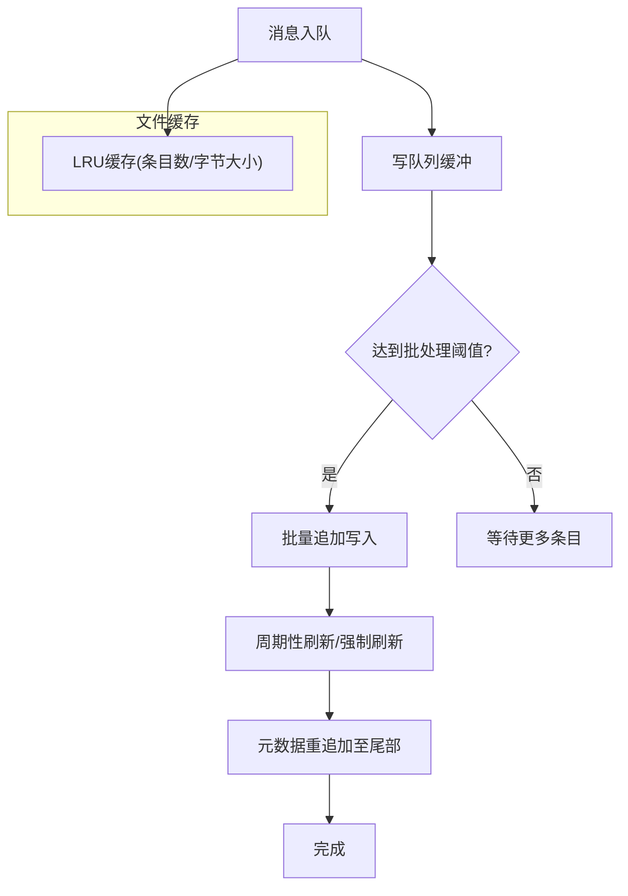
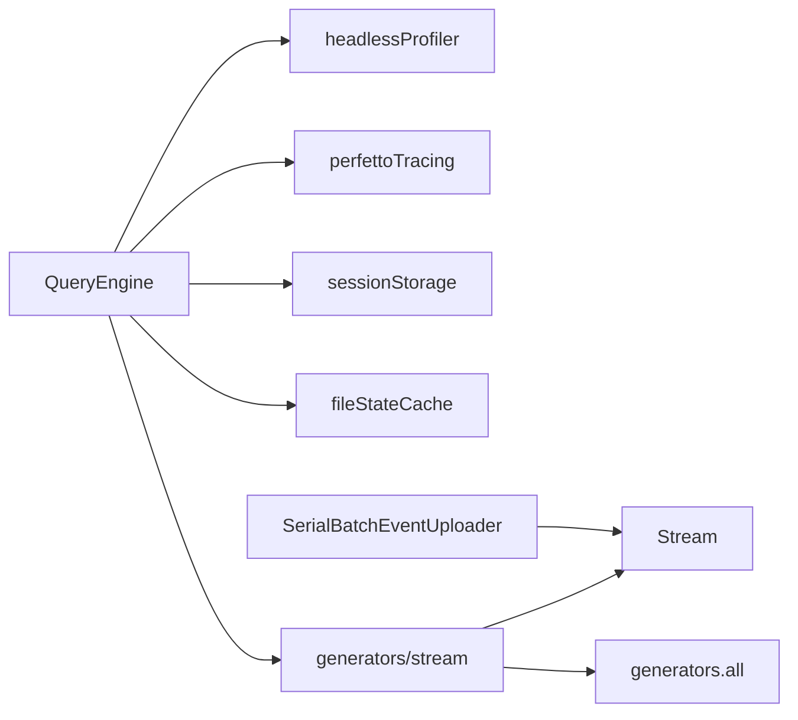

# 性能优化策略

<cite>
**本文引用的文件**
- [src/QueryEngine.ts](file://src/QueryEngine.ts)
- [src/utils/headlessProfiler.ts](file://src/utils/headlessProfiler.ts)
- [src/utils/profilerBase.ts](file://src/utils/profilerBase.ts)
- [src/utils/QueryGuard.ts](file://src/utils/QueryGuard.ts)
- [src/utils/stream.ts](file://src/utils/stream.ts)
- [src/utils/generators.ts](file://src/utils/generators.ts)
- [src/utils/telemetry/perfettoTracing.ts](file://src/utils/telemetry/perfettoTracing.ts)
- [src/utils/fileStateCache.ts](file://src/utils/fileStateCache.ts)
- [src/utils/sessionStorage.ts](file://src/utils/sessionStorage.ts)
- [src/cli/transports/SerialBatchEventUploader.ts](file://src/cli/transports/SerialBatchEventUploader.ts)
- [src/screens/REPL.tsx](file://src/screens/REPL.tsx)
</cite>

## 目录
1. [简介](#简介)
2. [项目结构](#项目结构)
3. [核心组件](#核心组件)
4. [架构总览](#架构总览)
5. [详细组件分析](#详细组件分析)
6. [依赖关系分析](#依赖关系分析)
7. [性能考量](#性能考量)
8. [故障排查指南](#故障排查指南)
9. [结论](#结论)
10. [附录](#附录)

## 简介
本文件聚焦于 Claude Code 的性能优化策略，围绕 QueryEngine 的实现进行深入剖析，涵盖以下主题：
- 消息缓存、异步处理与内存管理策略
- 性能监控机制（headlessProfiler 使用、性能指标采集与瓶颈分析）
- 并发处理优化（异步生成器、流式处理与背压控制）
- 内存效率优化（消息压缩、垃圾回收与资源池化）
- 关键性能指标与基准测试方法，展示不同优化策略对系统性能的影响与收益

## 项目结构
与性能优化直接相关的核心模块分布如下：
- QueryEngine：查询生命周期与会话状态管理，负责消息流转、工具调用与结果产出
- Profiling：headlessProfiler、profilerBase 提供统一的性能计时与报告格式
- Concurrency：Stream、generators 提供异步生成器与并发调度能力
- Storage：sessionStorage、fileStateCache 实现写队列、批处理与文件缓存的内存限制
- Telemetry：perfettoTracing 提供端到端跟踪与关键指标（TTFT、TTLT、ITPS、OTPS、缓存命中率等）

图表来源
- [src/QueryEngine.ts](file://src/QueryEngine.ts)
- [src/utils/generators.ts](file://src/utils/generators.ts)
- [src/utils/stream.ts](file://src/utils/stream.ts)
- [src/utils/sessionStorage.ts](file://src/utils/sessionStorage.ts)
- [src/utils/fileStateCache.ts](file://src/utils/fileStateCache.ts)
- [src/utils/headlessProfiler.ts](file://src/utils/headlessProfiler.ts)
- [src/utils/profilerBase.ts](file://src/utils/profilerBase.ts)
- [src/utils/telemetry/perfettoTracing.ts](file://src/utils/telemetry/perfettoTracing.ts)

章节来源
- [src/QueryEngine.ts](file://src/QueryEngine.ts)
- [src/utils/headlessProfiler.ts](file://src/utils/headlessProfiler.ts)
- [src/utils/profilerBase.ts](file://src/utils/profilerBase.ts)
- [src/utils/generators.ts](file://src/utils/generators.ts)
- [src/utils/stream.ts](file://src/utils/stream.ts)
- [src/utils/sessionStorage.ts](file://src/utils/sessionStorage.ts)
- [src/utils/fileStateCache.ts](file://src/utils/fileStateCache.ts)
- [src/utils/telemetry/perfettoTracing.ts](file://src/utils/telemetry/perfettoTracing.ts)

## 核心组件
- QueryEngine：负责一次对话的完整生命周期，包含系统提示构建、插件与技能加载、工具调用、消息持久化与结果聚合，并通过异步生成器逐段产出消息与结果。
- headlessProfiler：在非交互模式下记录关键阶段的时间戳，支持采样与详细日志输出，用于统计 TTFT、TTLT、查询开销等指标。
- perfettoTracing：生成 Chrome Trace 事件，覆盖 API 请求（TTFT/TTLT/ITPS/OTPS/缓存命中）、工具执行、用户输入等待等，便于可视化与深度瓶颈定位。
- generators/stream：提供并发生成器调度与异步队列，支撑流式处理与背压控制。
- sessionStorage/fileStateCache：实现写队列批处理、延迟刷新、元数据重追加与文件缓存的 LRU+字节大小限制，避免内存膨胀。

章节来源
- [src/QueryEngine.ts](file://src/QueryEngine.ts)
- [src/utils/headlessProfiler.ts](file://src/utils/headlessProfiler.ts)
- [src/utils/telemetry/perfettoTracing.ts](file://src/utils/telemetry/perfettoTracing.ts)
- [src/utils/generators.ts](file://src/utils/generators.ts)
- [src/utils/stream.ts](file://src/utils/stream.ts)
- [src/utils/sessionStorage.ts](file://src/utils/sessionStorage.ts)
- [src/utils/fileStateCache.ts](file://src/utils/fileStateCache.ts)

## 架构总览
QueryEngine 在非交互模式下通过 headlessProfiler 进行分阶段打点，同时 perfettoTracing 记录端到端事件；消息持久化由 sessionStorage 的写队列与批处理保障吞吐；并发与流式处理由 generators/stream 提供基础能力；文件缓存由 fileStateCache 控制内存占用。

图表来源
- [src/QueryEngine.ts](file://src/QueryEngine.ts)
- [src/utils/headlessProfiler.ts](file://src/utils/headlessProfiler.ts)
- [src/utils/telemetry/perfettoTracing.ts](file://src/utils/telemetry/perfettoTracing.ts)
- [src/utils/sessionStorage.ts](file://src/utils/sessionStorage.ts)

## 详细组件分析

### QueryEngine 性能优化要点
- 分阶段打点与监控
  - 在系统提示构建、技能/插件加载、系统消息产出等关键节点插入 headlessProfiler 时间标记，便于统计 TTFT、TTLT、查询开销等指标。
- 流式消息产出与持久化
  - 通过异步生成器逐段产出消息，结合 sessionStorage 的写队列与批处理，减少频繁磁盘 IO；仅在必要时机（如 compact_boundary）进行强制落盘，降低写放大。
- 工具调用与权限追踪
  - 包装 canUseTool 以记录权限拒绝信息，辅助后续诊断与性能回归分析。
- 资源边界控制
  - 通过 maxTurns、maxBudgetUsd、structured output 重试上限等参数，避免无界增长导致的资源耗尽。
- 历史压缩与内存释放
  - 在 SDK 场景下，compact_boundary 触发后主动清空历史消息与对应索引，释放内存，防止长期会话内存泄漏。

图表来源
- [src/QueryEngine.ts](file://src/QueryEngine.ts)
- [src/utils/sessionStorage.ts](file://src/utils/sessionStorage.ts)

章节来源
- [src/QueryEngine.ts](file://src/QueryEngine.ts)
- [src/utils/sessionStorage.ts](file://src/utils/sessionStorage.ts)

### headlessProfiler 与性能指标采集
- 分阶段打点
  - 支持 turn_start、system_message_yielded、query_started、first_chunk、api_request_sent 等关键阶段标记。
- 采样与日志
  - 通过环境变量控制是否启用详细日志与采样，避免对生产环境造成额外开销。
- 指标计算
  - 统计 time_to_system_message_ms、time_to_query_start_ms、time_to_first_response_ms、query_overhead_ms 等，用于评估端到端延迟与查询开销。

图表来源
- [src/utils/headlessProfiler.ts](file://src/utils/headlessProfiler.ts)

章节来源
- [src/utils/headlessProfiler.ts](file://src/utils/headlessProfiler.ts)

### perfettoTracing 与端到端跟踪
- 事件类型
  - API 请求（TTFT/TTLT/ITPS/OTPS/缓存命中）、工具执行、用户输入等待、代理层级关系等。
- 写入策略
  - 支持周期性写入与退出时写入，事件上限与陈旧跨度清理，避免内存无限增长。
- 指标导出
  - 自动派生 ITPS、OTPS、缓存命中率等指标，便于性能分析与回归对比。

图表来源
- [src/utils/telemetry/perfettoTracing.ts](file://src/utils/telemetry/perfettoTracing.ts)

章节来源
- [src/utils/telemetry/perfettoTracing.ts](file://src/utils/telemetry/perfettoTracing.ts)

### 并发处理优化：异步生成器、流式处理与背压控制
- generators.all 并发调度
  - 将多个 AsyncGenerator 并发运行，按完成顺序产出值，支持并发上限，避免过度并发导致的资源争用。
- Stream 异步队列
  - 提供 enqueue/next/done/error/return 接口，支持单次迭代约束与背压信号，避免无界缓冲。
- 背压控制示例
  - SerialBatchEventUploader 在入队超过最大队列时阻塞新入队请求，直到 drain 完成或关闭，确保内存与吞吐平衡。

图表来源
- [src/utils/stream.ts](file://src/utils/stream.ts)
- [src/utils/generators.ts](file://src/utils/generators.ts)
- [src/cli/transports/SerialBatchEventUploader.ts](file://src/cli/transports/SerialBatchEventUploader.ts)

章节来源
- [src/utils/generators.ts](file://src/utils/generators.ts)
- [src/utils/stream.ts](file://src/utils/stream.ts)
- [src/cli/transports/SerialBatchEventUploader.ts](file://src/cli/transports/SerialBatchEventUploader.ts)

### 内存效率优化：消息压缩、垃圾回收与资源池化
- 历史压缩与释放
  - compact_boundary 后主动清空历史消息与索引，避免长期会话内存泄漏；SDK 模式下更激进地截断历史以降低内存占用。
- 文件缓存限制
  - fileStateCache 使用 LRU，并基于字节大小计算，限制最大缓存体积，防止大文件导致内存膨胀。
- 写队列与批处理
  - sessionStorage 的写队列按阈值合并写入，减少磁盘碎片与 IO 次数；周期性刷新与尾部元数据重追加，保证可恢复性与可观测性。
- 资源池化
  - 插件与技能加载采用“缓存只读”策略，避免启动阶段网络阻塞；文件缓存与写队列作为轻量资源池，提升吞吐与稳定性。

图表来源
- [src/utils/sessionStorage.ts](file://src/utils/sessionStorage.ts)
- [src/utils/fileStateCache.ts](file://src/utils/fileStateCache.ts)

章节来源
- [src/utils/sessionStorage.ts](file://src/utils/sessionStorage.ts)
- [src/utils/fileStateCache.ts](file://src/utils/fileStateCache.ts)
- [src/QueryEngine.ts](file://src/QueryEngine.ts)

## 依赖关系分析
- QueryEngine 依赖 headlessProfiler 进行非交互模式下的延迟测量，依赖 perfettoTracing 进行端到端跟踪，依赖 sessionStorage 与 fileStateCache 进行持久化与缓存控制。
- generators/stream 为 QueryEngine 的流式与并发处理提供基础设施，SerialBatchEventUploader 则在 CLI 传输层实现背压控制。

图表来源
- [src/QueryEngine.ts](file://src/QueryEngine.ts)
- [src/utils/headlessProfiler.ts](file://src/utils/headlessProfiler.ts)
- [src/utils/telemetry/perfettoTracing.ts](file://src/utils/telemetry/perfettoTracing.ts)
- [src/utils/sessionStorage.ts](file://src/utils/sessionStorage.ts)
- [src/utils/fileStateCache.ts](file://src/utils/fileStateCache.ts)
- [src/utils/generators.ts](file://src/utils/generators.ts)
- [src/utils/stream.ts](file://src/utils/stream.ts)
- [src/cli/transports/SerialBatchEventUploader.ts](file://src/cli/transports/SerialBatchEventUploader.ts)

章节来源
- [src/QueryEngine.ts](file://src/QueryEngine.ts)
- [src/utils/generators.ts](file://src/utils/generators.ts)
- [src/utils/stream.ts](file://src/utils/stream.ts)
- [src/utils/sessionStorage.ts](file://src/utils/sessionStorage.ts)
- [src/utils/fileStateCache.ts](file://src/utils/fileStateCache.ts)
- [src/utils/headlessProfiler.ts](file://src/utils/headlessProfiler.ts)
- [src/utils/telemetry/perfettoTracing.ts](file://src/utils/telemetry/perfettoTracing.ts)
- [src/cli/transports/SerialBatchEventUploader.ts](file://src/cli/transports/SerialBatchEventUploader.ts)

## 性能考量
- 查询并发与吞吐
  - 使用 generators.all 控制并发上限，避免过多并发导致 CPU/IO 抖动；结合 Stream 的背压机制，确保下游处理不过载。
- 写路径优化
  - sessionStorage 的写队列与批处理显著降低磁盘写放大；在 SDK 模式下，必要时强制刷新以保证可恢复性。
- 缓存与内存
  - fileStateCache 的 LRU+字节大小限制有效防止大文件导致的内存膨胀；QueryEngine 在 compact_boundary 后主动释放历史消息，避免长期会话内存泄漏。
- 监控与可观测性
  - headlessProfiler 与 perfettoTracing 提供细粒度延迟与吞吐指标，便于定位瓶颈与回归分析。

## 故障排查指南
- 非交互模式延迟异常
  - 检查 headlessProfiler 的各阶段时间戳与采样日志，确认是否存在查询开销过高或首响应过慢。
- 端到端性能问题
  - 导出 perfetto Trace，查看 API 请求、工具执行与用户等待阶段的耗时与重试情况，结合 ITPS/OTPS/缓存命中率判断瓶颈。
- 写入卡顿或磁盘压力
  - 检查 sessionStorage 的写队列长度与刷新频率，确认是否因批处理阈值设置不当导致写放大。
- 内存持续增长
  - 确认 compact_boundary 是否被正确触发与执行；检查 fileStateCache 的条目数与字节大小上限配置。

章节来源
- [src/utils/headlessProfiler.ts](file://src/utils/headlessProfiler.ts)
- [src/utils/telemetry/perfettoTracing.ts](file://src/utils/telemetry/perfettoTracing.ts)
- [src/utils/sessionStorage.ts](file://src/utils/sessionStorage.ts)
- [src/utils/fileStateCache.ts](file://src/utils/fileStateCache.ts)
- [src/QueryEngine.ts](file://src/QueryEngine.ts)

## 结论
QueryEngine 的性能优化围绕“分阶段监控、流式处理、背压控制、缓存与写队列优化”展开。通过 headlessProfiler 与 perfettoTracing 的双轨监控体系，结合 generators/stream 的并发与流式能力，以及 sessionStorage/fileStateCache 的内存与持久化策略，系统在长会话、高吞吐场景下仍能保持稳定与高效。建议在不同部署场景下根据延迟与吞吐目标调整并发上限、批处理阈值与缓存大小，并持续利用监控指标进行回归分析与优化迭代。

## 附录
- 关键性能指标
  - TTFT（首次令牌时间）、TTLT（总延迟）、ITPS（输入令牌每秒）、OTPS（输出令牌每秒）、缓存命中率、查询开销、写入批大小、队列长度、缓存条目数与字节大小
- 基准测试方法
  - 使用 headlessProfiler 与 perfettoTracing 对比不同并发配置、缓存大小与批处理阈值下的端到端延迟与吞吐；在 CLI 模式下模拟多轮对话，统计平均 TTFT/TTLT、ITPS/OTPS 与内存峰值。

章节来源
- [src/utils/headlessProfiler.ts](file://src/utils/headlessProfiler.ts)
- [src/utils/telemetry/perfettoTracing.ts](file://src/utils/telemetry/perfettoTracing.ts)
- [src/screens/REPL.tsx](file://src/screens/REPL.tsx)