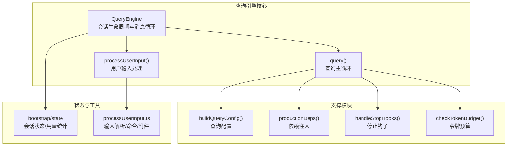
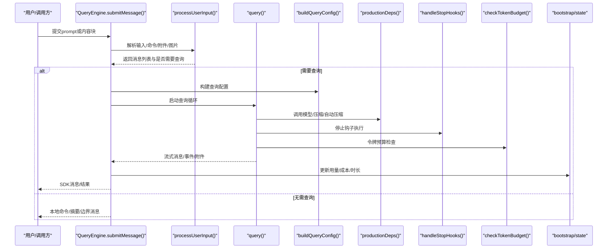
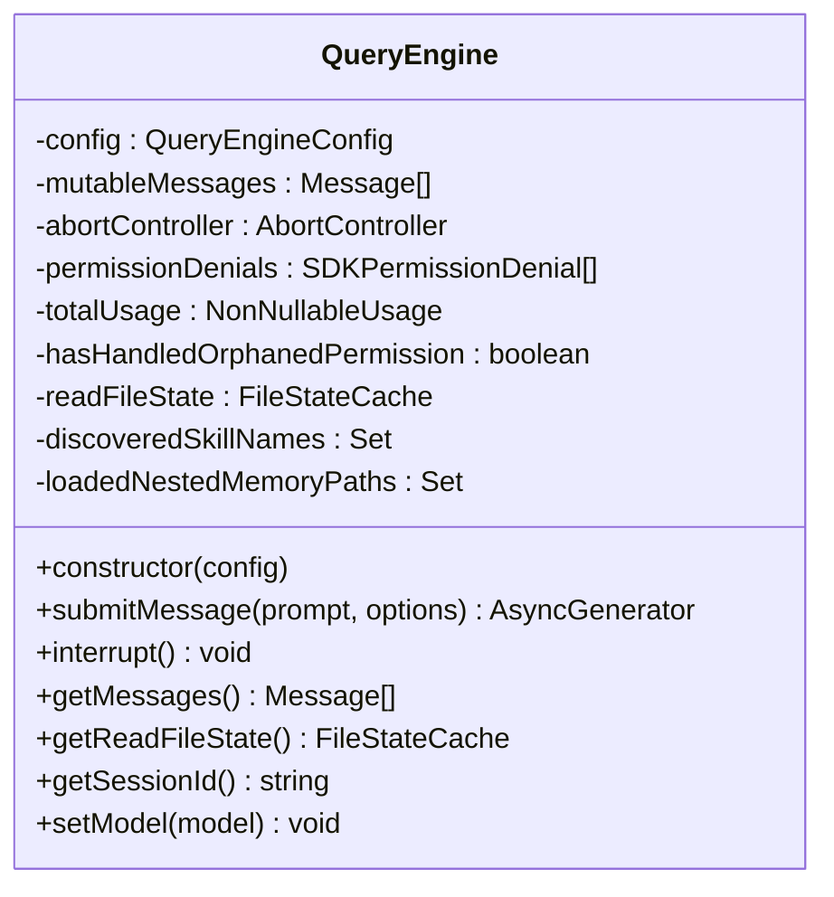
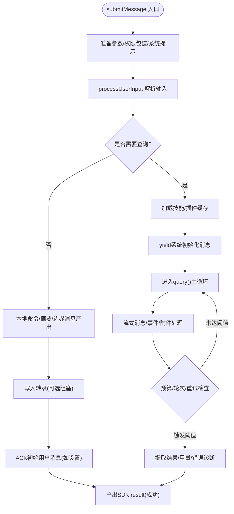
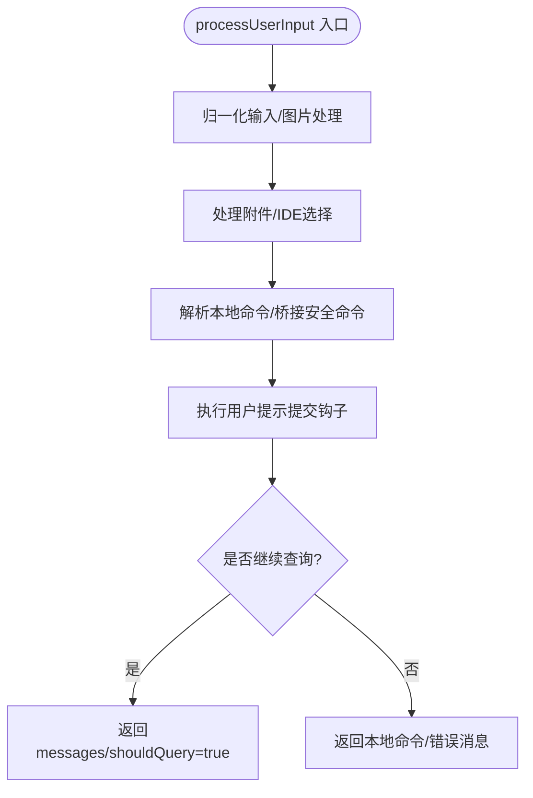
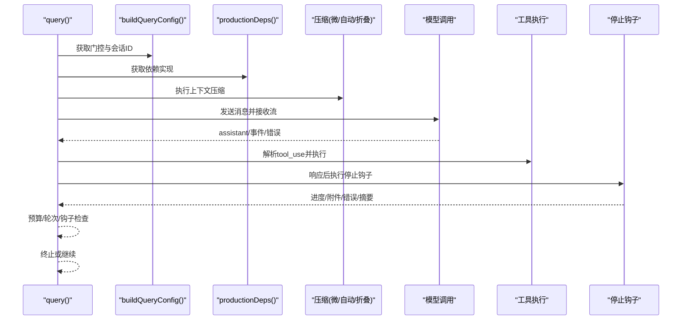
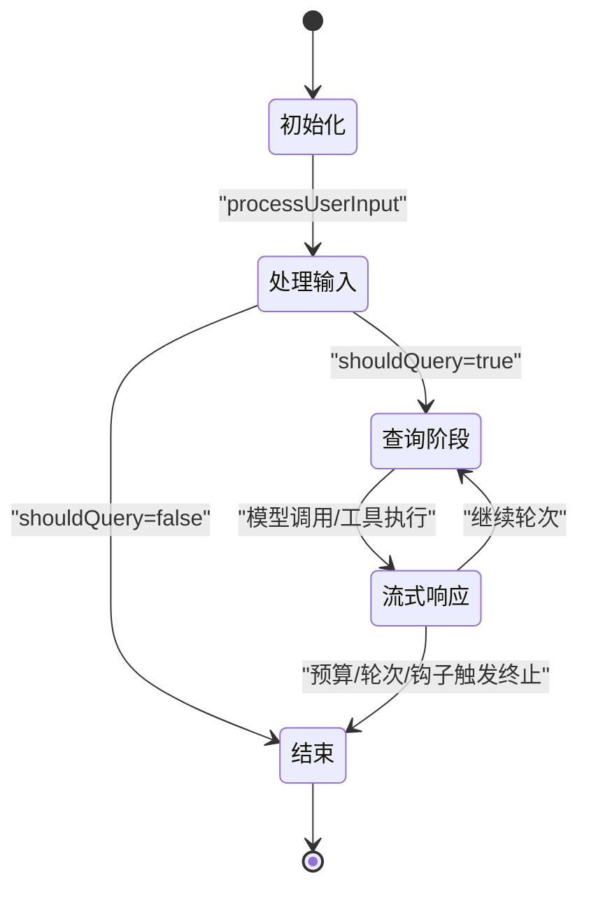
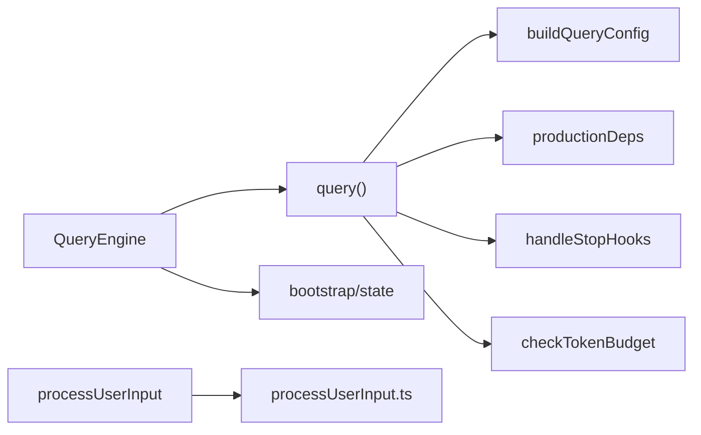

# 查询引擎核心

<cite>
**本文档引用的文件**
- [src/QueryEngine.ts](file://src/QueryEngine.ts)
- [src/query.ts](file://src/query.ts)
- [src/query/config.ts](file://src/query/config.ts)
- [src/query/deps.ts](file://src/query/deps.ts)
- [src/query/stopHooks.ts](file://src/query/stopHooks.ts)
- [src/query/tokenBudget.ts](file://src/query/tokenBudget.ts)
- [src/utils/processUserInput/processUserInput.ts](file://src/utils/processUserInput/processUserInput.ts)
- [src/bootstrap/state.ts](file://src/bootstrap/state.ts)
</cite>

## 目录
1. [简介](#简介)
2. [项目结构](#项目结构)
3. [核心组件](#核心组件)
4. [架构总览](#架构总览)
5. [详细组件分析](#详细组件分析)
6. [依赖分析](#依赖分析)
7. [性能考虑](#性能考虑)
8. [故障排查指南](#故障排查指南)
9. [结论](#结论)

## 简介
本文件面向Claude Code的查询引擎核心，系统性阐述QueryEngine类的设计架构、消息处理循环、查询执行流程与状态管理机制。重点覆盖以下主题：
- submitMessage()、processUserInput()、query()等关键方法的工作原理与调用关系
- 用户输入处理、工具调用、权限验证与响应生成的完整流程
- 查询引擎的状态管理模式（会话状态、工具状态、错误状态）
- 数据流图与处理流程（从输入到输出的端到端转换）
- 性能优化策略（缓存机制、并发处理、内存管理）

## 项目结构
查询引擎相关代码主要分布在以下模块：
- QueryEngine：会话生命周期与消息循环的核心类
- query：查询主循环与上下文压缩、工具执行、流式响应处理
- query/config、query/deps、query/stopHooks、query/tokenBudget：查询配置、依赖注入、停止钩子与令牌预算
- utils/processUserInput：用户输入解析、命令处理、附件与图片处理
- bootstrap/state：全局会话状态与用量统计

**图表来源**
- [src/QueryEngine.ts:184-1177](file://src/QueryEngine.ts#L184-L1177)
- [src/query.ts:219-1200](file://src/query.ts#L219-L1200)
- [src/query/config.ts:29-46](file://src/query/config.ts#L29-L46)
- [src/query/deps.ts:33-40](file://src/query/deps.ts#L33-L40)
- [src/query/stopHooks.ts:65-473](file://src/query/stopHooks.ts#L65-L473)
- [src/query/tokenBudget.ts:45-93](file://src/query/tokenBudget.ts#L45-L93)
- [src/utils/processUserInput/processUserInput.ts:85-270](file://src/utils/processUserInput/processUserInput.ts#L85-L270)
- [src/bootstrap/state.ts:431-800](file://src/bootstrap/state.ts#L431-L800)

**章节来源**
- [src/QueryEngine.ts:130-1177](file://src/QueryEngine.ts#L130-L1177)
- [src/query.ts:1-1200](file://src/query.ts#L1-L1200)
- [src/query/config.ts:1-47](file://src/query/config.ts#L1-L47)
- [src/query/deps.ts:1-41](file://src/query/deps.ts#L1-L41)
- [src/query/stopHooks.ts:1-474](file://src/query/stopHooks.ts#L1-L474)
- [src/query/tokenBudget.ts:1-94](file://src/query/tokenBudget.ts#L1-L94)
- [src/utils/processUserInput/processUserInput.ts:1-270](file://src/utils/processUserInput/processUserInput.ts#L1-L270)
- [src/bootstrap/state.ts:1-800](file://src/bootstrap/state.ts#L1-L800)

## 核心组件
- QueryEngine：封装一次对话的完整生命周期，负责消息持久化、权限记录、用量统计、转录记录与结果聚合。对外暴露submitMessage()异步生成器接口，内部协调processUserInput与query两大阶段。
- query：查询主循环，负责上下文压缩（微/自动）、工具发现与预取、模型调用、流式事件处理、停止钩子、预算控制与错误恢复。
- processUserInput：解析用户输入，识别并执行本地命令、处理粘贴图片与IDE选择、构建附件、触发用户提示提交钩子。
- 配置与依赖：buildQueryConfig与productionDeps提供运行时门控与I/O依赖注入；stopHooks与tokenBudget分别处理后处理逻辑与令牌预算。

**章节来源**
- [src/QueryEngine.ts:175-1177](file://src/QueryEngine.ts#L175-L1177)
- [src/query.ts:219-1200](file://src/query.ts#L219-L1200)
- [src/query/config.ts:29-46](file://src/query/config.ts#L29-L46)
- [src/query/deps.ts:33-40](file://src/query/deps.ts#L33-L40)
- [src/query/stopHooks.ts:65-473](file://src/query/stopHooks.ts#L65-L473)
- [src/query/tokenBudget.ts:45-93](file://src/query/tokenBudget.ts#L45-L93)
- [src/utils/processUserInput/processUserInput.ts:85-270](file://src/utils/processUserInput/processUserInput.ts#L85-L270)

## 架构总览
下图展示了从用户输入到最终结果的端到端数据流，以及各模块间的交互关系。

**图表来源**
- [src/QueryEngine.ts:209-1156](file://src/QueryEngine.ts#L209-L1156)
- [src/query.ts:219-1200](file://src/query.ts#L219-L1200)
- [src/query/config.ts:29-46](file://src/query/config.ts#L29-L46)
- [src/query/deps.ts:33-40](file://src/query/deps.ts#L33-L40)
- [src/query/stopHooks.ts:65-473](file://src/query/stopHooks.ts#L65-L473)
- [src/query/tokenBudget.ts:45-93](file://src/query/tokenBudget.ts#L45-L93)
- [src/bootstrap/state.ts:543-590](file://src/bootstrap/state.ts#L543-L590)

## 详细组件分析

### QueryEngine类设计与职责
- 会话生命周期：每个QueryEngine实例对应一次对话，submitMessage()启动新轮次，消息、文件缓存、用量等状态在多轮之间保持。
- 消息处理循环：submitMessage()内包含两阶段：processUserInput()用于解析与本地命令，随后进入query()进行模型调用与工具执行。
- 权限与审计：通过包装canUseTool追踪拒绝的工具使用，记录permission_denials供SDK返回。
- 状态管理：维护mutableMessages、totalUsage、readFileState、技能发现集合等；支持interrupt()中断、getMessages()/getReadFileState()查询状态。
- 结果聚合：在query()流结束后提取文本结果、stop_reason、用量与错误诊断，统一产出SDK result消息。

**图表来源**
- [src/QueryEngine.ts:184-207](file://src/QueryEngine.ts#L184-L207)
- [src/QueryEngine.ts:1158-1177](file://src/QueryEngine.ts#L1158-L1177)

**章节来源**
- [src/QueryEngine.ts:175-1177](file://src/QueryEngine.ts#L175-L1177)

### submitMessage()工作原理与调用关系
- 输入准备：解析cwd、工具、命令、MCP客户端、思考配置、最大轮次与预算等参数；初始化AbortController与用量统计。
- 权限包装：wrapCanUseTool()拦截工具决策，收集拒绝原因以便SDK报告。
- 系统提示构建：fetchSystemPromptParts()生成默认/自定义/附加系统提示，注入记忆机制提示（当启用覆盖路径）。
- 用户输入处理：processUserInput()解析prompt，执行本地命令、附件与图片处理，返回messages与shouldQuery标志。
- 会话持久化：在进入query前写入转录（可选阻塞），并在必要时刷新存储。
- 工具权限更新：根据用户输入结果更新ToolPermissionContext的alwaysAllowRules。
- 查询阶段：加载技能与插件缓存，yield系统初始化消息，随后进入query()主循环。
- 流式处理：对assistant/user/compact_boundary消息进行转录记录与ACK；对stream_event按需透传；对attachment进行边界/命令重放/最大轮次检测；对system消息处理API错误重试信号与紧凑边界。
- 终止条件：检查最大轮次、预算超支、结构化输出重试上限；最终提取文本结果与诊断错误，产出SDK result。

**图表来源**
- [src/QueryEngine.ts:209-1156](file://src/QueryEngine.ts#L209-L1156)

**章节来源**
- [src/QueryEngine.ts:209-1156](file://src/QueryEngine.ts#L209-L1156)

### processUserInput()工作原理
- 输入归一化：字符串或数组内容块（含图片）处理，先进行尺寸调整与元数据收集，再抽取最后文本块作为输入字符串。
- 附件与IDE选择：处理粘贴图片、IDE选择区域、桥接来源等上下文。
- 命令解析：识别并执行本地命令（如/force-snip），支持桥接安全命令与跳过斜杠命令模式。
- 钩子与阻断：执行用户提示提交钩子，支持阻止继续、附加上下文与阻断错误消息。
- 输出：返回messages、shouldQuery、allowedTools、model、resultText等，驱动后续query()或直接产出结果。

**图表来源**
- [src/utils/processUserInput/processUserInput.ts:85-270](file://src/utils/processUserInput/processUserInput.ts#L85-L270)
- [src/utils/processUserInput/processUserInput.ts:281-606](file://src/utils/processUserInput/processUserInput.ts#L281-L606)

**章节来源**
- [src/utils/processUserInput/processUserInput.ts:85-270](file://src/utils/processUserInput/processUserInput.ts#L85-L270)
- [src/utils/processUserInput/processUserInput.ts:281-606](file://src/utils/processUserInput/processUserInput.ts#L281-L606)

### query()查询主循环
- 配置与依赖：buildQueryConfig()快照运行时门控；productionDeps()注入模型调用、微压缩与自动压缩实现。
- 上下文压缩：按序执行snip、microcompact、contextCollapse与autocompact，产出压缩后的消息视图。
- 模型调用：prependUserContext拼接用户上下文，调用queryModelWithStreaming，逐块产出assistant消息与流事件。
- 工具执行：根据tool_use块执行工具，支持流式工具执行器；对失败尝试进行回退与孤儿消息墓碑清理。
- 停止钩子：在助手响应后执行，产出进度/附件/错误/摘要等消息，支持阻止继续与输出可见性控制。
- 预算与恢复：检查令牌预算与“最大输出令牌”等可恢复错误，必要时延迟或回收。
- 终止与收敛：根据stop_reason、轮次、预算与钩子结果决定终止，产出终端状态。

**图表来源**
- [src/query.ts:219-1200](file://src/query.ts#L219-L1200)
- [src/query/config.ts:29-46](file://src/query/config.ts#L29-L46)
- [src/query/deps.ts:33-40](file://src/query/deps.ts#L33-L40)
- [src/query/stopHooks.ts:65-473](file://src/query/stopHooks.ts#L65-L473)

**章节来源**
- [src/query.ts:219-1200](file://src/query.ts#L219-L1200)
- [src/query/config.ts:29-46](file://src/query/config.ts#L29-L46)
- [src/query/deps.ts:33-40](file://src/query/deps.ts#L33-L40)
- [src/query/stopHooks.ts:65-473](file://src/query/stopHooks.ts#L65-L473)

### 状态管理模式
- 会话状态：由bootstrap/state维护，包含sessionId、用量统计、令牌预算、工具/钩子时长计数、最近交互时间等。QueryEngine在结果中汇总用量与成本，供状态模块更新。
- 工具状态：processUserInputContext携带工具选项、代理定义、主题、预算等；QueryEngine在每轮开始重建上下文以反映最新消息与模型。
- 错误状态：通过getInMemoryErrors()水印记录错误范围；对API错误、钩子失败、预算超支等场景生成结构化错误消息与诊断信息。
- 文件历史与快照：在开启文件历史时，对可选用户消息生成快照，便于调试与恢复。

**图表来源**
- [src/QueryEngine.ts:675-1049](file://src/QueryEngine.ts#L675-L1049)
- [src/bootstrap/state.ts:543-781](file://src/bootstrap/state.ts#L543-L781)

**章节来源**
- [src/QueryEngine.ts:657-1049](file://src/QueryEngine.ts#L657-L1049)
- [src/bootstrap/state.ts:543-781](file://src/bootstrap/state.ts#L543-L781)

## 依赖分析
- 内聚与解耦：QueryEngine聚焦会话与消息循环，将模型调用、压缩、钩子与预算等职责委派给query.ts与其子模块，形成高内聚低耦合。
- 外部依赖：依赖注入（deps）与门控（config）确保测试可替换与特性开关可控；状态模块提供全局用量与预算指标。
- 可能的循环依赖：query.ts与stopHooks.ts存在相互协作（钩子可能触发query），但通过异步生成器与消息传递避免直接循环导入。

**图表来源**
- [src/QueryEngine.ts:1-1296](file://src/QueryEngine.ts#L1-L1296)
- [src/query.ts:1-1200](file://src/query.ts#L1-L1200)
- [src/query/config.ts:1-47](file://src/query/config.ts#L1-L47)
- [src/query/deps.ts:1-41](file://src/query/deps.ts#L1-L41)
- [src/query/stopHooks.ts:1-474](file://src/query/stopHooks.ts#L1-L474)
- [src/query/tokenBudget.ts:1-94](file://src/query/tokenBudget.ts#L1-L94)
- [src/utils/processUserInput/processUserInput.ts:1-270](file://src/utils/processUserInput/processUserInput.ts#L1-L270)
- [src/bootstrap/state.ts:1-800](file://src/bootstrap/state.ts#L1-L800)

**章节来源**
- [src/QueryEngine.ts:1-1296](file://src/QueryEngine.ts#L1-L1296)
- [src/query.ts:1-1200](file://src/query.ts#L1-L1200)
- [src/query/config.ts:1-47](file://src/query/config.ts#L1-L47)
- [src/query/deps.ts:1-41](file://src/query/deps.ts#L1-L41)
- [src/query/stopHooks.ts:1-474](file://src/query/stopHooks.ts#L1-L474)
- [src/query/tokenBudget.ts:1-94](file://src/query/tokenBudget.ts#L1-L94)
- [src/utils/processUserInput/processUserInput.ts:1-270](file://src/utils/processUserInput/processUserInput.ts#L1-L270)
- [src/bootstrap/state.ts:1-800](file://src/bootstrap/state.ts#L1-L800)

## 性能考虑
- 缓存机制
  - 技能与插件缓存：在headless/SDK模式下仅加载缓存，避免网络阻塞；支持插件热更新指令。
  - 微压缩与自动压缩：在query()中按需执行，减少上下文长度，降低API成本与延迟。
  - 提示缓存：系统提示分段缓存，结合门控与特性开关，避免重复计算。
- 并发处理
  - 图片处理并行：粘贴图片resize与存储并行执行，缩短输入处理时间。
  - 工具执行并行：流式工具执行器支持并发工具调用，配合去重与结果配对。
  - 钩子并行：停止钩子、任务完成钩子与空闲钩子并行执行，提升响应速度。
- 内存管理
  - 历史截断：HISTORY_SNIP在SDK模式下按边界截断历史，释放内存；紧凑边界消息触发前后消息切片。
  - 转录写入批处理：非阻塞fire-and-forget策略减少阻塞，必要时显式flush保证一致性。
  - 用量与预算：通过checkTokenBudget与任务预算限制输出规模，避免内存与成本失控。

**章节来源**
- [src/QueryEngine.ts:534-538](file://src/QueryEngine.ts#L534-L538)
- [src/query.ts:369-394](file://src/query.ts#L369-L394)
- [src/query.ts:413-426](file://src/query.ts#L413-L426)
- [src/query/tokenBudget.ts:45-93](file://src/query/tokenBudget.ts#L45-L93)
- [src/utils/processUserInput/processUserInput.ts:366-388](file://src/utils/processUserInput/processUserInput.ts#L366-L388)

## 故障排查指南
- 无有效响应
  - 检查isResultSuccessful判定与lastStopReason；若结果类型非assistant或user且stop_reason非end_turn，将返回error_during_execution并附带诊断前缀与错误日志水印范围。
- 预算超支
  - 当累计成本达到maxBudgetUsd时，立即产出error_max_budget_usd结果并终止。
- 最大轮次
  - 当轮次达到maxTurns时，产出error_max_turns结果并终止。
- 结构化输出重试上限
  - 对StructuredOutput工具调用次数进行统计与上限控制，超过阈值返回error_max_structured_output_retries。
- API错误与重试
  - system/api_retry消息携带重试次数、延迟与错误分类；必要时触发自动重试。
- 钩子错误
  - 停止钩子/任务完成钩子/空闲钩子产生的错误会以附件形式呈现，并在summary中汇总；可通过通知查看详细信息。

**章节来源**
- [src/QueryEngine.ts:1082-1118](file://src/QueryEngine.ts#L1082-L1118)
- [src/QueryEngine.ts:971-1048](file://src/QueryEngine.ts#L971-L1048)
- [src/QueryEngine.ts:841-874](file://src/QueryEngine.ts#L841-L874)
- [src/QueryEngine.ts:943-955](file://src/QueryEngine.ts#L943-L955)
- [src/query/stopHooks.ts:175-473](file://src/query/stopHooks.ts#L175-L473)

## 结论
QueryEngine通过清晰的职责划分与模块化设计，将用户输入处理、工具调用、权限验证与响应生成整合为统一的异步消息流。query()主循环在上下文压缩、工具执行与钩子后处理方面具备高度可扩展性；状态管理与预算控制保障了长期会话的稳定性与成本可控。借助缓存、并发与内存截断等策略，查询引擎在复杂任务场景下仍能保持高效与可靠。