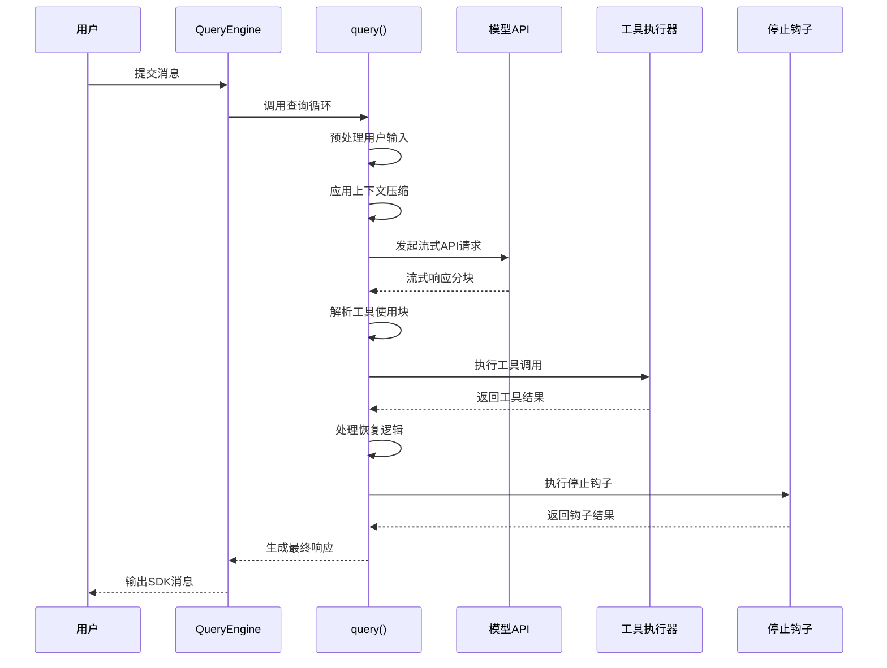
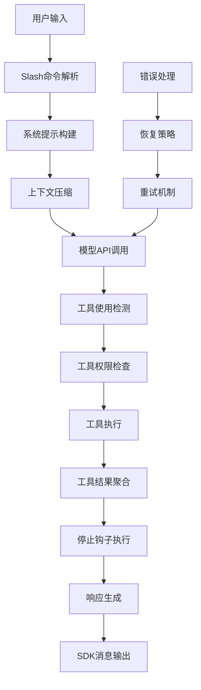
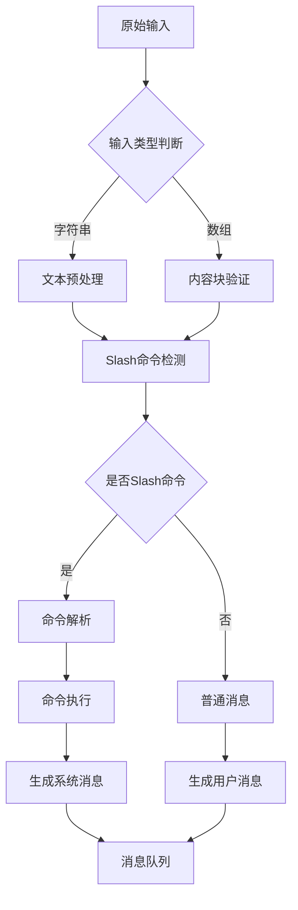
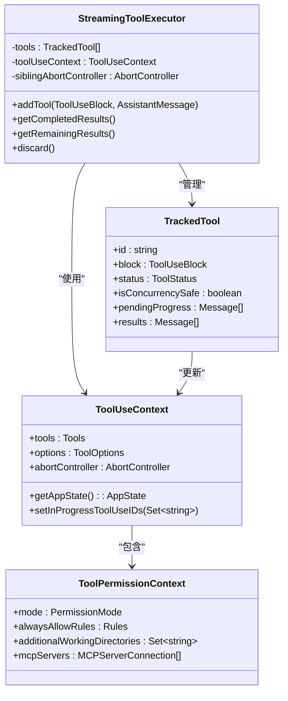
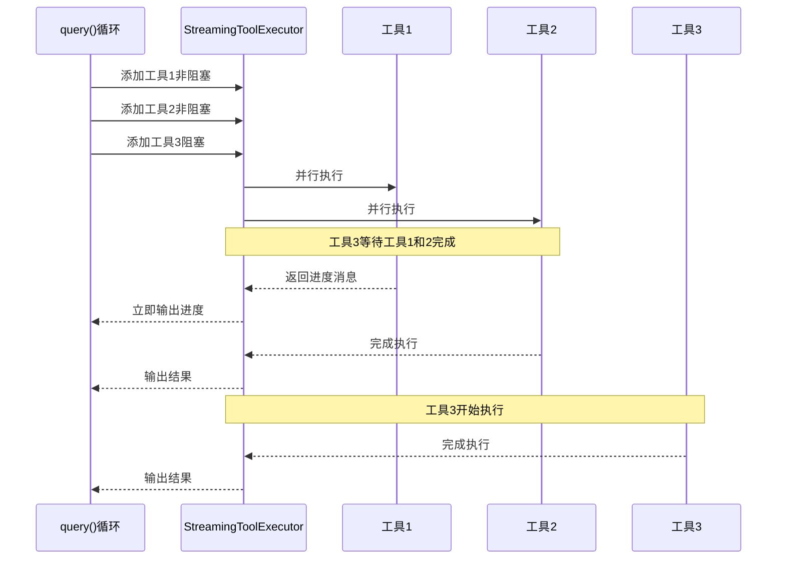
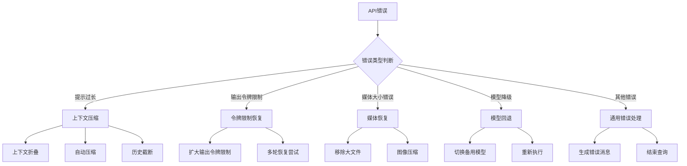
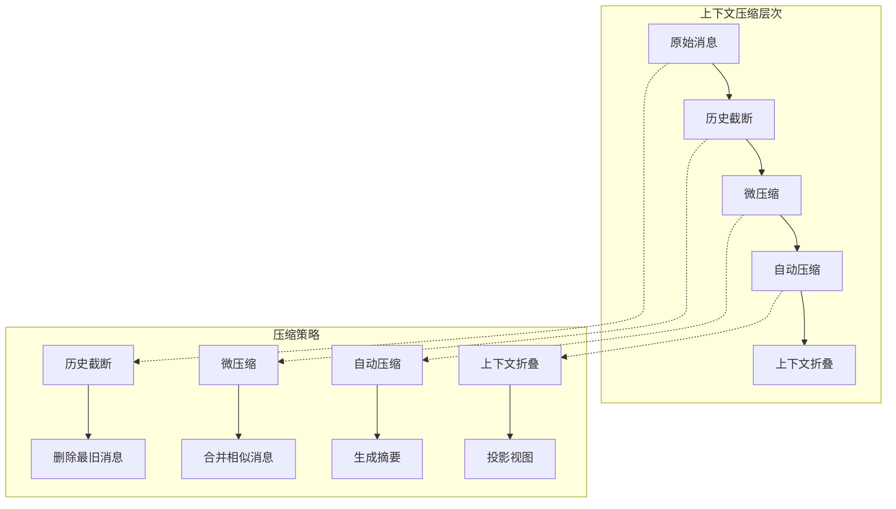
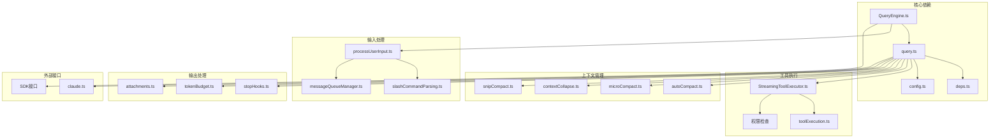
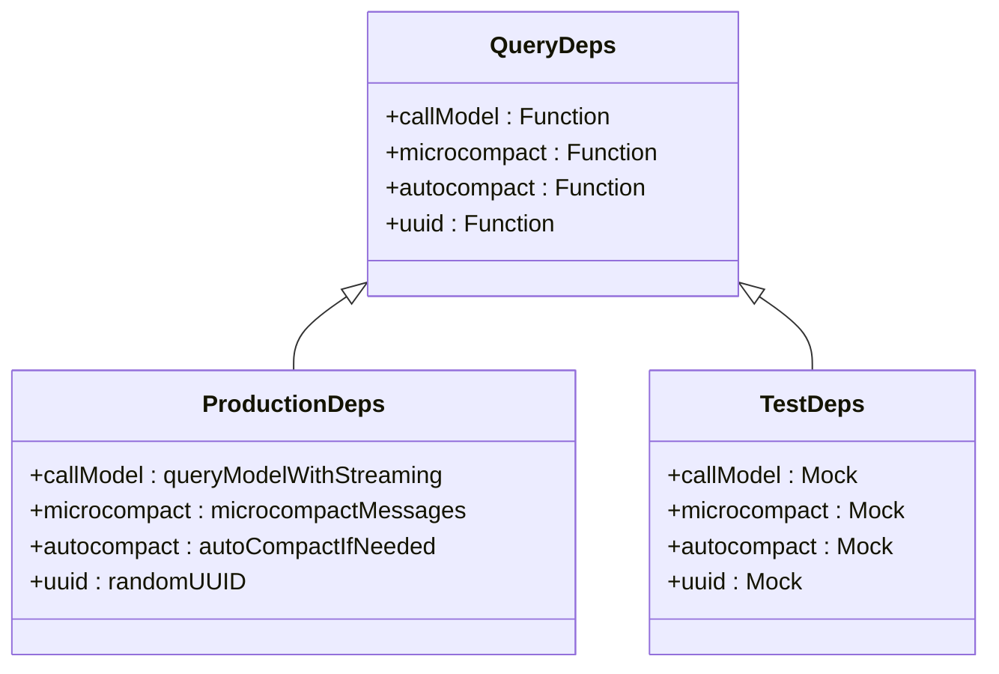

# 查询执行引擎

<cite>
**本文档引用的文件**
- [src/query.ts](file://src/query.ts)
- [src/QueryEngine.ts](file://src/QueryEngine.ts)
- [src/services/tools/StreamingToolExecutor.ts](file://src/services/tools/StreamingToolExecutor.ts)
- [src/utils/processUserInput/processUserInput.ts](file://src/utils/processUserInput/processUserInput.ts)
- [src/query/deps.ts](file://src/query/deps.ts)
- [src/query/config.ts](file://src/query/config.ts)
- [src/query/stopHooks.ts](file://src/query/stopHooks.ts)
- [src/query/tokenBudget.ts](file://src/query/tokenBudget.ts)
- [src/utils/slashCommandParsing.ts](file://src/utils/slashCommandParsing.ts)
- [src/utils/messageQueueManager.ts](file://src/utils/messageQueueManager.ts)
- [src/utils/queueProcessor.ts](file://src/utils/queueProcessor.ts)
- [src/services/api/claude.ts](file://src/services/api/claude.ts)
- [src/utils/permissions/permissions.ts](file://src/utils/permissions/permissions.ts)
- [src/utils/attachments.ts](file://src/utils/attachments.ts)
</cite>

## 目录
1. [简介](#简介)
2. [项目结构](#项目结构)
3. [核心组件](#核心组件)
4. [架构总览](#架构总览)
5. [详细组件分析](#详细组件分析)
6. [依赖关系分析](#依赖关系分析)
7. [性能考虑](#性能考虑)
8. [故障排除指南](#故障排除指南)
9. [结论](#结论)

## 简介

Claude Code 的查询执行引擎是整个系统的核心，负责将用户的自然语言输入转换为结构化的查询流程，协调工具调用、上下文管理、并发执行和响应生成。该引擎采用异步生成器模式，支持流式响应、工具并发执行、多阶段恢复机制和细粒度的错误处理。

查询执行引擎的关键特性包括：
- **多阶段查询构建**：从用户输入预处理开始，经过Slash命令解析、工具选择和参数验证，最终构建完整的查询上下文
- **并发执行框架**：通过StreamingToolExecutor实现工具的并发安全执行，支持阻塞型和非阻塞型工具的有序处理
- **智能恢复机制**：针对提示过长、输出令牌限制、媒体大小错误等场景提供多层恢复策略
- **上下文压缩优化**：集成自动压缩、微压缩、历史截断等多种上下文管理策略
- **权限与安全控制**：在工具执行前进行权限检查，确保安全的工具使用环境

## 项目结构

查询执行引擎主要由以下模块组成：

```mermaid
graph TB
subgraph "查询引擎核心"
QE[QueryEngine<br/>会话管理]
QF[query()<br/>主循环]
QC[QueryConfig<br/>配置快照]
QD[QueryDeps<br/>依赖注入]
end
subgraph "用户输入处理"
PUI[processUserInput<br/>输入预处理]
SCP[Slash命令解析]
MQM[消息队列管理]
end
subgraph "工具执行"
STE[StreamingToolExecutor<br/>并发执行器]
TH[工具权限检查]
TE[工具执行器]
end
subgraph "上下文管理"
AC[自动压缩]
MC[微压缩]
CC[上下文折叠]
HC[历史截断]
end
subgraph "响应生成"
SH[停止钩子]
TB[令牌预算]
ATT[附件生成]
end
QE --> QF
QF --> PUI
QF --> STE
QF --> AC
QF --> SH
STE --> TH
STE --> TE
QF --> ATT
QF --> TB
```

**图表来源**
- [src/QueryEngine.ts:184-207](file://src/QueryEngine.ts#L184-L207)
- [src/query.ts:219-239](file://src/query.ts#L219-L239)
- [src/query/config.ts:29-46](file://src/query/config.ts#L29-L46)
- [src/query/deps.ts:33-40](file://src/query/deps.ts#L33-L40)

**章节来源**
- [src/QueryEngine.ts:184-207](file://src/QueryEngine.ts#L184-L207)
- [src/query.ts:219-239](file://src/query.ts#L219-L239)
- [src/query/config.ts:29-46](file://src/query/config.ts#L29-L46)
- [src/query/deps.ts:33-40](file://src/query/deps.ts#L33-L40)

## 核心组件

### QueryEngine 类
QueryEngine 是查询执行引擎的主控制器，负责管理会话状态、处理用户输入和协调整个查询流程。

关键职责：
- **会话状态管理**：维护消息历史、文件缓存、使用统计等状态信息
- **用户输入处理**：解析Slash命令、处理本地命令、生成系统提示
- **查询生命周期**：协调单次查询的完整生命周期，包括工具执行和响应生成
- **SDK接口适配**：提供统一的SDK消息格式输出

### query() 函数
query() 是查询执行的核心循环，采用异步生成器模式实现流式处理。

主要流程：
1. **初始化阶段**：构建查询配置、启动内存预取、设置跟踪状态
2. **上下文准备**：应用微压缩、上下文折叠、自动压缩
3. **模型调用**：发起流式API请求，处理分块响应
4. **工具执行**：根据工具使用块执行相应的工具调用
5. **恢复处理**：处理各种错误场景的恢复逻辑
6. **停止钩子**：执行后采样钩子和清理操作

### StreamingToolExecutor 并发执行器
StreamingToolExecutor 实现了智能的工具并发执行，支持不同类型的工具并行处理。

并发策略：
- **非阻塞工具并行**：多个非阻塞工具可以同时执行
- **阻塞工具串行**：阻塞型工具需要独占执行环境
- **进度优先**：进度消息优先于结果消息输出
- **错误传播**：工具执行错误会传播到相关联的工具

**章节来源**
- [src/QueryEngine.ts:184-1177](file://src/QueryEngine.ts#L184-L1177)
- [src/query.ts:219-1599](file://src/query.ts#L219-L1599)
- [src/services/tools/StreamingToolExecutor.ts:40-531](file://src/services/tools/StreamingToolExecutor.ts#L40-L531)

## 架构总览

查询执行引擎采用分层架构设计，每层都有明确的职责分离：



**图表来源**
- [src/QueryEngine.ts:209-1156](file://src/QueryEngine.ts#L209-L1156)
- [src/query.ts:652-1052](file://src/query.ts#L652-L1052)

### 数据流架构



**图表来源**
- [src/utils/processUserInput/processUserInput.ts:85-200](file://src/utils/processUserInput/processUserInput.ts#L85-L200)
- [src/query.ts:800-1599](file://src/query.ts#L800-L1599)

## 详细组件分析

### 用户输入预处理

用户输入预处理是查询执行的第一道关卡，负责将原始输入转换为标准的消息格式。



**图表来源**
- [src/utils/processUserInput/processUserInput.ts:85-200](file://src/utils/processUserInput/processUserInput.ts#L85-L200)
- [src/utils/slashCommandParsing.ts:25-60](file://src/utils/slashCommandParsing.ts#L25-L60)

Slash命令解析支持以下功能：
- **基础Slash命令**：如 `/help`、`/clear` 等
- **MCP命令**：支持 `(MCP)` 标记的命令
- **参数提取**：自动解析命令参数和选项
- **命令验证**：验证命令的有效性和可用性

**章节来源**
- [src/utils/processUserInput/processUserInput.ts:85-200](file://src/utils/processUserInput/processUserInput.ts#L85-L200)
- [src/utils/slashCommandParsing.ts:25-60](file://src/utils/slashCommandParsing.ts#L25-L60)
- [src/utils/messageQueueManager.ts:525-547](file://src/utils/messageQueueManager.ts#L525-L547)

### 工具调用生命周期

工具调用生命周期包含权限检查、执行上下文设置和结果处理三个阶段。



**图表来源**
- [src/services/tools/StreamingToolExecutor.ts:40-531](file://src/services/tools/StreamingToolExecutor.ts#L40-L531)
- [src/utils/permissions/permissions.ts:1262-1297](file://src/utils/permissions/permissions.ts#L1262-L1297)

工具权限检查流程：
1. **模式检查**：检查当前权限模式（bypass、plan、auto等）
2. **规则匹配**：检查是否在总是允许的规则列表中
3. **MCP服务器检查**：验证MCP服务器连接状态
4. **输入验证**：验证工具输入参数的安全性
5. **交互式授权**：必要时弹出授权对话框

**章节来源**
- [src/services/tools/StreamingToolExecutor.ts:40-531](file://src/services/tools/StreamingToolExecutor.ts#L40-L531)
- [src/utils/permissions/permissions.ts:1262-1297](file://src/utils/permissions/permissions.ts#L1262-L1297)

### 并发处理机制

查询执行引擎实现了复杂的并发处理机制，支持多种工具类型的并行执行。



**图表来源**
- [src/services/tools/StreamingToolExecutor.ts:140-151](file://src/services/tools/StreamingToolExecutor.ts#L140-L151)
- [src/services/tools/StreamingToolExecutor.ts:453-490](file://src/services/tools/StreamingToolExecutor.ts#L453-L490)

并发控制策略：
- **非阻塞工具并行**：多个非阻塞工具可以同时执行，提高吞吐量
- **阻塞工具串行**：阻塞型工具需要独占执行环境，避免资源冲突
- **进度优先**：进度消息优先于结果消息输出，提升用户体验
- **错误隔离**：单个工具的错误不会影响其他工具的执行

**章节来源**
- [src/services/tools/StreamingToolExecutor.ts:140-151](file://src/services/tools/StreamingToolExecutor.ts#L140-L151)
- [src/services/tools/StreamingToolExecutor.ts:453-490](file://src/services/tools/StreamingToolExecutor.ts#L453-L490)

### 错误恢复策略

查询执行引擎针对不同的错误场景提供了多层次的恢复策略。



**图表来源**
- [src/query.ts:1062-1183](file://src/query.ts#L1062-L1183)
- [src/query.ts:1185-1256](file://src/query.ts#L1185-L1256)

恢复策略详解：
- **提示过长恢复**：优先尝试上下文折叠，然后自动压缩，最后历史截断
- **输出令牌限制恢复**：先尝试扩大令牌限制，多次失败后生成恢复消息
- **媒体大小错误恢复**：移除或压缩超大媒体文件，重新执行
- **模型降级恢复**：切换到备用模型，重新执行整个请求

**章节来源**
- [src/query.ts:1062-1256](file://src/query.ts#L1062-L1256)

### 上下文管理

查询执行引擎实现了多层上下文管理策略，确保在有限的上下文窗口内最大化信息密度。



**图表来源**
- [src/query.ts:400-447](file://src/query.ts#L400-L447)
- [src/query.ts:448-543](file://src/query.ts#L448-L543)

压缩策略特点：
- **历史截断**：在达到阈值时删除最旧的历史消息
- **微压缩**：合并相似的用户消息和工具结果
- **自动压缩**：生成智能摘要，保留关键信息
- **上下文折叠**：在不改变语义的前提下减少消息数量

**章节来源**
- [src/query.ts:400-543](file://src/query.ts#L400-L543)

## 依赖关系分析

查询执行引擎的依赖关系体现了清晰的关注点分离和模块化设计。



**图表来源**
- [src/query.ts:102-105](file://src/query.ts#L102-L105)
- [src/QueryEngine.ts:35-39](file://src/QueryEngine.ts#L35-L39)
- [src/query/deps.ts:21-31](file://src/query/deps.ts#L21-L31)

### 依赖注入模式

查询执行引擎采用依赖注入模式，通过 `productionDeps()` 函数提供生产环境的依赖实现。



**图表来源**
- [src/query/deps.ts:21-40](file://src/query/deps.ts#L21-L40)

这种设计的优势：
- **测试友好**：可以通过注入测试替身轻松测试各个组件
- **运行时可配置**：支持在运行时切换不同的实现
- **关注点分离**：业务逻辑与具体实现解耦

**章节来源**
- [src/query/deps.ts:21-40](file://src/query/deps.ts#L21-L40)
- [src/query/config.ts:29-46](file://src/query/config.ts#L29-L46)

## 性能考虑

查询执行引擎在设计时充分考虑了性能优化，采用了多种策略来提升整体性能。

### 内存管理优化

- **消息分页**：通过上下文压缩和历史截断控制消息数量
- **增量写入**：使用增量方式记录会话状态，避免全量写入
- **缓存策略**：合理使用LRU缓存减少重复计算
- **流式处理**：采用流式处理模式，避免一次性加载所有数据

### 并发优化

- **工具并发**：非阻塞工具并行执行，提高整体吞吐量
- **进度优先**：进度消息优先输出，改善用户体验
- **资源隔离**：每个工具有独立的执行环境，避免资源竞争
- **错误隔离**：单个工具失败不影响其他工具执行

### 网络优化

- **流式API**：使用流式API减少延迟
- **重试机制**：智能重试策略，避免不必要的重试
- **连接复用**：复用API连接，减少连接开销
- **超时控制**：合理的超时设置，避免长时间阻塞

## 故障排除指南

### 常见问题诊断

**问题1：查询无响应**
- 检查网络连接状态
- 查看是否有未完成的工具调用
- 检查权限模式设置
- 查看日志中的错误信息

**问题2：工具执行失败**
- 验证工具输入参数
- 检查工具权限配置
- 查看工具执行日志
- 确认依赖服务可用性

**问题3：上下文过大**
- 启用自动压缩功能
- 检查历史消息数量
- 调整压缩阈值设置
- 清理不必要的历史记录

### 调试技巧

1. **启用详细日志**：设置 `verbose` 参数获取详细执行信息
2. **监控性能指标**：关注查询时间、工具执行时间等指标
3. **检查资源使用**：监控内存、CPU和网络使用情况
4. **分析错误模式**：识别常见的错误模式和解决方案

**章节来源**
- [src/query.ts:955-997](file://src/query.ts#L955-L997)
- [src/QueryEngine.ts:1082-1117](file://src/QueryEngine.ts#L1082-L1117)

## 结论

Claude Code 的查询执行引擎是一个高度复杂且精心设计的系统，它将用户输入转换为结构化的查询流程，通过多层上下文管理、智能并发执行和完善的错误恢复机制，为用户提供稳定可靠的AI助手体验。

该引擎的主要优势包括：

1. **模块化设计**：清晰的模块边界和职责分离，便于维护和扩展
2. **性能优化**：多种性能优化策略，包括并发执行、流式处理和智能缓存
3. **错误恢复**：多层次的错误恢复机制，确保系统的鲁棒性
4. **安全性**：严格的权限检查和安全控制，保护用户环境
5. **可扩展性**：灵活的插件架构和依赖注入模式，支持功能扩展

通过深入理解查询执行引擎的工作原理，开发者可以更好地利用其功能，同时也能为系统的进一步改进提供有价值的参考。