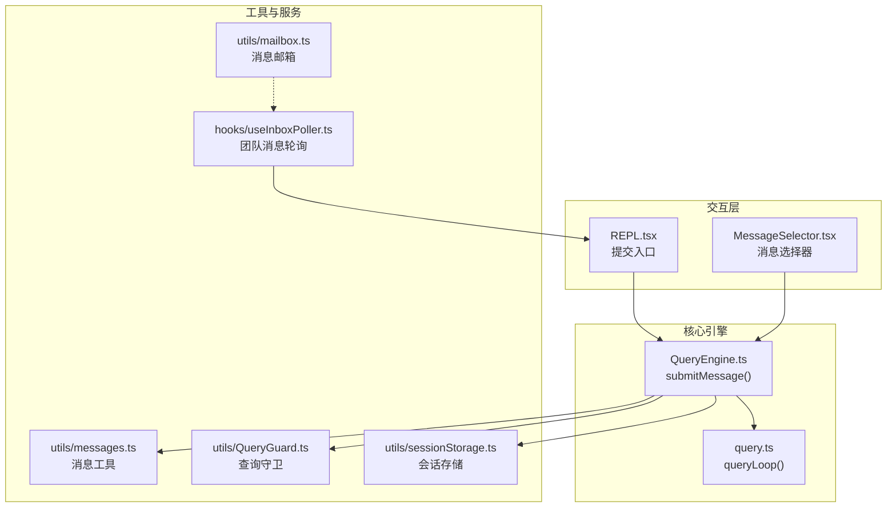
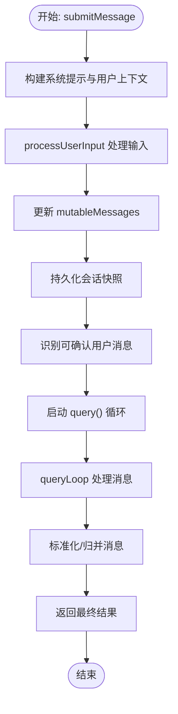
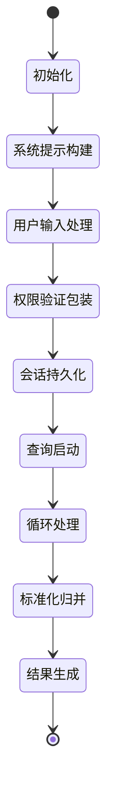
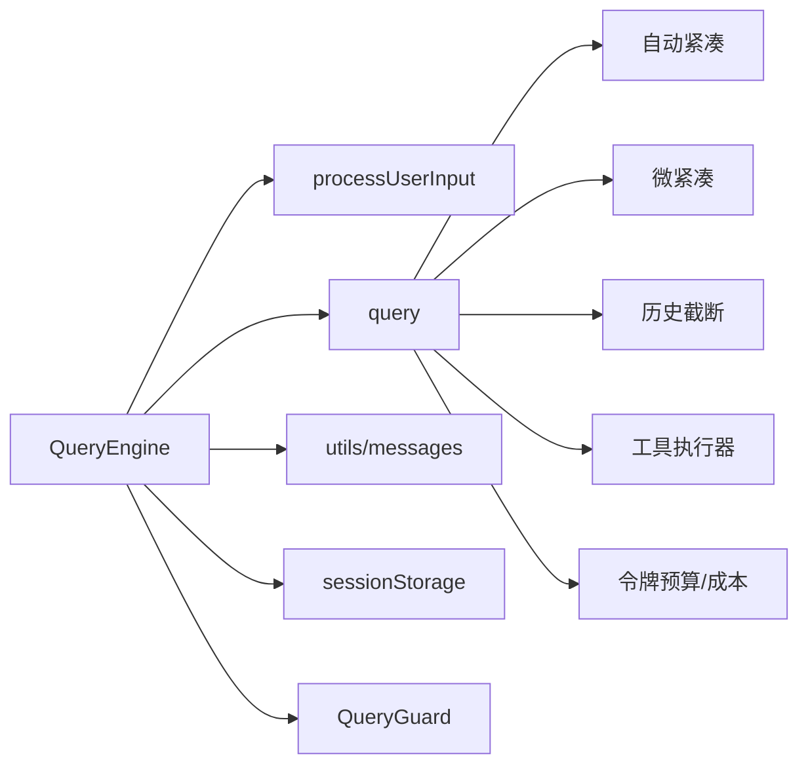

# 消息处理循环

<cite>
**本文引用的文件**
- [src/QueryEngine.ts](file://src/QueryEngine.ts)
- [src/query.ts](file://src/query.ts)
- [src/utils/messages.ts](file://src/utils/messages.ts)
- [src/components/MessageSelector.tsx](file://src/components/MessageSelector.tsx)
- [src/utils/QueryGuard.ts](file://src/utils/QueryGuard.ts)
- [src/screens/REPL.tsx](file://src/screens/REPL.tsx)
- [src/utils/sessionStorage.ts](file://src/utils/sessionStorage.ts)
- [src/utils/mailbox.ts](file://src/utils/mailbox.ts)
- [src/hooks/useInboxPoller.ts](file://src/hooks/useInboxPoller.ts)
</cite>

## 目录
1. [简介](#简介)
2. [项目结构](#项目结构)
3. [核心组件](#核心组件)
4. [架构总览](#架构总览)
5. [详细组件分析](#详细组件分析)
6. [依赖关系分析](#依赖关系分析)
7. [性能考量](#性能考量)
8. [故障排查指南](#故障排查指南)
9. [结论](#结论)

## 简介
本文件围绕 Claude Code 的消息处理循环进行深入解析，重点覆盖以下目标：
- 完整梳理 submitMessage() 方法的执行流程：从用户输入处理、消息构建、权限验证到响应生成的全过程
- 描述消息在 QueryEngine 中的生命周期：从接收用户输入到最终输出的完整转换过程
- 解释消息处理循环的状态管理机制：包括 mutableMessages 数组的维护、消息索引管理、会话状态同步
- 说明消息处理循环如何处理不同类型的消息（用户消息、助手消息、系统消息），以及消息过滤和归档策略
- 提供消息处理循环的时序图和状态转换图，展示消息在不同阶段的处理逻辑和数据流转

## 项目结构
与消息处理循环直接相关的核心模块如下：
- QueryEngine：负责单轮对话的完整生命周期，封装用户输入处理、系统提示构建、工具权限校验、查询执行与结果归并
- query：消息处理循环的主引擎，负责上下文压缩、自动紧凑、工具调用、流式输出与错误恢复
- utils/messages：消息工具集，包含消息类型定义、消息规范化、消息过滤与归档等
- components/MessageSelector：消息选择器，用于筛选可选用户消息、触发恢复/总结等操作
- utils/QueryGuard：并发查询守卫，确保同一时间仅有一个查询处于运行态
- screens/REPL：REPL 场景下的消息提交入口，负责将用户输入转为 QueryEngine 的提交请求
- utils/sessionStorage：会话存储与归档，负责消息持久化、快照与恢复
- utils/mailbox：通用消息邮箱，支持等待/轮询消息
- hooks/useInboxPoller：团队成员消息轮询器，负责将外部消息注入到当前会话



图表来源
- [src/QueryEngine.ts:209-280](file://src/QueryEngine.ts#L209-L280)
- [src/query.ts:241-280](file://src/query.ts#L241-L280)
- [src/utils/messages.ts:1-200](file://src/utils/messages.ts#L1-L200)
- [src/utils/QueryGuard.ts:45-80](file://src/utils/QueryGuard.ts#L45-L80)
- [src/screens/REPL.tsx:3142-4019](file://src/screens/REPL.tsx#L3142-L4019)
- [src/utils/sessionStorage.ts:2010-3867](file://src/utils/sessionStorage.ts#L2010-L3867)
- [src/utils/mailbox.ts:1-73](file://src/utils/mailbox.ts#L1-L73)
- [src/hooks/useInboxPoller.ts:204-915](file://src/hooks/useInboxPoller.ts#L204-L915)

章节来源
- [src/QueryEngine.ts:184-207](file://src/QueryEngine.ts#L184-L207)
- [src/query.ts:219-239](file://src/query.ts#L219-L239)

## 核心组件
- QueryEngine.submitMessage()
  - 负责单轮对话的完整生命周期：系统提示构建、用户输入处理、权限校验包装、消息入队、会话持久化、查询执行与结果归并
  - 维护 mutableMessages 作为会话状态的唯一真相源，并通过 setMessages 回写机制与 AppState 同步
  - 支持结构化输出约束、预算限制、最大轮次限制、历史截断等高级特性
- query.queryLoop()
  - 消息处理循环的主引擎：上下文压缩（自动紧凑/微紧凑/历史截断）、工具调用、流式输出、错误恢复与重试、状态机推进
  - 通过 State 结构体管理跨迭代状态，包括 messages、toolUseContext、autoCompactTracking、maxOutputTokensRecoveryCount、turnCount 等
- utils/messages
  - 提供消息类型定义、消息规范化（如去除尾部思考块、空白助手消息、孤儿思考消息）、消息过滤（可选用户消息）等
- components/MessageSelector
  - 基于 selectableUserMessagesFilter 过滤可选用户消息，支持恢复/总结等操作
- utils/QueryGuard
  - 并发控制：tryStart/end 管理查询运行状态，cancelReservation 处理空闲/调度态切换
- utils/sessionStorage
  - 会话存储与归档：recordTranscript、applyToolResultBudget、content replacement、快照清理等
- hooks/useInboxPoller
  - 将团队成员消息注入到当前会话，支持权限请求、关闭请求、计划审批等特殊消息分类与优先级处理

章节来源
- [src/QueryEngine.ts:209-1177](file://src/QueryEngine.ts#L209-L1177)
- [src/query.ts:201-239](file://src/query.ts#L201-L239)
- [src/utils/messages.ts:4777-5081](file://src/utils/messages.ts#L4777-L5081)
- [src/components/MessageSelector.tsx:1-200](file://src/components/MessageSelector.tsx#L1-L200)
- [src/utils/QueryGuard.ts:45-80](file://src/utils/QueryGuard.ts#L45-L80)
- [src/utils/sessionStorage.ts:2010-3867](file://src/utils/sessionStorage.ts#L2010-L3867)
- [src/hooks/useInboxPoller.ts:204-915](file://src/hooks/useInboxPoller.ts#L204-L915)

## 架构总览
消息处理循环以 QueryEngine 为中心，围绕 submitMessage() 展开；queryLoop() 作为内部循环引擎，驱动上下文压缩、工具执行与流式输出。系统通过 mutableMessages 维护会话状态，通过 setMessages 回写与 AppState 同步；通过 recordTranscript 实现持久化与归档。

```mermaid
sequenceDiagram
participant UI as "REPL.tsx"
participant Engine as "QueryEngine.submitMessage()"
participant Proc as "processUserInput()"
participant Q as "query()"
participant Loop as "queryLoop()"
participant Store as "sessionStorage.recordTranscript()"
participant SDK as "SDK/客户端"
UI->>Engine : 提交用户输入
Engine->>Proc : 处理用户输入/命令/附件
Proc-->>Engine : 返回新消息列表/是否查询/允许工具/模型
Engine->>Engine : 写入 mutableMessages
Engine->>Store : 记录会话快照持久化
Engine->>Q : 启动查询
Q->>Loop : 进入消息处理循环
Loop-->>Engine : 流式产出消息/进度/边界
Engine->>SDK : 归并并标准化消息
Engine-->>UI : 返回最终结果
```

图表来源
- [src/screens/REPL.tsx:3142-4019](file://src/screens/REPL.tsx#L3142-L4019)
- [src/QueryEngine.ts:209-1177](file://src/QueryEngine.ts#L209-L1177)
- [src/query.ts:219-239](file://src/query.ts#L219-L239)

## 详细组件分析

### submitMessage() 执行流程详解
- 输入处理与系统提示构建
  - 读取初始 AppState 与 main loop 模型，构建默认系统提示与用户上下文
  - 可选自定义系统提示与附加系统提示，支持记忆机制注入
- 用户输入处理
  - 使用 processUserInput() 对输入进行解析，识别 /slash 命令、本地命令输出、附件等
  - 通过 setMessages 回写机制更新 mutableMessages，保证后续查询使用最新消息
- 权限验证包装
  - 包装 canUseTool，记录权限拒绝信息，便于 SDK 报告
- 会话持久化与确认
  - 在进入查询前写入 transcript，确保即使中途中断也能恢复
  - 识别可确认的用户消息（非合成、非工具结果、满足过滤条件），在首次录制后进行确认回放
- 查询启动与结果归并
  - 通过 query() 启动消息处理循环，逐条产出消息并写入 mutableMessages
  - 对不同消息类型进行标准化与归并，最终返回结果



图表来源
- [src/QueryEngine.ts:209-1177](file://src/QueryEngine.ts#L209-L1177)

章节来源
- [src/QueryEngine.ts:209-1177](file://src/QueryEngine.ts#L209-L1177)

### QueryEngine 中的消息生命周期
- 接收用户输入
  - 通过 processUserInput() 生成用户消息与附件，推送到 mutableMessages
- 查询阶段
  - queryLoop() 驱动上下文压缩（自动紧凑/微紧凑/历史截断）、工具调用、流式输出
  - 对 assistant/user/system/progress/attachment 等消息分别处理并写入 mutableMessages
- 结束阶段
  - 根据最终消息类型提取文本结果，统计用量与成本，返回结果消息
  - 若发生预算超支或达到最大轮次，提前终止并返回相应错误



图表来源
- [src/QueryEngine.ts:209-1177](file://src/QueryEngine.ts#L209-L1177)
- [src/query.ts:241-280](file://src/query.ts#L241-L280)

章节来源
- [src/QueryEngine.ts:209-1177](file://src/QueryEngine.ts#L209-L1177)
- [src/query.ts:241-280](file://src/query.ts#L241-L280)

### 状态管理机制：mutableMessages 与会话同步
- mutableMessages 作为会话状态的唯一真相源，贯穿整个消息处理循环
- setMessages 回写机制
  - 在交互模式下写回 AppState，确保 UI 与状态同步
  - 在打印/SDK 模式下写回 mutableMessages，保证循环内可见性
- 索引与边界管理
  - compact_boundary 触发时，清理旧消息并释放内存
  - 历史截断（snip）时，基于边界消息重建历史，避免标记重复触发
- 会话持久化
  - recordTranscript 在关键节点写入，确保中断后仍可恢复
  - applyToolResultBudget 控制工具结果大小，避免过长内容影响性能

章节来源
- [src/QueryEngine.ts:184-207](file://src/QueryEngine.ts#L184-L207)
- [src/QueryEngine.ts:335-395](file://src/QueryEngine.ts#L335-L395)
- [src/QueryEngine.ts:905-942](file://src/QueryEngine.ts#L905-L942)
- [src/utils/sessionStorage.ts:2010-3867](file://src/utils/sessionStorage.ts#L2010-L3867)

### 消息类型处理与过滤策略
- 用户消息（user）
  - 由 processUserInput() 生成，可能包含文本、附件、本地命令输出等
  - 可选用户消息过滤（selectableUserMessagesFilter）用于选择器与恢复操作
- 助手消息（assistant）
  - 由模型生成，可能包含文本、工具调用、思考块等
  - 标准化处理：去除尾部思考块、空白助手消息、孤儿思考消息
- 系统消息（system）
  - 包含紧凑边界、API 错误、任务摘要等
  - 紧凑边界触发时，清理旧消息并释放内存
- 进度/附件（progress/attachment）
  - 用于指示工具执行进度与中间结果，需及时写入持久化

章节来源
- [src/utils/messages.ts:4777-5081](file://src/utils/messages.ts#L4777-L5081)
- [src/components/MessageSelector.tsx:1-200](file://src/components/MessageSelector.tsx#L1-L200)
- [src/QueryEngine.ts:757-970](file://src/QueryEngine.ts#L757-L970)

### 并发控制与查询守卫
- QueryGuard.tryStart/end 确保同一时间仅有一个查询处于运行态
- cancelReservation 用于在无待处理任务时释放保留状态
- 与 REPL 提交入口协同，避免用户在查询运行中重复提交

章节来源
- [src/utils/QueryGuard.ts:45-80](file://src/utils/QueryGuard.ts#L45-L80)
- [src/screens/REPL.tsx:3142-4019](file://src/screens/REPL.tsx#L3142-L4019)

### 外部消息注入与归档
- useInboxPoller 将团队成员消息注入到当前会话，支持权限请求、关闭请求、计划审批等
- utils/mailbox 提供通用消息邮箱，支持等待/轮询消息
- 会话归档与快照清理：在查询结束或预算超限时，确保持久化一致性

章节来源
- [src/hooks/useInboxPoller.ts:204-915](file://src/hooks/useInboxPoller.ts#L204-L915)
- [src/utils/mailbox.ts:1-73](file://src/utils/mailbox.ts#L1-L73)
- [src/utils/sessionStorage.ts:2010-3867](file://src/utils/sessionStorage.ts#L2010-L3867)

## 依赖关系分析
- QueryEngine 依赖
  - processUserInput：用户输入解析与命令处理
  - query：消息处理循环引擎
  - utils/messages：消息类型与过滤
  - sessionStorage：会话持久化
  - QueryGuard：并发控制
- queryLoop 依赖
  - 上下文压缩模块（自动紧凑/微紧凑/历史截断）
  - 工具执行器与流式工具执行器
  - 令牌预算与成本跟踪
  - 会话存储与内容替换



图表来源
- [src/QueryEngine.ts:209-1177](file://src/QueryEngine.ts#L209-L1177)
- [src/query.ts:241-280](file://src/query.ts#L241-L280)

章节来源
- [src/QueryEngine.ts:209-1177](file://src/QueryEngine.ts#L209-L1177)
- [src/query.ts:241-280](file://src/query.ts#L241-L280)

## 性能考量
- 令牌预算与自动紧凑
  - 通过自动紧凑与微紧凑降低上下文长度，减少 API 成本与延迟
- 工具结果预算
  - 限制工具结果大小，避免过长内容影响性能与稳定性
- 流式输出与写入优化
  - 对助手消息采用“先写后等”策略，避免阻塞流式响应
- 历史截断与内存释放
  - 紧凑边界触发时清理旧消息，防止长期会话内存膨胀

## 故障排查指南
- 最终结果判定失败
  - 当最终消息类型不符合成功条件或 stop_reason 不正确时，返回 error_during_execution，并附带诊断信息
- 预算超限
  - 达到 USD 预算上限时，提前终止并返回 error_max_budget_usd
- 最大轮次限制
  - 达到最大轮次时，返回 error_max_turns
- 结构化输出重试上限
  - 结构化输出工具调用超过重试次数时，返回 error_max_structured_output_retries
- 会话恢复问题
  - 若会话日志缺失或不完整，可能导致 --resume 失败；建议在提交后尽快持久化

章节来源
- [src/QueryEngine.ts:971-1048](file://src/QueryEngine.ts#L971-L1048)
- [src/QueryEngine.ts:1082-1118](file://src/QueryEngine.ts#L1082-L1118)

## 结论
Claude Code 的消息处理循环以 QueryEngine 为核心，通过 submitMessage() 将用户输入转化为可执行的查询，并在 queryLoop() 中完成上下文压缩、工具执行与流式输出。系统通过 mutableMessages 维护会话状态，结合 setMessages 回写与持久化策略，确保状态一致性与可恢复性。同时，权限验证、预算控制、最大轮次限制与结构化输出重试等机制共同保障了系统的稳定性与可控性。对外部消息（团队成员消息）的支持进一步增强了协作场景下的可用性。