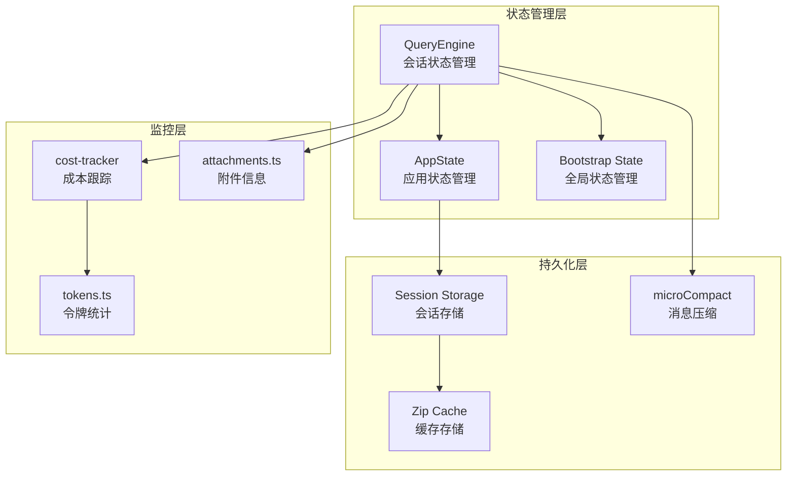
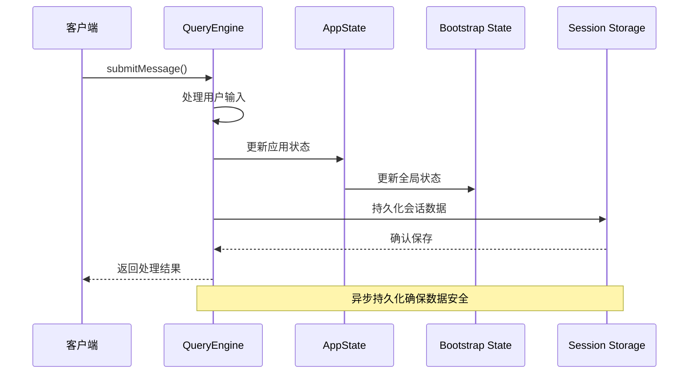
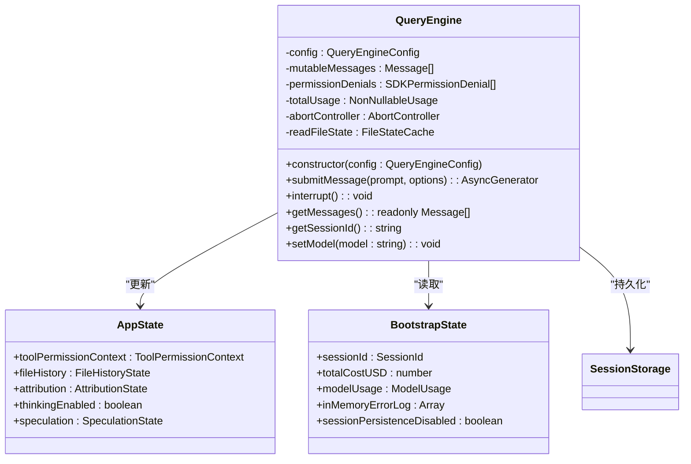
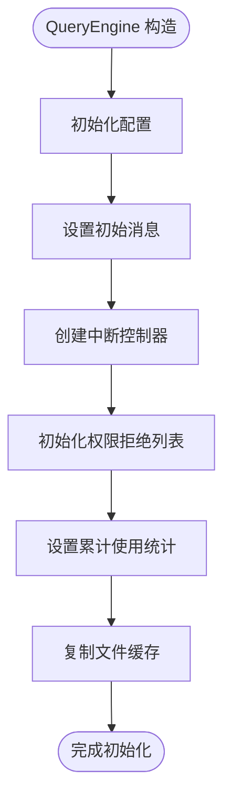
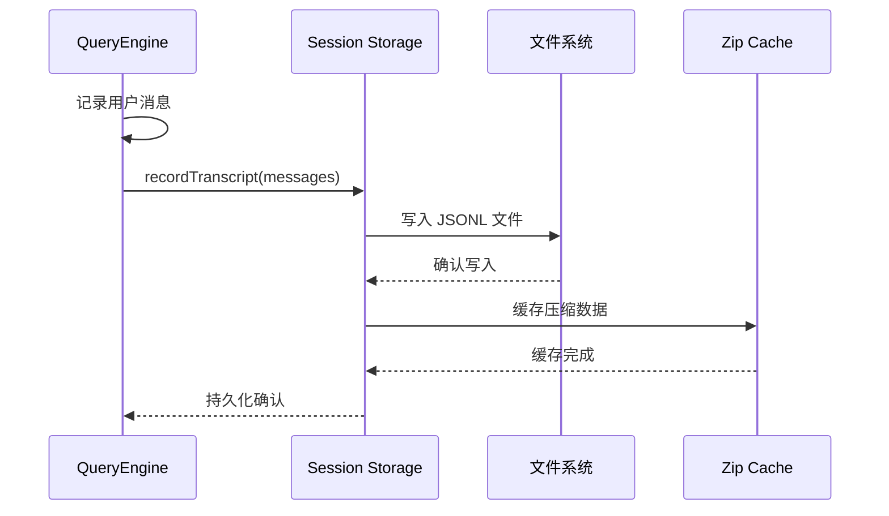
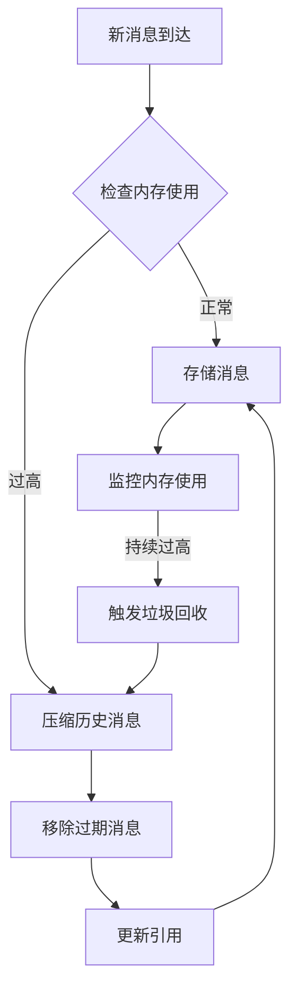
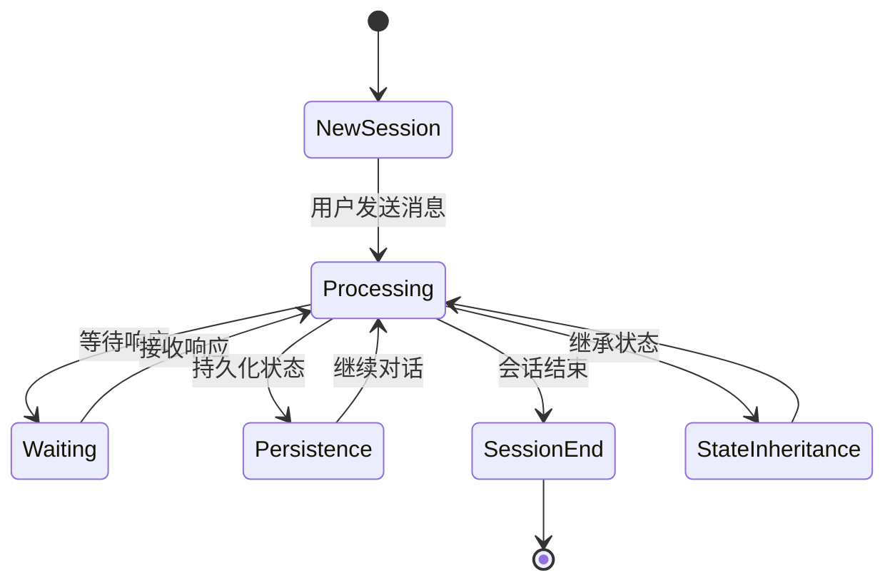
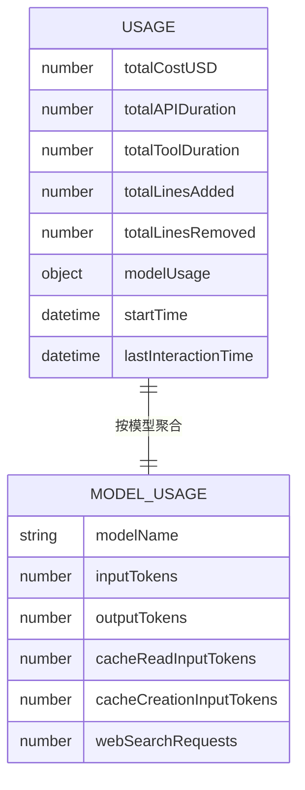
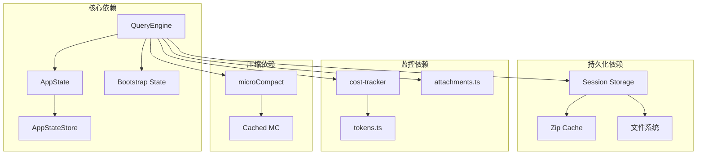

# 状态管理机制

<cite>
**本文档引用的文件**
- [src/QueryEngine.ts](file://src/QueryEngine.ts)
- [src/state/AppState.tsx](file://src/state/AppState.tsx)
- [src/state/AppStateStore.ts](file://src/state/AppStateStore.ts)
- [src/bootstrap/state.ts](file://src/bootstrap/state.ts)
- [src/utils/sessionStorage.ts](file://src/utils/sessionStorage.ts)
- [src/services/compact/microCompact.ts](file://src/services/compact/microCompact.ts)
- [src/utils/plugins/zipCache.ts](file://src/utils/plugins/zipCache.ts)
- [src/utils/cleanup.ts](file://src/utils/cleanup.ts)
- [src/utils/attachments.ts](file://src/utils/attachments.ts)
- [src/cost-tracker.ts](file://src/cost-tracker.ts)
- [src/utils/tokens.ts](file://src/utils/tokens.ts)
</cite>

## 目录
1. [简介](#简介)
2. [项目结构](#项目结构)
3. [核心组件](#核心组件)
4. [架构概览](#架构概览)
5. [详细组件分析](#详细组件分析)
6. [依赖关系分析](#依赖关系分析)
7. [性能考虑](#性能考虑)
8. [故障排除指南](#故障排除指南)
9. [结论](#结论)

## 简介

Claude Code 的状态管理机制是一个复杂而精心设计的系统，负责管理对话会话的完整生命周期。该系统通过 QueryEngine 类为核心，结合全局状态管理和持久化机制，实现了高效的消息处理、权限控制、使用统计和内存优化。

系统的核心特点包括：
- **多层状态管理**：从会话级到应用级的分层状态管理
- **持久化机制**：完整的会话状态保存和恢复能力
- **内存优化**：智能的消息压缩和缓存清理策略
- **权限跟踪**：详细的工具使用权限控制和审计
- **使用统计**：全面的令牌使用和成本跟踪

## 项目结构

Claude Code 的状态管理系统由多个相互协作的模块组成：

**图表来源**
- [src/QueryEngine.ts:184-207](file://src/QueryEngine.ts#L184-L207)
- [src/state/AppState.tsx:1-110](file://src/state/AppState.tsx#L1-L110)
- [src/bootstrap/state.ts:45-257](file://src/bootstrap/state.ts#L45-L257)

**章节来源**
- [src/QueryEngine.ts:184-207](file://src/QueryEngine.ts#L184-L207)
- [src/state/AppState.tsx:1-110](file://src/state/AppState.tsx#L1-L110)
- [src/bootstrap/state.ts:45-257](file://src/bootstrap/state.ts#L45-L257)

## 核心组件

### QueryEngine - 会话状态核心

QueryEngine 是状态管理的核心组件，负责管理单个对话会话的完整生命周期：

**核心状态变量**：
- `mutableMessages`：当前会话的可变消息数组
- `permissionDenials`：权限拒绝记录列表
- `totalUsage`：累计使用统计
- `abortController`：中断控制机制

**主要职责**：
- 处理用户消息提交和响应生成
- 管理会话状态的持久化
- 跟踪和报告权限使用情况
- 实现消息压缩和内存优化

**章节来源**
- [src/QueryEngine.ts:184-207](file://src/QueryEngine.ts#L184-L207)
- [src/QueryEngine.ts:209-1156](file://src/QueryEngine.ts#L209-L1156)

### AppState - 应用状态管理

AppState 提供了应用程序级别的状态管理，包含复杂的配置和状态信息：

**关键状态域**：
- `toolPermissionContext`：工具权限控制上下文
- `fileHistory`：文件历史状态
- `attribution`：归属信息状态
- `thinkingEnabled`：思考模式启用状态
- `speculation`：推测状态

**章节来源**
- [src/state/AppStateStore.ts:89-452](file://src/state/AppStateStore.ts#L89-L452)
- [src/state/AppState.tsx:1-200](file://src/state/AppState.tsx#L1-L200)

### Bootstrap State - 全局状态管理

Bootstrap State 提供了进程级别的全局状态，用于跨会话的状态管理：

**核心状态**：
- `totalCostUSD`：总成本统计
- `modelUsage`：模型使用统计
- `sessionId`：会话标识符
- `sessionPersistenceDisabled`：会话持久化禁用标志
- `inMemoryErrorLog`：内存错误日志

**章节来源**
- [src/bootstrap/state.ts:45-257](file://src/bootstrap/state.ts#L45-L257)
- [src/bootstrap/state.ts:826-916](file://src/bootstrap/state.ts#L826-L916)

## 架构概览

Claude Code 的状态管理采用分层架构设计，确保了良好的模块分离和状态一致性：

**图表来源**
- [src/QueryEngine.ts:209-639](file://src/QueryEngine.ts#L209-L639)
- [src/state/AppState.tsx:142-172](file://src/state/AppState.tsx#L142-L172)

## 详细组件分析

### QueryEngine 状态管理模式

QueryEngine 实现了完整的状态管理模式，包括状态初始化、更新和持久化：

**图表来源**
- [src/QueryEngine.ts:184-207](file://src/QueryEngine.ts#L184-L207)
- [src/state/AppStateStore.ts:89-452](file://src/state/AppStateStore.ts#L89-L452)
- [src/bootstrap/state.ts:45-257](file://src/bootstrap/state.ts#L45-L257)

#### 状态初始化流程

QueryEngine 在构造时完成所有核心状态的初始化：

**图表来源**
- [src/QueryEngine.ts:200-207](file://src/QueryEngine.ts#L200-L207)

**章节来源**
- [src/QueryEngine.ts:200-207](file://src/QueryEngine.ts#L200-L207)

### 状态持久化机制

系统实现了多层次的持久化机制，确保状态的安全存储和快速恢复：

#### 会话状态保存

**图表来源**
- [src/QueryEngine.ts:450-463](file://src/QueryEngine.ts#L450-L463)
- [src/utils/sessionStorage.ts:3838-3867](file://src/utils/sessionStorage.ts#L3838-L3867)

#### 消息历史记录存储

系统使用压缩算法来优化消息历史的存储空间：

**章节来源**
- [src/QueryEngine.ts:450-463](file://src/QueryEngine.ts#L450-L463)
- [src/services/compact/microCompact.ts:272-367](file://src/services/compact/microCompact.ts#L272-L367)

### 内存优化策略

Claude Code 实现了多种内存优化策略来确保长时间运行的稳定性：

#### 消息压缩和清理

**图表来源**
- [src/QueryEngine.ts:922-933](file://src/QueryEngine.ts#L922-L933)
- [src/services/compact/microCompact.ts:332-367](file://src/services/compact/microCompact.ts#L332-L367)

#### 缓存清理机制

系统实现了智能的缓存清理策略：

**章节来源**
- [src/QueryEngine.ts:922-933](file://src/QueryEngine.ts#L922-L933)
- [src/utils/cleanup.ts:102-159](file://src/utils/cleanup.ts#L102-L159)

### 多轮对话连续性支持

系统通过多种机制确保多轮对话的连续性和上下文保持：

#### 状态继承机制

**图表来源**
- [src/QueryEngine.ts:209-639](file://src/QueryEngine.ts#L209-L639)

#### 上下文保持策略

系统通过以下方式保持对话上下文：
- 维护完整的消息历史
- 跟踪工具使用权限状态
- 保存文件历史快照
- 记录使用统计信息

**章节来源**
- [src/QueryEngine.ts:209-639](file://src/QueryEngine.ts#L209-L639)

### 使用统计和成本跟踪

系统实现了全面的使用统计和成本跟踪机制：

#### 使用统计数据结构

**图表来源**
- [src/bootstrap/state.ts:45-257](file://src/bootstrap/state.ts#L45-L257)
- [src/cost-tracker.ts:286-323](file://src/cost-tracker.ts#L286-L323)

**章节来源**
- [src/bootstrap/state.ts:45-257](file://src/bootstrap/state.ts#L45-L257)
- [src/cost-tracker.ts:286-323](file://src/cost-tracker.ts#L286-L323)

## 依赖关系分析

Claude Code 的状态管理系统具有清晰的依赖关系和模块边界：

**图表来源**
- [src/QueryEngine.ts:184-207](file://src/QueryEngine.ts#L184-L207)
- [src/state/AppStateStore.ts:1-570](file://src/state/AppStateStore.ts#L1-L570)
- [src/utils/plugins/zipCache.ts:171-205](file://src/utils/plugins/zipCache.ts#L171-L205)

**章节来源**
- [src/QueryEngine.ts:184-207](file://src/QueryEngine.ts#L184-L207)
- [src/state/AppStateStore.ts:1-570](file://src/state/AppStateStore.ts#L1-L570)

## 性能考虑

### 内存使用优化

系统采用了多种策略来优化内存使用：

1. **消息压缩**：使用 microCompact 进行历史消息压缩
2. **缓存清理**：定期清理过期的会话文件
3. **增量持久化**：异步持久化避免阻塞主流程
4. **引用管理**：智能的引用更新避免内存泄漏

### 并发处理

系统支持高并发的会话处理：

- **会话隔离**：每个 QueryEngine 实例独立管理自己的状态
- **持久化队列**：有序的持久化操作避免竞态条件
- **中断机制**：AbortController 支持快速取消长时间操作

## 故障排除指南

### 常见问题诊断

#### 会话状态异常

当遇到会话状态异常时，可以检查以下方面：

1. **状态同步问题**：确认 AppState 和 Bootstrap State 的同步
2. **持久化失败**：检查 Session Storage 的写入权限
3. **内存泄漏**：监控 QueryEngine 的内存使用情况

#### 权限跟踪问题

如果发现权限跟踪不准确：

1. **检查 permissionDenials 列表**：确认权限拒绝记录的完整性
2. **验证工具权限上下文**：确保 toolPermissionContext 的正确性
3. **审查权限回调**：检查 canUseTool 函数的实现

**章节来源**
- [src/QueryEngine.ts:243-271](file://src/QueryEngine.ts#L243-L271)
- [src/state/AppStateStore.ts:500-503](file://src/state/AppStateStore.ts#L500-L503)

## 结论

Claude Code 的状态管理机制展现了现代大型应用的复杂状态管理需求。通过 QueryEngine、AppState 和 Bootstrap State 的分层设计，系统实现了：

1. **完整的会话生命周期管理**：从创建到销毁的全生命周期状态管理
2. **多层持久化保障**：确保状态在各种异常情况下都能正确恢复
3. **智能内存优化**：通过压缩和清理策略维持长期运行稳定性
4. **全面的监控和审计**：提供详细的使用统计和权限跟踪
5. **灵活的扩展性**：模块化的架构设计便于功能扩展

这种设计不仅满足了当前的功能需求，也为未来的功能扩展和性能优化奠定了坚实的基础。