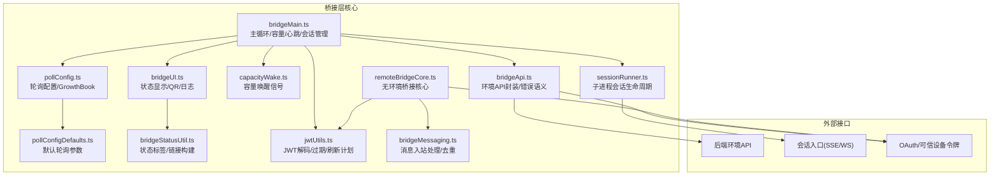
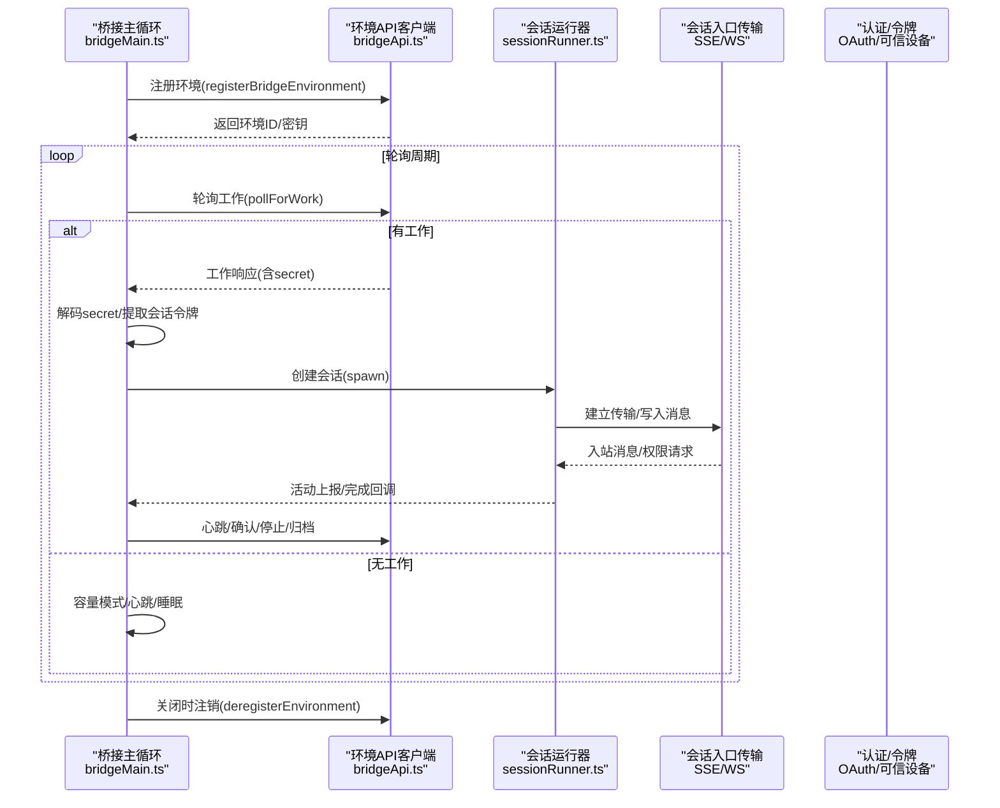
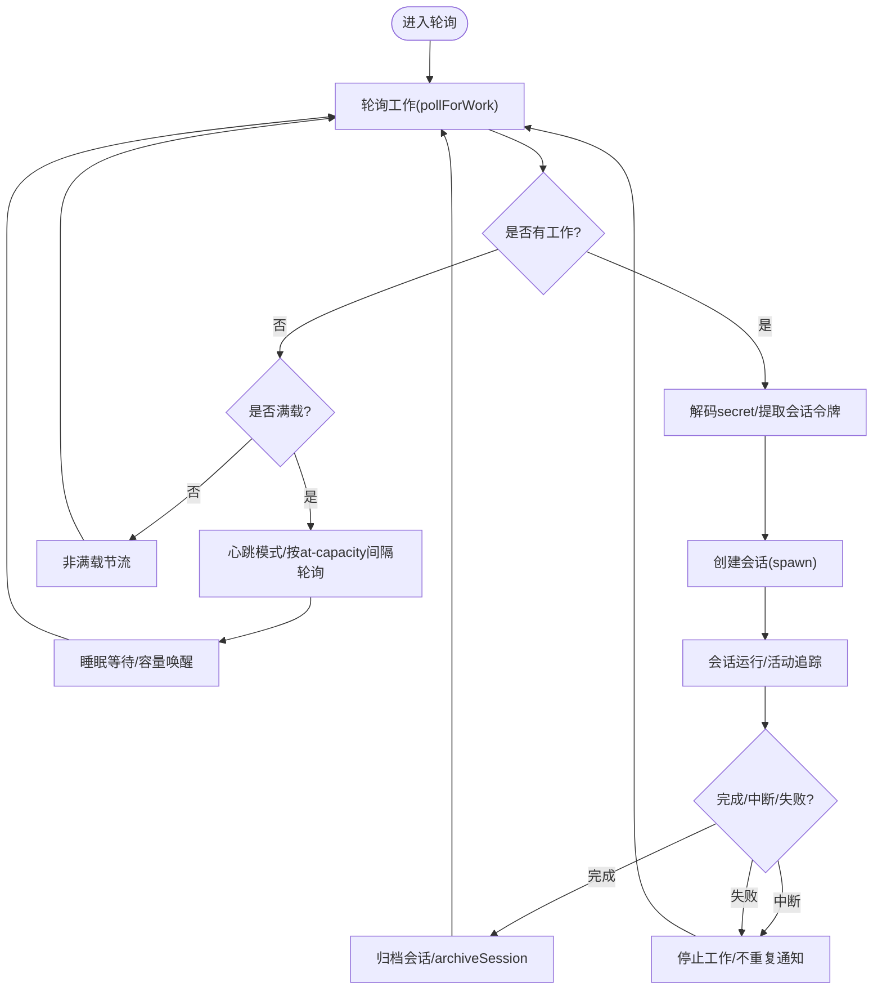
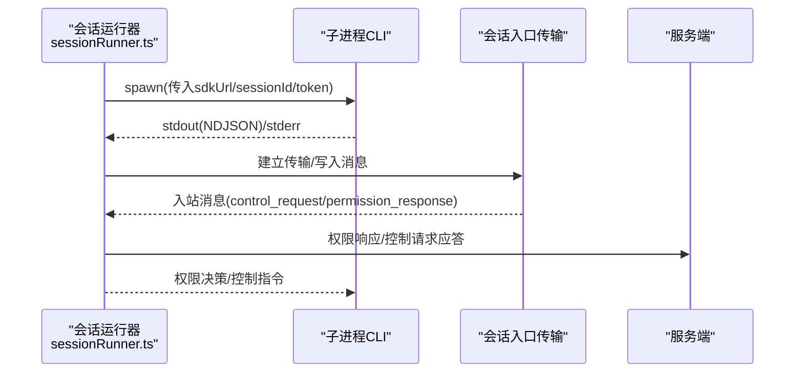
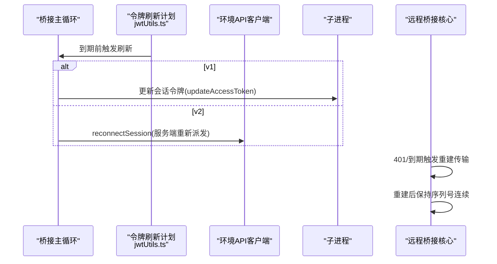
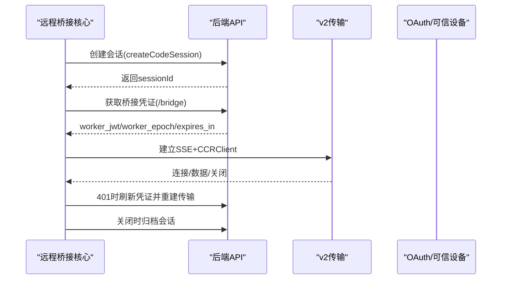
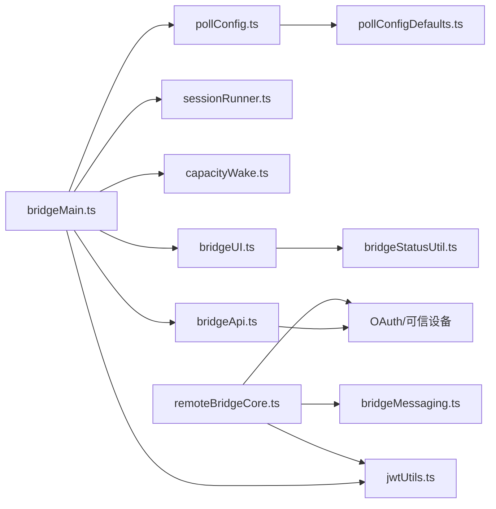

# 分布式架构支持

<cite>
**本文引用的文件**
- [bridgeMain.ts](file://src/bridge/bridgeMain.ts)
- [bridgeApi.ts](file://src/bridge/bridgeApi.ts)
- [bridgeConfig.ts](file://src/bridge/bridgeConfig.ts)
- [capacityWake.ts](file://src/bridge/capacityWake.ts)
- [sessionRunner.ts](file://src/bridge/sessionRunner.ts)
- [types.ts](file://src/bridge/types.ts)
- [pollConfig.ts](file://src/bridge/pollConfig.ts)
- [pollConfigDefaults.ts](file://src/bridge/pollConfigDefaults.ts)
- [bridgeStatusUtil.ts](file://src/bridge/bridgeStatusUtil.ts)
- [bridgeUI.ts](file://src/bridge/bridgeUI.ts)
- [jwtUtils.ts](file://src/bridge/jwtUtils.ts)
- [bridgeMessaging.ts](file://src/bridge/bridgeMessaging.ts)
- [remoteBridgeCore.ts](file://src/bridge/remoteBridgeCore.ts)
- [envUtils.ts](file://src/utils/envUtils.ts)
- [instrumentation.ts](file://src/utils/telemetry/instrumentation.ts)
- [events.ts](file://src/utils/telemetry/events.ts)
</cite>

## 目录
1. [简介](#简介)
2. [项目结构](#项目结构)
3. [核心组件](#核心组件)
4. [架构总览](#架构总览)
5. [详细组件分析](#详细组件分析)
6. [依赖关系分析](#依赖关系分析)
7. [性能考量](#性能考量)
8. [故障排查指南](#故障排查指南)
9. [结论](#结论)
10. [附录](#附录)

## 简介
本文件面向Claude Code的分布式架构支持，系统化阐述桥接层（Bridge）如何支撑多节点、多环境的分布式部署，涵盖容量管理、负载均衡与资源调度、状态同步与一致性、容错与自愈、监控与诊断以及扩展性设计。文档以代码为依据，结合可视化图示，帮助读者从高层到细节全面理解分布式桥接体系。

## 项目结构
桥接层相关代码集中在src/bridge目录，围绕“环境注册—工作轮询—会话执行—心跳与权限—令牌刷新—UI与日志”形成闭环；同时通过远程桥接核心（无环境层）实现直接会话入口，支持v2传输协议与主动令牌刷新。

**图表来源**
- [bridgeMain.ts:141-800](file://src/bridge/bridgeMain.ts#L141-L800)
- [bridgeApi.ts:68-452](file://src/bridge/bridgeApi.ts#L68-L452)
- [sessionRunner.ts:248-551](file://src/bridge/sessionRunner.ts#L248-L551)
- [capacityWake.ts:28-57](file://src/bridge/capacityWake.ts#L28-L57)
- [pollConfig.ts:102-111](file://src/bridge/pollConfig.ts#L102-L111)
- [pollConfigDefaults.ts:55-83](file://src/bridge/pollConfigDefaults.ts#L55-L83)
- [bridgeUI.ts:42-531](file://src/bridge/bridgeUI.ts#L42-L531)
- [bridgeStatusUtil.ts:39-58](file://src/bridge/bridgeStatusUtil.ts#L39-L58)
- [jwtUtils.ts:72-257](file://src/bridge/jwtUtils.ts#L72-L257)
- [bridgeMessaging.ts:132-208](file://src/bridge/bridgeMessaging.ts#L132-L208)
- [remoteBridgeCore.ts:140-800](file://src/bridge/remoteBridgeCore.ts#L140-L800)

**章节来源**
- [bridgeMain.ts:141-800](file://src/bridge/bridgeMain.ts#L141-L800)
- [bridgeApi.ts:68-452](file://src/bridge/bridgeApi.ts#L68-L452)
- [sessionRunner.ts:248-551](file://src/bridge/sessionRunner.ts#L248-L551)
- [capacityWake.ts:28-57](file://src/bridge/capacityWake.ts#L28-L57)
- [pollConfig.ts:102-111](file://src/bridge/pollConfig.ts#L102-L111)
- [pollConfigDefaults.ts:55-83](file://src/bridge/pollConfigDefaults.ts#L55-L83)
- [bridgeUI.ts:42-531](file://src/bridge/bridgeUI.ts#L42-L531)
- [bridgeStatusUtil.ts:39-58](file://src/bridge/bridgeStatusUtil.ts#L39-L58)
- [jwtUtils.ts:72-257](file://src/bridge/jwtUtils.ts#L72-L257)
- [bridgeMessaging.ts:132-208](file://src/bridge/bridgeMessaging.ts#L132-L208)
- [remoteBridgeCore.ts:140-800](file://src/bridge/remoteBridgeCore.ts#L140-L800)

## 核心组件
- 环境与工作流：bridgeMain负责环境注册、工作轮询、会话创建与回收、心跳与断线重连、容量唤醒与状态更新。
- 会话执行：sessionRunner封装子进程生命周期、活动追踪、权限请求转发、调试日志与转录。
- 配置与节流：pollConfig与pollConfigDefaults提供可调的轮询间隔、容量模式、回收窗口与保活间隔。
- 容量与唤醒：capacityWake在“满载”时阻塞睡眠，当会话结束或外部信号触发时提前唤醒。
- 认证与令牌：bridgeApi封装OAuth与可信设备令牌头；jwtUtils提供JWT解析、过期时间计算与主动刷新计划。
- 远程桥接：remoteBridgeCore提供无环境层的直接会话桥接，支持v2传输协议与主动刷新重建。
- 可视化与诊断：bridgeUI与bridgeStatusUtil提供状态栏、QR码、超链接与格式化输出；bridgeApi与bridgeMain记录诊断事件。

**章节来源**
- [bridgeMain.ts:141-800](file://src/bridge/bridgeMain.ts#L141-L800)
- [sessionRunner.ts:248-551](file://src/bridge/sessionRunner.ts#L248-L551)
- [pollConfig.ts:102-111](file://src/bridge/pollConfig.ts#L102-L111)
- [pollConfigDefaults.ts:55-83](file://src/bridge/pollConfigDefaults.ts#L55-L83)
- [capacityWake.ts:28-57](file://src/bridge/capacityWake.ts#L28-L57)
- [bridgeApi.ts:68-452](file://src/bridge/bridgeApi.ts#L68-L452)
- [jwtUtils.ts:72-257](file://src/bridge/jwtUtils.ts#L72-L257)
- [remoteBridgeCore.ts:140-800](file://src/bridge/remoteBridgeCore.ts#L140-L800)
- [bridgeUI.ts:42-531](file://src/bridge/bridgeUI.ts#L42-L531)
- [bridgeStatusUtil.ts:39-58](file://src/bridge/bridgeStatusUtil.ts#L39-L58)

## 架构总览
桥接层采用“环境-会话-传输”三层协作：
- 环境层：通过环境API注册、轮询、确认、停止、归档、重连，承载多会话并发与容量控制。
- 会话层：每个工作项对应一个会话，由子进程承载，使用会话入口令牌进行认证与心跳。
- 传输层：支持v1混合传输与v2 SSE+CCRClient两种路径，后者具备更优的长连接与主动刷新能力。

**图表来源**
- [bridgeMain.ts:141-800](file://src/bridge/bridgeMain.ts#L141-L800)
- [bridgeApi.ts:142-452](file://src/bridge/bridgeApi.ts#L142-L452)
- [sessionRunner.ts:248-551](file://src/bridge/sessionRunner.ts#L248-L551)

**章节来源**
- [bridgeMain.ts:141-800](file://src/bridge/bridgeMain.ts#L141-L800)
- [bridgeApi.ts:142-452](file://src/bridge/bridgeApi.ts#L142-L452)
- [sessionRunner.ts:248-551](file://src/bridge/sessionRunner.ts#L248-L551)

## 详细组件分析

### 组件A：桥接主循环与容量管理
- 主循环职责：注册环境、轮询工作、创建会话、维护活动列表、处理完成/中断/失败、心跳与断线恢复、容量唤醒与状态更新。
- 容量策略：根据maxSessions与当前活跃会话数决定是否进入“满载”模式；在满载时采用心跳模式或按at-capacity间隔轮询，避免过度轮询。
- 节流与回退：基于GrowthBook配置动态调整轮询间隔与心跳间隔；对401/403等致命错误进行分类处理，必要时终止或给出提示。
- 会话生命周期：跟踪会话开始时间、工作ID、入站令牌、超时清理、标题与活动展示；完成后归档会话并清理工作树。

**图表来源**
- [bridgeMain.ts:600-784](file://src/bridge/bridgeMain.ts#L600-L784)
- [pollConfig.ts:102-111](file://src/bridge/pollConfig.ts#L102-L111)
- [pollConfigDefaults.ts:55-83](file://src/bridge/pollConfigDefaults.ts#L55-L83)

**章节来源**
- [bridgeMain.ts:141-800](file://src/bridge/bridgeMain.ts#L141-L800)
- [pollConfig.ts:102-111](file://src/bridge/pollConfig.ts#L102-L111)
- [pollConfigDefaults.ts:55-83](file://src/bridge/pollConfigDefaults.ts#L55-L83)

### 组件B：会话执行与传输
- 子进程管理：安全的文件名处理、NDJSON解析、stderr缓冲、权限请求转发、首次用户消息提取、活动摘要生成。
- 传输适配：v1混合传输与v2 SSE+CCRClient；v2模式下通过环境变量启用，支持epoch递增与主动刷新重建。
- 权限与控制：入站消息过滤、去重（发送/接收UUID环形缓冲）、服务端控制请求处理（初始化、模型设置、权限模式、中断）。

**图表来源**
- [sessionRunner.ts:248-551](file://src/bridge/sessionRunner.ts#L248-L551)
- [bridgeMessaging.ts:132-208](file://src/bridge/bridgeMessaging.ts#L132-L208)
- [remoteBridgeCore.ts:420-466](file://src/bridge/remoteBridgeCore.ts#L420-L466)

**章节来源**
- [sessionRunner.ts:248-551](file://src/bridge/sessionRunner.ts#L248-L551)
- [bridgeMessaging.ts:132-208](file://src/bridge/bridgeMessaging.ts#L132-L208)
- [remoteBridgeCore.ts:420-466](file://src/bridge/remoteBridgeCore.ts#L420-L466)

### 组件C：令牌刷新与会话状态传播
- 主动刷新：基于JWT过期时间提前刷新，v1直接更新子进程环境变量，v2通过reconnectSession触发服务端重新派发。
- 会话状态传播：通过心跳延长租约、通过ack确认、通过stopWork停止、通过archiveSession归档；远程桥接核心在刷新/401时重建传输并保持序列号连续。
- 冲突与幂等：secret解码失败时记录并停止工作；重复工作项跳过；归档接口幂等（409已归档）。

**图表来源**
- [jwtUtils.ts:72-257](file://src/bridge/jwtUtils.ts#L72-L257)
- [bridgeMain.ts:284-313](file://src/bridge/bridgeMain.ts#L284-L313)
- [remoteBridgeCore.ts:477-527](file://src/bridge/remoteBridgeCore.ts#L477-L527)

**章节来源**
- [jwtUtils.ts:72-257](file://src/bridge/jwtUtils.ts#L72-L257)
- [bridgeMain.ts:284-313](file://src/bridge/bridgeMain.ts#L284-L313)
- [remoteBridgeCore.ts:477-527](file://src/bridge/remoteBridgeCore.ts#L477-L527)

### 组件D：远程桥接核心（无环境层）
- 直接会话：无需环境API，直接创建会话并获取worker JWT，随后建立v2传输。
- 主动刷新：基于expires_in定时刷新，每次刷新都会递增worker_epoch，必须重建传输以避免409。
- 自愈机制：401时自动刷新OAuth并重建传输；连接超时、关闭码等场景进行诊断与状态上报。

**图表来源**
- [remoteBridgeCore.ts:140-800](file://src/bridge/remoteBridgeCore.ts#L140-L800)

**章节来源**
- [remoteBridgeCore.ts:140-800](file://src/bridge/remoteBridgeCore.ts#L140-L800)

## 依赖关系分析
- 组件耦合：bridgeMain高度依赖bridgeApi与sessionRunner；capacityWake被两者共享；pollConfig通过GrowthBook动态注入；UI与状态工具模块独立但被主循环驱动。
- 外部依赖：HTTP客户端axios用于环境API；OpenTelemetry导出器用于第三方遥测；受保护命名空间检测用于内部环境统计。
- 循环依赖规避：bridgeMessaging与remoteBridgeCore相互配合，但通过纯函数与参数传递避免循环导入。

**图表来源**
- [bridgeMain.ts:141-800](file://src/bridge/bridgeMain.ts#L141-L800)
- [bridgeApi.ts:68-452](file://src/bridge/bridgeApi.ts#L68-L452)
- [sessionRunner.ts:248-551](file://src/bridge/sessionRunner.ts#L248-L551)
- [capacityWake.ts:28-57](file://src/bridge/capacityWake.ts#L28-L57)
- [pollConfig.ts:102-111](file://src/bridge/pollConfig.ts#L102-L111)
- [pollConfigDefaults.ts:55-83](file://src/bridge/pollConfigDefaults.ts#L55-L83)
- [bridgeUI.ts:42-531](file://src/bridge/bridgeUI.ts#L42-L531)
- [bridgeStatusUtil.ts:39-58](file://src/bridge/bridgeStatusUtil.ts#L39-L58)
- [jwtUtils.ts:72-257](file://src/bridge/jwtUtils.ts#L72-L257)
- [bridgeMessaging.ts:132-208](file://src/bridge/bridgeMessaging.ts#L132-L208)
- [remoteBridgeCore.ts:140-800](file://src/bridge/remoteBridgeCore.ts#L140-L800)

**章节来源**
- [bridgeMain.ts:141-800](file://src/bridge/bridgeMain.ts#L141-L800)
- [bridgeApi.ts:68-452](file://src/bridge/bridgeApi.ts#L68-L452)
- [sessionRunner.ts:248-551](file://src/bridge/sessionRunner.ts#L248-L551)
- [capacityWake.ts:28-57](file://src/bridge/capacityWake.ts#L28-L57)
- [pollConfig.ts:102-111](file://src/bridge/pollConfig.ts#L102-L111)
- [pollConfigDefaults.ts:55-83](file://src/bridge/pollConfigDefaults.ts#L55-L83)
- [bridgeUI.ts:42-531](file://src/bridge/bridgeUI.ts#L42-L531)
- [bridgeStatusUtil.ts:39-58](file://src/bridge/bridgeStatusUtil.ts#L39-L58)
- [jwtUtils.ts:72-257](file://src/bridge/jwtUtils.ts#L72-L257)
- [bridgeMessaging.ts:132-208](file://src/bridge/bridgeMessaging.ts#L132-L208)
- [remoteBridgeCore.ts:140-800](file://src/bridge/remoteBridgeCore.ts#L140-L800)

## 性能考量
- 轮询与心跳：通过GrowthBook动态配置轮询间隔与心跳间隔，避免在空闲时过度轮询；满载时采用心跳模式减少服务器压力。
- 令牌刷新：提前5分钟刷新，避免会话因令牌过期而中断；v2模式下通过reconnectSession确保新令牌生效。
- 日志与转录：会话调试日志与转录文件分离，便于定位问题且不影响生产性能。
- 资源调度：按maxSessions限制并发，结合容量唤醒机制在会话结束时快速承接新任务，提升吞吐。

[本节为通用指导，无需特定文件引用]

## 故障排查指南
- 认证失败（401/403）：区分致命错误与可恢复错误；401触发令牌刷新或服务端重新派发；403可能为权限不足或会话过期。
- 会话异常退出：检查stderr缓冲中的最后N行；区分中断（SIGTERM/SIGINT）与失败（非零退出码）。
- 令牌过期：v1通过stdin更新令牌；v2通过reconnectSession触发重新派发；远程桥接核心在401时自动刷新并重建传输。
- 网络抖动：心跳模式与at-capacity轮询组合，确保在网络波动时仍能维持会话活性。
- 诊断事件：bridgeApi与bridgeMain记录关键事件（重连、会话完成、失败、心跳模式进入/退出），配合日志与转录文件定位问题。

**章节来源**
- [bridgeApi.ts:454-540](file://src/bridge/bridgeApi.ts#L454-L540)
- [bridgeMain.ts:202-270](file://src/bridge/bridgeMain.ts#L202-L270)
- [jwtUtils.ts:165-230](file://src/bridge/jwtUtils.ts#L165-L230)
- [remoteBridgeCore.ts:530-590](file://src/bridge/remoteBridgeCore.ts#L530-L590)

## 结论
Claude Code的桥接层通过“环境-会话-传输”三层协作，实现了对多节点、多环境的分布式支持。容量管理与轮询配置提供了灵活的资源调度策略；令牌刷新与传输重建保障了会话状态的一致性与可用性；远程桥接核心进一步简化了部署路径，支持v2传输协议与主动刷新。结合完善的监控与诊断机制，该架构在可扩展性与稳定性之间取得了良好平衡。

[本节为总结，无需特定文件引用]

## 附录

### 分布式部署拓扑与最佳实践
- 小规模（单机/本地）：使用单会话模式或同目录模式，适合个人开发与轻量任务。
- 中规模（多会话/多工作树）：启用多会话模式，按maxSessions限制并发；使用工作树隔离不同会话的工作区。
- 大规模（多节点/多环境）：通过环境API集中管理多个桥接实例；利用GrowthBook动态调整轮询与心跳参数；在受保护命名空间中启用额外审计与合规标记。

**章节来源**
- [types.ts:63-115](file://src/bridge/types.ts#L63-L115)
- [pollConfig.ts:102-111](file://src/bridge/pollConfig.ts#L102-L111)
- [envUtils.ts:136-147](file://src/utils/envUtils.ts#L136-L147)

### 监控与诊断
- 事件采集：OpenTelemetry导出器支持控制台与OTLP；事件属性包含会话、模型、Beta特性等上下文。
- 用户提示日志：可通过环境变量控制是否记录用户提示；默认脱敏以保护隐私。
- 诊断日志：桥接层记录重连、心跳、会话完成/失败等事件，便于问题定位。

**章节来源**
- [instrumentation.ts:206-234](file://src/utils/telemetry/instrumentation.ts#L206-L234)
- [events.ts:21-47](file://src/utils/telemetry/events.ts#L21-L47)
- [bridgeApi.ts:454-540](file://src/bridge/bridgeApi.ts#L454-L540)
- [bridgeMain.ts:480-590](file://src/bridge/bridgeMain.ts#L480-L590)