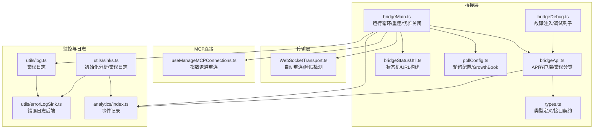
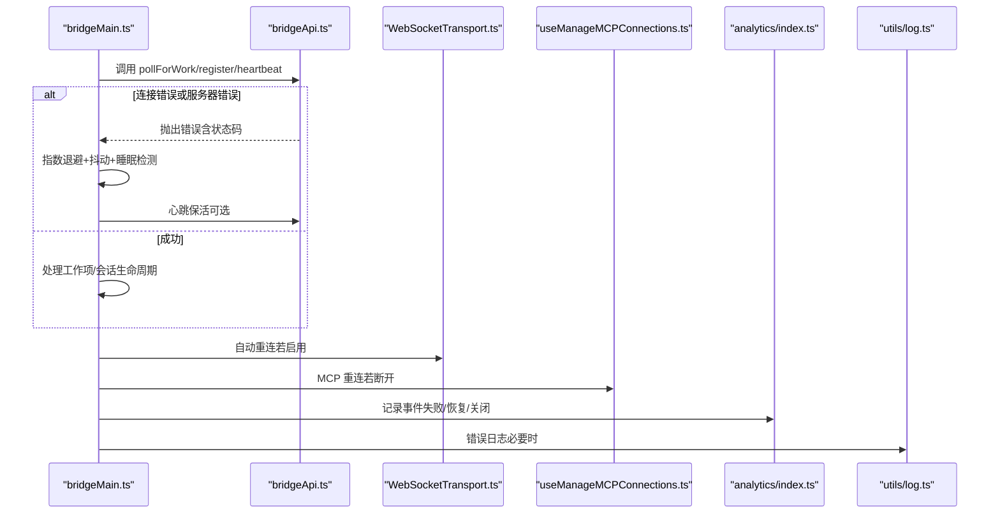
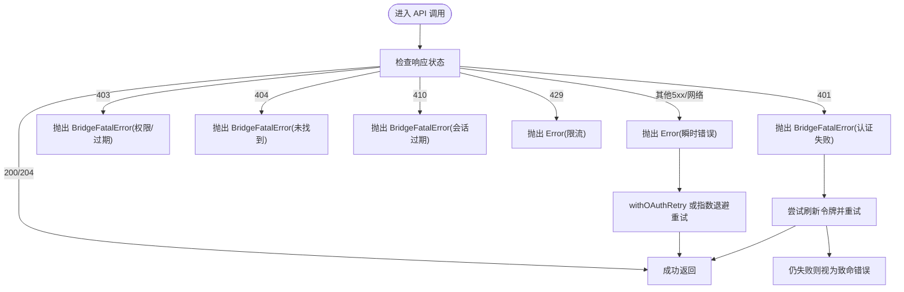
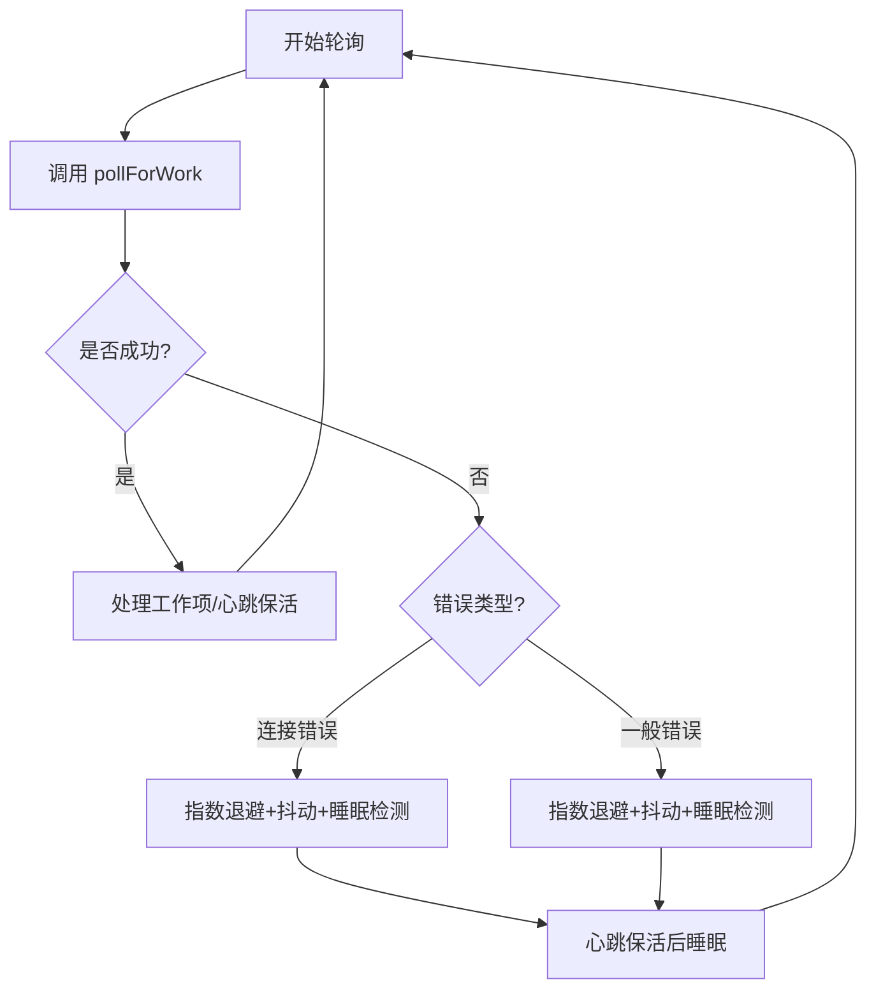
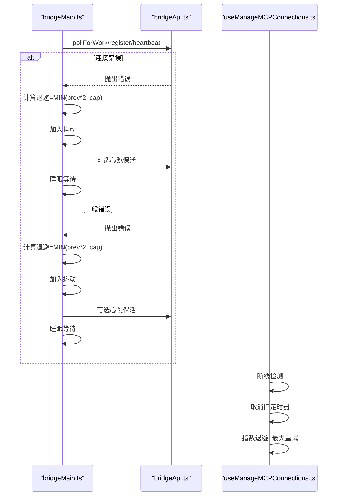
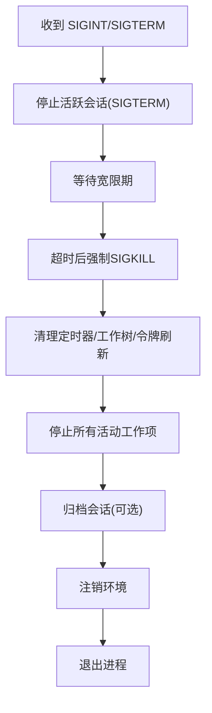
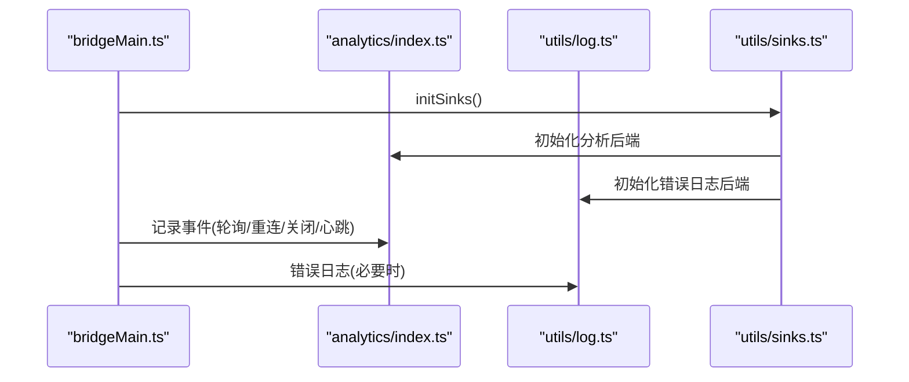
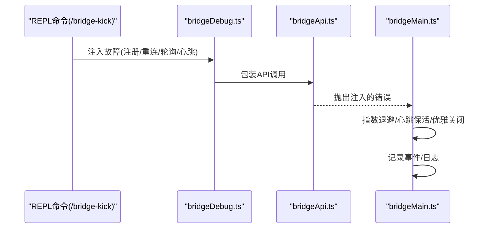
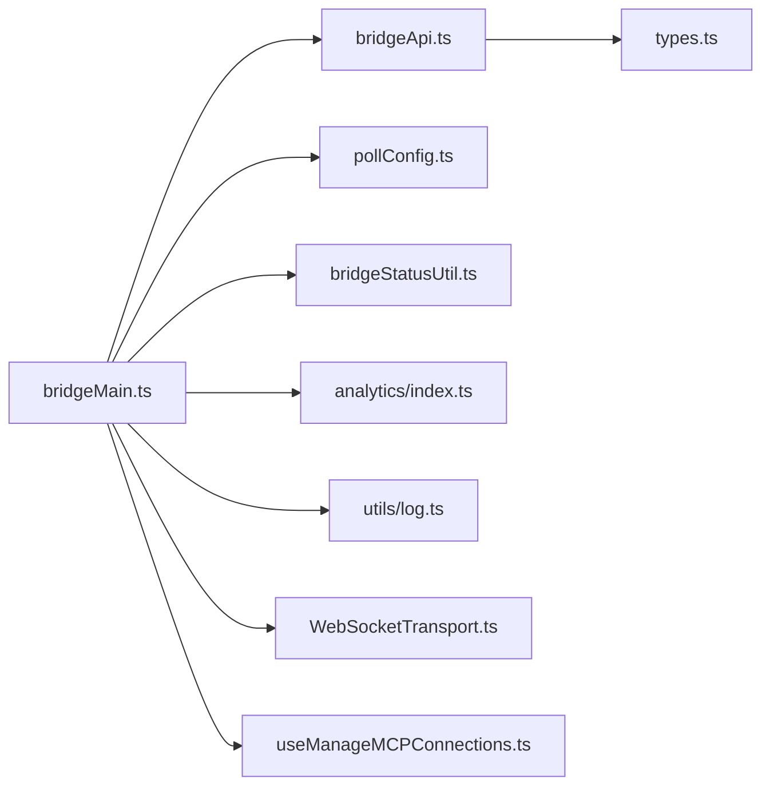

# 容错机制

<cite>
**本文引用的文件**
- [src/bridge/bridgeMain.ts](file://src/bridge/bridgeMain.ts)
- [src/bridge/bridgeApi.ts](file://src/bridge/bridgeApi.ts)
- [src/bridge/bridgeDebug.ts](file://src/bridge/bridgeDebug.ts)
- [src/bridge/bridgeMessaging.ts](file://src/bridge/bridgeMessaging.ts)
- [src/bridge/pollConfig.ts](file://src/bridge/pollConfig.ts)
- [src/bridge/bridgeStatusUtil.ts](file://src/bridge/bridgeStatusUtil.ts)
- [src/bridge/types.ts](file://src/bridge/types.ts)
- [src/cli/transports/WebSocketTransport.ts](file://src/cli/transports/WebSocketTransport.ts)
- [src/services/mcp/useManageMCPConnections.ts](file://src/services/mcp/useManageMCPConnections.ts)
- [src/services/analytics/index.ts](file://src/services/analytics/index.ts)
- [src/utils/log.ts](file://src/utils/log.ts)
- [src/utils/errorLogSink.ts](file://src/utils/errorLogSink.ts)
- [src/utils/sinks.ts](file://src/utils/sinks.ts)
- [src/commands/bridge-kick.ts](file://src/commands/bridge-kick.ts)
</cite>

## 目录
1. [简介](#简介)
2. [项目结构](#项目结构)
3. [核心组件](#核心组件)
4. [架构总览](#架构总览)
5. [详细组件分析](#详细组件分析)
6. [依赖关系分析](#依赖关系分析)
7. [性能考量](#性能考量)
8. [故障排查指南](#故障排查指南)
9. [结论](#结论)
10. [附录](#附录)

## 简介
本文件系统性梳理 Claude Code 桥接层（Bridge）的容错机制，覆盖错误检测、隔离与恢复、重连策略（指数退避、最大重试次数、超时处理）、优雅关闭（资源清理、状态保存、进程终止有序流程）、错误分类与处理策略（可恢复错误、致命错误、瞬时错误）、监控与告警（健康检查、性能监控、异常通知）、以及测试策略（故障注入、压力测试、恢复验证）。文档以代码为依据，结合流程图与状态机图，帮助读者快速理解并实践桥接层的高可用设计。

## 项目结构
桥接层容错相关的核心文件集中在 src/bridge 目录，并与服务端 API、CLI 传输层、MCP 连接管理、分析与日志系统协同工作。下图给出与容错直接相关的模块关系概览：

**图表来源**
- [src/bridge/bridgeMain.ts:141-1580](file://src/bridge/bridgeMain.ts#L141-L1580)
- [src/bridge/bridgeApi.ts:68-452](file://src/bridge/bridgeApi.ts#L68-L452)
- [src/bridge/bridgeDebug.ts:84-135](file://src/bridge/bridgeDebug.ts#L84-L135)
- [src/bridge/pollConfig.ts:102-111](file://src/bridge/pollConfig.ts#L102-L111)
- [src/bridge/bridgeStatusUtil.ts:9-164](file://src/bridge/bridgeStatusUtil.ts#L9-L164)
- [src/bridge/types.ts:133-263](file://src/bridge/types.ts#L133-L263)
- [src/cli/transports/WebSocketTransport.ts:457-489](file://src/cli/transports/WebSocketTransport.ts#L457-L489)
- [src/services/mcp/useManageMCPConnections.ts:354-468](file://src/services/mcp/useManageMCPConnections.ts#L354-L468)
- [src/services/analytics/index.ts:133-164](file://src/services/analytics/index.ts#L133-L164)
- [src/utils/log.ts:158-203](file://src/utils/log.ts#L158-L203)
- [src/utils/errorLogSink.ts:225-235](file://src/utils/errorLogSink.ts#L225-L235)
- [src/utils/sinks.ts:13-16](file://src/utils/sinks.ts#L13-L16)

**章节来源**
- [src/bridge/bridgeMain.ts:1-200](file://src/bridge/bridgeMain.ts#L1-L200)
- [src/bridge/bridgeApi.ts:1-120](file://src/bridge/bridgeApi.ts#L1-L120)
- [src/bridge/bridgeDebug.ts:1-50](file://src/bridge/bridgeDebug.ts#L1-L50)
- [src/bridge/pollConfig.ts:1-40](file://src/bridge/pollConfig.ts#L1-L40)
- [src/bridge/bridgeStatusUtil.ts:1-40](file://src/bridge/bridgeStatusUtil.ts#L1-L40)
- [src/bridge/types.ts:1-60](file://src/bridge/types.ts#L1-L60)
- [src/cli/transports/WebSocketTransport.ts:457-489](file://src/cli/transports/WebSocketTransport.ts#L457-L489)
- [src/services/mcp/useManageMCPConnections.ts:354-468](file://src/services/mcp/useManageMCPConnections.ts#L354-L468)
- [src/services/analytics/index.ts:133-164](file://src/services/analytics/index.ts#L133-L164)
- [src/utils/log.ts:158-203](file://src/utils/log.ts#L158-L203)
- [src/utils/errorLogSink.ts:225-235](file://src/utils/errorLogSink.ts#L225-L235)
- [src/utils/sinks.ts:13-16](file://src/utils/sinks.ts#L13-L16)

## 核心组件
- 运行循环与重连：在桥接主循环中统一处理连接错误与一般错误，采用指数退避、抖动、睡眠检测与预算重置，支持心跳保活与容量模式下的空闲节流。
- API 客户端与错误分类：对 401/403/404/410/429 等状态进行致命错误分类；对瞬时错误（如 5xx/网络）进行可恢复处理；提供 OAuth 刷新与重试逻辑。
- 故障注入与调试：提供受控故障注入能力，用于模拟 poll/注册/重连/心跳等关键路径的瞬时与致命错误，辅助验证恢复路径。
- 优雅关闭：在收到 SIGINT/SIGTERM 后，有序停止会话、清理资源、归档会话、注销环境，支持单会话可恢复重启。
- 传输层重连：WebSocketTransport 支持指数退避、睡眠检测、时间预算与自动重连。
- MCP 连接重连：MCP 客户端在非本地/非内部传输上启用自动重连，指数退避与最大尝试次数控制。
- 监控与日志：通过分析事件与错误日志后端，记录关键故障场景与恢复行为，支撑健康检查与告警。

**章节来源**
- [src/bridge/bridgeMain.ts:141-1580](file://src/bridge/bridgeMain.ts#L141-L1580)
- [src/bridge/bridgeApi.ts:55-540](file://src/bridge/bridgeApi.ts#L55-L540)
- [src/bridge/bridgeDebug.ts:54-135](file://src/bridge/bridgeDebug.ts#L54-L135)
- [src/cli/transports/WebSocketTransport.ts:457-489](file://src/cli/transports/WebSocketTransport.ts#L457-L489)
- [src/services/mcp/useManageMCPConnections.ts:354-468](file://src/services/mcp/useManageMCPConnections.ts#L354-L468)
- [src/services/analytics/index.ts:133-164](file://src/services/analytics/index.ts#L133-L164)
- [src/utils/log.ts:158-203](file://src/utils/log.ts#L158-L203)
- [src/utils/errorLogSink.ts:225-235](file://src/utils/errorLogSink.ts#L225-L235)

## 架构总览
桥接层容错架构围绕“统一错误分类 + 指数退避 + 心跳保活 + 优雅关闭”展开，同时与传输层、MCP 层、监控与日志系统协同，形成闭环。

**图表来源**
- [src/bridge/bridgeMain.ts:606-1400](file://src/bridge/bridgeMain.ts#L606-L1400)
- [src/bridge/bridgeApi.ts:199-417](file://src/bridge/bridgeApi.ts#L199-L417)
- [src/cli/transports/WebSocketTransport.ts:457-489](file://src/cli/transports/WebSocketTransport.ts#L457-L489)
- [src/services/mcp/useManageMCPConnections.ts:354-468](file://src/services/mcp/useManageMCPConnections.ts#L354-L468)
- [src/services/analytics/index.ts:133-164](file://src/services/analytics/index.ts#L133-L164)
- [src/utils/log.ts:158-203](file://src/utils/log.ts#L158-L203)

## 详细组件分析

### 错误检测与分类
- 致命错误：401（认证失败）、403（权限/过期）、404（未找到）、410（会话过期）、429（限流）。此类错误由 handleErrorStatus 抛出 BridgeFatalError，触发终止或回退策略。
- 可恢复错误：瞬时网络错误、5xx 服务器错误等，通过 withOAuthRetry 或指数退避重试。
- OAuth 刷新：当 401 出现时，尝试刷新令牌并重试一次请求；若仍失败则按致命错误处理。

**图表来源**
- [src/bridge/bridgeApi.ts:454-500](file://src/bridge/bridgeApi.ts#L454-L500)
- [src/bridge/bridgeApi.ts:99-139](file://src/bridge/bridgeApi.ts#L99-L139)

**章节来源**
- [src/bridge/bridgeApi.ts:454-540](file://src/bridge/bridgeApi.ts#L454-L540)

### 隔离与恢复机制
- 运行循环隔离：在 runBridgeLoop 中分别维护连接错误与一般错误的计时与预算，避免相互干扰；在错误切换时重置另一类错误跟踪。
- 心跳保活：在重连前执行心跳，确保租约不暴露于长时不可达窗口；容量模式下空闲时以心跳为主，减少轮询压力。
- 睡眠检测：检测系统休眠导致的异常延迟，重置错误预算，避免误判为持续故障。
- 回退策略：当累计错误时间超过阈值（connGiveUpMs/generalGiveUpMs）时，记录事件并终止循环，避免无限重试。

**图表来源**
- [src/bridge/bridgeMain.ts:1268-1400](file://src/bridge/bridgeMain.ts#L1268-L1400)
- [src/bridge/bridgeMain.ts:1317-1399](file://src/bridge/bridgeMain.ts#L1317-L1399)

**章节来源**
- [src/bridge/bridgeMain.ts:1268-1400](file://src/bridge/bridgeMain.ts#L1268-L1400)

### 重连策略（指数退避、最大重试、超时）
- 指数退避：连接错误与一般错误分别维护独立的退避变量，每次失败翻倍至上限（connCapMs/generalCapMs），并加入 ±25% 抖动。
- 时间预算：使用 connGiveUpMs/generalGiveUpMs 控制最长容忍时间，超时后记录事件并终止。
- 睡眠检测：若自上次错误以来的时间超过 2× 最大退避上限，则判定为系统休眠，重置预算。
- 停止工作项重试：stopWorkWithRetry 使用 1s/2s/4s 的三段式指数退避，防止僵尸工作项。
- MCP 重连：useManageMCPConnections 中设置最大重试次数与指数退避上限，断线即取消旧定时器并重新调度。

**图表来源**
- [src/bridge/bridgeMain.ts:1317-1399](file://src/bridge/bridgeMain.ts#L1317-L1399)
- [src/bridge/bridgeMain.ts:1627-1676](file://src/bridge/bridgeMain.ts#L1627-L1676)
- [src/services/mcp/useManageMCPConnections.ts:354-468](file://src/services/mcp/useManageMCPConnections.ts#L354-L468)

**章节来源**
- [src/bridge/bridgeMain.ts:59-80](file://src/bridge/bridgeMain.ts#L59-L80)
- [src/bridge/bridgeMain.ts:1317-1399](file://src/bridge/bridgeMain.ts#L1317-L1399)
- [src/bridge/bridgeMain.ts:1627-1676](file://src/bridge/bridgeMain.ts#L1627-L1676)
- [src/services/mcp/useManageMCPConnections.ts:354-468](file://src/services/mcp/useManageMCPConnections.ts#L354-L468)

### 优雅关闭（资源清理、状态保存、进程终止）
- 停止活动会话：向所有活跃会话发送 SIGTERM，等待 grace 窗口；超时后强制 SIGKILL。
- 清理资源：取消会话定时器与令牌刷新任务，移除工作树，停止所有活动工作项。
- 归档与注销：在允许的情况下归档已知会话，注销环境；单会话且可恢复时保留环境以便后续恢复。
- 事件记录：记录关闭事件与耗时，便于审计与监控。

**图表来源**
- [src/bridge/bridgeMain.ts:1403-1580](file://src/bridge/bridgeMain.ts#L1403-L1580)

**章节来源**
- [src/bridge/bridgeMain.ts:1403-1580](file://src/bridge/bridgeMain.ts#L1403-L1580)

### 错误分类与处理策略
- 可恢复错误：瞬时网络/5xx，通过 withOAuthRetry 或指数退避重试；对 401 触发令牌刷新。
- 致命错误：401/403/404/410/429，按 BridgeFatalError 分类处理，可能触发终止或回退。
- 瞬时错误：通过抖动与退避降低风暴效应，避免雪崩。
- 特殊场景：JWT 过期通过 reconnectSession 触发服务器重新派发；环境过期/会话过期走终止路径。

**章节来源**
- [src/bridge/bridgeApi.ts:454-540](file://src/bridge/bridgeApi.ts#L454-L540)
- [src/bridge/bridgeMain.ts:196-270](file://src/bridge/bridgeMain.ts#L196-L270)

### 监控与告警（健康检查、性能监控、异常通知）
- 事件记录：通过 logEvent/logEventAsync 记录关键事件（轮询失败、重连、关闭、心跳模式进入/退出、give-up 等）。
- 错误日志：统一错误日志入口，支持内存队列与后端写入，便于问题定位。
- 初始化：initSinks 在启动阶段挂载分析与错误日志后端，保证事件与错误不丢失。
- 健康检查：轮询配置来自 GrowthBook，支持 at-capacity 心跳与空闲节流，避免过度轮询。

**图表来源**
- [src/utils/sinks.ts:13-16](file://src/utils/sinks.ts#L13-L16)
- [src/services/analytics/index.ts:133-164](file://src/services/analytics/index.ts#L133-L164)
- [src/utils/log.ts:158-203](file://src/utils/log.ts#L158-L203)
- [src/bridge/bridgeMain.ts:1408-1415](file://src/bridge/bridgeMain.ts#L1408-L1415)

**章节来源**
- [src/services/analytics/index.ts:133-164](file://src/services/analytics/index.ts#L133-L164)
- [src/utils/log.ts:158-203](file://src/utils/log.ts#L158-L203)
- [src/utils/sinks.ts:13-16](file://src/utils/sinks.ts#L13-L16)
- [src/bridge/pollConfig.ts:102-111](file://src/bridge/pollConfig.ts#L102-L111)

### 测试策略（故障注入、压力测试、恢复验证）
- 故障注入：bridgeDebug 提供 wrapApiForFaultInjection，在受控条件下注入瞬时与致命错误，验证恢复路径。
- REPL 命令：/bridge-kick 支持注册/重连/关闭等复合序列，配合调试日志观察恢复行为。
- 压力测试：通过增长配置（GrowthBook）调整轮询间隔与心跳策略，评估在高负载下的稳定性。
- 恢复验证：结合日志与事件，确认重连、心跳、优雅关闭与资源清理的正确性。

**图表来源**
- [src/bridge/bridgeDebug.ts:84-135](file://src/bridge/bridgeDebug.ts#L84-L135)
- [src/commands/bridge-kick.ts:116-157](file://src/commands/bridge-kick.ts#L116-L157)
- [src/bridge/bridgeApi.ts:454-500](file://src/bridge/bridgeApi.ts#L454-L500)
- [src/bridge/bridgeMain.ts:1268-1400](file://src/bridge/bridgeMain.ts#L1268-L1400)

**章节来源**
- [src/bridge/bridgeDebug.ts:54-135](file://src/bridge/bridgeDebug.ts#L54-L135)
- [src/commands/bridge-kick.ts:24-157](file://src/commands/bridge-kick.ts#L24-L157)

## 依赖关系分析
- 组件耦合：bridgeMain 依赖 bridgeApi 进行所有后端交互；依赖 pollConfig 获取动态轮询配置；依赖 bridgeStatusUtil 构建状态与链接；依赖 analytics 与日志系统记录事件与错误。
- 外部集成：WebSocketTransport 与 useManageMCPConnections 分别负责传输层与 MCP 层的自动重连，与桥接主循环解耦。
- 循环依赖规避：bridgeMain 通过接口契约（BridgeApiClient、SessionSpawner、BridgeLogger）与外部解耦，避免导入链过深。

**图表来源**
- [src/bridge/bridgeMain.ts:1-120](file://src/bridge/bridgeMain.ts#L1-L120)
- [src/bridge/bridgeApi.ts:1-60](file://src/bridge/bridgeApi.ts#L1-L60)
- [src/bridge/pollConfig.ts:1-20](file://src/bridge/pollConfig.ts#L1-L20)
- [src/bridge/bridgeStatusUtil.ts:1-20](file://src/bridge/bridgeStatusUtil.ts#L1-L20)
- [src/bridge/types.ts:133-176](file://src/bridge/types.ts#L133-L176)
- [src/cli/transports/WebSocketTransport.ts:457-489](file://src/cli/transports/WebSocketTransport.ts#L457-L489)
- [src/services/mcp/useManageMCPConnections.ts:354-468](file://src/services/mcp/useManageMCPConnections.ts#L354-L468)
- [src/services/analytics/index.ts:133-164](file://src/services/analytics/index.ts#L133-L164)
- [src/utils/log.ts:158-203](file://src/utils/log.ts#L158-L203)

**章节来源**
- [src/bridge/bridgeMain.ts:1-120](file://src/bridge/bridgeMain.ts#L1-L120)
- [src/bridge/bridgeApi.ts:1-60](file://src/bridge/bridgeApi.ts#L1-L60)
- [src/bridge/types.ts:133-176](file://src/bridge/types.ts#L133-L176)

## 性能考量
- 指数退避与抖动：降低风暴效应，避免集中重试引发级联故障。
- 空闲节流：容量模式下以心跳为主，减少轮询频率，降低服务器压力。
- 睡眠检测：避免休眠导致的预算误判，提升恢复速度。
- 资源清理：在优雅关闭阶段并行清理，缩短停机时间。
- 动态配置：通过 GrowthBook 调整轮询与心跳参数，适配不同场景。

## 故障排查指南
- 关键日志位置：调试日志包含轮询、重连、心跳、关闭等关键事件；错误日志记录堆栈与时间戳，便于定位。
- 事件追踪：通过 analytics 事件（如 tengu_bridge_poll_give_up、tengu_bridge_shutdown）确认恢复与终止路径。
- 传输层问题：检查 WebSocketTransport 的自动重连与睡眠检测日志，确认是否因系统休眠导致的预算重置。
- MCP 连接问题：查看 useManageMCPConnections 的重连日志，确认指数退避与最大重试是否生效。
- 故障注入：使用 /bridge-kick 与 bridgeDebug 注入特定错误，验证恢复路径。

**章节来源**
- [src/utils/log.ts:158-203](file://src/utils/log.ts#L158-L203)
- [src/utils/errorLogSink.ts:225-235](file://src/utils/errorLogSink.ts#L225-L235)
- [src/services/analytics/index.ts:133-164](file://src/services/analytics/index.ts#L133-L164)
- [src/cli/transports/WebSocketTransport.ts:457-489](file://src/cli/transports/WebSocketTransport.ts#L457-L489)
- [src/services/mcp/useManageMCPConnections.ts:354-468](file://src/services/mcp/useManageMCPConnections.ts#L354-L468)
- [src/bridge/bridgeDebug.ts:54-135](file://src/bridge/bridgeDebug.ts#L54-L135)
- [src/commands/bridge-kick.ts:24-157](file://src/commands/bridge-kick.ts#L24-L157)

## 结论
桥接层容错机制以统一的错误分类、指数退避与抖动、心跳保活、睡眠检测与优雅关闭为核心，结合传输层与 MCP 层的自动重连，形成稳健的高可用体系。通过分析事件与错误日志，配合故障注入与动态配置，能够有效验证与优化恢复路径，保障在复杂网络与瞬时故障场景下的稳定性。

## 附录
- 状态机（桥接层状态）：idle/attached/titled/reconnecting/failed，用于 UI 与日志显示。
- 类型契约：BridgeApiClient、SessionSpawner、BridgeLogger 等接口定义，确保模块间解耦与可测试性。

**章节来源**
- [src/bridge/bridgeStatusUtil.ts:9-164](file://src/bridge/bridgeStatusUtil.ts#L9-L164)
- [src/bridge/types.ts:133-263](file://src/bridge/types.ts#L133-L263)