# 桥接层架构

<cite>
**本文档引用的文件**
- [bridgeMain.ts](file://src/bridge/bridgeMain.ts)
- [remoteBridgeCore.ts](file://src/bridge/remoteBridgeCore.ts)
- [replBridge.ts](file://src/bridge/replBridge.ts)
- [replBridgeTransport.ts](file://src/bridge/replBridgeTransport.ts)
- [bridgeApi.ts](file://src/bridge/bridgeApi.ts)
- [types.ts](file://src/bridge/types.ts)
- [sessionRunner.ts](file://src/bridge/sessionRunner.ts)
- [bridgeMessaging.ts](file://src/bridge/bridgeMessaging.ts)
- [RemoteSessionManager.ts](file://src/remote/RemoteSessionManager.ts)
- [bridgeConfig.ts](file://src/bridge/bridgeConfig.ts)
</cite>

## 目录
1. [引言](#引言)
2. [项目结构](#项目结构)
3. [核心组件](#核心组件)
4. [架构总览](#架构总览)
5. [详细组件分析](#详细组件分析)
6. [依赖关系分析](#依赖关系分析)
7. [性能考虑](#性能考虑)
8. [故障排查指南](#故障排查指南)
9. [结论](#结论)
10. [附录](#附录)

## 引言
本文件系统化阐述 Claude Code 的桥接层（Bridge Layer）整体架构与实现细节，覆盖远程会话管理、通信协议、分布式支持、统一会话管理、容错与重连策略、安全机制以及性能优化与扩展性设计。目标读者既包括需要快速理解系统的工程师，也包括希望深入掌握实现细节的高级开发者。

## 项目结构
桥接层位于 src/bridge 目录，围绕“环境注册—工作轮询—会话接入—传输抽象—消息编解码—会话运行器”构建，同时提供“无环境桥接核心”以支持 REPL 场景的直接连接。远程侧通过 RemoteSessionManager 管理远端会话并通过 WebSocket/HTTP 协议与服务端交互。

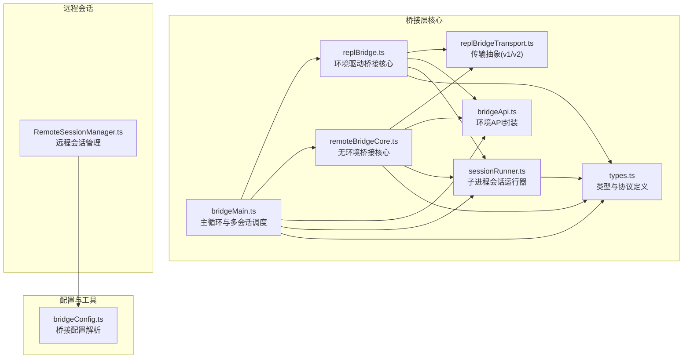

图表来源
- [bridgeMain.ts:1-800](file://src/bridge/bridgeMain.ts#L1-L800)
- [replBridge.ts:1-800](file://src/bridge/replBridge.ts#L1-L800)
- [remoteBridgeCore.ts:1-800](file://src/bridge/remoteBridgeCore.ts#L1-L800)
- [replBridgeTransport.ts:1-371](file://src/bridge/replBridgeTransport.ts#L1-L371)
- [bridgeApi.ts:1-540](file://src/bridge/bridgeApi.ts#L1-L540)
- [types.ts:1-263](file://src/bridge/types.ts#L1-L263)
- [sessionRunner.ts:1-551](file://src/bridge/sessionRunner.ts#L1-L551)
- [RemoteSessionManager.ts:1-344](file://src/remote/RemoteSessionManager.ts#L1-L344)
- [bridgeConfig.ts:1-49](file://src/bridge/bridgeConfig.ts#L1-L49)

章节来源
- [bridgeMain.ts:1-800](file://src/bridge/bridgeMain.ts#L1-L800)
- [replBridge.ts:1-800](file://src/bridge/replBridge.ts#L1-L800)
- [remoteBridgeCore.ts:1-800](file://src/bridge/remoteBridgeCore.ts#L1-L800)
- [replBridgeTransport.ts:1-371](file://src/bridge/replBridgeTransport.ts#L1-L371)
- [bridgeApi.ts:1-540](file://src/bridge/bridgeApi.ts#L1-L540)
- [types.ts:1-263](file://src/bridge/types.ts#L1-L263)
- [sessionRunner.ts:1-551](file://src/bridge/sessionRunner.ts#L1-L551)
- [RemoteSessionManager.ts:1-344](file://src/remote/RemoteSessionManager.ts#L1-L344)
- [bridgeConfig.ts:1-49](file://src/bridge/bridgeConfig.ts#L1-L49)

## 核心组件
- 远程会话管理器（RemoteSessionManager）
  - 负责通过 WebSocket 订阅远端会话事件，通过 HTTP POST 发送用户消息；处理权限请求/取消/响应；维护连接状态与重连。
- 桥接主循环（bridgeMain）
  - 统一的多会话调度与生命周期管理：环境注册、工作轮询、心跳、会话创建/销毁、容量唤醒、日志与状态更新。
- 环境驱动桥接核心（replBridge）
  - 基于 Environments API 的完整桥接流程：环境注册、会话创建、工作轮询、传输选择（v1/v2）、断线重连策略、崩溃恢复。
- 无环境桥接核心（remoteBridgeCore）
  - REPL 场景下绕过环境层，直接通过 /bridge 获取 worker 凭证并建立 v2 传输，支持主动刷新与 401 自动恢复。
- 传输抽象（replBridgeTransport）
  - v1：HybridTransport（WebSocket 读 + HTTP 写到 Session-Ingress）；v2：SSETransport（读）+ CCRClient（写/心跳/状态上报）。
- 桥接 API 客户端（bridgeApi）
  - 封装环境 API：注册/轮询/确认/停止/注销/归档/重连/心跳/权限事件发送；内置 OAuth 刷新与致命错误分类。
- 会话运行器（sessionRunner）
  - 子进程管理：参数拼装、环境变量注入、NDJSON 解析、活动追踪、权限请求转发、令牌热更新。
- 消息编解码与路由（bridgeMessaging）
  - 入站消息解析与去重、控制请求/响应处理、结果消息构造、UUID 去重环形集合。
- 类型与协议（types）
  - 工作项、会话、传输接口、权限事件、回话句柄、桥接配置等强类型定义。
- 桥接配置（bridgeConfig）
  - 统一解析桥接访问令牌与基础 URL，支持 ant 开发者覆盖。

章节来源
- [RemoteSessionManager.ts:95-344](file://src/remote/RemoteSessionManager.ts#L95-L344)
- [bridgeMain.ts:141-800](file://src/bridge/bridgeMain.ts#L141-L800)
- [replBridge.ts:260-800](file://src/bridge/replBridge.ts#L260-L800)
- [remoteBridgeCore.ts:140-800](file://src/bridge/remoteBridgeCore.ts#L140-L800)
- [replBridgeTransport.ts:119-371](file://src/bridge/replBridgeTransport.ts#L119-L371)
- [bridgeApi.ts:68-540](file://src/bridge/bridgeApi.ts#L68-L540)
- [sessionRunner.ts:248-551](file://src/bridge/sessionRunner.ts#L248-L551)
- [bridgeMessaging.ts:132-462](file://src/bridge/bridgeMessaging.ts#L132-L462)
- [types.ts:133-263](file://src/bridge/types.ts#L133-L263)
- [bridgeConfig.ts:17-49](file://src/bridge/bridgeConfig.ts#L17-L49)

## 架构总览
桥接层在“本地桥接进程”与“远端服务端”之间建立稳定、可扩展且安全的通信通道。其核心特征：
- 双路径支持：环境驱动（replBridge）与无环境直连（remoteBridgeCore），满足不同场景需求。
- v1/v2 传输透明切换：根据服务器指示与运行时配置自动选择 HybridTransport 或 SSE+CCRClient。
- 多会话统一调度：bridgeMain 提供统一的会话生命周期、心跳、容量控制与状态显示。
- 安全与合规：OAuth 鉴权、可信设备令牌、权限控制、401/403/410 等致命错误处理。
- 容错与恢复：指数退避、容量唤醒、环境重建、v2 epoch 匹配、401 主动刷新。

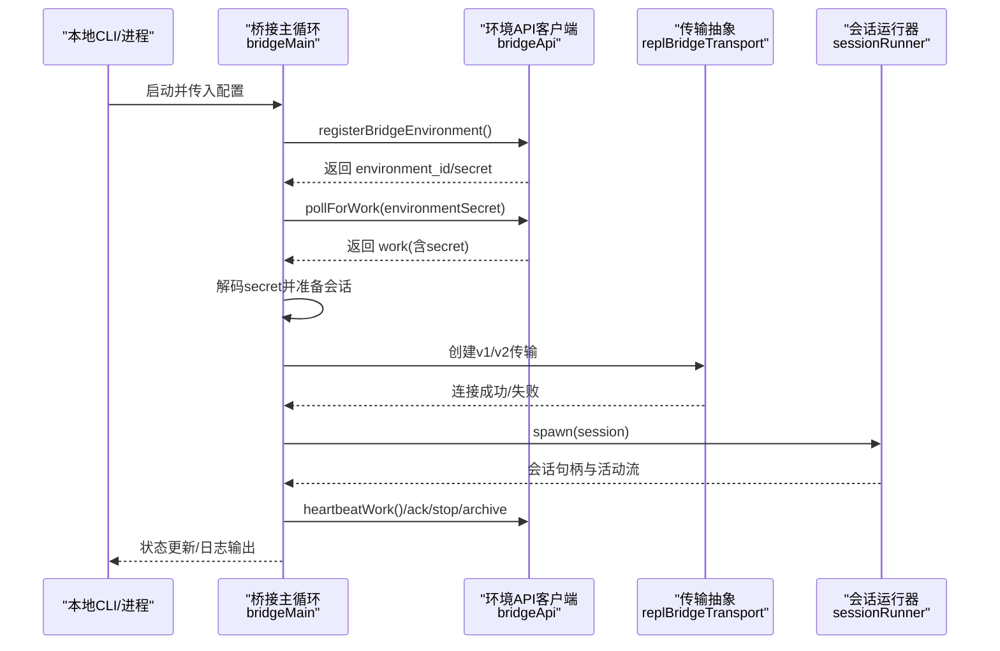

图表来源
- [bridgeMain.ts:141-800](file://src/bridge/bridgeMain.ts#L141-L800)
- [bridgeApi.ts:142-451](file://src/bridge/bridgeApi.ts#L142-L451)
- [replBridgeTransport.ts:119-371](file://src/bridge/replBridgeTransport.ts#L119-L371)
- [sessionRunner.ts:248-551](file://src/bridge/sessionRunner.ts#L248-L551)

## 详细组件分析

### 组件A：桥接主循环（bridgeMain）
职责与实现要点：
- 环境注册与会话池管理：维护活跃会话映射、开始时间、工作 ID、兼容会话 ID、入口 JWT、定时器、已完成工作集、工作树信息、超时会话标记、带标题会话集合、容量唤醒信号。
- 心跳与认证刷新：对所有活跃工作项执行心跳；遇到 401/403 触发 reconnectSession 重新派发；v2 通过 onRefresh 调用 reconnectSession；v1 直接更新 access token。
- 回调与清理：onSessionDone 清理会话资源、移除状态、触发容量唤醒、停止状态更新、归档会话、移除工作树、按单/多会话模式决定退出或继续。
- 状态显示与日志：周期性更新会话计数、活动摘要、空闲/连接中/已断开状态；支持调试日志路径设置。
- 轮询与容量控制：根据配置在“满载/非满载/容量唤醒”三种模式下采用不同轮询/心跳策略；支持 at-capacity 仅心跳模式与到期唤醒。
- 错误预算与睡眠检测：基于最大退避上限阈值检测系统休眠，避免误判；使用指数退避与“放弃阈值”防止无限等待。

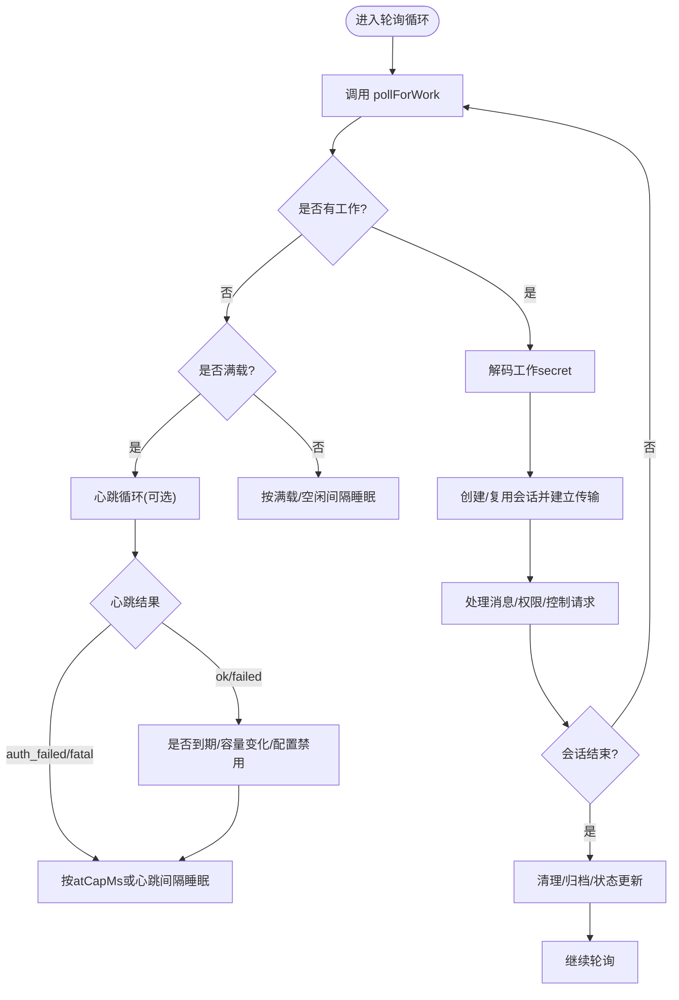

图表来源
- [bridgeMain.ts:600-800](file://src/bridge/bridgeMain.ts#L600-L800)
- [bridgeApi.ts:199-417](file://src/bridge/bridgeApi.ts#L199-L417)

章节来源
- [bridgeMain.ts:141-800](file://src/bridge/bridgeMain.ts#L141-L800)
- [bridgeApi.ts:199-417](file://src/bridge/bridgeApi.ts#L199-L417)

### 组件B：环境驱动桥接核心（replBridge）
职责与实现要点：
- 环境注册与会话创建：注册桥接环境、创建会话、持久化桥接指针（支持“永续模式”崩溃恢复）。
- 工作轮询与传输选择：根据 secret.use_code_sessions 选择 v1 或 v2 传输；v2 通过 registerWorker 获取 epoch 并建立 SSE+CCRClient。
- 断线重连策略：onEnvironmentLost 触发“原地重连（尝试相同环境 ID）+ 新建会话（环境过期）”双策略；并发重连通过 Promise 守卫避免竞态。
- 传输状态与序列号：v2 通过 lastTransportSequenceNum 在传输切换时携带 SSE 序列号，避免历史重放。
- 权限与控制：处理 server-initiated control_request（初始化、设置模型、中断、权限模式等），对 outbound-only 模式拒绝可变请求。

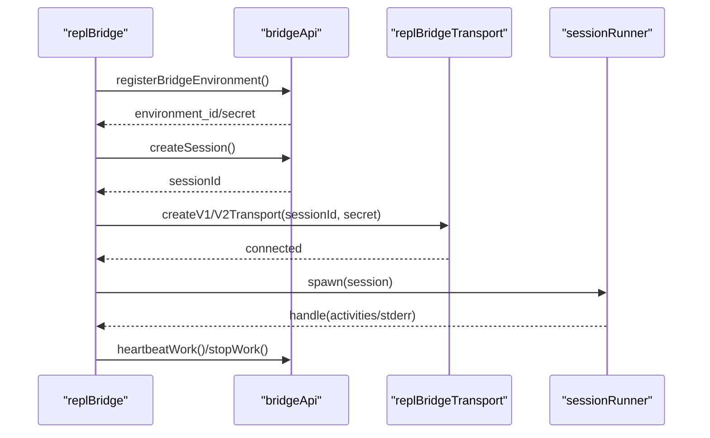

图表来源
- [replBridge.ts:260-800](file://src/bridge/replBridge.ts#L260-L800)
- [replBridgeTransport.ts:119-371](file://src/bridge/replBridgeTransport.ts#L119-L371)
- [bridgeApi.ts:142-417](file://src/bridge/bridgeApi.ts#L142-L417)
- [sessionRunner.ts:248-551](file://src/bridge/sessionRunner.ts#L248-L551)

章节来源
- [replBridge.ts:260-800](file://src/bridge/replBridge.ts#L260-L800)
- [replBridgeTransport.ts:119-371](file://src/bridge/replBridgeTransport.ts#L119-L371)
- [bridgeApi.ts:142-417](file://src/bridge/bridgeApi.ts#L142-L417)
- [sessionRunner.ts:248-551](file://src/bridge/sessionRunner.ts#L248-L551)

### 组件C：无环境桥接核心（remoteBridgeCore）
职责与实现要点：
- 直连模式：POST /v1/code/sessions → POST /v1/code/sessions/{id}/bridge → 建立 v2 传输 → 主动 JWT 刷新 → 401 自动恢复。
- 状态机与回调：onConnect/onData/onClose 回调绑定；connectDeadline 超时监控；onUserMessage 标题推导；onPermissionResponse 控制请求恢复。
- 传输重建：rebuildTransport 支持“主动刷新”和“401 恢复”，确保 epoch 一致性；队列门（FlushGate）保证重建期间的消息不丢失。
- 关闭与归档：teardown 流程先写入结果事件再归档会话，必要时二次 401 刷新后归档；记录归档状态用于遥测。

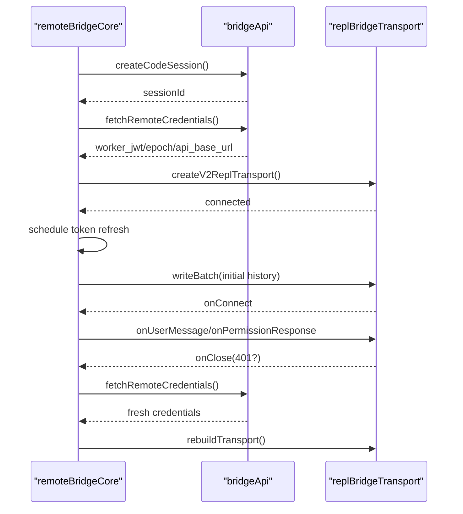

图表来源
- [remoteBridgeCore.ts:140-800](file://src/bridge/remoteBridgeCore.ts#L140-L800)
- [replBridgeTransport.ts:119-371](file://src/bridge/replBridgeTransport.ts#L119-L371)
- [bridgeApi.ts:199-417](file://src/bridge/bridgeApi.ts#L199-L417)

章节来源
- [remoteBridgeCore.ts:140-800](file://src/bridge/remoteBridgeCore.ts#L140-L800)
- [replBridgeTransport.ts:119-371](file://src/bridge/replBridgeTransport.ts#L119-L371)
- [bridgeApi.ts:199-417](file://src/bridge/bridgeApi.ts#L199-L417)

### 组件D：传输抽象（replBridgeTransport）
职责与实现要点：
- v1 适配：HybridTransport 暴露统一接口，便于与 replBridge 集成。
- v2 适配：SSETransport（读）+ CCRClient（写/心跳/状态/交付跟踪）。registerWorker 或 /bridge 获取 epoch；409 epoch 不匹配时关闭并通知上层；onConnect 在 CCR 初始化完成后触发；reportState/reportMetadata/reportDelivery 用于服务端可观测性。
- 写入与刷新：write/writeBatch 通过 CCRClient；flush 在关闭前确保队列清空。

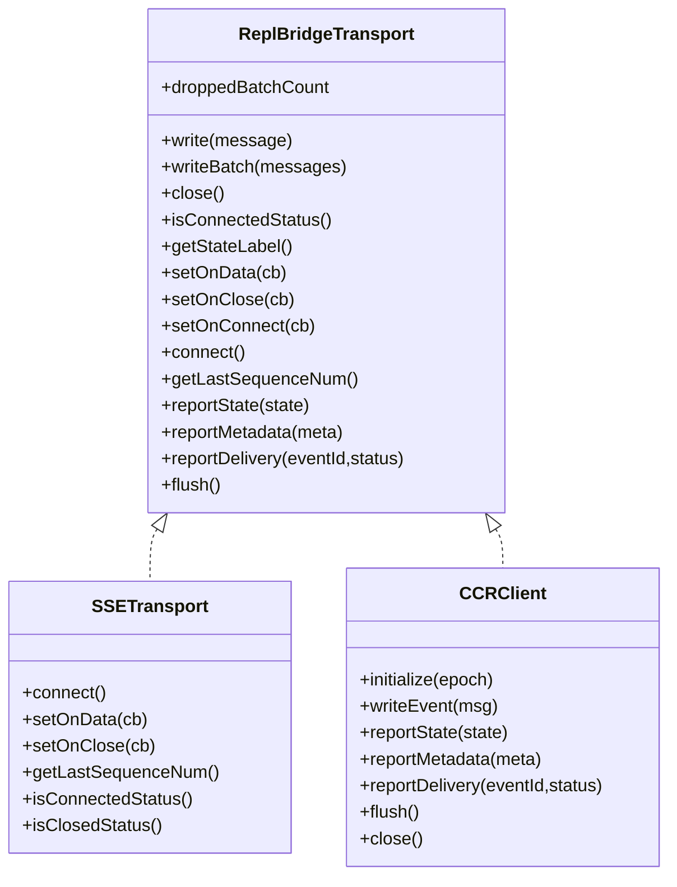

图表来源
- [replBridgeTransport.ts:23-70](file://src/bridge/replBridgeTransport.ts#L23-L70)
- [replBridgeTransport.ts:119-371](file://src/bridge/replBridgeTransport.ts#L119-L371)

章节来源
- [replBridgeTransport.ts:23-70](file://src/bridge/replBridgeTransport.ts#L23-L70)
- [replBridgeTransport.ts:119-371](file://src/bridge/replBridgeTransport.ts#L119-L371)

### 组件E：桥接 API 客户端（bridgeApi）
职责与实现要点：
- 环境 API：registerBridgeEnvironment/pollForWork/acknowledgeWork/stopWork/deregisterEnvironment/archiveSession/reconnectSession/heartbeatWork/sendPermissionResponseEvent。
- 认证与重试：withOAuthRetry 对 401 执行 OAuth 刷新并重试一次；支持 onAuth401 回调；注入可信设备令牌头。
- 错误分类：BridgeFatalError 区分 401/403/404/410 等致命错误；isExpiredErrorType/isSuppressible403 辅助 UI 与日志策略。

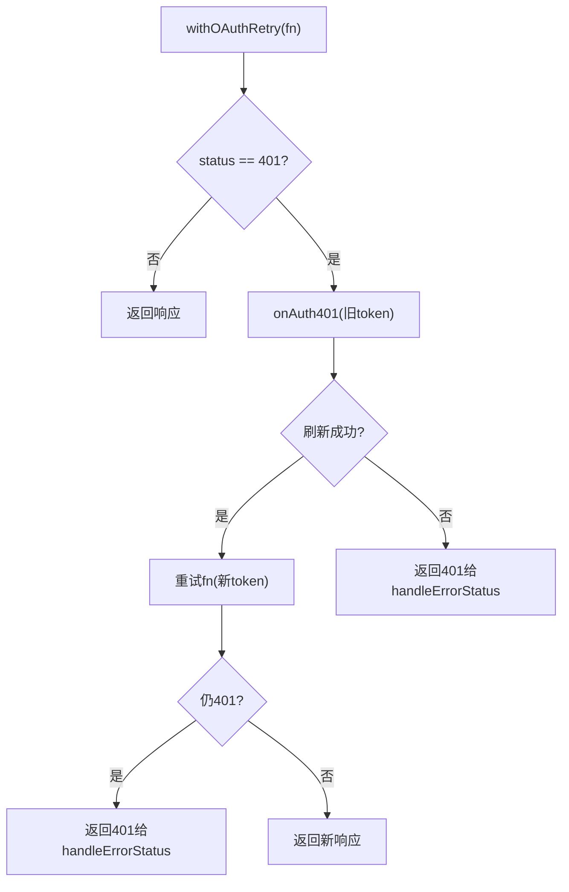

图表来源
- [bridgeApi.ts:106-139](file://src/bridge/bridgeApi.ts#L106-L139)
- [bridgeApi.ts:454-500](file://src/bridge/bridgeApi.ts#L454-L500)

章节来源
- [bridgeApi.ts:68-540](file://src/bridge/bridgeApi.ts#L68-L540)

### 组件F：会话运行器（sessionRunner）
职责与实现要点：
- 子进程启动：拼装参数与环境变量（剥离 OAuth、注入会话访问令牌、v1/v2 环境变量）。
- 输出解析：NDJSON 行解析，提取活动（tool_use/text/result/error）、权限请求、首条用户消息文本。
- 日志与转录：可选调试文件与转录文件；stderr 缓冲用于诊断。
- 令牌热更新：通过 stdin 发送 update_environment_variables 消息，使子进程即时使用新令牌。

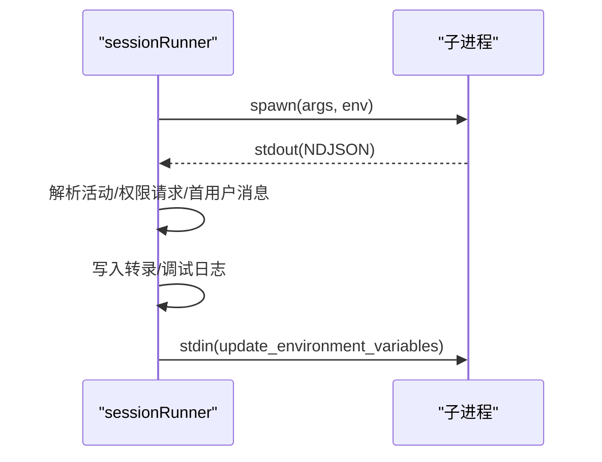

图表来源
- [sessionRunner.ts:248-551](file://src/bridge/sessionRunner.ts#L248-L551)

章节来源
- [sessionRunner.ts:248-551](file://src/bridge/sessionRunner.ts#L248-L551)

### 组件G：消息编解码与路由（bridgeMessaging）
职责与实现要点：
- 入站消息处理：解析 SDKMessage/控制请求/响应；去重（recentPostedUUIDs/recentInboundUUIDs）；过滤非桥接消息（如 tool_result/progress）。
- 控制请求处理：initialize/set_model/set_max_thinking_tokens/set_permission_mode/interrupt；outbound-only 模式拒绝可变请求。
- 结果消息：构造最小化 result.success 事件用于会话归档。
- 去重集合：BoundedUUIDSet 使用环形缓冲与哈希集合，常数空间维持去重窗口。

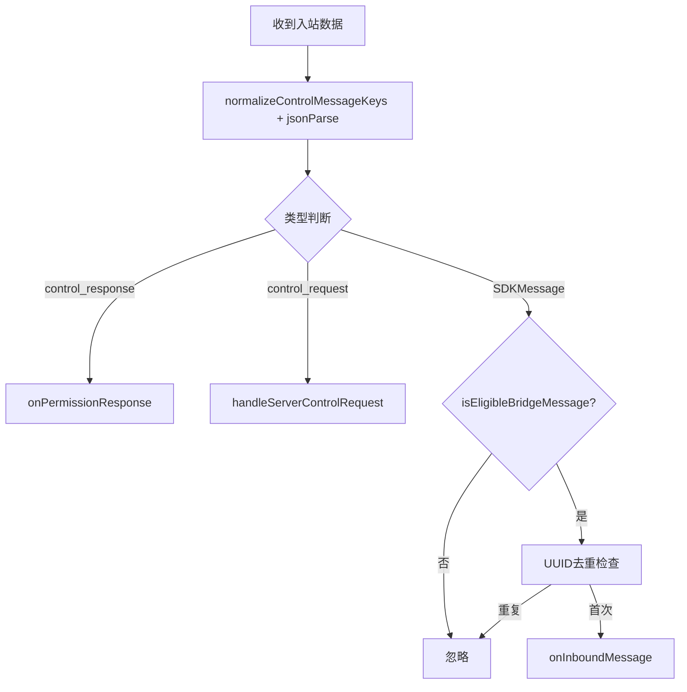

图表来源
- [bridgeMessaging.ts:132-208](file://src/bridge/bridgeMessaging.ts#L132-L208)
- [bridgeMessaging.ts:243-391](file://src/bridge/bridgeMessaging.ts#L243-L391)
- [bridgeMessaging.ts:429-461](file://src/bridge/bridgeMessaging.ts#L429-L461)

章节来源
- [bridgeMessaging.ts:132-462](file://src/bridge/bridgeMessaging.ts#L132-L462)

### 组件H：远程会话管理器（RemoteSessionManager）
职责与实现要点：
- WebSocket 订阅：SessionsWebSocket 接收 SDKMessage/控制请求/取消/响应；区分并路由至回调。
- HTTP 发送：sendEventToRemoteSession 发送用户消息；失败时记录错误。
- 权限流程：缓存 pendingPermissionRequests；respondToPermissionRequest 构造 control_response 并发送。
- 连接管理：connect/reconnect/close；viewerOnly 模式禁用中断与长超时；支持 onConnected/onDisconnected/onReconnecting/onError。

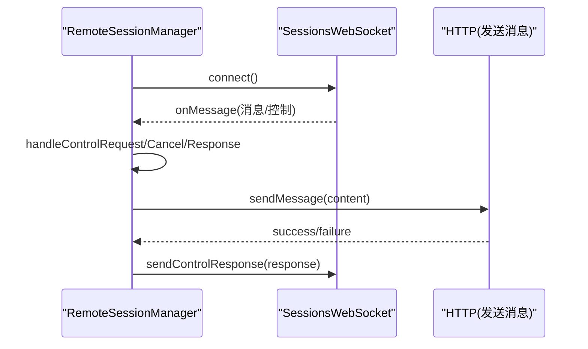

图表来源
- [RemoteSessionManager.ts:108-344](file://src/remote/RemoteSessionManager.ts#L108-L344)

章节来源
- [RemoteSessionManager.ts:95-344](file://src/remote/RemoteSessionManager.ts#L95-L344)

## 依赖关系分析
- 组件耦合与内聚
  - bridgeMain 与 replBridge/remoteBridgeCore 通过统一的 BridgeApiClient 与 ReplBridgeTransport 接口耦合，降低具体实现差异。
  - sessionRunner 与 bridgeMessaging 通过消息类型与回调解耦，便于测试与替换。
- 外部依赖与集成点
  - Axios 作为 HTTP 客户端；WebSocket/SSE 作为实时传输；子进程作为本地执行环境。
  - OAuth 令牌与可信设备令牌通过 bridgeConfig 统一解析，支持 ant 开发者覆盖。
- 循环依赖规避
  - 通过“纯函数模块”（bridgeMessaging、bridgeConfig）与“接口抽象”（ReplBridgeTransport、BridgeApiClient）避免循环导入。

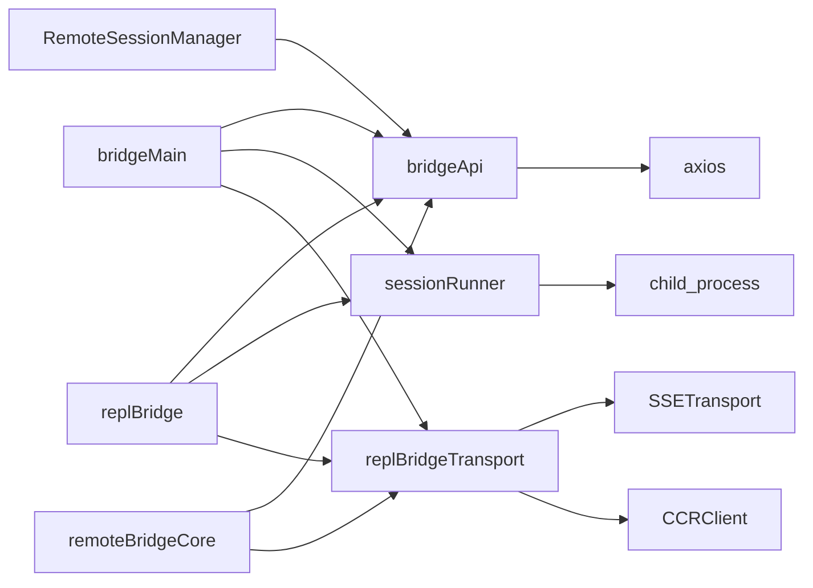

图表来源
- [bridgeMain.ts:141-800](file://src/bridge/bridgeMain.ts#L141-L800)
- [replBridge.ts:260-800](file://src/bridge/replBridge.ts#L260-L800)
- [remoteBridgeCore.ts:140-800](file://src/bridge/remoteBridgeCore.ts#L140-L800)
- [bridgeApi.ts:68-540](file://src/bridge/bridgeApi.ts#L68-L540)
- [replBridgeTransport.ts:119-371](file://src/bridge/replBridgeTransport.ts#L119-L371)
- [sessionRunner.ts:248-551](file://src/bridge/sessionRunner.ts#L248-L551)
- [RemoteSessionManager.ts:108-344](file://src/remote/RemoteSessionManager.ts#L108-L344)

章节来源
- [bridgeMain.ts:141-800](file://src/bridge/bridgeMain.ts#L141-L800)
- [replBridge.ts:260-800](file://src/bridge/replBridge.ts#L260-L800)
- [remoteBridgeCore.ts:140-800](file://src/bridge/remoteBridgeCore.ts#L140-L800)
- [bridgeApi.ts:68-540](file://src/bridge/bridgeApi.ts#L68-L540)
- [replBridgeTransport.ts:119-371](file://src/bridge/replBridgeTransport.ts#L119-L371)
- [sessionRunner.ts:248-551](file://src/bridge/sessionRunner.ts#L248-L551)
- [RemoteSessionManager.ts:108-344](file://src/remote/RemoteSessionManager.ts#L108-L344)

## 性能考虑
- 传输选择
  - v2（SSE+CCRClient）在高并发与长连接场景下具备更优的稳定性与可观测性；v1 适合轻量场景。
- 轮询与心跳
  - 多会话模式下启用 at-capacity 仅心跳，减少服务器压力；满载/非满载采用不同轮询间隔。
- 去重与顺序
  - BoundedUUIDSet 与 FlushGate 保障消息顺序与去重，避免重复处理与历史重放。
- 资源回收
  - 会话结束及时清理定时器、刷新计划、工作树；teardown 先写结果事件再归档，缩短不可用窗口。
- 令牌刷新
  - 主动刷新（v2）与被动刷新（v1）结合，避免长时间持有过期 JWT 导致的频繁 401。

## 故障排查指南
- 常见致命错误
  - 401：登录失效或令牌过期，触发 withOAuthRetry；若无 onAuth401 或刷新失败则抛出 BridgeFatalError。
  - 403：权限不足或会话过期；部分 403 可抑制（如外部轮询/管理权限缺失）。
  - 404/410：环境不存在或会话过期，需重建环境与会话。
- 重连与恢复
  - onEnvironmentLost 触发“原地重连 + 新建会话”双策略；rebuildTransport 确保 epoch 一致；容量唤醒加速恢复。
- 传输问题
  - v2 409（epoch 不匹配）：关闭 CCRClient/SSETransport 并通知上层；由 poll 循环重新派发。
  - 401：主动刷新 /bridge 凭证并重建传输；outbound-only 模式拒绝可变请求。
- 日志与诊断
  - 使用 --debug-file 或临时日志路径定位问题；关注“reconnected”“heartbeat_mode_entered/exited”“bridge_repl_v2_*”等关键事件。

章节来源
- [bridgeApi.ts:454-500](file://src/bridge/bridgeApi.ts#L454-L500)
- [replBridge.ts:605-798](file://src/bridge/replBridge.ts#L605-L798)
- [remoteBridgeCore.ts:468-590](file://src/bridge/remoteBridgeCore.ts#L468-L590)
- [bridgeMain.ts:202-270](file://src/bridge/bridgeMain.ts#L202-L270)

## 结论
Claude Code 的桥接层通过“环境驱动 + 无环境直连”的双路径设计、v1/v2 传输抽象、完善的会话生命周期管理与去重/重连机制，实现了在复杂分布式环境下对本地与远程会话的统一管理。配合 OAuth/可信设备令牌与严格的致命错误处理，系统在安全性、可靠性与可扩展性方面均达到工程级标准。建议在生产环境中结合容量策略、日志与遥测持续优化轮询与传输参数，并通过自动化测试覆盖关键重连与恢复路径。

## 附录
- 关键类型与协议
  - WorkResponse/WorkSecret：工作项与会话凭证结构。
  - ReplBridgeTransport 接口：统一 v1/v2 传输能力。
  - SessionHandle：会话句柄与活动追踪。
- 配置与覆盖
  - getBridgeAccessToken/getBridgeBaseUrl 支持 ant 开发者覆盖；getBridgeTokenOverride/getBridgeBaseUrlOverride 提供开发调试便利。

章节来源
- [types.ts:18-263](file://src/bridge/types.ts#L18-L263)
- [bridgeConfig.ts:17-49](file://src/bridge/bridgeConfig.ts#L17-L49)