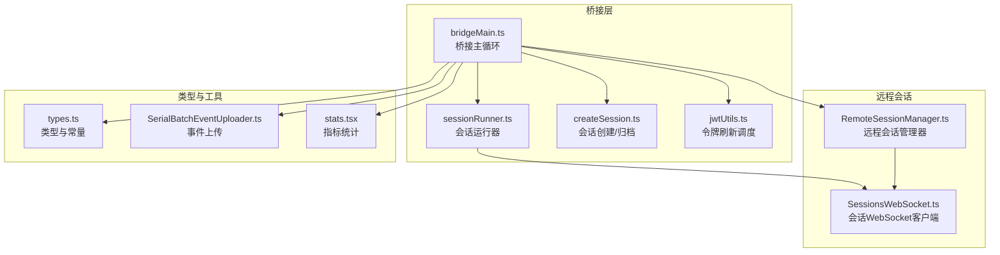
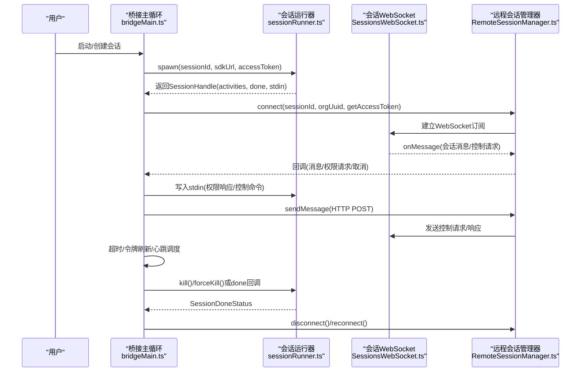
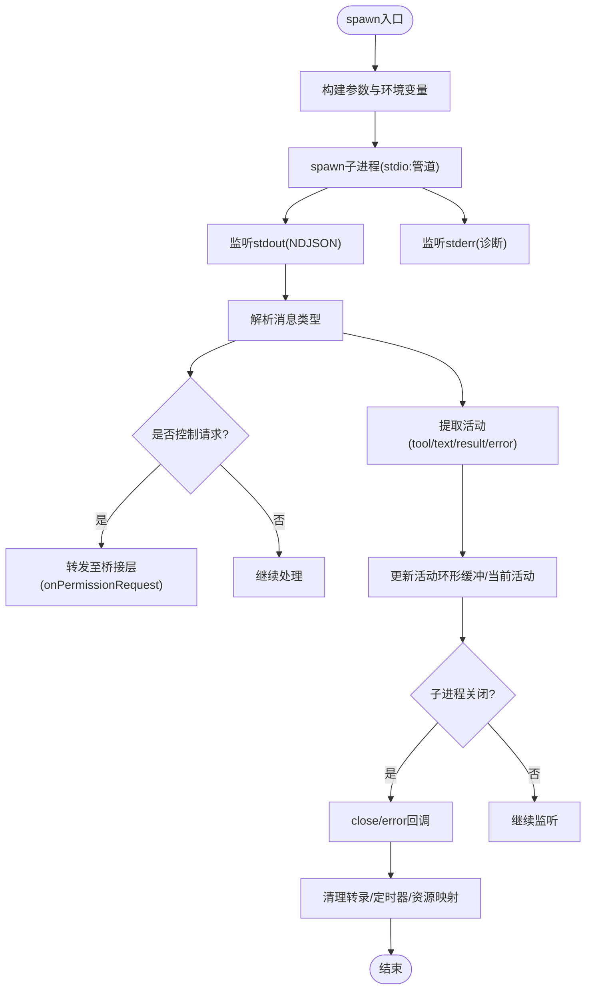
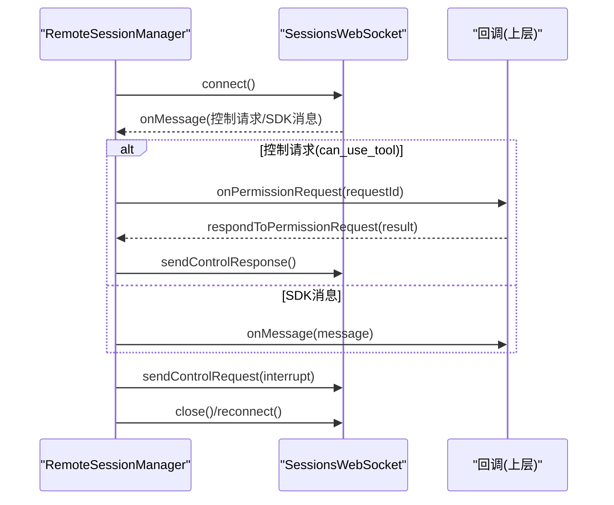
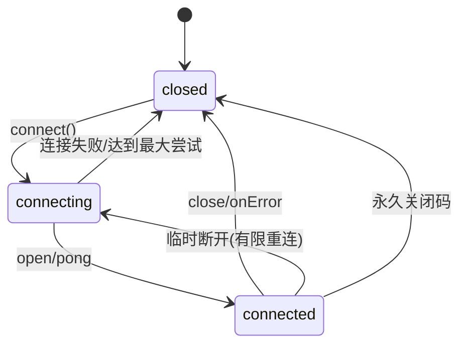
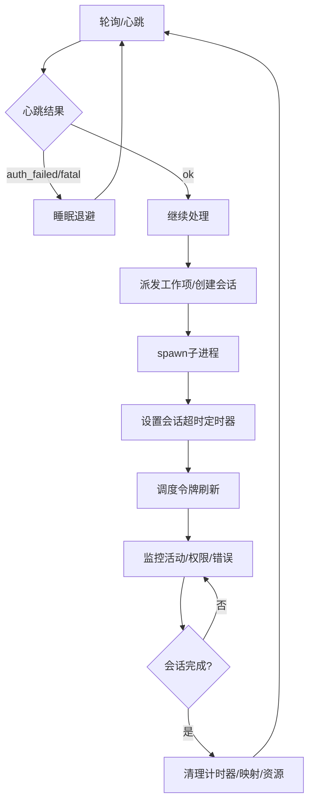
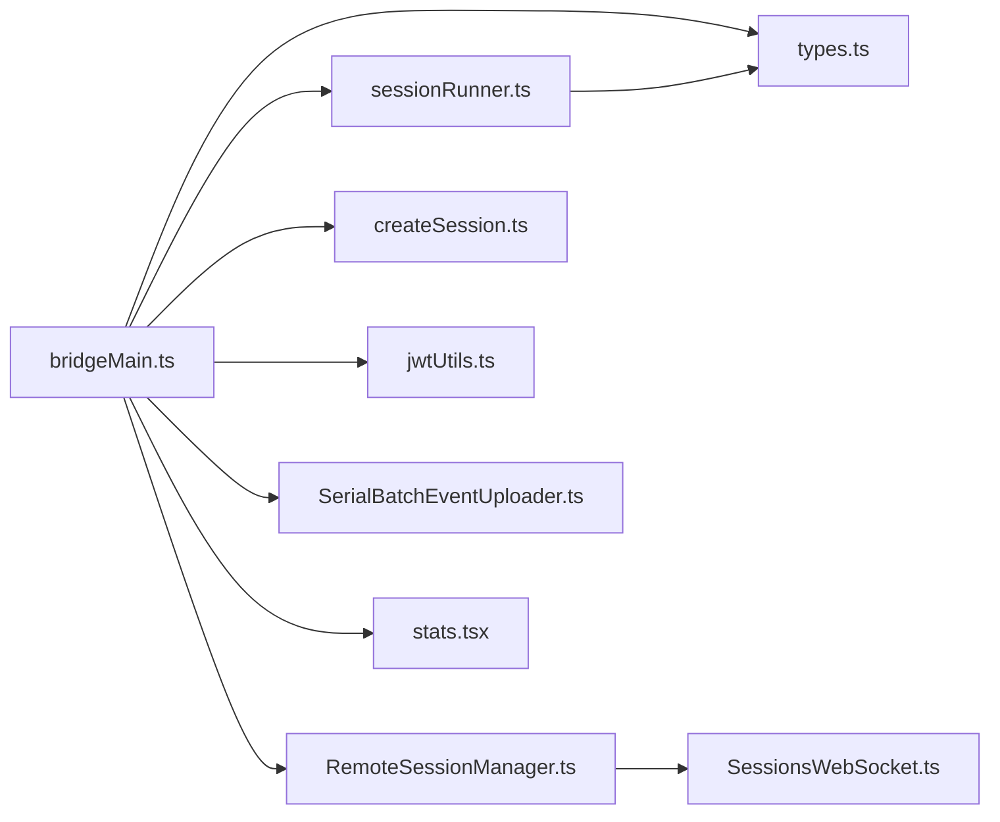

# 远程会话管理

<cite>
**本文档引用的文件**
- [src/bridge/sessionRunner.ts](file://src/bridge/sessionRunner.ts)
- [src/remote/RemoteSessionManager.ts](file://src/remote/RemoteSessionManager.ts)
- [src/remote/SessionsWebSocket.ts](file://src/remote/SessionsWebSocket.ts)
- [src/bridge/bridgeMain.ts](file://src/bridge/bridgeMain.ts)
- [src/bridge/types.ts](file://src/bridge/types.ts)
- [src/bridge/createSession.ts](file://src/bridge/createSession.ts)
- [src/bridge/jwtUtils.ts](file://src/bridge/jwtUtils.ts)
- [src/cli/transports/SerialBatchEventUploader.ts](file://src/cli/transports/SerialBatchEventUploader.ts)
- [src/context/stats.tsx](file://src/context/stats.tsx)
</cite>

## 目录
1. [引言](#引言)
2. [项目结构](#项目结构)
3. [核心组件](#核心组件)
4. [架构总览](#架构总览)
5. [详细组件分析](#详细组件分析)
6. [依赖关系分析](#依赖关系分析)
7. [性能考量](#性能考量)
8. [故障排查指南](#故障排查指南)
9. [结论](#结论)
10. [附录](#附录)

## 引言
本文件系统性梳理 Claude Code 的远程会话管理系统，聚焦于远程会话的全生命周期管理：从会话创建、启动、监控到销毁；深入解析会话运行器（SessionRunner）的进程 spawn、环境变量配置与工作树管理；阐述会话状态跟踪（活动状态、超时管理、错误处理）；说明会话间通信协调（消息路由、状态同步、资源分配）；并给出架构图与状态转换图，展示会话在不同阶段的行为特征。同时覆盖容错机制（自动重启、故障转移、数据持久化）、性能监控与优化策略。

## 项目结构
围绕远程会话管理的关键模块如下：
- 会话运行器与桥接层：负责子进程 spawn、环境变量注入、标准流解析、权限请求转发、会话超时与令牌刷新等
- 远程会话管理器：负责 WebSocket 订阅、HTTP 发送消息、权限请求响应、断线重连与中断控制
- 会话 WebSocket 客户端：负责连接建立、心跳、重连策略、消息解析与回调分发
- 桥接主循环：负责多会话调度、工作项轮询、心跳保活、超时与令牌刷新调度、资源回收
- 类型与常量：定义会话活动类型、完成状态、桥接配置、工作密钥等
- 会话创建与归档：通过 HTTP 接口创建/获取/归档会话，支持标题同步
- 令牌刷新工具：基于 JWT 到期时间与缓冲区调度定时刷新
- 事件上传与统计：批量事件上传的重试退避与指标统计

图表来源
- [src/bridge/bridgeMain.ts:141-300](file://src/bridge/bridgeMain.ts#L141-L300)
- [src/bridge/sessionRunner.ts:248-548](file://src/bridge/sessionRunner.ts#L248-L548)
- [src/remote/RemoteSessionManager.ts:95-324](file://src/remote/RemoteSessionManager.ts#L95-L324)
- [src/remote/SessionsWebSocket.ts:82-404](file://src/remote/SessionsWebSocket.ts#L82-L404)
- [src/bridge/types.ts:1-263](file://src/bridge/types.ts#L1-L263)
- [src/bridge/createSession.ts:34-180](file://src/bridge/createSession.ts#L34-L180)
- [src/bridge/jwtUtils.ts:134-256](file://src/bridge/jwtUtils.ts#L134-L256)
- [src/cli/transports/SerialBatchEventUploader.ts:235-275](file://src/cli/transports/SerialBatchEventUploader.ts#L235-L275)
- [src/context/stats.tsx:38-144](file://src/context/stats.tsx#L38-L144)

章节来源
- [src/bridge/bridgeMain.ts:141-300](file://src/bridge/bridgeMain.ts#L141-L300)
- [src/bridge/sessionRunner.ts:248-548](file://src/bridge/sessionRunner.ts#L248-L548)
- [src/remote/RemoteSessionManager.ts:95-324](file://src/remote/RemoteSessionManager.ts#L95-L324)
- [src/remote/SessionsWebSocket.ts:82-404](file://src/remote/SessionsWebSocket.ts#L82-L404)
- [src/bridge/types.ts:1-263](file://src/bridge/types.ts#L1-L263)
- [src/bridge/createSession.ts:34-180](file://src/bridge/createSession.ts#L34-L180)
- [src/bridge/jwtUtils.ts:134-256](file://src/bridge/jwtUtils.ts#L134-L256)
- [src/cli/transports/SerialBatchEventUploader.ts:235-275](file://src/cli/transports/SerialBatchEventUploader.ts#L235-L275)
- [src/context/stats.tsx:38-144](file://src/context/stats.tsx#L38-L144)

## 核心组件
- 会话运行器（SessionRunner）
  - 负责子进程 spawn、环境变量注入、标准流解析、权限请求转发、会话完成状态判定、调试日志与转录记录
  - 关键职责：构建子进程参数与环境、解析 stdout NDJSON 提取活动、捕获 stderr 诊断、处理控制请求（如工具调用许可）、发送/更新访问令牌、清理资源
- 远程会话管理器（RemoteSessionManager）
  - 通过 WebSocket 订阅会话消息，通过 HTTP 发送用户消息，处理权限请求与取消，支持中断、重连与断开
- 会话 WebSocket 客户端（SessionsWebSocket）
  - 建立与维护 WebSocket 连接，心跳保活，有限重连策略，消息解析与回调分发
- 桥接主循环（bridgeMain）
  - 多会话调度、轮询与心跳、超时与令牌刷新调度、工作项回收、资源清理、断线重连策略
- 类型与常量（types）
  - 定义会话活动类型、完成状态、桥接配置、工作密钥、会话句柄接口等
- 会话创建与归档（createSession）
  - 通过 HTTP 接口创建/获取/归档会话，支持标题同步与上下文注入
- 令牌刷新工具（jwtUtils）
  - 基于 JWT 到期时间与缓冲区调度定时刷新，支持取消与失败计数
- 事件上传与统计（SerialBatchEventUploader、stats）
  - 批量事件上传的指数退避与抖动，会话指标统计与持久化

章节来源
- [src/bridge/sessionRunner.ts:248-548](file://src/bridge/sessionRunner.ts#L248-L548)
- [src/remote/RemoteSessionManager.ts:95-324](file://src/remote/RemoteSessionManager.ts#L95-L324)
- [src/remote/SessionsWebSocket.ts:82-404](file://src/remote/SessionsWebSocket.ts#L82-L404)
- [src/bridge/bridgeMain.ts:141-300](file://src/bridge/bridgeMain.ts#L141-L300)
- [src/bridge/types.ts:1-263](file://src/bridge/types.ts#L1-L263)
- [src/bridge/createSession.ts:34-180](file://src/bridge/createSession.ts#L34-L180)
- [src/bridge/jwtUtils.ts:134-256](file://src/bridge/jwtUtils.ts#L134-L256)
- [src/cli/transports/SerialBatchEventUploader.ts:235-275](file://src/cli/transports/SerialBatchEventUploader.ts#L235-L275)
- [src/context/stats.tsx:38-144](file://src/context/stats.tsx#L38-L144)

## 架构总览
远程会话管理由“桥接层 + 远程会话”双层协作构成：
- 桥接层负责本地会话生命周期管理（创建、spawn、监控、超时、令牌刷新、归档），并与远程服务交互
- 远程会话负责与远端会话进行消息订阅与控制（权限、中断、重连）

图表来源
- [src/bridge/bridgeMain.ts:141-300](file://src/bridge/bridgeMain.ts#L141-L300)
- [src/bridge/sessionRunner.ts:248-548](file://src/bridge/sessionRunner.ts#L248-L548)
- [src/remote/RemoteSessionManager.ts:95-324](file://src/remote/RemoteSessionManager.ts#L95-L324)
- [src/remote/SessionsWebSocket.ts:82-404](file://src/remote/SessionsWebSocket.ts#L82-L404)

## 详细组件分析

### 会话运行器（SessionRunner）工作机制
- 进程 spawn
  - 解析执行路径与脚本参数，拼接 CLI 参数（SDK URL、会话 ID、输入输出格式、调试文件、权限模式等）
  - 注入环境变量：移除桥接 OAuth 令牌、设置桥接环境标识、会话访问令牌、传输方式标志、可选 v2 环境变量
  - 以管道方式连接 stdin/stdout/stderr，便于解析与诊断
- 环境变量配置
  - 会话访问令牌通过 stdin 的“更新环境变量”消息动态下发，避免重启子进程
  - 支持沙箱强制开启、调试文件与转录文件生成
- 工作树管理
  - 通过工作树钩子或 git 根目录隔离多会话工作空间，支持同目录共享与工作树隔离两种模式
- 活动提取与权限请求
  - 解析 stdout 的 NDJSON，提取工具使用、文本、结果与错误等会话活动
  - 捕获控制请求（如工具调用许可），转发给桥接层处理
- 会话完成与清理
  - 监听子进程 close/error，区分中断、成功、失败三种完成状态
  - 清理转录文件、令牌刷新定时器、会话计时器与资源映射

图表来源
- [src/bridge/sessionRunner.ts:248-548](file://src/bridge/sessionRunner.ts#L248-L548)

章节来源
- [src/bridge/sessionRunner.ts:248-548](file://src/bridge/sessionRunner.ts#L248-L548)

### 远程会话管理器（RemoteSessionManager）
- 连接与消息处理
  - 通过 SessionsWebSocket 订阅会话消息，区分 SDK 消息与控制消息（请求/响应/取消）
  - 对权限请求进行缓存与回调，支持取消与错误响应
- 权限请求与响应
  - 将服务器发起的权限请求转发给上层 UI 或处理逻辑，等待用户决策后回传
  - 对不支持的控制请求类型返回错误响应，避免挂起
- 中断与断开
  - 支持发送中断控制请求（如 Ctrl+C/Escape）
  - 提供断开与强制重连能力，用于订阅过期或容器重启场景

图表来源
- [src/remote/RemoteSessionManager.ts:95-324](file://src/remote/RemoteSessionManager.ts#L95-L324)
- [src/remote/SessionsWebSocket.ts:82-404](file://src/remote/SessionsWebSocket.ts#L82-L404)

章节来源
- [src/remote/RemoteSessionManager.ts:95-324](file://src/remote/RemoteSessionManager.ts#L95-L324)
- [src/remote/SessionsWebSocket.ts:82-404](file://src/remote/SessionsWebSocket.ts#L82-L404)

### 会话 WebSocket 客户端（SessionsWebSocket）
- 连接与认证
  - 使用组织 UUID 与访问令牌构造 WebSocket URL 并建立连接
  - 支持代理与 mTLS 配置
- 心跳与重连
  - 定期 ping 保持连接活跃
  - 对瞬时断开进行有限次数重连；对特定永久码直接停止重连
  - 对 4001（会话未找到）进行有限重试，避免压缩期间的短暂异常
- 消息解析与回调
  - 解析 JSON 消息，过滤未知类型，将有效消息转发给回调

图表来源
- [src/remote/SessionsWebSocket.ts:82-404](file://src/remote/SessionsWebSocket.ts#L82-L404)

章节来源
- [src/remote/SessionsWebSocket.ts:82-404](file://src/remote/SessionsWebSocket.ts#L82-L404)

### 桥接主循环（bridgeMain）
- 多会话调度
  - 维护活动会话映射、开始时间、工作 ID、兼容会话 ID、会话令牌、计时器、工作树信息、已命名会话集合等
  - 支持单会话与多会话模式，按容量与工作树策略调度
- 轮询与心跳
  - 周期性轮询工作项，心跳保活，根据心跳结果调整退避策略
  - 在认证失败或致命错误时进行睡眠退避，避免紧循环
- 超时与令牌刷新
  - 为每个会话设置超时定时器，超时视为失败并触发回收
  - 基于 JWT 到期时间与缓冲区调度令牌刷新，支持取消与失败计数
- 会话完成回调
  - 清理计时器、令牌刷新、容量唤醒、会话映射与资源
  - 区分超时中断与其他中断，统一归档与回收

图表来源
- [src/bridge/bridgeMain.ts:141-300](file://src/bridge/bridgeMain.ts#L141-L300)
- [src/bridge/jwtUtils.ts:134-256](file://src/bridge/jwtUtils.ts#L134-L256)

章节来源
- [src/bridge/bridgeMain.ts:141-300](file://src/bridge/bridgeMain.ts#L141-L300)
- [src/bridge/jwtUtils.ts:134-256](file://src/bridge/jwtUtils.ts#L134-L256)

### 会话创建、获取与归档
- 创建会话
  - 通过 HTTP POST /v1/sessions 创建，支持标题、事件、Git 上下文与权限模式
  - 返回会话 ID，失败时记录错误详情
- 获取会话
  - 通过 HTTP GET /v1/sessions/{id} 获取环境 ID 与标题
- 归档会话
  - 通过 HTTP POST /v1/sessions/{id}/archive 归档，幂等处理已归档状态

章节来源
- [src/bridge/createSession.ts:34-180](file://src/bridge/createSession.ts#L34-L180)
- [src/bridge/createSession.ts:190-244](file://src/bridge/createSession.ts#L190-L244)
- [src/bridge/createSession.ts:263-317](file://src/bridge/createSession.ts#L263-L317)

### 会话状态跟踪与超时管理
- 会话活动类型
  - 工具开始、文本、结果、错误，均带有摘要与时间戳
- 超时管理
  - 默认会话超时 24 小时，可在配置中覆盖
  - 超时触发后标记为“被超时中断”，统一按失败处理并回收
- 错误处理
  - 子进程错误、WebSocket 解析错误、HTTP 请求失败均有日志与降级处理
  - 4001（会话未找到）进行有限重试，避免压缩期间的瞬态异常

章节来源
- [src/bridge/types.ts:1-263](file://src/bridge/types.ts#L1-L263)
- [src/remote/SessionsWebSocket.ts:82-404](file://src/remote/SessionsWebSocket.ts#L82-L404)
- [src/bridge/bridgeMain.ts:442-746](file://src/bridge/bridgeMain.ts#L442-L746)

### 会话间通信协调
- 消息路由
  - WebSocket 负责下行消息（SDK 消息、控制请求），HTTP 负责上行用户消息
  - 权限请求在控制通道中流转，避免阻塞主消息流
- 状态同步
  - 会话标题通过 PATCH 接口同步，保证 UI 一致性
  - 活动状态通过桥接层实时更新显示
- 资源分配
  - 多会话模式下按容量与工作树策略分配资源，避免相互干扰

章节来源
- [src/remote/RemoteSessionManager.ts:219-242](file://src/remote/RemoteSessionManager.ts#L219-L242)
- [src/bridge/createSession.ts:327-384](file://src/bridge/createSession.ts#L327-L384)
- [src/bridge/bridgeMain.ts:141-300](file://src/bridge/bridgeMain.ts#L141-L300)

### 容错机制
- 自动重启与故障转移
  - WebSocket 断线有限重连；4001 有限重试；心跳失败睡眠退避
  - 会话恢复：通过重新排队与强制停止旧实例，确保新实例接管
- 数据持久化
  - 调试日志与转录文件持久化，便于问题复盘
  - 会话指标统计在退出时保存，避免丢失

章节来源
- [src/remote/SessionsWebSocket.ts:82-404](file://src/remote/SessionsWebSocket.ts#L82-L404)
- [src/bridge/bridgeMain.ts:715-746](file://src/bridge/bridgeMain.ts#L715-L746)
- [src/context/stats.tsx:38-144](file://src/context/stats.tsx#L38-L144)

## 依赖关系分析
- 组件耦合
  - bridgeMain 依赖 sessionRunner、RemoteSessionManager、createSession、jwtUtils、types 等
  - RemoteSessionManager 依赖 SessionsWebSocket 与 HTTP 发送接口
  - sessionRunner 依赖 types 中的 SessionHandle、SessionActivity 等类型
- 外部依赖
  - WebSocket 客户端（浏览器原生或 ws 包），支持代理与 mTLS
  - HTTP 客户端（axios）用于会话创建/获取/归档
  - 子进程（child_process）用于会话运行器

图表来源
- [src/bridge/bridgeMain.ts:141-300](file://src/bridge/bridgeMain.ts#L141-L300)
- [src/bridge/sessionRunner.ts:248-548](file://src/bridge/sessionRunner.ts#L248-L548)
- [src/remote/RemoteSessionManager.ts:95-324](file://src/remote/RemoteSessionManager.ts#L95-L324)
- [src/remote/SessionsWebSocket.ts:82-404](file://src/remote/SessionsWebSocket.ts#L82-L404)
- [src/bridge/createSession.ts:34-180](file://src/bridge/createSession.ts#L34-L180)
- [src/bridge/jwtUtils.ts:134-256](file://src/bridge/jwtUtils.ts#L134-L256)
- [src/bridge/types.ts:1-263](file://src/bridge/types.ts#L1-L263)
- [src/cli/transports/SerialBatchEventUploader.ts:235-275](file://src/cli/transports/SerialBatchEventUploader.ts#L235-L275)
- [src/context/stats.tsx:38-144](file://src/context/stats.tsx#L38-L144)

章节来源
- [src/bridge/bridgeMain.ts:141-300](file://src/bridge/bridgeMain.ts#L141-L300)
- [src/bridge/sessionRunner.ts:248-548](file://src/bridge/sessionRunner.ts#L248-L548)
- [src/remote/RemoteSessionManager.ts:95-324](file://src/remote/RemoteSessionManager.ts#L95-L324)
- [src/remote/SessionsWebSocket.ts:82-404](file://src/remote/SessionsWebSocket.ts#L82-L404)
- [src/bridge/createSession.ts:34-180](file://src/bridge/createSession.ts#L34-L180)
- [src/bridge/jwtUtils.ts:134-256](file://src/bridge/jwtUtils.ts#L134-L256)
- [src/bridge/types.ts:1-263](file://src/bridge/types.ts#L1-L263)
- [src/cli/transports/SerialBatchEventUploader.ts:235-275](file://src/cli/transports/SerialBatchEventUploader.ts#L235-L275)
- [src/context/stats.tsx:38-144](file://src/context/stats.tsx#L38-L144)

## 性能考量
- 事件上传退避
  - 基于 Retry-After 与指数退避，加入抖动防止风暴效应
- 指标统计
  - 使用直方图与抽样算法计算 p50/p95/p99，结合集合去重统计唯一值
- 会话超时与令牌刷新
  - 合理设置超时阈值与刷新缓冲，避免频繁中断与鉴权失效
- 多会话调度
  - 依据容量与工作树策略平衡并发度，减少资源争用

章节来源
- [src/cli/transports/SerialBatchEventUploader.ts:235-275](file://src/cli/transports/SerialBatchEventUploader.ts#L235-L275)
- [src/context/stats.tsx:38-144](file://src/context/stats.tsx#L38-L144)
- [src/bridge/types.ts:1-263](file://src/bridge/types.ts#L1-L263)
- [src/bridge/jwtUtils.ts:134-256](file://src/bridge/jwtUtils.ts#L134-L256)

## 故障排查指南
- WebSocket 连接失败
  - 检查代理与 mTLS 配置；关注永久关闭码（如 4003）与 4001 重试上限
- 会话未找到（4001）
  - 等待压缩完成或增加重试窗口；确认会话 ID 有效性
- 权限请求未决
  - 确认 RemoteSessionManager 是否正确缓存并回调；检查控制响应是否送达
- 令牌过期
  - 检查 jwtUtils 的刷新调度与取消逻辑；确认会话访问令牌是否通过 stdin 更新
- 会话超时
  - 调整 DEFAULT_SESSION_TIMEOUT_MS 或会话级别 sessionTimeoutMs；检查长时间任务是否合理拆分

章节来源
- [src/remote/SessionsWebSocket.ts:82-404](file://src/remote/SessionsWebSocket.ts#L82-L404)
- [src/remote/RemoteSessionManager.ts:95-324](file://src/remote/RemoteSessionManager.ts#L95-L324)
- [src/bridge/jwtUtils.ts:134-256](file://src/bridge/jwtUtils.ts#L134-L256)
- [src/bridge/types.ts:1-263](file://src/bridge/types.ts#L1-L263)

## 结论
该远程会话管理系统通过“桥接层 + 远程会话”的清晰分层，实现了从会话创建、启动、监控到销毁的全生命周期管理。会话运行器负责底层进程与流处理，远程会话管理器负责与远端的通信与控制，桥接主循环则承担多会话调度与资源管理。配合完善的超时、令牌刷新、重连与归档机制，系统在复杂网络与长时任务场景下具备良好的稳定性与可观测性。

## 附录
- 关键类型与常量
  - 会话活动类型：工具开始、文本、结果、错误
  - 完成状态：completed、failed、interrupted
  - 默认会话超时：24 小时
- 典型流程参考
  - 会话创建：POST /v1/sessions → 返回 sessionId
  - 会话订阅：WebSocket /v1/sessions/ws/{id}/subscribe
  - 会话消息：HTTP POST /v1/sessions/{id}/events
  - 会话归档：POST /v1/sessions/{id}/archive

章节来源
- [src/bridge/types.ts:1-263](file://src/bridge/types.ts#L1-L263)
- [src/bridge/createSession.ts:34-180](file://src/bridge/createSession.ts#L34-L180)
- [src/remote/SessionsWebSocket.ts:82-404](file://src/remote/SessionsWebSocket.ts#L82-L404)
- [src/remote/RemoteSessionManager.ts:219-242](file://src/remote/RemoteSessionManager.ts#L219-L242)