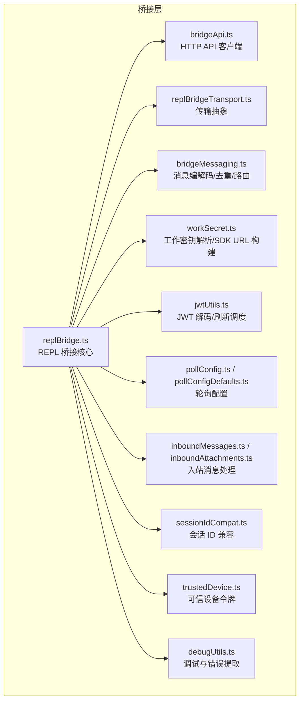
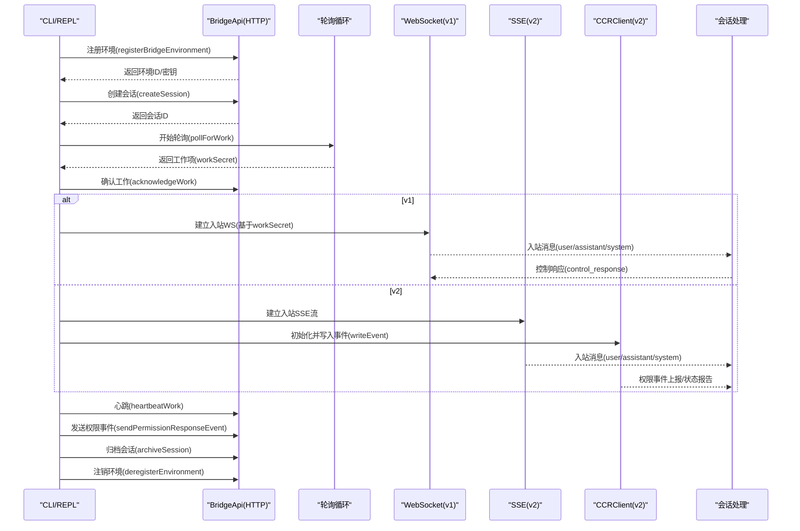
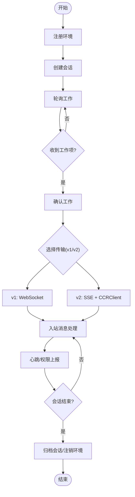
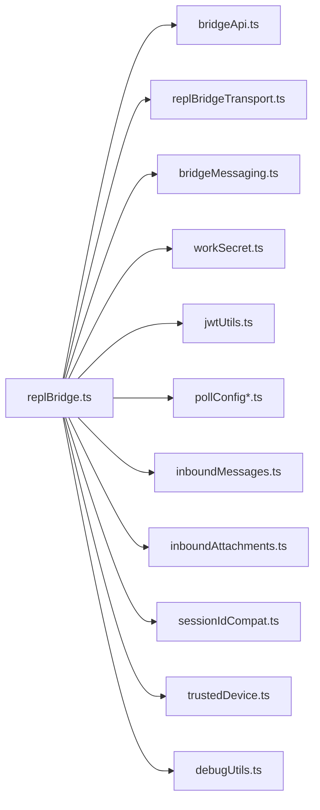

# 通信协议

<cite>
**本文引用的文件**
- [bridgeApi.ts](file://src/bridge/bridgeApi.ts)
- [replBridge.ts](file://src/bridge/replBridge.ts)
- [replBridgeTransport.ts](file://src/bridge/replBridgeTransport.ts)
- [bridgeMessaging.ts](file://src/bridge/bridgeMessaging.ts)
- [jwtUtils.ts](file://src/bridge/jwtUtils.ts)
- [types.ts](file://src/bridge/types.ts)
- [bridgeConfig.ts](file://src/bridge/bridgeConfig.ts)
- [workSecret.ts](file://src/bridge/workSecret.ts)
- [pollConfig.ts](file://src/bridge/pollConfig.ts)
- [pollConfigDefaults.ts](file://src/bridge/pollConfigDefaults.ts)
- [inboundMessages.ts](file://src/bridge/inboundMessages.ts)
- [inboundAttachments.ts](file://src/bridge/inboundAttachments.ts)
- [sessionIdCompat.ts](file://src/bridge/sessionIdCompat.ts)
- [trustedDevice.ts](file://src/bridge/trustedDevice.ts)
- [debugUtils.ts](file://src/bridge/debugUtils.ts)
</cite>

## 目录
1. [简介](#简介)
2. [项目结构](#项目结构)
3. [核心组件](#核心组件)
4. [架构总览](#架构总览)
5. [详细组件分析](#详细组件分析)
6. [依赖关系分析](#依赖关系分析)
7. [性能考量](#性能考量)
8. [故障排查指南](#故障排查指南)
9. [结论](#结论)
10. [附录](#附录)

## 简介
本文件系统性梳理 Claude Code 的通信协议体系，聚焦桥接层（Bridge）所使用的多种通信协议与工作机制，包括：
- HTTP API：环境注册、工作轮询、心跳、权限事件上报等
- WebSocket：会话入站消息通道（v1）
- CCR v2 协议（通过 SSE + HTTP 写入）：会话入站消息通道（v2）
- REPL 桥接：统一的桥接入口，负责工作分发、传输选择、消息编解码与去重、权限控制请求处理、会话归档与断线重连
- 安全机制：OAuth/JWT 验证、可信设备令牌、加密传输、访问控制
- 版本兼容与升级：工作密钥版本、v1/v2 传输切换、会话 ID 兼容层
- 性能优化：轮询配置、心跳策略、批量写入、连接复用与序列号续传

## 项目结构
桥接层相关代码集中在 src/bridge 目录，围绕“环境注册 → 工作轮询 → 会话建立 → 消息编解码与传输 → 心跳与权限控制”的主流程展开，并辅以安全、调试与兼容工具模块。

图表来源
- [bridgeApi.ts:68-452](file://src/bridge/bridgeApi.ts#L68-L452)
- [replBridge.ts:260-800](file://src/bridge/replBridge.ts#L260-L800)
- [replBridgeTransport.ts:11-371](file://src/bridge/replBridgeTransport.ts#L11-L371)
- [bridgeMessaging.ts:12-462](file://src/bridge/bridgeMessaging.ts#L12-L462)
- [workSecret.ts:1-128](file://src/bridge/workSecret.ts#L1-L128)
- [jwtUtils.ts:72-257](file://src/bridge/jwtUtils.ts#L72-L257)
- [pollConfig.ts:102-111](file://src/bridge/pollConfig.ts#L102-L111)
- [pollConfigDefaults.ts:55-83](file://src/bridge/pollConfigDefaults.ts#L55-L83)
- [inboundMessages.ts:21-81](file://src/bridge/inboundMessages.ts#L21-L81)
- [inboundAttachments.ts:68-135](file://src/bridge/inboundAttachments.ts#L68-L135)
- [sessionIdCompat.ts:38-58](file://src/bridge/sessionIdCompat.ts#L38-L58)
- [trustedDevice.ts:54-87](file://src/bridge/trustedDevice.ts#L54-L87)
- [debugUtils.ts:46-142](file://src/bridge/debugUtils.ts#L46-L142)

章节来源
- [bridgeApi.ts:68-452](file://src/bridge/bridgeApi.ts#L68-L452)
- [replBridge.ts:260-800](file://src/bridge/replBridge.ts#L260-L800)
- [replBridgeTransport.ts:11-371](file://src/bridge/replBridgeTransport.ts#L11-L371)
- [bridgeMessaging.ts:12-462](file://src/bridge/bridgeMessaging.ts#L12-L462)
- [workSecret.ts:1-128](file://src/bridge/workSecret.ts#L1-L128)
- [jwtUtils.ts:72-257](file://src/bridge/jwtUtils.ts#L72-L257)
- [pollConfig.ts:102-111](file://src/bridge/pollConfig.ts#L102-L111)
- [pollConfigDefaults.ts:55-83](file://src/bridge/pollConfigDefaults.ts#L55-L83)
- [inboundMessages.ts:21-81](file://src/bridge/inboundMessages.ts#L21-L81)
- [inboundAttachments.ts:68-135](file://src/bridge/inboundAttachments.ts#L68-L135)
- [sessionIdCompat.ts:38-58](file://src/bridge/sessionIdCompat.ts#L38-L58)
- [trustedDevice.ts:54-87](file://src/bridge/trustedDevice.ts#L54-L87)
- [debugUtils.ts:46-142](file://src/bridge/debugUtils.ts#L46-L142)

## 核心组件
- BridgeApi 客户端：封装 HTTP API 调用（注册环境、轮询工作、确认/停止工作、注销环境、归档会话、重连会话、心跳、发送权限事件），内置 401 刷新与错误分类处理。
- REPL 桥接核心：负责环境注册、会话创建、工作轮询、传输选择（v1/v2）、消息编解码与去重、权限控制请求处理、断线重连与会话归档。
- 传输抽象：统一 v1（HybridTransport，WebSocket）与 v2（SSETransport + CCRClient）的写入/读取/状态/关闭/序列号等能力。
- 消息编解码与去重：对入站消息进行解析、类型校验、控制请求/响应路由、回声过滤与重复防护。
- 工作密钥与 SDK URL：解析工作密钥、构建 WebSocket/HTTP SDK URL、会话 ID 兼容转换。
- 轮询配置：支持运行时 GrowthBook 配置与默认值，包含非独占心跳、容量与非容量轮询间隔、回收旧任务参数等。
- 安全与调试：JWT 解码与刷新调度、可信设备令牌、敏感信息脱敏与错误详情提取。

章节来源
- [bridgeApi.ts:68-452](file://src/bridge/bridgeApi.ts#L68-L452)
- [replBridge.ts:260-800](file://src/bridge/replBridge.ts#L260-L800)
- [replBridgeTransport.ts:11-371](file://src/bridge/replBridgeTransport.ts#L11-L371)
- [bridgeMessaging.ts:12-462](file://src/bridge/bridgeMessaging.ts#L12-L462)
- [workSecret.ts:1-128](file://src/bridge/workSecret.ts#L1-L128)
- [pollConfig.ts:102-111](file://src/bridge/pollConfig.ts#L102-L111)
- [pollConfigDefaults.ts:55-83](file://src/bridge/pollConfigDefaults.ts#L55-L83)
- [jwtUtils.ts:72-257](file://src/bridge/jwtUtils.ts#L72-L257)
- [trustedDevice.ts:54-87](file://src/bridge/trustedDevice.ts#L54-L87)
- [debugUtils.ts:46-142](file://src/bridge/debugUtils.ts#L46-L142)

## 架构总览
下图展示了从环境注册到会话建立、消息传输与权限控制的总体流程，以及 v1/v2 两种传输路径的选择与交互。

图表来源
- [bridgeApi.ts:142-451](file://src/bridge/bridgeApi.ts#L142-L451)
- [replBridge.ts:318-494](file://src/bridge/replBridge.ts#L318-L494)
- [replBridgeTransport.ts:119-371](file://src/bridge/replBridgeTransport.ts#L119-L371)
- [bridgeMessaging.ts:132-208](file://src/bridge/bridgeMessaging.ts#L132-L208)

## 详细组件分析

### BridgeApi 客户端（HTTP API）
- 接口职责
  - 环境注册：携带机器名、目录、分支、仓库、最大会话数、元数据等，支持幂等重注册。
  - 工作轮询：按配置周期轮询，支持回收旧任务参数；空闲时记录连续空轮询日志。
  - 工作确认/停止：确认工作并延长租约，或强制停止工作。
  - 环境注销与会话归档：优雅退出时清理资源。
  - 会话重连：在相同环境中重新排队会话。
  - 心跳：使用会话 JWT 进行轻量心跳，返回是否延长租约与当前状态。
  - 权限事件上报：向会话发送控制响应事件。
- 错误处理
  - 对 401 统一尝试 OAuth 刷新（可注入刷新回调），失败则抛出致命错误。
  - 对 403/404/410 等进行语义化错误分类与提示。
- 安全头
  - 默认附加认证头、内容类型、Anthropic 版本头、runner 版本头。
  - 可选添加可信设备令牌头（当启用相关门控且存在令牌时）。

章节来源
- [bridgeApi.ts:68-452](file://src/bridge/bridgeApi.ts#L68-L452)
- [types.ts:133-176](file://src/bridge/types.ts#L133-L176)
- [trustedDevice.ts:54-87](file://src/bridge/trustedDevice.ts#L54-L87)
- [debugUtils.ts:46-142](file://src/bridge/debugUtils.ts#L46-L142)

### REPL 桥接核心（工作轮询、传输选择、消息处理）
- 生命周期
  - 环境注册 → 会话创建 → 轮询工作 → 建立入站传输 → 处理消息/控制请求 → 心跳/权限上报 → 断线重连 → 归档/注销。
- 传输选择
  - v1：HybridTransport（WebSocket 读 + HTTP 写至 Session-Ingress）。
  - v2：SSETransport（读）+ CCRClient（写/心跳/状态/交付跟踪）。
  - 由服务端驱动的工作密钥字段决定使用 v1 或 v2；CLI 侧可通过环境变量覆盖。
- 消息处理
  - 入站消息解析与类型校验，区分 control_response 与 control_request。
  - 回声过滤与重复防护（基于最近发送/入站 UUID 集合）。
  - 对用户消息触发回调（如派生标题、权限模式变更等）。
- 断线与重连
  - 环境丢失（404）时尝试“原地重连”（复用同一环境），否则归档旧会话并创建新会话。
  - 传输异常时重置 flush gate、唤醒快速轮询、重建传输。
- 会话归档与退出
  - 正常退出前发送结果事件，触发服务器归档。

图表来源
- [replBridge.ts:318-494](file://src/bridge/replBridge.ts#L318-L494)
- [replBridgeTransport.ts:119-371](file://src/bridge/replBridgeTransport.ts#L119-L371)
- [bridgeMessaging.ts:132-208](file://src/bridge/bridgeMessaging.ts#L132-L208)

章节来源
- [replBridge.ts:260-800](file://src/bridge/replBridge.ts#L260-L800)
- [replBridgeTransport.ts:11-371](file://src/bridge/replBridgeTransport.ts#L11-L371)
- [bridgeMessaging.ts:12-462](file://src/bridge/bridgeMessaging.ts#L12-L462)

### 传输抽象（v1/v2）
- v1（HybridTransport）
  - 提供 WebSocket 读写能力，适配 REPL 的入站消息与控制响应。
  - 不使用 SSE 序列号，重连时由服务端游标控制历史重放。
- v2（SSETransport + CCRClient）
  - SSE 读取入站事件流，支持从上次序列号续传，避免历史重放。
  - CCRClient 负责写入事件、心跳、状态上报、交付跟踪。
  - 支持“仅出站”模式（镜像附件转发，不接收入站）。
  - epoch 不匹配时主动关闭并由轮询恢复。

章节来源
- [replBridgeTransport.ts:11-371](file://src/bridge/replBridgeTransport.ts#L11-L371)

### 消息编解码与去重
- 类型校验
  - SDKMessage、control_request、control_response 的类型守卫。
- 解析与路由
  - 使用标准化键名，解析入站消息，区分用户消息与其他内部消息。
- 去重机制
  - 最近发送 UUID 集合（回声过滤）与最近入站 UUID 集合（重复防护）。
- 结果消息
  - 生成最小化成功结果事件用于会话归档。

章节来源
- [bridgeMessaging.ts:12-462](file://src/bridge/bridgeMessaging.ts#L12-L462)

### 工作密钥与 SDK URL
- 工作密钥解析
  - 校验版本与必要字段（会话入站令牌、API 基础 URL 等）。
- SDK URL 构建
  - v1：基于 API 基础 URL 与会话 ID 构造 WebSocket URL（本地/线上协议差异）。
  - v2：构造 HTTP 基础 URL，子路径指向 /v1/code/sessions/{id}。
- 会话 ID 兼容
  - 在 CCR v2 兼容层中，对 session_* 与 cse_* 前缀进行互转，保证前后端一致。

章节来源
- [workSecret.ts:1-128](file://src/bridge/workSecret.ts#L1-L128)
- [sessionIdCompat.ts:38-58](file://src/bridge/sessionIdCompat.ts#L38-L58)

### 轮询与心跳策略
- 配置来源
  - 运行时 GrowthBook 配置（带校验与默认回退）。
  - 默认配置定义了非容量/容量轮询间隔、非独占心跳间隔、回收旧任务时间窗、会话保活间隔等。
- 行为特征
  - 非容量轮询用于初始连接与恢复；容量轮询用于已连接传输场景。
  - 非独占心跳独立于轮询运行，提供租约延长与健康信号。
  - reclaim_older_than_ms 用于在令牌过期后回收未确认工作。

章节来源
- [pollConfig.ts:102-111](file://src/bridge/pollConfig.ts#L102-L111)
- [pollConfigDefaults.ts:55-83](file://src/bridge/pollConfigDefaults.ts#L55-L83)

### 安全机制
- OAuth/JWT
  - HTTP API 使用 OAuth 访问令牌；心跳与 v2 写入使用会话 JWT。
  - 提供 JWT 解码与过期时间提取，支持刷新调度。
- 可信设备令牌
  - 当服务端门控开启时，客户端可携带 X-Trusted-Device-Token 头，增强 Elevated 会话的安全性。
- 加密传输
  - WebSocket（v1）与 SSE（v2）均走 TLS；HTTP API 亦通过 HTTPS。
- 访问控制
  - 401 自动刷新（可注入刷新逻辑）；403/404/410 分类处理；支持抑制性 403（不影响核心功能）。

章节来源
- [bridgeApi.ts:68-452](file://src/bridge/bridgeApi.ts#L68-L452)
- [jwtUtils.ts:72-257](file://src/bridge/jwtUtils.ts#L72-L257)
- [trustedDevice.ts:54-87](file://src/bridge/trustedDevice.ts#L54-L87)
- [debugUtils.ts:46-142](file://src/bridge/debugUtils.ts#L46-L142)

### 入站消息与附件处理
- 入站消息
  - 支持字符串与多内容块（含图片）；对移动端/网页客户端的字段差异进行规范化。
- 附件解析
  - 从入站消息提取 file_attachments，下载到本地缓存目录，拼接 @path 引用前缀。
  - 下载失败时记录调试日志并跳过该附件，保证消息仍可达。

章节来源
- [inboundMessages.ts:21-81](file://src/bridge/inboundMessages.ts#L21-L81)
- [inboundAttachments.ts:68-135](file://src/bridge/inboundAttachments.ts#L68-L135)

## 依赖关系分析
- 模块耦合
  - REPL 桥接核心依赖 HTTP API、传输抽象、消息编解码、工作密钥、轮询配置、安全与调试工具。
  - 传输抽象对 v1/v2 的差异进行封装，使上层调用无感知。
- 外部依赖
  - HTTP 客户端（axios）、JSON 解析/序列化、GrowthBook 配置、安全存储、OS 主机名等。
- 循环依赖
  - 通过模块拆分与延迟导入避免循环；例如 REPL 桥接核心按需引入持久化指针与会话状态。

图表来源
- [replBridge.ts:260-800](file://src/bridge/replBridge.ts#L260-L800)
- [bridgeApi.ts:68-452](file://src/bridge/bridgeApi.ts#L68-L452)
- [replBridgeTransport.ts:11-371](file://src/bridge/replBridgeTransport.ts#L11-L371)
- [bridgeMessaging.ts:12-462](file://src/bridge/bridgeMessaging.ts#L12-L462)
- [workSecret.ts:1-128](file://src/bridge/workSecret.ts#L1-L128)
- [jwtUtils.ts:72-257](file://src/bridge/jwtUtils.ts#L72-L257)
- [pollConfig.ts:102-111](file://src/bridge/pollConfig.ts#L102-L111)
- [pollConfigDefaults.ts:55-83](file://src/bridge/pollConfigDefaults.ts#L55-L83)
- [inboundMessages.ts:21-81](file://src/bridge/inboundMessages.ts#L21-L81)
- [inboundAttachments.ts:68-135](file://src/bridge/inboundAttachments.ts#L68-L135)
- [sessionIdCompat.ts:38-58](file://src/bridge/sessionIdCompat.ts#L38-L58)
- [trustedDevice.ts:54-87](file://src/bridge/trustedDevice.ts#L54-L87)
- [debugUtils.ts:46-142](file://src/bridge/debugUtils.ts#L46-L142)

## 性能考量
- 轮询与心跳
  - 非容量轮询短周期（毫秒级）提升首次连接速度；容量轮询长周期（分钟级）降低服务器压力。
  - 非独占心跳提供租约延长与健康信号，避免阻塞轮询。
- 传输选择
  - v2 通过 SSE 序列号续传避免历史重放，显著减少重复消息开销。
  - v2 写入通过批处理上传器合并事件，减少网络往返。
- 连接复用
  - 传输交换时携带序列号高水位，确保无缝续传。
  - 会话归档前发送结果事件，避免 WS 关闭导致的数据丢失。
- 调度与刷新
  - 基于 JWT 过期时间的刷新调度，预留缓冲避免临界点失效。
  - 失败重试与最大失败次数限制，防止雪崩。

章节来源
- [pollConfig.ts:102-111](file://src/bridge/pollConfig.ts#L102-L111)
- [pollConfigDefaults.ts:55-83](file://src/bridge/pollConfigDefaults.ts#L55-L83)
- [replBridgeTransport.ts:119-371](file://src/bridge/replBridgeTransport.ts#L119-L371)
- [jwtUtils.ts:72-257](file://src/bridge/jwtUtils.ts#L72-L257)

## 故障排查指南
- 常见错误与处理
  - 401：尝试 OAuth 刷新；若失败则抛出致命错误，提示登录。
  - 403：检查组织权限与作用域；部分抑制性 403 不影响核心功能。
  - 404/410：环境被回收或过期，触发重连策略。
  - 429：轮询过于频繁，调整轮询间隔。
- 调试与日志
  - 使用调试工具对敏感字段进行脱敏输出，限制单次日志长度。
  - 提取 HTTP 错误详情与状态码，辅助定位问题。
- 传输异常
  - v2 传输初始化失败或 epoch 不匹配时，记录错误并关闭资源，等待轮询恢复。
  - v1 传输异常时，重置 flush gate 并唤醒快速轮询。

章节来源
- [bridgeApi.ts:454-540](file://src/bridge/bridgeApi.ts#L454-L540)
- [debugUtils.ts:46-142](file://src/bridge/debugUtils.ts#L46-L142)
- [replBridgeTransport.ts:209-368](file://src/bridge/replBridgeTransport.ts#L209-L368)

## 结论
Claude Code 的桥接通信协议通过统一的 HTTP API 与灵活的 v1/v2 传输抽象，实现了高效、安全、可扩展的远程控制体验。其关键优势包括：
- 明确的生命周期与断线重连策略，保障会话稳定性
- 基于序列号续传与批处理的传输优化，降低冗余与延迟
- 完备的安全机制与错误分类，便于运维与用户自助排障
- 可运行时调整的轮询与心跳策略，兼顾性能与成本

## 附录
- 协议版本与兼容
  - 工作密钥版本固定为 1，解析时严格校验字段完整性。
  - 会话 ID 兼容层支持 session_* 与 cse_* 前缀互转，平滑过渡 CCR v2 兼容层。
- 配置参考
  - 轮询间隔、心跳间隔、回收旧任务时间窗、会话保活间隔等均可通过 GrowthBook 动态下发并带强校验。

章节来源
- [workSecret.ts:1-32](file://src/bridge/workSecret.ts#L1-L32)
- [sessionIdCompat.ts:38-58](file://src/bridge/sessionIdCompat.ts#L38-L58)
- [pollConfig.ts:102-111](file://src/bridge/pollConfig.ts#L102-L111)
- [pollConfigDefaults.ts:55-83](file://src/bridge/pollConfigDefaults.ts#L55-L83)