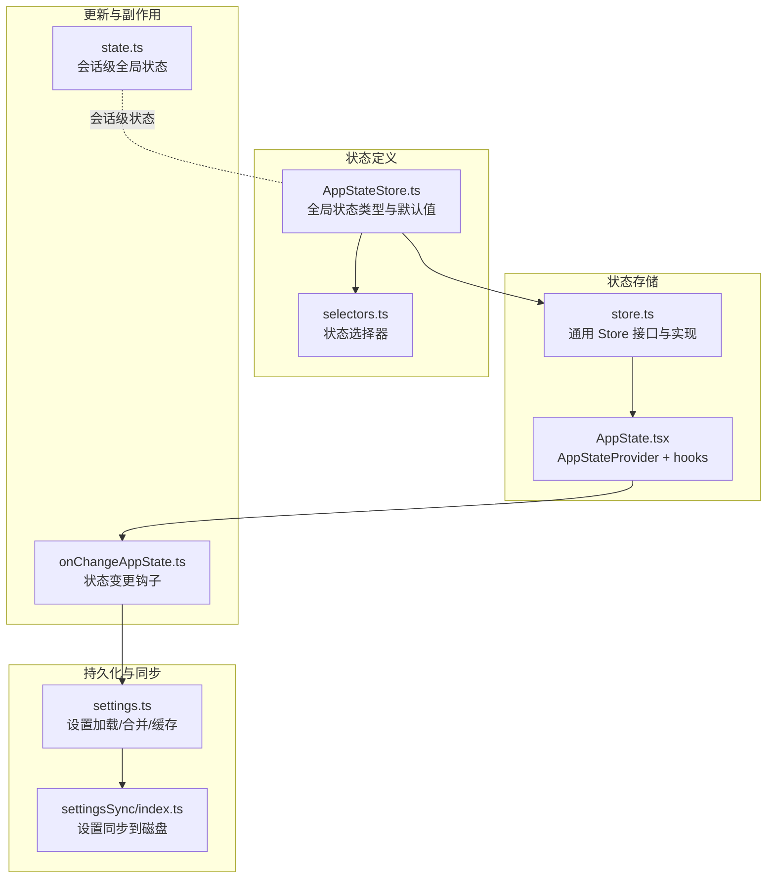
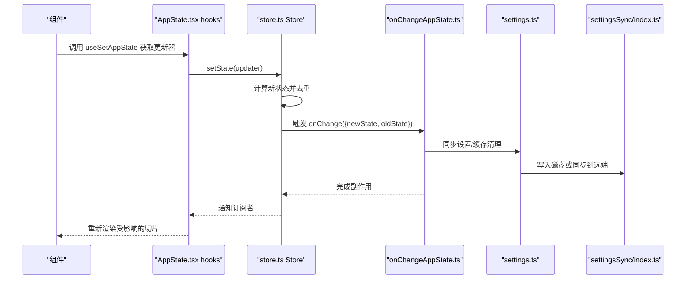
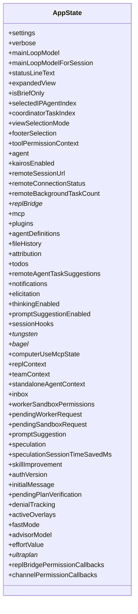
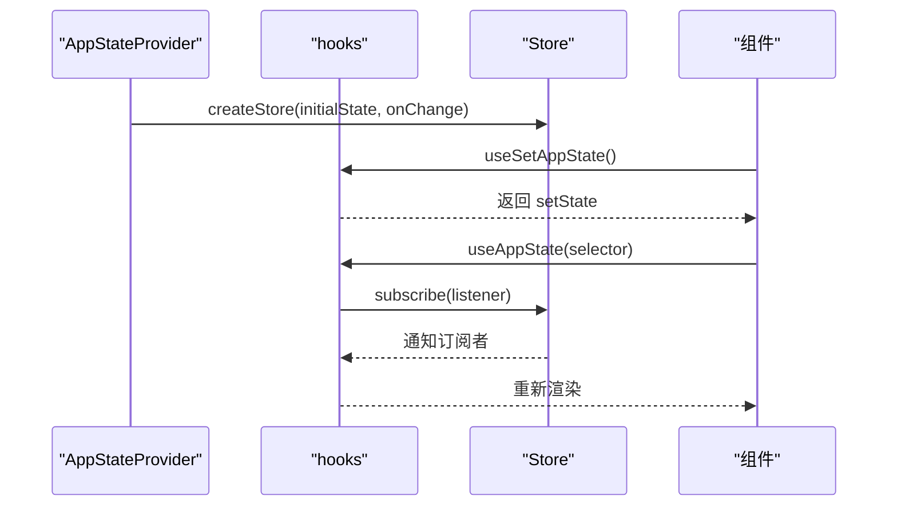
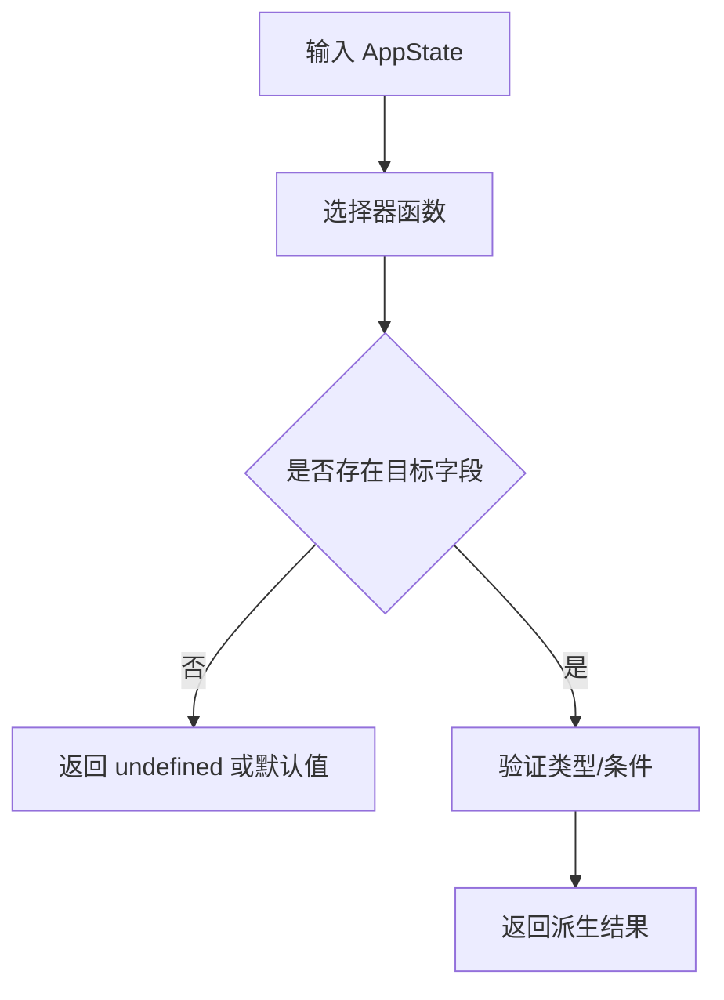
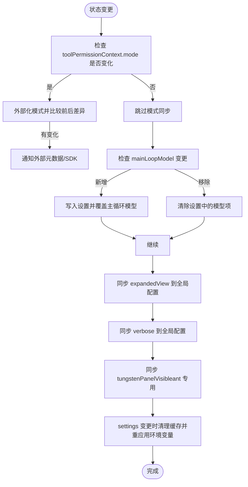
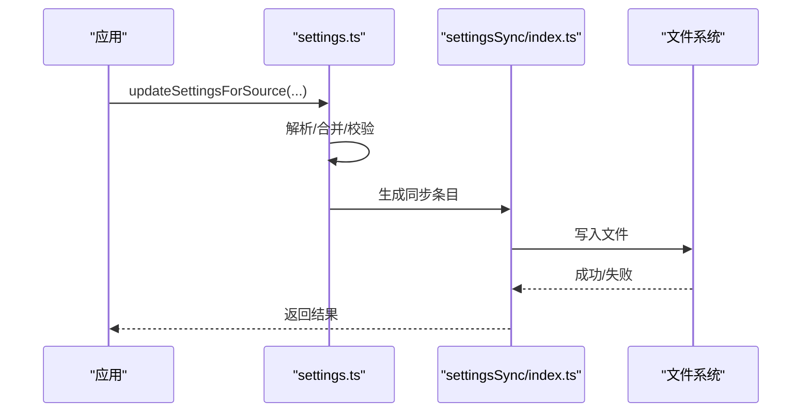
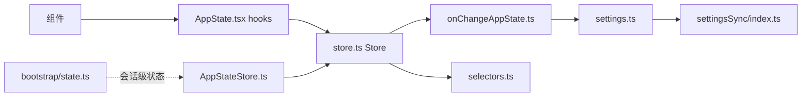

# 状态管理层架构

<cite>
**本文档引用的文件**
- [AppStateStore.ts](file://src/state/AppStateStore.ts)
- [AppState.tsx](file://src/state/AppState.tsx)
- [store.ts](file://src/state/store.ts)
- [selectors.ts](file://src/state/selectors.ts)
- [onChangeAppState.ts](file://src/state/onChangeAppState.ts)
- [state.ts](file://src/bootstrap/state.ts)
- [settings.ts](file://src/utils/settings/settings.ts)
- [settingsSync/index.ts](file://src/services/settingsSync/index.ts)
- [signal.ts](file://src/utils/signal.ts)
- [task/framework.ts](file://src/utils/task/framework.ts)
- [messageQueueManager.ts](file://src/utils/messageQueueManager.ts)
</cite>

## 目录
1. [引言](#引言)
2. [项目结构](#项目结构)
3. [核心组件](#核心组件)
4. [架构总览](#架构总览)
5. [详细组件分析](#详细组件分析)
6. [依赖关系分析](#依赖关系分析)
7. [性能考虑](#性能考虑)
8. [故障排除指南](#故障排除指南)
9. [结论](#结论)

## 引言
本文件系统性梳理 Claude Code 的状态管理层架构，重点覆盖以下方面：
- AppStateStore 的整体设计与状态结构
- 状态订阅机制与事件驱动更新
- 状态持久化策略与配置同步
- 全局状态的分层设计（用户、会话、工具、配置）
- 状态选择器与派生计算
- 性能优化策略（分片、懒加载、内存管理）
- 可测试性与可维护性设计

## 项目结构
状态管理层由“状态定义 + 存储 + 订阅 + 选择器 + 更新钩子 + 持久化”构成，采用 React 的 useSyncExternalStore 模式实现跨组件状态订阅，并通过 onChange 钩子实现外部副作用（如设置同步、桥接状态等）。

**图表来源**
- [AppStateStore.ts:1-570](file://src/state/AppStateStore.ts#L1-L570)
- [store.ts:1-35](file://src/state/store.ts#L1-L35)
- [AppState.tsx:1-200](file://src/state/AppState.tsx#L1-L200)
- [onChangeAppState.ts:1-172](file://src/state/onChangeAppState.ts#L1-L172)
- [state.ts:1-800](file://src/bootstrap/state.ts#L1-L800)
- [settings.ts:1-200](file://src/utils/settings/settings.ts#L1-L200)
- [settingsSync/index.ts:423-469](file://src/services/settingsSync/index.ts#L423-L469)

**章节来源**
- [AppStateStore.ts:1-570](file://src/state/AppStateStore.ts#L1-L570)
- [store.ts:1-35](file://src/state/store.ts#L1-L35)
- [AppState.tsx:1-200](file://src/state/AppState.tsx#L1-L200)
- [onChangeAppState.ts:1-172](file://src/state/onChangeAppState.ts#L1-L172)
- [state.ts:1-800](file://src/bootstrap/state.ts#L1-L800)
- [settings.ts:1-200](file://src/utils/settings/settings.ts#L1-L200)
- [settingsSync/index.ts:423-469](file://src/services/settingsSync/index.ts#L423-L469)

## 核心组件
- Store 接口与实现：提供 getState、setState、subscribe 三件套，支持 onChange 回调与订阅者通知。
- AppStateProvider：基于 React 上下文提供状态存储，封装 useAppState/useSetAppState/useAppStateStore 等 hooks。
- 选择器：纯函数从 AppState 中派生计算结果，避免在组件中重复计算。
- onChangeAppState：集中处理状态变更带来的副作用（设置同步、桥接状态、外部元数据同步等）。
- 会话级全局状态：独立于 AppState 的会话级状态，用于统计、指标、会话标识等。

**章节来源**
- [store.ts:1-35](file://src/state/store.ts#L1-L35)
- [AppState.tsx:1-200](file://src/state/AppState.tsx#L1-L200)
- [selectors.ts:1-77](file://src/state/selectors.ts#L1-L77)
- [onChangeAppState.ts:1-172](file://src/state/onChangeAppState.ts#L1-L172)
- [state.ts:1-800](file://src/bootstrap/state.ts#L1-L800)

## 架构总览
状态管理采用“单向数据流 + 副作用钩子”的模式：
- 组件通过 useAppState 选择性订阅状态切片，仅在被选中的值变化时重渲染。
- 通过 useSetAppState 获取 setState，以函数式更新方式提交变更。
- onChangeAppState 在每次状态变更后统一处理外部副作用（如设置写盘、桥接状态同步、外部元数据上报）。

**图表来源**
- [AppState.tsx:126-199](file://src/state/AppState.tsx#L126-L199)
- [store.ts:10-34](file://src/state/store.ts#L10-L34)
- [onChangeAppState.ts:43-171](file://src/state/onChangeAppState.ts#L43-L171)
- [settings.ts:1-200](file://src/utils/settings/settings.ts#L1-L200)
- [settingsSync/index.ts:423-469](file://src/services/settingsSync/index.ts#L423-L469)

## 详细组件分析

### AppStateStore：全局状态结构与默认值
- 结构设计：采用 DeepImmutable 包裹部分字段，确保不可变性；同时保留 tasks、agentNameRegistry 等需要可变更新的字段。
- 关键分区：
  - 用户与界面：verbose、expandedView、footerSelection、agent、statusLineText 等
  - 会话与桥接：remoteConnectionStatus、replBridge* 系列、isRemoteMode 等
  - 工具与插件：mcp、plugins、workerSandboxPermissions、pending*Request 等
  - 配置与设置：settings、mainLoopModel、mainLoopModelForSession、promptSuggestion*、thinkingEnabled 等
  - 任务与团队：tasks、agentNameRegistry、teamContext、standaloneAgentContext 等
  - 其他：notifications、inbox、speculation、promptSuggestion、computerUseMcpState 等

**图表来源**
- [AppStateStore.ts:89-452](file://src/state/AppStateStore.ts#L89-L452)

**章节来源**
- [AppStateStore.ts:1-570](file://src/state/AppStateStore.ts#L1-L570)

### AppStateProvider 与 hooks：订阅与更新
- AppStateProvider：创建并注入 Store，处理设置变更监听、权限模式禁用校验等。
- useAppState：基于 useSyncExternalStore 订阅状态切片，仅当 Object.is 判定变化时触发重渲染。
- useSetAppState：返回稳定的 setState 引用，避免组件因闭包导致的不必要重渲染。
- useAppStateStore：直接获取 Store，便于非 React 场景使用。
- 安全版本 useAppStateMaybeOutsideOfProvider：在无 Provider 环境下安全返回 undefined。

**图表来源**
- [AppState.tsx:37-110](file://src/state/AppState.tsx#L37-L110)
- [AppState.tsx:142-199](file://src/state/AppState.tsx#L142-L199)
- [store.ts:10-34](file://src/state/store.ts#L10-L34)

**章节来源**
- [AppState.tsx:1-200](file://src/state/AppState.tsx#L1-L200)
- [store.ts:1-35](file://src/state/store.ts#L1-L35)

### 选择器与派生计算：getViewedTeammateTask、getActiveAgentForInput
- 语义：从 AppState 中提取特定视图或路由决策所需的派生状态，保持纯函数与无副作用。
- 设计要点：输入为 AppState 的子集或全量，输出为明确的派生对象，便于组件稳定引用。

**图表来源**
- [selectors.ts:11-76](file://src/state/selectors.ts#L11-L76)

**章节来源**
- [selectors.ts:1-77](file://src/state/selectors.ts#L1-L77)

### 更新钩子：onChangeAppState 的职责边界
- 权限模式同步：将内部权限模式转换为外部模式，同步至 CCR 外部元数据与 SDK 状态流。
- 设置同步：根据 mainLoopModel 变更同步到设置文件，或移除设置项。
- 全局配置持久化：将 expandedView 映射为 showExpandedTodos/showSpinnerTree 并保存至全局配置。
- 设置变更副作用：当 settings 变更时，清理认证相关缓存并重新应用环境变量。
- 其他：verbose、tungstenPanelVisible 等字段的持久化逻辑。

**图表来源**
- [onChangeAppState.ts:43-171](file://src/state/onChangeAppState.ts#L43-L171)

**章节来源**
- [onChangeAppState.ts:1-172](file://src/state/onChangeAppState.ts#L1-L172)

### 会话级全局状态：bootstrap/state.ts
- 职责：记录会话生命周期内的统计、指标、颜色映射、请求追踪、计划缓存等，避免污染 AppState 的 UI/交互状态。
- 特点：模块级单例状态，提供读写接口与信号订阅，支持测试重置。

**章节来源**
- [state.ts:1-800](file://src/bootstrap/state.ts#L1-L800)

### 持久化与配置同步：settings 与 settingsSync
- settings.ts：负责设置文件解析、合并、缓存、校验与写入，支持多来源（用户、项目、本地、标志位等）。
- settingsSync/index.ts：将用户设置与记忆文件打包同步到磁盘，支持项目级同步与增量写入。

**图表来源**
- [settings.ts:1-200](file://src/utils/settings/settings.ts#L1-L200)
- [settingsSync/index.ts:423-469](file://src/services/settingsSync/index.ts#L423-L469)

**章节来源**
- [settings.ts:1-200](file://src/utils/settings/settings.ts#L1-L200)
- [settingsSync/index.ts:423-469](file://src/services/settingsSync/index.ts#L423-L469)

### 任务状态更新：updateTaskState 辅助
- 通过 updateTaskState 在任务内部以函数式更新方式修改 AppState.tasks，避免不必要的重渲染。
- 支持泛型类型安全，确保只对指定任务类型进行更新。

**章节来源**
- [task/framework.ts:41-72](file://src/utils/task/framework.ts#L41-L72)

### 事件信号与队列：signal 与命令队列
- signal.ts：轻量事件信号，用于“仅关心发生了什么”的场景，不携带快照。
- messageQueueManager.ts：命令队列的快照与通知机制，兼容 useSyncExternalStore，支持异步处理后的重新检查。

**章节来源**
- [signal.ts:1-43](file://src/utils/signal.ts#L1-L43)
- [messageQueueManager.ts:73-121](file://src/utils/messageQueueManager.ts#L73-L121)

## 依赖关系分析
- 组件依赖：组件通过 hooks 依赖 AppStateProvider 提供的 Store，Store 依赖 onChange 钩子处理副作用。
- 数据依赖：AppStateStore 定义状态结构，selectors 依赖 AppState 进行派生，onChangeAppState 依赖 settings 与外部服务。
- 会话依赖：bootstrap/state.ts 与 AppStateStore 解耦，前者专注会话级统计与追踪。

**图表来源**
- [AppState.tsx:1-200](file://src/state/AppState.tsx#L1-L200)
- [store.ts:1-35](file://src/state/store.ts#L1-L35)
- [onChangeAppState.ts:1-172](file://src/state/onChangeAppState.ts#L1-L172)
- [settings.ts:1-200](file://src/utils/settings/settings.ts#L1-L200)
- [settingsSync/index.ts:423-469](file://src/services/settingsSync/index.ts#L423-L469)
- [selectors.ts:1-77](file://src/state/selectors.ts#L1-L77)
- [AppStateStore.ts:1-570](file://src/state/AppStateStore.ts#L1-L570)
- [state.ts:1-800](file://src/bootstrap/state.ts#L1-L800)

**章节来源**
- [AppState.tsx:1-200](file://src/state/AppState.tsx#L1-L200)
- [store.ts:1-35](file://src/state/store.ts#L1-L35)
- [onChangeAppState.ts:1-172](file://src/state/onChangeAppState.ts#L1-L172)
- [settings.ts:1-200](file://src/utils/settings/settings.ts#L1-L200)
- [settingsSync/index.ts:423-469](file://src/services/settingsSync/index.ts#L423-L469)
- [selectors.ts:1-77](file://src/state/selectors.ts#L1-L77)
- [AppStateStore.ts:1-570](file://src/state/AppStateStore.ts#L1-L570)
- [state.ts:1-800](file://src/bootstrap/state.ts#L1-L800)

## 性能考虑
- 去重与最小化重渲染：Store 使用 Object.is 对新旧状态进行严格相等判断，避免无效通知。
- 选择器优化：useAppState 仅订阅被选择的切片，且要求选择器返回现有对象引用，防止因返回新对象导致的持续重渲染。
- 任务状态局部更新：updateTaskState 仅更新 tasks 中对应任务，避免扩散到整个 AppState。
- 缓存与懒加载：settings.ts 使用缓存与延迟解析，减少 IO 与解析开销；memoizeWithTTL 实现带 TTL 的缓存刷新。
- 事件信号：signal.ts 用于高频事件通知，避免携带状态的复杂度。
- 队列与批处理：messageQueueManager 提供快照与重新检查机制，避免每次微小变更都触发订阅者更新。

**章节来源**
- [store.ts:20-27](file://src/state/store.ts#L20-L27)
- [AppState.tsx:126-163](file://src/state/AppState.tsx#L126-L163)
- [task/framework.ts:48-72](file://src/utils/task/framework.ts#L48-L72)
- [settings.ts:178-200](file://src/utils/settings/settings.ts#L178-L200)
- [signal.ts:18-43](file://src/utils/signal.ts#L18-L43)
- [messageQueueManager.ts:73-121](file://src/utils/messageQueueManager.ts#L73-L121)

## 故障排除指南
- 权限模式不同步：确认 onChangeAppState 是否正确将内部模式外部化并通知外部元数据与 SDK。
- 设置未生效：检查 settings.ts 的合并与写入流程，以及 settingsSync 是否成功写盘。
- 重渲染异常：排查选择器是否返回新对象而非现有引用，或是否订阅了过多切片。
- 任务状态未更新：确认使用 updateTaskState 并传入正确的任务 ID 与类型。
- 会话级状态不一致：检查 bootstrap/state.ts 的读写接口与信号订阅是否正确。

**章节来源**
- [onChangeAppState.ts:43-171](file://src/state/onChangeAppState.ts#L43-L171)
- [settings.ts:1-200](file://src/utils/settings/settings.ts#L1-L200)
- [AppState.tsx:126-163](file://src/state/AppState.tsx#L126-L163)
- [task/framework.ts:48-72](file://src/utils/task/framework.ts#L48-L72)
- [state.ts:1-800](file://src/bootstrap/state.ts#L1-L800)

## 结论
该状态管理层以 Store 为核心，结合 React 的 useSyncExternalStore 实现高效、可预测的状态订阅；通过 onChangeAppState 将副作用集中化，确保设置、桥接与外部系统的一致性；选择器与任务局部更新进一步提升性能与可维护性。配合 settings 与 settingsSync 的持久化机制，形成从 UI 到磁盘的完整闭环。整体设计在保证灵活性的同时，兼顾了性能与可测试性。