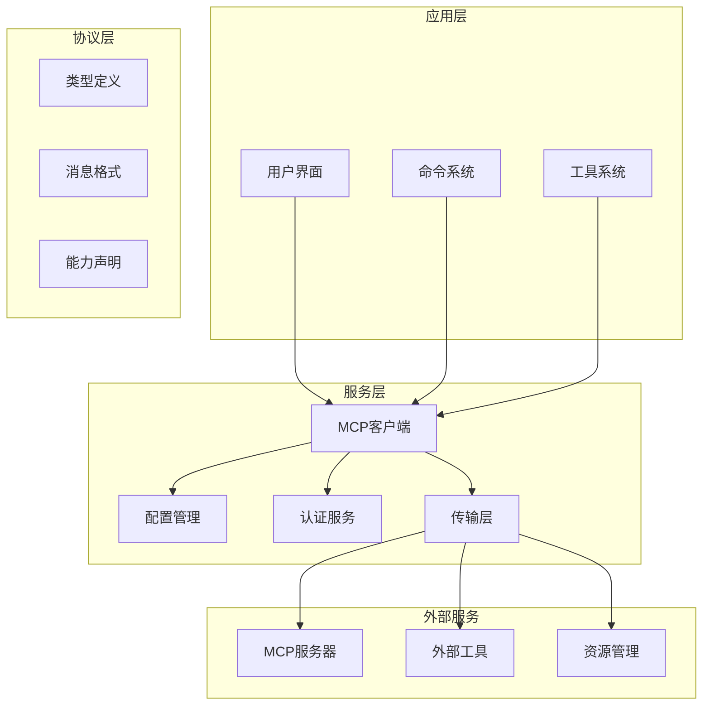
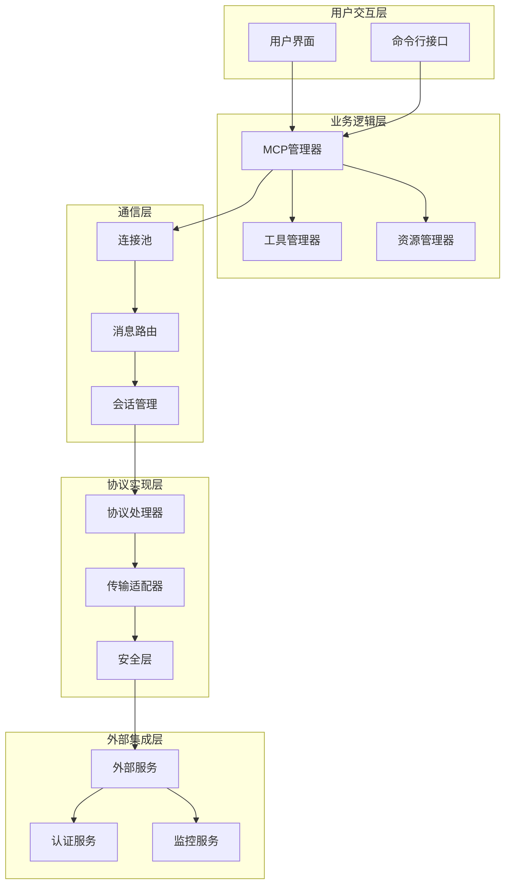
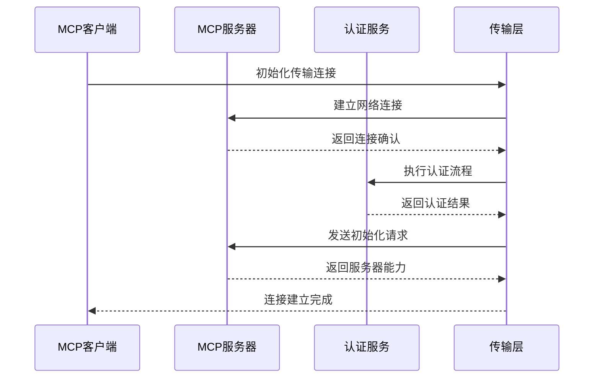
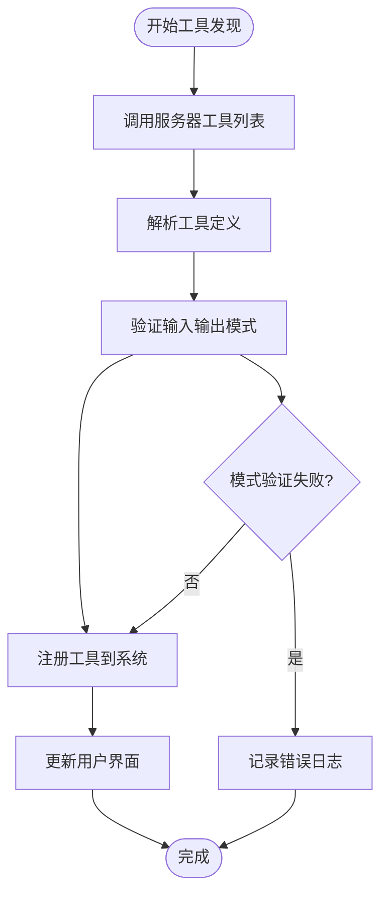
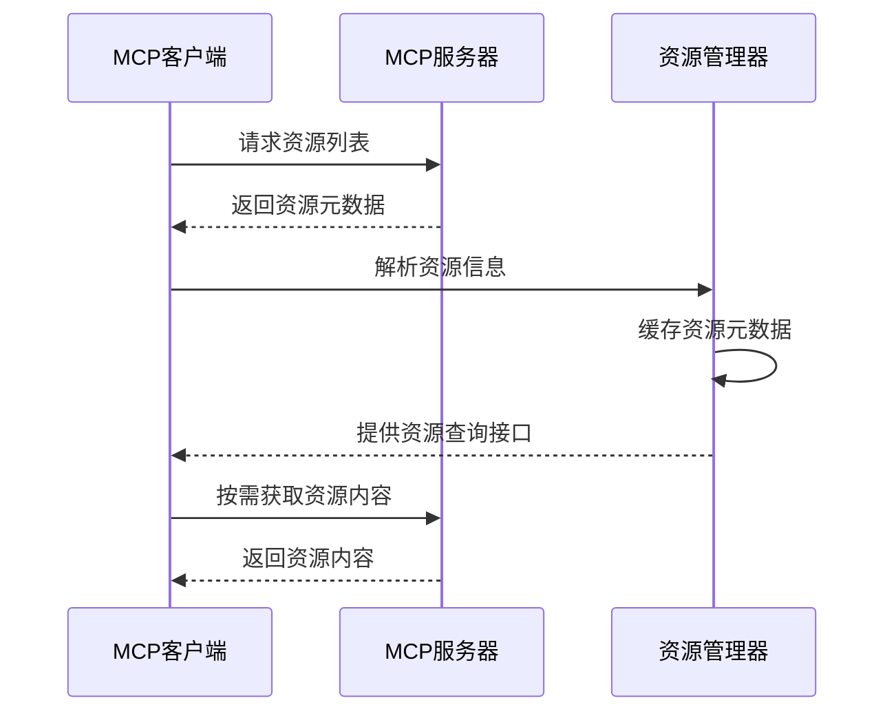
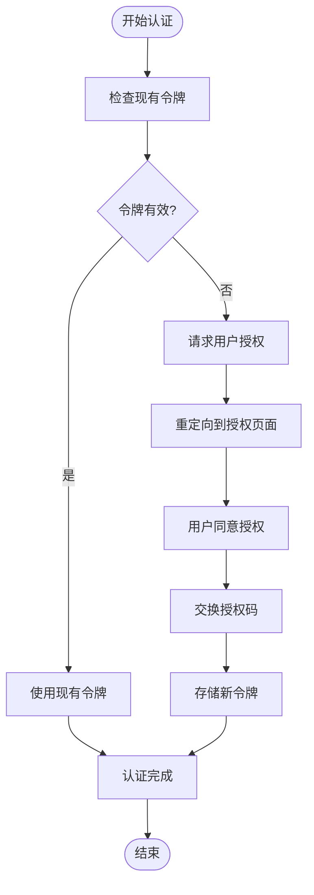

# MCP协议概述

<cite>
**本文档引用的文件**
- [src/services/mcp/client.ts](file://src/services/mcp/client.ts)
- [src/services/mcp/types.ts](file://src/services/mcp/types.ts)
- [src/entrypoints/mcp.ts](file://src/entrypoints/mcp.ts)
- [src/tools/MCPTool/MCPTool.ts](file://src/tools/MCPTool/MCPTool.ts)
- [src/tools/ListMcpResourcesTool/ListMcpResourcesTool.ts](file://src/tools/ListMcpResourcesTool/ListMcpResourcesTool.ts)
- [src/tools/ReadMcpResourceTool/ReadMcpResourceTool.ts](file://src/tools/ReadMcpResourceTool/ReadMcpResourceTool.ts)
- [src/tools/McpAuthTool/McpAuthTool.ts](file://src/tools/McpAuthTool/McpAuthTool.ts)
- [src/services/mcp/config.ts](file://src/services/mcp/config.ts)
- [src/services/mcp/utils.ts](file://src/services/mcp/utils.ts)
- [src/components/mcp/MCPListPanel.tsx](file://src/components/mcp/MCPListPanel.tsx)
- [src/commands/mcp/index.ts](file://src/commands/mcp/index.ts)
- [src/services/mcp/auth.ts](file://src/services/mcp/auth.ts)
- [src/services/mcp/officialRegistry.ts](file://src/services/mcp/officialRegistry.ts)
- [src/services/mcp/xaa.ts](file://src/services/mcp/xaa.ts)
- [src/services/mcp/xaaIdpLogin.ts](file://src/services/mcp/xaaIdpLogin.ts)
- [src/services/mcp/headersHelper.ts](file://src/services/mcp/headersHelper.ts)
- [src/services/mcp/normalization.ts](file://src/services/mcp/normalization.ts)
- [src/services/mcp/mcpStringUtils.ts](file://src/services/mcp/mcpStringUtils.ts)
- [src/services/mcp/SdkControlTransport.ts](file://src/services/mcp/SdkControlTransport.ts)
- [src/services/mcp/InProcessTransport.ts](file://src/services/mcp/InProcessTransport.ts)
- [src/services/mcp/vscodeSdkMcp.ts](file://src/services/mcp/vscodeSdkMcp.ts)
- [src/services/mcp/claudeai.ts](file://src/services/mcp/claudeai.ts)
- [src/services/mcp/channelAllowlist.ts](file://src/services/mcp/channelAllowlist.ts)
- [src/services/mcp/channelNotification.ts](file://src/services/mcp/channelNotification.ts)
- [src/services/mcp/channelPermissions.ts](file://src/services/mcp/channelPermissions.ts)
- [src/services/mcp/elicitationHandler.ts](file://src/services/mcp/elicitationHandler.ts)
- [src/services/mcp/envExpansion.ts](file://src/services/mcp/envExpansion.ts)
- [src/services/mcp/oauthPort.ts](file://src/services/mcp/oauthPort.ts)
- [src/services/mcp/useManageMCPConnections.ts](file://src/services/mcp/useManageMCPConnections.ts)
- [src/services/mcp/claudexxx.ts](file://src/services/mcp/claudexxx.ts)
- [src/services/mcp/claudeai.ts](file://src/services/mcp/claudeai.ts)
- [src/services/mcp/claudeai.ts](file://src/services/mcp/claudeai.ts)
- [src/services/mcp/claudeai.ts](file://src/services/mcp/claudeai.ts)
</cite>

## 目录
1. [简介](#简介)
2. [项目结构](#项目结构)
3. [核心组件](#核心组件)
4. [架构概览](#架构概览)
5. [详细组件分析](#详细组件分析)
6. [依赖关系分析](#依赖关系分析)
7. [性能考虑](#性能考虑)
8. [故障排除指南](#故障排除指南)
9. [结论](#结论)
10. [附录](#附录)

## 简介

MCP（Model Context Protocol）是一个开放的协议标准，旨在为AI助手和外部工具之间建立标准化的通信接口。在Claude Code中，MCP协议扮演着至关重要的角色，它提供了统一的框架来集成各种外部服务和工具，实现了协议标准化、跨平台兼容性和安全保障。

MCP协议的核心价值在于：
- **协议标准化**：通过标准化的消息格式和通信模式，确保不同来源的工具和服务能够无缝协作
- **跨平台兼容性**：支持多种传输方式（STDIO、HTTP、WebSocket、SSE等），适应不同的部署环境
- **安全性保障**：内置认证授权机制，支持OAuth 2.0和企业级身份验证
- **可扩展性**：模块化的架构设计，便于添加新的工具和服务

## 项目结构

Claude Code中的MCP实现采用了分层架构设计，主要分为以下几个层次：



**图表来源**
- [src/services/mcp/client.ts:1-800](file://src/services/mcp/client.ts#L1-L800)
- [src/services/mcp/types.ts:1-259](file://src/services/mcp/types.ts#L1-L259)

**章节来源**
- [src/services/mcp/client.ts:1-800](file://src/services/mcp/client.ts#L1-L800)
- [src/services/mcp/types.ts:1-259](file://src/services/mcp/types.ts#L1-L259)

## 核心组件

### MCP客户端核心组件

MCP客户端是整个系统的核心，负责与外部MCP服务器建立连接并管理通信会话。

#### 连接管理器
连接管理器负责处理MCP服务器的连接生命周期，包括连接建立、状态监控和断线重连。

#### 传输层抽象
传输层提供了统一的接口来支持不同的传输协议：
- STDIO传输：用于本地进程间通信
- HTTP传输：支持RESTful API调用
- WebSocket传输：实现实时双向通信
- SSE传输：支持服务器推送事件

#### 工具集成系统
工具集成系统将MCP服务器提供的工具无缝集成到Claude Code的工具生态系统中，支持动态加载和卸载工具。

**章节来源**
- [src/services/mcp/client.ts:595-800](file://src/services/mcp/client.ts#L595-L800)
- [src/services/mcp/types.ts:179-227](file://src/services/mcp/types.ts#L179-L227)

### 配置管理系统

配置管理系统负责管理MCP服务器的各种配置信息，包括连接参数、认证信息和传输设置。

#### 服务器配置
- 支持多种服务器类型：STDIO、HTTP、WebSocket、SSE等
- 动态配置更新和热重载
- 配置验证和错误处理

#### 认证配置
- OAuth 2.0支持
- 企业身份验证集成
- 安全令牌管理和刷新

**章节来源**
- [src/services/mcp/config.ts:1-800](file://src/services/mcp/config.ts#L1-L800)
- [src/services/mcp/types.ts:108-175](file://src/services/mcp/types.ts#L108-L175)

## 架构概览

MCP在Claude Code中的整体架构采用分层设计，确保了系统的可维护性和可扩展性。



**图表来源**
- [src/services/mcp/client.ts:1-200](file://src/services/mcp/client.ts#L1-L200)
- [src/services/mcp/config.ts:1-200](file://src/services/mcp/config.ts#L1-L200)

## 详细组件分析

### MCP客户端实现

MCP客户端是系统的核心组件，负责与外部MCP服务器进行通信。

#### 连接建立流程


**图表来源**
- [src/services/mcp/client.ts:607-784](file://src/services/mcp/client.ts#L607-L784)

#### 错误处理机制
客户端实现了完善的错误处理机制，包括：
- 连接超时检测和自动重连
- 认证失败的处理和缓存
- 会话过期的检测和恢复
- 网络异常的优雅降级

**章节来源**
- [src/services/mcp/client.ts:146-206](file://src/services/mcp/client.ts#L146-L206)

### 工具系统集成

MCP工具系统将外部服务器提供的工具无缝集成到Claude Code中。

#### 工具发现和注册


**图表来源**
- [src/tools/MCPTool/MCPTool.ts:27-78](file://src/tools/MCPTool/MCPTool.ts#L27-L78)

#### 工具执行流程
工具执行过程包括输入验证、权限检查、实际调用和结果处理等步骤。

**章节来源**
- [src/tools/MCPTool/MCPTool.ts:1-78](file://src/tools/MCPTool/MCPTool.ts#L1-L78)

### 资源管理系统

资源管理系统负责管理MCP服务器提供的各种资源，包括文件、数据集和其他可访问的内容。

#### 资源发现和枚举


**图表来源**
- [src/tools/ListMcpResourcesTool/ListMcpResourcesTool.ts:66-101](file://src/tools/ListMcpResourcesTool/ListMcpResourcesTool.ts#L66-L101)

**章节来源**
- [src/tools/ListMcpResourcesTool/ListMcpResourcesTool.ts:1-124](file://src/tools/ListMcpResourcesTool/ListMcpResourcesTool.ts#L1-L124)
- [src/tools/ReadMcpResourceTool/ReadMcpResourceTool.ts:75-101](file://src/tools/ReadMcpResourceTool/ReadMcpResourceTool.ts#L75-L101)

### 认证和授权系统

认证和授权系统确保只有经过授权的用户才能访问特定的MCP服务器和工具。

#### OAuth认证流程


**图表来源**
- [src/tools/McpAuthTool/McpAuthTool.ts:85-206](file://src/tools/McpAuthTool/McpAuthTool.ts#L85-L206)

**章节来源**
- [src/tools/McpAuthTool/McpAuthTool.ts:1-216](file://src/tools/McpAuthTool/McpAuthTool.ts#L1-L216)

## 依赖关系分析

MCP系统的依赖关系呈现明显的分层结构，每一层都有明确的职责分工。

```mermaid
graph TB
subgraph "外部依赖"
SDK[@modelcontextprotocol/sdk]
Zod[zod]
Lodash[lodash-es]
PMap[p-map]
end
subgraph "内部模块"
Client[client.ts]
Types[types.ts]
Config[config.ts]
Utils[utils.ts]
Auth[auth.ts]
Transport[transport.ts]
end
subgraph "工具集成"
MCPTool[MCPTool.ts]
ListResources[ListMcpResourcesTool.ts]
ReadResource[ReadMcpResourceTool.ts]
AuthTool[McpAuthTool.ts]
end
subgraph "UI组件"
ListPanel[MCPListPanel.tsx]
Settings[MCPSettings.tsx]
Dialog[ElicitationDialog.tsx]
end
SDK --> Client
Zod --> Client
Lodash --> Client
PMap --> Client
Client --> Types
Client --> Config
Client --> Utils
Client --> Auth
Client --> Transport
Client --> MCPTool
Client --> ListResources
Client --> ReadResource
Client --> AuthTool
Client --> ListPanel
Client --> Settings
Client --> Dialog
```

**图表来源**
- [src/services/mcp/client.ts:1-50](file://src/services/mcp/client.ts#L1-L50)
- [src/tools/MCPTool/MCPTool.ts:1-12](file://src/tools/MCPTool/MCPTool.ts#L1-L12)

**章节来源**
- [src/services/mcp/client.ts:1-100](file://src/services/mcp/client.ts#L1-L100)
- [src/tools/MCPTool/MCPTool.ts:1-20](file://src/tools/MCPTool/MCPTool.ts#L1-L20)

## 性能考虑

MCP系统在设计时充分考虑了性能优化，采用了多种策略来提升响应速度和资源利用率。

### 连接池管理
系统实现了智能的连接池管理，包括：
- 连接复用和生命周期管理
- 自动连接健康检查
- 负载均衡和故障转移
- 连接数限制和资源保护

### 缓存策略
多层缓存机制确保了数据的快速访问：
- 服务器能力缓存
- 工具定义缓存
- 资源元数据缓存
- 认证令牌缓存

### 异步处理
异步架构设计提升了系统的并发处理能力：
- 并发工具调用
- 流式数据处理
- 异步认证流程
- 后台任务处理

## 故障排除指南

### 常见问题诊断

#### 连接问题
当遇到MCP服务器连接问题时，可以按照以下步骤进行诊断：

1. **检查网络连接**：确认客户端能够访问MCP服务器
2. **验证认证信息**：检查令牌是否有效和过期
3. **查看日志信息**：分析详细的错误日志
4. **测试服务器可用性**：直接访问服务器端点

#### 工具调用失败
工具调用失败的常见原因：
- 输入参数验证失败
- 权限不足
- 服务器内部错误
- 网络超时

**章节来源**
- [src/services/mcp/client.ts:340-362](file://src/services/mcp/client.ts#L340-L362)
- [src/services/mcp/client.ts:193-206](file://src/services/mcp/client.ts#L193-L206)

### 调试工具和方法

系统提供了丰富的调试工具来帮助开发者诊断问题：
- 详细的日志记录
- 连接状态监控
- 性能指标收集
- 错误报告机制

## 结论

MCP协议在Claude Code中的实现展现了现代AI工具集成的最佳实践。通过标准化的协议设计、灵活的架构实现和完善的错误处理机制，MCP为AI助手提供了强大的外部服务集成能力。

### 主要优势
- **协议标准化**：统一的通信接口简化了工具集成
- **跨平台兼容**：支持多种部署环境和传输协议
- **安全性保障**：完整的认证授权机制保护系统安全
- **可扩展性**：模块化设计便于功能扩展和维护

### 未来发展方向
随着AI技术的不断发展，MCP协议在Claude Code中的应用将继续演进：
- 更智能的工具发现和推荐
- 增强的实时通信能力
- 更完善的监控和诊断工具
- 更丰富的安全特性

## 附录

### 版本演进历史

MCP协议在Claude Code中的版本演进体现了持续改进的理念：

#### 主要版本特性
- **版本1.0**：基础协议实现，支持基本的工具调用
- **版本2.0**：增强的安全机制和认证支持
- **版本3.0**：改进的传输层和性能优化
- **当前版本**：完整的功能实现和企业级特性

### 最佳实践建议

#### 开发者最佳实践
- 遵循MCP协议规范
- 实现适当的错误处理
- 使用连接池管理资源
- 实施安全的认证机制

#### 用户使用建议
- 正确配置MCP服务器
- 及时更新认证信息
- 监控连接状态
- 合理使用工具权限