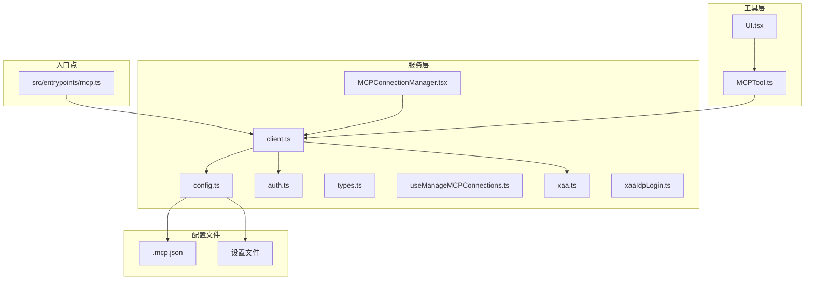
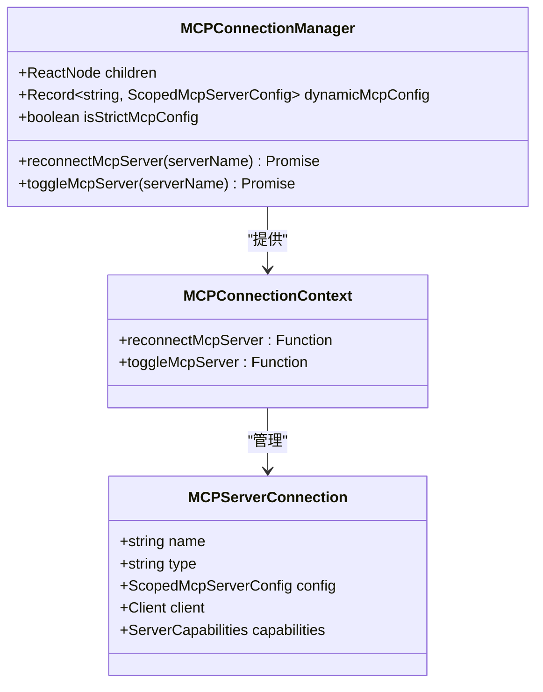
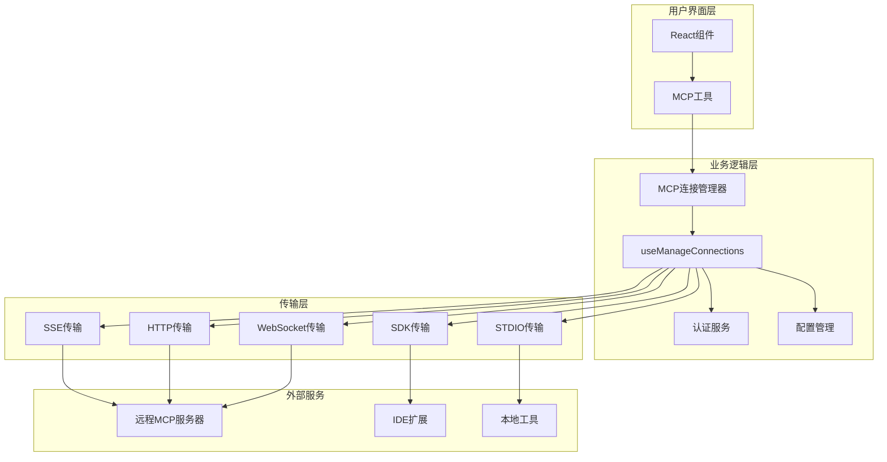
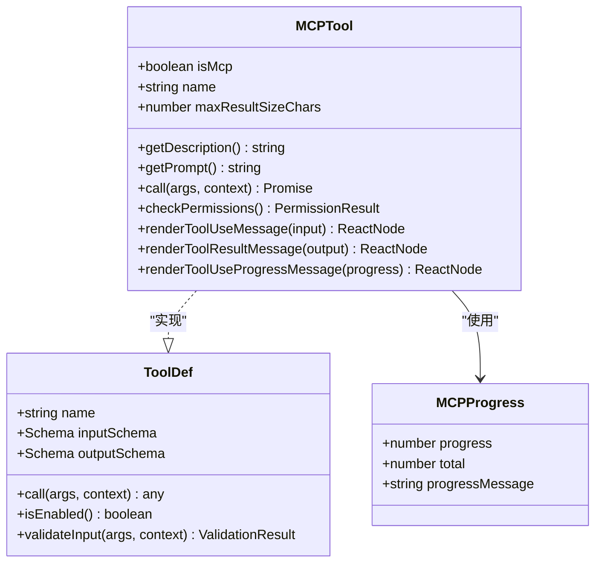
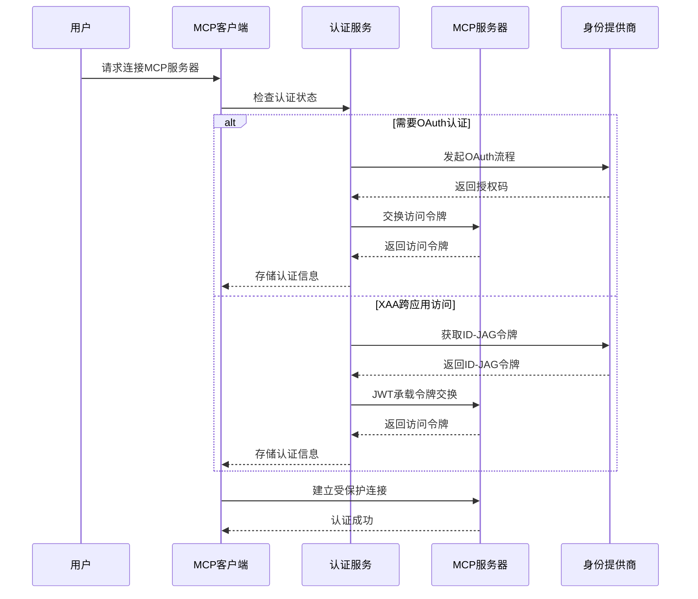
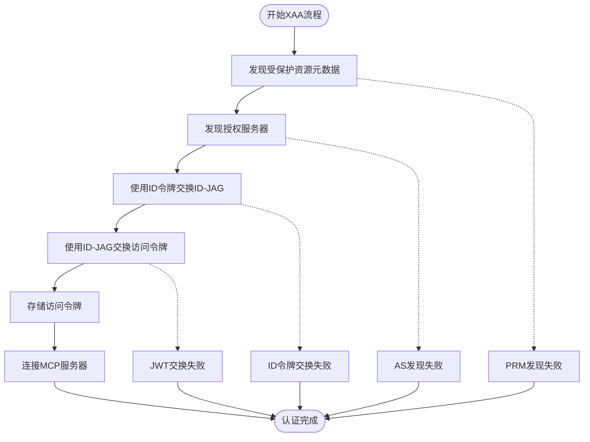
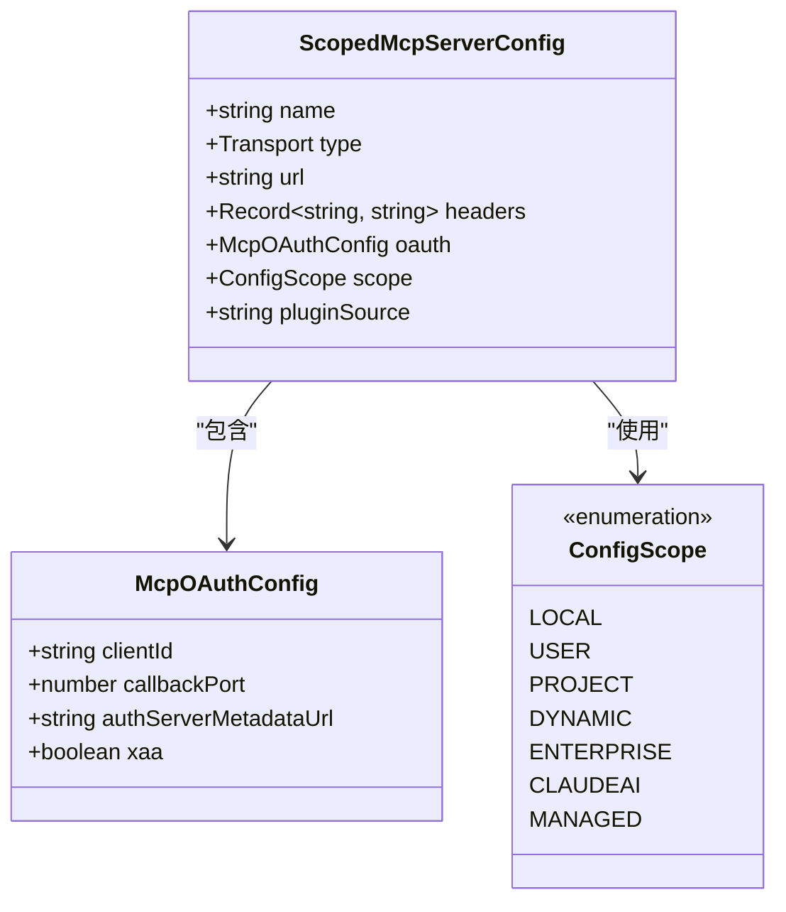

# MCP协议集成

<cite>
**本文档引用的文件**
- [src/entrypoints/mcp.ts](file://src/entrypoints/mcp.ts)
- [src/services/mcp/MCPConnectionManager.tsx](file://src/services/mcp/MCPConnectionManager.tsx)
- [src/services/mcp/client.ts](file://src/services/mcp/client.ts)
- [src/services/mcp/auth.ts](file://src/services/mcp/auth.ts)
- [src/services/mcp/config.ts](file://src/services/mcp/config.ts)
- [src/services/mcp/types.ts](file://src/services/mcp/types.ts)
- [src/services/mcp/useManageMCPConnections.ts](file://src/services/mcp/useManageMCPConnections.ts)
- [src/tools/MCPTool/MCPTool.ts](file://src/tools/MCPTool/MCPTool.ts)
- [src/tools/MCPTool/UI.tsx](file://src/tools/MCPTool/UI.tsx)
- [src/services/mcp/xaa.ts](file://src/services/mcp/xaa.ts)
- [src/services/mcp/xaaIdpLogin.ts](file://src/services/mcp/xaaIdpLogin.ts)
</cite>

## 目录
1. [简介](#简介)
2. [项目结构](#项目结构)
3. [核心组件](#核心组件)
4. [架构概览](#架构概览)
5. [详细组件分析](#详细组件分析)
6. [依赖关系分析](#依赖关系分析)
7. [性能考虑](#性能考虑)
8. [故障排除指南](#故障排除指南)
9. [结论](#结论)

## 简介

Claude Code的MCP（Model Context Protocol）集成为开发者提供了与外部AI工具和服务进行交互的能力。该集成实现了完整的MCP协议栈，支持多种传输方式，包括stdio、SSE、HTTP、WebSocket和SDK传输，并提供了强大的认证机制，包括OAuth 2.0、跨应用访问（XAA/SEP-990）和API密钥认证。

MCP协议允许Claude Code与各种AI工具建立连接，这些工具可以是本地进程、远程Web服务或IDE扩展。通过标准化的协议接口，用户可以无缝地使用不同来源的AI工具，而无需关心底层实现细节。

## 项目结构

MCP集成在Claude Code项目中的组织结构如下：



**图表来源**
- [src/entrypoints/mcp.ts:1-197](file://src/entrypoints/mcp.ts#L1-L197)
- [src/services/mcp/MCPConnectionManager.tsx:1-73](file://src/services/mcp/MCPConnectionManager.tsx#L1-L73)
- [src/services/mcp/client.ts:1-800](file://src/services/mcp/client.ts#L1-L800)

**章节来源**
- [src/entrypoints/mcp.ts:1-197](file://src/entrypoints/mcp.ts#L1-L197)
- [src/services/mcp/MCPConnectionManager.tsx:1-73](file://src/services/mcp/MCPConnectionManager.tsx#L1-L73)

## 核心组件

### MCP连接管理器

MCPConnectionManager是整个MCP系统的核心协调器，负责管理所有MCP服务器的生命周期和状态。



**图表来源**
- [src/services/mcp/MCPConnectionManager.tsx:1-73](file://src/services/mcp/MCPConnectionManager.tsx#L1-L73)
- [src/services/mcp/types.ts:179-227](file://src/services/mcp/types.ts#L179-L227)

### 传输方式支持

系统支持多种MCP传输方式，每种都有其特定的使用场景和优势：

| 传输方式 | 类型 | 描述 | 使用场景 |
|---------|------|------|----------|
| stdio | 本地进程 | 通过标准输入输出与本地进程通信 | 本地CLI工具、自定义脚本 |
| SSE | 服务器推送 | 基于Server-Sent Events的实时通信 | 远程Web服务、实时数据流 |
| HTTP | REST API | 基于HTTP请求响应的同步通信 | Web API、微服务 |
| WebSocket | 双向通信 | 全双工双向通信协议 | 实时聊天、协作编辑 |
| SDK | 内部集成 | 直接SDK调用，无网络开销 | IDE扩展、内部工具 |

**章节来源**
- [src/services/mcp/types.ts:23-26](file://src/services/mcp/types.ts#L23-L26)
- [src/services/mcp/client.ts:619-784](file://src/services/mcp/client.ts#L619-L784)

## 架构概览

MCP集成采用分层架构设计，确保了模块化和可扩展性：



**图表来源**
- [src/services/mcp/MCPConnectionManager.tsx:31-72](file://src/services/mcp/MCPConnectionManager.tsx#L31-L72)
- [src/services/mcp/useManageMCPConnections.ts:143-146](file://src/services/mcp/useManageMCPConnections.ts#L143-L146)

## 详细组件分析

### MCP工具包装器

MCPTool作为所有MCP工具的统一包装器，提供了标准化的接口和功能：



**图表来源**
- [src/tools/MCPTool/MCPTool.ts:27-77](file://src/tools/MCPTool/MCPTool.ts#L27-L77)

MCPTool的主要特性包括：

1. **动态模式支持**：工具名称和参数在运行时确定
2. **权限透传**：支持细粒度的权限控制和检查
3. **进度跟踪**：提供详细的执行进度反馈
4. **结果处理**：智能的结果格式化和截断

**章节来源**
- [src/tools/MCPTool/MCPTool.ts:1-78](file://src/tools/MCPTool/MCPTool.ts#L1-L78)
- [src/tools/MCPTool/UI.tsx:1-403](file://src/tools/MCPTool/UI.tsx#L1-L403)

### 认证机制

系统实现了多层次的认证机制，确保安全访问MCP服务器：



**图表来源**
- [src/services/mcp/auth.ts:664-800](file://src/services/mcp/auth.ts#L664-L800)
- [src/services/mcp/xaa.ts:426-511](file://src/services/mcp/xaa.ts#L426-L511)

#### OAuth 2.0认证流程

系统支持标准的OAuth 2.0流程，包括授权码流程和PKCE增强：

1. **授权码流程**：适用于有浏览器环境的场景
2. **PKCE增强**：提高移动应用和单页应用的安全性
3. **令牌刷新**：自动处理访问令牌过期
4. **多租户支持**：支持企业级多租户部署

#### 跨应用访问（XAA/SEP-990）

XAA机制允许用户在一个身份提供商处登录，然后在多个MCP服务器间无缝访问：



**图表来源**
- [src/services/mcp/xaa.ts:426-511](file://src/services/mcp/xaa.ts#L426-L511)

**章节来源**
- [src/services/mcp/auth.ts:1-800](file://src/services/mcp/auth.ts#L1-L800)
- [src/services/mcp/xaa.ts:1-512](file://src/services/mcp/xaa.ts#L1-L512)
- [src/services/mcp/xaaIdpLogin.ts:1-488](file://src/services/mcp/xaaIdpLogin.ts#L1-L488)

### MCP服务器配置

系统提供了灵活的服务器配置机制，支持多种配置来源和验证：



**图表来源**
- [src/services/mcp/types.ts:163-169](file://src/services/mcp/types.ts#L163-L169)
- [src/services/mcp/types.ts:43-56](file://src/services/mcp/types.ts#L43-L56)

**章节来源**
- [src/services/mcp/config.ts:1-800](file://src/services/mcp/config.ts#L1-L800)
- [src/services/mcp/types.ts:1-259](file://src/services/mcp/types.ts#L1-L259)

## 依赖关系分析

MCP集成的依赖关系展现了清晰的分层架构：

```mermaid
graph TB
subgraph "外部依赖"
SDK[@modelcontextprotocol/sdk]
ZOD[zod]
AXIOS[axios]
WS[ws]
end
subgraph "内部模块"
ENTRY[入口点]
SERVICES[服务层]
TOOLS[工具层]
UTILS[工具函数]
end
subgraph "核心服务"
CLIENT[客户端]
AUTH[认证]
CONFIG[配置]
MANAGER[连接管理]
end
ENTRY --> CLIENT
SERVICES --> CLIENT
CLIENT --> AUTH
CLIENT --> CONFIG
CLIENT --> MANAGER
CLIENT --> SDK
CLIENT --> ZOD
CLIENT --> AXIOS
CLIENT --> WS
TOOLS --> CLIENT
UTILS --> CLIENT
```

**图表来源**
- [src/services/mcp/client.ts:1-88](file://src/services/mcp/client.ts#L1-L88)
- [src/services/mcp/auth.ts:1-27](file://src/services/mcp/auth.ts#L1-L27)

**章节来源**
- [src/services/mcp/client.ts:1-800](file://src/services/mcp/client.ts#L1-L800)
- [src/services/mcp/useManageMCPConnections.ts:1-800](file://src/services/mcp/useManageMCPConnections.ts#L1-L800)

## 性能考虑

MCP集成在设计时充分考虑了性能优化：

### 连接缓存策略
- **内存缓存**：使用LRU缓存减少重复连接开销
- **连接复用**：支持连接池和重用机制
- **延迟加载**：按需建立连接，避免不必要的初始化

### 传输优化
- **SSE长连接**：减少HTTP请求开销
- **WebSocket双向通信**：降低延迟
- **HTTP/2支持**：多路复用提升吞吐量

### 认证优化
- **令牌预热**：提前获取和刷新访问令牌
- **缓存策略**：合理设置令牌过期时间
- **批量操作**：支持并发请求优化

## 故障排除指南

### 常见问题及解决方案

#### 连接问题
1. **连接超时**
   - 检查网络连接和防火墙设置
   - 验证服务器URL和端口配置
   - 查看代理设置是否正确

2. **认证失败**
   - 确认OAuth客户端配置正确
   - 检查令牌权限范围
   - 验证回调URL设置

3. **传输错误**
   - 检查SSL证书有效性
   - 验证WebSocket握手过程
   - 确认SSE事件源可用性

#### 性能问题
1. **响应缓慢**
   - 检查服务器负载情况
   - 优化查询和过滤条件
   - 调整缓存策略

2. **内存泄漏**
   - 确保连接正确关闭
   - 检查事件监听器清理
   - 监控缓存使用情况

#### 调试技巧
- 启用详细日志记录
- 使用网络抓包工具分析通信
- 检查服务器端错误日志
- 验证MCP协议兼容性

**章节来源**
- [src/services/mcp/client.ts:193-206](file://src/services/mcp/client.ts#L193-L206)
- [src/services/mcp/auth.ts:340-362](file://src/services/mcp/auth.ts#L340-L362)

## 结论

Claude Code的MCP协议集成为AI工具生态系统的集成提供了强大而灵活的基础设施。通过标准化的协议接口、多样的传输方式支持和完善的认证机制，该集成实现了：

1. **协议兼容性**：完全符合MCP规范，支持标准的工具发现和调用流程
2. **传输灵活性**：支持多种传输方式，适应不同的部署场景
3. **安全性保障**：多层次的认证机制，包括OAuth 2.0和XAA
4. **用户体验**：简洁的配置接口和强大的工具包装器
5. **性能优化**：智能的缓存策略和连接管理

该集成不仅满足了当前的需求，还为未来的扩展和改进奠定了坚实的基础。通过模块化的架构设计和清晰的职责分离，开发者可以轻松地添加新的传输方式、认证机制和工具类型。