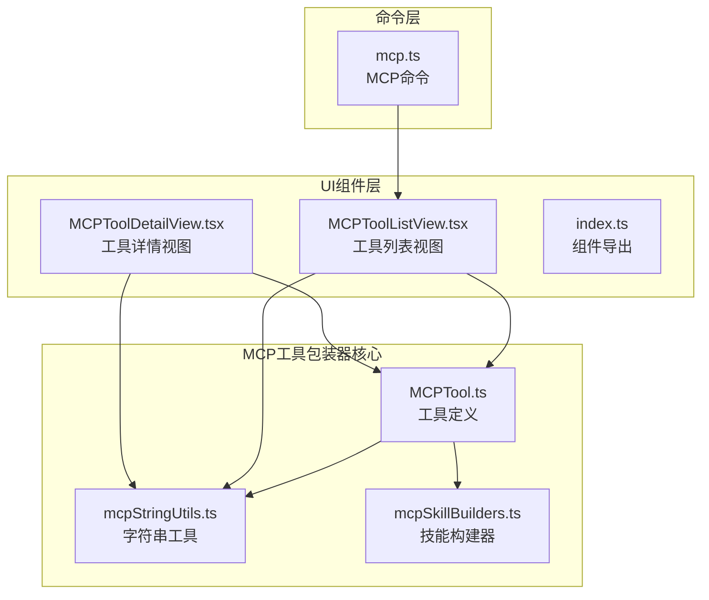
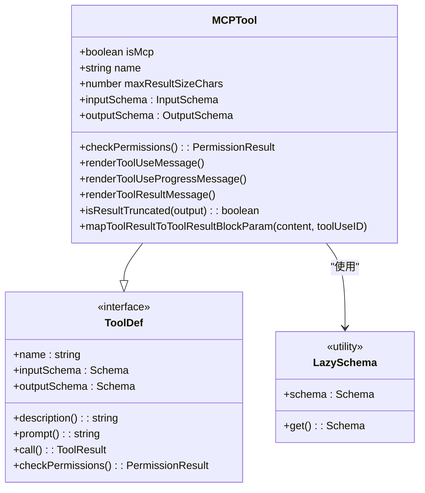
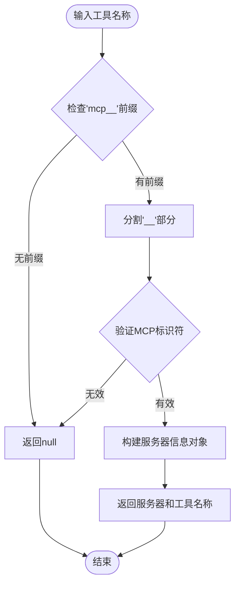
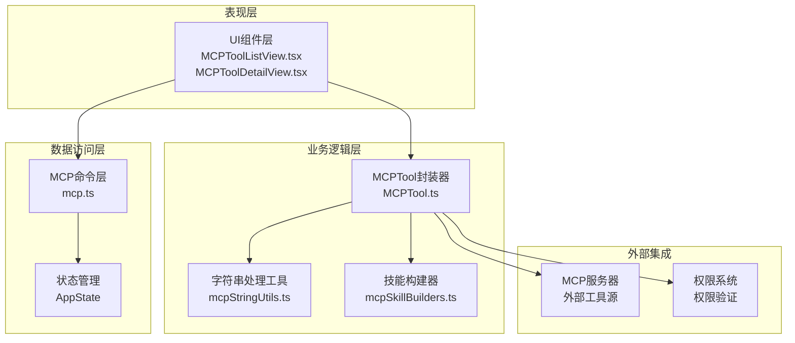
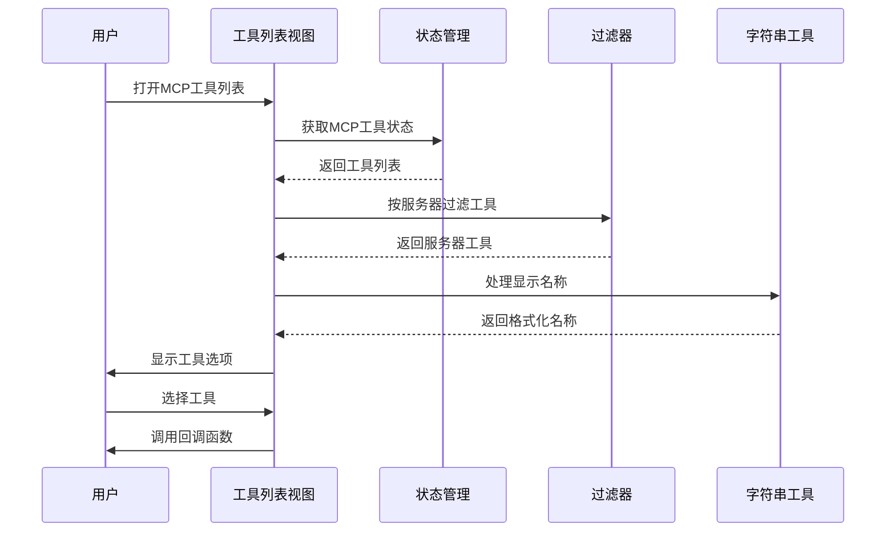
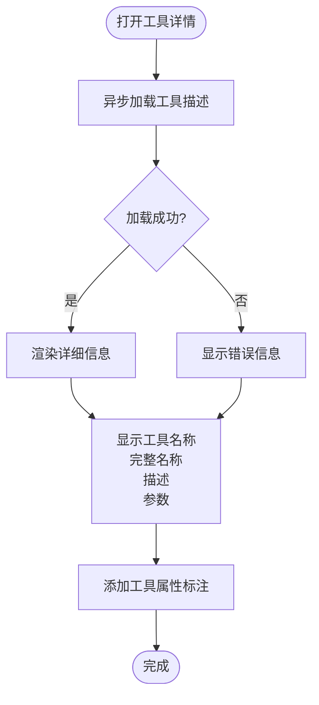
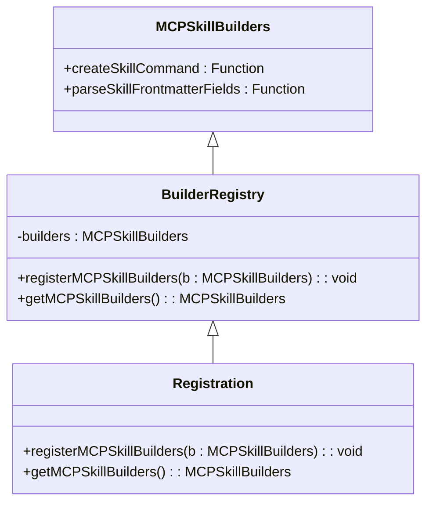
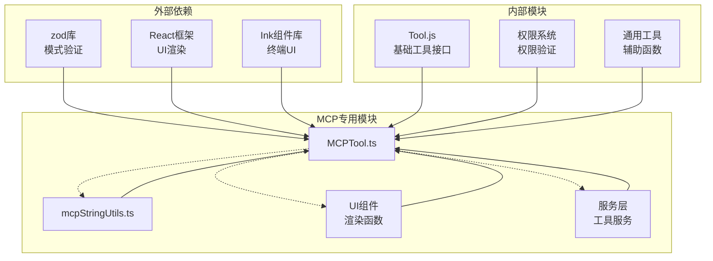

# MCP工具包装器

<cite>
**本文档引用的文件**
- [MCPTool.ts](file://src/tools/MCPTool/MCPTool.ts)
- [MCPToolDetailView.tsx](file://src/components/mcp/MCPToolDetailView.tsx)
- [MCPToolListView.tsx](file://src/components/mcp/MCPToolListView.tsx)
- [mcpStringUtils.ts](file://src/services/mcp/mcpStringUtils.ts)
- [mcpSkillBuilders.ts](file://src/skills/mcpSkillBuilders.ts)
- [mcp.ts](file://src/commands/mcp/mcp.tsx)
- [index.ts](file://src/components/mcp/index.ts)
</cite>

## 目录
1. [简介](#简介)
2. [项目结构](#项目结构)
3. [核心组件](#核心组件)
4. [架构概览](#架构概览)
5. [详细组件分析](#详细组件分析)
6. [依赖关系分析](#依赖关系分析)
7. [性能考虑](#性能考虑)
8. [故障排除指南](#故障排除指南)
9. [结论](#结论)
10. [附录](#附录)

## 简介

MCP工具包装器是Claude Code中用于将外部MCP（Model Context Protocol）工具集成到AI工作流中的关键组件。该系统允许用户通过MCP协议连接各种外部工具和服务，将其无缝集成到Claude Code的工具生态系统中。

MCP工具包装器的核心目标是：
- 将外部MCP工具包装为Claude Code可用的标准工具
- 提供动态模式支持和权限透传机制
- 实现工具分类和折叠功能
- 设计直观的工具UI组件和交互模式
- 支持自定义MCP工具的开发和集成

## 项目结构

MCP工具包装器在项目中的组织结构如下：

**图表来源**
- [MCPTool.ts:1-78](file://src/tools/MCPTool/MCPTool.ts#L1-L78)
- [mcpStringUtils.ts:1-107](file://src/services/mcp/mcpStringUtils.ts#L1-L107)
- [MCPToolListView.tsx:1-141](file://src/components/mcp/MCPToolListView.tsx#L1-L141)
- [MCPToolDetailView.tsx:1-212](file://src/components/mcp/MCPToolDetailView.tsx#L1-L212)

**章节来源**
- [MCPTool.ts:1-78](file://src/tools/MCPTool/MCPTool.ts#L1-L78)
- [mcpStringUtils.ts:1-107](file://src/services/mcp/mcpStringUtils.ts#L1-L107)
- [MCPToolListView.tsx:1-141](file://src/components/mcp/MCPToolListView.tsx#L1-L141)
- [MCPToolDetailView.tsx:1-212](file://src/components/mcp/MCPToolDetailView.tsx#L1-L212)

## 核心组件

### MCPTool类设计

MCPTool是整个MCP工具包装器的核心，它继承了标准工具接口并添加了MCP特定的功能：

**图表来源**
- [MCPTool.ts:27-78](file://src/tools/MCPTool/MCPTool.ts#L27-L78)

MCPTool的主要特性包括：

1. **动态输入输出模式**：使用lazySchema实现延迟模式解析
2. **权限透传**：提供checkPermissions方法进行权限验证
3. **UI渲染**：包含完整的工具使用消息渲染功能
4. **结果处理**：支持结果截断检测和映射

**章节来源**
- [MCPTool.ts:1-78](file://src/tools/MCPTool/MCPTool.ts#L1-L78)

### 工具字符串处理工具

mcpStringUtils模块提供了MCP工具名称解析和格式化的核心功能：

**图表来源**
- [mcpStringUtils.ts:19-32](file://src/services/mcp/mcpStringUtils.ts#L19-L32)

**章节来源**
- [mcpStringUtils.ts:1-107](file://src/services/mcp/mcpStringUtils.ts#L1-L107)

## 架构概览

MCP工具包装器采用分层架构设计，确保了良好的模块分离和可扩展性：

**图表来源**
- [MCPTool.ts:1-78](file://src/tools/MCPTool/MCPTool.ts#L1-L78)
- [MCPToolListView.tsx:1-141](file://src/components/mcp/MCPToolListView.tsx#L1-L141)
- [MCPToolDetailView.tsx:1-212](file://src/components/mcp/MCPToolDetailView.tsx#L1-L212)

## 详细组件分析

### 工具列表视图组件

MCPToolListView组件负责展示服务器上的可用工具，并提供选择和导航功能：

**图表来源**
- [MCPToolListView.tsx:20-134](file://src/components/mcp/MCPToolListView.tsx#L20-L134)

组件的关键功能：
1. **智能过滤**：根据服务器类型过滤可用工具
2. **显示优化**：提取工具显示名称，移除服务器前缀
3. **状态指示**：标注只读、破坏性操作和开放世界工具
4. **用户交互**：提供键盘导航和快捷键提示

**章节来源**
- [MCPToolListView.tsx:1-141](file://src/components/mcp/MCPToolListView.tsx#L1-L141)

### 工具详情视图组件

MCPToolDetailView组件提供工具的详细信息展示和描述加载功能：

**图表来源**
- [MCPToolDetailView.tsx:67-97](file://src/components/mcp/MCPToolDetailView.tsx#L67-L97)

组件特性：
1. **动态描述加载**：异步获取工具描述信息
2. **属性标注系统**：自动识别和显示工具属性
3. **参数展示**：格式化显示工具参数和必需字段
4. **响应式更新**：使用React.memo优化渲染性能

**章节来源**
- [MCPToolDetailView.tsx:1-212](file://src/components/mcp/MCPToolDetailView.tsx#L1-L212)

### 技能构建器注册系统

mcpSkillBuilders模块实现了MCP技能构建器的注册和管理机制：

**图表来源**
- [mcpSkillBuilders.ts:26-44](file://src/skills/mcpSkillBuilders.ts#L26-L44)

注册系统的优点：
1. **循环依赖避免**：通过类型导入避免模块循环
2. **延迟初始化**：支持运行时动态注册
3. **类型安全**：提供完整的TypeScript类型支持
4. **错误处理**：未注册时抛出明确的错误信息

**章节来源**
- [mcpSkillBuilders.ts:1-45](file://src/skills/mcpSkillBuilders.ts#L1-L45)

## 依赖关系分析

MCP工具包装器的依赖关系展现了清晰的分层架构：

**图表来源**
- [MCPTool.ts:1-78](file://src/tools/MCPTool/MCPTool.ts#L1-L78)
- [mcpStringUtils.ts:1-107](file://src/services/mcp/mcpStringUtils.ts#L1-L107)

**章节来源**
- [MCPTool.ts:1-78](file://src/tools/MCPTool/MCPTool.ts#L1-L78)
- [mcpStringUtils.ts:1-107](file://src/services/mcp/mcpStringUtils.ts#L1-L107)

## 性能考虑

MCP工具包装器在设计时充分考虑了性能优化：

### 渲染优化策略

1. **React.memo缓存**：组件内部使用memoization减少不必要的重渲染
2. **条件渲染**：仅在必要时重新计算和渲染内容
3. **异步加载**：工具描述采用异步加载避免阻塞UI

### 内存管理

1. **懒加载模式**：使用lazySchema延迟模式解析
2. **资源清理**：及时清理异步操作和事件监听器
3. **状态优化**：最小化状态更新频率

### 网络性能

1. **批量请求**：合并相似的工具查询请求
2. **缓存机制**：利用工具元数据的缓存策略
3. **超时处理**：合理的超时设置避免长时间等待

## 故障排除指南

### 常见问题及解决方案

#### 工具名称解析失败
**问题症状**：工具显示名称不正确或无法识别
**可能原因**：
- 工具名称格式不符合mcp__server__tool约定
- 服务器名称包含特殊字符
- 工具名称中包含双下划线

**解决步骤**：
1. 检查工具名称格式是否符合约定
2. 验证服务器名称的规范化处理
3. 使用`extractMcpToolDisplayName`函数处理显示名称

#### 权限验证错误
**问题症状**：工具调用被拒绝但无明确错误信息
**可能原因**：
- 权限配置不正确
- 工具权限规则冲突
- 服务器连接状态异常

**解决步骤**：
1. 检查工具的权限声明
2. 验证服务器的权限配置
3. 确认用户权限级别

#### UI渲染问题
**问题症状**：工具列表或详情页面显示异常
**可能原因**：
- React状态更新时机问题
- 异步操作未正确处理
- 组件卸载时的状态清理

**解决步骤**：
1. 检查组件的生命周期管理
2. 确保异步操作的取消处理
3. 验证状态更新的原子性

**章节来源**
- [MCPToolDetailView.tsx:67-97](file://src/components/mcp/MCPToolDetailView.tsx#L67-L97)
- [MCPToolListView.tsx:29-51](file://src/components/mcp/MCPToolListView.tsx#L29-L51)

## 结论

MCP工具包装器是一个设计精良的系统，成功地将外部MCP工具集成到Claude Code中。其核心优势包括：

1. **模块化设计**：清晰的分层架构便于维护和扩展
2. **类型安全**：完整的TypeScript支持确保代码质量
3. **用户体验**：直观的UI组件提供良好的交互体验
4. **性能优化**：多种优化策略确保系统高效运行

该系统为开发者提供了强大的MCP工具集成能力，同时保持了良好的可扩展性和维护性。

## 附录

### 自定义MCP工具开发指南

#### 工具接口规范
1. **名称约定**：遵循`mcp__server__tool`格式
2. **权限声明**：明确定义工具所需的权限级别
3. **参数模式**：使用JSON Schema定义输入参数
4. **输出格式**：标准化工具输出格式

#### 参数处理最佳实践
1. **输入验证**：使用lazySchema进行延迟验证
2. **默认值处理**：为可选参数提供合理默认值
3. **类型转换**：确保参数类型的一致性

#### 错误处理策略
1. **异常捕获**：使用try-catch处理异步操作
2. **错误传播**：向用户显示有意义的错误信息
3. **降级处理**：提供错误状态下的基本功能

### 调试技巧

1. **日志记录**：使用console.log记录关键操作
2. **状态检查**：定期检查工具状态和权限
3. **网络监控**：监控MCP服务器连接状态
4. **性能分析**：使用浏览器开发者工具分析性能瓶颈