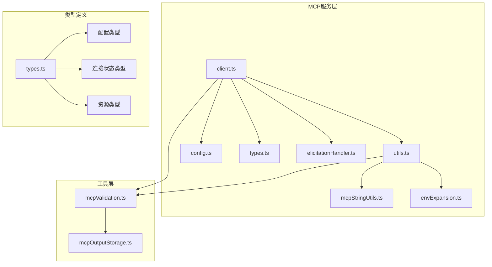
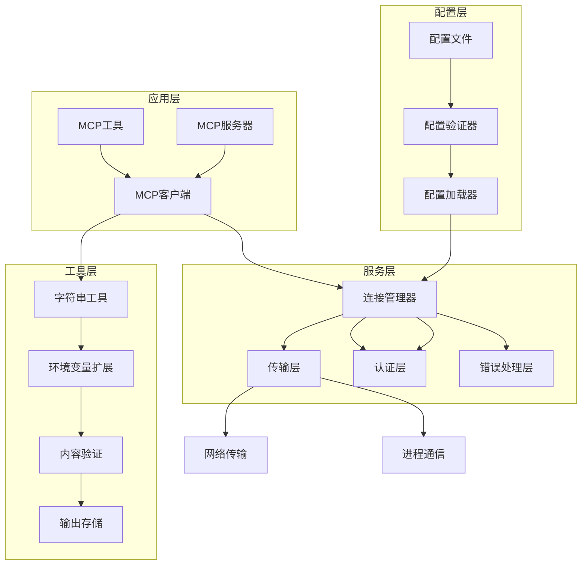
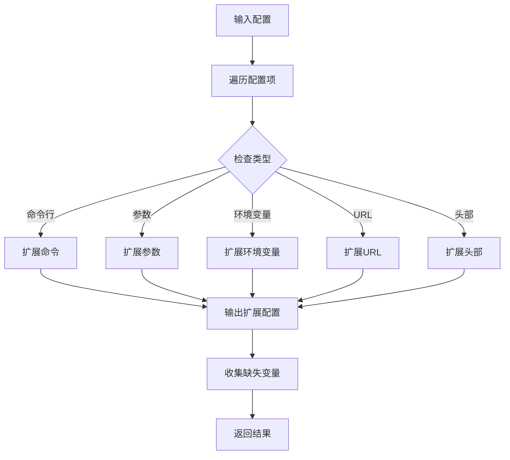
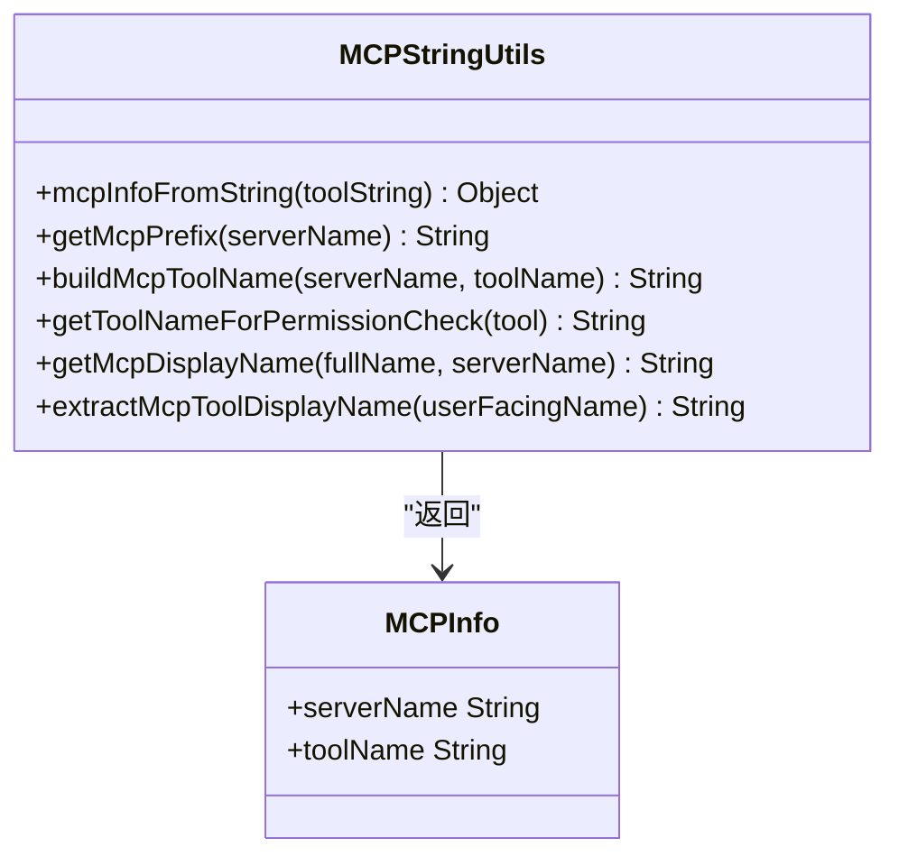
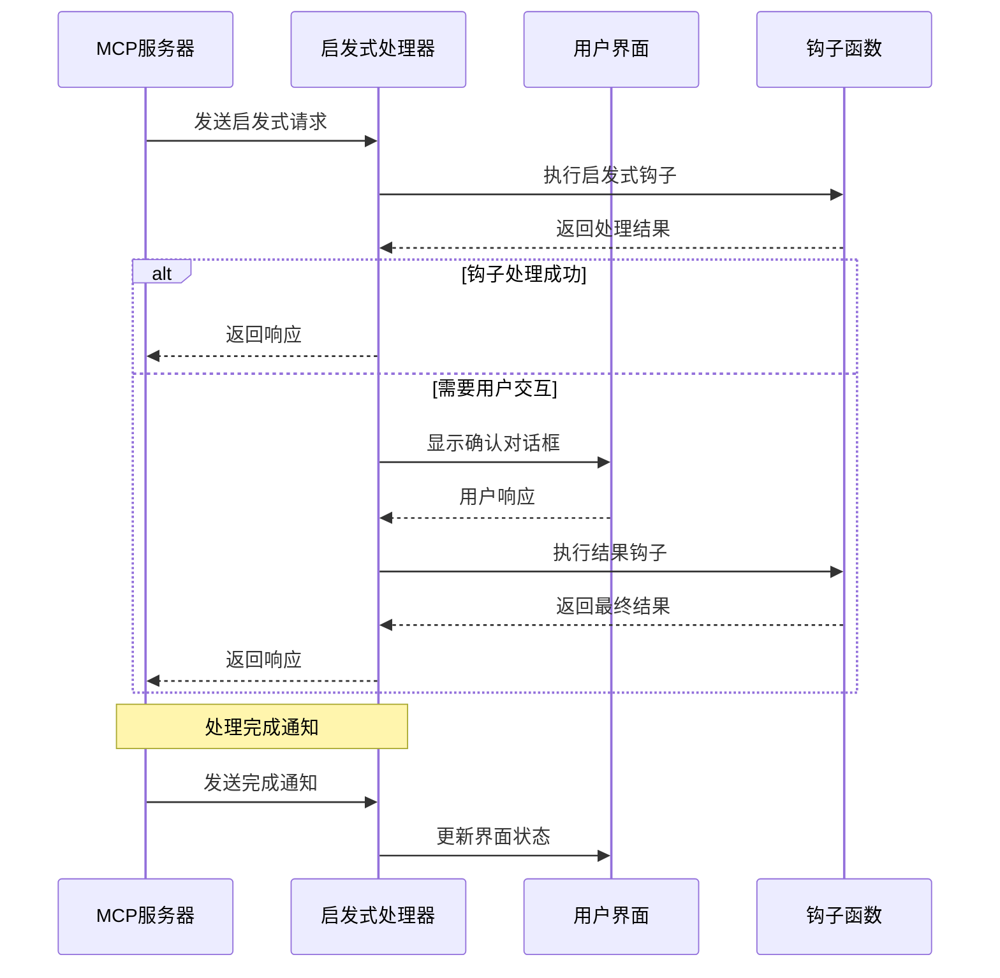
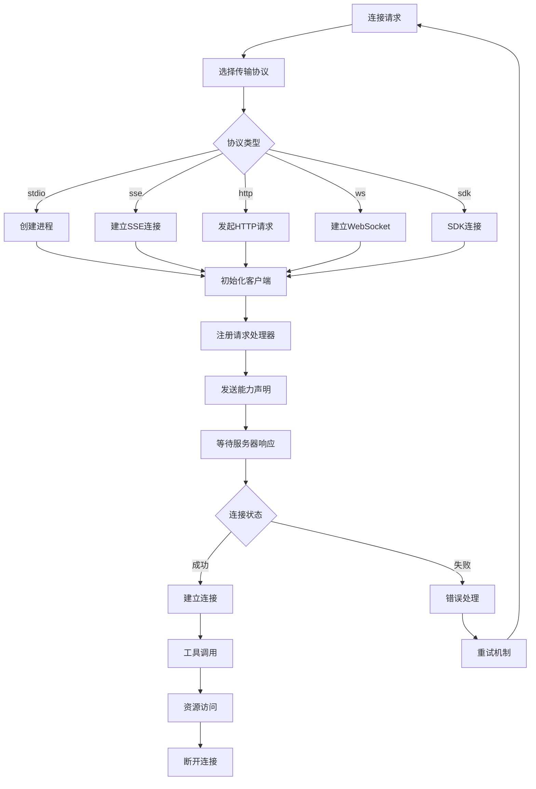
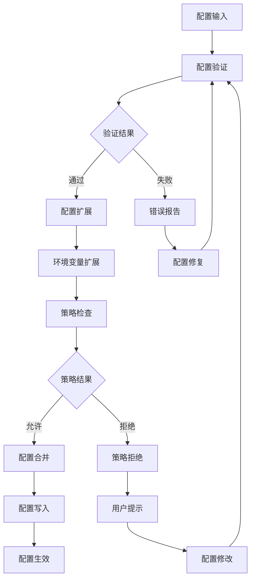

# MCP开发指南

<cite>
**本文档引用的文件**
- [utils.ts](file://src/services/mcp/utils.ts)
- [envExpansion.ts](file://src/services/mcp/envExpansion.ts)
- [mcpStringUtils.ts](file://src/services/mcp/mcpStringUtils.ts)
- [elicitationHandler.ts](file://src/services/mcp/elicitationHandler.ts)
- [client.ts](file://src/services/mcp/client.ts)
- [config.ts](file://src/services/mcp/config.ts)
- [types.ts](file://src/services/mcp/types.ts)
- [mcpValidation.ts](file://src/utils/mcpValidation.ts)
- [mcpOutputStorage.ts](file://src/utils/mcpOutputStorage.ts)
</cite>

## 目录
1. [简介](#简介)
2. [项目结构](#项目结构)
3. [核心组件](#核心组件)
4. [架构概览](#架构概览)
5. [详细组件分析](#详细组件分析)
6. [依赖关系分析](#依赖关系分析)
7. [性能考虑](#性能考虑)
8. [故障排除指南](#故障排除指南)
9. [结论](#结论)
10. [附录](#附录)

## 简介

MCP（Model Context Protocol）开发指南为开发者提供了完整的MCP生态系统开发参考，涵盖服务器开发、客户端集成、工具开发等各个方面。本指南基于Claude Code源码中的MCP实现，深入解析了开发辅助工具、环境变量扩展、字符串处理工具、启发式处理器等核心组件。

MCP是一个开放协议，允许AI代理与各种工具和服务进行交互。在Claude Code中，MCP被广泛应用于连接外部服务、执行工具调用、管理资源访问等场景。

## 项目结构

MCP相关代码主要位于`src/services/mcp/`目录下，包含以下核心模块：



**图表来源**
- [client.ts:1-100](file://src/services/mcp/client.ts#L1-L100)
- [utils.ts:1-50](file://src/services/mcp/utils.ts#L1-L50)
- [types.ts:1-50](file://src/services/mcp/types.ts#L1-L50)

**章节来源**
- [client.ts:1-200](file://src/services/mcp/client.ts#L1-L200)
- [utils.ts:1-100](file://src/services/mcp/utils.ts#L1-L100)
- [types.ts:1-100](file://src/services/mcp/types.ts#L1-L100)

## 核心组件

### MCP客户端管理器

MCP客户端管理器是整个MCP系统的核心，负责服务器连接、工具调用、资源管理等功能。主要特性包括：

- **多传输协议支持**：支持stdio、SSE、HTTP、WebSocket等多种传输方式
- **自动重连机制**：智能检测连接失败并自动重连
- **认证管理**：统一处理OAuth、Bearer Token等认证方式
- **错误处理**：完善的错误分类和处理机制

### 配置管理系统

配置管理系统负责MCP服务器配置的加载、验证和管理：

- **多作用域配置**：支持本地、用户、项目、动态等不同作用域
- **企业级策略**：支持allowlist/denylist策略控制
- **环境变量扩展**：支持在配置中使用环境变量
- **配置验证**：使用Zod Schema进行严格的配置验证

### 工具开发辅助工具

工具开发辅助工具提供了丰富的开发辅助功能：

- **工具过滤**：按服务器名称过滤工具
- **命令管理**：管理MCP服务器的命令
- **资源管理**：管理服务器资源
- **配置哈希**：用于配置变更检测

**章节来源**
- [client.ts:595-800](file://src/services/mcp/client.ts#L595-L800)
- [config.ts:553-616](file://src/services/mcp/config.ts#L553-L616)
- [utils.ts:32-170](file://src/services/mcp/utils.ts#L32-L170)

## 架构概览

MCP系统采用分层架构设计，确保了良好的可扩展性和维护性：



**图表来源**
- [client.ts:985-1002](file://src/services/mcp/client.ts#L985-L1002)
- [config.ts:1-50](file://src/services/mcp/config.ts#L1-L50)
- [utils.ts:1-50](file://src/services/mcp/utils.ts#L1-L50)

## 详细组件分析

### 环境变量扩展工具（envExpansion）

环境变量扩展工具提供了在MCP配置中使用环境变量的能力：



**图表来源**
- [envExpansion.ts:10-38](file://src/services/mcp/envExpansion.ts#L10-L38)

该工具支持以下语法：
- `${VAR}` - 基本环境变量替换
- `${VAR:-default}` - 带默认值的环境变量替换

**章节来源**
- [envExpansion.ts:1-39](file://src/services/mcp/envExpansion.ts#L1-L39)

### MCP字符串处理工具（mcpStringUtils）

MCP字符串处理工具提供了MCP工具名称解析和生成的核心功能：



**图表来源**
- [mcpStringUtils.ts:19-107](file://src/services/mcp/mcpStringUtils.ts#L19-L107)

主要功能包括：
- **工具名称解析**：从完整工具名称解析出服务器名和工具名
- **前缀生成**：生成MCP工具名称前缀
- **显示名称处理**：处理用户可见的显示名称

**章节来源**
- [mcpStringUtils.ts:1-107](file://src/services/mcp/mcpStringUtils.ts#L1-L107)

### 启发式处理器（elicitationHandler）

启发式处理器负责处理MCP服务器的启发式请求：



**图表来源**
- [elicitationHandler.ts:77-171](file://src/services/mcp/elicitationHandler.ts#L77-L171)

**章节来源**
- [elicitationHandler.ts:1-314](file://src/services/mcp/elicitationHandler.ts#L1-L314)

### MCP客户端核心（client.ts）

MCP客户端核心实现了完整的MCP协议支持：



**图表来源**
- [client.ts:595-677](file://src/services/mcp/client.ts#L595-L677)

**章节来源**
- [client.ts:1-1599](file://src/services/mcp/client.ts#L1-L1599)

### 配置管理（config.ts）

配置管理系统提供了完整的MCP配置管理功能：



**图表来源**
- [config.ts:625-761](file://src/services/mcp/config.ts#L625-L761)

**章节来源**
- [config.ts:1-800](file://src/services/mcp/config.ts#L1-L800)

## 依赖关系分析

MCP系统的依赖关系体现了清晰的分层架构：

```mermaid
graph TB
subgraph "外部依赖"
A[@modelcontextprotocol/sdk]
B[lodash-es]
C[zod]
D[ws]
end
subgraph "内部模块"
E[utils.ts] --> F[mcpStringUtils.ts]
E --> G[envExpansion.ts]
E --> H[mcpValidation.ts]
I[client.ts] --> E
I --> J[types.ts]
I --> K[config.ts]
L[config.ts] --> J
L --> G
M[utils/mcpValidation.ts] --> N[mcpOutputStorage.ts]
end
A --> I
B --> I
C --> L
D --> I
```

**图表来源**
- [client.ts:1-50](file://src/services/mcp/client.ts#L1-L50)
- [utils.ts:1-20](file://src/services/mcp/utils.ts#L1-L20)
- [config.ts:1-20](file://src/services/mcp/config.ts#L1-L20)

**章节来源**
- [client.ts:1-100](file://src/services/mcp/client.ts#L1-L100)
- [utils.ts:1-50](file://src/services/mcp/utils.ts#L1-L50)
- [config.ts:1-50](file://src/services/mcp/config.ts#L1-L50)

## 性能考虑

### 连接池管理

MCP客户端实现了智能的连接池管理：

- **批量连接**：支持批量连接多个MCP服务器
- **缓存机制**：使用memoization缓存连接状态
- **超时控制**：每个请求都有独立的超时控制

### 内容处理优化

- **延迟加载**：React组件采用延迟加载避免不必要的渲染
- **内存管理**：及时清理事件监听器防止内存泄漏
- **资源压缩**：对大文件进行压缩处理

### 错误恢复机制

- **自动重连**：连接失败时自动重连
- **会话管理**：处理会话过期并重新获取新会话
- **降级策略**：在网络异常时提供降级功能

## 故障排除指南

### 常见连接问题

1. **连接超时**
   - 检查网络连接和防火墙设置
   - 调整MCP_TIMEOUT环境变量
   - 验证服务器地址和端口

2. **认证失败**
   - 检查OAuth配置
   - 验证访问令牌有效性
   - 查看认证日志

3. **传输协议问题**
   - 确认服务器支持的协议
   - 检查代理设置
   - 验证SSL证书

### 调试技巧

- **启用详细日志**：使用DEBUG环境变量启用详细日志
- **监控连接状态**：定期检查连接统计信息
- **分析性能指标**：监控响应时间和吞吐量

**章节来源**
- [client.ts:1048-1155](file://src/services/mcp/client.ts#L1048-L1155)
- [config.ts:625-761](file://src/services/mcp/config.ts#L625-L761)

## 结论

MCP开发指南提供了完整的开发参考，涵盖了从基础概念到高级特性的所有方面。通过理解这些核心组件和最佳实践，开发者可以构建稳定、高效的MCP应用程序。

关键要点包括：
- 使用分层架构确保代码的可维护性
- 实现完善的错误处理和恢复机制
- 利用工具类简化开发工作
- 注重性能优化和用户体验

## 附录

### 开发环境配置

1. **安装依赖**
   ```bash
   npm install
   ```

2. **配置环境变量**
   - MCP_TOOL_TIMEOUT：工具调用超时时间
   - MCP_TIMEOUT：连接超时时间
   - MAX_MCP_OUTPUT_TOKENS：最大输出令牌数

3. **启动开发服务器**
   ```bash
   npm run dev
   ```

### 测试策略

1. **单元测试**
   - 测试工具函数的正确性
   - 验证配置解析逻辑
   - 检查错误处理机制

2. **集成测试**
   - 测试完整的MCP连接流程
   - 验证工具调用功能
   - 模拟网络异常情况

3. **性能测试**
   - 测试大量并发连接
   - 验证内存使用情况
   - 分析响应时间分布