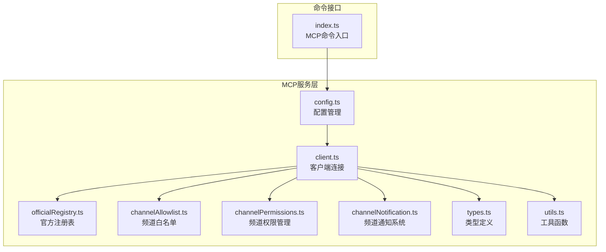
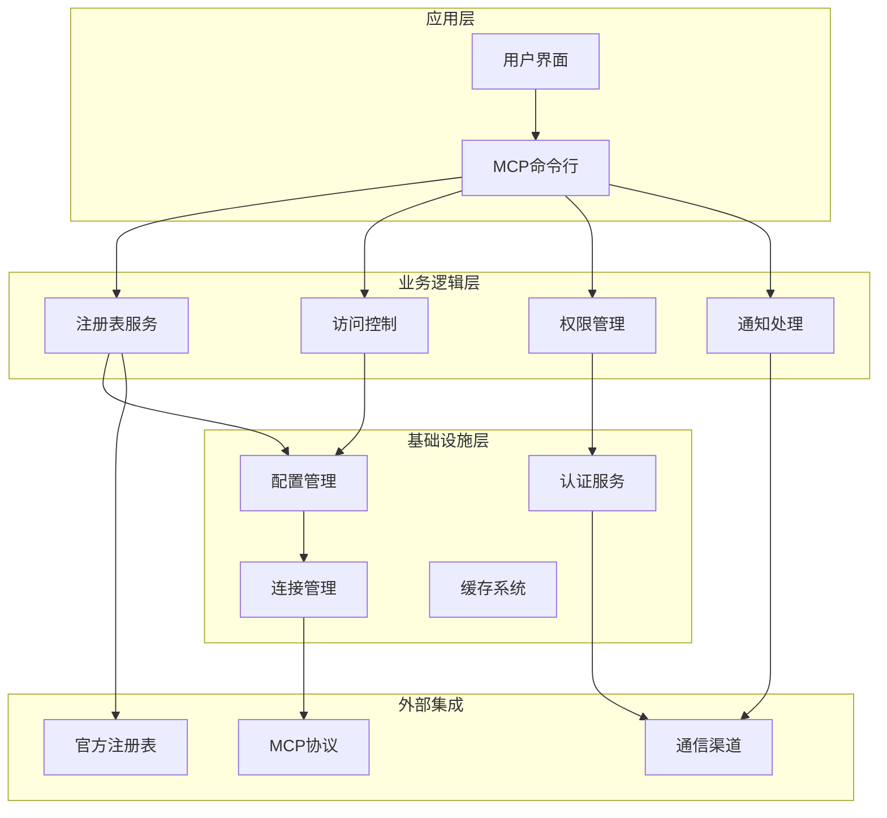
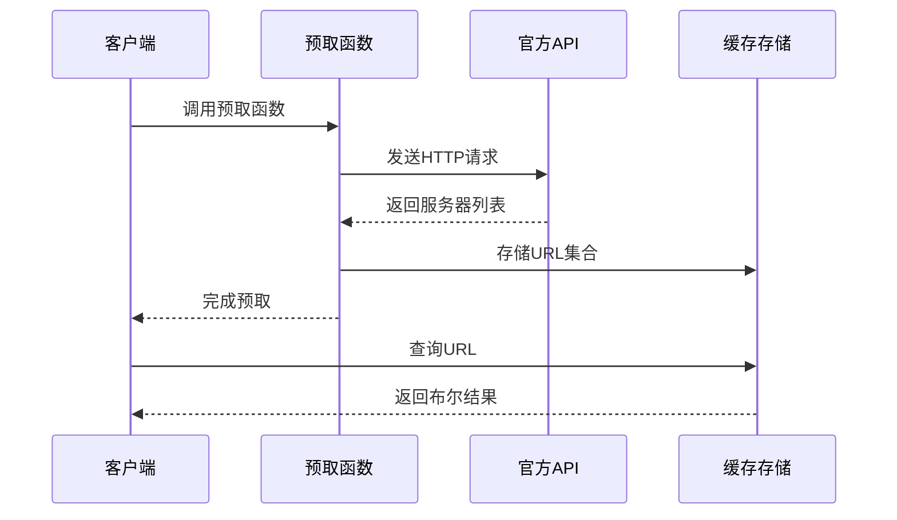
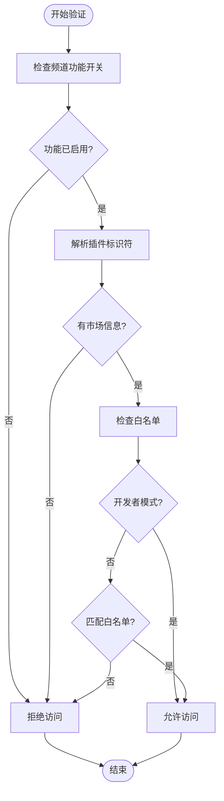
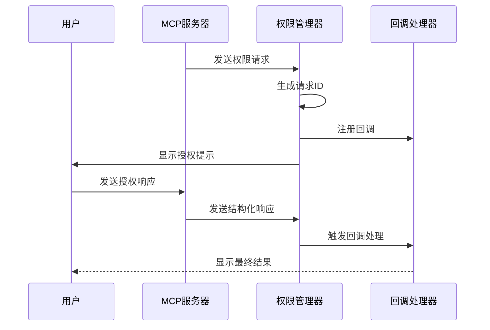
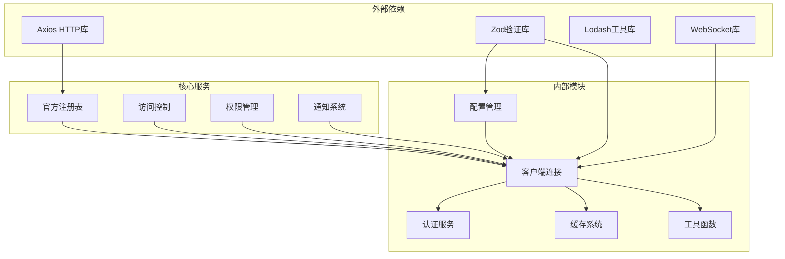

# MCP服务器管理

<cite>
**本文档引用的文件**
- [officialRegistry.ts](file://src/services/mcp/officialRegistry.ts)
- [channelAllowlist.ts](file://src/services/mcp/channelAllowlist.ts)
- [channelPermissions.ts](file://src/services/mcp/channelPermissions.ts)
- [channelNotification.ts](file://src/services/mcp/channelNotification.ts)
- [config.ts](file://src/services/mcp/config.ts)
- [types.ts](file://src/services/mcp/types.ts)
- [client.ts](file://src/services/mcp/client.ts)
- [utils.ts](file://src/services/mcp/utils.ts)
- [index.ts](file://src/commands/mcp/index.ts)
</cite>

## 目录
1. [简介](#简介)
2. [项目结构](#项目结构)
3. [核心组件](#核心组件)
4. [架构概览](#架构概览)
5. [详细组件分析](#详细组件分析)
6. [依赖关系分析](#依赖关系分析)
7. [性能考虑](#性能考虑)
8. [故障排除指南](#故障排除指南)
9. [结论](#结论)
10. [附录](#附录)

## 简介

MCP（Model Context Protocol）服务器管理是Claude代码编辑器中的一个关键功能模块，负责管理与外部AI服务器的连接和通信。该系统提供了完整的服务器发现、版本管理、兼容性检查、权限控制和通知机制。

本文档深入解析了MCP服务器管理的核心组件，包括官方注册表（officialRegistry）、频道白名单（channelAllowlist）、频道权限管理（channelPermissions）和频道通知系统（channelNotification）。同时提供了详细的服务器配置指南、故障排除方法和性能优化建议。

## 项目结构

MCP服务器管理模块位于`src/services/mcp/`目录下，包含以下核心文件：

**图表来源**
- [officialRegistry.ts:1-73](file://src/services/mcp/officialRegistry.ts#L1-L73)
- [channelAllowlist.ts:1-77](file://src/services/mcp/channelAllowlist.ts#L1-L77)
- [channelPermissions.ts:1-241](file://src/services/mcp/channelPermissions.ts#L1-L241)
- [channelNotification.ts:1-317](file://src/services/mcp/channelNotification.ts#L1-L317)
- [config.ts:1-800](file://src/services/mcp/config.ts#L1-L800)
- [types.ts:1-259](file://src/services/mcp/types.ts#L1-L259)
- [client.ts:1-800](file://src/services/mcp/client.ts#L1-L800)
- [utils.ts:1-576](file://src/services/mcp/utils.ts#L1-L576)
- [index.ts:1-12](file://src/commands/mcp/index.ts#L1-L12)

**章节来源**
- [officialRegistry.ts:1-73](file://src/services/mcp/officialRegistry.ts#L1-L73)
- [channelAllowlist.ts:1-77](file://src/services/mcp/channelAllowlist.ts#L1-L77)
- [channelPermissions.ts:1-241](file://src/services/mcp/channelPermissions.ts#L1-L241)
- [channelNotification.ts:1-317](file://src/services/mcp/channelNotification.ts#L1-L317)
- [config.ts:1-800](file://src/services/mcp/config.ts#L1-L800)
- [types.ts:1-259](file://src/services/mcp/types.ts#L1-L259)
- [client.ts:1-800](file://src/services/mcp/client.ts#L1-L800)
- [utils.ts:1-576](file://src/services/mcp/utils.ts#L1-L576)
- [index.ts:1-12](file://src/commands/mcp/index.ts#L1-L12)

## 核心组件

### 官方注册表（officialRegistry）

官方注册表负责维护和查询官方MCP服务器的URL列表，提供服务器身份验证和可信度检查功能。

**主要功能：**
- 预取官方MCP服务器URL列表
- 提供URL规范化处理
- 实施服务器可信度检查
- 支持测试环境重置

**关键特性：**
- 异步预取机制，避免阻塞主流程
- URL标准化处理，去除查询参数和尾部斜杠
- 缓存机制，提高查询性能
- 错误处理和调试日志支持

**章节来源**
- [officialRegistry.ts:1-73](file://src/services/mcp/officialRegistry.ts#L1-L73)

### 频道白名单（channelAllowlist）

频道白名单机制控制频道服务器的访问权限，基于插件市场和插件名称进行授权管理。

**核心机制：**
- 插件级授权控制
- 市场化插件识别
- 开发者模式绕过
- GrowthBook动态配置

**授权流程：**
1. 检查频道功能开关
2. 解析插件标识符
3. 匹配白名单条目
4. 应用开发者模式豁免

**章节来源**
- [channelAllowlist.ts:1-77](file://src/services/mcp/channelAllowlist.ts#L1-L77)

### 频道权限管理（channelPermissions）

频道权限管理系统处理通过各种通信渠道（如Telegram、iMessage、Discord）的权限请求和验证。

**主要组件：**
- 权限请求生成器
- 结构化响应解析
- 请求ID短码生成
- 防重复攻击机制

**安全特性：**
- 5字符字母ID生成（避免数字混淆）
- 内容过滤和块列表
- 请求超时和清理机制
- 多通道权限同步

**章节来源**
- [channelPermissions.ts:1-241](file://src/services/mcp/channelPermissions.ts#L1-L241)

### 频道通知系统（channelNotification）

频道通知系统允许MCP服务器向用户发送消息到各种通信平台，并在对话中显示这些消息。

**工作原理：**
- 监听`notifications/claude/channel`事件
- 包装消息内容为XML格式
- 实施权限验证和访问控制
- 支持多种通信协议

**消息处理流程：**
1. 验证服务器能力声明
2. 检查用户会话状态
3. 应用组织策略限制
4. 注册通知处理器

**章节来源**
- [channelNotification.ts:1-317](file://src/services/mcp/channelNotification.ts#L1-L317)

## 架构概览

MCP服务器管理采用分层架构设计，确保各组件职责清晰、耦合度低：

**图表来源**
- [config.ts:1-800](file://src/services/mcp/config.ts#L1-L800)
- [client.ts:1-800](file://src/services/mcp/client.ts#L1-L800)
- [officialRegistry.ts:1-73](file://src/services/mcp/officialRegistry.ts#L1-L73)
- [channelAllowlist.ts:1-77](file://src/services/mcp/channelAllowlist.ts#L1-L77)
- [channelPermissions.ts:1-241](file://src/services/mcp/channelPermissions.ts#L1-L241)
- [channelNotification.ts:1-317](file://src/services/mcp/channelNotification.ts#L1-L317)

## 详细组件分析

### 官方注册表实现

官方注册表通过异步方式获取和缓存官方MCP服务器的URL列表，提供高效的查找功能：

**图表来源**
- [officialRegistry.ts:33-68](file://src/services/mcp/officialRegistry.ts#L33-L68)

**实现特点：**
- 使用Set数据结构优化查找性能
- 实现URL标准化处理
- 支持环境变量禁用网络请求
- 提供测试重置功能

**章节来源**
- [officialRegistry.ts:1-73](file://src/services/mcp/officialRegistry.ts#L1-L73)

### 频道白名单验证流程

频道白名单检查采用多层验证机制，确保只有授权的插件才能使用频道功能：

**图表来源**
- [channelAllowlist.ts:67-76](file://src/services/mcp/channelAllowlist.ts#L67-L76)

**验证规则：**
- 必须先通过功能开关检查
- 插件必须具有有效的市场标识
- 开发者模式可绕过白名单检查
- 支持精确的插件市场匹配

**章节来源**
- [channelAllowlist.ts:1-77](file://src/services/mcp/channelAllowlist.ts#L1-L77)

### 权限请求处理机制

权限管理系统实现了复杂的请求-响应机制，确保用户授权的安全性和有效性：

**图表来源**
- [channelPermissions.ts:209-241](file://src/services/mcp/channelPermissions.ts#L209-L241)

**安全措施：**
- 5字符字母ID生成算法
- 内容过滤和敏感词检测
- 请求ID大小写标准化
- 重复请求防重机制

**章节来源**
- [channelPermissions.ts:1-241](file://src/services/mcp/channelPermissions.ts#L1-L241)

### 通知处理管道

频道通知系统实现了完整的消息处理管道，从接收到底层渲染：

**图表来源**
- [channelNotification.ts:191-316](file://src/services/mcp/channelNotification.ts#L191-L316)

**处理步骤：**
1. 验证服务器是否声明了频道能力
2. 检查用户会话的认证状态
3. 应用组织级别的策略限制
4. 执行白名单授权检查
5. 包装消息内容为XML格式
6. 将消息添加到处理队列

**章节来源**
- [channelNotification.ts:1-317](file://src/services/mcp/channelNotification.ts#L1-L317)

## 依赖关系分析

MCP服务器管理模块的依赖关系体现了清晰的分层设计：

**图表来源**
- [client.ts:1-800](file://src/services/mcp/client.ts#L1-L800)
- [config.ts:1-800](file://src/services/mcp/config.ts#L1-L800)
- [officialRegistry.ts:1-73](file://src/services/mcp/officialRegistry.ts#L1-L73)
- [channelAllowlist.ts:1-77](file://src/services/mcp/channelAllowlist.ts#L1-L77)
- [channelPermissions.ts:1-241](file://src/services/mcp/channelPermissions.ts#L1-L241)
- [channelNotification.ts:1-317](file://src/services/mcp/channelNotification.ts#L1-L317)

**依赖特点：**
- 最小化外部依赖，提高稳定性
- 内部模块间松耦合设计
- 明确的职责分离
- 可测试性强的架构设计

**章节来源**
- [client.ts:1-800](file://src/services/mcp/client.ts#L1-L800)
- [config.ts:1-800](file://src/services/mcp/config.ts#L1-L800)

## 性能考虑

### 连接管理优化

MCP客户端实现了多种性能优化策略：

**批量连接处理：**
- 本地服务器默认批处理大小为3
- 远程服务器默认批处理大小为20
- 可通过环境变量调整批处理大小

**连接缓存机制：**
- 使用memoize缓存连接结果
- 支持连接状态的快速查询
- 自动清理过期的连接缓存

**内存管理：**
- 限制工具描述长度（2048字符）
- 实现内容截断机制
- 优化大输出的处理

### 缓存策略

系统采用了多层次的缓存策略来提升性能：

**URL缓存：**
- 官方注册表URL集合缓存
- 认证失败缓存（15分钟TTL）
- 连接状态缓存

**配置缓存：**
- 插件配置缓存
- 工具元数据缓存
- 资源列表缓存

**章节来源**
- [client.ts:552-561](file://src/services/mcp/client.ts#L552-L561)
- [client.ts:257-316](file://src/services/mcp/client.ts#L257-L316)
- [utils.ts:157-169](file://src/services/mcp/utils.ts#L157-L169)

## 故障排除指南

### 常见问题诊断

**连接失败排查：**
1. 检查网络连接和代理设置
2. 验证服务器URL的可达性
3. 确认认证凭据的有效性
4. 查看详细的错误日志

**权限问题解决：**
- 验证频道白名单配置
- 检查插件市场标识符
- 确认开发者模式设置
- 验证组织策略限制

**性能问题诊断：**
- 监控连接池使用情况
- 检查批处理配置
- 分析缓存命中率
- 评估内存使用情况

### 调试工具

**日志级别设置：**
- 使用调试模式获取详细信息
- 监控MCP协议交互
- 跟踪连接状态变化
- 记录性能指标

**监控指标：**
- 连接成功率
- 请求延迟分布
- 缓存效率
- 错误率统计

**章节来源**
- [client.ts:67-75](file://src/services/mcp/client.ts#L67-L75)
- [config.ts:1-800](file://src/services/mcp/config.ts#L1-L800)

## 结论

MCP服务器管理模块展现了优秀的软件工程实践，具有以下特点：

**架构优势：**
- 清晰的分层设计，职责明确
- 强大的扩展性，支持多种传输协议
- 完善的安全机制，多层次防护
- 高性能的缓存和连接管理

**技术亮点：**
- 智能的服务器发现和验证机制
- 灵活的权限控制系统
- 高效的通知处理管道
- 完善的配置管理方案

**最佳实践：**
- 遵循最小权限原则
- 实施多层安全验证
- 优化性能和资源使用
- 提供完善的监控和诊断工具

该模块为Claude代码编辑器提供了稳定可靠的MCP服务器管理能力，支持企业级部署和大规模使用场景。

## 附录

### 服务器配置指南

**基础配置：**
- 服务器名称：仅允许字母、数字、连字符和下划线
- 传输类型：stdio、sse、http、ws、sdk
- 环境变量：支持在配置中使用环境变量

**高级配置：**
- OAuth认证：支持客户端ID和回调端口配置
- 头部管理：自定义请求头部
- 超时设置：可配置连接和请求超时时间

**企业配置：**
- 策略控制：允许/拒绝服务器列表
- 组织限制：团队和企业级别的访问控制
- 代理支持：完整的代理配置选项

**章节来源**
- [types.ts:1-259](file://src/services/mcp/types.ts#L1-L259)
- [config.ts:618-761](file://src/services/mcp/config.ts#L618-L761)

### API参考

**核心API：**
- `connectToServer()`: 建立MCP服务器连接
- `filterMcpServersByPolicy()`: 应用策略过滤
- `gateChannelServer()`: 频道服务器访问控制
- `createChannelPermissionCallbacks()`: 创建权限回调

**工具函数：**
- `getMcpServerSignature()`: 服务器签名计算
- `wrapChannelMessage()`: 消息包装
- `shortRequestId()`: 请求ID生成

**章节来源**
- [client.ts:595-607](file://src/services/mcp/client.ts#L595-L607)
- [config.ts:536-551](file://src/services/mcp/config.ts#L536-L551)
- [channelNotification.ts:106-116](file://src/services/mcp/channelNotification.ts#L106-L116)
- [channelPermissions.ts:140-152](file://src/services/mcp/channelPermissions.ts#L140-L152)