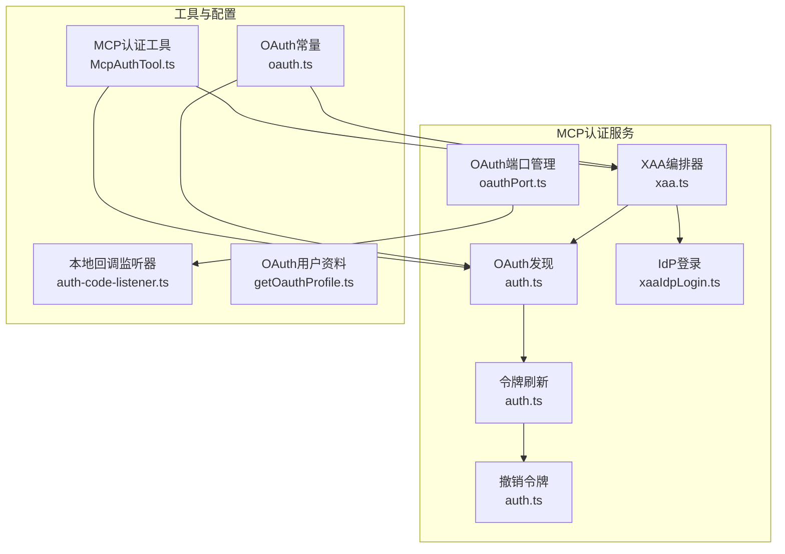
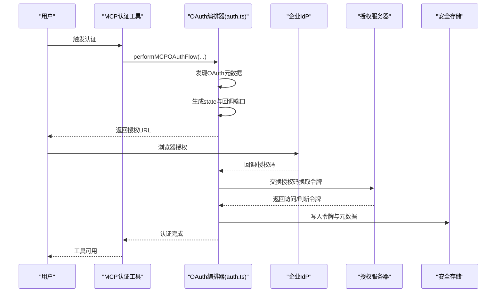
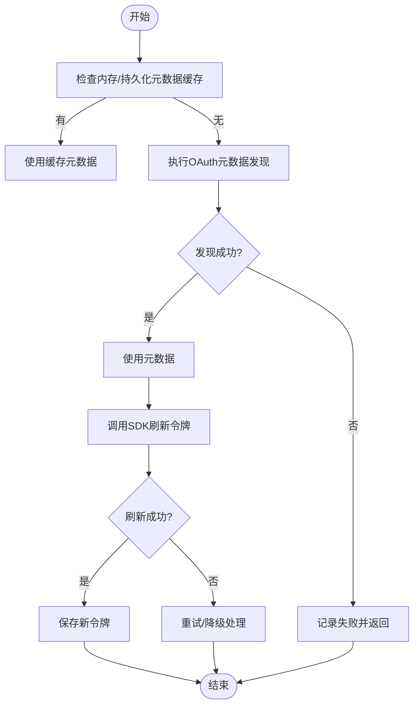
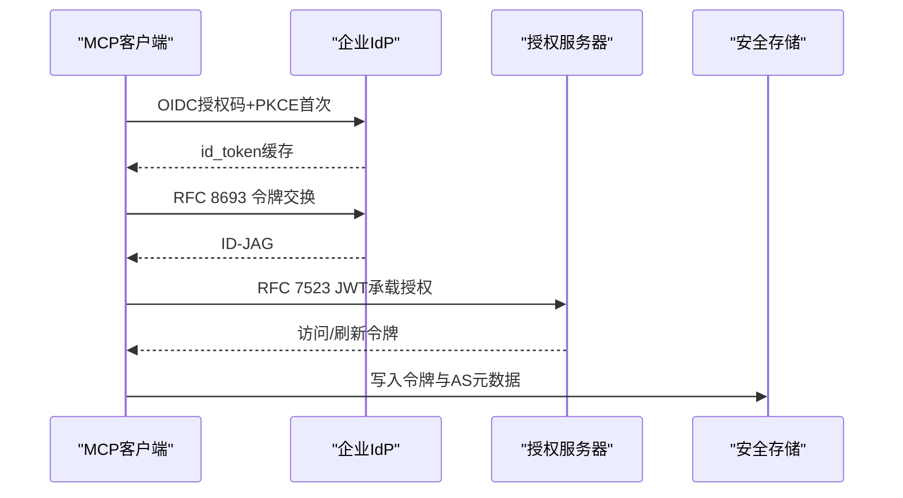
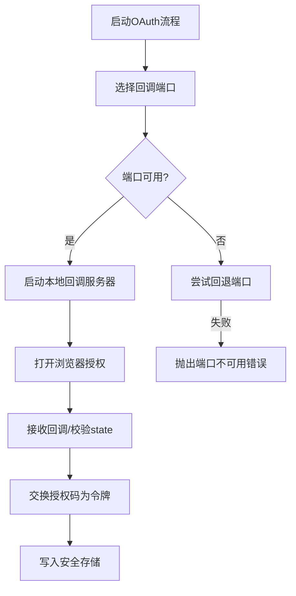
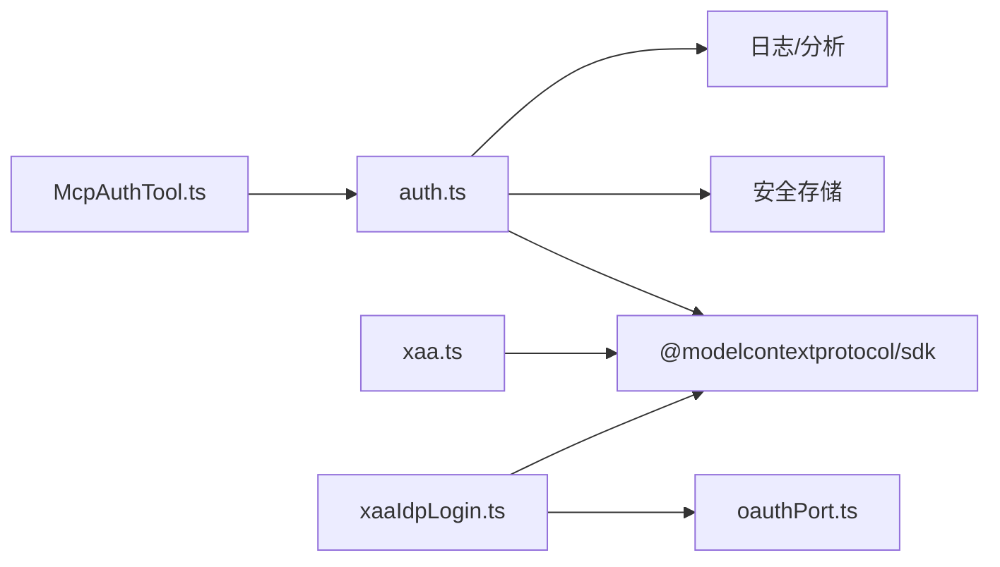

# MCP认证机制

<cite>
**本文档引用的文件**
- [auth.ts](file://src/services/mcp/auth.ts)
- [xaa.ts](file://src/services/mcp/xaa.ts)
- [xaaIdpLogin.ts](file://src/services/mcp/xaaIdpLogin.ts)
- [oauthPort.ts](file://src/services/mcp/oauthPort.ts)
- [oauth.ts](file://src/constants/oauth.ts)
- [auth-code-listener.ts](file://src/services/oauth/auth-code-listener.ts)
- [getOauthProfile.ts](file://src/services/oauth/getOauthProfile.ts)
- [McpAuthTool.ts](file://src/tools/McpAuthTool/McpAuthTool.ts)
</cite>

## 目录
1. [简介](#简介)
2. [项目结构](#项目结构)
3. [核心组件](#核心组件)
4. [架构总览](#架构总览)
5. [详细组件分析](#详细组件分析)
6. [依赖关系分析](#依赖关系分析)
7. [性能考虑](#性能考虑)
8. [故障排查指南](#故障排查指南)
9. [结论](#结论)
10. [附录](#附录)

## 简介
本文件系统性阐述MCP（Model Context Protocol）认证机制，重点覆盖以下方面：
- OAuth 2.0标准流程在MCP中的实现与扩展
- 跨应用访问（XAA/SEP-990）的完整链路与安全模型
- auth.ts中认证实现：令牌获取、刷新、验证与存储
- OAuth端口管理与安全通道建立
- 认证失败排查与安全最佳实践
- 不同认证方式的选择指南与迁移策略

## 项目结构
围绕MCP认证的核心代码主要位于以下模块：
- 服务层：OAuth发现、令牌刷新、撤销与存储
- XAA实现：IdP登录、RFC 8693 + RFC 7523交换、静默授权
- 工具层：MCP认证工具，用于触发OAuth流程并替换伪工具
- 常量与配置：OAuth客户端元数据、作用域与重定向URI
- 辅助组件：本地回调服务器、端口选择与安全通道

**图表来源**
- [auth.ts](file://src/services/mcp/auth.ts)
- [xaa.ts](file://src/services/mcp/xaa.ts)
- [xaaIdpLogin.ts](file://src/services/mcp/xaaIdpLogin.ts)
- [oauthPort.ts](file://src/services/mcp/oauthPort.ts)
- [oauth.ts](file://src/constants/oauth.ts)
- [auth-code-listener.ts](file://src/services/oauth/auth-code-listener.ts)
- [getOauthProfile.ts](file://src/services/oauth/getOauthProfile.ts)
- [McpAuthTool.ts](file://src/tools/McpAuthTool/McpAuthTool.ts)

**章节来源**
- [auth.ts](file://src/services/mcp/auth.ts)
- [xaa.ts](file://src/services/mcp/xaa.ts)
- [xaaIdpLogin.ts](file://src/services/mcp/xaaIdpLogin.ts)
- [oauthPort.ts](file://src/services/mcp/oauthPort.ts)
- [oauth.ts](file://src/constants/oauth.ts)
- [auth-code-listener.ts](file://src/services/oauth/auth-code-listener.ts)
- [getOauthProfile.ts](file://src/services/oauth/getOauthProfile.ts)
- [McpAuthTool.ts](file://src/tools/McpAuthTool/McpAuthTool.ts)

## 核心组件
- OAuth发现与元数据缓存：通过RFC 9728与RFC 8414进行保护资源与授权服务器元数据发现，并持久化以减少重复探测。
- 令牌刷新与错误归因：封装SDK刷新逻辑，结合超时与错误映射，输出稳定失败原因码以便分析。
- 撤销令牌：遵循RFC 7009，优先使用规范认证方式，兼容非合规服务器的回退路径。
- XAA编排器：PRM发现→AS元数据发现→IdP令牌交换→JWT承载授权→AS令牌获取，全程无浏览器交互。
- IdP登录：OIDC授权码+PKCE，支持固定回调端口与密钥缓存，带超时与状态校验。
- 端口管理：随机端口选择与回退策略，避免冲突；支持环境变量强制指定端口。
- 工具集成：MCP认证工具可触发OAuth流程，返回授权URL或静默完成。

**章节来源**
- [auth.ts](file://src/services/mcp/auth.ts)
- [xaa.ts](file://src/services/mcp/xaa.ts)
- [xaaIdpLogin.ts](file://src/services/mcp/xaaIdpLogin.ts)
- [oauthPort.ts](file://src/services/mcp/oauthPort.ts)
- [McpAuthTool.ts](file://src/tools/McpAuthTool/McpAuthTool.ts)

## 架构总览
下图展示MCP认证的整体架构与关键交互：

**图表来源**
- [auth.ts](file://src/services/mcp/auth.ts)
- [McpAuthTool.ts](file://src/tools/McpAuthTool/McpAuthTool.ts)
- [auth-code-listener.ts](file://src/services/oauth/auth-code-listener.ts)

## 详细组件分析

### OAuth发现与令牌刷新
- 元数据发现顺序：优先使用配置的元数据URL；否则按RFC 9728→RFC 8414探测，保留路径感知以兼容旧式服务器。
- 刷新流程：优先使用内存/持久化缓存的元数据，否则重新发现；调用SDK刷新接口，成功后更新存储。
- 错误归因：对已知失败路径映射到稳定原因码，便于统计与定位。

**图表来源**
- [auth.ts](file://src/services/mcp/auth.ts)

**章节来源**
- [auth.ts](file://src/services/mcp/auth.ts)

### 撤销令牌与清理
- 撤销顺序：先刷新令牌，再访问令牌；若服务器不支持特定认证方式，则采用回退方案。
- 清理策略：无论服务器侧是否成功，均清除本地令牌；支持保留提升权限所需的发现状态。

**章节来源**
- [auth.ts](file://src/services/mcp/auth.ts)

### XAA（跨应用访问）实现
- 安全模型：一次IdP登录，复用缓存的id_token，在后台完成多MCP服务器的静默授权。
- 编排步骤：
  1) PRM发现：确认MCP服务器受保护资源与授权服务器列表
  2) AS元数据发现：验证授权服务器元数据与端点HTTPS要求
  3) IdP令牌交换：RFC 8693，id_token→ID-JAG
  4) JWT承载授权：RFC 7523，ID-JAG→访问令牌
- 错误处理：区分IdP交换失败与AS jwt-bearer失败，必要时清理IdP缓存令牌。

**图表来源**
- [xaa.ts](file://src/services/mcp/xaa.ts)
- [xaaIdpLogin.ts](file://src/services/mcp/xaaIdpLogin.ts)
- [auth.ts](file://src/services/mcp/auth.ts)

**章节来源**
- [xaa.ts](file://src/services/mcp/xaa.ts)
- [xaaIdpLogin.ts](file://src/services/mcp/xaaIdpLogin.ts)
- [auth.ts](file://src/services/mcp/auth.ts)

### OAuth端口管理与安全通道
- 端口范围：Windows使用保留范围外端口，其他平台使用动态端口范围；支持环境变量强制指定端口。
- 回调服务器：本地HTTP服务器监听回调路径，校验state参数，确保CSRF防护。
- 安全通道：严格要求HTTPS元数据端点与令牌端点；对非标准错误体进行标准化处理，统一invalid_grant语义。

**图表来源**
- [oauthPort.ts](file://src/services/mcp/oauthPort.ts)
- [auth-code-listener.ts](file://src/services/oauth/auth-code-listener.ts)
- [auth.ts](file://src/services/mcp/auth.ts)

**章节来源**
- [oauthPort.ts](file://src/services/mcp/oauthPort.ts)
- [auth-code-listener.ts](file://src/services/oauth/auth-code-listener.ts)
- [auth.ts](file://src/services/mcp/auth.ts)

### MCP认证工具集成
- 触发方式：工具调用后立即返回授权URL；若为XAA且缓存有效，可能静默完成。
- 后续替换：OAuth完成后自动清理认证缓存并重新连接，用真实工具替换伪工具。

**章节来源**
- [McpAuthTool.ts](file://src/tools/McpAuthTool/McpAuthTool.ts)

## 依赖关系分析
- 组件耦合
  - auth.ts依赖SDK的OAuth发现与刷新能力，同时与安全存储、日志与分析模块耦合。
  - xaa.ts独立于auth.ts的OAuth流程，但共享相同的元数据发现与错误处理模式。
  - xaaIdpLogin.ts负责IdP OIDC发现与回调服务器，与oauthPort.ts存在端口选择协作。
- 外部依赖
  - SDK提供的OAuth发现、令牌交换与错误类型定义
  - axios用于非OAuth场景的HTTP请求
  - 平台与安全存储抽象

**图表来源**
- [auth.ts](file://src/services/mcp/auth.ts)
- [xaa.ts](file://src/services/mcp/xaa.ts)
- [xaaIdpLogin.ts](file://src/services/mcp/xaaIdpLogin.ts)
- [oauthPort.ts](file://src/services/mcp/oauthPort.ts)
- [McpAuthTool.ts](file://src/tools/McpAuthTool/McpAuthTool.ts)

**章节来源**
- [auth.ts](file://src/services/mcp/auth.ts)
- [xaa.ts](file://src/services/mcp/xaa.ts)
- [xaaIdpLogin.ts](file://src/services/mcp/xaaIdpLogin.ts)
- [oauthPort.ts](file://src/services/mcp/oauthPort.ts)
- [McpAuthTool.ts](file://src/tools/McpAuthTool/McpAuthTool.ts)

## 性能考虑
- 元数据缓存：跨会话持久化授权服务器元数据，避免重复RFC 9728→RFC 8414探测。
- 随机端口选择：提高安全性，降低被占用概率；回退策略保证可用性。
- 超时与信号组合：每个OAuth请求独立超时，避免长时间阻塞；支持AbortSignal中断。
- 非标准错误标准化：对特定OAuth错误别名进行规范化，减少无效重试。

## 故障排查指南
- 常见错误与定位
  - 端口不可用：检查端口占用或使用环境变量强制指定端口
  - 状态不匹配：确认回调服务器正确校验state参数
  - Provider拒绝授权：查看OAuth错误码与拒绝原因
  - 刷新失败：检查元数据发现结果与客户端信息是否齐全
  - XAA失败：区分IdP令牌交换失败与AS jwt-bearer失败，必要时清理IdP缓存令牌
- 排查步骤
  - 查看调试日志中的敏感参数脱敏与错误归因
  - 使用内置分析事件追踪失败原因码
  - 手动撤销令牌并重新认证
  - 验证HTTPS元数据端点与令牌端点
- 安全建议
  - 严格使用HTTPS元数据与令牌端点
  - 避免在日志中打印敏感OAuth参数
  - 对非标准错误体进行标准化处理，防止误判

**章节来源**
- [auth.ts](file://src/services/mcp/auth.ts)
- [auth-code-listener.ts](file://src/services/oauth/auth-code-listener.ts)
- [getOauthProfile.ts](file://src/services/oauth/getOauthProfile.ts)

## 结论
MCP认证机制在OAuth 2.0标准之上，通过RFC 9728/8414元数据发现、SDK驱动的刷新与撤销、以及XAA静默授权，构建了安全、可扩展且用户体验友好的认证体系。通过严格的错误归因、端口管理与HTTPS要求，系统在复杂的企业网络环境中仍能保持稳健运行。

## 附录

### 不同认证方式的选择指南
- 标准OAuth：适用于大多数MCP服务器，流程清晰、兼容性强
- XAA（跨应用访问）：适用于企业环境，一次IdP登录即可静默授权多个MCP服务器
- 迁移策略
  - 从标准OAuth迁移到XAA：启用XAA配置，配置IdP信息，逐步替换客户端凭据
  - 从XAA迁回标准OAuth：禁用XAA，清理IdP缓存，恢复传统OAuth流程

**章节来源**
- [auth.ts](file://src/services/mcp/auth.ts)
- [xaa.ts](file://src/services/mcp/xaa.ts)
- [oauth.ts](file://src/constants/oauth.ts)