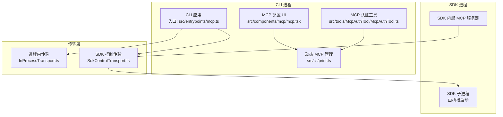
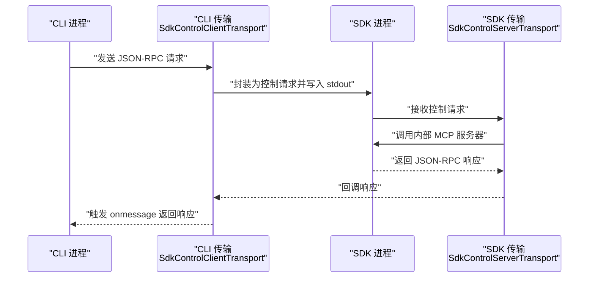
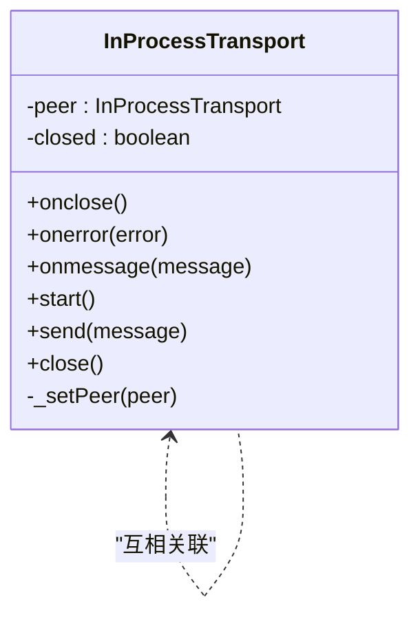
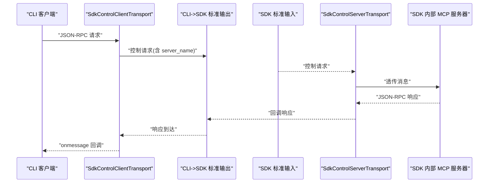
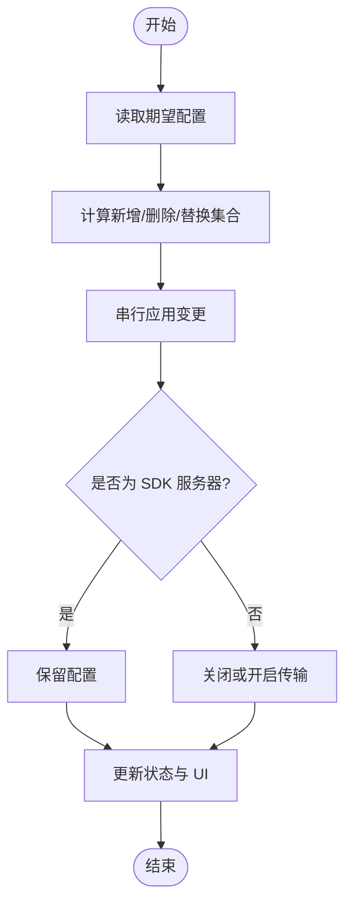
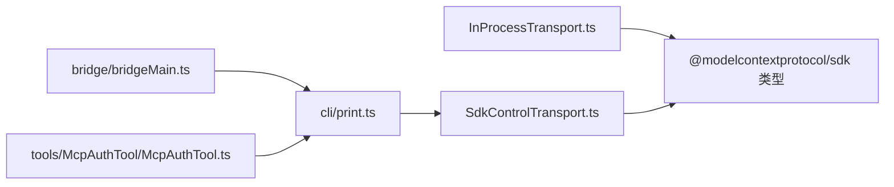
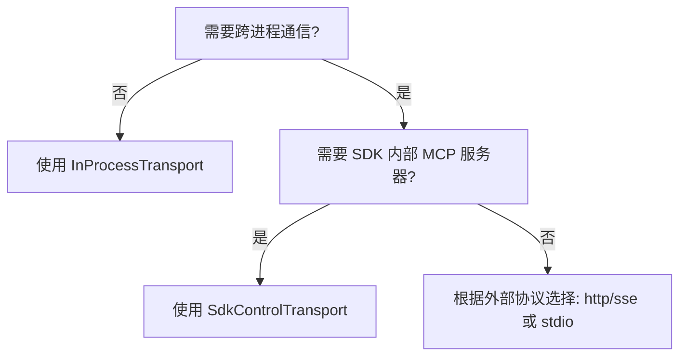

# MCP传输方式

<cite>
**本文引用的文件**
- [InProcessTransport.ts](file://src/services/mcp/InProcessTransport.ts)
- [SdkControlTransport.ts](file://src/services/mcp/SdkControlTransport.ts)
- [print.ts](file://src/cli/print.ts)
- [client.ts](file://src/services/mcp/client.ts)
- [bridgeMain.ts](file://src/bridge/bridgeMain.ts)
- [mcp.ts](file://src/entrypoints/mcp.ts)
- [mcp.tsx](file://src/components/mcp/mcp.tsx)
- [mcp.ts](file://src/commands/mcp/mcp.ts)
- [addCommand.ts](file://src/commands/mcp/addCommand.ts)
- [mcp.tsx](file://src/cli/handlers/mcp.tsx)
- [McpAuthTool.ts](file://src/tools/McpAuthTool/McpAuthTool.ts)
</cite>

## 目录
1. [简介](#简介)
2. [项目结构](#项目结构)
3. [核心组件](#核心组件)
4. [架构总览](#架构总览)
5. [详细组件分析](#详细组件分析)
6. [依赖关系分析](#依赖关系分析)
7. [性能考量](#性能考量)
8. [故障排查指南](#故障排查指南)
9. [结论](#结论)
10. [附录：配置与决策指南](#附录配置与决策指南)

## 简介
本文件系统性阐述 Claude Code 代码库中 MCP（Model Context Protocol）传输层的两种关键实现：进程内传输（InProcessTransport）与 SDK 控制传输（SdkControlTransport）。内容覆盖：
- 进程内传输的实现原理与数据通路
- SDK 控制传输的工作机制、控制消息格式与状态同步
- 各种传输方式的适用场景、性能特征与安全注意事项
- 传输方式选择的决策指南与配置示例
- 常见问题排查与性能优化最佳实践

## 项目结构
围绕 MCP 传输的关键目录与文件：
- 服务端传输实现：src/services/mcp/InProcessTransport.ts、SdkControlTransport.ts
- CLI 动态 MCP 状态管理与控制消息处理：src/cli/print.ts
- 客户端生命周期与清理：src/services/mcp/client.ts
- 桥接与子进程管理：src/bridge/bridgeMain.ts
- 入口与 UI：src/entrypoints/mcp.ts、src/components/mcp/mcp.tsx
- 命令行工具链：src/commands/mcp/*.ts
- 认证与传输类型：src/tools/McpAuthTool/McpAuthTool.ts

图表来源
- [InProcessTransport.ts:1-64](file://src/services/mcp/InProcessTransport.ts#L1-L64)
- [SdkControlTransport.ts:1-137](file://src/services/mcp/SdkControlTransport.ts#L1-L137)
- [print.ts:1533-1821](file://src/cli/print.ts#L1533-L1821)
- [bridgeMain.ts:119-124](file://src/bridge/bridgeMain.ts#L119-L124)

章节来源
- [InProcessTransport.ts:1-64](file://src/services/mcp/InProcessTransport.ts#L1-L64)
- [SdkControlTransport.ts:1-137](file://src/services/mcp/SdkControlTransport.ts#L1-L137)
- [print.ts:1533-1821](file://src/cli/print.ts#L1533-L1821)
- [bridgeMain.ts:119-124](file://src/bridge/bridgeMain.ts#L119-L124)

## 核心组件
- 进程内传输（InProcessTransport）
  - 一对互相关联的本地 Transport 实例，消息通过 onmessage 回调传递，无需外部进程或网络栈
  - 提供 createLinkedTransportPair 工厂方法，返回客户端与服务端传输对
- SDK 控制传输（SdkControlTransport）
  - CLI 侧：SdkControlClientTransport 将 MCP JSON-RPC 请求封装为“控制请求”，经 stdout 发送到 SDK 进程
  - SDK 侧：SdkControlServerTransport 接收来自 CLI 的控制请求，转发给内部 MCP 服务器，并通过回调返回响应
  - 支持多 SDK MCP 服务器并行运行，通过 server_name 路由到目标实例

章节来源
- [InProcessTransport.ts:1-64](file://src/services/mcp/InProcessTransport.ts#L1-L64)
- [SdkControlTransport.ts:1-137](file://src/services/mcp/SdkControlTransport.ts#L1-L137)

## 架构总览
下图展示 CLI 与 SDK 之间通过控制传输进行 MCP 交互的端到端流程。

图表来源
- [SdkControlTransport.ts:60-95](file://src/services/mcp/SdkControlTransport.ts#L60-L95)
- [SdkControlTransport.ts:109-136](file://src/services/mcp/SdkControlTransport.ts#L109-L136)

章节来源
- [SdkControlTransport.ts:1-137](file://src/services/mcp/SdkControlTransport.ts#L1-L137)

## 详细组件分析

### 组件一：进程内传输（InProcessTransport）
- 设计要点
  - 双向 Transport 对象通过 _setPeer 建立互连，消息通过异步队列 microtask 分发，避免同步调用栈过深
  - 关闭时双向触发 onclose，确保配对双方一致
- 数据通路
  - send -> peer.onmessage 异步投递
  - close -> 双侧 onclose 触发
- 适用场景
  - 单进程内联测试、单元测试、快速原型验证
  - 避免子进程开销与 IPC 复杂度
- 性能特征
  - 零拷贝、零序列化、极低延迟
  - 无并发竞争（单进程内），但不适用于跨进程/跨机器
- 安全考虑
  - 仅限本地进程内使用，天然隔离于外部网络
- 使用示例路径
  - 创建配对：[createLinkedTransportPair:57-63](file://src/services/mcp/InProcessTransport.ts#L57-L63)
  - 发送与关闭：[send/close:26-48](file://src/services/mcp/InProcessTransport.ts#L26-L48)

图表来源
- [InProcessTransport.ts:11-49](file://src/services/mcp/InProcessTransport.ts#L11-L49)

章节来源
- [InProcessTransport.ts:1-64](file://src/services/mcp/InProcessTransport.ts#L1-L64)

### 组件二：SDK 控制传输（SdkControlTransport）
- CLI 侧传输（SdkControlClientTransport）
  - 将 MCP JSON-RPC 请求包装为“控制请求”，携带 server_name 与 request_id
  - 通过回调 sendMcpMessage(serverName, message) 获取响应并回传给 onmessage
- SDK 侧传输（SdkControlServerTransport）
  - 作为 SDK 内部 MCP 服务器的“桥接器”，直接透传消息
  - 通过回调将响应返回给 CLI
- 控制消息格式与状态同步
  - CLI 侧负责维护待处理请求映射（在 CLI 的 StructuredIO 中），SDK 侧通过 Query 协调异步响应
  - 通过 server_name 将请求路由至正确的 SDK MCP 服务器实例
- 适用场景
  - CLI 与 SDK 在不同进程中的交互
  - 支持多 SDK 服务器并行运行
- 性能特征
  - 通过 stdout/stdin 传输，避免额外网络栈开销
  - 仍受进程间切换与序列化影响，较 InProcessTransport 略慢
- 安全考虑
  - 仅在受控的 CLI/SDK 进程边界内通信
  - 需注意控制消息的完整性与路由正确性

图表来源
- [SdkControlTransport.ts:60-95](file://src/services/mcp/SdkControlTransport.ts#L60-L95)
- [SdkControlTransport.ts:109-136](file://src/services/mcp/SdkControlTransport.ts#L109-L136)

章节来源
- [SdkControlTransport.ts:1-137](file://src/services/mcp/SdkControlTransport.ts#L1-L137)

### 组件三：CLI 动态 MCP 管理与状态同步
- 动态 MCP 服务器变更
  - applyMcpServerChanges 与 reconcileMcpServers 负责对比当前/期望配置，执行添加、移除与替换
  - 串行化调用以避免并发冲突（如后台插件安装与 mcp_set_servers 控制消息）
- SDK 模式服务器保留
  - applyPluginMcpDiff 过滤支持的传输类型，并保留已存在的 SDK 服务器配置，防止误关
- 控制消息处理
  - 初始化阶段从控制消息提取 SDK MCP 服务器列表，建立占位配置
- 关键路径
  - 应用变更：[applyMcpServerChanges:1548-1567](file://src/cli/print.ts#L1548-L1567)
  - 插件差异重算：[applyPluginMcpDiff:1792-1821](file://src/cli/print.ts#L1792-L1821)
  - 状态协调：[reconcileMcpServers:5450-5479](file://src/cli/print.ts#L5450-L5479)

图表来源
- [print.ts:5450-5479](file://src/cli/print.ts#L5450-L5479)
- [print.ts:1792-1821](file://src/cli/print.ts#L1792-L1821)

章节来源
- [print.ts:1533-1821](file://src/cli/print.ts#L1533-L1821)
- [print.ts:5446-5479](file://src/cli/print.ts#L5446-L5479)

### 组件四：桥接与子进程生命周期
- 子进程启动参数
  - spawnScriptArgs 根据运行环境决定是否需要显式传递脚本路径，避免 node 将 --sdk-url 解析为 node 选项
- 生命周期与清理
  - 客户端关闭时统一触发清理逻辑，确保所有 MCP 服务器被终止
- 关键路径
  - 子进程参数：[spawnScriptArgs:119-124](file://src/bridge/bridgeMain.ts#L119-L124)
  - 清理与关闭：[client.ts 关闭与清理:1541-1580](file://src/services/mcp/client.ts#L1541-L1580)

章节来源
- [bridgeMain.ts:119-124](file://src/bridge/bridgeMain.ts#L119-L124)
- [client.ts:1541-1580](file://src/services/mcp/client.ts#L1541-L1580)

## 依赖关系分析
- InProcessTransport
  - 依赖 @modelcontextprotocol/sdk 的 Transport 与 JSONRPCMessage 类型
  - 用于本地单元测试与快速原型
- SdkControlTransport
  - 依赖 @modelcontextprotocol/sdk 的 Transport 与 JSONRPCMessage 类型
  - 与 CLI 的 StructuredIO、SDK 的 Query 协同完成请求/响应关联
- CLI 动态管理
  - 与命令行配置、插件状态联动，影响传输层的创建/销毁
- 认证与传输类型
  - 不同传输类型（如 http/sse）可能需要额外认证流程，影响工具呈现与可用性

图表来源
- [InProcessTransport.ts:1-2](file://src/services/mcp/InProcessTransport.ts#L1-L2)
- [SdkControlTransport.ts:39-40](file://src/services/mcp/SdkControlTransport.ts#L39-L40)
- [print.ts:1533-1821](file://src/cli/print.ts#L1533-L1821)
- [bridgeMain.ts:119-124](file://src/bridge/bridgeMain.ts#L119-L124)
- [McpAuthTool.ts:54-55](file://src/tools/McpAuthTool/McpAuthTool.ts#L54-L55)

章节来源
- [InProcessTransport.ts:1-64](file://src/services/mcp/InProcessTransport.ts#L1-L64)
- [SdkControlTransport.ts:1-137](file://src/services/mcp/SdkControlTransport.ts#L1-L137)
- [print.ts:1533-1821](file://src/cli/print.ts#L1533-L1821)
- [bridgeMain.ts:119-124](file://src/bridge/bridgeMain.ts#L119-L124)
- [McpAuthTool.ts:32-60](file://src/tools/McpAuthTool/McpAuthTool.ts#L32-L60)

## 性能考量
- InProcessTransport
  - 最小化延迟与 CPU 开销；适合高频短消息与本地测试
- SdkControlTransport
  - 受进程间通信与序列化/反序列化影响；建议批量/合并请求以降低往返次数
  - 控制消息路由与查询关联需保持稳定，避免重复解析与错误匹配
- CLI/SDK 生命周期
  - 合理的超时与重试策略，避免长时间阻塞
  - 清理阶段统一关闭，减少资源泄漏

## 故障排查指南
- 常见症状与定位
  - 传输未建立：检查 CLI 与 SDK 的连接参数与子进程启动日志
  - 请求无响应：确认控制消息是否包含正确的 server_name 与 request_id
  - 并发冲突：观察是否存在多个并发变更导致的配置抖动
- 关键排查点
  - CLI 动态变更串行化：[applyMcpServerChanges:1548-1567](file://src/cli/print.ts#L1548-L1567)
  - SDK 服务器保留策略：[applyPluginMcpDiff:1792-1821](file://src/cli/print.ts#L1792-L1821)
  - 客户端关闭与清理：[client.ts 关闭与清理:1541-1580](file://src/services/mcp/client.ts#L1541-L1580)
  - 子进程参数问题：[spawnScriptArgs:119-124](file://src/bridge/bridgeMain.ts#L119-L124)
- 诊断建议
  - 打开调试日志，关注控制消息的发送/接收与响应时间
  - 核对传输类型与认证配置，确保工具呈现与实际能力一致

章节来源
- [print.ts:1548-1567](file://src/cli/print.ts#L1548-L1567)
- [print.ts:1792-1821](file://src/cli/print.ts#L1792-L1821)
- [client.ts:1541-1580](file://src/services/mcp/client.ts#L1541-L1580)
- [bridgeMain.ts:119-124](file://src/bridge/bridgeMain.ts#L119-L124)

## 结论
- InProcessTransport 适合本地开发与测试，具备极致性能与简单性
- SdkControlTransport 为 CLI 与 SDK 之间的标准桥接方案，支持多服务器并行与稳定的请求/响应关联
- 通过 CLI 的动态 MCP 管理与桥接生命周期控制，系统实现了可演进、可诊断的传输层

## 附录：配置与决策指南

### 传输方式选择决策树

### 配置示例与入口
- 入口与 UI
  - 入口文件：[src/entrypoints/mcp.ts](file://src/entrypoints/mcp.ts)
  - MCP 配置 UI：[src/components/mcp/mcp.tsx](file://src/components/mcp/mcp.tsx)
- 命令行工具
  - 添加/管理 MCP 服务器：[src/commands/mcp/mcp.ts](file://src/commands/mcp/mcp.ts)
  - 添加 SSE/HTTP 服务器：[src/commands/mcp/addCommand.ts:152-196](file://src/commands/mcp/addCommand.ts#L152-L196)
  - JSON 配置处理器：[src/cli/handlers/mcp.tsx:294-314](file://src/cli/handlers/mcp.tsx#L294-L314)
- 认证与传输类型
  - 传输类型与 URL 提取：[src/tools/McpAuthTool/McpAuthTool.ts:32-60](file://src/tools/McpAuthTool/McpAuthTool.ts#L32-L60)

章节来源
- [mcp.ts](file://src/entrypoints/mcp.ts)
- [mcp.tsx](file://src/components/mcp/mcp.tsx)
- [mcp.ts](file://src/commands/mcp/mcp.ts)
- [addCommand.ts:152-196](file://src/commands/mcp/addCommand.ts#L152-L196)
- [mcp.tsx:294-314](file://src/cli/handlers/mcp.tsx#L294-L314)
- [McpAuthTool.ts:32-60](file://src/tools/McpAuthTool/McpAuthTool.ts#L32-L60)