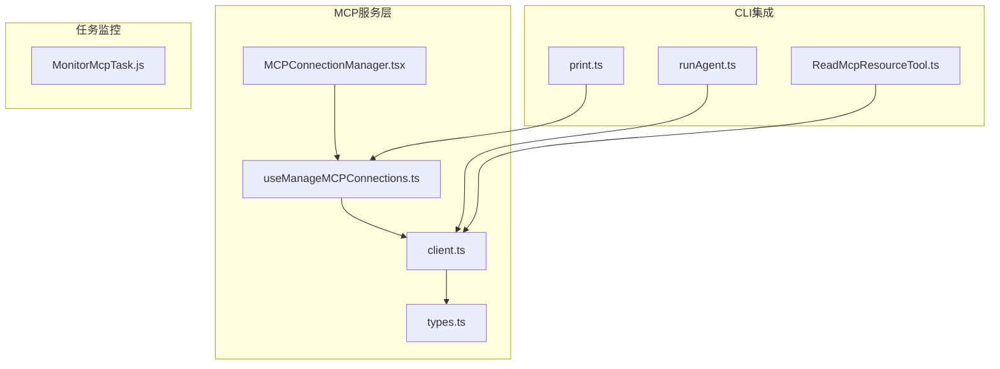
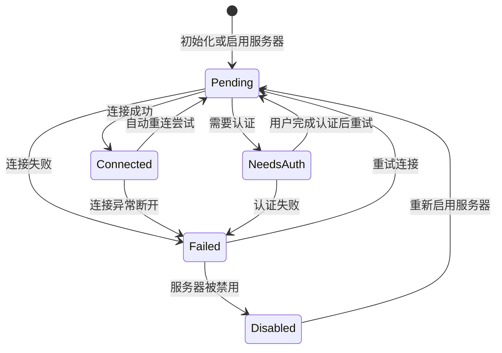
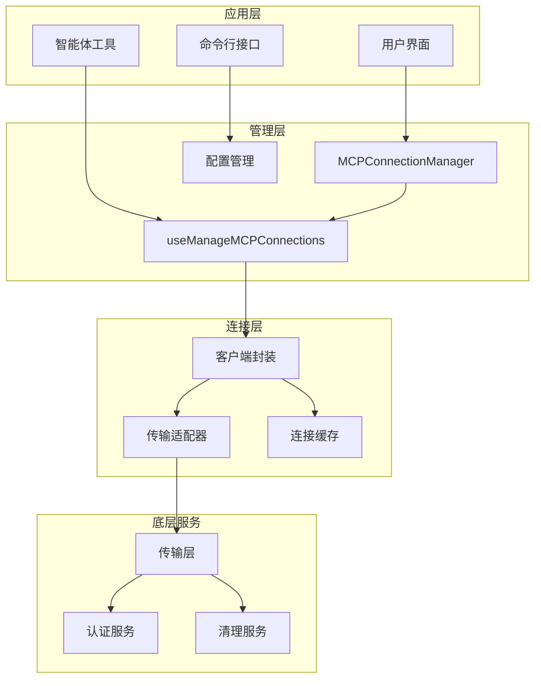
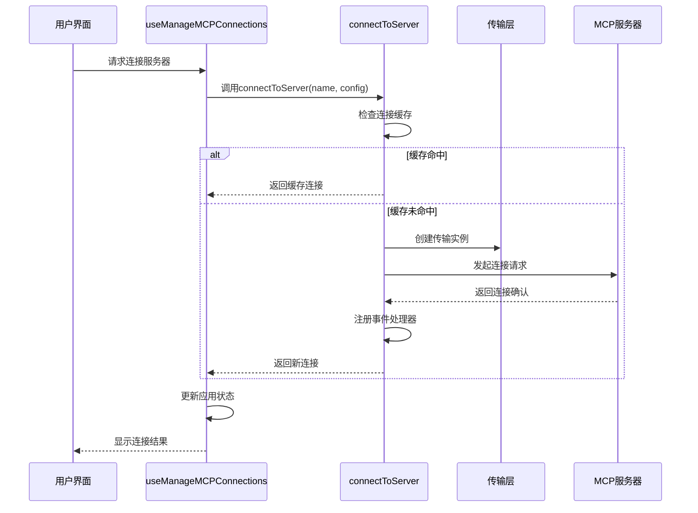
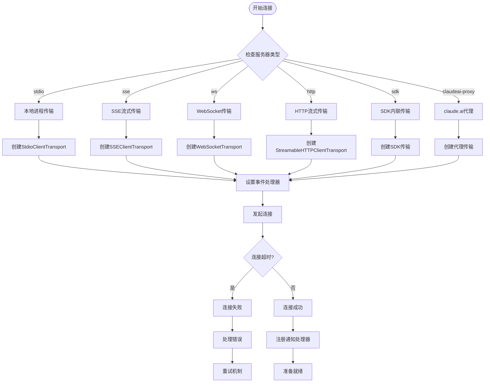
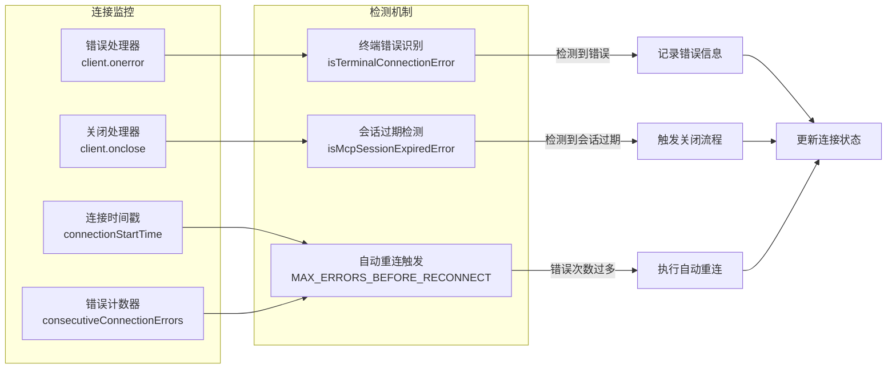
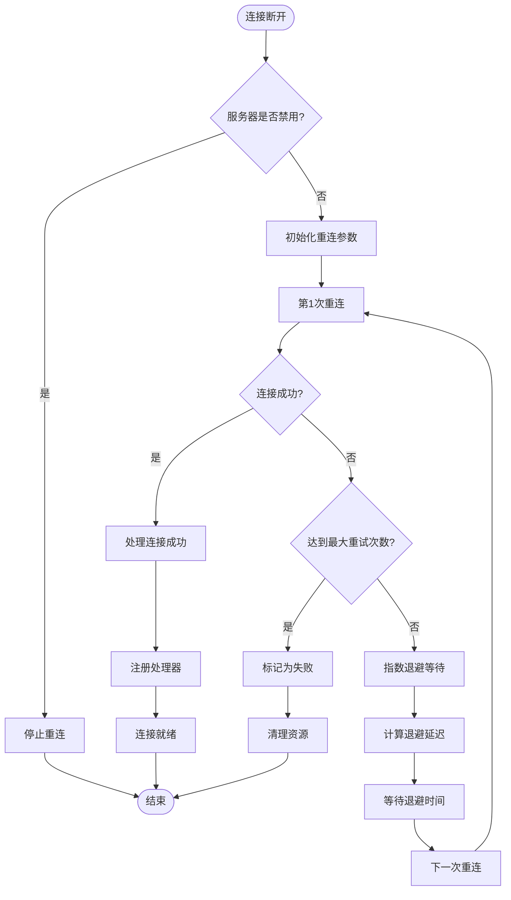
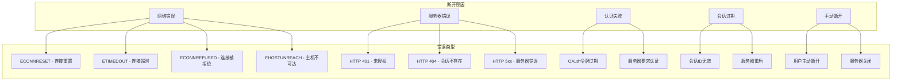
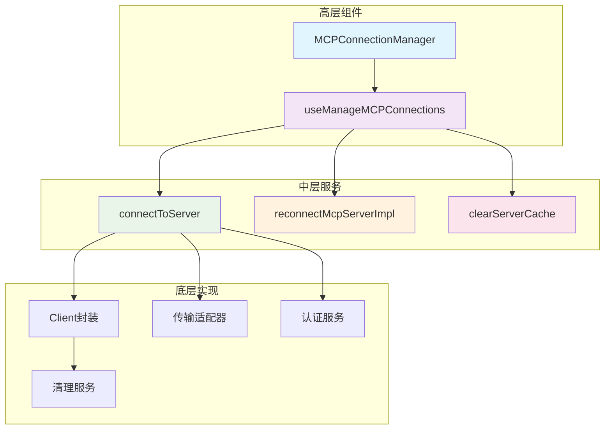

# MCP连接生命周期

<cite>
**本文档引用的文件**
- [MCPConnectionManager.tsx](file://src/services/mcp/MCPConnectionManager.tsx)
- [useManageMCPConnections.ts](file://src/services/mcp/useManageMCPConnections.ts)
- [client.ts](file://src/services/mcp/client.ts)
- [types.ts](file://src/services/mcp/types.ts)
- [print.ts](file://src/cli/print.ts)
- [runAgent.ts](file://src/tools/AgentTool/runAgent.ts)
- [ReadMcpResourceTool.ts](file://src/tools/ReadMcpResourceTool/ReadMcpResourceTool.ts)
- [ensureConnectedClient](file://src/services/mcp/client.ts)
- [MonitorMcpTask.js](file://tasks/MonitorMcpTask/MonitorMcpTask.js)
</cite>

## 目录
1. [简介](#简介)
2. [项目结构](#项目结构)
3. [核心组件](#核心组件)
4. [架构概览](#架构概览)
5. [详细组件分析](#详细组件分析)
6. [依赖关系分析](#依赖关系分析)
7. [性能考虑](#性能考虑)
8. [故障排除指南](#故障排除指南)
9. [结论](#结论)

## 简介

本文档详细阐述了MCP（Model Context Protocol）连接生命周期的技术实现，包括连接建立、维护、重连策略、断开处理等完整流程。MCP是Anthropic开发的协议，用于在AI代理和各种工具、资源之间建立标准化的通信接口。

该系统支持多种传输类型：本地进程(stdio)、SSE流式传输、WebSocket、HTTP流式传输以及SDK内联传输。每个传输类型都有特定的连接策略和错误处理机制。

## 项目结构

MCP连接生命周期相关的代码主要分布在以下模块中：

**图表来源**
- [MCPConnectionManager.tsx:1-73](file://src/services/mcp/MCPConnectionManager.tsx#L1-L73)
- [useManageMCPConnections.ts:1-1142](file://src/services/mcp/useManageMCPConnections.ts#L1-L1142)
- [client.ts:1-3349](file://src/services/mcp/client.ts#L1-L3349)

**章节来源**
- [MCPConnectionManager.tsx:1-73](file://src/services/mcp/MCPConnectionManager.tsx#L1-L73)
- [useManageMCPConnections.ts:1-1142](file://src/services/mcp/useManageMCPConnections.ts#L1-L1142)
- [client.ts:1-3349](file://src/services/mcp/client.ts#L1-L3349)

## 核心组件

### 连接状态模型

MCP系统定义了五种核心连接状态：

**图表来源**
- [types.ts:180-227](file://src/services/mcp/types.ts#L180-L227)

### 传输类型支持

系统支持以下传输类型：

| 传输类型 | 描述 | 特点 |
|---------|------|------|
| stdio | 本地进程通信 | 最快，无网络开销 |
| sse | 服务器发送事件 | 流式数据传输，自动重连 |
| ws | WebSocket | 双向实时通信 |
| http | HTTP流式传输 | 支持长连接，兼容性好 |
| sdk | SDK内联传输 | 内部使用，无外部依赖 |

**章节来源**
- [types.ts:23-26](file://src/services/mcp/types.ts#L23-L26)
- [client.ts:563-566](file://src/services/mcp/client.ts#L563-L566)

## 架构概览

MCP连接生命周期采用分层架构设计，确保高可用性和可维护性：

**图表来源**
- [MCPConnectionManager.tsx:38-72](file://src/services/mcp/MCPConnectionManager.tsx#L38-L72)
- [useManageMCPConnections.ts:143-146](file://src/services/mcp/useManageMCPConnections.ts#L143-L146)
- [client.ts:595-607](file://src/services/mcp/client.ts#L595-L607)

## 详细组件分析

### 连接建立过程

#### 1. 连接初始化阶段

连接建立过程遵循严格的初始化顺序：

**图表来源**
- [useManageMCPConnections.ts:858-903](file://src/services/mcp/useManageMCPConnections.ts#L858-L903)
- [client.ts:595-607](file://src/services/mcp/client.ts#L595-L607)

#### 2. 传输层选择逻辑

系统根据服务器配置自动选择最适合的传输方式：

**图表来源**
- [client.ts:619-961](file://src/services/mcp/client.ts#L619-L961)
- [client.ts:1048-1080](file://src/services/mcp/client.ts#L1048-L1080)

#### 3. 连接超时处理

系统实现了多层次的超时保护机制：

**章节来源**
- [client.ts:456-458](file://src/services/mcp/client.ts#L456-L458)
- [client.ts:1049-1077](file://src/services/mcp/client.ts#L1049-L1077)

### 连接维护机制

#### 1. 心跳检测和状态监控

系统通过多种机制监控连接健康状况：

**图表来源**
- [client.ts:1266-1371](file://src/services/mcp/client.ts#L1266-L1371)
- [client.ts:1313-1365](file://src/services/mcp/client.ts#L1313-L1365)

#### 2. 资源管理策略

系统采用智能的资源管理策略：

**章节来源**
- [client.ts:1383-1402](file://src/services/mcp/client.ts#L1383-L1402)
- [client.ts:1404-1580](file://src/services/mcp/client.ts#L1404-L1580)

### 重连策略实现

#### 1. 指数退避算法

系统实现了完善的重连策略：

**图表来源**
- [useManageMCPConnections.ts:371-462](file://src/services/mcp/useManageMCPConnections.ts#L371-L462)
- [useManageMCPConnections.ts:88-90](file://src/services/mcp/useManageMCPConnections.ts#L88-L90)

#### 2. 重连参数配置

重连策略的关键参数：

| 参数 | 默认值 | 说明 |
|------|--------|------|
| MAX_RECONNECT_ATTEMPTS | 5次 | 最大重试次数 |
| INITIAL_BACKOFF_MS | 1000ms | 初始退避时间 |
| MAX_BACKOFF_MS | 30000ms | 最大退避时间 |
| MCP_REQUEST_TIMEOUT_MS | 60000ms | 单请求超时时间 |
| getConnectionTimeoutMs() | 30000ms | 连接总超时时间 |

**章节来源**
- [useManageMCPConnections.ts:88-90](file://src/services/mcp/useManageMCPConnections.ts#L88-L90)
- [client.ts:463-458](file://src/services/mcp/client.ts#L463-L458)

### 连接断开处理

#### 1. 断开原因分类

系统能够识别并处理多种断开原因：

**图表来源**
- [client.ts:1249-1263](file://src/services/mcp/client.ts#L1249-L1263)
- [client.ts:1313-1329](file://src/services/mcp/client.ts#L1313-L1329)

#### 2. 清理流程

断开后的资源清理遵循严格的顺序：

**章节来源**
- [client.ts:1374-1402](file://src/services/mcp/client.ts#L1374-L1402)
- [client.ts:1404-1580](file://src/services/mcp/client.ts#L1404-L1580)

## 依赖关系分析

### 组件耦合度分析

**图表来源**
- [MCPConnectionManager.tsx:38-72](file://src/services/mcp/MCPConnectionManager.tsx#L38-L72)
- [useManageMCPConnections.ts:1-1142](file://src/services/mcp/useManageMCPConnections.ts#L1-L1142)
- [client.ts:1-3349](file://src/services/mcp/client.ts#L1-L3349)

### 外部依赖集成

系统集成了多个外部服务和工具：

| 依赖项 | 用途 | 版本/配置 |
|--------|------|-----------|
| @modelcontextprotocol/sdk | MCP协议实现 | 标准SDK |
| ws | WebSocket支持 | Node.js原生支持 |
| fetch | HTTP请求 | 全局fetch实现 |
| lodash-es | 工具函数库 | ES模块版本 |
| zod | 类型验证 | Schema定义 |

**章节来源**
- [client.ts:1-129](file://src/services/mcp/client.ts#L1-L129)

## 性能考虑

### 连接缓存优化

系统实现了多级缓存机制以提升性能：

1. **连接缓存**：基于服务器名称和配置生成唯一键
2. **工具缓存**：缓存服务器提供的工具列表
3. **资源缓存**：缓存服务器资源信息
4. **认证缓存**：缓存认证状态避免重复认证

### 批量处理优化

系统采用批量更新机制减少状态更新开销：

- **批量刷新间隔**：16ms窗口内的所有更新合并
- **条件更新**：仅在状态实际变化时更新
- **去重处理**：避免重复的UI更新

### 内存管理

- **定时器清理**：组件卸载时自动清理所有定时器
- **事件监听器移除**：防止内存泄漏
- **进程信号处理**：优雅处理子进程生命周期

## 故障排除指南

### 常见问题诊断

#### 1. 连接超时问题

**症状**：连接在设定时间内无法建立
**可能原因**：
- 网络连接问题
- 服务器响应慢
- 配置错误

**解决步骤**：
1. 检查服务器可达性
2. 验证配置参数
3. 查看详细日志

#### 2. 认证失败问题

**症状**：连接后立即断开或返回401错误
**可能原因**：
- OAuth令牌过期
- 服务器需要用户交互认证
- 凭据配置错误

**解决步骤**：
1. 检查OAuth配置
2. 重新登录认证
3. 验证服务器支持的认证方式

#### 3. 重连循环问题

**症状**：系统不断尝试重连但始终失败
**可能原因**：
- 服务器持续不可用
- 配置参数错误
- 网络环境问题

**解决步骤**：
1. 检查服务器状态
2. 验证网络连接
3. 调整重连参数

### 调试工具和方法

系统提供了丰富的调试功能：

- **详细日志记录**：所有连接事件都有详细日志
- **性能指标**：记录连接耗时和成功率
- **状态监控**：实时显示连接状态变化
- **错误追踪**：完整的错误堆栈信息

**章节来源**
- [client.ts:1050-1077](file://src/services/mcp/client.ts#L1050-L1077)
- [useManageMCPConnections.ts:428-444](file://src/services/mcp/useManageMCPConnections.ts#L428-L444)

## 结论

MCP连接生命周期管理系统展现了现代异步应用的优秀实践，具有以下特点：

### 技术优势

1. **健壮性**：完善的错误处理和重连机制
2. **可扩展性**：支持多种传输类型和认证方式
3. **可观测性**：全面的日志记录和状态监控
4. **性能优化**：智能缓存和批量处理机制

### 设计亮点

1. **分层架构**：清晰的职责分离和依赖管理
2. **异步处理**：基于Promise和async/await的现代化编程
3. **资源管理**：自动化的内存和进程管理
4. **用户体验**：平滑的状态转换和反馈机制

### 改进建议

1. **监控增强**：添加更详细的性能指标收集
2. **配置热更新**：支持运行时配置修改
3. **连接池管理**：对频繁切换的服务器实施连接池
4. **故障预测**：基于历史数据预测潜在故障

该系统为MCP协议的实现提供了坚实的基础，能够满足生产环境的各种需求，同时保持了良好的可维护性和扩展性。