# MCP连接管理

<cite>
**本文档引用的文件**
- [MCPConnectionManager.tsx](file://src/services/mcp/MCPConnectionManager.tsx)
- [useManageMCPConnections.ts](file://src/services/mcp/useManageMCPConnections.ts)
- [InProcessTransport.ts](file://src/services/mcp/InProcessTransport.ts)
- [SdkControlTransport.ts](file://src/services/mcp/SdkControlTransport.ts)
- [types.ts](file://src/services/mcp/types.ts)
- [client.ts](file://src/services/mcp/client.ts)
- [MCPListPanel.tsx](file://src/components/mcp/MCPListPanel.tsx)
- [MCPReconnect.tsx](file://src/components/mcp/MCPReconnect.tsx)
</cite>

## 目录
1. [简介](#简介)
2. [项目结构](#项目结构)
3. [核心组件](#核心组件)
4. [架构概览](#架构概览)
5. [详细组件分析](#详细组件分析)
6. [依赖关系分析](#依赖关系分析)
7. [性能考虑](#性能考虑)
8. [故障排查指南](#故障排查指南)
9. [结论](#结论)

## 简介

MCP（Model Context Protocol）连接管理是Claude Code中用于管理MCP服务器连接的核心系统。该系统负责MCP服务器的发现、连接建立、状态监控、自动重连以及资源管理等功能。本文档深入解析MCPConnectionManager.tsx的核心功能，包括MCP服务器发现、连接建立、状态监控等机制。

## 项目结构

MCP连接管理系统主要位于`src/services/mcp/`目录下，包含以下关键文件：

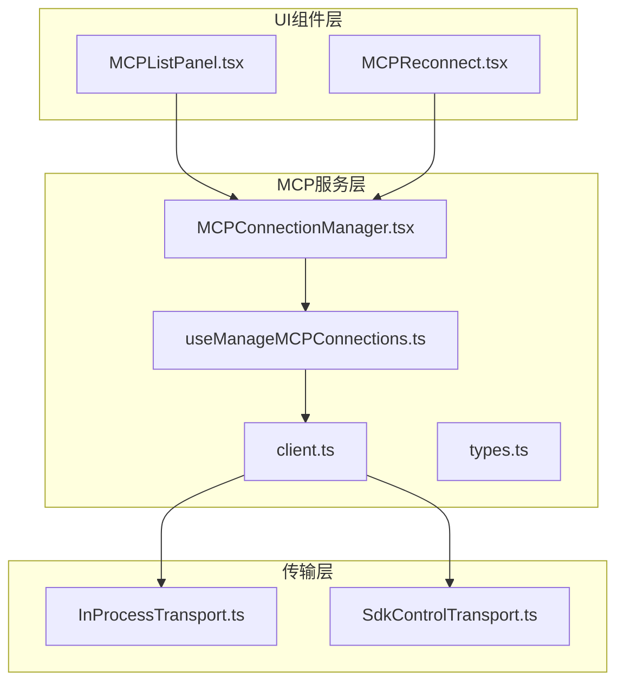

**图表来源**
- [MCPConnectionManager.tsx:1-73](file://src/services/mcp/MCPConnectionManager.tsx#L1-73)
- [useManageMCPConnections.ts:1-1142](file://src/services/mcp/useManageMCPConnections.ts#L1-1142)
- [client.ts:1-3349](file://src/services/mcp/client.ts#L1-3349)

**章节来源**
- [MCPConnectionManager.tsx:1-73](file://src/services/mcp/MCPConnectionManager.tsx#L1-73)
- [useManageMCPConnections.ts:1-1142](file://src/services/mcp/useManageMCPConnections.ts#L1-1142)

## 核心组件

### MCPConnectionManager

MCPConnectionManager是整个MCP连接管理系统的入口点，它通过React Context提供连接管理功能给整个应用。

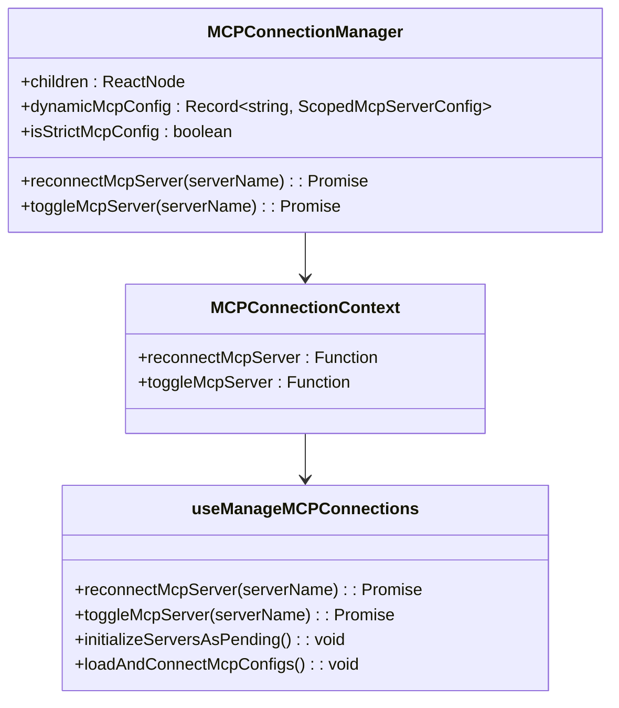

**图表来源**
- [MCPConnectionManager.tsx:7-30](file://src/services/mcp/MCPConnectionManager.tsx#L7-30)
- [useManageMCPConnections.ts:1043-1128](file://src/services/mcp/useManageMCPConnections.ts#L1043-1128)

### 连接状态管理

系统支持多种连接状态：
- **connected**: 连接成功
- **pending**: 连接中
- **failed**: 连接失败
- **disabled**: 已禁用
- **needs-auth**: 需要认证

**章节来源**
- [types.ts:180-227](file://src/services/mcp/types.ts#L180-227)

## 架构概览

MCP连接管理系统采用分层架构设计，从上到下分为UI层、业务逻辑层、传输层和底层客户端。

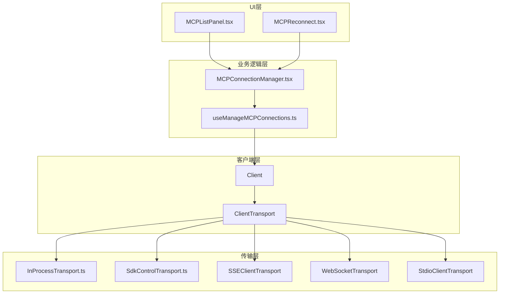

**图表来源**
- [MCPConnectionManager.tsx:38-72](file://src/services/mcp/MCPConnectionManager.tsx#L38-72)
- [client.ts:1-800](file://src/services/mcp/client.ts#L1-800)

## 详细组件分析

### 连接生命周期管理

连接生命周期管理是MCP系统的核心功能，包括连接建立、维护、重连、断开等过程。

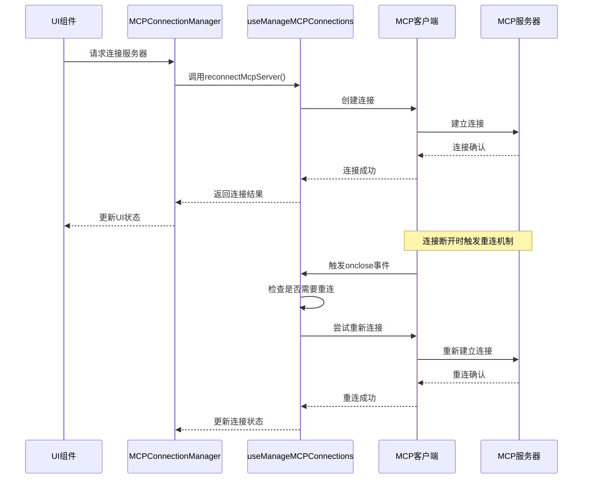

**图表来源**
- [useManageMCPConnections.ts:333-468](file://src/services/mcp/useManageMCPConnections.ts#L333-468)
- [client.ts:595-607](file://src/services/mcp/client.ts#L595-607)

### 自动重连机制

系统实现了智能的自动重连机制，支持指数退避算法：

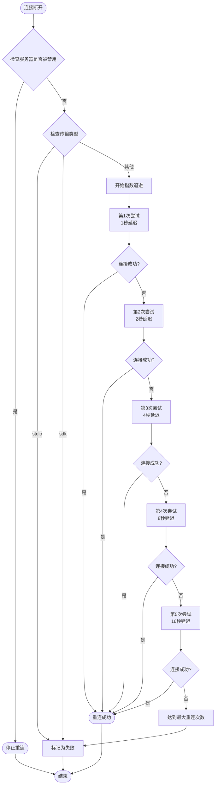

**图表来源**
- [useManageMCPConnections.ts:370-462](file://src/services/mcp/useManageMCPConnections.ts#L370-462)

**章节来源**
- [useManageMCPConnections.ts:87-91](file://src/services/mcp/useManageMCPConnections.ts#L87-91)
- [useManageMCPConnections.ts:370-462](file://src/services/mcp/useManageMCPConnections.ts#L370-462)

### 传输方式实现

系统支持多种传输方式，每种都有其特定的使用场景：

#### InProcessTransport（进程内传输）

进程内传输用于在同一进程中运行MCP服务器和客户端，避免进程间通信开销。

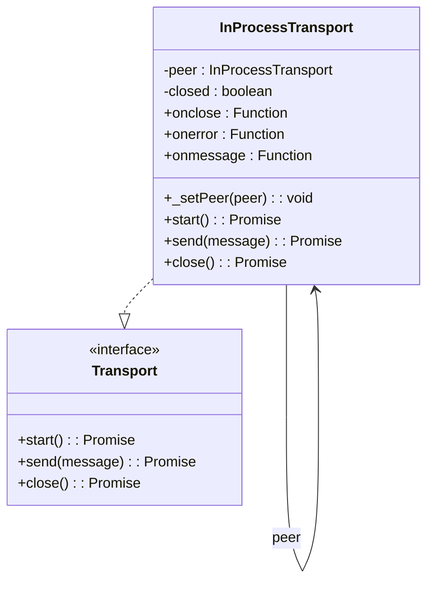

**图表来源**
- [InProcessTransport.ts:11-49](file://src/services/mcp/InProcessTransport.ts#L11-49)

#### SdkControlTransport（SDK控制传输）

SDK控制传输桥接CLI进程和SDK进程之间的通信，支持SDK MCP服务器的控制消息传递。

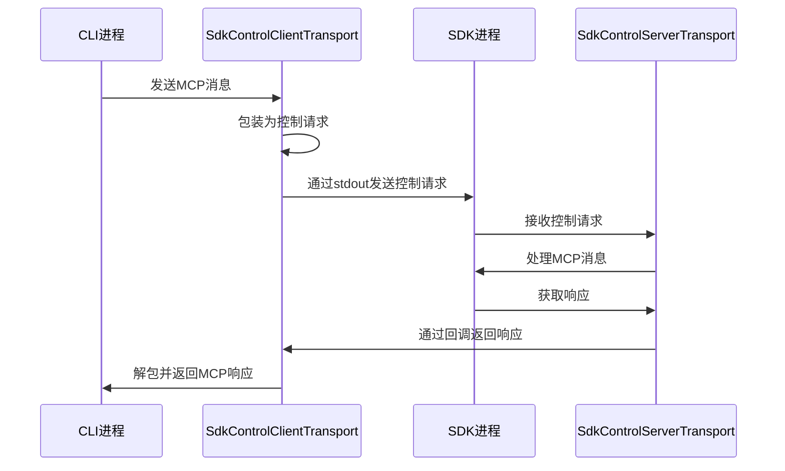

**图表来源**
- [SdkControlTransport.ts:60-95](file://src/services/mcp/SdkControlTransport.ts#L60-95)
- [SdkControlTransport.ts:109-136](file://src/services/mcp/SdkControlTransport.ts#L109-136)

**章节来源**
- [InProcessTransport.ts:1-64](file://src/services/mcp/InProcessTransport.ts#L1-64)
- [SdkControlTransport.ts:1-137](file://src/services/mcp/SdkControlTransport.ts#L1-137)

### 连接池管理

系统实现了连接池管理机制，支持并发控制和资源优化：

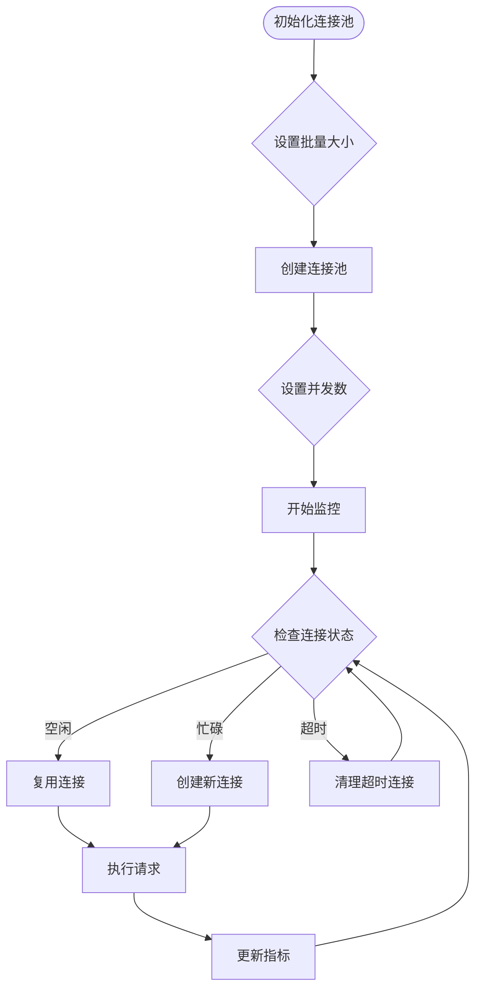

**图表来源**
- [client.ts:552-561](file://src/services/mcp/client.ts#L552-561)

**章节来源**
- [client.ts:552-561](file://src/services/mcp/client.ts#L552-561)

### 服务器配置管理

系统支持多种服务器配置类型，每种都有特定的配置参数：

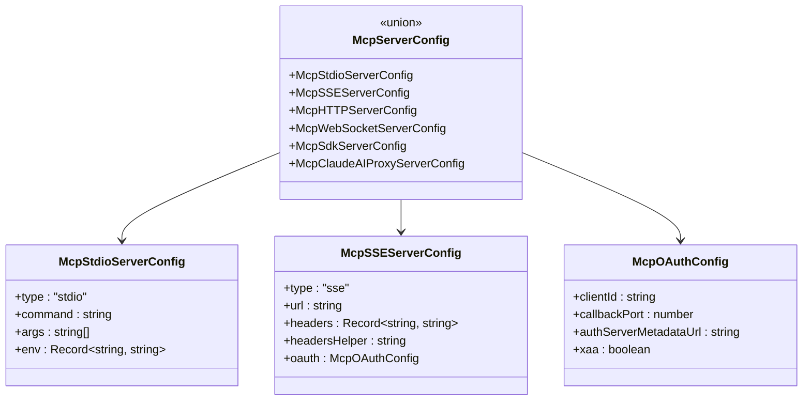

**图表来源**
- [types.ts:124-135](file://src/services/mcp/types.ts#L124-135)
- [types.ts:28-35](file://src/services/mcp/types.ts#L28-35)
- [types.ts:58-66](file://src/services/mcp/types.ts#L58-66)

**章节来源**
- [types.ts:23-26](file://src/services/mcp/types.ts#L23-26)
- [types.ts:124-135](file://src/services/mcp/types.ts#L124-135)

## 依赖关系分析

MCP连接管理系统具有清晰的依赖层次结构：

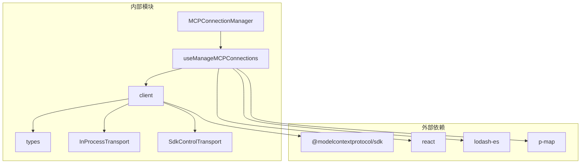

**图表来源**
- [client.ts:1-53](file://src/services/mcp/client.ts#L1-53)
- [useManageMCPConnections.ts:1-65](file://src/services/mcp/useManageMCPConnections.ts#L1-65)

**章节来源**
- [client.ts:1-53](file://src/services/mcp/client.ts#L1-53)
- [useManageMCPConnections.ts:1-65](file://src/services/mcp/useManageMCPConnections.ts#L1-65)

## 性能考虑

### 并发控制策略

系统采用了多层并发控制策略来优化性能：

1. **批量连接**: 使用`getMcpServerConnectionBatchSize()`控制连接批次大小
2. **远程服务器并发**: 使用`getRemoteMcpServerConnectionBatchSize()`控制远程服务器连接并发数
3. **工具调用并发**: 使用`processBatched`函数进行批处理优化

### 内存管理

- **连接缓存**: 使用`memoize`函数缓存连接，避免重复创建
- **定时器管理**: 使用`reconnectTimersRef`管理重连定时器，防止内存泄漏
- **状态更新批处理**: 使用`pendingUpdatesRef`和`flushTimerRef`批处理状态更新

### 网络优化

- **指数退避**: 实现指数退避算法减少网络压力
- **连接复用**: 支持连接复用减少建立连接的开销
- **超时控制**: 为不同类型的请求设置合适的超时时间

## 故障排查指南

### 常见问题诊断

#### 连接失败排查

1. **检查服务器配置**: 验证MCP服务器配置的正确性
2. **网络连接测试**: 确认网络连接正常
3. **认证信息验证**: 检查OAuth令牌有效性
4. **日志分析**: 查看详细的错误日志

#### 重连失败排查

1. **检查重连配置**: 验证重连参数设置
2. **监控重连状态**: 使用UI组件监控重连进度
3. **检查服务器状态**: 确认MCP服务器正常运行
4. **查看重连日志**: 分析重连过程中的错误信息

### 性能监控方法

#### 连接状态监控

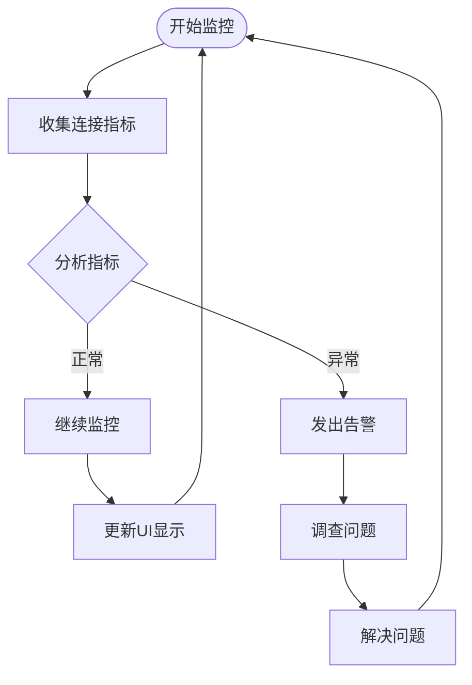

**图表来源**
- [MCPListPanel.tsx:300-338](file://src/components/mcp/MCPListPanel.tsx#L300-338)

#### 错误处理机制

系统提供了完善的错误处理机制：

1. **认证错误处理**: 自动检测和处理认证失败
2. **连接错误处理**: 智能重连和错误恢复
3. **超时错误处理**: 合理的超时管理和重试机制
4. **资源清理**: 自动清理失效的连接和资源

**章节来源**
- [MCPListPanel.tsx:300-338](file://src/components/mcp/MCPListPanel.tsx#L300-338)
- [MCPReconnect.tsx:15-167](file://src/components/mcp/MCPReconnect.tsx#L15-167)

## 结论

MCP连接管理系统是一个功能完整、架构清晰的连接管理解决方案。它通过分层设计实现了良好的可维护性和扩展性，通过智能的重连机制和并发控制策略确保了系统的稳定性和性能。

系统的主要优势包括：

1. **模块化设计**: 清晰的分层架构便于维护和扩展
2. **智能重连**: 指数退避算法和多种重连策略
3. **性能优化**: 连接池管理、批处理和缓存机制
4. **全面监控**: 完善的状态监控和错误处理机制
5. **安全考虑**: 认证管理和安全的传输机制

该系统为Claude Code提供了可靠的MCP服务器连接能力，支持多种传输方式和服务器配置，能够满足不同场景下的连接需求。