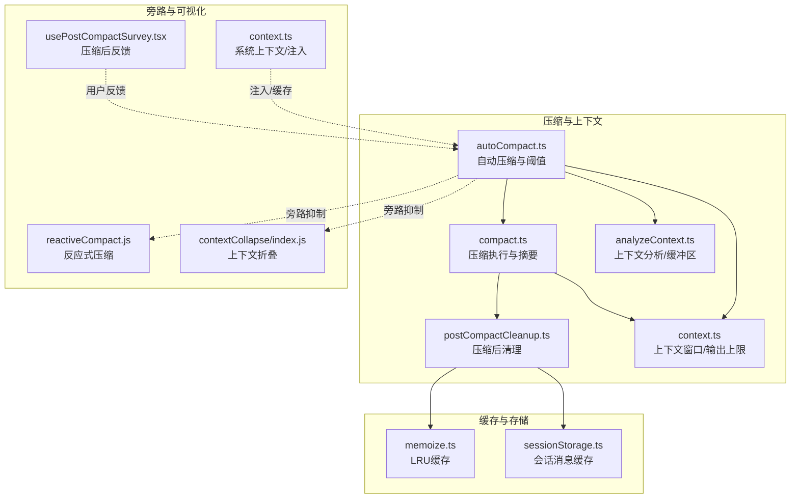
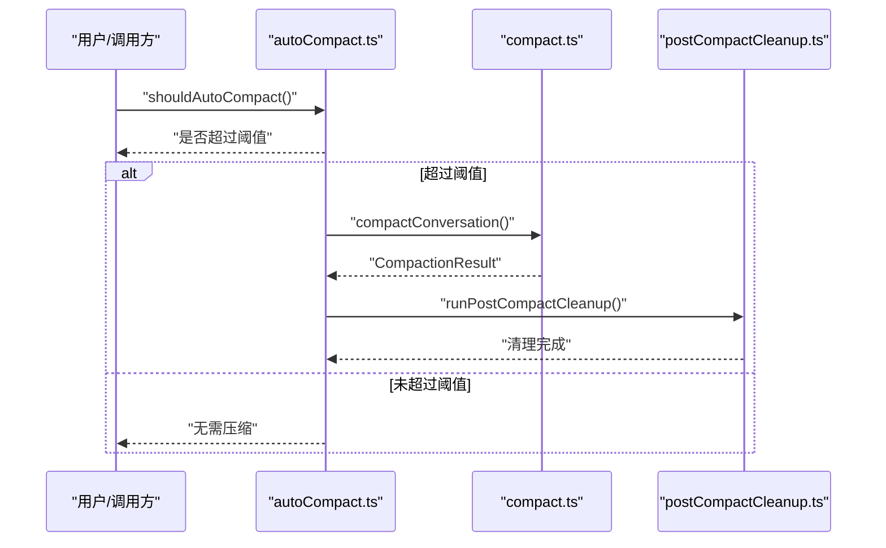
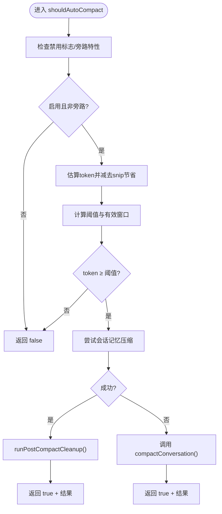
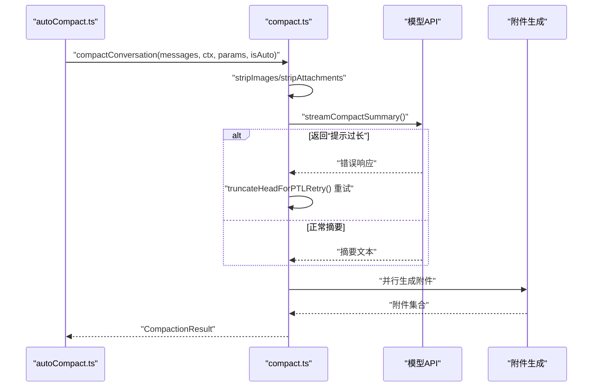
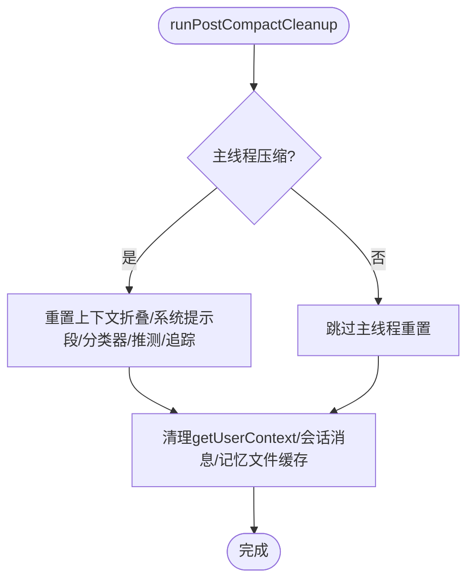
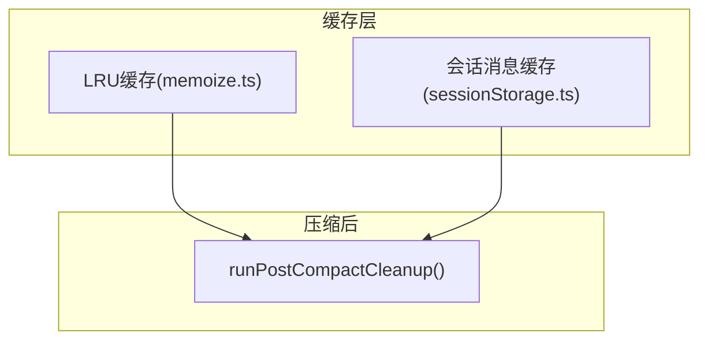
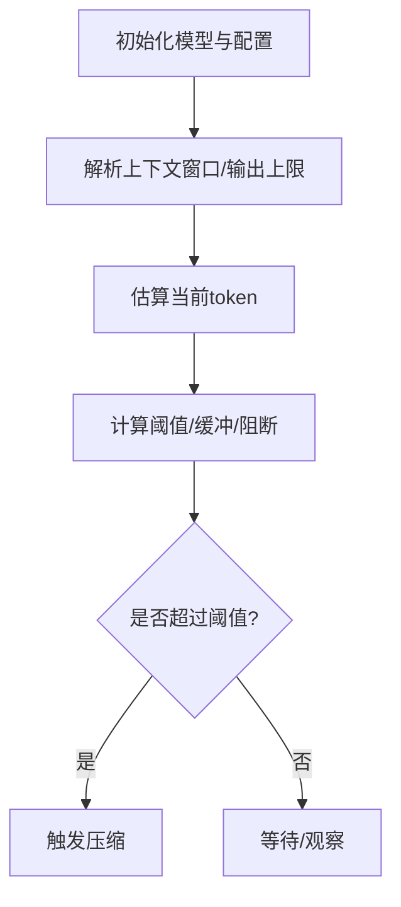
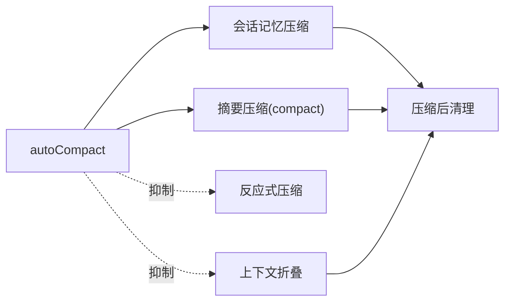
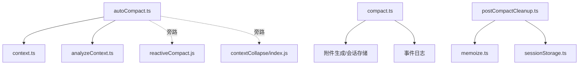

# 上下文管理系统

<cite>
**本文引用的文件**
- [README.md](file://README.md)
- [autoCompact.ts](file://src/services/compact/autoCompact.ts)
- [compact.ts](file://src/services/compact/compact.ts)
- [postCompactCleanup.ts](file://src/services/compact/postCompactCleanup.ts)
- [context.ts](file://src/utils/context.ts)
- [memoize.ts](file://src/utils/memoize.ts)
- [sessionStorage.ts](file://src/utils/sessionStorage.ts)
- [usePostCompactSurvey.tsx](file://src/components/FeedbackSurvey/usePostCompactSurvey.tsx)
- [context.ts（系统上下文）](file://src/context.ts)
- [analyzeContext.ts](file://src/utils/analyzeContext.ts)
- [reactiveCompact.js](file://src/services/compact/reactiveCompact.js)
- [index.js（上下文折叠）](file://src/services/contextCollapse/index.js)
</cite>

## 目录
1. [简介](#简介)
2. [项目结构](#项目结构)
3. [核心组件](#核心组件)
4. [架构总览](#架构总览)
5. [详细组件分析](#详细组件分析)
6. [依赖关系分析](#依赖关系分析)
7. [性能考量](#性能考量)
8. [故障排除指南](#故障排除指南)
9. [结论](#结论)
10. [附录](#附录)

## 简介
本文件面向Claude Code的上下文管理系统，围绕“上下文压缩”展开，系统性说明三种压缩策略：autoCompact自动压缩、snipCompact历史修剪、contextCollapse上下文重构；解释对话历史优化机制（compact_boundary标记、旧消息摘要、最近消息保真）；梳理内存管理策略（消息分组、缓存优化、垃圾回收）；并给出上下文窗口预算管理（token计数、阈值触发、动态调整）与最佳实践（压缩时机选择、性能监控、资源使用优化），以及调试与故障排除方法。

## 项目结构
与上下文管理直接相关的关键模块分布如下：
- 自动压缩与阈值控制：src/services/compact/autoCompact.ts
- 压缩执行与摘要生成：src/services/compact/compact.ts
- 压缩后清理与缓存重置：src/services/compact/postCompactCleanup.ts
- 模型上下文窗口与输出上限：src/utils/context.ts
- 缓存与LRU策略：src/utils/memoize.ts
- 会话存储与消息缓存：src/utils/sessionStorage.ts
- 上下文可视化与系统提示注入：src/context.ts
- 上下文分析与保留缓冲区：src/utils/analyzeContext.ts
- 反应式压缩（旁路）：src/services/compact/reactiveCompact.js
- 上下文折叠（旁路）：src/services/contextCollapse/index.js
- 压缩后反馈调查：src/components/FeedbackSurvey/usePostCompactSurvey.tsx

**图表来源**
- [autoCompact.ts:147-239](file://src/services/compact/autoCompact.ts#L147-L239)
- [compact.ts:387-763](file://src/services/compact/compact.ts#L387-L763)
- [postCompactCleanup.ts:31-77](file://src/services/compact/postCompactCleanup.ts#L31-L77)
- [context.ts:51-98](file://src/utils/context.ts#L51-L98)
- [analyzeContext.ts:1105-1132](file://src/utils/analyzeContext.ts#L1105-L1132)
- [memoize.ts:234-269](file://src/utils/memoize.ts#L234-L269)
- [sessionStorage.ts:3838-3867](file://src/utils/sessionStorage.ts#L3838-L3867)
- [reactiveCompact.js](file://src/services/compact/reactiveCompact.js)
- [index.js（上下文折叠）](file://src/services/contextCollapse/index.js)
- [context.ts（系统上下文）:116-190](file://src/context.ts#L116-L190)
- [usePostCompactSurvey.tsx:169-205](file://src/components/FeedbackSurvey/usePostCompactSurvey.tsx#L169-L205)

**章节来源**
- [README.md:650-689](file://README.md#L650-L689)
- [autoCompact.ts:147-239](file://src/services/compact/autoCompact.ts#L147-L239)
- [compact.ts:387-763](file://src/services/compact/compact.ts#L387-L763)
- [postCompactCleanup.ts:31-77](file://src/services/compact/postCompactCleanup.ts#L31-L77)
- [context.ts:51-98](file://src/utils/context.ts#L51-L98)
- [analyzeContext.ts:1105-1132](file://src/utils/analyzeContext.ts#L1105-L1132)
- [memoize.ts:234-269](file://src/utils/memoize.ts#L234-L269)
- [sessionStorage.ts:3838-3867](file://src/utils/sessionStorage.ts#L3838-L3867)
- [reactiveCompact.js](file://src/services/compact/reactiveCompact.js)
- [index.js（上下文折叠）](file://src/services/contextCollapse/index.js)
- [context.ts（系统上下文）:116-190](file://src/context.ts#L116-L190)
- [usePostCompactSurvey.tsx:169-205](file://src/components/FeedbackSurvey/usePostCompactSurvey.tsx#L169-L205)

## 核心组件
- 自动压缩（autoCompact）
  - 计算有效上下文窗口与阈值，判断是否触发压缩；在旁路模式（反应式/折叠）下进行抑制；失败次数熔断；优先尝试会话记忆压缩，否则调用摘要压缩。
- 压缩执行（compact）
  - 构建压缩提示，流式生成摘要；处理“提示过长”重试；清理缓存并生成后续附件；记录事件指标；构建边界标记与摘要消息；返回压缩结果。
- 压缩后清理（postCompactCleanup）
  - 清理微压缩状态、上下文折叠状态、系统提示段、分类器审批、推测检查、Beta追踪、会话消息缓存等；区分主线程与子线程清理。
- 上下文窗口与输出上限（context）
  - 解析模型上下文窗口、最大输出令牌、思考预算等；支持环境变量覆盖与1M上下文检测。
- 缓存与LRU（memoize）
  - 提供LRU缓存函数，限制缓存大小，避免无界增长；用于消息处理等高频场景。
- 会话存储与消息缓存（sessionStorage）
  - 会话消息UUID缓存与清理；清理后确保后续查询一致性。
- 旁路机制
  - 反应式压缩（reactiveCompact.js）与上下文折叠（contextCollapse/index.js）在特定条件下抑制自动压缩，避免竞争或冗余。

**章节来源**
- [autoCompact.ts:32-91](file://src/services/compact/autoCompact.ts#L32-L91)
- [compact.ts:387-763](file://src/services/compact/compact.ts#L387-L763)
- [postCompactCleanup.ts:31-77](file://src/services/compact/postCompactCleanup.ts#L31-L77)
- [context.ts:51-98](file://src/utils/context.ts#L51-L98)
- [memoize.ts:234-269](file://src/utils/memoize.ts#L234-L269)
- [sessionStorage.ts:3838-3867](file://src/utils/sessionStorage.ts#L3838-L3867)
- [reactiveCompact.js](file://src/services/compact/reactiveCompact.js)
- [index.js（上下文折叠）](file://src/services/contextCollapse/index.js)

## 架构总览
自动压缩与压缩执行协同工作，结合旁路机制与清理流程，形成完整的上下文管理闭环。自动压缩负责“何时压缩”，压缩执行负责“如何压缩”，清理负责“释放资源”。

**图表来源**
- [autoCompact.ts:160-239](file://src/services/compact/autoCompact.ts#L160-L239)
- [compact.ts:387-763](file://src/services/compact/compact.ts#L387-L763)
- [postCompactCleanup.ts:31-77](file://src/services/compact/postCompactCleanup.ts#L31-L77)

## 详细组件分析

### 自动压缩（autoCompact）
- 阈值计算与保留缓冲
  - 有效上下文窗口 = 模型上下文窗口 - 最大输出令牌上限（摘要）；自动压缩阈值 = 有效窗口 - 固定缓冲（13k）；支持环境变量百分比覆盖与阻断阈值覆盖。
- 触发条件与旁路抑制
  - 在“反应式压缩”“上下文折叠”开启时抑制自动压缩，避免竞争；对会话记忆/压缩代理查询源进行递归保护；对marble_origami查询源进行抑制。
- 失败熔断
  - 连续失败达到阈值（默认3次）后停止尝试，避免无效API消耗。
- 压缩路径选择
  - 优先尝试会话记忆压缩；失败则调用传统摘要压缩；成功后执行压缩后清理与提示缓存断点通知。

**图表来源**
- [autoCompact.ts:160-239](file://src/services/compact/autoCompact.ts#L160-L239)
- [autoCompact.ts:241-351](file://src/services/compact/autoCompact.ts#L241-L351)
- [postCompactCleanup.ts:31-77](file://src/services/compact/postCompactCleanup.ts#L31-L77)

**章节来源**
- [autoCompact.ts:62-91](file://src/services/compact/autoCompact.ts#L62-L91)
- [autoCompact.ts:93-145](file://src/services/compact/autoCompact.ts#L93-L145)
- [autoCompact.ts:147-239](file://src/services/compact/autoCompact.ts#L147-L239)
- [autoCompact.ts:241-351](file://src/services/compact/autoCompact.ts#L241-L351)

### 压缩执行（compact）
- 输入预处理
  - 图像/文档剥离以减少摘要负担；去除将重新注入的附件类型（如技能发现/列表）。
- 流式摘要生成
  - 构建压缩提示，流式请求模型；若出现“提示过长”，按误差缺口或固定比例丢弃最早API轮次组进行重试。
- 后处理与附件
  - 清理文件状态缓存；并行生成文件/异步代理/计划/技能/工具指令等附件；记录事件指标与真实后置token估算。
- 边界标记与结果
  - 创建边界消息（含自动/手动标识、前/后置token统计、发现工具列表等）；返回摘要消息、附件、钩子结果与显示消息。

**图表来源**
- [compact.ts:145-200](file://src/services/compact/compact.ts#L145-L200)
- [compact.ts:211-223](file://src/services/compact/compact.ts#L211-L223)
- [compact.ts:243-291](file://src/services/compact/compact.ts#L243-L291)
- [compact.ts:387-763](file://src/services/compact/compact.ts#L387-L763)

**章节来源**
- [compact.ts:145-200](file://src/services/compact/compact.ts#L145-L200)
- [compact.ts:211-223](file://src/services/compact/compact.ts#L211-L223)
- [compact.ts:243-291](file://src/services/compact/compact.ts#L243-L291)
- [compact.ts:387-763](file://src/services/compact/compact.ts#L387-L763)

### 压缩后清理（postCompactCleanup）
- 状态重置
  - 微压缩状态、上下文折叠状态（仅主线程）、系统提示段、分类器审批、推测检查、Beta追踪。
- 缓存清理
  - 用户上下文缓存、会话消息缓存、记忆文件缓存（按场景重置）。
- 子线程隔离
  - 通过查询源判断是否为主线程压缩，避免污染主进程模块级状态。

**图表来源**
- [postCompactCleanup.ts:31-77](file://src/services/compact/postCompactCleanup.ts#L31-L77)

**章节来源**
- [postCompactCleanup.ts:31-77](file://src/services/compact/postCompactCleanup.ts#L31-L77)

### 对话历史优化机制
- compact_boundary标记
  - 在摘要与近期消息之间插入系统边界消息，携带压缩触发来源、前后token统计、发现工具列表等元数据，便于后续链路修复与可视化。
- 旧消息摘要
  - 通过摘要API生成旧消息总结，替换早期历史，降低整体token占用。
- 最近消息保真
  - 边界之后保留最新若干轮对话（用户→助手→工具使用→工具结果），保证上下文连贯性与可解释性。

**图表来源**
- [compact.ts:598-624](file://src/services/compact/compact.ts#L598-L624)
- [compact.ts:329-338](file://src/services/compact/compact.ts#L329-L338)

**章节来源**
- [compact.ts:329-338](file://src/services/compact/compact.ts#L329-L338)
- [compact.ts:598-624](file://src/services/compact/compact.ts#L598-L624)

### 内存管理策略
- 消息分组
  - 按API轮次分组，便于丢弃最早组以缓解“提示过长”问题。
- 缓存优化
  - 使用LRU缓存限制无界增长；会话消息UUID缓存提供快速存在性检查，并在压缩后显式清理。
- 垃圾回收
  - 压缩后清理统一释放不再需要的状态与缓存，避免残留引用导致泄漏。

**图表来源**
- [memoize.ts:234-269](file://src/utils/memoize.ts#L234-L269)
- [sessionStorage.ts:3838-3867](file://src/utils/sessionStorage.ts#L3838-L3867)
- [postCompactCleanup.ts:31-77](file://src/services/compact/postCompactCleanup.ts#L31-L77)

**章节来源**
- [memoize.ts:234-269](file://src/utils/memoize.ts#L234-L269)
- [sessionStorage.ts:3838-3867](file://src/utils/sessionStorage.ts#L3838-L3867)
- [postCompactCleanup.ts:31-77](file://src/services/compact/postCompactCleanup.ts#L31-L77)

### 上下文窗口预算管理
- token计数
  - 估算当前消息总token；自动压缩时考虑snip节省量；压缩后对结果进行粗略token估算。
- 阈值触发
  - 自动压缩阈值 = 有效窗口 - 固定缓冲；阻断阈值可由环境变量覆盖；警告阈值与错误阈值分别预留缓冲。
- 动态调整
  - 支持按模型能力与环境变量动态调整上下文窗口与最大输出令牌；1M上下文检测与禁用策略。

**图表来源**
- [context.ts:51-98](file://src/utils/context.ts#L51-L98)
- [context.ts:118-144](file://src/utils/context.ts#L118-L144)
- [autoCompact.ts:72-91](file://src/services/compact/autoCompact.ts#L72-L91)
- [autoCompact.ts:93-145](file://src/services/compact/autoCompact.ts#L93-L145)

**章节来源**
- [context.ts:51-98](file://src/utils/context.ts#L51-L98)
- [context.ts:118-144](file://src/utils/context.ts#L118-L144)
- [autoCompact.ts:72-91](file://src/services/compact/autoCompact.ts#L72-L91)
- [autoCompact.ts:93-145](file://src/services/compact/autoCompact.ts#L93-L145)

### 三种压缩策略
- autoCompact自动压缩
  - 主动探测token占用，超过阈值即触发；优先会话记忆压缩，失败回退到摘要压缩；失败熔断；旁路抑制。
- snipCompact历史修剪
  - 移除僵尸消息与陈旧标记，释放token；在历史修剪特性开启时生效；与自动压缩配合，先修剪再评估是否需要摘要压缩。
- contextCollapse上下文重构
  - 将压缩视为上下文管理的核心机制；当该模式开启时抑制自动压缩，避免竞争；通过提交/阻断阈值管理头空间。

**图表来源**
- [autoCompact.ts:147-239](file://src/services/compact/autoCompact.ts#L147-L239)
- [compact.ts:387-763](file://src/services/compact/compact.ts#L387-L763)
- [postCompactCleanup.ts:31-77](file://src/services/compact/postCompactCleanup.ts#L31-L77)
- [reactiveCompact.js](file://src/services/compact/reactiveCompact.js)
- [index.js（上下文折叠）](file://src/services/contextCollapse/index.js)

**章节来源**
- [README.md:673-679](file://README.md#L673-L679)
- [autoCompact.ts:147-239](file://src/services/compact/autoCompact.ts#L147-L239)
- [compact.ts:387-763](file://src/services/compact/compact.ts#L387-L763)
- [postCompactCleanup.ts:31-77](file://src/services/compact/postCompactCleanup.ts#L31-L77)
- [reactiveCompact.js](file://src/services/compact/reactiveCompact.js)
- [index.js（上下文折叠）](file://src/services/contextCollapse/index.js)

## 依赖关系分析
- 自动压缩依赖
  - 上下文窗口与输出上限（context.ts）、token估算（compact.ts中的估算函数）、旁路特性（reactiveCompact.js、contextCollapse/index.js）。
- 压缩执行依赖
  - 附件生成、流式API调用、事件日志、会话存储、缓存清理。
- 清理依赖
  - 查询源识别、模块级状态隔离、缓存模块。

**图表来源**
- [autoCompact.ts:1-26](file://src/services/compact/autoCompact.ts#L1-L26)
- [compact.ts:1-82](file://src/services/compact/compact.ts#L1-L82)
- [postCompactCleanup.ts:1-11](file://src/services/compact/postCompactCleanup.ts#L1-L11)
- [context.ts:1-26](file://src/utils/context.ts#L1-L26)
- [memoize.ts:234-269](file://src/utils/memoize.ts#L234-L269)
- [sessionStorage.ts:3838-3867](file://src/utils/sessionStorage.ts#L3838-L3867)

**章节来源**
- [autoCompact.ts:1-26](file://src/services/compact/autoCompact.ts#L1-L26)
- [compact.ts:1-82](file://src/services/compact/compact.ts#L1-L82)
- [postCompactCleanup.ts:1-11](file://src/services/compact/postCompactCleanup.ts#L1-L11)
- [context.ts:1-26](file://src/utils/context.ts#L1-L26)
- [memoize.ts:234-269](file://src/utils/memoize.ts#L234-L269)
- [sessionStorage.ts:3838-3867](file://src/utils/sessionStorage.ts#L3838-L3867)

## 性能考量
- 估算与重试
  - 在“提示过长”时按误差缺口或固定比例丢弃最早组，避免卡死；估算成本低，适合快速回退。
- 缓存与LRU
  - 采用LRU限制缓存大小，避免无界增长；对会话消息UUID缓存提供快速存在性检查。
- 输出上限与缓冲
  - 为摘要输出预留上限，避免压缩请求本身触发“提示过长”；阈值与缓冲设计兼顾吞吐与稳定性。
- 并行附件生成
  - 文件/异步代理/计划/技能/工具指令等附件并行生成，缩短总延迟。

**章节来源**
- [compact.ts:243-291](file://src/services/compact/compact.ts#L243-L291)
- [memoize.ts:234-269](file://src/utils/memoize.ts#L234-L269)
- [context.ts:11-25](file://src/utils/context.ts#L11-L25)
- [compact.ts:532-544](file://src/services/compact/compact.ts#L532-L544)

## 故障排除指南
- 自动压缩频繁失败
  - 检查连续失败计数是否达到熔断阈值；确认旁路特性（反应式/折叠）是否抑制；查看环境变量覆盖（阻断阈值、百分比覆盖）。
- “提示过长”无法继续
  - 观察是否触发了“提示过长”重试逻辑；确认是否已丢弃足够最早的API轮次组；必要时降低输入复杂度或提前触发手动压缩。
- 缓存不一致/重复命中
  - 压缩后调用清理流程；确认会话消息缓存是否已清理；检查用户上下文缓存是否被正确清空。
- 旁路冲突
  - 当上下文折叠或反应式压缩开启时，自动压缩会被抑制；关闭旁路特性或调整触发策略以避免竞争。

**章节来源**
- [autoCompact.ts:67-70](file://src/services/compact/autoCompact.ts#L67-L70)
- [autoCompact.ts:201-239](file://src/services/compact/autoCompact.ts#L201-L239)
- [compact.ts:460-491](file://src/services/compact/compact.ts#L460-L491)
- [postCompactCleanup.ts:31-77](file://src/services/compact/postCompactCleanup.ts#L31-L77)
- [sessionStorage.ts:3854-3856](file://src/utils/sessionStorage.ts#L3854-L3856)

## 结论
Claude Code的上下文管理系统通过“自动压缩 + 压缩执行 + 压缩后清理”的闭环，结合旁路抑制与多级缓冲，实现了在高token占用场景下的稳定运行。自动压缩负责时机判定，压缩执行负责高效摘要，清理负责资源回收。配合LRU缓存、估算重试与并行附件生成，系统在性能与稳定性之间取得平衡。实践中建议根据会话规模与模型能力合理设置阈值与缓冲，并在旁路模式下谨慎选择压缩策略。

## 附录
- 系统提示注入与缓存
  - 系统上下文包含git状态、CLAUDE.MD内容与日期等；系统提示注入变更会立即清除相关缓存，确保一致性。
- 压缩后反馈
  - 压缩后弹出反馈调查，收集用户体验数据，辅助优化压缩策略。

**章节来源**
- [context.ts（系统上下文）:116-190](file://src/context.ts#L116-L190)
- [usePostCompactSurvey.tsx:169-205](file://src/components/FeedbackSurvey/usePostCompactSurvey.tsx#L169-L205)