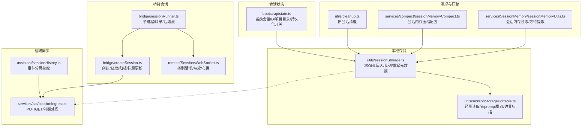
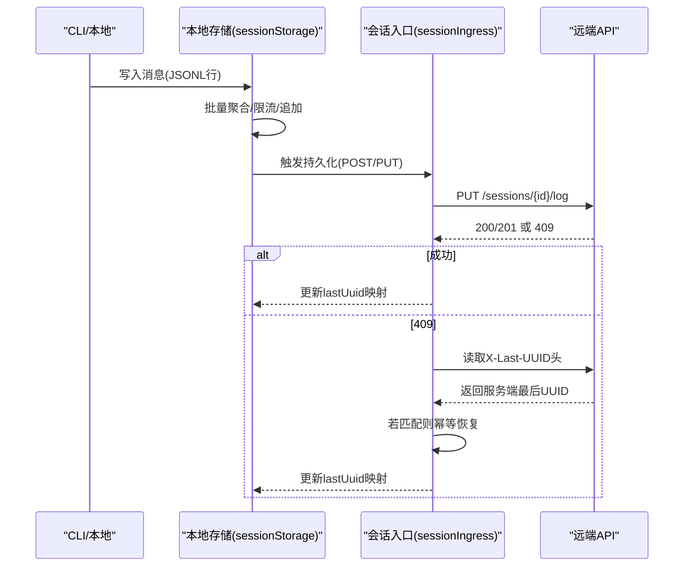
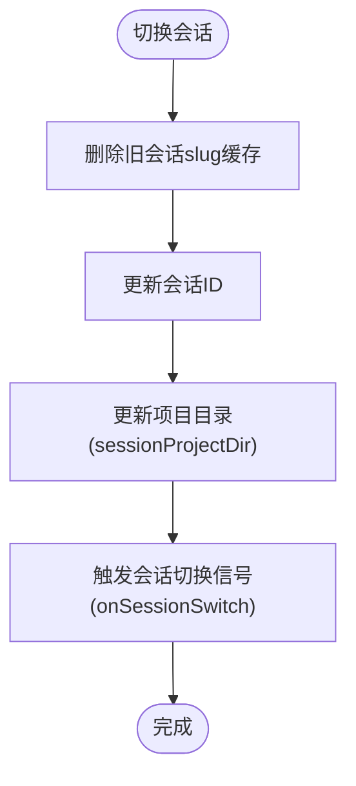
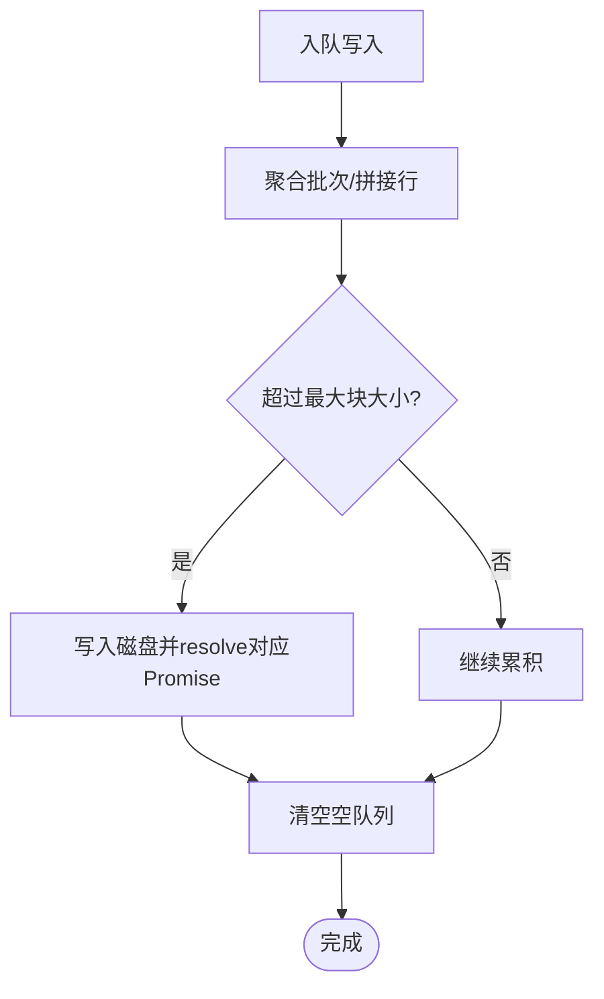
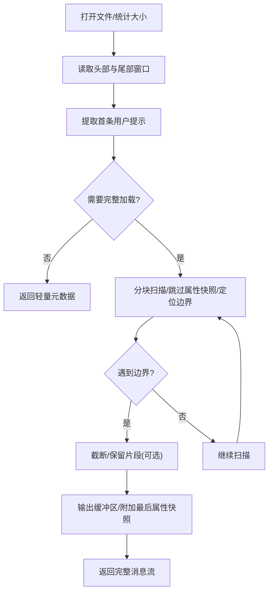
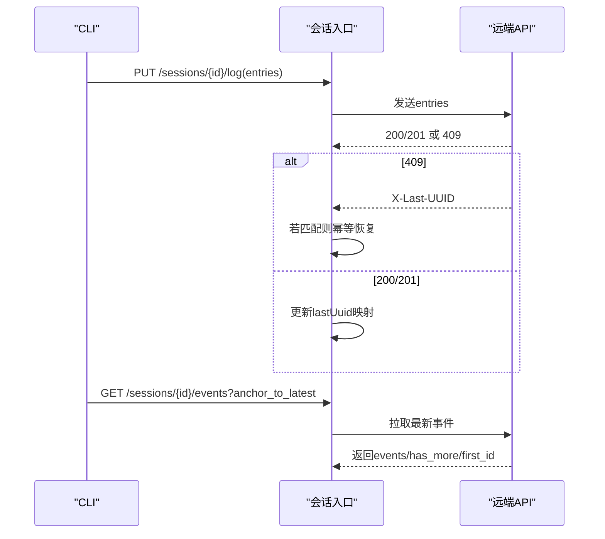
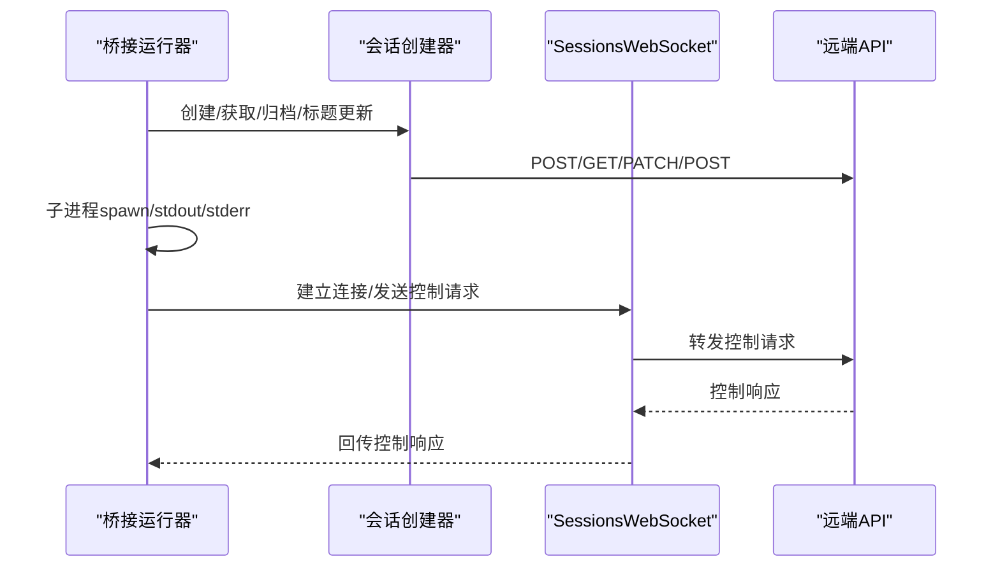
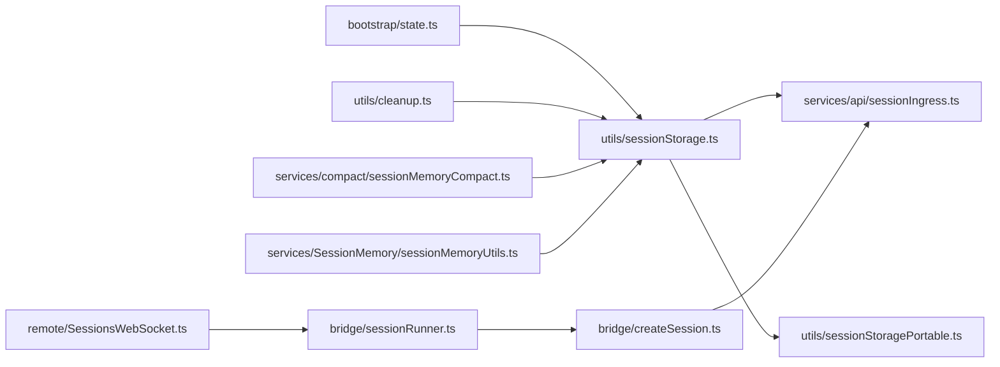

# 会话管理系统

<cite>
**本文引用的文件**
- [src/utils/sessionStorage.ts](file://src/utils/sessionStorage.ts)
- [src/utils/sessionStoragePortable.ts](file://src/utils/sessionStoragePortable.ts)
- [src/bootstrap/state.ts](file://src/bootstrap/state.ts)
- [src/assistant/sessionHistory.ts](file://src/assistant/sessionHistory.ts)
- [src/services/api/sessionIngress.ts](file://src/services/api/sessionIngress.ts)
- [src/bridge/createSession.ts](file://src/bridge/createSession.ts)
- [src/bridge/sessionRunner.ts](file://src/bridge/sessionRunner.ts)
- [src/utils/concurrentSessions.ts](file://src/utils/concurrentSessions.ts)
- [src/utils/cleanup.ts](file://src/utils/cleanup.ts)
- [src/services/compact/sessionMemoryCompact.ts](file://src/services/compact/sessionMemoryCompact.ts)
- [src/services/SessionMemory/sessionMemoryUtils.ts](file://src/services/SessionMemory/sessionMemoryUtils.ts)
- [src/remote/SessionsWebSocket.ts](file://src/remote/SessionsWebSocket.ts)
- [src/screens/REPL.tsx](file://src/screens/REPL.tsx)
</cite>

## 目录
1. [简介](#简介)
2. [项目结构](#项目结构)
3. [核心组件](#核心组件)
4. [架构总览](#架构总览)
5. [详细组件分析](#详细组件分析)
6. [依赖关系分析](#依赖关系分析)
7. [性能考量](#性能考量)
8. [故障排除指南](#故障排除指南)
9. [结论](#结论)
10. [附录](#附录)

## 简介
本文件面向Claude Code的会话管理系统，系统性阐述会话生命周期管理（创建、状态维护、历史记录存储、会话恢复）、JSONL日志持久化机制（append-only写入、崩溃恢复保障）、会话恢复流程（getLastSessionLog、parse JSONL解析、messages[]重建）、会话标识符体系（session-id生成、命名规则、跨设备同步），并提供最佳实践与故障排除方法。内容兼顾工程细节与可读性，适合不同背景的读者。

## 项目结构
会话管理涉及多模块协作：
- 会话标识与状态：通过全局状态模块维护当前会话ID、项目目录、持久化开关等。
- 本地存储：以JSONL格式按会话写入，支持轻量元数据读取与大文件分块扫描。
- 远端同步：通过会话入口API进行远端持久化与冲突处理。
- 桥接会话：在远程/桥接环境下创建、重连、标题同步。
- 清理与压缩：定期清理旧会话文件，内存型会话压缩配置与提取工具。
- 历史检索：按页拉取远端事件，支持最新与更早的历史翻页。

图表来源
- [src/bootstrap/state.ts](file://src/bootstrap/state.ts)
- [src/utils/sessionStorage.ts](file://src/utils/sessionStorage.ts)
- [src/utils/sessionStoragePortable.ts](file://src/utils/sessionStoragePortable.ts)
- [src/services/api/sessionIngress.ts](file://src/services/api/sessionIngress.ts)
- [src/assistant/sessionHistory.ts](file://src/assistant/sessionHistory.ts)
- [src/bridge/createSession.ts](file://src/bridge/createSession.ts)
- [src/bridge/sessionRunner.ts](file://src/bridge/sessionRunner.ts)
- [src/remote/SessionsWebSocket.ts](file://src/remote/SessionsWebSocket.ts)
- [src/utils/cleanup.ts](file://src/utils/cleanup.ts)
- [src/services/compact/sessionMemoryCompact.ts](file://src/services/compact/sessionMemoryCompact.ts)
- [src/services/SessionMemory/sessionMemoryUtils.ts](file://src/services/SessionMemory/sessionMemoryUtils.ts)

章节来源
- [src/bootstrap/state.ts](file://src/bootstrap/state.ts)
- [src/utils/sessionStorage.ts](file://src/utils/sessionStorage.ts)
- [src/utils/sessionStoragePortable.ts](file://src/utils/sessionStoragePortable.ts)
- [src/services/api/sessionIngress.ts](file://src/services/api/sessionIngress.ts)
- [src/assistant/sessionHistory.ts](file://src/assistant/sessionHistory.ts)
- [src/bridge/createSession.ts](file://src/bridge/createSession.ts)
- [src/bridge/sessionRunner.ts](file://src/bridge/sessionRunner.ts)
- [src/remote/SessionsWebSocket.ts](file://src/remote/SessionsWebSocket.ts)
- [src/utils/cleanup.ts](file://src/utils/cleanup.ts)
- [src/services/compact/sessionMemoryCompact.ts](file://src/services/compact/sessionMemoryCompact.ts)
- [src/services/SessionMemory/sessionMemoryUtils.ts](file://src/services/SessionMemory/sessionMemoryUtils.ts)

## 核心组件
- 会话标识与切换
  - 当前会话ID由全局状态模块生成并维护；支持原子性切换（同时更新会话ID与项目目录），避免漂移。
  - 提供父会话ID用于会话谱系追踪（如计划模式到执行模式）。
- 本地JSONL存储
  - 使用追加写入（append-only）策略，批量聚合写入，限制单次写入大小，确保崩溃后可安全续写。
  - 支持“轻量”元数据读取（仅尾部窗口）与“完整”加载（含压缩边界扫描）。
- 远端会话入口
  - PUT持久化带冲突检测与恢复；GET拉取历史事件；409场景下基于服务端最后UUID进行幂等恢复。
- 桥接会话
  - 创建/获取/归档远端会话；标题同步；子进程运行时转录与活动流；WebSocket控制请求/响应。
- 清理与压缩
  - 定期清理旧会话文件；会话内存压缩阈值配置；会话内存内容读取与提取等待。

章节来源
- [src/bootstrap/state.ts](file://src/bootstrap/state.ts)
- [src/utils/sessionStorage.ts](file://src/utils/sessionStorage.ts)
- [src/utils/sessionStoragePortable.ts](file://src/utils/sessionStoragePortable.ts)
- [src/services/api/sessionIngress.ts](file://src/services/api/sessionIngress.ts)
- [src/bridge/createSession.ts](file://src/bridge/createSession.ts)
- [src/bridge/sessionRunner.ts](file://src/bridge/sessionRunner.ts)
- [src/utils/cleanup.ts](file://src/utils/cleanup.ts)
- [src/services/compact/sessionMemoryCompact.ts](file://src/services/compact/sessionMemoryCompact.ts)
- [src/services/SessionMemory/sessionMemoryUtils.ts](file://src/services/SessionMemory/sessionMemoryUtils.ts)

## 架构总览
会话管理采用“本地JSONL + 远端会话入口”的双轨架构：
- 本地：高吞吐追加写入，轻量元数据缓存至文件尾部，便于快速加载与展示。
- 远端：通过会话入口API进行持久化与历史拉取，具备冲突检测与幂等恢复能力。
- 桥接：在远程/桥接环境创建会话，保持标题与元数据同步，并通过WebSocket进行控制交互。

图表来源
- [src/utils/sessionStorage.ts](file://src/utils/sessionStorage.ts)
- [src/services/api/sessionIngress.ts](file://src/services/api/sessionIngress.ts)

## 详细组件分析

### 组件A：会话标识与切换（bootstrap/state）
- 作用
  - 生成并持有当前会话ID；支持切换会话（同时更新会话ID与项目目录），防止路径漂移。
  - 提供持久化开关、项目根目录、父会话ID等会话级状态。
- 关键点
  - switchSession原子性更新，避免会话ID与项目目录不一致。
  - onSessionSwitch信号用于联动其他模块（如并发会话PID文件）。
- 会话命名与跨设备同步
  - 会话名称通过并发会话工具更新PID文件，实现列表去重与显示。
  - 桥接会话标题通过专门接口同步至远端。

图表来源
- [src/bootstrap/state.ts](file://src/bootstrap/state.ts)
- [src/utils/concurrentSessions.ts](file://src/utils/concurrentSessions.ts)
- [src/bridge/createSession.ts](file://src/bridge/createSession.ts)

章节来源
- [src/bootstrap/state.ts](file://src/bootstrap/state.ts)
- [src/utils/concurrentSessions.ts](file://src/utils/concurrentSessions.ts)
- [src/bridge/createSession.ts](file://src/bridge/createSession.ts)

### 组件B：本地JSONL存储与持久化（utils/sessionStorage）
- 作用
  - 负责会话JSONL文件的追加写入、批量聚合、错误重试与目录自动创建。
  - 在退出或清理阶段，将关键元数据（标题、标签、最后提示等）重新追加到文件尾部，确保轻量读取能命中。
- 关键流程
  - 写入队列：按文件分组排队，达到阈值或定时器触发时批量写入。
  - 追加写入：失败时自动创建目录并重试。
  - 元数据重追加：在compaction前后与退出阶段，刷新并重写尾部元数据，避免被压缩或清理挤出。
- 崩溃恢复保障
  - 单次写入限制大小，避免部分写入导致的不一致。
  - 尾部元数据重追加，即使中间段被压缩或清理，也能从尾部窗口读取最新状态。

图表来源
- [src/utils/sessionStorage.ts](file://src/utils/sessionStorage.ts)

章节来源
- [src/utils/sessionStorage.ts](file://src/utils/sessionStorage.ts)

### 组件C：轻量读取与完整加载（utils/sessionStoragePortable）
- 作用
  - 提供“轻量”读取：只读取文件头部与尾部固定大小窗口，用于快速提取首条用户提示、标题、标签等。
  - 提供“完整”加载：对超大文件进行分块扫描，跳过属性快照、定位压缩边界，必要时截断并保留特定片段。
- 关键点
  - 首条用户提示提取：跳过系统/通知/命令等非用户输入，限定长度。
  - 边界扫描：识别压缩边界标记，决定是否截断与保留片段。
  - 路径与项目目录发现：支持长路径哈希回退与工作树回溯。

图表来源
- [src/utils/sessionStoragePortable.ts](file://src/utils/sessionStoragePortable.ts)

章节来源
- [src/utils/sessionStoragePortable.ts](file://src/utils/sessionStoragePortable.ts)

### 组件D：远端会话入口与历史拉取（services/api/sessionIngress, assistant/sessionHistory）
- 会话入口
  - PUT持久化：带lastUuid映射，若服务端返回409且匹配服务端最后UUID，则幂等恢复。
  - GET历史：按页拉取事件，支持anchor_to_latest与before_id翻页。
- 历史拉取
  - 分页参数与返回结构标准化，统一错误处理与诊断日志。

图表来源
- [src/services/api/sessionIngress.ts](file://src/services/api/sessionIngress.ts)
- [src/assistant/sessionHistory.ts](file://src/assistant/sessionHistory.ts)

章节来源
- [src/services/api/sessionIngress.ts](file://src/services/api/sessionIngress.ts)
- [src/assistant/sessionHistory.ts](file://src/assistant/sessionHistory.ts)

### 组件E：桥接会话生命周期（bridge/createSession, bridge/sessionRunner, remote/SessionsWebSocket）
- 会话创建/获取/归档/标题更新
  - 通过HTTP接口创建/获取/归档远端会话，标题同步至远端。
- 子进程运行与转录
  - 子进程以流式JSON格式通信，stdout解析为活动流，stderr收集诊断信息；可写入转录文件。
- WebSocket控制
  - 发送/接收控制请求与响应，心跳保活，异常关闭时重连与状态恢复。

图表来源
- [src/bridge/createSession.ts](file://src/bridge/createSession.ts)
- [src/bridge/sessionRunner.ts](file://src/bridge/sessionRunner.ts)
- [src/remote/SessionsWebSocket.ts](file://src/remote/SessionsWebSocket.ts)

章节来源
- [src/bridge/createSession.ts](file://src/bridge/createSession.ts)
- [src/bridge/sessionRunner.ts](file://src/bridge/sessionRunner.ts)
- [src/remote/SessionsWebSocket.ts](file://src/remote/SessionsWebSocket.ts)

### 组件F：清理与压缩（utils/cleanup, services/compact/sessionMemoryCompact, services/SessionMemory/sessionMemoryUtils）
- 旧会话清理
  - 基于截止时间扫描项目目录，删除过期文件并尝试清理空目录。
- 会话内存压缩
  - 配置最小/最大保留令牌数与最少文本块消息数，支持重置与远程初始化。
- 会话内存读取
  - 提供等待提取完成与读取内存内容的工具方法。

章节来源
- [src/utils/cleanup.ts](file://src/utils/cleanup.ts)
- [src/services/compact/sessionMemoryCompact.ts](file://src/services/compact/sessionMemoryCompact.ts)
- [src/services/SessionMemory/sessionMemoryUtils.ts](file://src/services/SessionMemory/sessionMemoryUtils.ts)

## 依赖关系分析
- 低耦合高内聚
  - 本地存储与远端API通过会话入口解耦；桥接层独立于核心会话逻辑。
- 关键依赖链
  - bootstrap/state ← utils/sessionStorage（会话ID/项目目录）
  - utils/sessionStorage ← utils/sessionStoragePortable（轻量/完整读取）
  - utils/sessionStorage ← services/api/sessionIngress（持久化/冲突恢复）
  - bridge/createSession ← services/api/sessionIngress（创建/归档/标题）
  - bridge/sessionRunner ← bridge/createSession（子进程/转录）
  - remote/SessionsWebSocket ← bridge/sessionRunner（控制交互）

图表来源
- [src/bootstrap/state.ts](file://src/bootstrap/state.ts)
- [src/utils/sessionStorage.ts](file://src/utils/sessionStorage.ts)
- [src/utils/sessionStoragePortable.ts](file://src/utils/sessionStoragePortable.ts)
- [src/services/api/sessionIngress.ts](file://src/services/api/sessionIngress.ts)
- [src/bridge/createSession.ts](file://src/bridge/createSession.ts)
- [src/bridge/sessionRunner.ts](file://src/bridge/sessionRunner.ts)
- [src/remote/SessionsWebSocket.ts](file://src/remote/SessionsWebSocket.ts)
- [src/utils/cleanup.ts](file://src/utils/cleanup.ts)
- [src/services/compact/sessionMemoryCompact.ts](file://src/services/compact/sessionMemoryCompact.ts)
- [src/services/SessionMemory/sessionMemoryUtils.ts](file://src/services/SessionMemory/sessionMemoryUtils.ts)

## 性能考量
- 写入性能
  - 批量聚合与限流写入，减少磁盘I/O次数；单次写入大小上限避免超大事务。
  - 失败自动创建目录，降低外部错误影响。
- 读取性能
  - 轻量读取仅扫描尾部窗口，快速提取标题/标签/首提示；完整加载使用分块扫描与边界跳过。
  - 缓存与记忆化（如消息UUID集合）减少重复读取。
- 远端同步
  - 幂等恢复减少重试成本；分页拉取避免一次性传输过大。
- 内存与存储
  - 会话内存压缩配置控制保留规模；定期清理旧会话文件释放空间。

[本节为通用指导，无需具体文件分析]

## 故障排除指南
- 本地写入失败
  - 现象：写入抛错或目录不存在。
  - 排查：检查权限、磁盘空间；确认自动创建目录逻辑是否生效。
  - 参考
    - [src/utils/sessionStorage.ts](file://src/utils/sessionStorage.ts)
- 409冲突与幂等恢复
  - 现象：PUT返回409但实际已存在。
  - 排查：读取X-Last-UUID头，确认是否匹配；若匹配则幂等恢复。
  - 参考
    - [src/services/api/sessionIngress.ts](file://src/services/api/sessionIngress.ts)
- 会话恢复不完整
  - 现象：messages[]重建缺失或顺序异常。
  - 排查：确认边界扫描与属性快照处理；检查压缩边界标记与保留片段。
  - 参考
    - [src/utils/sessionStoragePortable.ts](file://src/utils/sessionStoragePortable.ts)
- 桥接会话标题不同步
  - 现象：本地标题更新但远端未同步。
  - 排查：调用标题更新接口并确认组织UUID与访问令牌正确。
  - 参考
    - [src/bridge/createSession.ts](file://src/bridge/createSession.ts)
- 旧会话未清理
  - 现象：磁盘占用持续增长。
  - 排查：检查清理截止时间与扫描逻辑；确认空目录清理。
  - 参考
    - [src/utils/cleanup.ts](file://src/utils/cleanup.ts)

章节来源
- [src/utils/sessionStorage.ts](file://src/utils/sessionStorage.ts)
- [src/services/api/sessionIngress.ts](file://src/services/api/sessionIngress.ts)
- [src/utils/sessionStoragePortable.ts](file://src/utils/sessionStoragePortable.ts)
- [src/bridge/createSession.ts](file://src/bridge/createSession.ts)
- [src/utils/cleanup.ts](file://src/utils/cleanup.ts)

## 结论
Claude Code的会话管理系统通过“本地JSONL + 远端会话入口”的双轨设计，在保证高吞吐写入与崩溃恢复的同时，提供了完善的会话恢复、跨设备同步与清理压缩能力。其模块化架构与清晰的依赖关系使得扩展与维护更为稳健。建议在生产环境中结合本文最佳实践与故障排除方法，确保会话数据的可靠性与性能表现。

[本节为总结，无需具体文件分析]

## 附录
- 会话恢复流程要点
  - 轻量元数据优先：利用尾部窗口快速提取标题/标签/首提示。
  - 完整加载：分块扫描、跳过属性快照、定位压缩边界、必要时截断并保留片段。
  - 元数据重追加：在压缩/退出阶段将关键元数据写回尾部，确保可读性。
- 最佳实践
  - 写入：启用批量聚合与限流；避免单条超大消息；确保目录权限。
  - 恢复：优先使用轻量读取；完整加载时关注边界与属性快照。
  - 同步：桥接会话保持标题与元数据同步；远端历史按需分页拉取。
  - 清理：定期清理旧会话文件；合理设置压缩阈值与保留策略。
- 相关实现参考
  - [src/utils/sessionStorage.ts](file://src/utils/sessionStorage.ts)
  - [src/utils/sessionStoragePortable.ts](file://src/utils/sessionStoragePortable.ts)
  - [src/services/api/sessionIngress.ts](file://src/services/api/sessionIngress.ts)
  - [src/assistant/sessionHistory.ts](file://src/assistant/sessionHistory.ts)
  - [src/bridge/createSession.ts](file://src/bridge/createSession.ts)
  - [src/bridge/sessionRunner.ts](file://src/bridge/sessionRunner.ts)
  - [src/remote/SessionsWebSocket.ts](file://src/remote/SessionsWebSocket.ts)
  - [src/utils/cleanup.ts](file://src/utils/cleanup.ts)
  - [src/services/compact/sessionMemoryCompact.ts](file://src/services/compact/sessionMemoryCompact.ts)
  - [src/services/SessionMemory/sessionMemoryUtils.ts](file://src/services/SessionMemory/sessionMemoryUtils.ts)
  - [src/screens/REPL.tsx](file://src/screens/REPL.tsx)